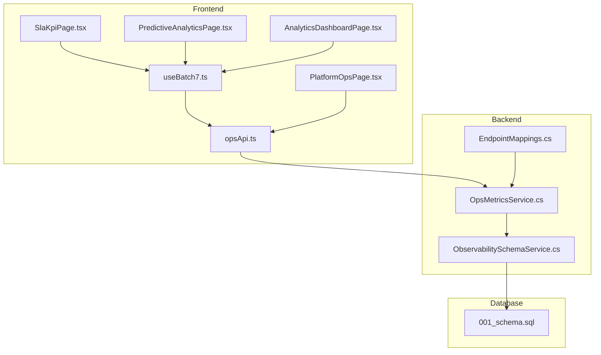
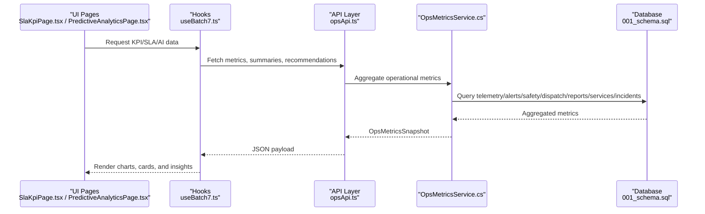
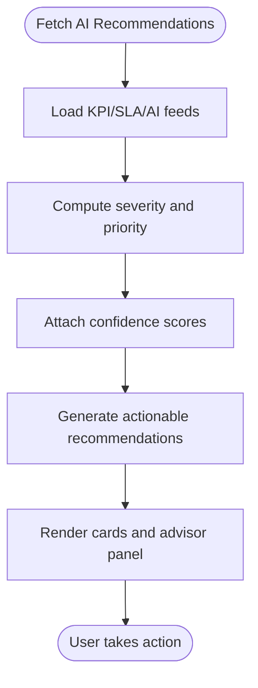
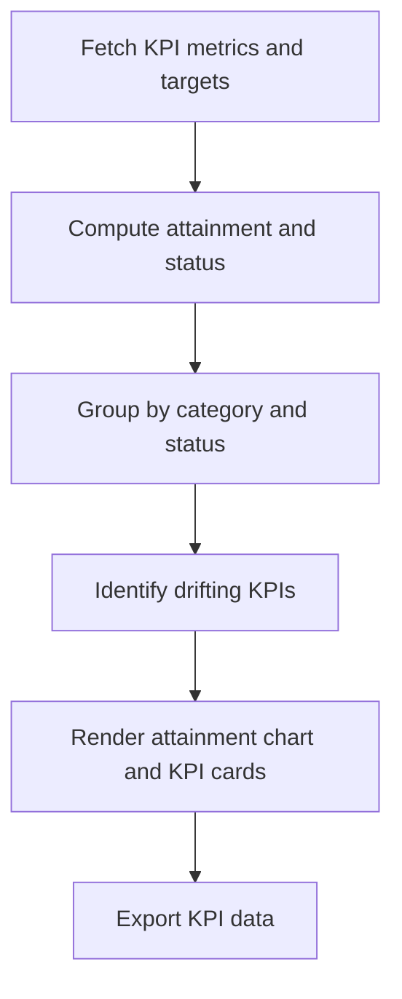
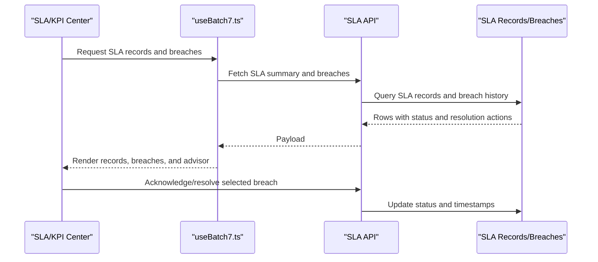
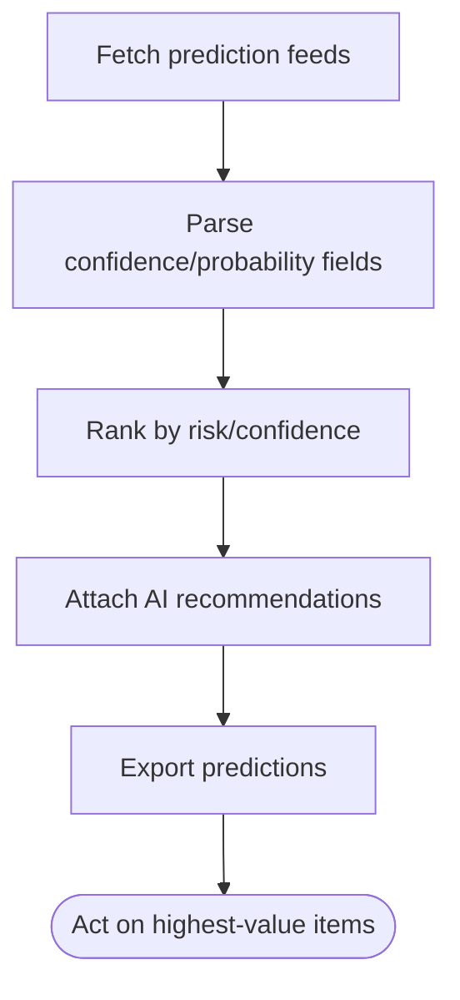
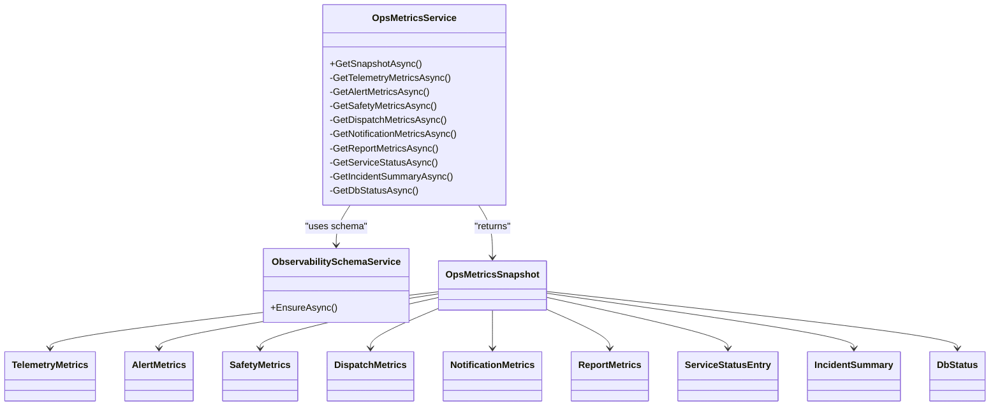
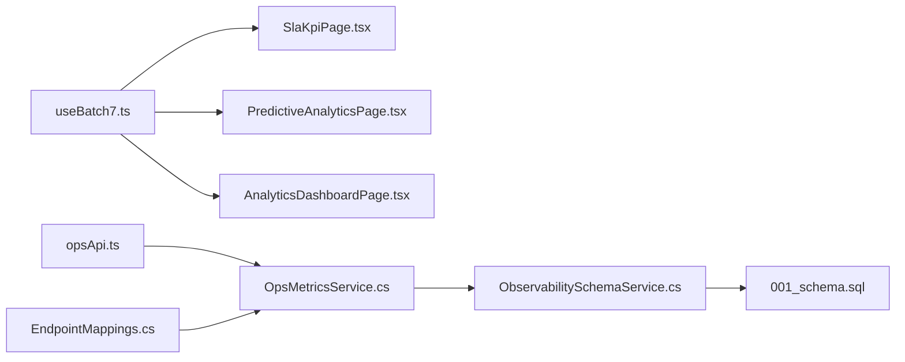

# Analytics & Insights Entities

<cite>
**Referenced Files in This Document**
- [SlaKpiPage.tsx](file://frontend/src/pages/SlaKpiPage.tsx)
- [PredictiveAnalyticsPage.tsx](file://frontend/src/pages/PredictiveAnalyticsPage.tsx)
- [AnalyticsDashboardPage.tsx](file://frontend/src/pages/AnalyticsDashboardPage.tsx)
- [useBatch7.ts](file://frontend/src/hooks/useBatch7.ts)
- [opsApi.ts](file://frontend/src/services/opsApi.ts)
- [PlatformOpsPage.tsx](file://frontend/src/pages/PlatformOpsPage.tsx)
- [OpsMetricsService.cs](file://backend-dotnet/Services/OpsMetricsService.cs)
- [ObservabilitySchemaService.cs](file://backend-dotnet/Services/ObservabilitySchemaService.cs)
- [EndpointMappings.cs](file://backend-dotnet/Controllers/EndpointMappings.cs)
- [001_schema.sql](file://db/init/001_schema.sql)
</cite>

## Table of Contents
1. [Introduction](#introduction)
2. [Project Structure](#project-structure)
3. [Core Components](#core-components)
4. [Architecture Overview](#architecture-overview)
5. [Detailed Component Analysis](#detailed-component-analysis)
6. [Dependency Analysis](#dependency-analysis)
7. [Performance Considerations](#performance-considerations)
8. [Troubleshooting Guide](#troubleshooting-guide)
9. [Conclusion](#conclusion)

## Introduction
This document explains the analytics and insights entities powering AI-driven operations at the platform. It covers:
- AI-powered insights generation with severity scoring and action prioritization
- Recommendation engine with confidence scores and implementation tracking
- KPI monitoring with trend analysis and performance metrics
- SLA tracking with customer satisfaction measurement and breach detection
- Operational event logging for system monitoring, audit trails, and performance optimization insights

The system integrates frontend dashboards and hooks with backend services and persistence to deliver real-time, actionable intelligence.

## Project Structure
The analytics and insights capabilities span frontend pages and hooks, backend services, and database schema:
- Frontend pages for SLA/KPI center, predictive analytics, and executive analytics
- Hooks orchestrating data fetching and mutations for KPIs, SLAs, and AI recommendations
- Backend services aggregating operational metrics and managing observability schema
- Database schema supporting service run history, heartbeats, and platform incidents

**Diagram sources**
- [SlaKpiPage.tsx:139-361](file://frontend/src/pages/SlaKpiPage.tsx#L139-L361)
- [PredictiveAnalyticsPage.tsx:159-490](file://frontend/src/pages/PredictiveAnalyticsPage.tsx#L159-L490)
- [AnalyticsDashboardPage.tsx:357-403](file://frontend/src/pages/AnalyticsDashboardPage.tsx#L357-L403)
- [useBatch7.ts:63-100](file://frontend/src/hooks/useBatch7.ts#L63-L100)
- [opsApi.ts:161-188](file://frontend/src/services/opsApi.ts#L161-L188)
- [PlatformOpsPage.tsx:436-465](file://frontend/src/pages/PlatformOpsPage.tsx#L436-L465)
- [OpsMetricsService.cs:13-264](file://backend-dotnet/Services/OpsMetricsService.cs#L13-L264)
- [ObservabilitySchemaService.cs:16-92](file://backend-dotnet/Services/ObservabilitySchemaService.cs#L16-L92)
- [EndpointMappings.cs:6035-6046](file://backend-dotnet/Controllers/EndpointMappings.cs#L6035-L6046)
- [001_schema.sql](file://db/init/001_schema.sql)

**Section sources**
- [SlaKpiPage.tsx:139-361](file://frontend/src/pages/SlaKpiPage.tsx#L139-L361)
- [PredictiveAnalyticsPage.tsx:159-490](file://frontend/src/pages/PredictiveAnalyticsPage.tsx#L159-L490)
- [AnalyticsDashboardPage.tsx:357-403](file://frontend/src/pages/AnalyticsDashboardPage.tsx#L357-L403)
- [useBatch7.ts:63-100](file://frontend/src/hooks/useBatch7.ts#L63-L100)
- [opsApi.ts:161-188](file://frontend/src/services/opsApi.ts#L161-L188)
- [PlatformOpsPage.tsx:436-465](file://frontend/src/pages/PlatformOpsPage.tsx#L436-L465)
- [OpsMetricsService.cs:13-264](file://backend-dotnet/Services/OpsMetricsService.cs#L13-L264)
- [ObservabilitySchemaService.cs:16-92](file://backend-dotnet/Services/ObservabilitySchemaService.cs#L16-L92)
- [EndpointMappings.cs:6035-6046](file://backend-dotnet/Controllers/EndpointMappings.cs#L6035-L6046)
- [001_schema.sql](file://db/init/001_schema.sql)

## Core Components
- SLA/KPI Center: Displays KPI attainment, SLA records, breaches, and AI recommendations with severity and confidence.
- Predictive Analytics: Presents maintenance, driver safety, and SLA risk predictions with confidence percentages and AI recommendations.
- Executive Analytics: Provides aggregated KPIs and insights with severity badges and trend indicators.
- Operational Metrics: Live snapshot of telemetry, alerts, safety, dispatch, notifications, reports, services, incidents, and database health.
- Observability Schema: Defines tables for service run history, heartbeats, and platform incidents.

**Section sources**
- [SlaKpiPage.tsx:139-361](file://frontend/src/pages/SlaKpiPage.tsx#L139-L361)
- [PredictiveAnalyticsPage.tsx:159-490](file://frontend/src/pages/PredictiveAnalyticsPage.tsx#L159-L490)
- [AnalyticsDashboardPage.tsx:98-315](file://frontend/src/pages/AnalyticsDashboardPage.tsx#L98-L315)
- [opsApi.ts:161-188](file://frontend/src/services/opsApi.ts#L161-L188)
- [OpsMetricsService.cs:13-264](file://backend-dotnet/Services/OpsMetricsService.cs#L13-L264)
- [ObservabilitySchemaService.cs:16-92](file://backend-dotnet/Services/ObservabilitySchemaService.cs#L16-L92)

## Architecture Overview
The analytics and insights architecture connects frontend dashboards to backend services and database persistence. The backend aggregates metrics and maintains observability tables, while the frontend consumes APIs and displays actionable insights.

**Diagram sources**
- [SlaKpiPage.tsx:139-361](file://frontend/src/pages/SlaKpiPage.tsx#L139-L361)
- [PredictiveAnalyticsPage.tsx:159-490](file://frontend/src/pages/PredictiveAnalyticsPage.tsx#L159-L490)
- [useBatch7.ts:63-100](file://frontend/src/hooks/useBatch7.ts#L63-L100)
- [opsApi.ts:161-188](file://frontend/src/services/opsApi.ts#L161-L188)
- [OpsMetricsService.cs:13-264](file://backend-dotnet/Services/OpsMetricsService.cs#L13-L264)
- [001_schema.sql](file://db/init/001_schema.sql)

## Detailed Component Analysis

### AI-Generated Insights and Recommendations
- Severity scoring and prioritization: Insights are labeled with severity badges (critical, warning, positive, info) and presented with prioritized actions.
- Confidence scores: Predictive analytics surfaces confidence percentages for maintenance and SLA risk predictions.
- Actionable recommendations: AI recommendations accompany each insight with suggested actions and impact estimates.

**Diagram sources**
- [AnalyticsDashboardPage.tsx:319-343](file://frontend/src/pages/AnalyticsDashboardPage.tsx#L319-L343)
- [PredictiveAnalyticsPage.tsx:159-490](file://frontend/src/pages/PredictiveAnalyticsPage.tsx#L159-L490)
- [SlaKpiPage.tsx:335-357](file://frontend/src/pages/SlaKpiPage.tsx#L335-L357)

**Section sources**
- [AnalyticsDashboardPage.tsx:319-343](file://frontend/src/pages/AnalyticsDashboardPage.tsx#L319-L343)
- [PredictiveAnalyticsPage.tsx:159-490](file://frontend/src/pages/PredictiveAnalyticsPage.tsx#L159-L490)
- [SlaKpiPage.tsx:335-357](file://frontend/src/pages/SlaKpiPage.tsx#L335-L357)

### KPI Monitoring and Trend Analysis
- KPI dashboard: Displays attainment vs targets with status badges and trend icons.
- Targets and drift: Summaries compute totals, on-target, at-risk, and critical counts; “drifting” KPIs highlight top risks by category.
- Trend visualization: Bar charts compare actual vs target attainment and highlight critical thresholds.

**Diagram sources**
- [SlaKpiPage.tsx:139-361](file://frontend/src/pages/SlaKpiPage.tsx#L139-L361)
- [EndpointMappings.cs:6035-6046](file://backend-dotnet/Controllers/EndpointMappings.cs#L6035-L6046)

**Section sources**
- [SlaKpiPage.tsx:139-361](file://frontend/src/pages/SlaKpiPage.tsx#L139-L361)
- [EndpointMappings.cs:6035-6046](file://backend-dotnet/Controllers/EndpointMappings.cs#L6035-L6046)

### SLA Tracking and Breach Detection
- SLA records: Lists SLA types, targets, actuals, and statuses with customer context.
- Breach lifecycle: Tracks open, acknowledged, and resolved breaches with detection timestamps and resolution actions.
- AI advisor: Provides prioritized recommendations with scores and action labels.

**Diagram sources**
- [SlaKpiPage.tsx:139-361](file://frontend/src/pages/SlaKpiPage.tsx#L139-L361)
- [useBatch7.ts:77-99](file://frontend/src/hooks/useBatch7.ts#L77-L99)

**Section sources**
- [SlaKpiPage.tsx:139-361](file://frontend/src/pages/SlaKpiPage.tsx#L139-L361)
- [useBatch7.ts:77-99](file://frontend/src/hooks/useBatch7.ts#L77-L99)

### Predictive Analytics Engine
- Feeds: Maintenance predictions, driver safety risk, and SLA breach risk.
- Confidence and risk: Confidence percentages for maintenance; probability-based risk for SLA; trend deltas for driver safety.
- Recommendations: AI suggestions with revenue impact and actionable steps.

**Diagram sources**
- [PredictiveAnalyticsPage.tsx:159-490](file://frontend/src/pages/PredictiveAnalyticsPage.tsx#L159-L490)

**Section sources**
- [PredictiveAnalyticsPage.tsx:159-490](file://frontend/src/pages/PredictiveAnalyticsPage.tsx#L159-L490)

### Operational Metrics and Observability
- Live metrics: Telemetry acceptance/rejection/auth failures, alert volumes, safety events, dispatch activity, notifications, scheduled reports, and database health.
- Service run tracking: Append-only history and periodic heartbeats capture service status, errors, and consecutive failures.
- Platform incidents: Auto-created when services exceed failure thresholds, enabling triage and remediation.

**Diagram sources**
- [OpsMetricsService.cs:13-264](file://backend-dotnet/Services/OpsMetricsService.cs#L13-L264)
- [ObservabilitySchemaService.cs:16-92](file://backend-dotnet/Services/ObservabilitySchemaService.cs#L16-L92)

**Section sources**
- [opsApi.ts:161-188](file://frontend/src/services/opsApi.ts#L161-L188)
- [PlatformOpsPage.tsx:436-465](file://frontend/src/pages/PlatformOpsPage.tsx#L436-L465)
- [OpsMetricsService.cs:13-264](file://backend-dotnet/Services/OpsMetricsService.cs#L13-L264)
- [ObservabilitySchemaService.cs:16-92](file://backend-dotnet/Services/ObservabilitySchemaService.cs#L16-L92)

## Dependency Analysis
- Frontend depends on hooks for data orchestration and services for API calls.
- Hooks depend on backend endpoints for KPI, SLA, and AI recommendation data.
- Backend services depend on database schema for metrics aggregation and observability storage.
- Observability schema underpins service run history and platform incidents.

**Diagram sources**
- [useBatch7.ts:63-100](file://frontend/src/hooks/useBatch7.ts#L63-L100)
- [SlaKpiPage.tsx:139-361](file://frontend/src/pages/SlaKpiPage.tsx#L139-L361)
- [PredictiveAnalyticsPage.tsx:159-490](file://frontend/src/pages/PredictiveAnalyticsPage.tsx#L159-L490)
- [AnalyticsDashboardPage.tsx:357-403](file://frontend/src/pages/AnalyticsDashboardPage.tsx#L357-L403)
- [opsApi.ts:161-188](file://frontend/src/services/opsApi.ts#L161-L188)
- [OpsMetricsService.cs:13-264](file://backend-dotnet/Services/OpsMetricsService.cs#L13-L264)
- [ObservabilitySchemaService.cs:16-92](file://backend-dotnet/Services/ObservabilitySchemaService.cs#L16-L92)
- [EndpointMappings.cs:6035-6046](file://backend-dotnet/Controllers/EndpointMappings.cs#L6035-L6046)
- [001_schema.sql](file://db/init/001_schema.sql)

**Section sources**
- [useBatch7.ts:63-100](file://frontend/src/hooks/useBatch7.ts#L63-L100)
- [opsApi.ts:161-188](file://frontend/src/services/opsApi.ts#L161-L188)
- [OpsMetricsService.cs:13-264](file://backend-dotnet/Services/OpsMetricsService.cs#L13-L264)
- [ObservabilitySchemaService.cs:16-92](file://backend-dotnet/Services/ObservabilitySchemaService.cs#L16-L92)
- [EndpointMappings.cs:6035-6046](file://backend-dotnet/Controllers/EndpointMappings.cs#L6035-L6046)
- [001_schema.sql](file://db/init/001_schema.sql)

## Performance Considerations
- Parallel metric aggregation: Backend services execute multiple queries concurrently to minimize latency.
- Stale-time caching: Frontend queries leverage staleTime to balance freshness and performance.
- Indexes on observability tables: Service run history and platform incidents include strategic indexes for fast filtering and reporting.
- Export capabilities: Built-in CSV exports enable efficient downstream analysis and archival.

[No sources needed since this section provides general guidance]

## Troubleshooting Guide
- Missing backend data: Seed fallbacks ensure dashboards remain usable when backend endpoints are unavailable.
- Service failures: Consecutive failures tracked in heartbeats trigger platform incidents for automatic triage.
- Incident lifecycle: Open, investigating, mitigated, and resolved states support coordinated remediation.
- Acknowledge/resolve SLA breaches: Dedicated mutations update status and invalidate caches for immediate UI refresh.

**Section sources**
- [SlaKpiPage.tsx:152-158](file://frontend/src/pages/SlaKpiPage.tsx#L152-L158)
- [useBatch7.ts:86-99](file://frontend/src/hooks/useBatch7.ts#L86-L99)
- [ObservabilitySchemaService.cs:16-92](file://backend-dotnet/Services/ObservabilitySchemaService.cs#L16-L92)
- [OpsMetricsService.cs:164-180](file://backend-dotnet/Services/OpsMetricsService.cs#L164-L180)

## Conclusion
The analytics and insights system combines frontend dashboards with backend metrics aggregation and robust observability schema to deliver AI-powered, prioritized recommendations across KPIs, SLAs, and operational health. Severity scoring, confidence-based ranking, and actionable recommendations streamline decision-making, while live metrics and incident tracking support continuous monitoring and rapid remediation.