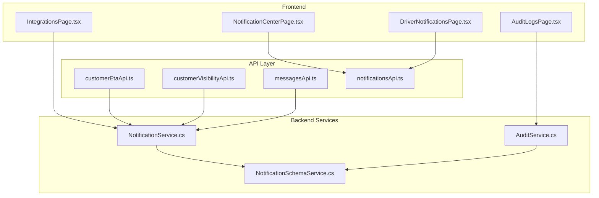
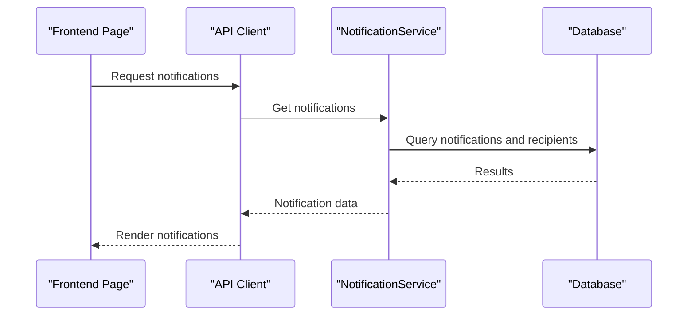
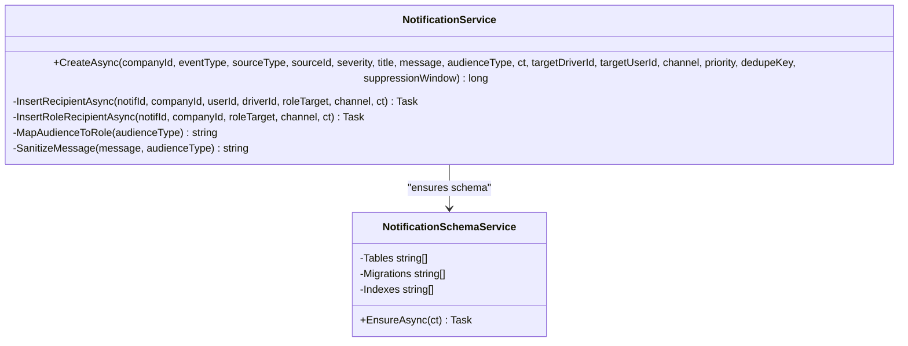
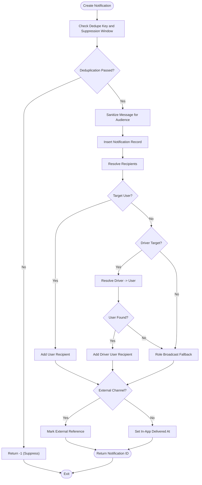
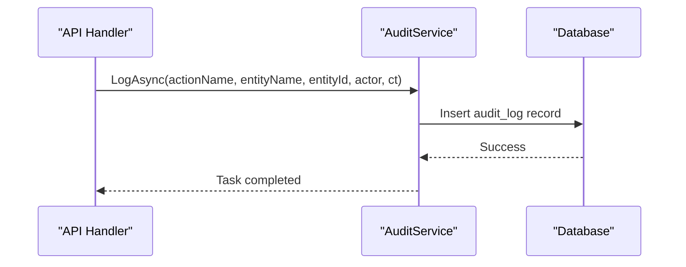
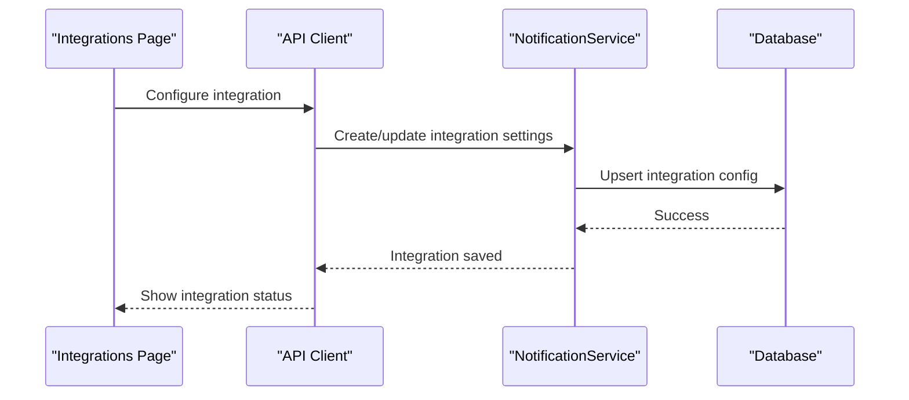
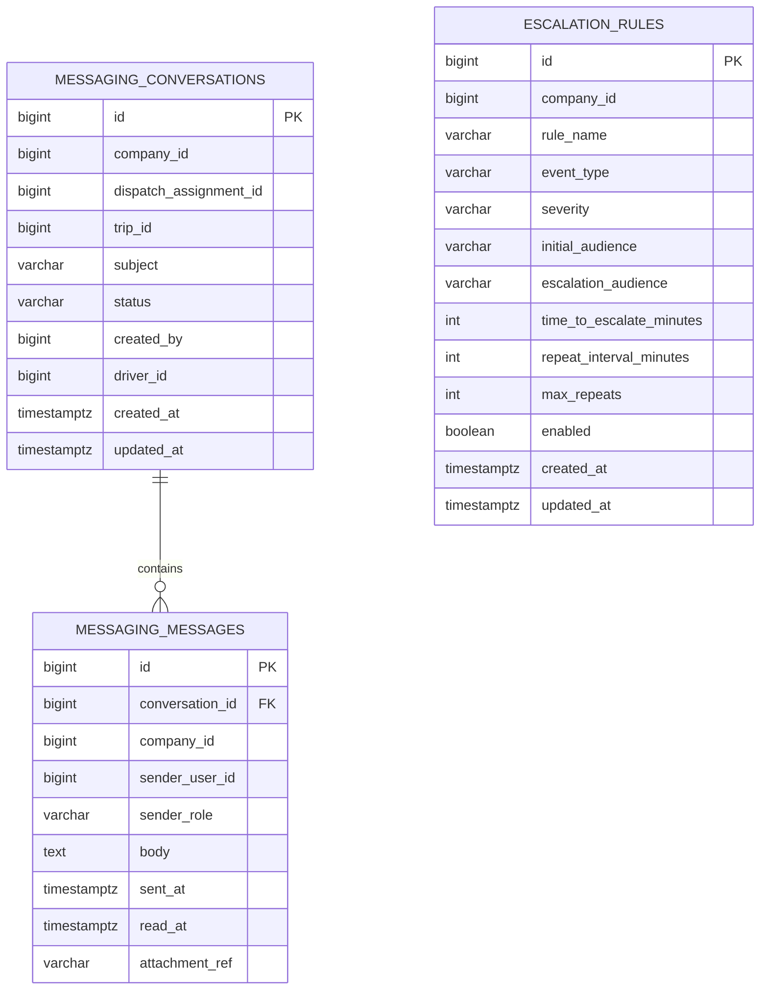
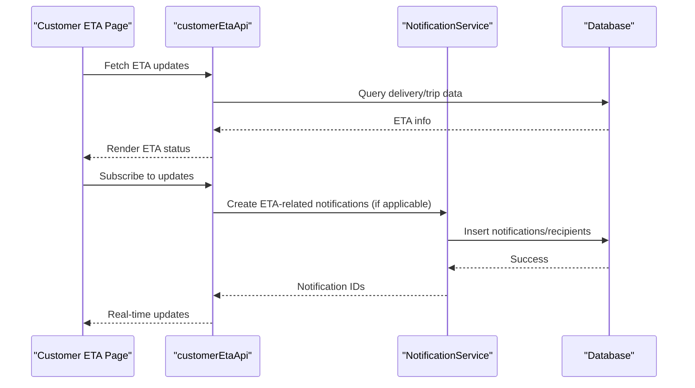
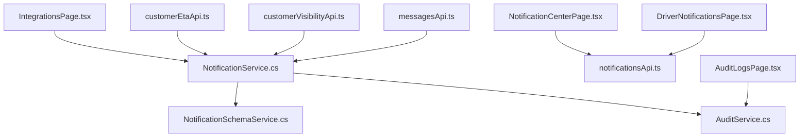

# Communication & Integration Entities

<cite>
**Referenced Files in This Document**
- [NotificationService.cs](file://backend-dotnet/Services/NotificationService.cs)
- [NotificationSchemaService.cs](file://backend-dotnet/Services/NotificationSchemaService.cs)
- [AuditService.cs](file://backend-dotnet/Services/AuditService.cs)
- [NotificationTests.cs](file://backend-dotnet.Tests/NotificationTests.cs)
- [NotificationCenterPage.tsx](file://frontend/src/pages/NotificationCenterPage.tsx)
- [DriverNotificationsPage.tsx](file://frontend/src/pages/driver/DriverNotificationsPage.tsx)
- [AuditLogsPage.tsx](file://frontend/src/pages/AuditLogsPage.tsx)
- [IntegrationsPage.tsx](file://frontend/src/pages/IntegrationsPage.tsx)
- [customerEtaApi.ts](file://frontend/src/services/customerEtaApi.ts)
- [customerVisibilityApi.ts](file://frontend/src/services/customerVisibilityApi.ts)
- [messagesApi.ts](file://frontend/src/services/messagesApi.ts)
- [notificationsApi.ts](file://frontend/src/services/notificationsApi.ts)
</cite>

## Table of Contents
1. [Introduction](#introduction)
2. [Project Structure](#project-structure)
3. [Core Components](#core-components)
4. [Architecture Overview](#architecture-overview)
5. [Detailed Component Analysis](#detailed-component-analysis)
6. [Dependency Analysis](#dependency-analysis)
7. [Performance Considerations](#performance-considerations)
8. [Troubleshooting Guide](#troubleshooting-guide)
9. [Conclusion](#conclusion)

## Introduction
This document provides comprehensive documentation for communication and integration entities within the platform, focusing on notifications, audit logs, integrations, customer communications, and ETA updates. It explains the notification system with delivery channels, priority levels, and delivery tracking; covers audit logging with change tracking and compliance reporting; details integration management with external system connectivity; describes customer communication tracking with multi-channel messaging; and outlines ETA tracking with customer visibility and delivery updates.

## Project Structure
The communication and integration capabilities span backend services, database schemas, and frontend pages/services:
- Backend services handle notification creation, escalation, messaging, and audit logging.
- Database schemas define tables for notifications, recipients, messaging, escalations, and audit logs.
- Frontend pages provide user interfaces for viewing notifications, audit logs, integrations, and customer communications.
- APIs connect frontend components to backend services for data retrieval and updates.

**Diagram sources**
- [NotificationService.cs:1-184](file://backend-dotnet/Services/NotificationService.cs#L1-L184)
- [NotificationSchemaService.cs:1-138](file://backend-dotnet/Services/NotificationSchemaService.cs#L1-L138)
- [AuditService.cs:1-48](file://backend-dotnet/Services/AuditService.cs#L1-L48)
- [NotificationCenterPage.tsx](file://frontend/src/pages/NotificationCenterPage.tsx)
- [DriverNotificationsPage.tsx](file://frontend/src/pages/driver/DriverNotificationsPage.tsx)
- [AuditLogsPage.tsx](file://frontend/src/pages/AuditLogsPage.tsx)
- [IntegrationsPage.tsx](file://frontend/src/pages/IntegrationsPage.tsx)
- [customerEtaApi.ts](file://frontend/src/services/customerEtaApi.ts)
- [customerVisibilityApi.ts](file://frontend/src/services/customerVisibilityApi.ts)
- [messagesApi.ts](file://frontend/src/services/messagesApi.ts)
- [notificationsApi.ts](file://frontend/src/services/notificationsApi.ts)

**Section sources**
- [NotificationService.cs:1-184](file://backend-dotnet/Services/NotificationService.cs#L1-L184)
- [NotificationSchemaService.cs:1-138](file://backend-dotnet/Services/NotificationSchemaService.cs#L1-L138)
- [AuditService.cs:1-48](file://backend-dotnet/Services/AuditService.cs#L1-L48)
- [NotificationCenterPage.tsx](file://frontend/src/pages/NotificationCenterPage.tsx)
- [DriverNotificationsPage.tsx](file://frontend/src/pages/driver/DriverNotificationsPage.tsx)
- [AuditLogsPage.tsx](file://frontend/src/pages/AuditLogsPage.tsx)
- [IntegrationsPage.tsx](file://frontend/src/pages/IntegrationsPage.tsx)
- [customerEtaApi.ts](file://frontend/src/services/customerEtaApi.ts)
- [customerVisibilityApi.ts](file://frontend/src/services/customerVisibilityApi.ts)
- [messagesApi.ts](file://frontend/src/services/messagesApi.ts)
- [notificationsApi.ts](file://frontend/src/services/notificationsApi.ts)

## Core Components
This section introduces the primary components responsible for communication and integration:
- NotificationService: Creates notifications, resolves recipients, applies deduplication and sanitization, and manages recipient rows for in-app and external channels.
- NotificationSchemaService: Ensures database tables, migrations, and indexes exist for notifications, recipients, messaging, and escalation rules.
- AuditService: Logs actions performed by actors (users, roles, or system) with optional details JSON for compliance reporting.
- Frontend Pages and APIs: Provide user interfaces and client-side APIs for notifications, audit logs, integrations, customer communications, and ETA updates.

Key responsibilities:
- Notifications: Event-driven creation, audience targeting, deduplication, sanitization, and delivery tracking.
- Audit Logs: Comprehensive change tracking and compliance reporting via structured log entries.
- Integrations: External system connectivity and webhook handling for data synchronization.
- Customer Communications: Multi-channel messaging and response management.
- ETA Tracking: Customer visibility and delivery updates.

**Section sources**
- [NotificationService.cs:1-184](file://backend-dotnet/Services/NotificationService.cs#L1-L184)
- [NotificationSchemaService.cs:1-138](file://backend-dotnet/Services/NotificationSchemaService.cs#L1-L138)
- [AuditService.cs:1-48](file://backend-dotnet/Services/AuditService.cs#L1-L48)

## Architecture Overview
The architecture integrates backend services with database schemas and frontend pages/services. NotificationService orchestrates notification creation and recipient resolution, while NotificationSchemaService maintains schema consistency. AuditService records actions for compliance. Frontend pages consume APIs to present data to users.

**Diagram sources**
- [NotificationService.cs:1-184](file://backend-dotnet/Services/NotificationService.cs#L1-L184)
- [NotificationCenterPage.tsx](file://frontend/src/pages/NotificationCenterPage.tsx)
- [notificationsApi.ts](file://frontend/src/services/notificationsApi.ts)

## Detailed Component Analysis

### Notification System
The notification system supports in-app and external channels, priority levels, deduplication, sanitization, and delivery tracking.

**Diagram sources**
- [NotificationService.cs:1-184](file://backend-dotnet/Services/NotificationService.cs#L1-L184)
- [NotificationSchemaService.cs:1-138](file://backend-dotnet/Services/NotificationSchemaService.cs#L1-L138)

Implementation highlights:
- Delivery Channels: Supports "in_app" and external channels. External channels set an external reference marker without sending actual messages.
- Priority Levels: Integer priority field with escalation raising priority to the highest level.
- Deduplication: Uses dedupe_key and suppression window per company to suppress duplicates.
- Sanitization: Removes sensitive internal data for customer and driver audiences.
- Recipient Resolution: Supports targeted user, driver-to-user resolution, and role-based broadcast with fallback rows.

**Diagram sources**
- [NotificationService.cs:11-121](file://backend-dotnet/Services/NotificationService.cs#L11-L121)

**Section sources**
- [NotificationService.cs:1-184](file://backend-dotnet/Services/NotificationService.cs#L1-L184)
- [NotificationSchemaService.cs:35-119](file://backend-dotnet/Services/NotificationSchemaService.cs#L35-L119)
- [NotificationTests.cs:141-215](file://backend-dotnet.Tests/NotificationTests.cs#L141-L215)

### Audit Logging
The audit logging system captures user activities and system actions for compliance reporting.

**Diagram sources**
- [AuditService.cs:9-21](file://backend-dotnet/Services/AuditService.cs#L9-L21)

Key features:
- Actor identification: Resolves actor from HTTP context (role:userId or system).
- Company scoping: Uses company_id from session for tenant isolation.
- Details JSON: Optional structured details for compliance reporting.

**Section sources**
- [AuditService.cs:1-48](file://backend-dotnet/Services/AuditService.cs#L1-L48)
- [AuditLogsPage.tsx](file://frontend/src/pages/AuditLogsPage.tsx)

### Integration Management
Integration management enables external system connectivity, webhook handling, and data synchronization.

**Diagram sources**
- [IntegrationsPage.tsx](file://frontend/src/pages/IntegrationsPage.tsx)
- [NotificationService.cs:1-184](file://backend-dotnet/Services/NotificationService.cs#L1-L184)

Notes:
- External channels set external_ref markers without sending actual messages.
- Webhook handling and synchronization logic are managed externally and tracked via external_ref.

**Section sources**
- [NotificationTests.cs:566-603](file://backend-dotnet.Tests/NotificationTests.cs#L566-L603)
- [NotificationSchemaService.cs:104-119](file://backend-dotnet/Services/NotificationSchemaService.cs#L104-L119)

### Customer Communication Tracking
Multi-channel messaging and response management are supported through dedicated tables and APIs.

**Diagram sources**
- [NotificationSchemaService.cs:79-119](file://backend-dotnet/Services/NotificationSchemaService.cs#L79-L119)

Frontend integration:
- Driver and dispatcher messaging interfaces consume messaging APIs.
- Conversation scoping ensures tenant and driver isolation.

**Section sources**
- [NotificationSchemaService.cs:79-119](file://backend-dotnet/Services/NotificationSchemaService.cs#L79-L119)
- [messagesApi.ts](file://frontend/src/services/messagesApi.ts)
- [NotificationTests.cs:374-459](file://backend-dotnet.Tests/NotificationTests.cs#L374-L459)

### ETA Tracking System
ETA tracking provides customer visibility and delivery updates through dedicated APIs and UI components.

**Diagram sources**
- [customerEtaApi.ts](file://frontend/src/services/customerEtaApi.ts)
- [NotificationService.cs:1-184](file://backend-dotnet/Services/NotificationService.cs#L1-L184)

Customer visibility:
- Dedicated visibility APIs support real-time updates and historical tracking.
- NotificationService can create ETA-related notifications with appropriate audience targeting.

**Section sources**
- [customerEtaApi.ts](file://frontend/src/services/customerEtaApi.ts)
- [customerVisibilityApi.ts](file://frontend/src/services/customerVisibilityApi.ts)
- [NotificationService.cs:1-184](file://backend-dotnet/Services/NotificationService.cs#L1-L184)

## Dependency Analysis
The notification system depends on schema services for table and index management, and on audit services for compliance logging. Frontend pages depend on API clients for data access.

**Diagram sources**
- [NotificationService.cs:1-184](file://backend-dotnet/Services/NotificationService.cs#L1-L184)
- [NotificationSchemaService.cs:1-138](file://backend-dotnet/Services/NotificationSchemaService.cs#L1-L138)
- [AuditService.cs:1-48](file://backend-dotnet/Services/AuditService.cs#L1-L48)
- [NotificationCenterPage.tsx](file://frontend/src/pages/NotificationCenterPage.tsx)
- [DriverNotificationsPage.tsx](file://frontend/src/pages/driver/DriverNotificationsPage.tsx)
- [AuditLogsPage.tsx](file://frontend/src/pages/AuditLogsPage.tsx)
- [IntegrationsPage.tsx](file://frontend/src/pages/IntegrationsPage.tsx)
- [customerEtaApi.ts](file://frontend/src/services/customerEtaApi.ts)
- [customerVisibilityApi.ts](file://frontend/src/services/customerVisibilityApi.ts)
- [messagesApi.ts](file://frontend/src/services/messagesApi.ts)
- [notificationsApi.ts](file://frontend/src/services/notificationsApi.ts)

**Section sources**
- [NotificationService.cs:1-184](file://backend-dotnet/Services/NotificationService.cs#L1-L184)
- [NotificationSchemaService.cs:1-138](file://backend-dotnet/Services/NotificationSchemaService.cs#L1-L138)
- [AuditService.cs:1-48](file://backend-dotnet/Services/AuditService.cs#L1-L48)

## Performance Considerations
- Indexes: Notification and recipient tables include company-scoped indexes to optimize tenant isolation and filtering.
- Deduplication: Deduplication checks use company_id and dedupe_key with suppression windows to prevent redundant notifications.
- Sanitization: Message sanitization occurs before insertion to avoid storing sensitive data.
- External Channels: External channel notifications set external_ref markers without performing actual sends, deferring delivery to external systems.

[No sources needed since this section provides general guidance]

## Troubleshooting Guide
Common issues and resolutions:
- External Channel Not Configured: When channel is external, external_ref is set to "not_configured". Ensure external provider configuration is complete.
- Deduplication Suppression: If notifications are suppressed, verify dedupe_key and suppression window parameters.
- Audience Mapping: Confirm audienceType maps to the correct role for intended recipients.
- Message Sanitization: Customer and driver notifications have sensitive data removed; verify audience type to ensure proper sanitization.
- Escalation Rules: Disabled rules are not executed; verify rule enablement and repeat intervals.

**Section sources**
- [NotificationTests.cs:566-603](file://backend-dotnet.Tests/NotificationTests.cs#L566-L603)
- [NotificationService.cs:158-182](file://backend-dotnet/Services/NotificationService.cs#L158-L182)

## Conclusion
The communication and integration entities provide a robust foundation for notifications, audit logging, integrations, customer communications, and ETA tracking. The notification system supports multiple channels, priority levels, deduplication, sanitization, and delivery tracking. Audit logging ensures comprehensive change tracking for compliance. Integration management handles external connectivity and synchronization. Customer communication tracking enables multi-channel messaging with strict scoping and security controls. ETA tracking delivers customer visibility and real-time updates through dedicated APIs and UI components.