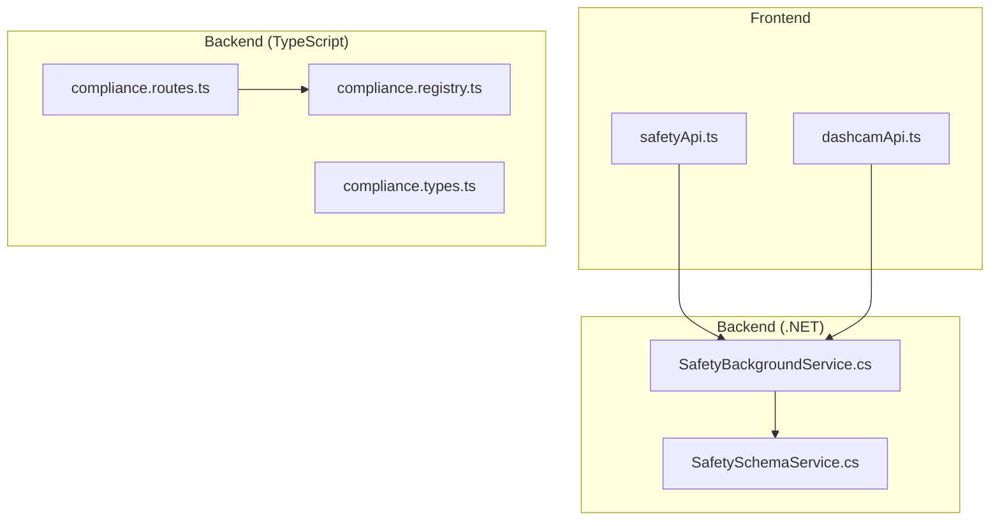
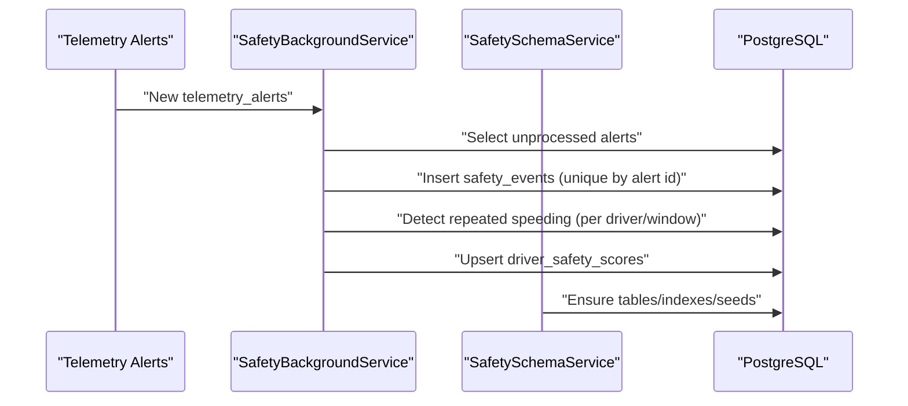
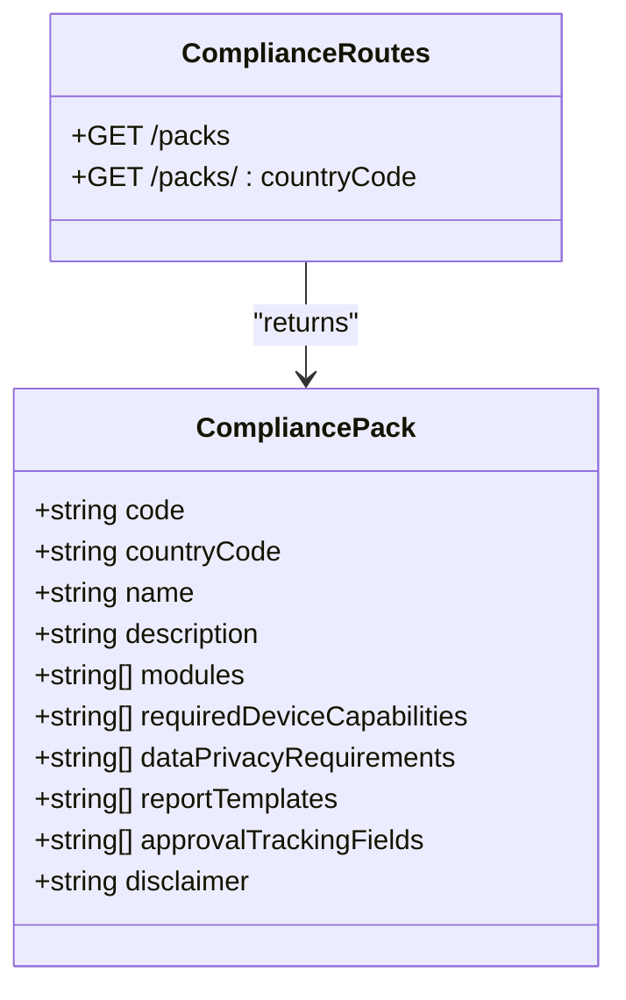
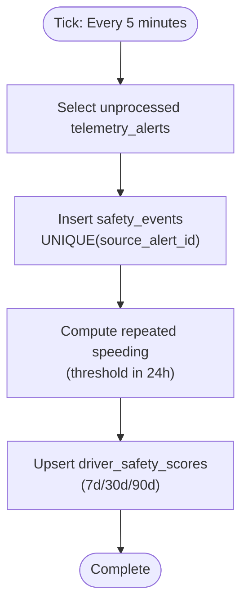
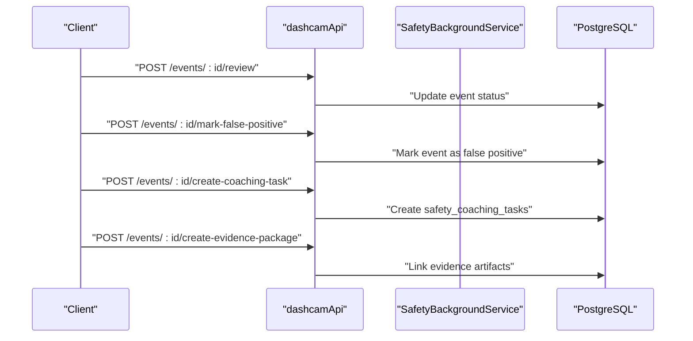
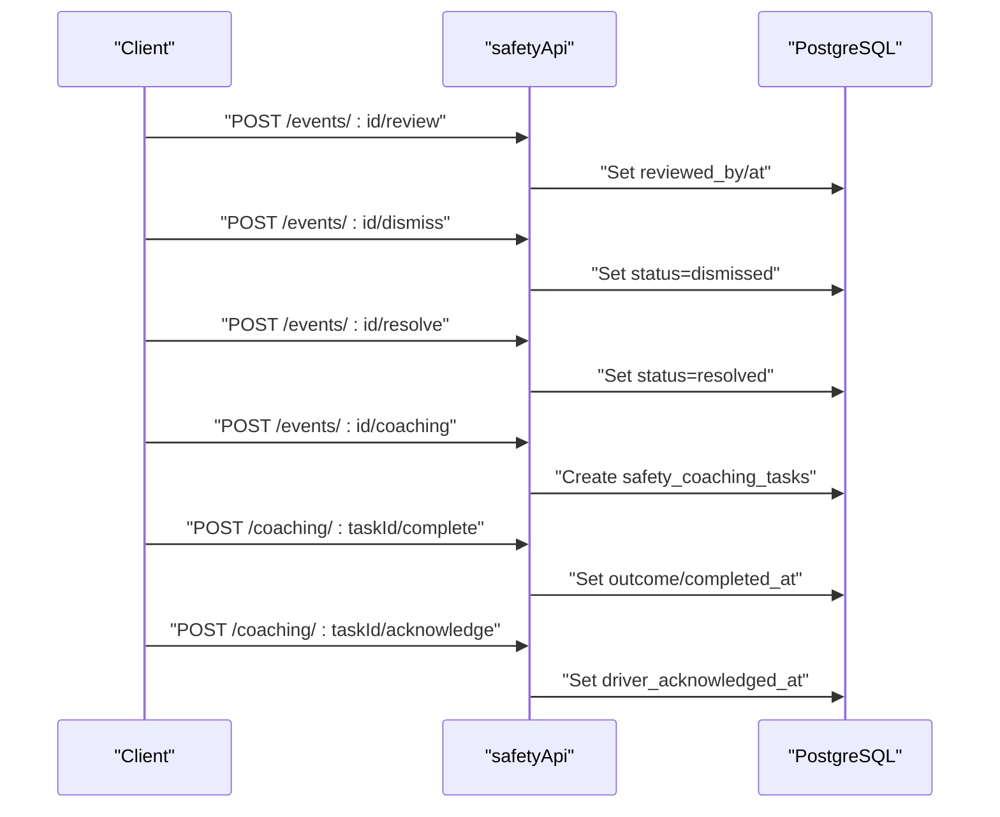
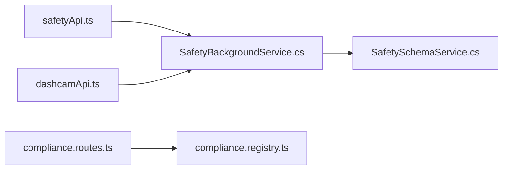

# Compliance & Safety Entities

<cite>
**Referenced Files in This Document**
- [compliance.registry.ts](file://backend/src/modules/compliance/compliance.registry.ts)
- [compliance.routes.ts](file://backend/src/modules/compliance/compliance.routes.ts)
- [compliance.types.ts](file://backend/src/modules/compliance/compliance.types.ts)
- [safetyApi.ts](file://frontend/src/services/safetyApi.ts)
- [dashcamApi.ts](file://frontend/src/services/dashcamApi.ts)
- [SafetyBackgroundService.cs](file://backend-dotnet/Services/SafetyBackgroundService.cs)
- [SafetySchemaService.cs](file://backend-dotnet/Services/SafetySchemaService.cs)
</cite>

## Table of Contents
1. [Introduction](#introduction)
2. [Project Structure](#project-structure)
3. [Core Components](#core-components)
4. [Architecture Overview](#architecture-overview)
5. [Detailed Component Analysis](#detailed-component-analysis)
6. [Dependency Analysis](#dependency-analysis)
7. [Performance Considerations](#performance-considerations)
8. [Troubleshooting Guide](#troubleshooting-guide)
9. [Conclusion](#conclusion)

## Introduction
This document describes the compliance and safety management entities and workflows implemented in the system. It focuses on:
- Safety event tracking with severity levels, review workflows, and coaching recommendations
- Compliance document management with regulatory packs and approval tracking
- Inspection processes for vehicles and drivers with pass/fail outcomes
- Hours of Service (HOS) tracking with log management and cycle monitoring
- Dashcam integration for evidence collection, AI-powered safety analysis, and automated compliance checking systems

The backend consists of a TypeScript/Node.js module for compliance metadata and a .NET backend that powers safety event processing, schema management, and scoring recomputation. Frontend services expose APIs for safety and dashcam event lifecycles.

## Project Structure
The compliance and safety domains are organized across:
- Backend TypeScript module for compliance packs and routes
- Backend .NET services for safety schema, background processing, and scoring
- Frontend services for safety and dashcam event operations

**Diagram sources**
- [safetyApi.ts:1-69](file://frontend/src/services/safetyApi.ts#L1-L69)
- [dashcamApi.ts:1-23](file://frontend/src/services/dashcamApi.ts#L1-L23)
- [compliance.routes.ts:1-24](file://backend/src/modules/compliance/compliance.routes.ts#L1-L24)
- [compliance.registry.ts:1-142](file://backend/src/modules/compliance/compliance.registry.ts#L1-L142)
- [compliance.types.ts:1-13](file://backend/src/modules/compliance/compliance.types.ts#L1-L13)
- [SafetyBackgroundService.cs:1-295](file://backend-dotnet/Services/SafetyBackgroundService.cs#L1-L295)
- [SafetySchemaService.cs:1-131](file://backend-dotnet/Services/SafetySchemaService.cs#L1-L131)

**Section sources**
- [compliance.routes.ts:1-24](file://backend/src/modules/compliance/compliance.routes.ts#L1-L24)
- [compliance.registry.ts:1-142](file://backend/src/modules/compliance/compliance.registry.ts#L1-L142)
- [compliance.types.ts:1-13](file://backend/src/modules/compliance/compliance.types.ts#L1-L13)
- [safetyApi.ts:1-69](file://frontend/src/services/safetyApi.ts#L1-L69)
- [dashcamApi.ts:1-23](file://frontend/src/services/dashcamApi.ts#L1-L23)
- [SafetyBackgroundService.cs:1-295](file://backend-dotnet/Services/SafetyBackgroundService.cs#L1-L295)
- [SafetySchemaService.cs:1-131](file://backend-dotnet/Services/SafetySchemaService.cs#L1-L131)

## Core Components
- Compliance Packs: Regulatory configurations for countries and regions, including required device capabilities, privacy requirements, report templates, and approval tracking fields.
- Safety Event System: Automated ingestion of telemetry alerts into safety events, severity-based scoring, repeated behavior detection, and driver safety score recomputation.
- Dashcam Evidence System: Lifecycle operations for dashcam events, including review, false positive marking, coaching creation, and evidence packaging.
- Frontend Safety/Dashcam APIs: Unified client-side services for dashboard summaries, event lists, detail views, state transitions, and rule management.

**Section sources**
- [compliance.registry.ts:3-141](file://backend/src/modules/compliance/compliance.registry.ts#L3-L141)
- [SafetyBackgroundService.cs:21-294](file://backend-dotnet/Services/SafetyBackgroundService.cs#L21-L294)
- [SafetySchemaService.cs:14-131](file://backend-dotnet/Services/SafetySchemaService.cs#L14-L131)
- [safetyApi.ts:9-68](file://frontend/src/services/safetyApi.ts#L9-L68)
- [dashcamApi.ts:9-22](file://frontend/src/services/dashcamApi.ts#L9-L22)

## Architecture Overview
The system integrates telemetry-driven safety events with compliance packs and dashcam evidence. The .NET backend runs periodic background processing to convert alerts into safety events, detect repeated behaviors, and recompute driver scores. Frontend services expose REST-like operations for safety and dashcam workflows.

**Diagram sources**
- [SafetyBackgroundService.cs:63-145](file://backend-dotnet/Services/SafetyBackgroundService.cs#L63-L145)
- [SafetyBackgroundService.cs:149-203](file://backend-dotnet/Services/SafetyBackgroundService.cs#L149-L203)
- [SafetyBackgroundService.cs:206-253](file://backend-dotnet/Services/SafetyBackgroundService.cs#L206-L253)
- [SafetySchemaService.cs:14-129](file://backend-dotnet/Services/SafetySchemaService.cs#L14-L129)

## Detailed Component Analysis

### Compliance Packs and Regulatory Alignment
Compliance packs define country-specific workflows, required device capabilities, privacy controls, report templates, and approval tracking fields. The backend exposes endpoints to fetch all packs or filter by country code.

**Diagram sources**
- [compliance.types.ts:1-13](file://backend/src/modules/compliance/compliance.types.ts#L1-L13)
- [compliance.registry.ts:3-141](file://backend/src/modules/compliance/compliance.registry.ts#L3-L141)
- [compliance.routes.ts:6-21](file://backend/src/modules/compliance/compliance.routes.ts#L6-L21)

**Section sources**
- [compliance.registry.ts:3-141](file://backend/src/modules/compliance/compliance.registry.ts#L3-L141)
- [compliance.routes.ts:6-21](file://backend/src/modules/compliance/compliance.routes.ts#L6-L21)
- [compliance.types.ts:1-13](file://backend/src/modules/compliance/compliance.types.ts#L1-L13)

### Safety Event Tracking and Scoring
SafetyBackgroundService converts telemetry alerts into safety events, applies severity-based score impacts, detects repeated speeding, and recomputes driver safety scores. SafetySchemaService defines the persistence model and seeds per-tenant scoring rules.

**Diagram sources**
- [SafetyBackgroundService.cs:31-59](file://backend-dotnet/Services/SafetyBackgroundService.cs#L31-L59)
- [SafetyBackgroundService.cs:63-145](file://backend-dotnet/Services/SafetyBackgroundService.cs#L63-L145)
- [SafetyBackgroundService.cs:149-203](file://backend-dotnet/Services/SafetyBackgroundService.cs#L149-L203)
- [SafetyBackgroundService.cs:206-253](file://backend-dotnet/Services/SafetyBackgroundService.cs#L206-L253)
- [SafetySchemaService.cs:18-78](file://backend-dotnet/Services/SafetySchemaService.cs#L18-L78)

**Section sources**
- [SafetyBackgroundService.cs:21-29](file://backend-dotnet/Services/SafetyBackgroundService.cs#L21-L29)
- [SafetyBackgroundService.cs:63-145](file://backend-dotnet/Services/SafetyBackgroundService.cs#L63-L145)
- [SafetyBackgroundService.cs:149-203](file://backend-dotnet/Services/SafetyBackgroundService.cs#L149-L203)
- [SafetyBackgroundService.cs:206-253](file://backend-dotnet/Services/SafetyBackgroundService.cs#L206-L253)
- [SafetySchemaService.cs:18-78](file://backend-dotnet/Services/SafetySchemaService.cs#L18-L78)

### Dashcam Evidence and Automated Compliance Checking
DashcamApi exposes lifecycle operations for dashcam events, including review, false positive marking, coaching creation, and evidence packaging. These operations integrate with safety workflows and can trigger coaching tasks and incident reports.

**Diagram sources**
- [dashcamApi.ts:17-21](file://frontend/src/services/dashcamApi.ts#L17-L21)
- [SafetySchemaService.cs:43-61](file://backend-dotnet/Services/SafetySchemaService.cs#L43-L61)

**Section sources**
- [dashcamApi.ts:9-22](file://frontend/src/services/dashcamApi.ts#L9-L22)
- [SafetySchemaService.cs:43-61](file://backend-dotnet/Services/SafetySchemaService.cs#L43-L61)

### Safety Review Workflows and Coaching Recommendations
SafetyApi provides endpoints for reviewing, dismissing, resolving safety events, and creating coaching tasks. Coaching tasks track lifecycle from assignment to completion and acknowledgment.

**Diagram sources**
- [safetyApi.ts:20-37](file://frontend/src/services/safetyApi.ts#L20-L37)
- [SafetySchemaService.cs:43-61](file://backend-dotnet/Services/SafetySchemaService.cs#L43-L61)

**Section sources**
- [safetyApi.ts:9-68](file://frontend/src/services/safetyApi.ts#L9-L68)
- [SafetySchemaService.cs:43-61](file://backend-dotnet/Services/SafetySchemaService.cs#L43-L61)

### Compliance Document Management and Expiry Tracking
Compliance packs encapsulate regulatory requirements, report templates, and approval tracking fields. While explicit expiry tracking is not shown in the referenced files, the presence of report templates and approval fields indicates structured compliance document workflows suitable for extension with expiry and renewal reminders.

**Section sources**
- [compliance.registry.ts:23-26](file://backend/src/modules/compliance/compliance.registry.ts#L23-L26)
- [compliance.registry.ts:48-53](file://backend/src/modules/compliance/compliance.registry.ts#L48-L53)
- [compliance.registry.ts:84-95](file://backend/src/modules/compliance/compliance.registry.ts#L84-L95)
- [compliance.registry.ts:118-123](file://backend/src/modules/compliance/compliance.registry.ts#L118-L123)
- [compliance.registry.ts:136-137](file://backend/src/modules/compliance/compliance.registry.ts#L136-L137)

### Inspection Processes for Vehicles and Drivers
Inspection outcomes (pass/fail) are part of the broader safety and compliance domain. The referenced files show dashcam evidence creation and safety event workflows but do not include explicit inspection entity definitions. Inspection processes can leverage dashcam evidence packages and safety events to record pass/fail results and associated corrective actions.

**Section sources**
- [dashcamApi.ts:19-21](file://frontend/src/services/dashcamApi.ts#L19-L21)
- [SafetySchemaService.cs:18-41](file://backend-dotnet/Services/SafetySchemaService.cs#L18-L41)

### Hours of Service (HOS) Tracking and Cycle Monitoring
The compliance registry includes ELD/HOS modules and report templates, indicating HOS log management and cycle monitoring workflows. The backend services also maintain telemetry rules for HOS-related thresholds and scoring, supporting automated compliance checks.

**Section sources**
- [compliance.registry.ts:10](file://backend/src/modules/compliance/compliance.registry.ts#L10)
- [compliance.registry.ts:34](file://backend/src/modules/compliance/compliance.registry.ts#L34)
- [compliance.registry.ts:68-69](file://backend/src/modules/compliance/compliance.registry.ts#L68-L69)
- [SafetySchemaService.cs:95-129](file://backend-dotnet/Services/SafetySchemaService.cs#L95-L129)

## Dependency Analysis
- Frontend safetyApi and dashcamApi depend on backend endpoints for event lifecycle operations.
- SafetyBackgroundService depends on SafetySchemaService for schema initialization and on PostgreSQL for persistence.
- Compliance routes depend on compliance registry for pack metadata.

**Diagram sources**
- [safetyApi.ts:1-69](file://frontend/src/services/safetyApi.ts#L1-L69)
- [dashcamApi.ts:1-23](file://frontend/src/services/dashcamApi.ts#L1-L23)
- [SafetyBackgroundService.cs:1-295](file://backend-dotnet/Services/SafetyBackgroundService.cs#L1-L295)
- [SafetySchemaService.cs:1-131](file://backend-dotnet/Services/SafetySchemaService.cs#L1-L131)
- [compliance.routes.ts:1-24](file://backend/src/modules/compliance/compliance.routes.ts#L1-L24)
- [compliance.registry.ts:1-142](file://backend/src/modules/compliance/compliance.registry.ts#L1-L142)

**Section sources**
- [SafetyBackgroundService.cs:63-145](file://backend-dotnet/Services/SafetyBackgroundService.cs#L63-L145)
- [SafetySchemaService.cs:14-129](file://backend-dotnet/Services/SafetySchemaService.cs#L14-L129)
- [compliance.routes.ts:6-21](file://backend/src/modules/compliance/compliance.routes.ts#L6-L21)
- [compliance.registry.ts:3-141](file://backend/src/modules/compliance/compliance.registry.ts#L3-L141)

## Performance Considerations
- Background processing interval: The safety background service runs every five minutes, balancing throughput with resource usage.
- Batch alert processing: Alerts are fetched in bounded batches to prevent overload.
- Index coverage: Strategic indexes on safety_events and coaching tasks optimize frequent queries.
- Score recomputation window: Scores are recomputed for drivers with recent events, limiting computation scope.

[No sources needed since this section provides general guidance]

## Troubleshooting Guide
- Safety event duplication: The uniqueness constraint on source telemetry alert IDs prevents duplicate safety events.
- Repeated speeding detection: If repeated speeding events are not appearing, verify the per-tenant threshold rule and scoring weights.
- Driver score updates: Scores are recomputed for drivers with events in the last 90 days; ensure recent events exist and the background service is running.
- Dashcam false positives: Marking an event as false positive removes it from compliance calculations; confirm the operation succeeds and the event status updates.

**Section sources**
- [SafetyBackgroundService.cs:140-144](file://backend-dotnet/Services/SafetyBackgroundService.cs#L140-L144)
- [SafetyBackgroundService.cs:176-202](file://backend-dotnet/Services/SafetyBackgroundService.cs#L176-L202)
- [SafetyBackgroundService.cs:211-252](file://backend-dotnet/Services/SafetyBackgroundService.cs#L211-L252)
- [dashcamApi.ts:18](file://frontend/src/services/dashcamApi.ts#L18)

## Conclusion
The system provides a robust foundation for compliance and safety management:
- Compliance packs enable country-specific workflows and regulatory alignment.
- Safety events are automatically generated from telemetry, scored, and tracked with review and coaching workflows.
- Dashcam integration supports evidence collection and automated compliance checks.
- HOS and inspection processes are supported through modular compliance packs and safety schemas.

Future enhancements could include explicit inspection entities, compliance document expiry tracking, and expanded DVIR workflows, building on the existing schema and background services.