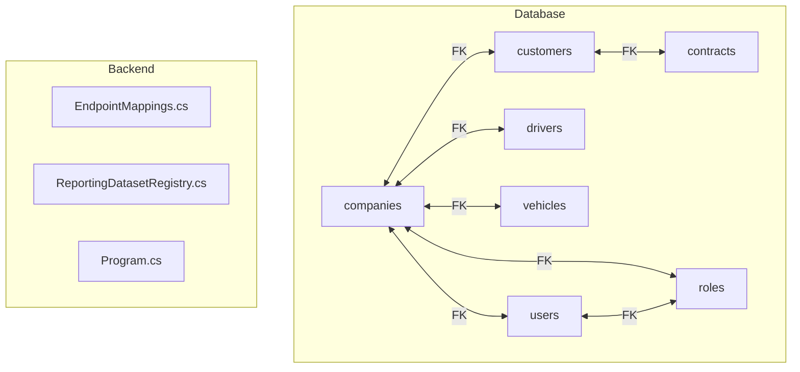
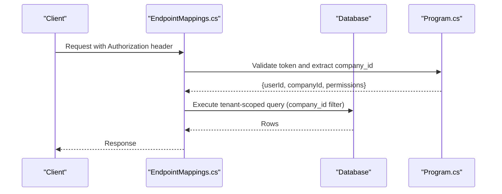
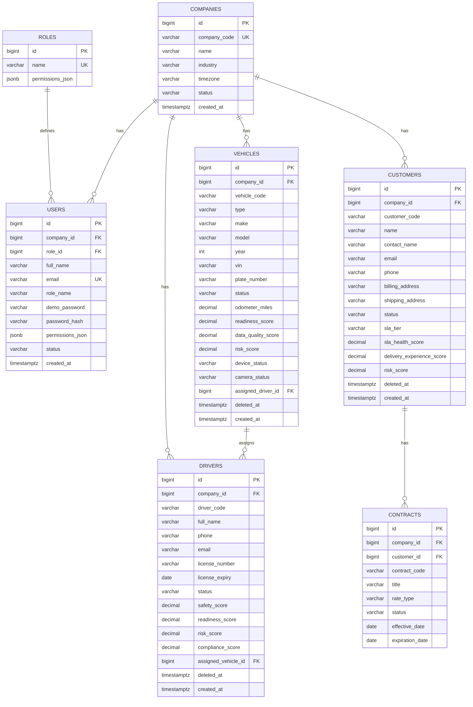

# Core Entities

<cite>
**Referenced Files in This Document**
- [001_schema.sql](file://database/init/001_schema.sql)
- [002_seed.sql](file://database/init/002_seed.sql)
- [EndpointMappings.cs](file://backend-dotnet/Controllers/EndpointMappings.cs)
- [ReportingDatasetRegistry.cs](file://backend-dotnet/Services/ReportingDatasetRegistry.cs)
- [P8ReportingTests.cs](file://backend-dotnet.Tests/P8ReportingTests.cs)
- [Program.cs](file://backend-dotnet/Program.cs)
</cite>

## Table of Contents
1. [Introduction](#introduction)
2. [Project Structure](#project-structure)
3. [Core Components](#core-components)
4. [Architecture Overview](#architecture-overview)
5. [Detailed Component Analysis](#detailed-component-analysis)
6. [Dependency Analysis](#dependency-analysis)
7. [Performance Considerations](#performance-considerations)
8. [Troubleshooting Guide](#troubleshooting-guide)
9. [Conclusion](#conclusion)

## Introduction
This document describes the core entity tables in the OpsTrax database, focusing on companies, users, roles, drivers, vehicles, customers, and contracts. It explains table schemas, field definitions, data types, constraints, and relationships. It also details the multi-tenant architecture implemented via company_id foreign keys, unique constraints, defaults, business rule enforcement, indexing strategies, common query patterns, entity lifecycle management, soft deletion, and status tracking.

## Project Structure
The database schema is defined in a PostgreSQL migration script that creates the core entities and related tables. The backend enforces tenant isolation and provides APIs for CRUD and lifecycle operations.

**Diagram sources**
- [001_schema.sql:4-117](file://database/init/001_schema.sql#L4-L117)
- [EndpointMappings.cs:4050-4081](file://backend-dotnet/Controllers/EndpointMappings.cs#L4050-L4081)
- [ReportingDatasetRegistry.cs:669-701](file://backend-dotnet/Services/ReportingDatasetRegistry.cs#L669-L701)
- [Program.cs:190-224](file://backend-dotnet/Program.cs#L190-L224)

**Section sources**
- [001_schema.sql:4-117](file://database/init/001_schema.sql#L4-L117)
- [002_seed.sql:21-26](file://database/init/002_seed.sql#L21-L26)

## Core Components
This section summarizes the core entities and their primary characteristics.

- companies
  - Purpose: Tenant container for multi-tenant isolation.
  - Key fields: id, company_code (UNIQUE), name, industry, timezone, status, created_at.
  - Defaults: timezone default, status default, timestamps default.
  - Indexes: None explicitly defined; uniqueness enforced by UNIQUE constraint.

- users
  - Purpose: Application users scoped to a company.
  - Key fields: id, company_id (FK), role_id (FK), full_name, email (UNIQUE), role_name, permissions_json, status, created_at.
  - Constraints: UNIQUE(company_id, email); FK to companies and roles.
  - Defaults: status default, timestamps default.

- roles
  - Purpose: Role definitions with JSON permissions.
  - Key fields: id, name (UNIQUE), permissions_json.
  - Constraints: UNIQUE(name).

- drivers
  - Purpose: Drivers associated with a company.
  - Key fields: id, company_id (FK), driver_code, full_name, contact info, license info, scores, assigned_vehicle_id (FK), deleted_at, created_at.
  - Constraints: UNIQUE(company_id, driver_code); FK to companies; optional FK to vehicles.
  - Defaults: status defaults, scores defaults, timestamps default.

- vehicles
  - Purpose: Fleet assets associated with a company.
  - Key fields: id, company_id (FK), vehicle_code, type/make/model/year/vin/plate, odometer_miles, status, assigned_driver_id (FK), deleted_at, created_at.
  - Constraints: UNIQUE(company_id, vehicle_code); FK to companies; bidirectional FK to drivers.
  - Defaults: status defaults, odometer default, timestamps default.

- customers
  - Purpose: Customer accounts associated with a company.
  - Key fields: id, company_id (FK), customer_code, name, contacts, addresses, status, SLA metrics, risk_score, deleted_at, created_at.
  - Constraints: UNIQUE(company_id, customer_code); FK to companies.
  - Defaults: status defaults, SLA and risk scores defaults, timestamps default.

- contracts
  - Purpose: Agreements between a company and a customer.
  - Key fields: id, company_id (FK), customer_id (FK), contract_code, title, rate_type, status, effective_date, expiration_date.
  - Constraints: FK to companies and customers.
  - Defaults: status default, dates nullable.

**Section sources**
- [001_schema.sql:4-117](file://database/init/001_schema.sql#L4-L117)
- [002_seed.sql:21-26](file://database/init/002_seed.sql#L21-L26)

## Architecture Overview
Multi-tenancy is implemented by scoping all core entities to a company via company_id. Backend services enforce tenant isolation at runtime and in generated SQL queries.

**Diagram sources**
- [Program.cs:190-224](file://backend-dotnet/Program.cs#L190-L224)
- [EndpointMappings.cs:4056-4063](file://backend-dotnet/Controllers/EndpointMappings.cs#L4056-L4063)
- [ReportingDatasetRegistry.cs:675-679](file://backend-dotnet/Services/ReportingDatasetRegistry.cs#L675-L679)

## Detailed Component Analysis

### companies
- Schema highlights
  - Primary key id (auto-increment identity).
  - company_code UNIQUE.
  - timezone default, status default, created_at default.
- Business rules
  - Unique company codes per tenant.
  - Status indicates lifecycle state.
- Multi-tenancy
  - All other entities reference companies via company_id.

**Section sources**
- [001_schema.sql:4-12](file://database/init/001_schema.sql#L4-L12)

### users
- Schema highlights
  - company_id FK to companies.
  - role_id FK to roles (optional).
  - email UNIQUE per company.
  - permissions_json stores dynamic permissions.
  - status default, timestamps default.
- RBAC integration
  - Roles define permission sets; users inherit role permissions plus personal permissions_json.

**Section sources**
- [001_schema.sql:20-34](file://database/init/001_schema.sql#L20-L34)
- [002_seed.sql:28-44](file://database/init/002_seed.sql#L28-L44)

### roles
- Schema highlights
  - name UNIQUE.
  - permissions_json defines allowed actions.
- RBAC catalog
  - Permissions are seeded and mapped to roles.

**Section sources**
- [001_schema.sql:14-18](file://database/init/001_schema.sql#L14-L18)
- [002_seed.sql:483-510](file://database/init/002_seed.sql#L483-L510)

### drivers
- Schema highlights
  - driver_code UNIQUE per company.
  - license_number and expiry.
  - safety/compliance/readiness scores.
  - assigned_vehicle_id optional FK to vehicles.
  - deleted_at enables soft deletion.
  - status default, timestamps default.
- Lifecycle
  - Soft delete sets deleted_at and status to Deleted.

**Section sources**
- [001_schema.sql:36-55](file://database/init/001_schema.sql#L36-L55)
- [EndpointMappings.cs:4050-4081](file://backend-dotnet/Controllers/EndpointMappings.cs#L4050-L4081)

### vehicles
- Schema highlights
  - vehicle_code UNIQUE per company.
  - make/model/year/vin/plate.
  - odometer_miles, readiness/data quality/risk scores.
  - assigned_driver_id optional FK to drivers.
  - deleted_at enables soft deletion.
  - status default, timestamps default.
- Lifecycle
  - Soft delete sets deleted_at and status to Deleted.

**Section sources**
- [001_schema.sql:57-82](file://database/init/001_schema.sql#L57-L82)
- [EndpointMappings.cs:4050-4081](file://backend-dotnet/Controllers/EndpointMappings.cs#L4050-L4081)

### customers
- Schema highlights
  - customer_code UNIQUE per company.
  - SLA and risk metrics.
  - deleted_at enables soft deletion.
  - status default, timestamps default.
- Lifecycle
  - Soft delete sets deleted_at and status to Deleted.

**Section sources**
- [001_schema.sql:84-103](file://database/init/001_schema.sql#L84-L103)
- [EndpointMappings.cs:4050-4081](file://backend-dotnet/Controllers/EndpointMappings.cs#L4050-L4081)

### contracts
- Schema highlights
  - contract_code UNIQUE per company.
  - rate_type, status, effective/expires dates.
  - FK to customers and companies.

**Section sources**
- [001_schema.sql:105-117](file://database/init/001_schema.sql#L105-L117)

## Dependency Analysis
Core entity relationships and constraints:

**Diagram sources**
- [001_schema.sql:4-117](file://database/init/001_schema.sql#L4-L117)

**Section sources**
- [001_schema.sql:4-117](file://database/init/001_schema.sql#L4-L117)

## Performance Considerations
Indexing strategies for common SaaS access patterns and tenant isolation:

- Core entity indexes
  - vehicles(company_id, status, risk_score)
  - vehicles(assigned_driver_id)
  - vehicles(deleted_at)
  - drivers(company_id, status, risk_score)
  - drivers(assigned_vehicle_id)
  - drivers(deleted_at)
  - customers(company_id, status, risk_score)
  - customers(deleted_at)
  - assets(company_id, status, risk_score)
  - assets(assigned_vehicle_id)
  - assets(assigned_driver_id)
  - assets(customer_id, asset_type, deleted_at)
  - vehicle_documents(vehicle_id, status)
  - driver_documents(driver_id, status)
  - asset_documents(asset_id, status)
  - customer_contacts(customer_id)
  - customer_addresses(customer_id)
  - driver_certifications(driver_id, status)
  - jobs(company_id, status, priority)
  - jobs(assigned_vehicle_id)
  - jobs(assigned_driver_id)

- Additional indexes
  - entity_timeline_events(entity_type, entity_id, created_at)
  - audit_logs(company_id, created_at DESC)
  - audit_logs(entity_name, entity_id)
  - location_events(company_id, event_time)
  - file_storage_metadata(tenant_id, owner_type, owner_id)
  - file_storage_metadata(bucket, object_key)

- Tenant isolation in queries
  - All generated SQL includes a server-side company_id filter.
  - Tests confirm tenant filters cannot be bypassed by user-provided filters.

**Section sources**
- [001_schema.sql:627-649](file://database/init/001_schema.sql#L627-L649)
- [ReportingDatasetRegistry.cs:669-701](file://backend-dotnet/Services/ReportingDatasetRegistry.cs#L669-L701)
- [P8ReportingTests.cs:567-596](file://backend-dotnet.Tests/P8ReportingTests.cs#L567-L596)
- [P8ReportingTests.cs:1266-1284](file://backend-dotnet.Tests/P8ReportingTests.cs#L1266-L1284)

## Troubleshooting Guide
Common issues and resolutions:

- Unauthorized or missing token
  - Symptom: 401 Unauthorized during authentication.
  - Resolution: Ensure Authorization header contains a valid Bearer token; verify session not expired.

- Session expired or invalid
  - Symptom: 401 Unauthorized after login.
  - Resolution: Re-authenticate to obtain a new session; sessions expire after 8 hours.

- Tenant isolation failures
  - Symptom: Accessing records from another tenant.
  - Resolution: Confirm backend enforces company_id filtering; verify generated SQL includes company_id.

- Soft delete not working
  - Symptom: Record still visible after delete.
  - Resolution: Soft delete sets deleted_at and status to Deleted; ensure queries filter by deleted_at or use tenant-aware views.

- Status transitions
  - Symptom: Status not updating.
  - Resolution: Use dedicated endpoints to change status; backend logs audit entries for status changes.

**Section sources**
- [Program.cs:171-207](file://backend-dotnet/Program.cs#L171-L207)
- [EndpointMappings.cs:3977-4048](file://backend-dotnet/Controllers/EndpointMappings.cs#L3977-L4048)
- [EndpointMappings.cs:4050-4081](file://backend-dotnet/Controllers/EndpointMappings.cs#L4050-L4081)

## Conclusion
The OpsTrax database employs a robust multi-tenant design centered on company_id across core entities. Strong constraints, defaults, and indexes support efficient querying and tenant isolation. Soft deletion and status tracking enable lifecycle management while maintaining data integrity. Backend services enforce tenant boundaries and provide standardized APIs for CRUD and lifecycle operations.