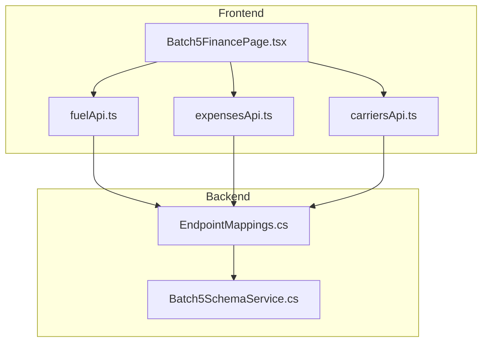
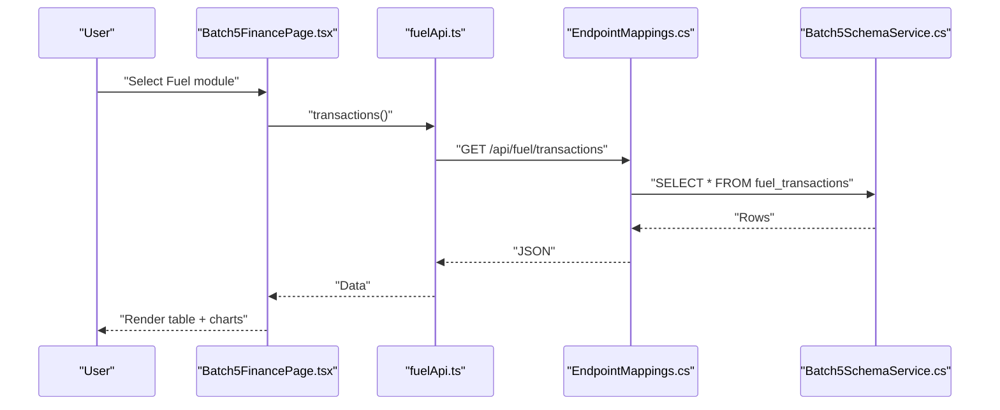
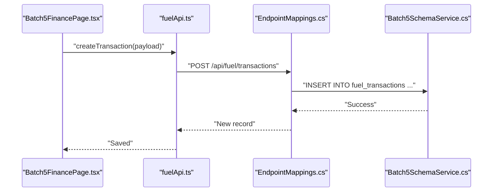
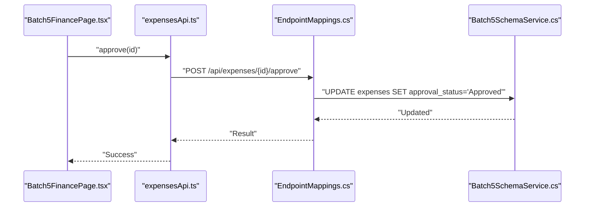
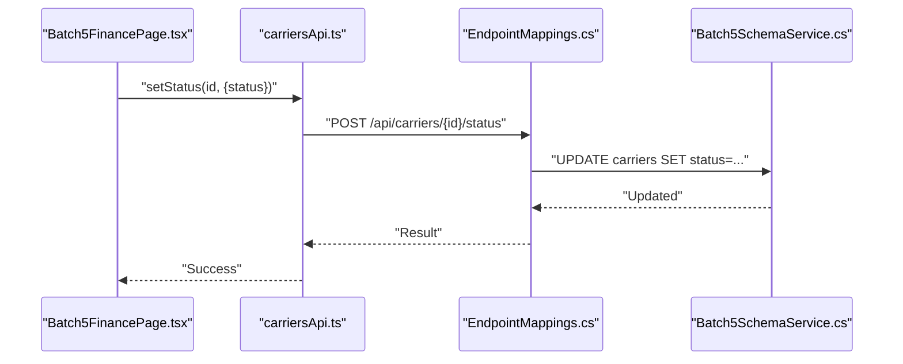
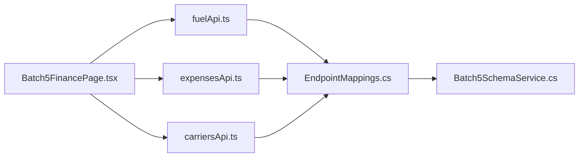

# Financial Management Entities

<cite>
**Referenced Files in This Document**
- [Batch5FinancePage.tsx](file://frontend/src/pages/Batch5FinancePage.tsx)
- [expensesApi.ts](file://frontend/src/services/expensesApi.ts)
- [fuelApi.ts](file://frontend/src/services/fuelApi.ts)
- [carriersApi.ts](file://frontend/src/services/carriersApi.ts)
- [EndpointMappings.cs](file://backend-dotnet/Controllers/EndpointMappings.cs)
- [Batch5SchemaService.cs](file://backend-dotnet/Services/Batch5SchemaService.cs)
</cite>

## Table of Contents
1. [Introduction](#introduction)
2. [Project Structure](#project-structure)
3. [Core Components](#core-components)
4. [Architecture Overview](#architecture-overview)
5. [Detailed Component Analysis](#detailed-component-analysis)
6. [Dependency Analysis](#dependency-analysis)
7. [Performance Considerations](#performance-considerations)
8. [Troubleshooting Guide](#troubleshooting-guide)
9. [Conclusion](#conclusion)

## Introduction
This document describes the financial management capabilities centered around four primary entities: fuel transactions, expenses, carriers, and predictive cost/margin analytics. It explains how fuel consumption and idling events are tracked with gallons, costs, and anomaly detection; how operating expenses are managed with categorization, approvals, and reporting; how carrier performance and compliance are governed; and how invoice/payment reconciliation and financial insights support operational cost optimization. The documentation maps UI-driven workflows to backend APIs and database schemas to provide a complete understanding of the financial domain.

## Project Structure
The financial management surface area spans the frontend page that orchestrates multiple modules and the backend APIs that persist and compute financial records. The frontend composes reusable UI components and integrates with typed service clients for fuel, expenses, and carriers. Backend services define database schemas and controller endpoints for creating, updating, and querying financial records.

**Diagram sources**
- [Batch5FinancePage.tsx:135-284](file://frontend/src/pages/Batch5FinancePage.tsx#L135-L284)
- [fuelApi.ts:9-25](file://frontend/src/services/fuelApi.ts#L9-L25)
- [expensesApi.ts:9-20](file://frontend/src/services/expensesApi.ts#L9-L20)
- [carriersApi.ts:4-15](file://frontend/src/services/carriersApi.ts#L4-L15)
- [EndpointMappings.cs:4952-4969](file://backend-dotnet/Controllers/EndpointMappings.cs#L4952-L4969)
- [Batch5SchemaService.cs:62-241](file://backend-dotnet/Services/Batch5SchemaService.cs#L62-L241)

**Section sources**
- [Batch5FinancePage.tsx:1-645](file://frontend/src/pages/Batch5FinancePage.tsx#L1-L645)
- [fuelApi.ts:1-26](file://frontend/src/services/fuelApi.ts#L1-L26)
- [expensesApi.ts:1-21](file://frontend/src/services/expensesApi.ts#L1-L21)
- [carriersApi.ts:1-16](file://frontend/src/services/carriersApi.ts#L1-L16)
- [EndpointMappings.cs:4952-4969](file://backend-dotnet/Controllers/EndpointMappings.cs#L4952-L4969)
- [Batch5SchemaService.cs:62-241](file://backend-dotnet/Services/Batch5SchemaService.cs#L62-L241)

## Core Components
- Fuel Transactions: Capture fuel purchases with gallons, unit price, total cost, odometer, station, and payment method; include anomaly detection and idling event correlation.
- Expenses: Manage operating expenses with categories, amounts, approval/receipt statuses, vendor and driver associations, and governance recommendations.
- Carriers: Maintain partner carrier profiles, compliance and insurance tracking, performance scores, and recommended actions.
- Cost & Margin Intelligence: Provide predictive estimates of revenue, cost, gross margin, and margin percent per job/entity, with risk indicators and AI recommendations.

**Section sources**
- [Batch5FinancePage.tsx:46-130](file://frontend/src/pages/Batch5FinancePage.tsx#L46-L130)
- [Batch5FinancePage.tsx:135-284](file://frontend/src/pages/Batch5FinancePage.tsx#L135-L284)
- [fuelApi.ts:9-25](file://frontend/src/services/fuelApi.ts#L9-L25)
- [expensesApi.ts:9-20](file://frontend/src/services/expensesApi.ts#L9-L20)
- [carriersApi.ts:4-15](file://frontend/src/services/carriersApi.ts#L4-L15)

## Architecture Overview
The frontend Finance page aggregates data from multiple modules and exposes actions for each entity. Each module communicates with backend endpoints via typed service clients. Backend controllers insert/update records into domain-specific tables and maintain indexes for efficient querying. The schema defines normalized financial entities with appropriate data types and constraints.

**Diagram sources**
- [Batch5FinancePage.tsx:135-284](file://frontend/src/pages/Batch5FinancePage.tsx#L135-L284)
- [fuelApi.ts:9-25](file://frontend/src/services/fuelApi.ts#L9-L25)
- [EndpointMappings.cs:4952-4969](file://backend-dotnet/Controllers/EndpointMappings.cs#L4952-L4969)
- [Batch5SchemaService.cs:62-241](file://backend-dotnet/Services/Batch5SchemaService.cs#L62-L241)

## Detailed Component Analysis

### Fuel Transactions
Fuel transactions capture refueling events with units, pricing, and location metadata. The UI supports:
- Transaction list with columns for vehicle, driver, fuel type, quantity, unit price, total cost, odometer, station, payment method, anomaly status, and date.
- Idling events tab for correlated idling durations and estimated costs.
- Anomalies tab for detecting unusual consumption patterns.
- KPIs including spend today/month, idle cost today, transactions, anomalies, high idle vehicles, cost per gallon, and savings opportunity.
- Actions such as reviewing anomalies and exporting reports.

Backend persistence creates fuel transactions with computed fields and defaults, ensuring referential integrity and consistent numbering.

**Diagram sources**
- [Batch5FinancePage.tsx:135-284](file://frontend/src/pages/Batch5FinancePage.tsx#L135-L284)
- [fuelApi.ts:9-25](file://frontend/src/services/fuelApi.ts#L9-L25)
- [EndpointMappings.cs:4952-4969](file://backend-dotnet/Controllers/EndpointMappings.cs#L4952-L4969)
- [Batch5SchemaService.cs:62-241](file://backend-dotnet/Services/Batch5SchemaService.cs#L62-L241)

**Section sources**
- [Batch5FinancePage.tsx:28-58](file://frontend/src/pages/Batch5FinancePage.tsx#L28-L58)
- [Batch5FinancePage.tsx:135-284](file://frontend/src/pages/Batch5FinancePage.tsx#L135-L284)
- [fuelApi.ts:9-25](file://frontend/src/services/fuelApi.ts#L9-L25)
- [EndpointMappings.cs:4952-4969](file://backend-dotnet/Controllers/EndpointMappings.cs#L4952-L4969)
- [Batch5SchemaService.cs:62-241](file://backend-dotnet/Services/Batch5SchemaService.cs#L62-L241)

### Expenses
Expense management includes creation, updates, approvals, and rejection. The UI presents:
- Expense list with category, amount, approval/receipt status, vendor, vehicle/driver associations, risk score, and date.
- KPIs covering monthly totals, pending/approved/rejected counts, unusual items, missing receipts, average amount, and total.
- Categories endpoint and recommendations endpoint for governance and AI-driven suggestions.

**Diagram sources**
- [Batch5FinancePage.tsx:135-284](file://frontend/src/pages/Batch5FinancePage.tsx#L135-L284)
- [expensesApi.ts:9-20](file://frontend/src/services/expensesApi.ts#L9-L20)
- [EndpointMappings.cs:4952-4969](file://backend-dotnet/Controllers/EndpointMappings.cs#L4952-L4969)
- [Batch5SchemaService.cs:62-241](file://backend-dotnet/Services/Batch5SchemaService.cs#L62-L241)

**Section sources**
- [Batch5FinancePage.tsx:59-70](file://frontend/src/pages/Batch5FinancePage.tsx#L59-L70)
- [expensesApi.ts:9-20](file://frontend/src/services/expensesApi.ts#L9-L20)
- [Batch5SchemaService.cs:62-241](file://backend-dotnet/Services/Batch5SchemaService.cs#L62-L241)

### Carriers
Carrier management tracks partner vendors with safety/performance metrics, compliance, insurance, and recommended actions. The UI displays:
- Carrier list with name, region, compliance/contract status, on-time percentage, safety/performance/risk scores, insurance expiry, and status.
- Sections for performance history and documents.
- KPIs such as active carriers, compliance risk, insurance expiring soon, average performance, on-time percentage, preferred carriers, and missing documents.

**Diagram sources**
- [Batch5FinancePage.tsx:83-97](file://frontend/src/pages/Batch5FinancePage.tsx#L83-L97)
- [carriersApi.ts:4-15](file://frontend/src/services/carriersApi.ts#L4-L15)
- [EndpointMappings.cs:4952-4969](file://backend-dotnet/Controllers/EndpointMappings.cs#L4952-L4969)
- [Batch5SchemaService.cs:62-241](file://backend-dotnet/Services/Batch5SchemaService.cs#L62-L241)

**Section sources**
- [Batch5FinancePage.tsx:83-97](file://frontend/src/pages/Batch5FinancePage.tsx#L83-L97)
- [carriersApi.ts:4-15](file://frontend/src/services/carriersApi.ts#L4-L15)
- [Batch5SchemaService.cs:62-241](file://backend-dotnet/Services/Batch5SchemaService.cs#L62-L241)

### Contracts and Rate Structures
Contracts module manages customer/carrier contracts, rate types, margins, fuel surcharges, and renewals. The UI provides:
- Contract list with type, rate type, status, customer/carrier, base rate, margin risk, effective/expiration dates, and recommended actions.
- Fields for fuel surcharge enablement and rates table view.
- KPIs for active/expiring/expired contracts, margin risk, underpriced, renewal queue, and fuel surcharge status.

Note: Contract endpoints are wired in the UI configuration and use the contracts API client.

**Section sources**
- [Batch5FinancePage.tsx:71-82](file://frontend/src/pages/Batch5FinancePage.tsx#L71-L82)

### Predictive Cost & Margin Intelligence
The cost and margin module surfaces predictive estimates and risk indicators per job/entity:
- KPIs include revenue estimate, cost estimate, gross margin, margin percent, jobs below target, high-cost vehicles, fuel impact, and savings opportunity.
- Actions allow recalculating estimates.
- The UI renders margin percent by job chart and integrates AI recommendations.

**Section sources**
- [Batch5FinancePage.tsx:98-121](file://frontend/src/pages/Batch5FinancePage.tsx#L98-L121)

### Cost Leakage Intelligence
Cost leakage module identifies categories of financial leakage, estimated losses, and recovery actions:
- KPIs include total leakage, monthly projection, open items, critical/open actions, recoverable savings, acknowledged items, and total.
- Actions support acknowledging items and creating recovery actions.

**Section sources**
- [Batch5FinancePage.tsx:110-121](file://frontend/src/pages/Batch5FinancePage.tsx#L110-L121)

## Dependency Analysis
The frontend Finance page orchestrates multiple data sources and actions. Each module’s service client maps to backend endpoints that write to normalized financial tables. Indexes are defined to optimize common queries across fuel, expenses, carriers, contracts, and cost analytics.

**Diagram sources**
- [Batch5FinancePage.tsx:135-284](file://frontend/src/pages/Batch5FinancePage.tsx#L135-L284)
- [fuelApi.ts:9-25](file://frontend/src/services/fuelApi.ts#L9-L25)
- [expensesApi.ts:9-20](file://frontend/src/services/expensesApi.ts#L9-L20)
- [carriersApi.ts:4-15](file://frontend/src/services/carriersApi.ts#L4-L15)
- [EndpointMappings.cs:4952-4969](file://backend-dotnet/Controllers/EndpointMappings.cs#L4952-L4969)
- [Batch5SchemaService.cs:62-241](file://backend-dotnet/Services/Batch5SchemaService.cs#L62-L241)

**Section sources**
- [Batch5FinancePage.tsx:135-284](file://frontend/src/pages/Batch5FinancePage.tsx#L135-L284)
- [EndpointMappings.cs:4952-4969](file://backend-dotnet/Controllers/EndpointMappings.cs#L4952-L4969)
- [Batch5SchemaService.cs:62-241](file://backend-dotnet/Services/Batch5SchemaService.cs#L62-L241)

## Performance Considerations
- UI-level caching and invalidation: The Finance page invalidates related query keys after mutations to keep views consistent without redundant network calls.
- Tabular filtering and search: Filtering by status and free-text search reduces rendered datasets for improved responsiveness.
- Chart rendering: Top-N aggregations limit heavy chart rendering to the most impactful records.
- Backend indexing: Strategic indexes on status, risk, and composite keys accelerate frequent queries for anomaly detection, approvals, and scoring.

[No sources needed since this section provides general guidance]

## Troubleshooting Guide
- Network fallbacks: Service clients wrap requests with a fallback mechanism to return seeded development data when backend endpoints are unavailable, aiding local development and testing.
- Mutation errors: UI mutations handle success callbacks to close modals and refresh data; ensure backend endpoints return consistent shapes for successful responses.
- Data shape mismatches: Verify that backend inserts/updates align with schema definitions to prevent UI rendering issues (e.g., anomaly status, approval status, risk scores).

**Section sources**
- [expensesApi.ts:5-7](file://frontend/src/services/expensesApi.ts#L5-L7)
- [expensesApi.ts:9-20](file://frontend/src/services/expensesApi.ts#L9-L20)
- [fuelApi.ts:5-7](file://frontend/src/services/fuelApi.ts#L5-L7)
- [fuelApi.ts:9-25](file://frontend/src/services/fuelApi.ts#L9-L25)
- [carriersApi.ts:4-15](file://frontend/src/services/carriersApi.ts#L4-L15)

## Conclusion
The financial management system integrates fuel transaction tracking with anomaly detection and idling analysis, robust expense lifecycle management with approvals and reporting, carrier performance and compliance oversight, and predictive cost/margin intelligence. Backend controllers and schemas enforce data integrity and indexing, while the frontend orchestrates actionable insights and AI recommendations to drive operational cost optimization.