# Documents Management

<cite>
**Referenced Files in This Document**
- [documentsApi.ts](file://frontend/src/services/documentsApi.ts)
- [EndpointMappings.cs](file://backend-dotnet/Controllers/EndpointMappings.cs)
- [001_schema.sql](file://database/init/001_schema.sql)
- [001_schema.sql](file://db/init/001_schema.sql)
- [file_storage_metadata.sql](file://database/init/001_schema.sql)
- [compliance.registry.ts](file://backend/src/modules/compliance/compliance.registry.ts)
- [compliance.routes.ts](file://backend/src/modules/compliance/compliance.routes.ts)
- [compliance.types.ts](file://backend/src/modules/compliance/compliance.types.ts)
</cite>

## Table of Contents
1. [Introduction](#introduction)
2. [Project Structure](#project-structure)
3. [Core Components](#core-components)
4. [Architecture Overview](#architecture-overview)
5. [Detailed Component Analysis](#detailed-component-analysis)
6. [Dependency Analysis](#dependency-analysis)
7. [Performance Considerations](#performance-considerations)
8. [Troubleshooting Guide](#troubleshooting-guide)
9. [Conclusion](#conclusion)
10. [Appendices](#appendices)

## Introduction
This document describes the documents management system that tracks vehicle_documents, driver_documents, and asset_documents with expiry dates, statuses, and lifecycle workflows. It covers upload and metadata workflows, categorization by type, expiry tracking with automated reminders, status management (Active, Expired, Suspended), compliance integration, validation, search/filtering, attachment management, secure storage, renewal workflows, audit trails, sharing/access controls, and archival/lifecycle management aligned with legal retention requirements.

## Project Structure
The documents management system spans:
- Frontend service client for document operations
- Backend .NET controllers implementing CRUD, validation, expiry queries, and audit
- Database schema supporting three document tables and a shared file metadata table
- Compliance registry and routes for regulatory packs (relevant for policy alignment)

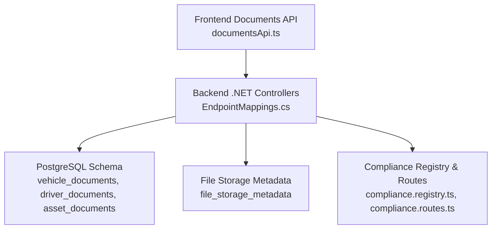

**Diagram sources**
- [documentsApi.ts:1-17](file://frontend/src/services/documentsApi.ts#L1-L17)
- [EndpointMappings.cs:759-3624](file://backend-dotnet/Controllers/EndpointMappings.cs#L759-L3624)
- [001_schema.sql:143-203](file://database/init/001_schema.sql#L143-L203)
- [001_schema.sql:1508-1522](file://database/init/001_schema.sql#L1508-L1522)
- [compliance.registry.ts:1-142](file://backend/src/modules/compliance/compliance.registry.ts#L1-L142)
- [compliance.routes.ts:1-24](file://backend/src/modules/compliance/compliance.routes.ts#L1-L24)

**Section sources**
- [documentsApi.ts:1-17](file://frontend/src/services/documentsApi.ts#L1-L17)
- [EndpointMappings.cs:759-3624](file://backend-dotnet/Controllers/EndpointMappings.cs#L759-L3624)
- [001_schema.sql:143-203](file://database/init/001_schema.sql#L143-L203)
- [001_schema.sql:1508-1522](file://database/init/001_schema.sql#L1508-L1522)
- [compliance.registry.ts:1-142](file://backend/src/modules/compliance/compliance.registry.ts#L1-L142)
- [compliance.routes.ts:1-24](file://backend/src/modules/compliance/compliance.routes.ts#L1-L24)

## Core Components
- Frontend Documents API client exposing list, summary, detail, create, update, delete, expiring, upload placeholder, renew placeholder, timeline, and recommendations endpoints.
- Backend .NET controllers implementing:
  - Document CRUD and validation
  - Expiry queries and recommendations
  - Timeline and audit trail retrieval
  - Upload placeholder and renewal placeholder workflows
- Database schema with:
  - vehicle_documents, driver_documents, asset_documents tables
  - file_storage_metadata table for secure attachment metadata
- Compliance registry and routes for country-specific compliance packs

**Section sources**
- [documentsApi.ts:4-16](file://frontend/src/services/documentsApi.ts#L4-L16)
- [EndpointMappings.cs:759-3624](file://backend-dotnet/Controllers/EndpointMappings.cs#L759-L3624)
- [001_schema.sql:143-203](file://database/init/001_schema.sql#L143-L203)
- [001_schema.sql:1508-1522](file://database/init/001_schema.sql#L1508-L1522)
- [compliance.registry.ts:3-141](file://backend/src/modules/compliance/compliance.registry.ts#L3-L141)
- [compliance.routes.ts:6-21](file://backend/src/modules/compliance/compliance.routes.ts#L6-L21)

## Architecture Overview
The system follows a layered architecture:
- Presentation: Frontend service client
- Application: Backend .NET controllers
- Persistence: PostgreSQL with dedicated document tables and file metadata
- Compliance: Registry and routes for regulatory packs

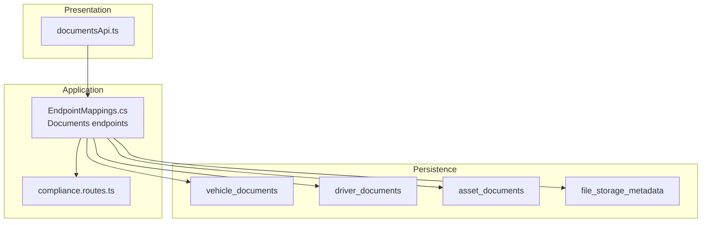

**Diagram sources**
- [documentsApi.ts:1-17](file://frontend/src/services/documentsApi.ts#L1-L17)
- [EndpointMappings.cs:759-3624](file://backend-dotnet/Controllers/EndpointMappings.cs#L759-L3624)
- [001_schema.sql:143-203](file://database/init/001_schema.sql#L143-L203)
- [001_schema.sql:1508-1522](file://database/init/001_schema.sql#L1508-L1522)
- [compliance.routes.ts:1-24](file://backend/src/modules/compliance/compliance.routes.ts#L1-L24)

## Detailed Component Analysis

### Document Upload Workflow
The upload placeholder workflow enables pre-creating a document record with a temporary file URL, followed by a real upload and update.

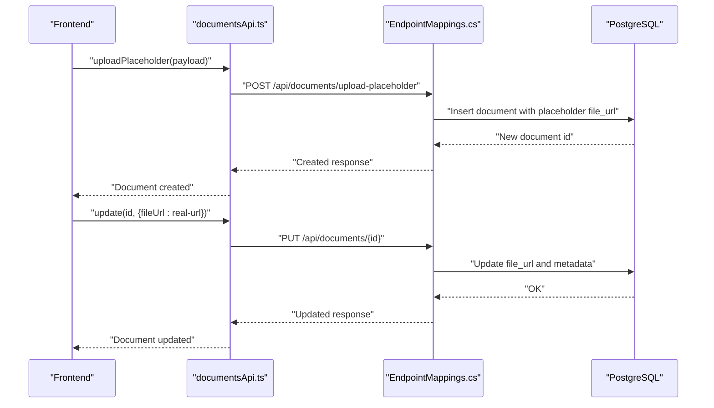

**Diagram sources**
- [documentsApi.ts:12-12](file://frontend/src/services/documentsApi.ts#L12-L12)
- [EndpointMappings.cs:3603-3614](file://backend-dotnet/Controllers/EndpointMappings.cs#L3603-L3614)
- [EndpointMappings.cs:3590-3601](file://backend-dotnet/Controllers/EndpointMappings.cs#L3590-L3601)

**Section sources**
- [documentsApi.ts:12-12](file://frontend/src/services/documentsApi.ts#L12-L12)
- [EndpointMappings.cs:3603-3614](file://backend-dotnet/Controllers/EndpointMappings.cs#L3603-L3614)
- [EndpointMappings.cs:3590-3601](file://backend-dotnet/Controllers/EndpointMappings.cs#L3590-L3601)

### Renewal Placeholder Workflow
The renewal placeholder workflow marks a document as Expiring and sets renewal status to "Renewal Queued".

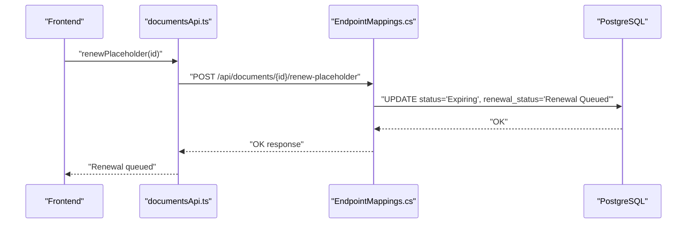

**Diagram sources**
- [documentsApi.ts:13-13](file://frontend/src/services/documentsApi.ts#L13-L13)
- [EndpointMappings.cs:3616-3622](file://backend-dotnet/Controllers/EndpointMappings.cs#L3616-L3622)

**Section sources**
- [documentsApi.ts:13-13](file://frontend/src/services/documentsApi.ts#L13-L13)
- [EndpointMappings.cs:3616-3622](file://backend-dotnet/Controllers/EndpointMappings.cs#L3616-L3622)

### Expiry Tracking and Recommendations
Expiry queries filter documents nearing or past expiry, and recommendations are surfaced via AI.

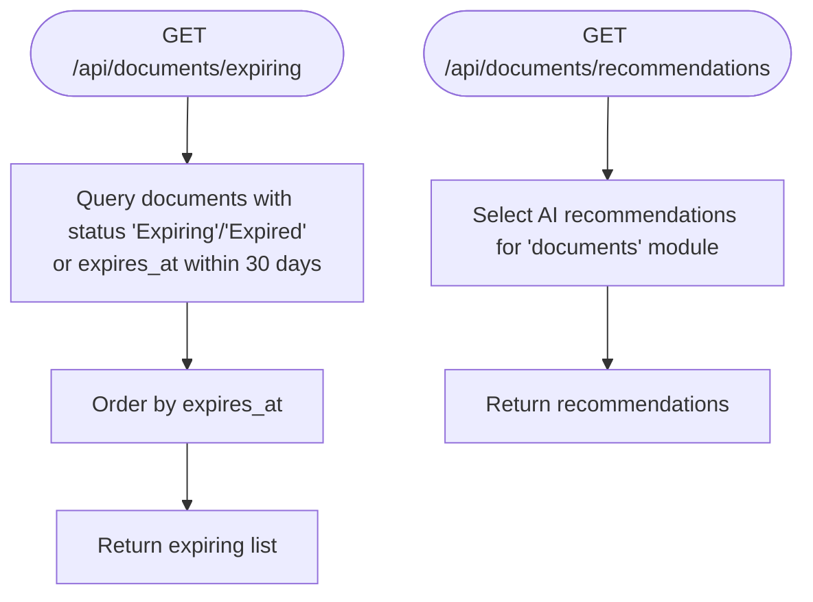

**Diagram sources**
- [EndpointMappings.cs:759-761](file://backend-dotnet/Controllers/EndpointMappings.cs#L759-L761)

**Section sources**
- [EndpointMappings.cs:759-761](file://backend-dotnet/Controllers/EndpointMappings.cs#L759-L761)

### Status Management and Lifecycle
Statuses include Active, Expired, Suspended, and renewal tracking is supported. Lifecycle includes creation, updates, renewal queuing, and audit logging.

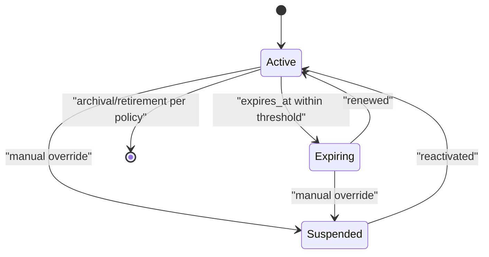

**Diagram sources**
- [EndpointMappings.cs:3577-3622](file://backend-dotnet/Controllers/EndpointMappings.cs#L3577-L3622)

**Section sources**
- [EndpointMappings.cs:3577-3622](file://backend-dotnet/Controllers/EndpointMappings.cs#L3577-L3622)

### Document Validation Workflow
Validation occurs on create/update, returning structured errors if invalid.

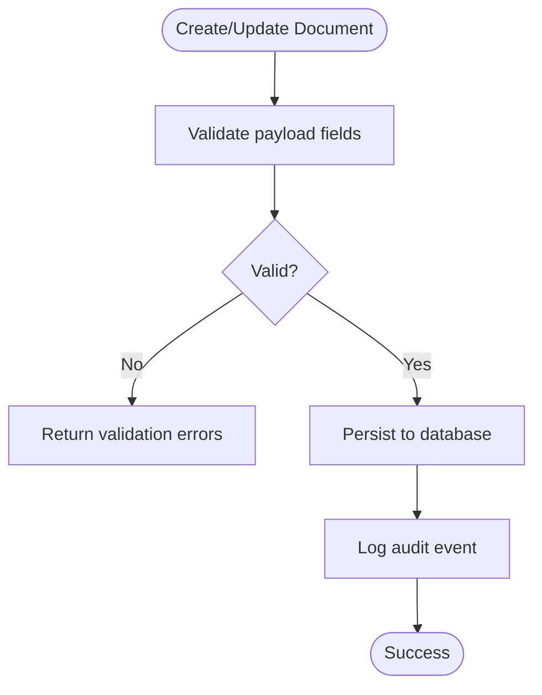

**Diagram sources**
- [EndpointMappings.cs:3579-3581](file://backend-dotnet/Controllers/EndpointMappings.cs#L3579-L3581)
- [EndpointMappings.cs:3590-3601](file://backend-dotnet/Controllers/EndpointMappings.cs#L3590-L3601)

**Section sources**
- [EndpointMappings.cs:3579-3581](file://backend-dotnet/Controllers/EndpointMappings.cs#L3579-L3581)
- [EndpointMappings.cs:3590-3601](file://backend-dotnet/Controllers/EndpointMappings.cs#L3590-L3601)

### Compliance Integration
Compliance packs define regulatory requirements and capabilities. While the documents module primarily manages metadata and attachments, compliance packs inform policy alignment for retention, access, and reporting.

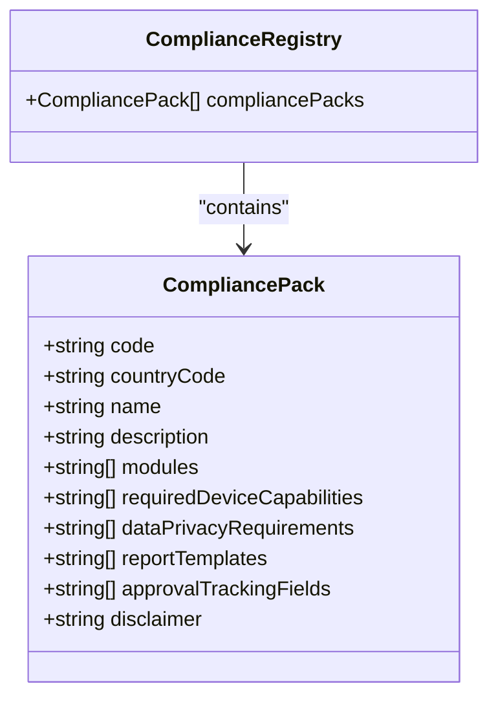

**Diagram sources**
- [compliance.types.ts:1-13](file://backend/src/modules/compliance/compliance.types.ts#L1-L13)
- [compliance.registry.ts:3-141](file://backend/src/modules/compliance/compliance.registry.ts#L3-L141)

**Section sources**
- [compliance.registry.ts:3-141](file://backend/src/modules/compliance/compliance.registry.ts#L3-L141)
- [compliance.routes.ts:6-21](file://backend/src/modules/compliance/compliance.routes.ts#L6-L21)
- [compliance.types.ts:1-13](file://backend/src/modules/compliance/compliance.types.ts#L1-L13)

### Attachment Management and Secure Storage
Attachments are represented by URLs stored in document records, while metadata is tracked in file_storage_metadata. Indexes optimize lookups by tenant, owner, and object key.

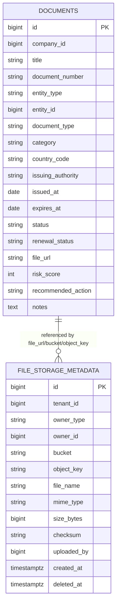

**Diagram sources**
- [EndpointMappings.cs:3581-3584](file://backend-dotnet/Controllers/EndpointMappings.cs#L3581-L3584)
- [001_schema.sql:1508-1522](file://database/init/001_schema.sql#L1508-L1522)

**Section sources**
- [EndpointMappings.cs:3581-3584](file://backend-dotnet/Controllers/EndpointMappings.cs#L3581-L3584)
- [001_schema.sql:1508-1522](file://database/init/001_schema.sql#L1508-L1522)

### Document Search and Filtering
Search and filtering are implemented via SQL queries in the backend controllers, enabling:
- Listing documents
- Retrieving summaries and expiring lists
- Fetching timelines and recommendations
- Entity-specific document retrieval (vehicles, drivers, assets)

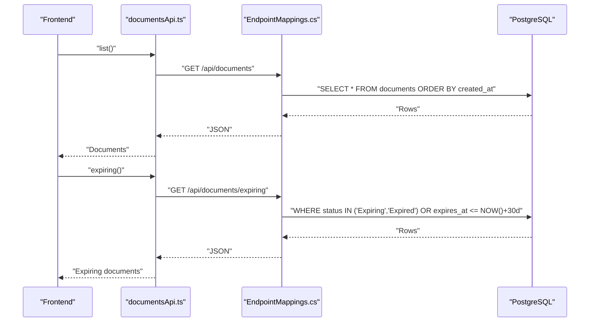

**Diagram sources**
- [documentsApi.ts:5-11](file://frontend/src/services/documentsApi.ts#L5-L11)
- [EndpointMappings.cs:759-761](file://backend-dotnet/Controllers/EndpointMappings.cs#L759-L761)

**Section sources**
- [documentsApi.ts:5-11](file://frontend/src/services/documentsApi.ts#L5-L11)
- [EndpointMappings.cs:759-761](file://backend-dotnet/Controllers/EndpointMappings.cs#L759-L761)

### Audit Trails and Timeline Events
Each create/update operation logs an audit event and adds a timeline event. Detail views include timeline, recommendations, and audit rows.

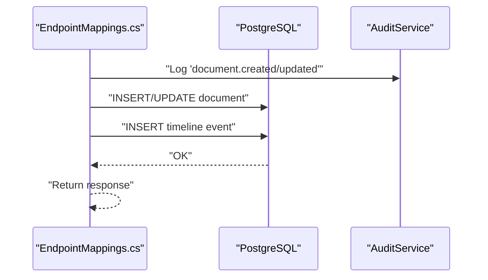

**Diagram sources**
- [EndpointMappings.cs:3585-3587](file://backend-dotnet/Controllers/EndpointMappings.cs#L3585-L3587)
- [EndpointMappings.cs:3598-4000](file://backend-dotnet/Controllers/EndpointMappings.cs#L3598-L4000)

**Section sources**
- [EndpointMappings.cs:3585-3587](file://backend-dotnet/Controllers/EndpointMappings.cs#L3585-L3587)
- [EndpointMappings.cs:3598-4000](file://backend-dotnet/Controllers/EndpointMappings.cs#L3598-L4000)

## Dependency Analysis
- Frontend depends on backend endpoints for all document operations.
- Backend controllers depend on:
  - Database for persistence
  - Audit service for logging
  - Compliance registry for policy alignment
- Database tables are normalized with foreign keys to vehicles, drivers, and assets.

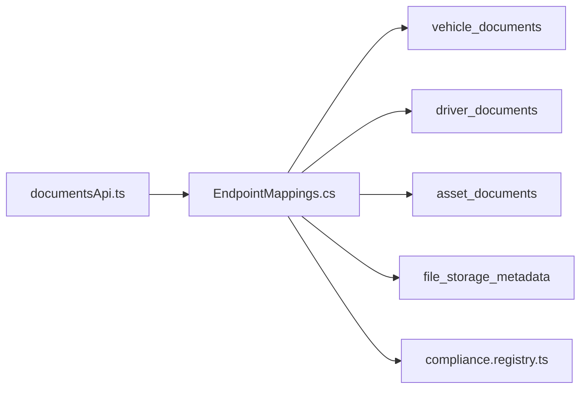

**Diagram sources**
- [documentsApi.ts:1-17](file://frontend/src/services/documentsApi.ts#L1-L17)
- [EndpointMappings.cs:759-3624](file://backend-dotnet/Controllers/EndpointMappings.cs#L759-L3624)
- [001_schema.sql:143-203](file://database/init/001_schema.sql#L143-L203)
- [001_schema.sql:1508-1522](file://database/init/001_schema.sql#L1508-L1522)
- [compliance.registry.ts:1-142](file://backend/src/modules/compliance/compliance.registry.ts#L1-L142)

**Section sources**
- [documentsApi.ts:1-17](file://frontend/src/services/documentsApi.ts#L1-L17)
- [EndpointMappings.cs:759-3624](file://backend-dotnet/Controllers/EndpointMappings.cs#L759-L3624)
- [001_schema.sql:143-203](file://database/init/001_schema.sql#L143-L203)
- [001_schema.sql:1508-1522](file://database/init/001_schema.sql#L1508-L1522)
- [compliance.registry.ts:1-142](file://backend/src/modules/compliance/compliance.registry.ts#L1-L142)

## Performance Considerations
- Indexes on file_storage_metadata (tenant, owner_type, owner_id, bucket, object_key) improve lookup performance for attachments.
- Ordering and filtering by expiry_date and status reduce result set sizes for expiring queries.
- Recommendation queries limit results to improve responsiveness.

[No sources needed since this section provides general guidance]

## Troubleshooting Guide
Common issues and resolutions:
- Validation failures on create/update: Review returned validation errors and ensure required fields are present.
- Expiring documents not appearing: Verify status and expiry_date values meet the 30-day threshold criteria.
- Timeline missing: Confirm timeline events are inserted after create/update operations.
- File uploads failing: Ensure placeholder creation precedes real upload and that file_url is updated accordingly.

**Section sources**
- [EndpointMappings.cs:3579-3581](file://backend-dotnet/Controllers/EndpointMappings.cs#L3579-L3581)
- [EndpointMappings.cs:3603-3614](file://backend-dotnet/Controllers/EndpointMappings.cs#L3603-L3614)
- [EndpointMappings.cs:3616-3622](file://backend-dotnet/Controllers/EndpointMappings.cs#L3616-L3622)

## Conclusion
The documents management system provides robust metadata tracking, secure attachment handling, expiry monitoring, and lifecycle management. Integration with compliance packs ensures policy alignment, while audit trails and timelines support governance and transparency. The modular design allows extension for additional document categories and regulatory requirements.

## Appendices

### Document Categories and Types
- Vehicle documents: registration, insurance, safety inspections, roadworthiness certificates
- Driver documents: licenses, certifications, medical certificates, safety training
- Asset documents: equipment permits, maintenance manuals, safety documentation

[No sources needed since this section provides general guidance]

### Expiry Date Tracking and Automated Reminders
- Expiry queries flag documents with status "Expiring" or "Expired" or within a 30-day window.
- Recommendations endpoint surfaces AI-driven actions for document maintenance.

**Section sources**
- [EndpointMappings.cs:759-761](file://backend-dotnet/Controllers/EndpointMappings.cs#L759-L761)

### Status Management Reference
- Active: Valid and in-force
- Expired: Past expiry_date
- Suspended: Manually placed on hold
- Renewal Queued: Marked for renewal process

**Section sources**
- [EndpointMappings.cs:3616-3622](file://backend-dotnet/Controllers/EndpointMappings.cs#L3616-L3622)

### Secure Storage Practices
- Attachments are referenced by URLs; metadata is stored in file_storage_metadata with indexes for efficient retrieval.
- Tenant scoping prevents unauthorized access across organizations.

**Section sources**
- [001_schema.sql:1508-1522](file://database/init/001_schema.sql#L1508-L1522)

### Compliance Tracking and Legal Retention
- Compliance packs define privacy and retention requirements; documents module aligns with these policies.
- Audit logs and timeline events support compliance audits and legal retention obligations.

**Section sources**
- [compliance.registry.ts:3-141](file://backend/src/modules/compliance/compliance.registry.ts#L3-L141)
- [EndpointMappings.cs:3585-3587](file://backend-dotnet/Controllers/EndpointMappings.cs#L3585-L3587)