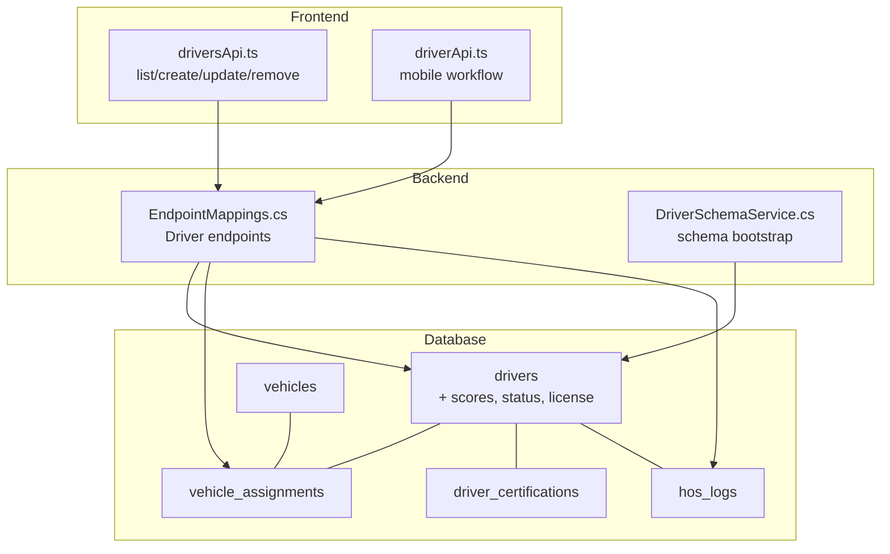
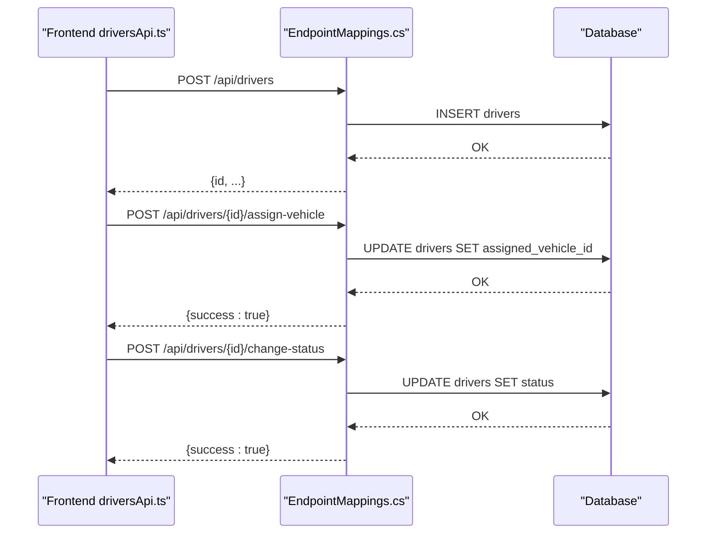
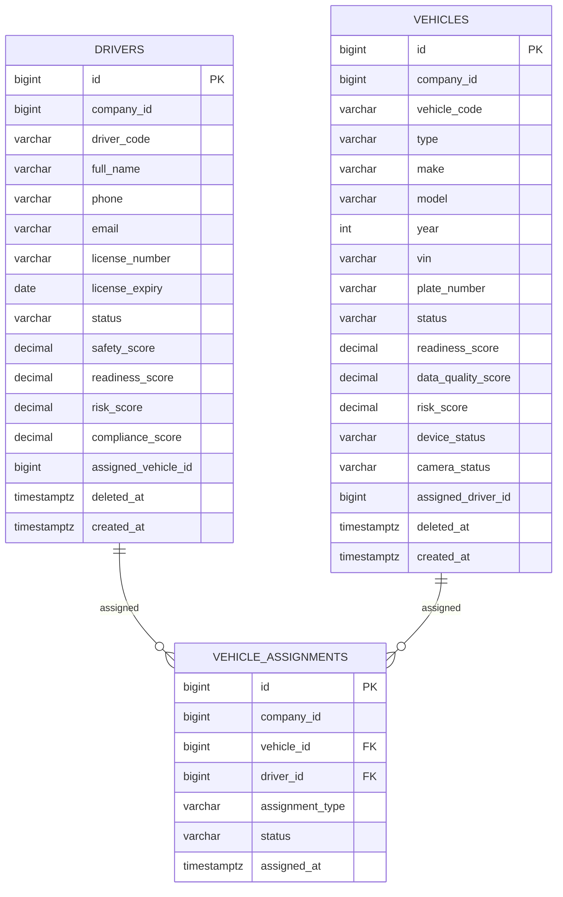
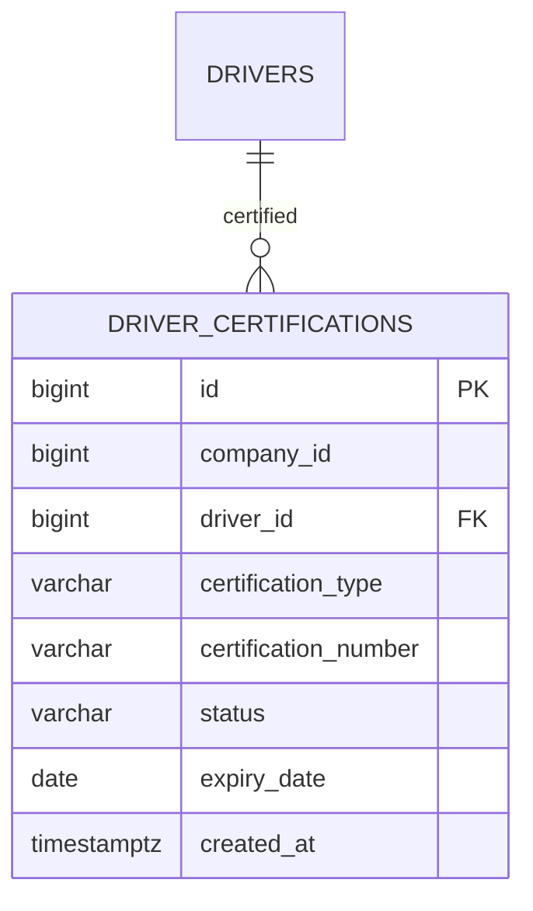
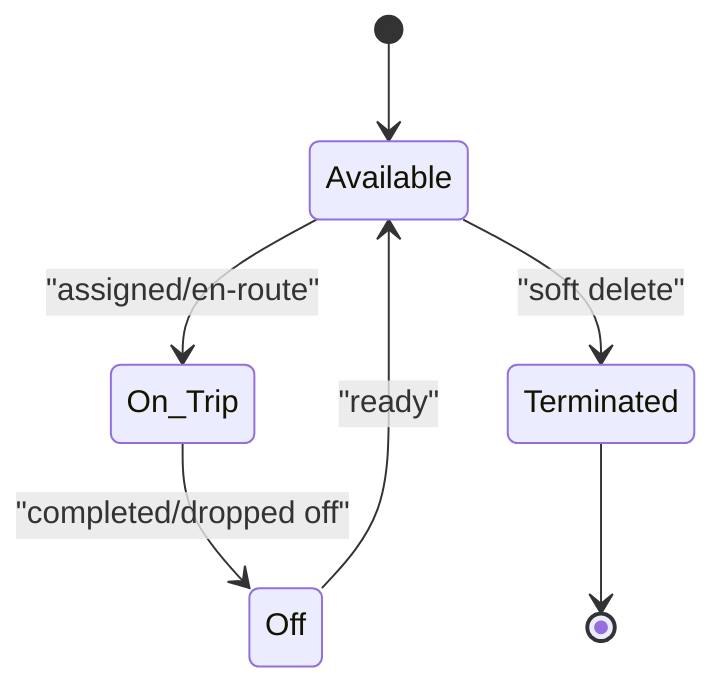
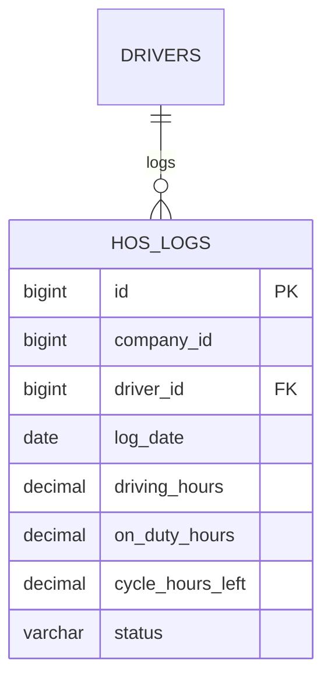
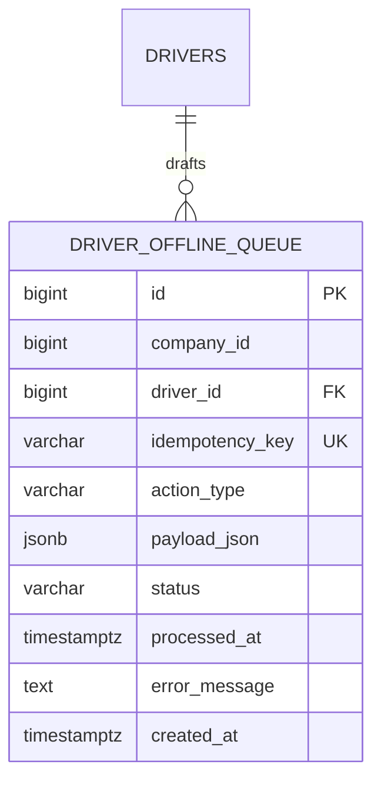
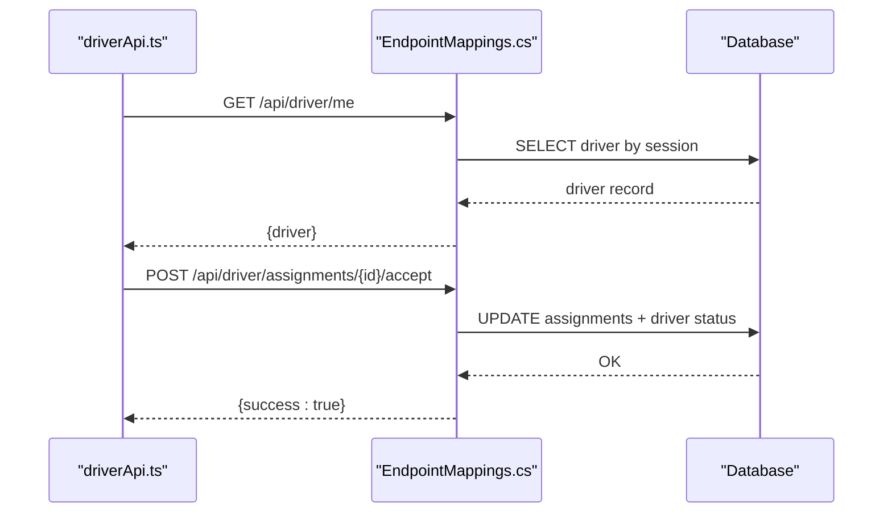
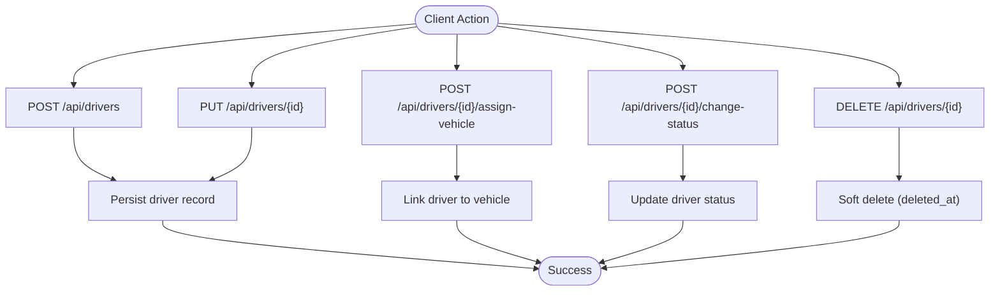
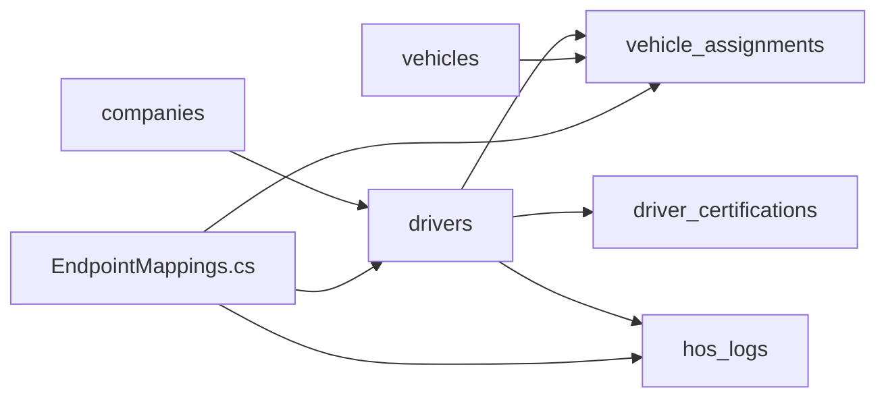

# Drivers Entity

<cite>
**Referenced Files in This Document**
- [001_schema.sql](file://database/init/001_schema.sql)
- [002_seed.sql](file://database/init/002_seed.sql)
- [DriverSchemaService.cs](file://backend-dotnet/Services/DriverSchemaService.cs)
- [EndpointMappings.cs](file://backend-dotnet/Controllers/EndpointMappings.cs)
- [driversApi.ts](file://frontend/src/services/driversApi.ts)
- [driverApi.ts](file://frontend/src/services/driverApi.ts)
- [API_ENDPOINTS.md](file://docs/API_ENDPOINTS.md)
- [DriverWorkflowTests.cs](file://backend-dotnet.Tests/DriverWorkflowTests.cs)
</cite>

## Table of Contents
1. [Introduction](#introduction)
2. [Project Structure](#project-structure)
3. [Core Components](#core-components)
4. [Architecture Overview](#architecture-overview)
5. [Detailed Component Analysis](#detailed-component-analysis)
6. [Dependency Analysis](#dependency-analysis)
7. [Performance Considerations](#performance-considerations)
8. [Troubleshooting Guide](#troubleshooting-guide)
9. [Conclusion](#conclusion)
10. [Appendices](#appendices)

## Introduction
This document provides comprehensive documentation for the Drivers entity in the platform. It covers driver profile management, safety and compliance scoring, assignment relationships, status tracking, and mobile device integration. It also documents driver creation, profile updates, and deletion workflows; explains the scoring algorithms for safety_score, readiness_score, risk_score, and compliance_score; details driver-vehicle assignment via the vehicle_assignments table and driver_certifications for licensing and certifications; and outlines driver status management (Available, On Trip, Off, Terminated), license tracking with expiry dates, and HOS/ELD compliance tracking. Finally, it lists the API endpoints for driver CRUD operations, assignment management, and score calculations.

## Project Structure
The Drivers entity spans database schema, backend controllers, frontend services, and tests. The schema defines core tables and indexes; the backend exposes driver-related endpoints; the frontend provides typed client services; and tests validate workflow and security.

**Diagram sources**
- [001_schema.sql:36-55](file://database/init/001_schema.sql#L36-L55)
- [001_schema.sql:205-227](file://database/init/001_schema.sql#L205-L227)
- [001_schema.sql:427-436](file://database/init/001_schema.sql#L427-L436)
- [EndpointMappings.cs:291-352](file://backend-dotnet/Controllers/EndpointMappings.cs#L291-L352)
- [DriverSchemaService.cs:11-89](file://backend-dotnet/Services/DriverSchemaService.cs#L11-L89)
- [driversApi.ts:5-22](file://frontend/src/services/driversApi.ts#L5-L22)
- [driverApi.ts:7-87](file://frontend/src/services/driverApi.ts#L7-L87)

**Section sources**
- [001_schema.sql:36-55](file://database/init/001_schema.sql#L36-L55)
- [001_schema.sql:205-227](file://database/init/001_schema.sql#L205-L227)
- [001_schema.sql:427-436](file://database/init/001_schema.sql#L427-L436)
- [EndpointMappings.cs:291-352](file://backend-dotnet/Controllers/EndpointMappings.cs#L291-L352)
- [DriverSchemaService.cs:11-89](file://backend-dotnet/Services/DriverSchemaService.cs#L11-L89)
- [driversApi.ts:5-22](file://frontend/src/services/driversApi.ts#L5-L22)
- [driverApi.ts:7-87](file://frontend/src/services/driverApi.ts#L7-L87)

## Core Components
- Drivers table: stores driver profiles, scores, status, license info, and assignment linkage.
- Vehicles and vehicle_assignments: manage driver-vehicle pairing and assignment lifecycle.
- driver_certifications: tracks driver licenses and certifications with expiry dates.
- hos_logs: captures HOS/ELD records per driver per day.
- Backend endpoints: expose driver CRUD, assignment management, status updates, DVIR, coaching, and HOS.
- Frontend services: typed clients for drivers and driver mobile workflows.
- Schema bootstrap service: adds driver-specific columns and offline queue table.

**Section sources**
- [001_schema.sql:36-55](file://database/init/001_schema.sql#L36-L55)
- [001_schema.sql:205-227](file://database/init/001_schema.sql#L205-L227)
- [001_schema.sql:217-227](file://database/init/001_schema.sql#L217-L227)
- [001_schema.sql:427-436](file://database/init/001_schema.sql#L427-L436)
- [EndpointMappings.cs:291-352](file://backend-dotnet/Controllers/EndpointMappings.cs#L291-L352)
- [driversApi.ts:5-22](file://frontend/src/services/driversApi.ts#L5-L22)
- [driverApi.ts:7-87](file://frontend/src/services/driverApi.ts#L7-L87)
- [DriverSchemaService.cs:11-89](file://backend-dotnet/Services/DriverSchemaService.cs#L11-L89)

## Architecture Overview
The Drivers entity integrates with the broader platform through:
- Database schema with foreign keys linking drivers to vehicles and assignments.
- Backend controllers enforcing RBAC and deriving driver identity from authenticated sessions.
- Frontend services calling backend endpoints for driver operations and mobile workflows.
- Tests validating permissions, status transitions, and tenant isolation.

**Diagram sources**
- [driversApi.ts:17-21](file://frontend/src/services/driversApi.ts#L17-L21)
- [EndpointMappings.cs:291-352](file://backend-dotnet/Controllers/EndpointMappings.cs#L291-L352)
- [001_schema.sql:36-55](file://database/init/001_schema.sql#L36-L55)

## Detailed Component Analysis

### Drivers Table and Scoring
- Fields include identification, contact info, license number and expiry, status, and multiple scores: safety_score, readiness_score, risk_score, compliance_score.
- Indexes support filtering by status and risk_score for efficient queries.
- Deletion uses soft-delete semantics via deleted_at.

Scoring overview:
- safety_score: reflects driver safety behavior and incident history.
- readiness_score: reflects availability and preparedness for duty.
- risk_score: quantifies exposure to safety or compliance risks.
- compliance_score: measures adherence to regulations and internal policies.

These scores are persisted in the drivers table and surfaced in summaries and dashboards.

**Section sources**
- [001_schema.sql:36-55](file://database/init/001_schema.sql#L36-L55)
- [001_schema.sql:627-640](file://database/init/001_schema.sql#L627-L640)

### Driver-Vehicle Assignment
- vehicle_assignments pairs drivers and vehicles with assignment_type and status.
- drivers.assigned_vehicle_id maintains reverse linkage for quick access.
- Assignments support primary, relief, and dispatch pairings.

**Diagram sources**
- [001_schema.sql:36-55](file://database/init/001_schema.sql#L36-L55)
- [001_schema.sql:57-79](file://database/init/001_schema.sql#L57-L79)
- [001_schema.sql:205-215](file://database/init/001_schema.sql#L205-L215)

**Section sources**
- [001_schema.sql:205-215](file://database/init/001_schema.sql#L205-L215)
- [001_schema.sql:36-55](file://database/init/001_schema.sql#L36-L55)
- [001_schema.sql:57-79](file://database/init/001_schema.sql#L57-L79)

### Driver Certifications and License Tracking
- driver_certifications stores certification_type, certification_number, status, and expiry_date linked to drivers.
- Supports license tracking and expiry monitoring.

**Diagram sources**
- [001_schema.sql:217-227](file://database/init/001_schema.sql#L217-L227)

**Section sources**
- [001_schema.sql:217-227](file://database/init/001_schema.sql#L217-L227)

### Driver Status Management
- Status values include Available, On Trip, Off, Terminated (soft-deleted via deleted_at).
- Drivers can be assigned to jobs/routes and vehicles; status influences eligibility and visibility.

[No sources needed since this diagram shows conceptual workflow, not actual code structure]

**Section sources**
- [001_schema.sql:36-55](file://database/init/001_schema.sql#L36-L55)

### HOS/ELD Compliance Tracking
- hos_logs captures daily logs per driver including driving hours, on-duty hours, cycle hours left, and compliance status.
- Used to enforce Hours-of-Service limits and generate compliance reports.

**Diagram sources**
- [001_schema.sql:427-436](file://database/init/001_schema.sql#L427-L436)

**Section sources**
- [001_schema.sql:427-436](file://database/init/001_schema.sql#L427-L436)

### Mobile Device Integration and Offline Queue
- driver_offline_queue enables offline-safe drafting for DVIR, proof, exception, and notes.
- Enforces idempotency via idempotency_key and restricts critical state-changing actions from being queued.

**Diagram sources**
- [DriverSchemaService.cs:48-61](file://backend-dotnet/Services/DriverSchemaService.cs#L48-L61)

**Section sources**
- [DriverSchemaService.cs:11-89](file://backend-dotnet/Services/DriverSchemaService.cs#L11-L89)

### Driver Workflows (Mobile)
- driverApi.ts exposes endpoints for identity retrieval, assignments, acceptance, status updates, exception reporting, proof submission, DVIR, coaching tasks, and HOS viewing.
- All driver endpoints derive identity from the authenticated session and never trust payload-supplied driverId.

**Diagram sources**
- [driverApi.ts:9-25](file://frontend/src/services/driverApi.ts#L9-L25)
- [EndpointMappings.cs:295-329](file://backend-dotnet/Controllers/EndpointMappings.cs#L295-L329)

**Section sources**
- [driverApi.ts:7-87](file://frontend/src/services/driverApi.ts#L7-L87)
- [EndpointMappings.cs:291-352](file://backend-dotnet/Controllers/EndpointMappings.cs#L291-L352)

### Driver CRUD and Score Calculation Endpoints
- driversApi.ts provides create, update, delete, and assignment/status mutation endpoints.
- Scores are summarized client-side for dashboard analytics.

**Diagram sources**
- [driversApi.ts:17-21](file://frontend/src/services/driversApi.ts#L17-L21)
- [001_schema.sql:36-55](file://database/init/001_schema.sql#L36-L55)

**Section sources**
- [driversApi.ts:5-22](file://frontend/src/services/driversApi.ts#L5-L22)
- [API_ENDPOINTS.md:11-12](file://docs/API_ENDPOINTS.md#L11-L12)

## Dependency Analysis
- Drivers depend on company_id for tenant isolation and soft-delete semantics.
- Assignments depend on both drivers and vehicles with foreign keys.
- Certifications depend on drivers.
- HOS logs depend on drivers.
- Backend enforces RBAC and tenant scoping for all driver endpoints.

**Diagram sources**
- [001_schema.sql:36-55](file://database/init/001_schema.sql#L36-L55)
- [001_schema.sql:205-227](file://database/init/001_schema.sql#L205-L227)
- [001_schema.sql:217-227](file://database/init/001_schema.sql#L217-L227)
- [001_schema.sql:427-436](file://database/init/001_schema.sql#L427-L436)
- [EndpointMappings.cs:291-352](file://backend-dotnet/Controllers/EndpointMappings.cs#L291-L352)

**Section sources**
- [001_schema.sql:36-55](file://database/init/001_schema.sql#L36-L55)
- [001_schema.sql:205-227](file://database/init/001_schema.sql#L205-L227)
- [001_schema.sql:217-227](file://database/init/001_schema.sql#L217-L227)
- [001_schema.sql:427-436](file://database/init/001_schema.sql#L427-L436)
- [EndpointMappings.cs:291-352](file://backend-dotnet/Controllers/EndpointMappings.cs#L291-L352)

## Performance Considerations
- Indexes on drivers (status, risk_score) and vehicles (status, risk_score) improve filtering and reporting performance.
- Use paginated queries for large fleets and avoid N+1 selects when loading driver details with assignments.
- Batch updates for status changes and assignment updates to reduce round-trips.
- Cache frequently accessed driver summaries and certifications where appropriate.

[No sources needed since this section provides general guidance]

## Troubleshooting Guide
Common issues and resolutions:
- Permission errors: Ensure the Driver role includes driver:self and appropriate scopes for mobile endpoints.
- Identity mismatch: Verify driver identity is derived from session, not payload-supplied driverId.
- Tenant isolation: Confirm queries filter by company_id to prevent cross-tenant access.
- Duplicate offline actions: Idempotency keys prevent duplicate offline drafts.

**Section sources**
- [DriverWorkflowTests.cs:12-61](file://backend-dotnet.Tests/DriverWorkflowTests.cs#L12-L61)
- [DriverWorkflowTests.cs:215-251](file://backend-dotnet.Tests/DriverWorkflowTests.cs#L215-L251)
- [DriverWorkflowTests.cs:152-213](file://backend-dotnet.Tests/DriverWorkflowTests.cs#L152-L213)
- [driverApi.ts:4-5](file://frontend/src/services/driverApi.ts#L4-L5)

## Conclusion
The Drivers entity is central to fleet operations, integrating profile management, scoring, assignments, certifications, and compliance tracking. The backend enforces strict identity and tenant scoping, while the frontend provides robust APIs for both administrative and mobile driver workflows. Proper indexing and caching strategies ensure scalability, and comprehensive tests validate security and correctness.

## Appendices

### API Endpoints Reference
- List drivers: GET /api/drivers
- Create driver: POST /api/drivers
- Update driver: PUT /api/drivers/{id}
- Delete driver: DELETE /api/drivers/{id}
- Assign vehicle: POST /api/drivers/{id}/assign-vehicle
- Change status: POST /api/drivers/{id}/change-status

Mobile endpoints:
- Identity: GET /api/driver/me
- Assignments: GET /api/driver/assignments
- Current assignment: GET /api/driver/assignments/current
- Accept assignment: POST /api/driver/assignments/{id}/accept
- Update status: POST /api/driver/assignments/{id}/status
- Report exception: POST /api/driver/assignments/{id}/exception
- Submit proof: POST /api/driver/assignments/{id}/proof
- DVIR templates: GET /api/driver/dvir/templates
- Submit DVIR: POST /api/driver/dvir
- Coaching: GET /api/driver/coaching
- Acknowledge coaching: POST /api/driver/coaching/{id}/acknowledge
- HOS: GET /api/driver/hos

**Section sources**
- [API_ENDPOINTS.md:11-16](file://docs/API_ENDPOINTS.md#L11-L16)
- [driversApi.ts:17-21](file://frontend/src/services/driversApi.ts#L17-L21)
- [driverApi.ts:9-87](file://frontend/src/services/driverApi.ts#L9-L87)
- [EndpointMappings.cs:291-352](file://backend-dotnet/Controllers/EndpointMappings.cs#L291-L352)