# Fleet Management Entities

<cite>
**Referenced Files in This Document**
- [001_schema.sql](file://database/init/001_schema.sql)
- [001_schema.sql](file://db/init/001_schema.sql)
- [EndpointMappings.cs](file://backend-dotnet/Controllers/EndpointMappings.cs)
- [FleetHealthTests.cs](file://backend-dotnet.Tests/FleetHealthTests.cs)
- [driversApi.ts](file://frontend/src/services/driversApi.ts)
- [vehiclesApi.ts](file://frontend/src/services/vehiclesApi.ts)
- [assetsApi.ts](file://frontend/src/services/assetsApi.ts)
- [documentsApi.ts](file://frontend/src/services/documentsApi.ts)
- [EntityListPage.tsx](file://frontend/src/pages/EntityListPage.tsx)
- [moduleConfig.ts](file://frontend/src/modules/moduleConfig.ts)
- [developmentFleetSeedData.ts](file://frontend/src/data/developmentFleetSeedData.ts)
- [MaintenanceBackgroundService.cs](file://backend-dotnet/Services/MaintenanceBackgroundService.cs)
</cite>

## Table of Contents
1. [Introduction](#introduction)
2. [Project Structure](#project-structure)
3. [Core Components](#core-components)
4. [Architecture Overview](#architecture-overview)
5. [Detailed Component Analysis](#detailed-component-analysis)
6. [Dependency Analysis](#dependency-analysis)
7. [Performance Considerations](#performance-considerations)
8. [Troubleshooting Guide](#troubleshooting-guide)
9. [Conclusion](#conclusion)

## Introduction
This document describes the fleet management entities and their supporting systems for drivers, vehicles, assets, and associated documents. It explains how driver profiles track safety and compliance, how vehicles maintain readiness and integrate with devices, how assets are monitored for utilization and location, and how documents are managed with expiry tracking and status management. It also covers assignment relationships, status tracking, and scoring algorithms used for risk assessment and performance monitoring.

## Project Structure
The fleet domain spans three primary layers:
- Backend services expose fleet APIs and compute risk/readiness scores.
- Database schema defines core entities and document tables.
- Frontend services provide typed client APIs for drivers, vehicles, assets, and documents.

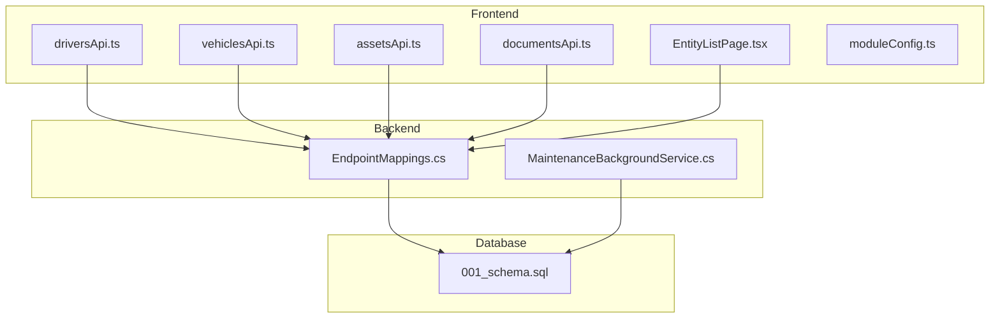

**Diagram sources**
- [driversApi.ts:1-23](file://frontend/src/services/driversApi.ts#L1-L23)
- [vehiclesApi.ts:1-45](file://frontend/src/services/vehiclesApi.ts#L1-L45)
- [assetsApi.ts:1-15](file://frontend/src/services/assetsApi.ts#L1-L15)
- [documentsApi.ts:1-17](file://frontend/src/services/documentsApi.ts#L1-L17)
- [EntityListPage.tsx:99-116](file://frontend/src/pages/EntityListPage.tsx#L99-L116)
- [moduleConfig.ts:84-91](file://frontend/src/modules/moduleConfig.ts#L84-L91)
- [EndpointMappings.cs:1873-2107](file://backend-dotnet/Controllers/EndpointMappings.cs#L1873-L2107)
- [MaintenanceBackgroundService.cs:1-161](file://backend-dotnet/Services/MaintenanceBackgroundService.cs#L1-L161)
- [001_schema.sql:36-141](file://database/init/001_schema.sql#L36-L141)

**Section sources**
- [driversApi.ts:1-23](file://frontend/src/services/driversApi.ts#L1-L23)
- [vehiclesApi.ts:1-45](file://frontend/src/services/vehiclesApi.ts#L1-L45)
- [assetsApi.ts:1-15](file://frontend/src/services/assetsApi.ts#L1-L15)
- [documentsApi.ts:1-17](file://frontend/src/services/documentsApi.ts#L1-L17)
- [EntityListPage.tsx:99-116](file://frontend/src/pages/EntityListPage.tsx#L99-L116)
- [moduleConfig.ts:84-91](file://frontend/src/modules/moduleConfig.ts#L84-L91)
- [EndpointMappings.cs:1873-2107](file://backend-dotnet/Controllers/EndpointMappings.cs#L1873-L2107)
- [MaintenanceBackgroundService.cs:1-161](file://backend-dotnet/Services/MaintenanceBackgroundService.cs#L1-L161)
- [001_schema.sql:36-141](file://database/init/001_schema.sql#L36-L141)

## Core Components
- Drivers: identity, contact, license, status, and composite scores (safety, readiness, risk, compliance). Assigned to vehicles via foreign keys.
- Vehicles: identity, specs, status, readiness, data quality, risk, device statuses, and driver assignment.
- Assets: identity, type, status, location, assignment to vehicle/driver/customer, utilization and risk scores.
- Documents: per-entity document tables for vehicles, drivers, and assets with type, name, status, expiry, and timestamps.
- Assignments: driver-to-vehicle relationships with type and status.
- Certifications: driver-specific certifications with type, number, status, expiry.
- Timeline and events: centralized entity timeline and safety/device-related events.

**Section sources**
- [001_schema.sql:36-141](file://database/init/001_schema.sql#L36-L141)
- [001_schema.sql:26-74](file://db/init/001_schema.sql#L26-L74)

## Architecture Overview
The backend exposes fleet endpoints that query and summarize data from the database. Risk and readiness scores are computed server-side and mirrored in tests. Frontend services wrap HTTP calls to these endpoints and present summaries and recommendations.

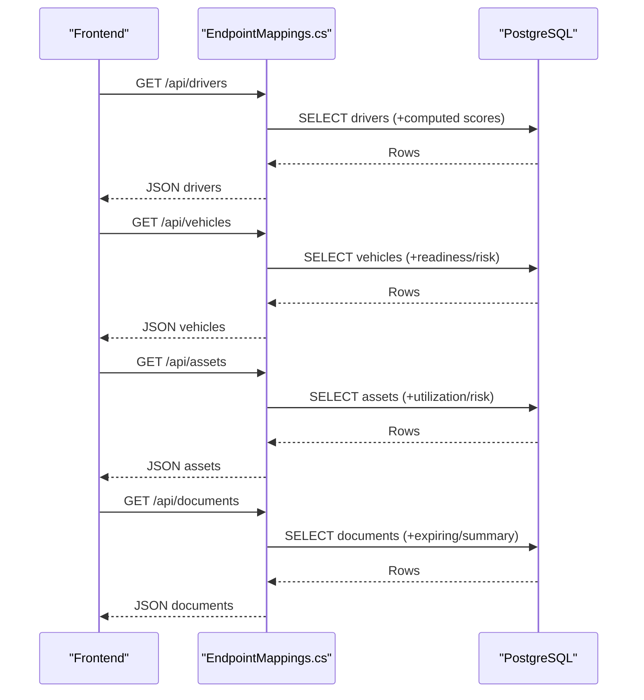

**Diagram sources**
- [EndpointMappings.cs:1873-2107](file://backend-dotnet/Controllers/EndpointMappings.cs#L1873-L2107)
- [driversApi.ts:6-13](file://frontend/src/services/driversApi.ts#L6-L13)
- [vehiclesApi.ts:6-13](file://frontend/src/services/vehiclesApi.ts#L6-L13)
- [assetsApi.ts:5-12](file://frontend/src/services/assetsApi.ts#L5-L12)
- [documentsApi.ts:5-11](file://frontend/src/services/documentsApi.ts#L5-L11)

## Detailed Component Analysis

### Drivers
- Profile fields include identity, contact, license info, status, and composite scores.
- Assignment relationship: optional foreign key to vehicles.
- Readiness score derived from multiple inputs and surfaced in summaries.
- Eligibility checks consider safety score thresholds and HOS availability.

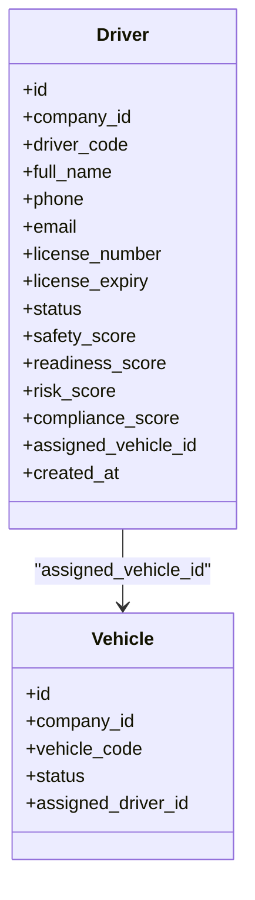

**Diagram sources**
- [001_schema.sql:36-55](file://database/init/001_schema.sql#L36-L55)
- [001_schema.sql:57-82](file://database/init/001_schema.sql#L57-L82)

**Section sources**
- [001_schema.sql:36-55](file://database/init/001_schema.sql#L36-L55)
- [EndpointMappings.cs:9500-9591](file://backend-dotnet/Controllers/EndpointMappings.cs#L9500-L9591)
- [driversApi.ts:7-13](file://frontend/src/services/driversApi.ts#L7-L13)
- [EntityListPage.tsx:99-116](file://frontend/src/pages/EntityListPage.tsx#L99-L116)

### Vehicles
- Identity, specs, status, odometer, readiness, data quality, risk, device statuses, and driver assignment.
- Readiness and risk scores are used for fleet summaries and dispatch eligibility.
- Device offline status influences risk and readiness assessments.

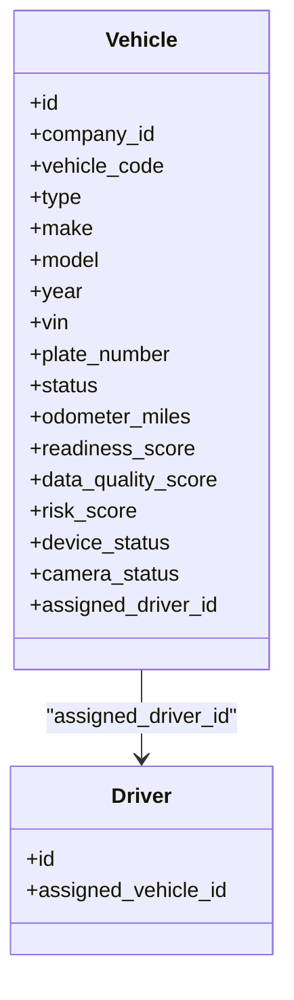

**Diagram sources**
- [001_schema.sql:57-79](file://database/init/001_schema.sql#L57-L79)
- [001_schema.sql:80-82](file://database/init/001_schema.sql#L80-L82)

**Section sources**
- [001_schema.sql:57-79](file://database/init/001_schema.sql#L57-L79)
- [EndpointMappings.cs:1873-1883](file://backend-dotnet/Controllers/EndpointMappings.cs#L1873-L1883)
- [vehiclesApi.ts:7-13](file://frontend/src/services/vehiclesApi.ts#L7-L13)
- [developmentFleetSeedData.ts:668-673](file://frontend/src/data/developmentFleetSeedData.ts#L668-L673)

### Assets
- Identity, type, status, location, assignment to vehicle/driver/customer, utilization and risk scores.
- Geographic monitoring via current zone and geofence status.

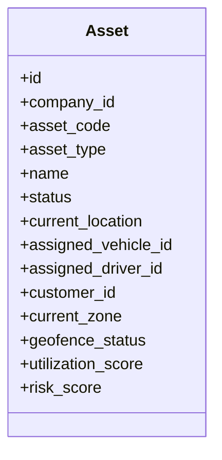

**Diagram sources**
- [001_schema.sql:119-141](file://database/init/001_schema.sql#L119-L141)

**Section sources**
- [001_schema.sql:119-141](file://database/init/001_schema.sql#L119-L141)
- [assetsApi.ts:1-15](file://frontend/src/services/assetsApi.ts#L1-L15)

### Documents
- Vehicle, driver, and asset document tables with type, name, status, expiry, and timestamps.
- Document summaries include expiring/expired counts, compliance categories, and renewal indicators.

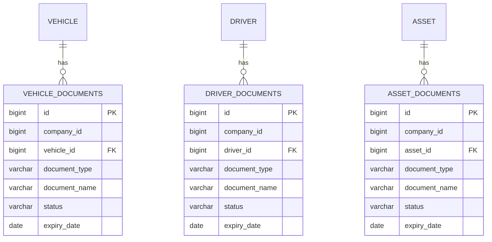

**Diagram sources**
- [001_schema.sql:143-203](file://database/init/001_schema.sql#L143-L203)

**Section sources**
- [001_schema.sql:143-203](file://database/init/001_schema.sql#L143-L203)
- [EndpointMappings.cs:3545-3558](file://backend-dotnet/Controllers/EndpointMappings.cs#L3545-L3558)
- [documentsApi.ts:1-17](file://frontend/src/services/documentsApi.ts#L1-L17)

### Assignments and Certifications
- Driver-to-vehicle assignments track type and status with timestamps.
- Driver certifications include type, number, status, and expiry.

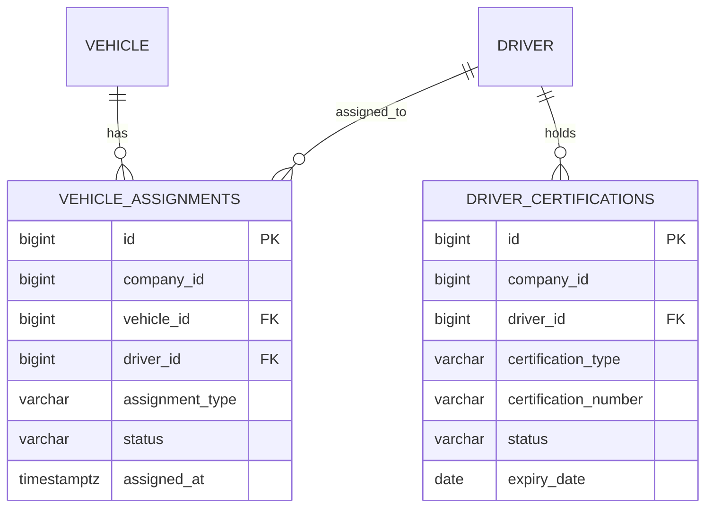

**Diagram sources**
- [001_schema.sql:205-227](file://database/init/001_schema.sql#L205-L227)

**Section sources**
- [001_schema.sql:205-227](file://database/init/001_schema.sql#L205-L227)
- [EntityListPage.tsx:115-116](file://frontend/src/pages/EntityListPage.tsx#L115-L116)

### Status Tracking and Timeline Events
- Centralized timeline events capture entity updates with severity and timestamps.
- Jobs and routes reflect status transitions and operational events.

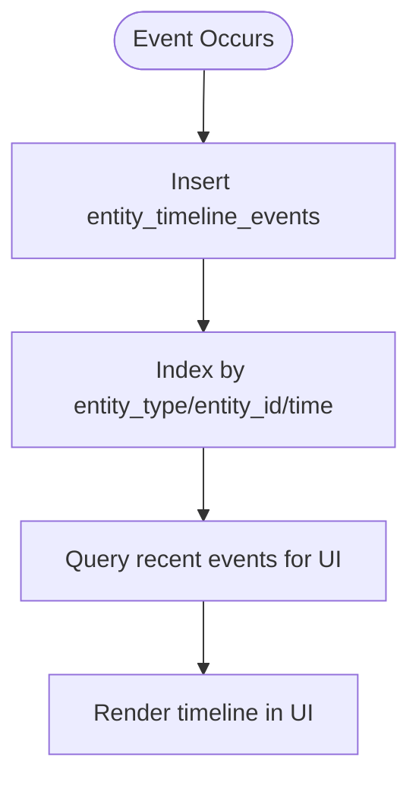

**Diagram sources**
- [001_schema.sql:229-240](file://database/init/001_schema.sql#L229-L240)

**Section sources**
- [001_schema.sql:229-240](file://database/init/001_schema.sql#L229-L240)

### Scoring Algorithms and Risk Assessment
- Vehicle risk score computation considers out-of-service flags, critical defects, active faults, overdue PM, open work orders, and device offline status.
- Driver risk score computation considers safety score bands, open safety events, overdue coaching, and base risk.
- Dispatch eligibility combines driver safety, HOS availability, safety events, and vehicle readiness/risk.

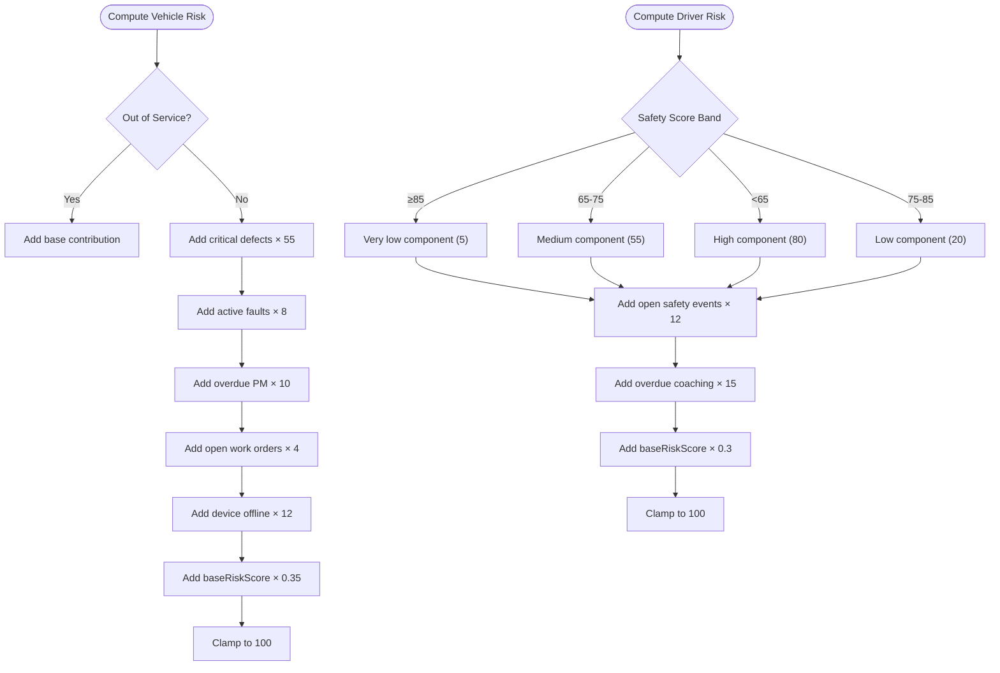

**Diagram sources**
- [EndpointMappings.cs:13518-13554](file://backend-dotnet/Controllers/EndpointMappings.cs#L13518-L13554)
- [FleetHealthTests.cs:15-118](file://backend-dotnet.Tests/FleetHealthTests.cs#L15-L118)
- [FleetHealthTests.cs:120-194](file://backend-dotnet.Tests/FleetHealthTests.cs#L120-L194)

**Section sources**
- [EndpointMappings.cs:13518-13554](file://backend-dotnet/Controllers/EndpointMappings.cs#L13518-L13554)
- [FleetHealthTests.cs:15-118](file://backend-dotnet.Tests/FleetHealthTests.cs#L15-L118)
- [FleetHealthTests.cs:120-194](file://backend-dotnet.Tests/FleetHealthTests.cs#L120-L194)

### Dispatch Eligibility and Recommendations
- Eligibility checks driver status, safety score thresholds, HOS availability, and safety events.
- Recommended actions include maintenance reviews, driver assignments, and device health checks.
- Match score balances driver safety, vehicle readiness, and vehicle risk.

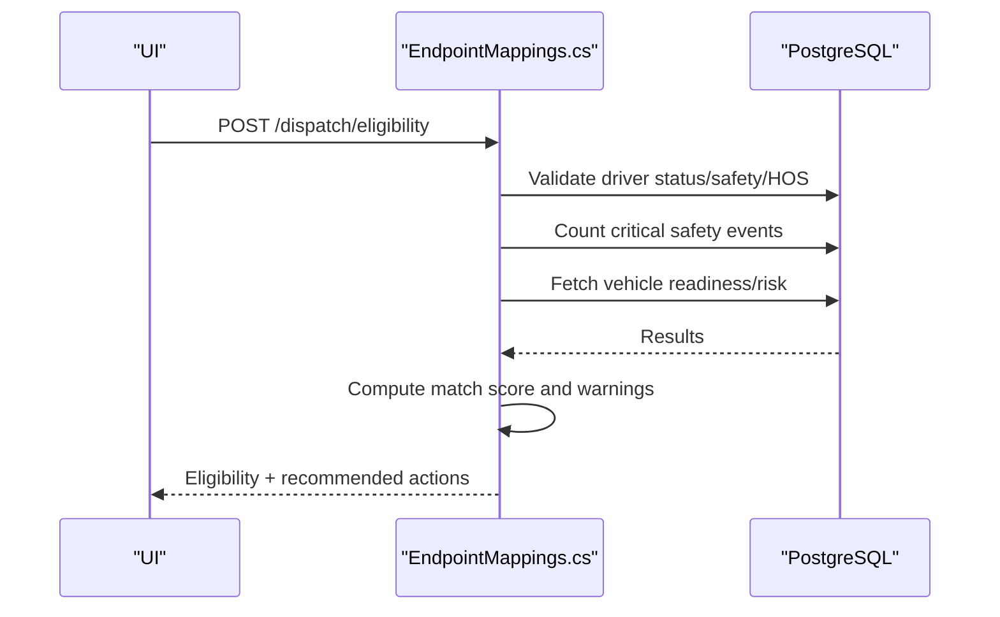

**Diagram sources**
- [EndpointMappings.cs:9500-9591](file://backend-dotnet/Controllers/EndpointMappings.cs#L9500-L9591)
- [EndpointMappings.cs:4483-4493](file://backend-dotnet/Controllers/EndpointMappings.cs#L4483-L4493)

**Section sources**
- [EndpointMappings.cs:9500-9591](file://backend-dotnet/Controllers/EndpointMappings.cs#L9500-L9591)
- [EndpointMappings.cs:4483-4493](file://backend-dotnet/Controllers/EndpointMappings.cs#L4483-L4493)

### Maintenance Automation and Lifecycle Planning
- Background service evaluates preventive maintenance schedules and creates maintenance items when thresholds are met.
- Updates risk and priority for overdue or critical items.

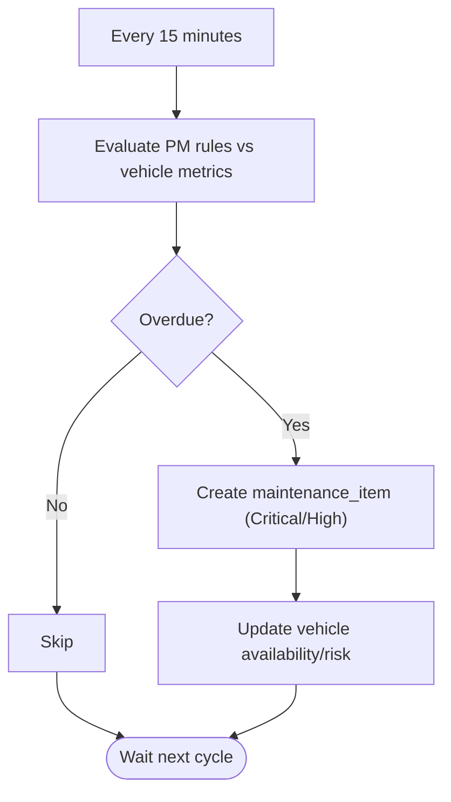

**Diagram sources**
- [MaintenanceBackgroundService.cs:18-161](file://backend-dotnet/Services/MaintenanceBackgroundService.cs#L18-L161)

**Section sources**
- [MaintenanceBackgroundService.cs:18-161](file://backend-dotnet/Services/MaintenanceBackgroundService.cs#L18-L161)

## Dependency Analysis
- Drivers and vehicles share a bidirectional assignment via foreign keys.
- Documents are polymorphic per-entity via dedicated tables.
- Frontend services depend on backend endpoints for fleet data and recommendations.
- Risk computations are validated by unit tests and mirrored in SQL views.

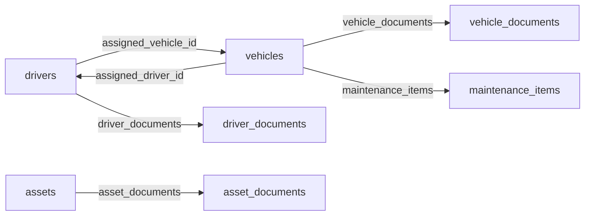

**Diagram sources**
- [001_schema.sql:80-82](file://database/init/001_schema.sql#L80-L82)
- [001_schema.sql:143-203](file://database/init/001_schema.sql#L143-L203)
- [001_schema.sql:349-370](file://database/init/001_schema.sql#L349-L370)

**Section sources**
- [001_schema.sql:80-82](file://database/init/001_schema.sql#L80-L82)
- [001_schema.sql:143-203](file://database/init/001_schema.sql#L143-L203)
- [001_schema.sql:349-370](file://database/init/001_schema.sql#L349-L370)

## Performance Considerations
- Database indexes support common queries for drivers, vehicles, assets, and document lookups.
- Computation-heavy risk calculations are deterministic and test-backed to avoid regressions.
- Frontend summaries aggregate scores client-side to reduce backend load.

[No sources needed since this section provides general guidance]

## Troubleshooting Guide
- Driver eligibility warnings indicate safety score below threshold or insufficient HOS hours; overrides may be required.
- Vehicle risk score spikes due to critical defects, overdue PM, or offline devices; investigate maintenance and device health.
- Document expiring/expired counts highlight compliance gaps; reconcile renewals and re-upload.
- Timeline events help trace status changes and recent activity.

**Section sources**
- [EndpointMappings.cs:9500-9591](file://backend-dotnet/Controllers/EndpointMappings.cs#L9500-L9591)
- [EndpointMappings.cs:3545-3558](file://backend-dotnet/Controllers/EndpointMappings.cs#L3545-L3558)
- [moduleConfig.ts:84-91](file://frontend/src/modules/moduleConfig.ts#L84-L91)

## Conclusion
The fleet management system integrates driver, vehicle, and asset entities with robust scoring and document management. Risk and readiness algorithms inform dispatch decisions and lifecycle planning, while front-end services deliver actionable summaries and recommendations. The schema and backend services provide a solid foundation for compliance, safety, and operational excellence.