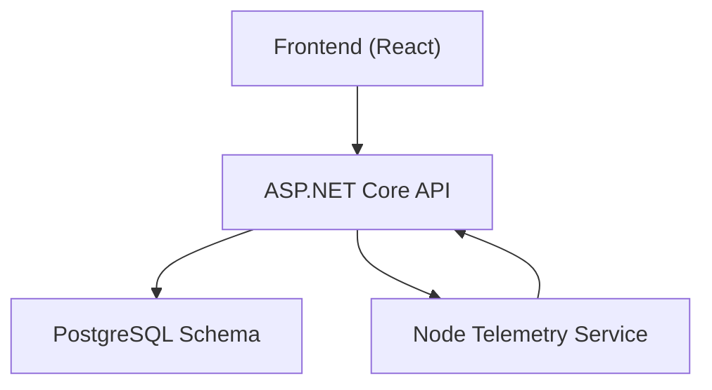
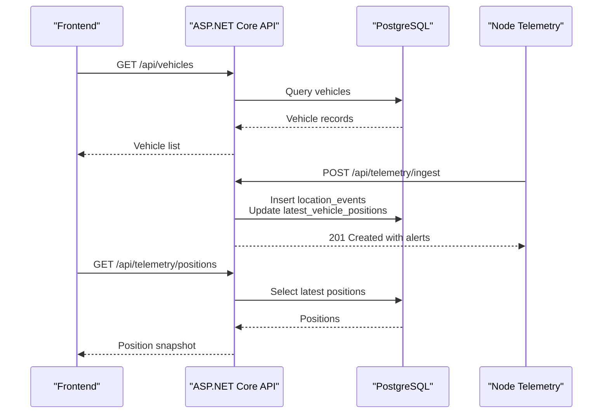
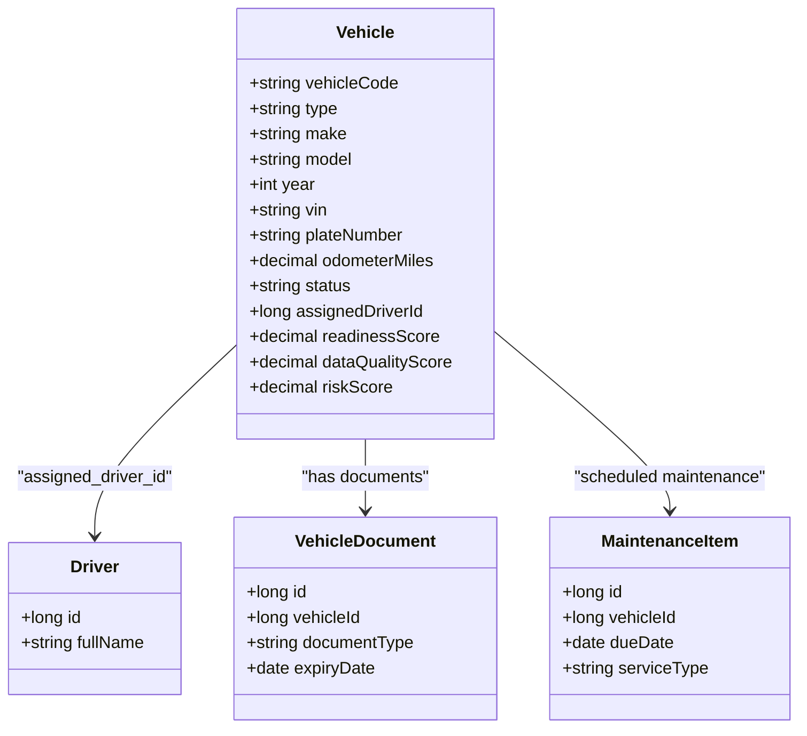
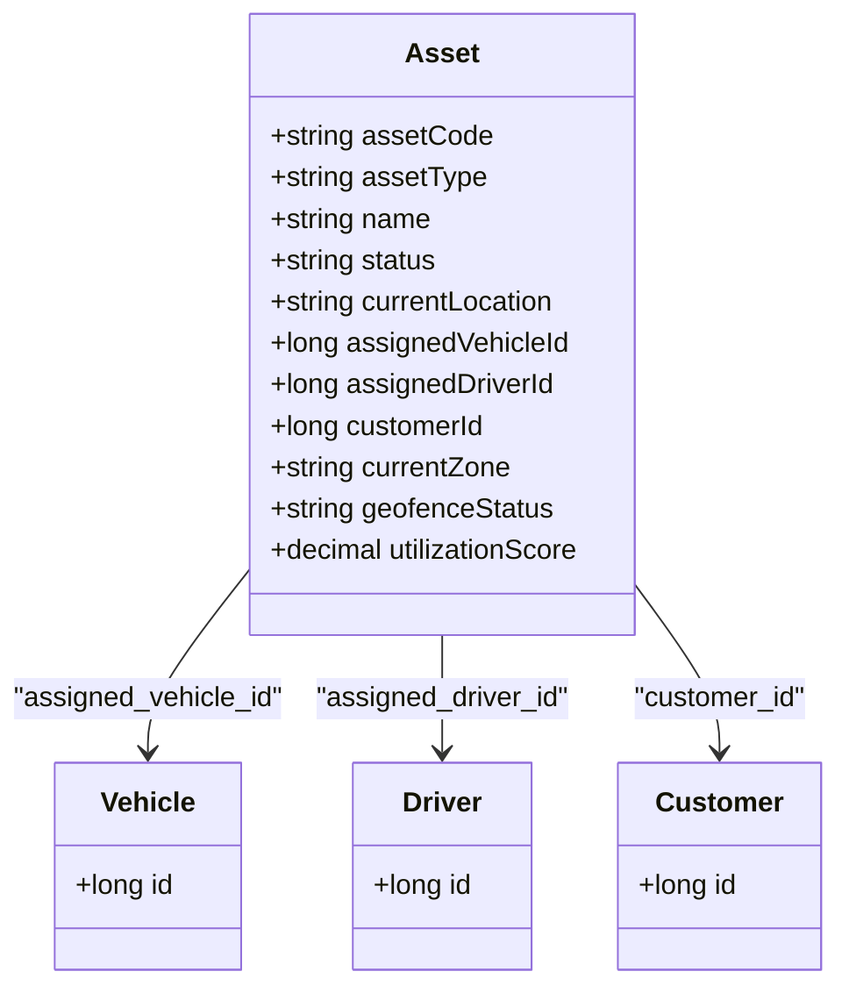
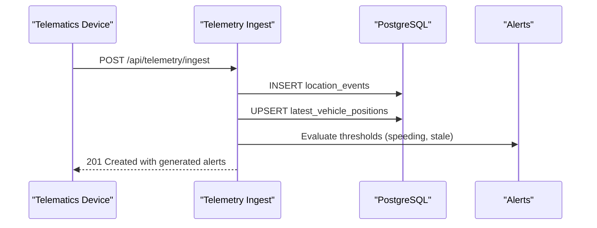
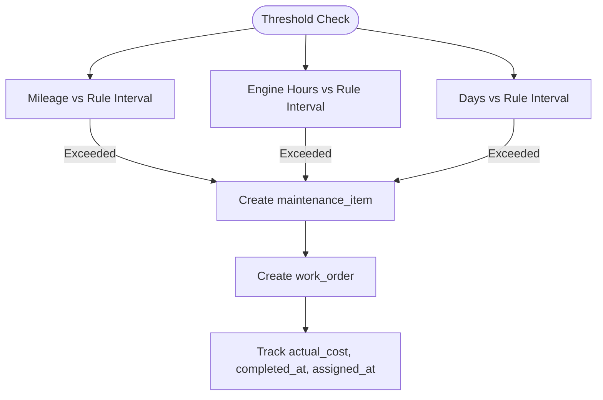
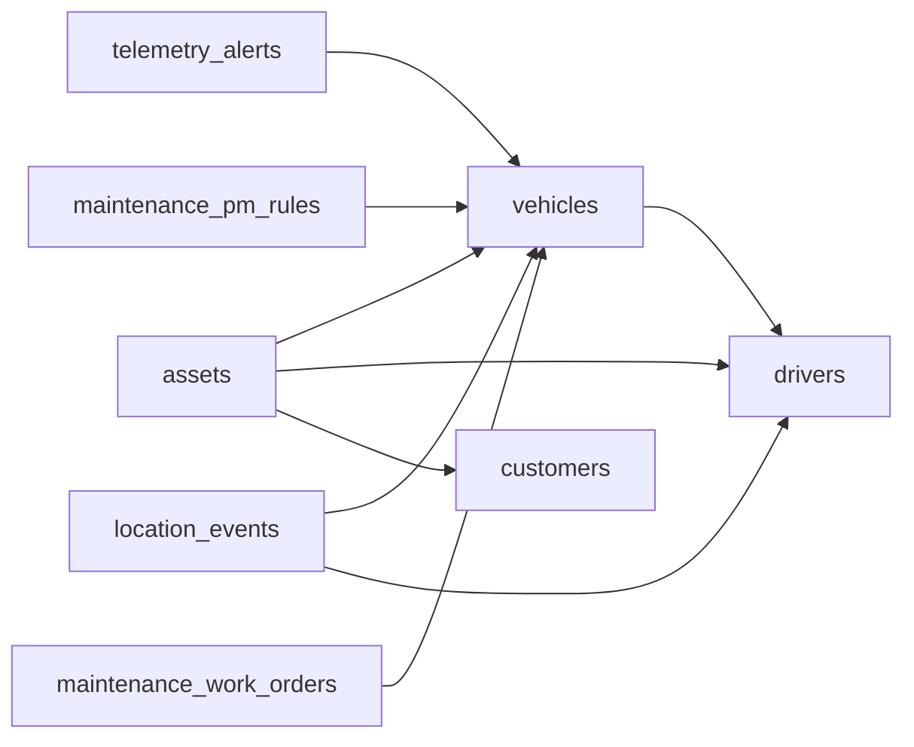

# Vehicles and Assets Entity

<cite>
**Referenced Files in This Document**
- [README.md](file://README.md)
- [EndpointMappings.cs](file://backend-dotnet/Controllers/EndpointMappings.cs)
- [001_schema.sql](file://db/init/001_schema.sql)
- [002_seed.sql](file://db/init/002_seed.sql)
- [vehiclesApi.ts](file://frontend/src/services/vehiclesApi.ts)
- [assetsApi.ts](file://frontend/src/services/assetsApi.ts)
- [telemetry.routes.ts](file://backend/src/modules/telemetry/telemetry.routes.ts)
- [TelemetrySchemaService.cs](file://backend-dotnet/Services/TelemetrySchemaService.cs)
- [MaintenanceSchemaService.cs](file://backend-dotnet/Services/MaintenanceSchemaService.cs)
- [EntityListPage.tsx](file://frontend/src/pages/EntityListPage.tsx)
- [telematicsSeedData.ts](file://frontend/src/data/telematicsSeedData.ts)
- [IotDevicesPage.tsx](file://frontend/src/pages/IotDevicesPage.tsx)
- [ControlTowerPage.tsx](file://frontend/src/pages/ControlTowerPage.tsx)
- [device.registry.ts](file://backend/src/modules/devices/device.registry.ts)
</cite>

## Table of Contents
1. [Introduction](#introduction)
2. [Project Structure](#project-structure)
3. [Core Components](#core-components)
4. [Architecture Overview](#architecture-overview)
5. [Detailed Component Analysis](#detailed-component-analysis)
6. [Dependency Analysis](#dependency-analysis)
7. [Performance Considerations](#performance-considerations)
8. [Troubleshooting Guide](#troubleshooting-guide)
9. [Conclusion](#conclusion)

## Introduction
This document describes the vehicles and assets entity implementation in the platform, focusing on asset tracking, utilization scoring, geographic monitoring, and lifecycle management. It explains how vehicles are modeled with attributes such as make, model, year, VIN, and plate numbers, how assets are tracked with current_zone and utilization_score, and how geographic monitoring integrates with GPS telemetry and geofencing. It also covers readiness_score computation, maintenance scheduling, work order integration, device_status monitoring for telematics, and camera_status for dashcams.

## Project Structure
The solution comprises:
- A C# ASP.NET Core backend exposing REST endpoints for vehicles, assets, telemetry, and maintenance.
- A PostgreSQL schema defining entities and relationships.
- A React frontend with TypeScript that consumes APIs and renders dashboards for fleet, assets, and IoT devices.
- A Node.js telemetry ingestion module for event streaming and alerts.

**Diagram sources**
- [README.md:117-142](file://README.md#L117-L142)
- [EndpointMappings.cs:19-78](file://backend-dotnet/Controllers/EndpointMappings.cs#L19-L78)

**Section sources**
- [README.md:117-142](file://README.md#L117-L142)
- [EndpointMappings.cs:19-78](file://backend-dotnet/Controllers/EndpointMappings.cs#L19-L78)

## Core Components
- Vehicles: Core fleet asset with lifecycle status, driver assignment, odometer, inspection dates, and readiness metrics.
- Assets: Equipment and tools with current_location, current_zone, utilization_score, and assignment to vehicles.
- Telemetry: Real-time GPS and device health ingestion with alerts and position snapshots.
- Maintenance: Preventive maintenance rules, work orders, and fault codes linked to vehicles and devices.
- Devices: OBD-II, J1939/CAN, GPS tracker, dashcam, and temperature sensor device types with capabilities.

**Section sources**
- [001_schema.sql:42-74](file://db/init/001_schema.sql#L42-L74)
- [EndpointMappings.cs:40-50](file://backend-dotnet/Controllers/EndpointMappings.cs#L40-L50)
- [EndpointMappings.cs:131-151](file://backend-dotnet/Controllers/EndpointMappings.cs#L131-L151)
- [telemetry.routes.ts:1-58](file://backend/src/modules/telemetry/telemetry.routes.ts#L1-L58)
- [MaintenanceSchemaService.cs:104-123](file://backend-dotnet/Services/MaintenanceSchemaService.cs#L104-L123)
- [device.registry.ts:3-31](file://backend/src/modules/devices/device.registry.ts#L3-L31)

## Architecture Overview
The system integrates frontend dashboards with backend endpoints and a telemetry pipeline. Vehicles and assets are persisted in the database and surfaced via REST endpoints. Telemetry events are ingested, validated, and stored, generating alerts and updating position snapshots. Maintenance workflows tie into work orders and fault codes.

**Diagram sources**
- [EndpointMappings.cs:40-50](file://backend-dotnet/Controllers/EndpointMappings.cs#L40-L50)
- [EndpointMappings.cs:52-62](file://backend-dotnet/Controllers/EndpointMappings.cs#L52-L62)
- [EndpointMappings.cs:6905-6920](file://backend-dotnet/Controllers/EndpointMappings.cs#L6905-L6920)
- [TelemetrySchemaService.cs:44-63](file://backend-dotnet/Services/TelemetrySchemaService.cs#L44-L63)

## Detailed Component Analysis

### Vehicles Entity
- Attributes: vehicle_code, type, make, model, year, vin, plate_number, odometer_miles, status, assigned_driver_id.
- Lifecycle: Acquisition (create/update), registration (plate/vin), maintenance scheduling, status changes, and decommissioning (soft delete).
- Readiness score: Computed as the average of readiness_score, data_quality_score, and (100 - risk_score) for fleet insights.
- Driver assignment: POST endpoints to assign driver or change status.
- Documents and maintenance: Vehicle detail includes associated documents and upcoming maintenance items.

**Diagram sources**
- [001_schema.sql:42-59](file://db/init/001_schema.sql#L42-L59)
- [EndpointMappings.cs:2086-2100](file://backend-dotnet/Controllers/EndpointMappings.cs#L2086-L2100)

**Section sources**
- [001_schema.sql:42-59](file://db/init/001_schema.sql#L42-L59)
- [EndpointMappings.cs:40-50](file://backend-dotnet/Controllers/EndpointMappings.cs#L40-L50)
- [EndpointMappings.cs:2086-2100](file://backend-dotnet/Controllers/EndpointMappings.cs#L2086-L2100)
- [vehiclesApi.ts:5-44](file://frontend/src/services/vehiclesApi.ts#L5-L44)

### Assets Entity
- Attributes: asset_code, asset_type, name, status, current_location, assigned_vehicle_id, assigned_driver_id, customer_id, current_zone, geofence_status, utilization_score.
- Lifecycle: Creation, assignment to vehicles/drivers/customers, status updates, and soft deletion.
- Utilization scoring: utilization_score field supports asset productivity analytics.
- Geographic monitoring: current_zone and geofence_status enable location-aware operations.

**Diagram sources**
- [001_schema.sql:119-132](file://db/init/001_schema.sql#L119-L132)

**Section sources**
- [001_schema.sql:119-132](file://db/init/001_schema.sql#L119-L132)
- [EndpointMappings.cs:131-151](file://backend-dotnet/Controllers/EndpointMappings.cs#L131-L151)
- [assetsApi.ts:4-14](file://frontend/src/services/assetsApi.ts#L4-L14)
- [EntityListPage.tsx:171-187](file://frontend/src/pages/EntityListPage.tsx#L171-L187)

### Telemetry and Geographic Monitoring
- Ingestion: POST /api/telemetry/ingest validates device signatures and inserts location_events, updates latest_vehicle_positions, and generates alerts.
- Streaming: SSE via /api/telemetry/stream with short-lived tickets.
- Position snapshot: GET /api/telemetry/positions returns latest positions.
- Rules: Telemetry rules define thresholds (e.g., speeding) and stale device detection.
- Alerts: Open/closed/acknowledged/resolved lifecycle with severity and source.

**Diagram sources**
- [EndpointMappings.cs:52-62](file://backend-dotnet/Controllers/EndpointMappings.cs#L52-L62)
- [EndpointMappings.cs:6905-6920](file://backend-dotnet/Controllers/EndpointMappings.cs#L6905-L6920)
- [TelemetrySchemaService.cs:65-82](file://backend-dotnet/Services/TelemetrySchemaService.cs#L65-L82)

**Section sources**
- [EndpointMappings.cs:52-62](file://backend-dotnet/Controllers/EndpointMappings.cs#L52-L62)
- [EndpointMappings.cs:6905-6920](file://backend-dotnet/Controllers/EndpointMappings.cs#L6905-L6920)
- [TelemetrySchemaService.cs:44-63](file://backend-dotnet/Services/TelemetrySchemaService.cs#L44-L63)

### Maintenance and Work Order Integration
- Preventive maintenance rules: maintenance_pm_rules define triggers (mileage, engine hours, days) and priorities.
- Fault codes: fault_codes table ingests codes from devices with severity and status tracking.
- Work orders: maintenance_work_orders link to vehicles, include due dates and costs, and track lifecycle timestamps.

**Diagram sources**
- [MaintenanceSchemaService.cs:104-123](file://backend-dotnet/Services/MaintenanceSchemaService.cs#L104-L123)
- [MaintenanceSchemaService.cs:80-99](file://backend-dotnet/Services/MaintenanceSchemaService.cs#L80-L99)
- [001_schema.sql:158-172](file://db/init/001_schema.sql#L158-L172)

**Section sources**
- [MaintenanceSchemaService.cs:104-123](file://backend-dotnet/Services/MaintenanceSchemaService.cs#L104-L123)
- [MaintenanceSchemaService.cs:80-99](file://backend-dotnet/Services/MaintenanceSchemaService.cs#L80-L99)
- [001_schema.sql:158-172](file://db/init/001_schema.sql#L158-L172)

### Device Types and Capabilities
- OBD-II/J1939/CAN: Engine diagnostics, RPM, fuel, DTCs.
- GPS tracker: Location, speed, ignition, geofence.
- Dashcam: Video capture, harsh braking, distraction detection.
- Temperature sensor: Cold chain monitoring.

**Section sources**
- [device.registry.ts:3-31](file://backend/src/modules/devices/device.registry.ts#L3-L31)

### Readiness Score Calculation
- Vehicles expose readiness_score, data_quality_score, and risk_score; fleet_readiness_score is computed client-side as the average of these three metrics.
- The backend computes fleet_readiness_score for vehicle detail views.

**Section sources**
- [EndpointMappings.cs:2086-2091](file://backend-dotnet/Controllers/EndpointMappings.cs#L2086-L2091)
- [vehiclesApi.ts:7-13](file://frontend/src/services/vehiclesApi.ts#L7-L13)

### Asset Utilization and Current Zone Management
- Assets include utilization_score and current_zone fields to support productivity and location-aware policies.
- Asset list page displays utilization, geofence exceptions, and assignment status.

**Section sources**
- [001_schema.sql:125-132](file://db/init/001_schema.sql#L125-L132)
- [EntityListPage.tsx:171-187](file://frontend/src/pages/EntityListPage.tsx#L171-L187)

### Vehicle-Asset-Driver Assignment Relationships
- Vehicles can be assigned drivers; assets can be assigned to vehicles and drivers; jobs and routes reference assigned vehicles and drivers.
- These relationships enable end-to-end tracking from assignments to trips.

**Section sources**
- [001_schema.sql:42-59](file://db/init/001_schema.sql#L42-L59)
- [001_schema.sql:61-74](file://db/init/001_schema.sql#L61-L74)
- [001_schema.sql:76-95](file://db/init/001_schema.sql#L76-L95)
- [001_schema.sql:97-110](file://db/init/001_schema.sql#L97-L110)

### Reverse-Geocoding for Location-Based Services
- The telemetry ingestion pipeline stores lat/lng and inserts location_events; downstream UI surfaces locations and zones for actionable insights.
- While reverse-geocoding is not explicitly implemented in the referenced files, the presence of lat/lng and current_zone fields indicates a foundation for location-aware features.

**Section sources**
- [EndpointMappings.cs:6905-6920](file://backend-dotnet/Controllers/EndpointMappings.cs#L6905-L6920)
- [001_schema.sql:125-132](file://db/init/001_schema.sql#L125-L132)

### Device Status Monitoring (Telematics) and Camera Status (Dashcams)
- Device connection status, signal strength, firmware, and health are managed in the frontend and reflected in dashboards.
- Telemetry rules and alerts inform device health and camera recording status.

**Section sources**
- [telematicsSeedData.ts:196-213](file://frontend/src/data/telematicsSeedData.ts#L196-L213)
- [IotDevicesPage.tsx:381-386](file://frontend/src/pages/IotDevicesPage.tsx#L381-L386)
- [ControlTowerPage.tsx:220-231](file://frontend/src/pages/ControlTowerPage.tsx#L220-L231)

## Dependency Analysis
- Vehicles and assets depend on tenants for scoping and drivers/vehicles for assignment.
- Telemetry depends on devices and rules; alerts depend on telemetry events.
- Maintenance depends on vehicles and PM rules; work orders depend on maintenance items.

**Diagram sources**
- [001_schema.sql:42-74](file://db/init/001_schema.sql#L42-L74)
- [001_schema.sql:126-144](file://db/init/001_schema.sql#L126-L144)
- [001_schema.sql:158-172](file://db/init/001_schema.sql#L158-L172)
- [TelemetrySchemaService.cs:65-82](file://backend-dotnet/Services/TelemetrySchemaService.cs#L65-L82)

**Section sources**
- [001_schema.sql:42-74](file://db/init/001_schema.sql#L42-L74)
- [001_schema.sql:126-144](file://db/init/001_schema.sql#L126-L144)
- [001_schema.sql:158-172](file://db/init/001_schema.sql#L158-L172)
- [TelemetrySchemaService.cs:65-82](file://backend-dotnet/Services/TelemetrySchemaService.cs#L65-L82)

## Performance Considerations
- Indexes on frequently queried columns (e.g., location_events, telemetry_alerts, latest_vehicle_positions) improve read performance.
- Background services prune stale telemetry nonces and compute device health to reduce alert noise.
- Client-side aggregation (e.g., fleet readiness score) reduces backend load for dashboard summaries.

[No sources needed since this section provides general guidance]

## Troubleshooting Guide
- Telemetry ingestion failures: Verify device provisioning, HMAC signature, and nonce uniqueness; check telemetry rules thresholds.
- Stale device alerts: Confirm device heartbeat and network connectivity; adjust stale_device thresholds.
- Missing positions: Ensure latest_vehicle_positions is being updated after ingest; validate device assignment.
- Maintenance gaps: Review maintenance_pm_rules and work order statuses; confirm overdue thresholds.

**Section sources**
- [TelemetrySchemaService.cs:84-93](file://backend-dotnet/Services/TelemetrySchemaService.cs#L84-L93)
- [EndpointMappings.cs:6900-6903](file://backend-dotnet/Controllers/EndpointMappings.cs#L6900-L6903)
- [MaintenanceSchemaService.cs:104-123](file://backend-dotnet/Services/MaintenanceSchemaService.cs#L104-L123)

## Conclusion
The platform provides a robust foundation for managing vehicles and assets with integrated telemetry, maintenance workflows, and location-aware features. Vehicles and assets are modeled with lifecycle-aware attributes, while telemetry and alerts enable real-time monitoring. Maintenance rules and work orders streamline preventive care, and device capabilities support diverse telematics and safety use cases.