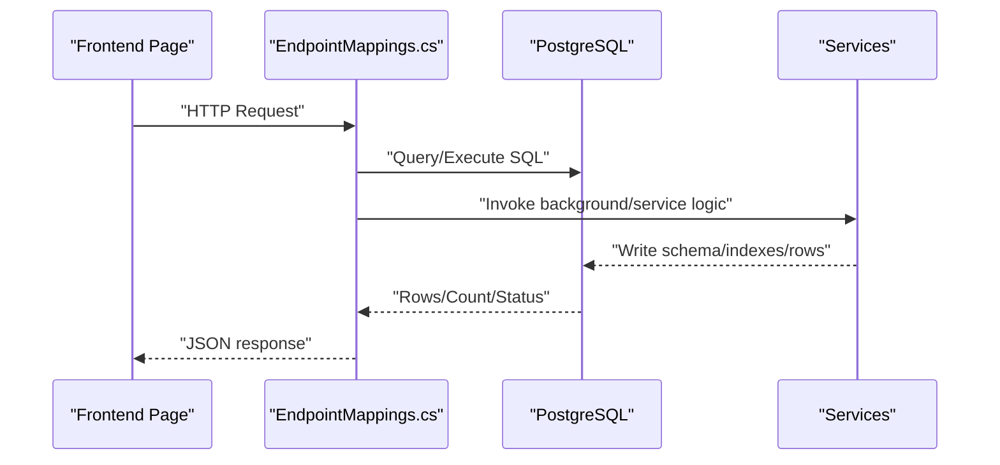
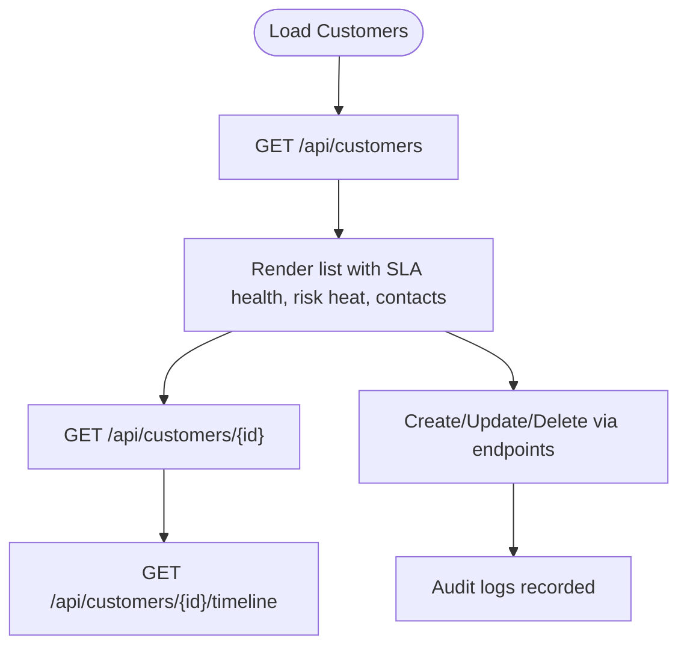
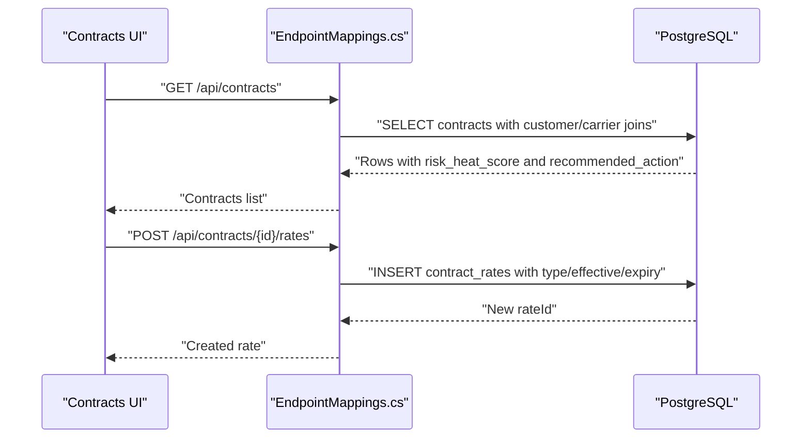
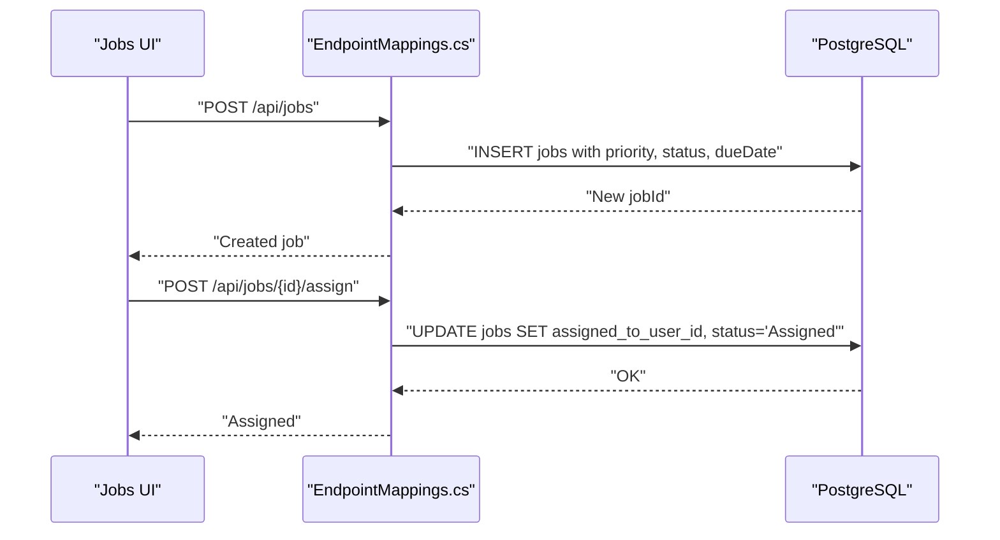
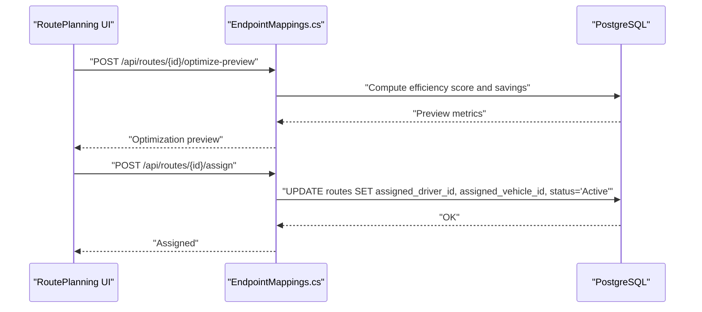
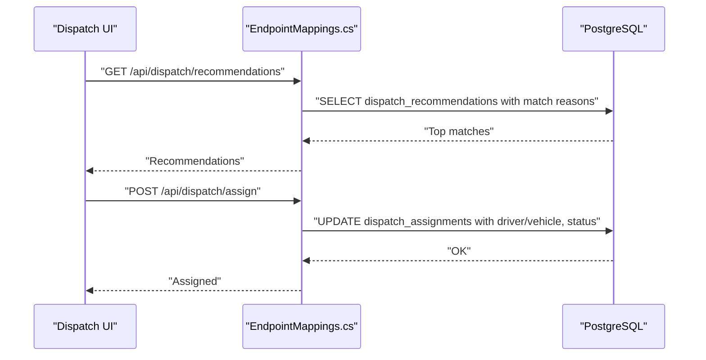
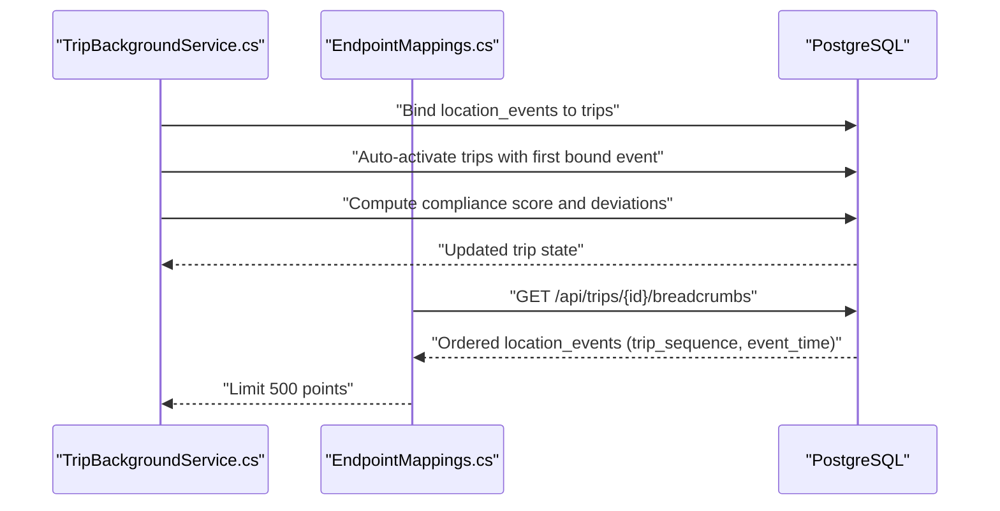
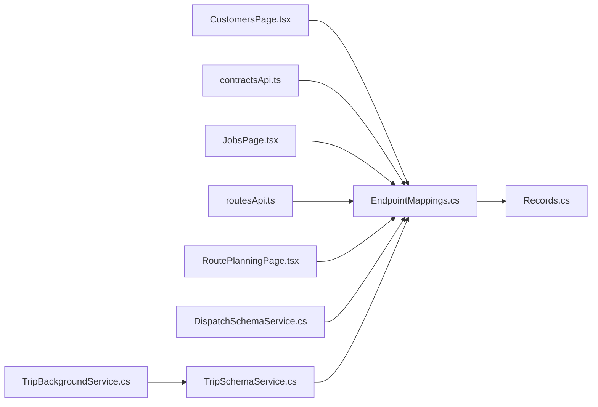

# Operations Management Entities

<cite>
**Referenced Files in This Document**
- [EndpointMappings.cs](file://backend-dotnet/Controllers/EndpointMappings.cs)
- [TripBackgroundService.cs](file://backend-dotnet/Services/TripBackgroundService.cs)
- [TripSchemaService.cs](file://backend-dotnet/Services/TripSchemaService.cs)
- [DispatchSchemaService.cs](file://backend-dotnet/Services/DispatchSchemaService.cs)
- [DriverSchemaService.cs](file://backend-dotnet/Services/DriverSchemaService.cs)
- [MaintenanceSchemaService.cs](file://backend-dotnet/Services/MaintenanceSchemaService.cs)
- [SafetySchemaService.cs](file://backend-dotnet/Services/SafetySchemaService.cs)
- [Records.cs](file://api-dotnet/Models/Records.cs)
- [CustomersPage.tsx](file://frontend/src/pages/CustomersPage.tsx)
- [EntityListPage.tsx](file://frontend/src/pages/EntityListPage.tsx)
- [contractsApi.ts](file://frontend/src/services/contractsApi.ts)
- [AccountHealthPage.tsx](file://frontend/src/pages/AccountHealthPage.tsx)
- [OperatingModulePage.tsx](file://frontend/src/pages/OperatingModulePage.tsx)
- [JobsPage.tsx](file://frontend/src/pages/JobsPage.tsx)
- [routesApi.ts](file://frontend/src/services/routesApi.ts)
- [RoutePlanningPage.tsx](file://frontend/src/pages/RoutePlanningPage.tsx)
- [TripTests.cs](file://backend-dotnet.Tests/TripTests.cs)
</cite>

## Table of Contents
1. [Introduction](#introduction)
2. [Project Structure](#project-structure)
3. [Core Components](#core-components)
4. [Architecture Overview](#architecture-overview)
5. [Detailed Component Analysis](#detailed-component-analysis)
6. [Dependency Analysis](#dependency-analysis)
7. [Performance Considerations](#performance-considerations)
8. [Troubleshooting Guide](#troubleshooting-guide)
9. [Conclusion](#conclusion)
10. [Appendices](#appendices)

## Introduction
This document explains the operations management entities and workflows across the platform, focusing on:
- Customer lifecycle management with contact information, SLA tracking, and risk scoring
- Contract management with rate types, effective dates, and renewal tracking
- Job management with scheduling, priority levels, and assignment workflows
- Route planning with stops, ETAs, and optimization
- Dispatch system with recommendation scoring, assignment matching, and real-time coordination
- Trip management, location tracking, and operational event logging for complete operations visibility

It synthesizes frontend UI surfaces, backend API endpoints, and service-layer logic to present a cohesive view of how these entities interact in production.

## Project Structure
The solution comprises:
- Frontend React application exposing pages and services for customers, contracts, jobs, routes, dispatch, and trips
- Backend .NET API with endpoint mappings and services for schema bootstrapping, background processing, and domain workflows
- Shared DTO records for typed data exchange
- Tests validating trip breadcrumb ordering and limits

```mermaid
graph TB
subgraph "Frontend"
FE_Customers["CustomersPage.tsx"]
FE_EntityList["EntityListPage.tsx"]
FE_Contracts["contractsApi.ts"]
FE_AccountHealth["AccountHealthPage.tsx"]
FE_OpsModule["OperatingModulePage.tsx"]
FE_Jobs["JobsPage.tsx"]
FE_Routes["routesApi.ts"]
FE_RoutePlanning["RoutePlanningPage.tsx"]
end
subgraph "Backend API"
BE_Endpoints["EndpointMappings.cs"]
BE_TripSvc["TripBackgroundService.cs"]
BE_TripSchema["TripSchemaService.cs"]
BE_DispatchSchema["DispatchSchemaService.cs"]
BE_DriverSchema["DriverSchemaService.cs"]
BE_MaintSchema["MaintenanceSchemaService.cs"]
BE_SafetySchema["SafetySchemaService.cs"]
end
subgraph "Shared Models"
SH_Records["Records.cs"]
end
FE_Customers --> BE_Endpoints
FE_EntityList --> BE_Endpoints
FE_Contracts --> BE_Endpoints
FE_AccountHealth --> BE_Endpoints
FE_OpsModule --> BE_Endpoints
FE_Jobs --> BE_Endpoints
FE_Routes --> BE_Endpoints
FE_RoutePlanning --> BE_Endpoints
BE_TripSvc --> BE_TripSchema
BE_DispatchSchema --> BE_Endpoints
BE_DriverSchema --> BE_Endpoints
BE_MaintSchema --> BE_Endpoints
BE_SafetySchema --> BE_Endpoints
SH_Records --> BE_Endpoints
```

**Diagram sources**
- [EndpointMappings.cs:1-200](file://backend-dotnet/Controllers/EndpointMappings.cs#L1-L200)
- [TripBackgroundService.cs:1-204](file://backend-dotnet/Services/TripBackgroundService.cs#L1-L204)
- [TripSchemaService.cs:1-69](file://backend-dotnet/Services/TripSchemaService.cs#L1-L69)
- [DispatchSchemaService.cs:1-139](file://backend-dotnet/Services/DispatchSchemaService.cs#L1-L139)
- [DriverSchemaService.cs:1-89](file://backend-dotnet/Services/DriverSchemaService.cs#L1-L89)
- [MaintenanceSchemaService.cs:1-169](file://backend-dotnet/Services/MaintenanceSchemaService.cs#L1-L169)
- [SafetySchemaService.cs:1-131](file://backend-dotnet/Services/SafetySchemaService.cs#L1-L131)
- [Records.cs:1-148](file://api-dotnet/Models/Records.cs#L1-L148)
- [CustomersPage.tsx:23-338](file://frontend/src/pages/CustomersPage.tsx#L23-L338)
- [EntityListPage.tsx:136-153](file://frontend/src/pages/EntityListPage.tsx#L136-L153)
- [contractsApi.ts:1-17](file://frontend/src/services/contractsApi.ts#L1-L17)
- [AccountHealthPage.tsx:54-84](file://frontend/src/pages/AccountHealthPage.tsx#L54-L84)
- [OperatingModulePage.tsx:335-352](file://frontend/src/pages/OperatingModulePage.tsx#L335-L352)
- [JobsPage.tsx:62-83](file://frontend/src/pages/JobsPage.tsx#L62-L83)
- [routesApi.ts:24-29](file://frontend/src/services/routesApi.ts#L24-L29)
- [RoutePlanningPage.tsx:45-54](file://frontend/src/pages/RoutePlanningPage.tsx#L45-L54)

**Section sources**
- [EndpointMappings.cs:1-200](file://backend-dotnet/Controllers/EndpointMappings.cs#L1-L200)
- [Records.cs:1-148](file://api-dotnet/Models/Records.cs#L1-L148)

## Core Components
- Customers: Contact info, SLA health, delivery experience, risk scoring, and entity list KPIs
- Contracts: Summary, list, detail, create/update/remove, rate cards, activation/expiry, recommendations
- Jobs: Creation, assignment, status changes, ETA sending, proof capture, timeline, recommendations
- Routes: Summary, list/detail, stops CRUD, optimization preview, assignment, timeline, recommendations
- Dispatch: Board, recommendations, eligibility, assignments lifecycle, auto-suggest, ETA updates
- Trips: List/detail, breadcrumbs, compliance, start/complete/exception, background binding and scoring

**Section sources**
- [CustomersPage.tsx:23-338](file://frontend/src/pages/CustomersPage.tsx#L23-L338)
- [EntityListPage.tsx:136-153](file://frontend/src/pages/EntityListPage.tsx#L136-L153)
- [contractsApi.ts:1-17](file://frontend/src/services/contractsApi.ts#L1-L17)
- [JobsPage.tsx:62-83](file://frontend/src/pages/JobsPage.tsx#L62-L83)
- [routesApi.ts:24-29](file://frontend/src/services/routesApi.ts#L24-L29)
- [RoutePlanningPage.tsx:45-54](file://frontend/src/pages/RoutePlanningPage.tsx#L45-L54)
- [EndpointMappings.cs:173-196](file://backend-dotnet/Controllers/EndpointMappings.cs#L173-L196)
- [EndpointMappings.cs:197-200](file://backend-dotnet/Controllers/EndpointMappings.cs#L197-L200)

## Architecture Overview
The system exposes REST endpoints mapped in the backend controller, with services orchestrating schema, background processing, and domain workflows. Frontend pages consume typed services to manage entities and workflows.

**Diagram sources**
- [EndpointMappings.cs:1-200](file://backend-dotnet/Controllers/EndpointMappings.cs#L1-L200)
- [TripBackgroundService.cs:1-204](file://backend-dotnet/Services/TripBackgroundService.cs#L1-L204)
- [TripSchemaService.cs:1-69](file://backend-dotnet/Services/TripSchemaService.cs#L1-L69)
- [DispatchSchemaService.cs:1-139](file://backend-dotnet/Services/DispatchSchemaService.cs#L1-L139)

## Detailed Component Analysis

### Customer Lifecycle Management
- Frontend surfaces customer list/detail with SLA health, delivery experience, risk heat, and contact info
- Entity list defines filters, KPIs, and decision signals including risk score and SLA tier
- Backend endpoints support customer list, detail, creation, update, deletion, timeline, and recommendations

**Diagram sources**
- [CustomersPage.tsx:23-338](file://frontend/src/pages/CustomersPage.tsx#L23-L338)
- [EntityListPage.tsx:136-153](file://frontend/src/pages/EntityListPage.tsx#L136-L153)
- [EndpointMappings.cs:122-129](file://backend-dotnet/Controllers/EndpointMappings.cs#L122-L129)

**Section sources**
- [CustomersPage.tsx:23-338](file://frontend/src/pages/CustomersPage.tsx#L23-L338)
- [EntityListPage.tsx:136-153](file://frontend/src/pages/EntityListPage.tsx#L136-L153)
- [EndpointMappings.cs:122-129](file://backend-dotnet/Controllers/EndpointMappings.cs#L122-L129)

### Contract Management
- Frontend contract API supports summary, list, detail, create, update, remove, rates CRUD, activate/expiry, and recommendations
- Backend endpoints expose contracts list with risk heat and recommended actions, rate creation/update with type, zones, vehicle type, effective/expiry dates, and status
- Renewal tracking surfaced in account health and operating module dashboards

**Diagram sources**
- [contractsApi.ts:1-17](file://frontend/src/services/contractsApi.ts#L1-L17)
- [EndpointMappings.cs:5301-5315](file://backend-dotnet/Controllers/EndpointMappings.cs#L5301-L5315)
- [EndpointMappings.cs:5429-5446](file://backend-dotnet/Controllers/EndpointMappings.cs#L5429-L5446)

**Section sources**
- [contractsApi.ts:1-17](file://frontend/src/services/contractsApi.ts#L1-L17)
- [EndpointMappings.cs:5301-5315](file://backend-dotnet/Controllers/EndpointMappings.cs#L5301-L5315)
- [EndpointMappings.cs:5429-5446](file://backend-dotnet/Controllers/EndpointMappings.cs#L5429-L5446)
- [AccountHealthPage.tsx:54-84](file://frontend/src/pages/AccountHealthPage.tsx#L54-L84)
- [OperatingModulePage.tsx:335-352](file://frontend/src/pages/OperatingModulePage.tsx#L335-L352)

### Job Management
- Frontend job page enables filtering by status/priority, creation, and assignment
- Backend endpoints support job list/detail, creation/update/delete, assignment, status change, ETA send, and proof capture

**Diagram sources**
- [JobsPage.tsx:62-83](file://frontend/src/pages/JobsPage.tsx#L62-L83)
- [EndpointMappings.cs:156-166](file://backend-dotnet/Controllers/EndpointMappings.cs#L156-L166)

**Section sources**
- [JobsPage.tsx:62-83](file://frontend/src/pages/JobsPage.tsx#L62-L83)
- [EndpointMappings.cs:156-166](file://backend-dotnet/Controllers/EndpointMappings.cs#L156-L166)

### Route Planning and ETA Engine
- Frontend route planner supports create/edit, add stops, optimize preview, assignment, timeline, and recommendations
- Backend provides route summary, list/detail, stops CRUD, optimization preview, assignment, ETA engine computation, and recommendations

**Diagram sources**
- [RoutePlanningPage.tsx:45-54](file://frontend/src/pages/RoutePlanningPage.tsx#L45-L54)
- [routesApi.ts:24-29](file://frontend/src/services/routesApi.ts#L24-L29)
- [EndpointMappings.cs:2853-2862](file://backend-dotnet/Controllers/EndpointMappings.cs#L2853-L2862)
- [EndpointMappings.cs:3006-3020](file://backend-dotnet/Controllers/EndpointMappings.cs#L3006-L3020)
- [EndpointMappings.cs:3022-3030](file://backend-dotnet/Controllers/EndpointMappings.cs#L3022-L3030)

**Section sources**
- [RoutePlanningPage.tsx:45-54](file://frontend/src/pages/RoutePlanningPage.tsx#L45-L54)
- [routesApi.ts:24-29](file://frontend/src/services/routesApi.ts#L24-L29)
- [EndpointMappings.cs:2853-2862](file://backend-dotnet/Controllers/EndpointMappings.cs#L2853-L2862)
- [EndpointMappings.cs:3006-3020](file://backend-dotnet/Controllers/EndpointMappings.cs#L3006-L3020)
- [EndpointMappings.cs:3022-3030](file://backend-dotnet/Controllers/EndpointMappings.cs#L3022-L3030)

### Dispatch System: Recommendation Scoring and Assignment Matching
- Frontend dispatch board and recommendations surface AI-driven matches
- Backend computes dispatch match scores considering driver/vehicle availability, HOS, proximity, and safety thresholds; validates eligibility; supports auto-suggest and status transitions

**Diagram sources**
- [EndpointMappings.cs:173-181](file://backend-dotnet/Controllers/EndpointMappings.cs#L173-L181)
- [EndpointMappings.cs:2824-2832](file://backend-dotnet/Controllers/EndpointMappings.cs#L2824-L2832)
- [EndpointMappings.cs:4468-4480](file://backend-dotnet/Controllers/EndpointMappings.cs#L4468-L4480)

**Section sources**
- [EndpointMappings.cs:173-181](file://backend-dotnet/Controllers/EndpointMappings.cs#L173-L181)
- [EndpointMappings.cs:2824-2832](file://backend-dotnet/Controllers/EndpointMappings.cs#L2824-L2832)
- [EndpointMappings.cs:4468-4480](file://backend-dotnet/Controllers/EndpointMappings.cs#L4468-L4480)

### Trip Management, Location Tracking, and Operational Event Logging
- Frontend trips endpoints support list/detail, breadcrumbs, and compliance
- Backend auto-creates trips from active routes, binds location events, detects stop completions, computes compliance scores, and generates deviation events
- Tests confirm breadcrumb ordering and limits

**Diagram sources**
- [TripBackgroundService.cs:176-204](file://backend-dotnet/Services/TripBackgroundService.cs#L176-L204)
- [EndpointMappings.cs:8002-8028](file://backend-dotnet/Controllers/EndpointMappings.cs#L8002-L8028)
- [TripTests.cs:272-309](file://backend-dotnet.Tests/TripTests.cs#L272-L309)

**Section sources**
- [EndpointMappings.cs:8002-8028](file://backend-dotnet/Controllers/EndpointMappings.cs#L8002-L8028)
- [TripBackgroundService.cs:176-204](file://backend-dotnet/Services/TripBackgroundService.cs#L176-L204)
- [TripTests.cs:272-309](file://backend-dotnet.Tests/TripTests.cs#L272-L309)

## Dependency Analysis
- Frontend pages depend on typed services for each domain
- Backend endpoints depend on shared DTO records and services for schema, background processing, and domain workflows
- Dispatch and trip workflows rely on schema services to add columns and create tables for execution and compliance tracking

**Diagram sources**
- [EndpointMappings.cs:1-200](file://backend-dotnet/Controllers/EndpointMappings.cs#L1-L200)
- [TripSchemaService.cs:1-69](file://backend-dotnet/Services/TripSchemaService.cs#L1-L69)
- [TripBackgroundService.cs:1-204](file://backend-dotnet/Services/TripBackgroundService.cs#L1-L204)
- [DispatchSchemaService.cs:1-139](file://backend-dotnet/Services/DispatchSchemaService.cs#L1-L139)
- [Records.cs:1-148](file://api-dotnet/Models/Records.cs#L1-L148)
- [CustomersPage.tsx:23-338](file://frontend/src/pages/CustomersPage.tsx#L23-L338)
- [contractsApi.ts:1-17](file://frontend/src/services/contractsApi.ts#L1-L17)
- [JobsPage.tsx:62-83](file://frontend/src/pages/JobsPage.tsx#L62-L83)
- [routesApi.ts:24-29](file://frontend/src/services/routesApi.ts#L24-L29)
- [RoutePlanningPage.tsx:45-54](file://frontend/src/pages/RoutePlanningPage.tsx#L45-L54)

**Section sources**
- [EndpointMappings.cs:1-200](file://backend-dotnet/Controllers/EndpointMappings.cs#L1-L200)
- [TripSchemaService.cs:1-69](file://backend-dotnet/Services/TripSchemaService.cs#L1-L69)
- [TripBackgroundService.cs:1-204](file://backend-dotnet/Services/TripBackgroundService.cs#L1-L204)
- [DispatchSchemaService.cs:1-139](file://backend-dotnet/Services/DispatchSchemaService.cs#L1-L139)
- [Records.cs:1-148](file://api-dotnet/Models/Records.cs#L1-L148)

## Performance Considerations
- Route optimization preview and ETA computations are lightweight server-side calculations to avoid client-side heavy lifting
- Trip breadcrumb queries limit payload size and order by sequence/time to ensure deterministic replay
- Background services batch updates and use indexes to minimize write amplification during trip binding and compliance scoring

[No sources needed since this section provides general guidance]

## Troubleshooting Guide
- If trip breadcrumbs are empty or unordered, verify the binding logic and ordering criteria in the endpoint and background service
- If dispatch assignments fail eligibility checks, review driver/vehicle statuses and configuration thresholds
- For missing columns or tables in dispatch/trips, ensure schema services have been executed

**Section sources**
- [EndpointMappings.cs:8002-8028](file://backend-dotnet/Controllers/EndpointMappings.cs#L8002-L8028)
- [TripBackgroundService.cs:176-204](file://backend-dotnet/Services/TripBackgroundService.cs#L176-L204)
- [TripTests.cs:272-309](file://backend-dotnet.Tests/TripTests.cs#L272-L309)
- [DispatchSchemaService.cs:18-49](file://backend-dotnet/Services/DispatchSchemaService.cs#L18-L49)
- [TripSchemaService.cs:14-20](file://backend-dotnet/Services/TripSchemaService.cs#L14-L20)

## Conclusion
The platform integrates customer, contract, job, route, dispatch, and trip domains through a cohesive API and frontend surface. Backend services and schema bootstrapping ensure robust execution, while frontend pages deliver actionable insights and controls for SLA tracking, risk scoring, optimization, and real-time coordination.

[No sources needed since this section summarizes without analyzing specific files]

## Appendices
- Shared DTOs define strongly-typed contracts for vehicles, drivers, jobs, work orders, assets, fuel transactions, AI insights, and location events

**Section sources**
- [Records.cs:1-148](file://api-dotnet/Models/Records.cs#L1-L148)