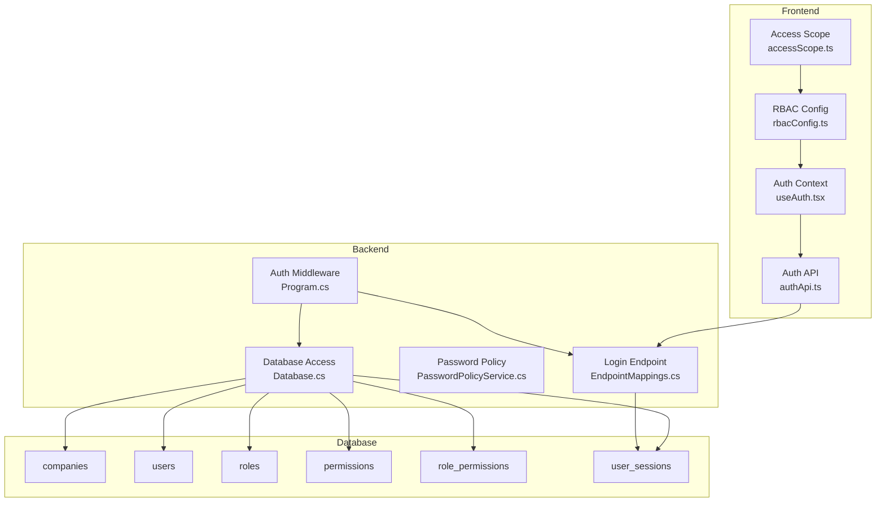
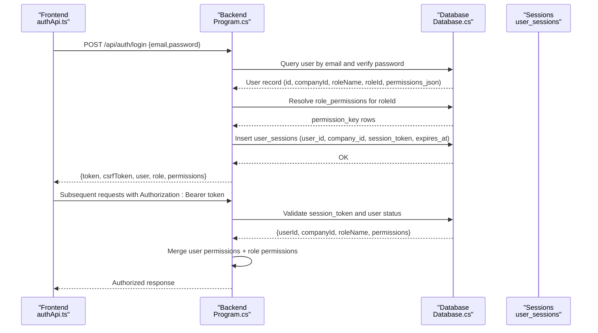
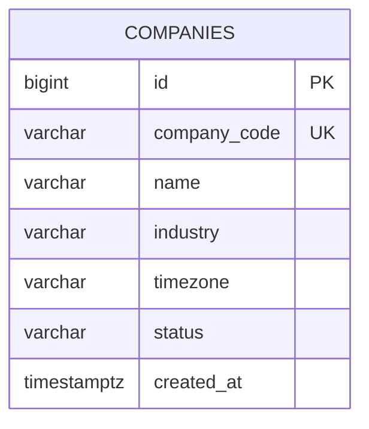
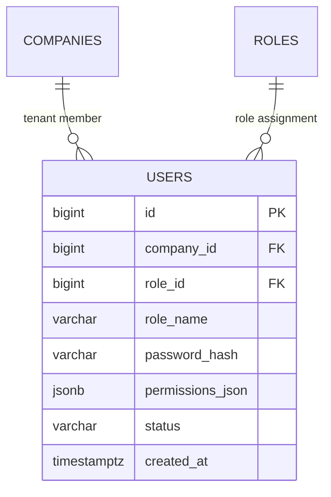
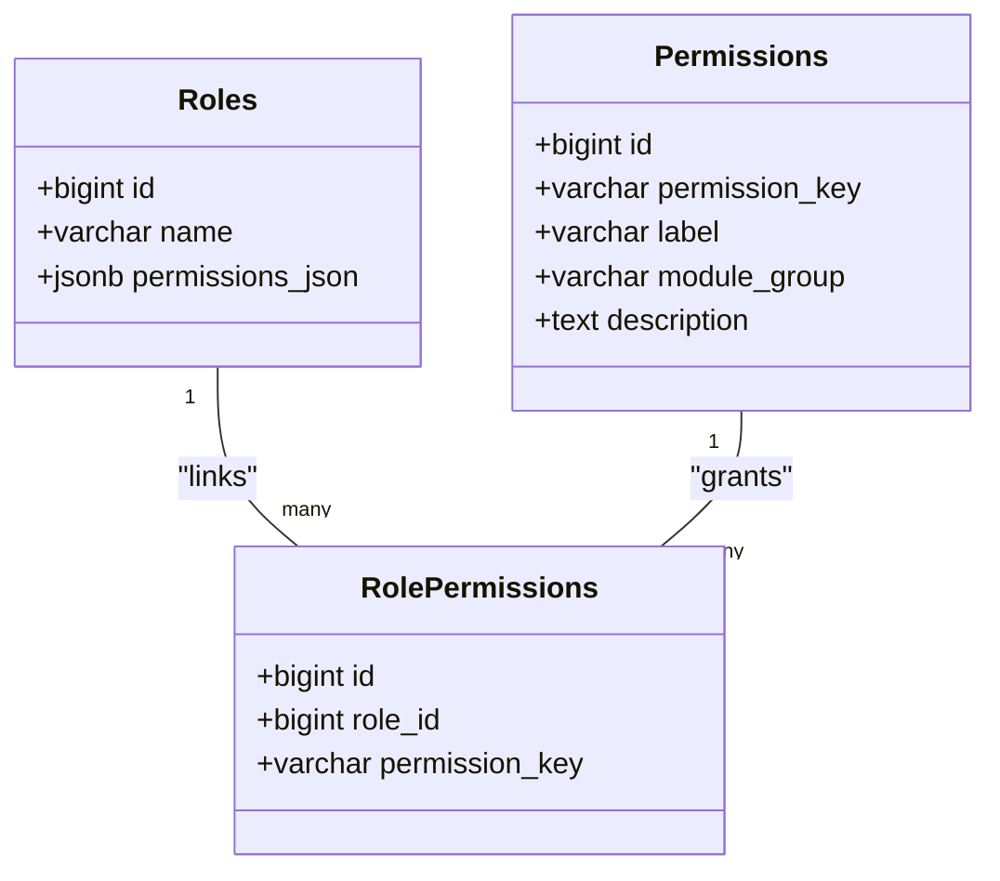
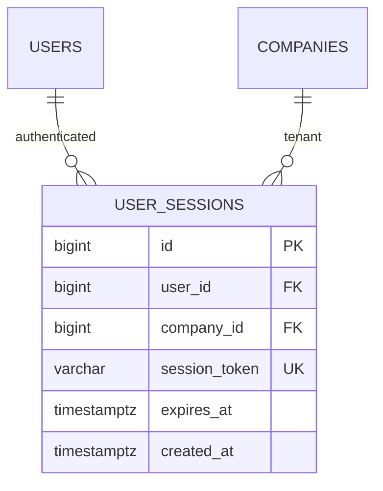
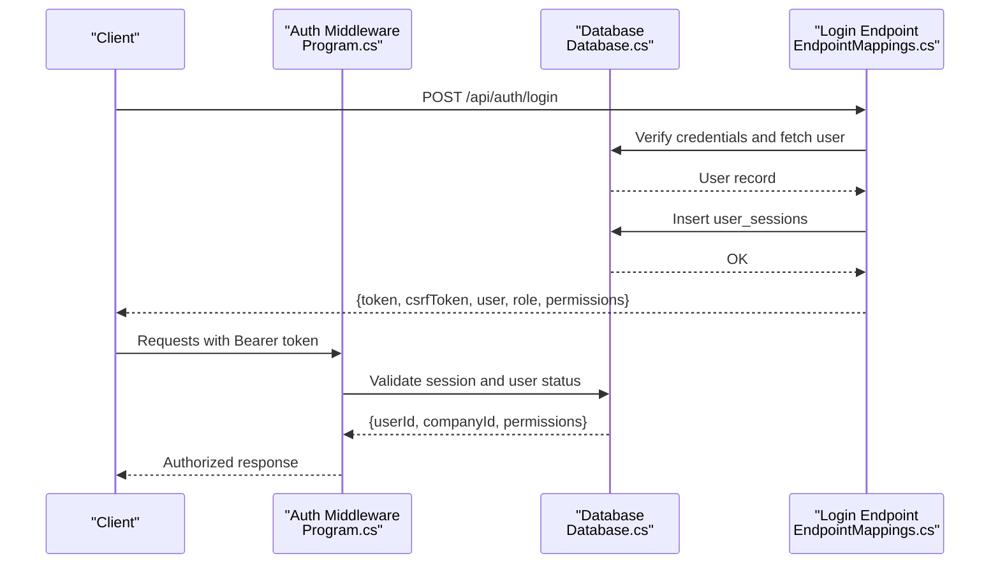
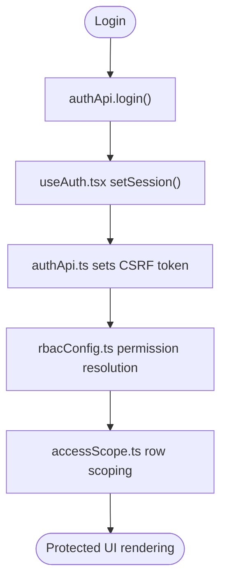
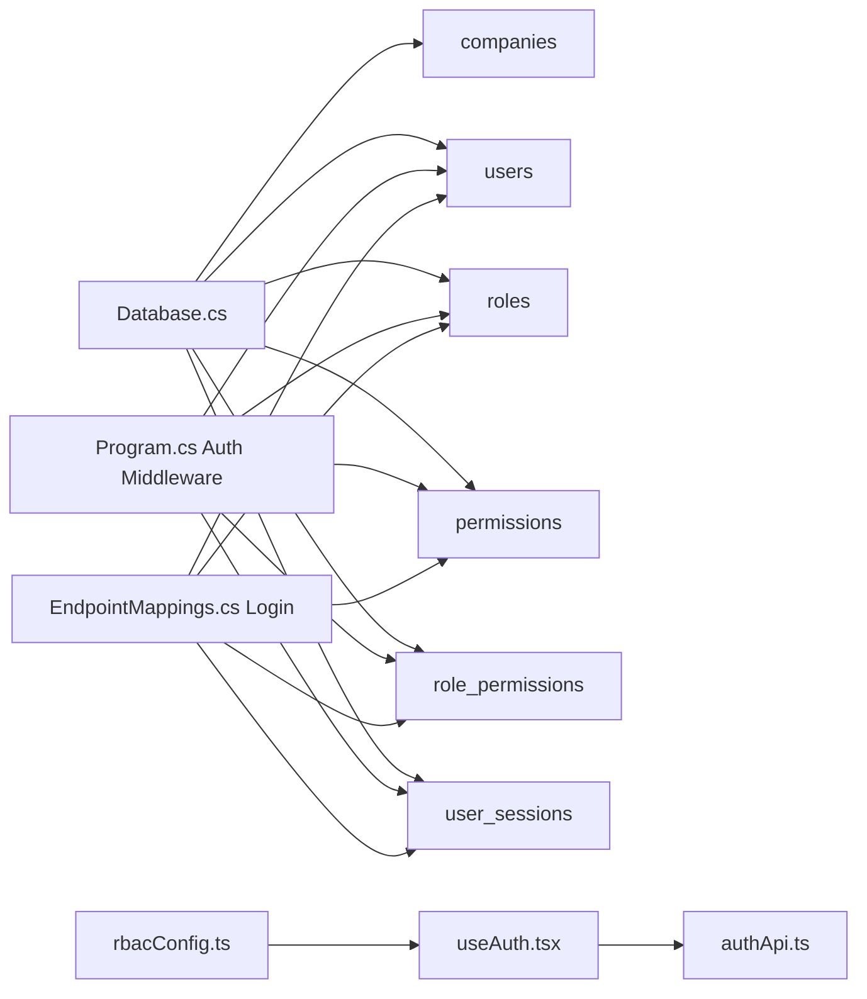

# Tenant Management Entities

<cite>
**Referenced Files in This Document**
- [001_schema.sql](file://db/init/001_schema.sql)
- [002_seed.sql](file://db/init/002_seed.sql)
- [Program.cs](file://backend-dotnet/Program.cs)
- [EndpointMappings.cs](file://backend-dotnet/Controllers/EndpointMappings.cs)
- [PasswordPolicyService.cs](file://backend-dotnet/Services/PasswordPolicyService.cs)
- [Database.cs](file://backend-dotnet/Data/Database.cs)
- [rbacConfig.ts](file://frontend/src/auth/rbacConfig.ts)
- [accessScope.ts](file://frontend/src/auth/accessScope.ts)
- [useAuth.tsx](file://frontend/src/hooks/useAuth.tsx)
- [authApi.ts](file://frontend/src/services/authApi.ts)
- [LOGIN_RBAC_CSRF.md](file://docs/LOGIN_RBAC_CSRF.md)
</cite>

## Table of Contents
1. [Introduction](#introduction)
2. [Project Structure](#project-structure)
3. [Core Components](#core-components)
4. [Architecture Overview](#architecture-overview)
5. [Detailed Component Analysis](#detailed-component-analysis)
6. [Dependency Analysis](#dependency-analysis)
7. [Performance Considerations](#performance-considerations)
8. [Troubleshooting Guide](#troubleshooting-guide)
9. [Conclusion](#conclusion)

## Introduction
This document provides comprehensive documentation for the tenant management entities in the OpsTrax database. It focuses on the companies table as the primary tenant entity, users with role-based access control, roles with permission management, and user_sessions for authentication. It explains the multi-tenant architecture implemented through company_id foreign keys, user-role relationships, and session management. It also covers the RBAC system with permissions and role_permissions, the user registration flow, password hashing, session token management, and security considerations for multi-tenant data separation.

## Project Structure
The tenant management implementation spans the database schema and seed data, backend authentication and session management, and frontend RBAC and session handling:
- Database: companies, users, roles, permissions, role_permissions, user_sessions tables
- Backend: authentication middleware, login endpoint, session validation, and permission resolution
- Frontend: RBAC configuration, permission guards, and session storage

**Diagram sources**
- [Program.cs:171-244](file://backend-dotnet/Program.cs#L171-L244)
- [EndpointMappings.cs:1637-1701](file://backend-dotnet/Controllers/EndpointMappings.cs#L1637-L1701)
- [PasswordPolicyService.cs:1-113](file://backend-dotnet/Services/PasswordPolicyService.cs#L1-113)
- [Database.cs:1-86](file://backend-dotnet/Data/Database.cs#L1-L86)
- [001_schema.sql:651-679](file://db/init/001_schema.sql#L651-L679)
- [rbacConfig.ts:1-404](file://frontend/src/auth/rbacConfig.ts#L1-L404)
- [accessScope.ts:1-75](file://frontend/src/auth/accessScope.ts#L1-L75)
- [useAuth.tsx:1-60](file://frontend/src/hooks/useAuth.tsx#L1-L60)
- [authApi.ts:1-58](file://frontend/src/services/authApi.ts#L1-L58)

**Section sources**
- [001_schema.sql:651-679](file://db/init/001_schema.sql#L651-L679)
- [Program.cs:171-244](file://backend-dotnet/Program.cs#L171-L244)
- [EndpointMappings.cs:1637-1701](file://backend-dotnet/Controllers/EndpointMappings.cs#L1637-L1701)
- [rbacConfig.ts:1-404](file://frontend/src/auth/rbacConfig.ts#L1-L404)
- [accessScope.ts:1-75](file://frontend/src/auth/accessScope.ts#L1-L75)
- [useAuth.tsx:1-60](file://frontend/src/hooks/useAuth.tsx#L1-L60)
- [authApi.ts:1-58](file://frontend/src/services/authApi.ts#L1-L58)

## Core Components
- companies: Primary tenant entity with unique company_code, name, industry, timezone, and status
- users: Tenant members with company_id foreign key, role_name, optional role_id, password_hash, and permissions_json
- roles: Role definitions with unique name and permissions_json
- permissions: Permission catalog entries with permission_key, label, module_group, and description
- role_permissions: Junction table linking roles to permissions via permission_key
- user_sessions: Authentication sessions with user_id, company_id, session_token, and expires_at

Multi-tenancy is enforced by company_id on most entities and by requiring company_id in session validation. RBAC combines user-level permissions_json and role-level permissions to compute effective permissions.

**Section sources**
- [001_schema.sql:4-34](file://db/init/001_schema.sql#L4-L34)
- [001_schema.sql:14-18](file://db/init/001_schema.sql#L14-L18)
- [001_schema.sql:653-679](file://db/init/001_schema.sql#L653-L679)
- [002_seed.sql:28-44](file://db/init/002_seed.sql#L28-L44)

## Architecture Overview
The authentication and authorization flow integrates frontend RBAC with backend session validation and permission resolution:

**Diagram sources**
- [authApi.ts:35-57](file://frontend/src/services/authApi.ts#L35-L57)
- [Program.cs:171-244](file://backend-dotnet/Program.cs#L171-L244)
- [Database.cs:17-37](file://backend-dotnet/Data/Database.cs#L17-L37)
- [EndpointMappings.cs:1637-1701](file://backend-dotnet/Controllers/EndpointMappings.cs#L1637-L1701)

## Detailed Component Analysis

### Companies Table (Tenant Entity)
- Purpose: Defines tenants with unique identifiers and metadata
- Key attributes: id, company_code (UNIQUE), name, industry, timezone, status, created_at
- Multi-tenancy: Used as the anchor for company_id in other tables

**Diagram sources**
- [001_schema.sql:4-12](file://db/init/001_schema.sql#L4-L12)

**Section sources**
- [001_schema.sql:4-12](file://db/init/001_schema.sql#L4-L12)

### Users Table (Tenant Members)
- Purpose: Stores tenant members with role association and credentials
- Key attributes: id, company_id (FK), role_id (FK), role_name, password_hash, permissions_json, status, created_at
- Relationships: FK to companies (company_id), FK to roles (role_id)
- Security: password_hash for secure authentication; permissions_json supports per-user overrides

**Diagram sources**
- [001_schema.sql:20-34](file://db/init/001_schema.sql#L20-L34)
- [001_schema.sql:4-12](file://db/init/001_schema.sql#L4-L12)
- [001_schema.sql:14-18](file://db/init/001_schema.sql#L14-L18)

**Section sources**
- [001_schema.sql:20-34](file://db/init/001_schema.sql#L20-L34)

### Roles and Permissions (RBAC)
- roles: Unique role definitions with permissions_json
- permissions: Catalog of permission_key entries with labels and module groups
- role_permissions: Junction table linking roles to permissions via permission_key

**Diagram sources**
- [001_schema.sql:14-18](file://db/init/001_schema.sql#L14-L18)
- [001_schema.sql:653-659](file://db/init/001_schema.sql#L653-L659)
- [001_schema.sql:661-667](file://db/init/001_schema.sql#L661-L667)

**Section sources**
- [001_schema.sql:14-18](file://db/init/001_schema.sql#L14-L18)
- [001_schema.sql:653-667](file://db/init/001_schema.sql#L653-L667)

### User Sessions (Authentication)
- Purpose: Store active authenticated sessions with company_id and expiration
- Key attributes: id, user_id (FK), company_id (FK), session_token (UNIQUE), expires_at, created_at
- Indexes: session_token and user_id for efficient lookup

**Diagram sources**
- [001_schema.sql:669-679](file://db/init/001_schema.sql#L669-L679)
- [001_schema.sql:20-34](file://db/init/001_schema.sql#L20-L34)
- [001_schema.sql:4-12](file://db/init/001_schema.sql#L4-L12)

**Section sources**
- [001_schema.sql:669-679](file://db/init/001_schema.sql#L669-L679)

### Backend Authentication Flow
- Middleware validates Authorization Bearer tokens and extracts user_id, company_id, role, and permissions
- Login endpoint authenticates credentials, resolves permissions, creates session token, persists user_sessions, and returns tokens

**Diagram sources**
- [Program.cs:171-244](file://backend-dotnet/Program.cs#L171-L244)
- [EndpointMappings.cs:1637-1701](file://backend-dotnet/Controllers/EndpointMappings.cs#L1637-L1701)
- [Database.cs:17-37](file://backend-dotnet/Data/Database.cs#L17-L37)

**Section sources**
- [Program.cs:171-244](file://backend-dotnet/Program.cs#L171-L244)
- [EndpointMappings.cs:1637-1701](file://backend-dotnet/Controllers/EndpointMappings.cs#L1637-L1701)

### Frontend RBAC and Session Management
- RBAC configuration defines canonical permissions and aliases, with role-to-permission mappings
- Access scoping filters data rows for driver and customer portal roles
- Session storage persists user session with TTL and CSRF token

**Diagram sources**
- [authApi.ts:35-57](file://frontend/src/services/authApi.ts#L35-L57)
- [useAuth.tsx:33-52](file://frontend/src/hooks/useAuth.tsx#L33-L52)
- [rbacConfig.ts:368-387](file://frontend/src/auth/rbacConfig.ts#L368-L387)
- [accessScope.ts:14-30](file://frontend/src/auth/accessScope.ts#L14-L30)

**Section sources**
- [rbacConfig.ts:1-404](file://frontend/src/auth/rbacConfig.ts#L1-L404)
- [accessScope.ts:1-75](file://frontend/src/auth/accessScope.ts#L1-L75)
- [useAuth.tsx:1-60](file://frontend/src/hooks/useAuth.tsx#L1-L60)
- [authApi.ts:1-58](file://frontend/src/services/authApi.ts#L1-L58)

## Dependency Analysis
- Backend depends on Database.cs for SQL operations and on schema-defined tables for tenant isolation
- Authentication middleware depends on user_sessions and users tables for session validation
- Login endpoint depends on roles and role_permissions for permission computation
- Frontend RBAC depends on backend-provided permissions and role mappings

**Diagram sources**
- [Database.cs:17-37](file://backend-dotnet/Data/Database.cs#L17-L37)
- [Program.cs:171-244](file://backend-dotnet/Program.cs#L171-L244)
- [EndpointMappings.cs:1637-1701](file://backend-dotnet/Controllers/EndpointMappings.cs#L1637-L1701)
- [rbacConfig.ts:368-387](file://frontend/src/auth/rbacConfig.ts#L368-L387)
- [useAuth.tsx:33-52](file://frontend/src/hooks/useAuth.tsx#L33-L52)
- [authApi.ts:35-57](file://frontend/src/services/authApi.ts#L35-L57)

**Section sources**
- [Database.cs:1-86](file://backend-dotnet/Data/Database.cs#L1-L86)
- [Program.cs:171-244](file://backend-dotnet/Program.cs#L171-L244)
- [EndpointMappings.cs:1637-1701](file://backend-dotnet/Controllers/EndpointMappings.cs#L1637-L1701)
- [rbacConfig.ts:368-387](file://frontend/src/auth/rbacConfig.ts#L368-L387)

## Performance Considerations
- Permission checks: O(1) array includes and wildcard expansion precomputed
- Token validation: O(1) string comparison and session lookup
- Session storage: LocalStorage caching reduces repeated auth calls
- Indexes: user_sessions token and user_id indexes optimize lookups

[No sources needed since this section provides general guidance]

## Troubleshooting Guide
Common issues and resolutions:
- CSRF token mismatch: Ensure X-CSRF-Token header matches cookie value and credentials are enabled
- Permission denied: Verify role-to-permission mapping and wildcard patterns
- Session expired: Re-login to obtain a new session; sessions expire after 8 hours
- Invalid bearer token: Confirm Authorization header format and token validity

**Section sources**
- [LOGIN_RBAC_CSRF.md:142-251](file://docs/LOGIN_RBAC_CSRF.md#L142-L251)

## Conclusion
OpsTrax implements a robust multi-tenant architecture centered on the companies table and enforced through company_id across entities. The RBAC system leverages roles and permissions with flexible user-level overrides, while user_sessions provide secure, time-bounded authentication. The backend validates sessions and computes effective permissions, and the frontend enforces access control client-side with consistent mappings. Together, these components ensure tenant isolation, secure access, and scalable multi-tenant operations.