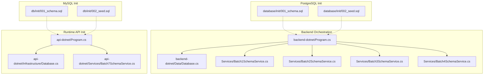
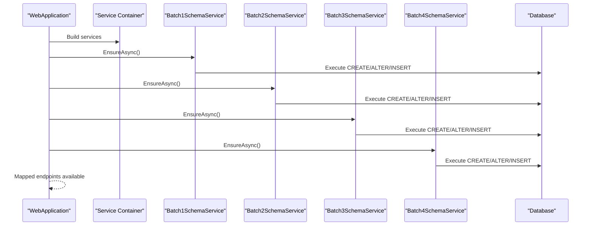
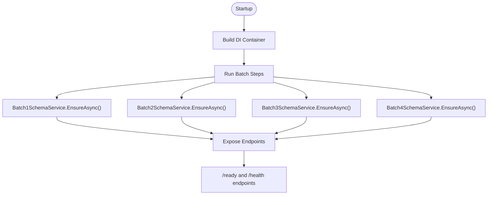
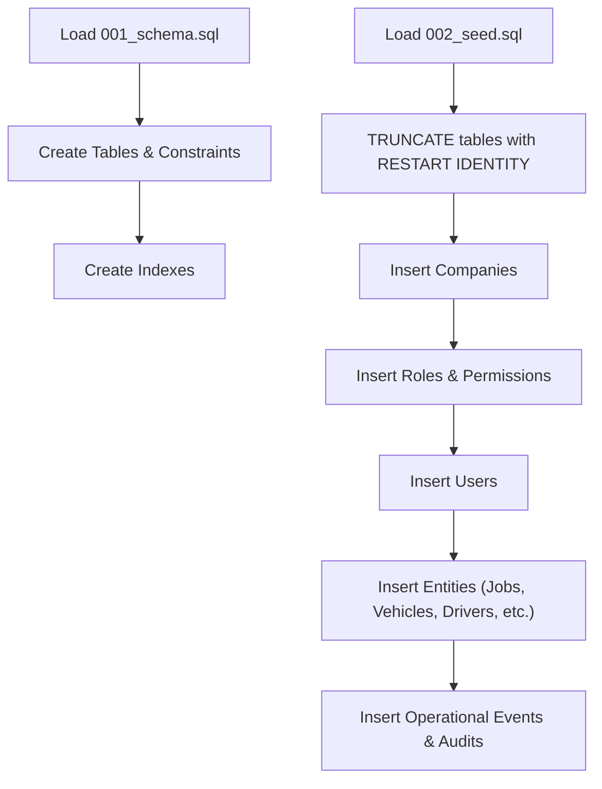
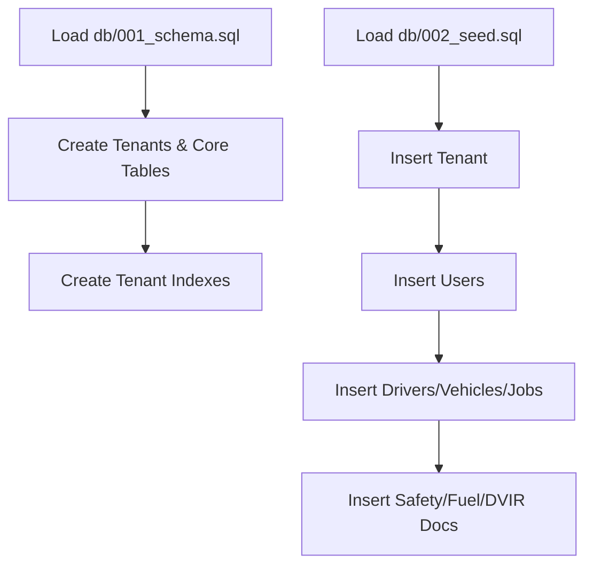
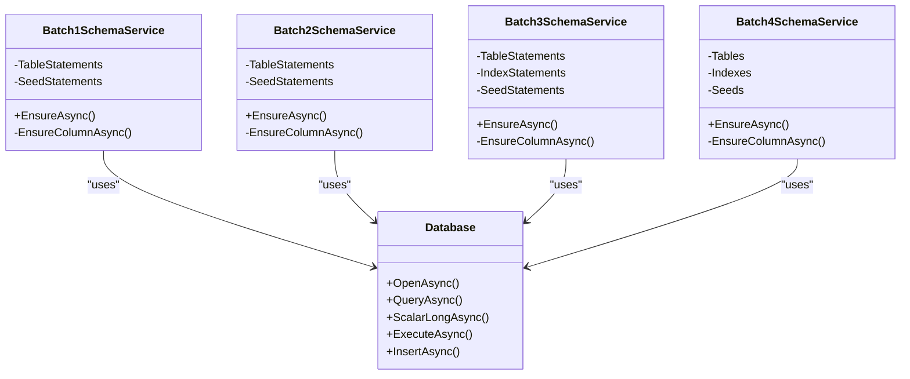
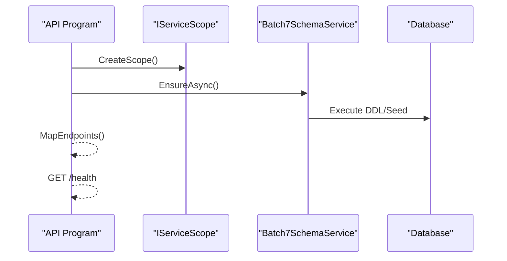
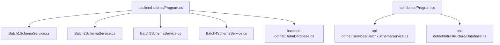

# Data Migration & Initialization

<cite>
**Referenced Files in This Document**
- [Program.cs](file://backend-dotnet/Program.cs)
- [Database.cs](file://backend-dotnet/Data/Database.cs)
- [Database.cs](file://api-dotnet/Infrastructure/Database.cs)
- [001_schema.sql](file://database/init/001_schema.sql)
- [002_seed.sql](file://database/init/002_seed.sql)
- [001_schema.sql](file://db/init/001_schema.sql)
- [002_seed.sql](file://db/init/002_seed.sql)
- [Batch1SchemaService.cs](file://backend-dotnet/Services/Batch1SchemaService.cs)
- [Batch2SchemaService.cs](file://backend-dotnet/Services/Batch2SchemaService.cs)
- [Batch3SchemaService.cs](file://backend-dotnet/Services/Batch3SchemaService.cs)
- [Batch4SchemaService.cs](file://backend-dotnet/Services/Batch4SchemaService.cs)
- [Batch7SchemaService.cs](file://api-dotnet/Services/Batch7SchemaService.cs)
</cite>

## Table of Contents
1. [Introduction](#introduction)
2. [Project Structure](#project-structure)
3. [Core Components](#core-components)
4. [Architecture Overview](#architecture-overview)
5. [Detailed Component Analysis](#detailed-component-analysis)
6. [Dependency Analysis](#dependency-analysis)
7. [Performance Considerations](#performance-considerations)
8. [Troubleshooting Guide](#troubleshooting-guide)
9. [Conclusion](#conclusion)

## Introduction
This document explains the database initialization and migration system across the platform. It covers schema creation scripts, seed data management, and the auto-migration services that ensure the database is bootstrapped and ready for runtime. It also details the bootstrap process, schema versioning strategy, migration execution patterns, seed data structure, default configurations, and tenant initialization procedures. Additionally, it documents the schema service architecture, migration triggers, rollback mechanisms, data validation during initialization, constraint enforcement, post-migration verification processes, and production deployment considerations including zero-downtime migrations and data consistency guarantees.

## Project Structure
The repository contains two distinct database initialization systems:
- A PostgreSQL-based system under database/init with schema and seed scripts.
- A MySQL-based system under db/init with tenant-focused schema and seed scripts.
- A .NET backend that orchestrates schema migrations via per-batch services and a runtime-safe initialization for a specialized API service.

**Diagram sources**
- [Program.cs:70-90](file://backend-dotnet/Program.cs#L70-L90)
- [Batch1SchemaService.cs:7-23](file://backend-dotnet/Services/Batch1SchemaService.cs#L7-L23)
- [Batch2SchemaService.cs:7-23](file://backend-dotnet/Services/Batch2SchemaService.cs#L7-L23)
- [Batch3SchemaService.cs:7-28](file://backend-dotnet/Services/Batch3SchemaService.cs#L7-L28)
- [Batch4SchemaService.cs:7-13](file://backend-dotnet/Services/Batch4SchemaService.cs#L7-L13)
- [Database.cs:10-15](file://backend-dotnet/Data/Database.cs#L10-L15)
- [001_schema.sql:1-20](file://database/init/001_schema.sql#L1-L20)
- [002_seed.sql:1-20](file://database/init/002_seed.sql#L1-L20)
- [001_schema.sql:1-20](file://db/init/001_schema.sql#L1-L20)
- [002_seed.sql:1-20](file://db/init/002_seed.sql#L1-L20)
- [Program.cs:24-29](file://api-dotnet/Program.cs#L24-L29)
- [Batch7SchemaService.cs:1-20](file://api-dotnet/Services/Batch7SchemaService.cs#L1-L20)
- [Database.cs:15-20](file://api-dotnet/Infrastructure/Database.cs#L15-L20)

**Section sources**
- [Program.cs:70-90](file://backend-dotnet/Program.cs#L70-L90)
- [001_schema.sql:1-20](file://database/init/001_schema.sql#L1-L20)
- [002_seed.sql:1-20](file://database/init/002_seed.sql#L1-L20)
- [001_schema.sql:1-20](file://db/init/001_schema.sql#L1-L20)
- [002_seed.sql:1-20](file://db/init/002_seed.sql#L1-L20)
- [Program.cs:24-29](file://api-dotnet/Program.cs#L24-L29)

## Core Components
- Backend orchestration and bootstrap:
  - The backend initializes schema in batches using dedicated services and validates readiness via health endpoints.
  - The runtime-safe initialization for the API service ensures schema and seed initialization occur before mapping endpoints.
- Database connectivity:
  - PostgreSQL-backed backend uses a typed Database wrapper for queries and migrations.
  - MySQL-backed API service uses a separate Database wrapper for tenant-focused initialization.
- Schema and seed assets:
  - PostgreSQL schema defines core entities, indexes, and constraints; seed populates initial data sets.
  - MySQL schema focuses on tenants and minimal operational entities; seed initializes a single tenant and sample data.

Key responsibilities:
- Ensure idempotent schema creation and column additions.
- Populate seed data with deterministic defaults and cross-entity relationships.
- Enforce referential integrity and constraints during initialization.
- Provide post-migration verification and health checks.

**Section sources**
- [Program.cs:70-90](file://backend-dotnet/Program.cs#L70-L90)
- [Program.cs:24-29](file://api-dotnet/Program.cs#L24-L29)
- [Database.cs:10-15](file://backend-dotnet/Data/Database.cs#L10-L15)
- [Database.cs:15-20](file://api-dotnet/Infrastructure/Database.cs#L15-L20)
- [001_schema.sql:1-20](file://database/init/001_schema.sql#L1-L20)
- [002_seed.sql:1-20](file://database/init/002_seed.sql#L1-L20)
- [001_schema.sql:1-20](file://db/init/001_schema.sql#L1-L20)
- [002_seed.sql:1-20](file://db/init/002_seed.sql#L1-L20)

## Architecture Overview
The system follows a staged bootstrap pattern:
- Startup phase: Application builds DI container and runs schema steps sequentially.
- Per-batch schema services: Each batch adds missing columns, creates tables, applies indexes, and seeds data.
- Runtime-safe initialization: Specialized API service ensures schema is ready before exposing endpoints.
- Health and readiness: Dedicated endpoints verify database connectivity and service health.

**Diagram sources**
- [Program.cs:70-90](file://backend-dotnet/Program.cs#L70-L90)
- [Batch1SchemaService.cs:7-23](file://backend-dotnet/Services/Batch1SchemaService.cs#L7-L23)
- [Batch2SchemaService.cs:7-23](file://backend-dotnet/Services/Batch2SchemaService.cs#L7-L23)
- [Batch3SchemaService.cs:7-28](file://backend-dotnet/Services/Batch3SchemaService.cs#L7-L28)
- [Batch4SchemaService.cs:7-13](file://backend-dotnet/Services/Batch4SchemaService.cs#L7-L13)
- [Database.cs:10-15](file://backend-dotnet/Data/Database.cs#L10-L15)

## Detailed Component Analysis

### Backend Bootstrap and Migration Orchestration
- Sequential batch execution:
  - The backend invokes each batch schema service in order, ensuring dependencies resolve before later stages.
  - Failures in individual batches are logged and do not block subsequent steps, enabling partial recovery scenarios.
- Health and readiness:
  - Readiness and deep health endpoints validate database connectivity and optional service statuses.
- Authentication and session validation:
  - Authentication middleware queries user sessions and permissions, relying on the initialized schema.

**Diagram sources**
- [Program.cs:70-90](file://backend-dotnet/Program.cs#L70-L90)
- [Program.cs:260-294](file://backend-dotnet/Program.cs#L260-L294)

**Section sources**
- [Program.cs:70-90](file://backend-dotnet/Program.cs#L70-L90)
- [Program.cs:260-294](file://backend-dotnet/Program.cs#L260-L294)

### PostgreSQL Schema and Seed Assets
- Schema:
  - Defines core entities (companies, users, drivers, vehicles, jobs, routes, etc.), constraints, and indexes optimized for SaaS access patterns.
  - Includes RBAC tables (permissions, roles, user_sessions) and numerous operational tables for dispatch, maintenance, safety, and telemetry.
- Seed:
  - Truncates and re-seeds multiple tables with realistic datasets across multiple domains.
  - Inserts predefined companies, roles, and users, along with synthetic fleet, jobs, routes, and operational events.
  - Populates permissions catalog and role-permission mappings.

**Diagram sources**
- [001_schema.sql:1-20](file://database/init/001_schema.sql#L1-L20)
- [002_seed.sql:1-20](file://database/init/002_seed.sql#L1-L20)

**Section sources**
- [001_schema.sql:1-20](file://database/init/001_schema.sql#L1-L20)
- [002_seed.sql:1-20](file://database/init/002_seed.sql#L1-L20)

### MySQL Tenant Schema and Seed Assets
- Schema:
  - Defines tenants, users, drivers, vehicles, jobs, routes, and supporting operational tables.
  - Includes indexes and foreign keys tailored for tenant isolation.
- Seed:
  - Initializes a single tenant and inserts sample users, drivers, vehicles, jobs, and operational records.
  - Demonstrates tenant-centric data population for quick onboarding.

**Diagram sources**
- [001_schema.sql:1-20](file://db/init/001_schema.sql#L1-L20)
- [002_seed.sql:1-20](file://db/init/002_seed.sql#L1-L20)

**Section sources**
- [001_schema.sql:1-20](file://db/init/001_schema.sql#L1-L20)
- [002_seed.sql:1-20](file://db/init/002_seed.sql#L1-L20)

### Schema Service Architecture and Execution Patterns
- Per-batch services:
  - Each batch service encapsulates:
    - Column existence checks and conditional additions.
    - Table creation with idempotent DDL.
    - Index creation with try/catch to tolerate duplicates.
    - Seeding with INSERT ... WHERE NOT EXISTS and deterministic generation.
- Execution pattern:
  - EnsureAsync orchestrates the three phases: ensure columns, create tables, apply indexes, and seed data.
  - Database wrapper abstracts connection, query, scalar, and insert operations.

**Diagram sources**
- [Database.cs:10-15](file://backend-dotnet/Data/Database.cs#L10-L15)
- [Batch1SchemaService.cs:7-23](file://backend-dotnet/Services/Batch1SchemaService.cs#L7-L23)
- [Batch2SchemaService.cs:7-23](file://backend-dotnet/Services/Batch2SchemaService.cs#L7-L23)
- [Batch3SchemaService.cs:7-28](file://backend-dotnet/Services/Batch3SchemaService.cs#L7-L28)
- [Batch4SchemaService.cs:7-13](file://backend-dotnet/Services/Batch4SchemaService.cs#L7-L13)

**Section sources**
- [Batch1SchemaService.cs:7-23](file://backend-dotnet/Services/Batch1SchemaService.cs#L7-L23)
- [Batch2SchemaService.cs:7-23](file://backend-dotnet/Services/Batch2SchemaService.cs#L7-L23)
- [Batch3SchemaService.cs:7-28](file://backend-dotnet/Services/Batch3SchemaService.cs#L7-L28)
- [Batch4SchemaService.cs:7-13](file://backend-dotnet/Services/Batch4SchemaService.cs#L7-L13)
- [Database.cs:10-15](file://backend-dotnet/Data/Database.cs#L10-L15)

### Runtime-Safe Initialization for API Service
- Purpose:
  - Ensures schema and seed initialization occurs before mapping endpoints.
- Execution:
  - Opens a scoped DI, resolves the schema service, and calls EnsureAsync.
  - Exposes health endpoint for platform status.

**Diagram sources**
- [Program.cs:24-29](file://api-dotnet/Program.cs#L24-L29)
- [Batch7SchemaService.cs:1-20](file://api-dotnet/Services/Batch7SchemaService.cs#L1-L20)
- [Database.cs:15-20](file://api-dotnet/Infrastructure/Database.cs#L15-L20)

**Section sources**
- [Program.cs:24-29](file://api-dotnet/Program.cs#L24-L29)
- [Batch7SchemaService.cs:1-20](file://api-dotnet/Services/Batch7SchemaService.cs#L1-L20)
- [Database.cs:15-20](file://api-dotnet/Infrastructure/Database.cs#L15-L20)

### Seed Data Structure and Default Configurations
- PostgreSQL seed:
  - Resets sequences and truncates tables to ensure idempotency.
  - Inserts predefined companies, roles, and users with explicit permissions.
  - Generates synthetic fleet, jobs, routes, and operational events with randomized attributes.
  - Seeds permissions catalog and role-permission mappings.
- MySQL seed:
  - Creates a tenant and inserts sample users, drivers, vehicles, jobs, and operational records.
  - Provides realistic baseline data for tenant onboarding.

**Section sources**
- [002_seed.sql:1-20](file://database/init/002_seed.sql#L1-L20)
- [002_seed.sql:48-61](file://database/init/002_seed.sql#L48-L61)
- [002_seed.sql:28-44](file://database/init/002_seed.sql#L28-L44)
- [002_seed.sql:62-70](file://database/init/002_seed.sql#L62-L70)
- [002_seed.sql:196-201](file://database/init/002_seed.sql#L196-L201)
- [002_seed.sql:202-211](file://database/init/002_seed.sql#L202-L211)
- [002_seed.sql:212-221](file://database/init/002_seed.sql#L212-L221)
- [002_seed.sql:222-229](file://database/init/002_seed.sql#L222-L229)
- [002_seed.sql:230-239](file://database/init/002_seed.sql#L230-L239)
- [002_seed.sql:240-244](file://database/init/002_seed.sql#L240-L244)
- [002_seed.sql:245-253](file://database/init/002_seed.sql#L245-L253)
- [002_seed.sql:254-270](file://database/init/002_seed.sql#L254-L270)
- [002_seed.sql:1-20](file://db/init/002_seed.sql#L1-L20)
- [002_seed.sql:35-39](file://db/init/002_seed.sql#L35-L39)

### Tenant Initialization Procedures
- MySQL tenant schema:
  - Defines tenants, users, drivers, vehicles, jobs, and supporting tables.
  - Uses tenant_id foreign keys to isolate data.
- Seed procedure:
  - Inserts a tenant and related entities with deterministic IDs and cross-references.
  - Demonstrates how to onboard a tenant quickly with realistic sample data.

**Section sources**
- [001_schema.sql:4-25](file://db/init/001_schema.sql#L4-L25)
- [002_seed.sql:3-7](file://db/init/002_seed.sql#L3-L7)
- [002_seed.sql:15-27](file://db/init/002_seed.sql#L15-L27)
- [002_seed.sql:29-33](file://db/init/002_seed.sql#L29-L33)
- [002_seed.sql:35-39](file://db/init/002_seed.sql#L35-L39)
- [002_seed.sql:41-45](file://db/init/002_seed.sql#L41-L45)
- [002_seed.sql:47-51](file://db/init/002_seed.sql#L47-L51)
- [002_seed.sql:53-55](file://db/init/002_seed.sql#L53-L55)
- [002_seed.sql:57-60](file://db/init/002_seed.sql#L57-L60)
- [002_seed.sql:62-64](file://db/init/002_seed.sql#L62-L64)
- [002_seed.sql:66-69](file://db/init/002_seed.sql#L66-L69)

### Migration Triggers and Rollback Mechanisms
- Triggers:
  - Backend startup triggers batch migrations via DI-resolved services.
  - API runtime-safe initialization triggers a single batch migration before exposing endpoints.
- Rollback:
  - The system emphasizes idempotent DDL and seed operations; explicit rollback is not implemented.
  - Recovery relies on re-running migrations and seed scripts to converge to desired state.

**Section sources**
- [Program.cs:70-90](file://backend-dotnet/Program.cs#L70-L90)
- [Program.cs:24-29](file://api-dotnet/Program.cs#L24-L29)
- [Batch1SchemaService.cs:25-40](file://backend-dotnet/Services/Batch1SchemaService.cs#L25-L40)
- [Batch2SchemaService.cs:25-40](file://backend-dotnet/Services/Batch2SchemaService.cs#L25-L40)
- [Batch3SchemaService.cs:30-45](file://backend-dotnet/Services/Batch3SchemaService.cs#L30-L45)
- [Batch4SchemaService.cs:15-21](file://backend-dotnet/Services/Batch4SchemaService.cs#L15-L21)

### Data Validation During Initialization and Constraint Enforcement
- Validation:
  - Health endpoints verify database connectivity and optional service statuses.
  - Authentication middleware validates sessions against initialized RBAC tables.
- Constraints:
  - PostgreSQL schema enforces primary keys, unique constraints, and foreign keys across entities.
  - Seed operations use INSERT ... WHERE NOT EXISTS to avoid violating unique constraints.

**Section sources**
- [Program.cs:260-294](file://backend-dotnet/Program.cs#L260-L294)
- [Program.cs:190-243](file://backend-dotnet/Program.cs#L190-L243)
- [001_schema.sql:32-34](file://database/init/001_schema.sql#L32-L34)
- [002_seed.sql:18-18](file://database/init/002_seed.sql#L18-L18)
- [002_seed.sql:196-201](file://database/init/002_seed.sql#L196-L201)

### Post-Migration Verification Processes
- Connectivity checks:
  - Readiness endpoint executes a simple SELECT to confirm database availability.
  - Deep health endpoint aggregates database status, service heartbeats, and configuration validation.
- Service verification:
  - Heartbeat table is queried to surface service health; absence indicates migration gaps.

**Section sources**
- [Program.cs:260-294](file://backend-dotnet/Program.cs#L260-L294)
- [Program.cs:326-347](file://backend-dotnet/Program.cs#L326-L347)

## Dependency Analysis
The backend orchestration depends on batch schema services and a shared database abstraction. The API service has its own orchestration and database abstraction for tenant initialization.

**Diagram sources**
- [Program.cs:70-90](file://backend-dotnet/Program.cs#L70-L90)
- [Batch1SchemaService.cs:7-23](file://backend-dotnet/Services/Batch1SchemaService.cs#L7-L23)
- [Batch2SchemaService.cs:7-23](file://backend-dotnet/Services/Batch2SchemaService.cs#L7-L23)
- [Batch3SchemaService.cs:7-28](file://backend-dotnet/Services/Batch3SchemaService.cs#L7-L28)
- [Batch4SchemaService.cs:7-13](file://backend-dotnet/Services/Batch4SchemaService.cs#L7-L13)
- [Database.cs:10-15](file://backend-dotnet/Data/Database.cs#L10-L15)
- [Program.cs:24-29](file://api-dotnet/Program.cs#L24-L29)
- [Batch7SchemaService.cs:1-20](file://api-dotnet/Services/Batch7SchemaService.cs#L1-L20)
- [Database.cs:15-20](file://api-dotnet/Infrastructure/Database.cs#L15-L20)

**Section sources**
- [Program.cs:70-90](file://backend-dotnet/Program.cs#L70-L90)
- [Program.cs:24-29](file://api-dotnet/Program.cs#L24-L29)

## Performance Considerations
- Idempotent DDL minimizes redundant operations and reduces migration time.
- Index creation is guarded with IF NOT EXISTS to avoid duplicate index errors.
- Seed operations use batched INSERTs and WHERE NOT EXISTS to prevent constraint violations and reduce retries.
- Health endpoints use lightweight queries to verify database responsiveness.

[No sources needed since this section provides general guidance]

## Troubleshooting Guide
- Migration failures:
  - Individual batch failures are logged and do not block startup; investigate logs for specific batch errors.
- Constraint violations:
  - Seed uses WHERE NOT EXISTS to avoid duplicates; ensure seed scripts are idempotent.
- Health endpoint failures:
  - Verify database connectivity and that required tables exist; deep health aggregates service statuses.
- Authentication issues:
  - Ensure RBAC tables and user sessions are initialized before authenticating requests.

**Section sources**
- [Program.cs:433-443](file://backend-dotnet/Program.cs#L433-L443)
- [Program.cs:260-294](file://backend-dotnet/Program.cs#L260-L294)
- [Program.cs:190-243](file://backend-dotnet/Program.cs#L190-L243)

## Conclusion
The system employs a robust, staged migration and initialization strategy. PostgreSQL and MySQL initialization assets provide comprehensive schema coverage and realistic seed data. The backend orchestrates per-batch migrations with idempotent DDL and seed operations, while the API service ensures runtime-safe initialization. Health and readiness endpoints, combined with constraint enforcement and validation, deliver a reliable bootstrap experience suitable for production environments.