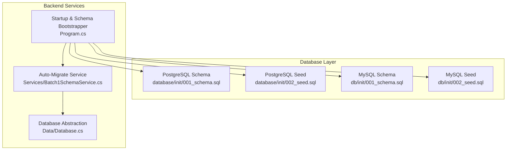
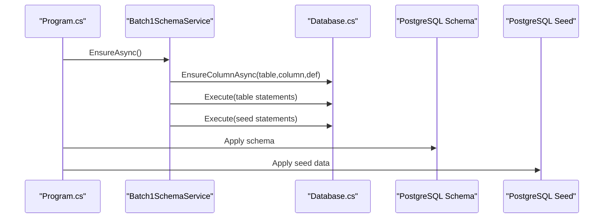
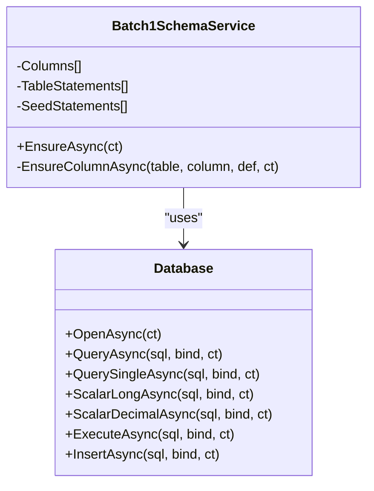
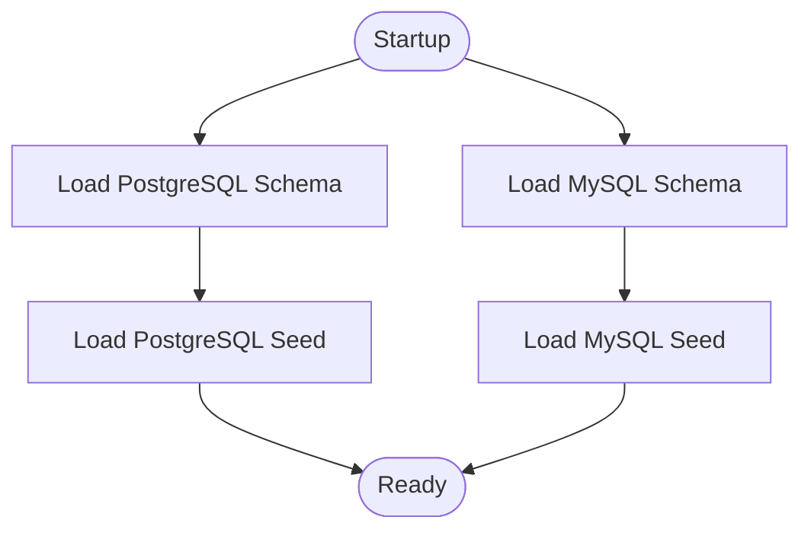
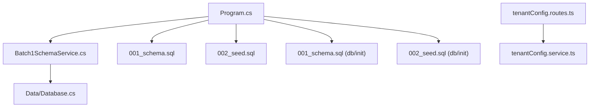

# Database Design

<cite>
**Referenced Files in This Document**
- [001_schema.sql](file://database/init/001_schema.sql)
- [002_seed.sql](file://database/init/002_seed.sql)
- [001_schema.sql](file://db/init/001_schema.sql)
- [002_seed.sql](file://db/init/002_seed.sql)
- [Batch1SchemaService.cs](file://backend-dotnet/Services/Batch1SchemaService.cs)
- [Database.cs](file://backend-dotnet/Data/Database.cs)
- [Program.cs](file://backend-dotnet/Program.cs)
- [tenantConfig.routes.ts](file://backend/src/modules/tenant-config/tenantConfig.routes.ts)
- [tenantConfig.service.ts](file://backend/src/modules/tenant-config/tenantConfig.service.ts)
</cite>

## Table of Contents
1. [Introduction](#introduction)
2. [Project Structure](#project-structure)
3. [Core Components](#core-components)
4. [Architecture Overview](#architecture-overview)
5. [Detailed Component Analysis](#detailed-component-analysis)
6. [Dependency Analysis](#dependency-analysis)
7. [Performance Considerations](#performance-considerations)
8. [Troubleshooting Guide](#troubleshooting-guide)
9. [Conclusion](#conclusion)
10. [Appendices](#appendices)

## Introduction
This document describes the OpsTrax database design for the enterprise transport and logistics platform. It covers the relational schema, entity relationships, constraints, auto-migrating schema service, database initialization and seeding, indexing strategies, performance characteristics, query patterns, and multi-tenant isolation. It also documents data models for companies, users, roles, fleet management, operations, safety, compliance, and financial modules, along with validation rules, referential integrity, and lifecycle management considerations.

## Project Structure
The database design is implemented using two complementary schema sets:
- PostgreSQL-focused schema and seed for the primary OpsTrax implementation
- MySQL-focused schema and seed for a tenant/demo variant

Additionally, the .NET backend provides an auto-migrating schema service and a database abstraction layer to support incremental schema evolution and tenant-aware operations.



**Diagram sources**
- [Program.cs:70-90](file://backend-dotnet/Program.cs#L70-L90)
- [Batch1SchemaService.cs:7-23](file://backend-dotnet/Services/Batch1SchemaService.cs#L7-L23)
- [Database.cs:10-15](file://backend-dotnet/Data/Database.cs#L10-L15)
- [001_schema.sql:1-1525](file://database/init/001_schema.sql#L1-L1525)
- [002_seed.sql:1-537](file://database/init/002_seed.sql#L1-L537)
- [001_schema.sql:1-263](file://db/init/001_schema.sql#L1-L263)
- [002_seed.sql:1-70](file://db/init/002_seed.sql#L1-L70)

**Section sources**
- [Program.cs:70-90](file://backend-dotnet/Program.cs#L70-L90)
- [Batch1SchemaService.cs:7-23](file://backend-dotnet/Services/Batch1SchemaService.cs#L7-L23)
- [Database.cs:10-15](file://backend-dotnet/Data/Database.cs#L10-L15)
- [001_schema.sql:1-1525](file://database/init/001_schema.sql#L1-L1525)
- [002_seed.sql:1-537](file://database/init/002_seed.sql#L1-L537)
- [001_schema.sql:1-263](file://db/init/001_schema.sql#L1-L263)
- [002_seed.sql:1-70](file://db/init/002_seed.sql#L1-L70)

## Core Components
- Companies and Users: Multi-tenant container and identity with role-based permissions.
- Fleet Entities: Drivers, Vehicles, Assets with assignment and status tracking.
- Operations: Jobs, Routes, Route Stops, Dispatch Assignments, Trips, Location Events.
- Safety and Compliance: Safety Events, Dashcam Events, Inspections, HOS logs, Compliance Documents.
- Finance: Fuel Transactions, Expenses, Work Orders, Maintenance Items.
- Governance: Permissions, Role Permissions, Audit Logs, Notifications, Integrations, Subscription Plans.
- Intelligence: AI Insights, AI Recommendations, KPI and SLA records, Operational Events.
- Telemetry: Enhanced location events with device telemetry fields.

**Section sources**
- [001_schema.sql:4-1525](file://database/init/001_schema.sql#L4-L1525)
- [002_seed.sql:1-537](file://database/init/002_seed.sql#L1-L537)

## Architecture Overview
The backend orchestrates schema bootstrapping and migration during startup, then applies tenant-aware filtering for queries and operations. The database supports both PostgreSQL and MySQL variants, with the PostgreSQL schema being the canonical design.



**Diagram sources**
- [Program.cs:70-90](file://backend-dotnet/Program.cs#L70-L90)
- [Batch1SchemaService.cs:7-23](file://backend-dotnet/Services/Batch1SchemaService.cs#L7-L23)
- [Database.cs:17-63](file://backend-dotnet/Data/Database.cs#L17-L63)
- [001_schema.sql:1-1525](file://database/init/001_schema.sql#L1-L1525)
- [002_seed.sql:1-537](file://database/init/002_seed.sql#L1-L537)

## Detailed Component Analysis

### Relational Schema and Entity Relationships
The schema defines core entities and their relationships:
- Companies and Users: Users belong to a Company and optionally inherit Role permissions.
- Drivers, Vehicles, Assets: Hierarchical assignment and status tracking; cross-entity documents and certifications.
- Jobs, Routes, Route Stops: Dispatch and routing orchestration with stops and ETAs.
- Location Events: Telemetry ingestion with company scoping and time-series indexing.
- Safety and Compliance: Event-driven records with dashcam and inspection workflows.
- Finance: Fuel, expenses, and maintenance/work order financial records.
- Governance: Permissions catalog and audit trail.

```mermaid
erDiagram
COMPANIES {
bigint id PK
varchar company_code UK
varchar name
varchar industry
varchar timezone
varchar status
timestamptz created_at
}
ROLES {
bigint id PK
varchar name UK
jsonb permissions_json
}
USERS {
bigint id PK
bigint company_id FK
bigint role_id FK
varchar full_name
varchar email UK
varchar role_name
varchar demo_password
varchar password_hash
jsonb permissions_json
varchar status
timestamptz created_at
}
DRIVERS {
bigint id PK
bigint company_id FK
varchar driver_code
varchar full_name
varchar phone
varchar email
varchar license_number
date license_expiry
varchar status
decimal safety_score
decimal readiness_score
decimal risk_score
decimal compliance_score
bigint assigned_vehicle_id FK
timestamptz deleted_at
timestamptz created_at
}
VEHICLES {
bigint id PK
bigint company_id FK
varchar vehicle_code
varchar type
varchar make
varchar model
int year
varchar vin
varchar plate_number
varchar status
decimal odometer_miles
decimal readiness_score
decimal data_quality_score
decimal risk_score
varchar device_status
varchar camera_status
bigint assigned_driver_id FK
timestamptz deleted_at
timestamptz created_at
}
CUSTOMERS {
bigint id PK
bigint company_id FK
varchar customer_code
varchar name
varchar contact_name
varchar email
varchar phone
varchar billing_address
varchar shipping_address
varchar status
varchar sla_tier
decimal sla_health_score
decimal delivery_experience_score
decimal risk_score
timestamptz deleted_at
timestamptz created_at
}
CONTRACTS {
bigint id PK
bigint company_id FK
bigint customer_id FK
varchar contract_code
varchar title
varchar rate_type
varchar status
date effective_date
date expiration_date
}
ASSETS {
bigint id PK
bigint company_id FK
varchar asset_code
varchar asset_type
varchar name
varchar status
varchar current_location
bigint assigned_vehicle_id FK
bigint assigned_driver_id FK
bigint customer_id FK
varchar current_zone
varchar geofence_status
decimal utilization_score
decimal risk_score
timestamptz deleted_at
timestamptz created_at
}
JOBS {
bigint id PK
bigint company_id FK
bigint customer_id FK
varchar job_code
varchar job_type
varchar pickup_address
varchar dropoff_address
timestamptz scheduled_start
timestamptz scheduled_end
varchar status
varchar priority
bigint assigned_vehicle_id FK
bigint assigned_driver_id FK
timestamptz sla_due_at
timestamptz created_at
}
ROUTES {
bigint id PK
bigint company_id FK
varchar route_code
varchar name
varchar status
bigint assigned_vehicle_id FK
bigint assigned_driver_id FK
timestamptz created_at
timestamptz deleted_at
}
ROUTE_STOPS {
bigint id PK
bigint route_id FK
bigint job_id FK
int stop_sequence
varchar address
decimal lat
decimal lng
timestamptz eta
varchar status
}
LOCATION_EVENTS {
bigint id PK
bigint company_id FK
bigint vehicle_id FK
varchar vehicle_code
bigint driver_id FK
varchar driver_code
decimal lat
decimal lng
decimal speed_mph
smallint heading
decimal accuracy_meters
decimal altitude_meters
varchar event_type
varchar engine_status
decimal fuel_level
decimal odometer_miles
decimal battery_voltage
jsonb dtc_codes
bigint geofence_id
varchar device_id
timestamptz event_time
timestamptz created_at
}
SAFETY_EVENTS {
bigint id PK
bigint company_id FK
bigint vehicle_id FK
bigint driver_id FK
varchar event_type
varchar severity
text description
varchar review_status
timestamptz event_time
}
DASHCAM_EVENTS {
bigint id PK
bigint company_id FK
bigint safety_event_id FK
varchar title
varchar severity
varchar coaching_status
timestamptz event_time
}
INSPECTIONS {
bigint id PK
bigint company_id FK
bigint vehicle_id FK
bigint driver_id FK
varchar inspection_type
varchar result
text notes
timestamptz created_at
}
HOS_LOGS {
bigint id PK
bigint company_id FK
bigint driver_id FK
date log_date
decimal driving_hours
decimal on_duty_hours
decimal cycle_hours_left
varchar status
}
COMPLIANCE_DOCUMENTS {
bigint id PK
bigint company_id FK
varchar related_entity_type
bigint related_entity_id
varchar document_type
varchar document_name
date expiry_date
varchar status
}
FUEL_TRANSACTIONS {
bigint id PK
bigint company_id FK
bigint vehicle_id FK
decimal gallons
decimal total_cost
int idle_minutes
varchar fuel_station
timestamptz transaction_time
}
EXPENSES {
bigint id PK
bigint company_id FK
varchar category
varchar title
decimal amount
varchar status
date expense_date
}
WORK_ORDERS {
bigint id PK
bigint company_id FK
bigint vehicle_id FK
varchar work_order_code
varchar title
varchar priority
varchar status
date due_date
decimal estimated_cost
}
MAINTENANCE_ITEMS {
bigint id PK
bigint company_id FK
bigint vehicle_id FK
varchar title
varchar category
date due_date
varchar status
varchar risk_level
}
VEHICLE_DOCUMENTS {
bigint id PK
bigint company_id FK
bigint vehicle_id FK
varchar document_type
varchar document_name
varchar status
date expiry_date
timestamptz created_at
}
DRIVER_DOCUMENTS {
bigint id PK
bigint company_id FK
bigint driver_id FK
varchar document_type
varchar document_name
varchar status
date expiry_date
timestamptz created_at
}
ASSET_DOCUMENTS {
bigint id PK
bigint company_id FK
bigint asset_id FK
varchar document_type
varchar document_name
varchar status
date expiry_date
timestamptz created_at
}
DRIVER_CERTIFICATIONS {
bigint id PK
bigint company_id FK
bigint driver_id FK
varchar certification_type
varchar certification_number
varchar status
date expiry_date
timestamptz created_at
}
VEHICLE_ASSIGNMENTS {
bigint id PK
bigint company_id FK
bigint vehicle_id FK
bigint driver_id FK
varchar assignment_type
varchar status
timestamptz assigned_at
}
ENTITY_TIMELINE_EVENTS {
bigint id PK
bigint company_id FK
varchar entity_type
bigint entity_id
varchar event_type
varchar title
text body
varchar severity
timestamptz created_at
}
CUSTOMER_CONTACTS {
bigint id PK
bigint company_id FK
bigint customer_id FK
varchar full_name
varchar title
varchar email
varchar phone
boolean is_primary
timestamptz created_at
}
CUSTOMER_ADDRESSES {
bigint id PK
bigint company_id FK
bigint customer_id FK
varchar address_type
varchar address_line
varchar city
varchar state
varchar postal_code
timestamptz created_at
}
PERMISSIONS {
bigint id PK
varchar permission_key UK
varchar label
varchar module_group
text description
}
ROLE_PERMISSIONS {
bigint id PK
bigint role_id FK
varchar permission_key FK
unique role_id permission_key
}
USER_SESSIONS {
bigint id PK
bigint user_id FK
bigint company_id FK
varchar session_token UK
timestamptz expires_at
timestamptz created_at
}
AUDIT_LOGS {
bigint id PK
bigint company_id FK
bigint actor_user_id FK
varchar actor_name
varchar action_name
varchar entity_name
bigint entity_id
jsonb details_json
timestamptz created_at
}
NOTIFICATIONS {
bigint id PK
bigint company_id FK
varchar title
text body
varchar status
timestamptz created_at
}
INTEGRATIONS {
bigint id PK
bigint company_id FK
varchar provider_name
varchar category
varchar status
}
SUBSCRIPTION_PLANS {
bigint id PK
bigint company_id FK
varchar plan_name
varchar billing_status
int seats
decimal monthly_amount
}
AI_INSIGHTS {
bigint id PK
bigint company_id FK
varchar insight_type
varchar title
text body
varchar severity
varchar status
timestamptz created_at
}
AI_RECOMMENDATIONS {
bigint id PK
bigint company_id FK
varchar module_key
varchar title
text body
decimal score
varchar status
}
OPERATIONAL_EVENTS {
bigint id PK
bigint company_id FK
varchar entity_type
bigint entity_id
varchar event_type
varchar title
varchar severity
timestamptz event_time
}
CUSTOMER_COMMUNICATIONS {
bigint id PK
bigint company_id FK
bigint customer_id FK
bigint job_id FK
varchar channel
text message
varchar status
timestamptz sent_at
}
PROOF_OF_DELIVERY {
bigint id PK
bigint company_id FK
bigint job_id FK
varchar receiver_name
varchar status
timestamptz captured_at
}
DISPATCH_RECOMMENDATIONS {
bigint id PK
bigint company_id FK
bigint job_id FK
bigint vehicle_id FK
bigint driver_id FK
text recommendation
decimal score
varchar status
}
ETA_UPDATES {
bigint id PK
bigint company_id FK
bigint job_id FK
text message
varchar channel
varchar status
timestamptz sent_at
}
MODULE_RECORDS {
bigint id PK
varchar module_key
varchar title
varchar status
varchar owner_name
varchar location_name
timestamptz due_at
varchar risk_level
decimal amount
jsonb metadata_json
timestamptz created_at
}
KPI_RECORDS {
bigint id PK
bigint company_id FK
varchar metric_key
varchar label
varchar value_text
varchar trend
varchar trend_value
varchar status
}
SLA_RECORDS {
bigint id PK
bigint company_id FK
bigint customer_id FK
varchar metric_name
decimal target_value
decimal actual_value
varchar status
}
COMPANIES ||--o{ USERS : "has"
COMPANIES ||--o{ DRIVERS : "has"
COMPANIES ||--o{ VEHICLES : "has"
COMPANIES ||--o{ CUSTOMERS : "has"
COMPANIES ||--o{ ASSETS : "has"
COMPANIES ||--o{ JOBS : "has"
COMPANIES ||--o{ ROUTES : "has"
COMPANIES ||--o{ LOCATION_EVENTS : "has"
COMPANIES ||--o{ SAFETY_EVENTS : "has"
COMPANIES ||--o{ INSPECTIONS : "has"
COMPANIES ||--o{ HOS_LOGS : "has"
COMPANIES ||--o{ COMPLIANCE_DOCUMENTS : "has"
COMPANIES ||--o{ FUEL_TRANSACTIONS : "has"
COMPANIES ||--o{ EXPENSES : "has"
COMPANIES ||--o{ WORK_ORDERS : "has"
COMPANIES ||--o{ MAINTENANCE_ITEMS : "has"
COMPANIES ||--o{ VEHICLE_DOCUMENTS : "has"
COMPANIES ||--o{ DRIVER_DOCUMENTS : "has"
COMPANIES ||--o{ ASSET_DOCUMENTS : "has"
COMPANIES ||--o{ DRIVER_CERTIFICATIONS : "has"
COMPANIES ||--o{ VEHICLE_ASSIGNMENTS : "has"
COMPANIES ||--o{ ENTITY_TIMELINE_EVENTS : "has"
COMPANIES ||--o{ CUSTOMER_CONTACTS : "has"
COMPANIES ||--o{ CUSTOMER_ADDRESSES : "has"
COMPANIES ||--o{ AUDIT_LOGS : "has"
COMPANIES ||--o{ NOTIFICATIONS : "has"
COMPANIES ||--o{ INTEGRATIONS : "has"
COMPANIES ||--o{ SUBSCRIPTION_PLANS : "has"
COMPANIES ||--o{ AI_INSIGHTS : "has"
COMPANIES ||--o{ AI_RECOMMENDATIONS : "has"
COMPANIES ||--o{ OPERATIONAL_EVENTS : "has"
COMPANIES ||--o{ CUSTOMER_COMMUNICATIONS : "has"
COMPANIES ||--o{ PROOF_OF_DELIVERY : "has"
COMPANIES ||--o{ DISPATCH_RECOMMENDATIONS : "has"
COMPANIES ||--o{ ETA_UPDATES : "has"
COMPANIES ||--o{ MODULE_RECORDS : "has"
COMPANIES ||--o{ KPI_RECORDS : "has"
COMPANIES ||--o{ SLA_RECORDS : "has"
DRIVERS ||--o{ VEHICLE_ASSIGNMENTS : "assigned"
VEHICLES ||--o{ VEHICLE_ASSIGNMENTS : "assigned"
CUSTOMERS ||--o{ CONTRACTS : "has"
CUSTOMERS ||--o{ JOBS : "has"
VEHICLES ||--o{ JOBS : "assigned"
DRIVERS ||--o{ JOBS : "assigned"
VEHICLES ||--o{ LOCATION_EVENTS : "tracked"
DRIVERS ||--o{ LOCATION_EVENTS : "tracked"
VEHICLES ||--o{ SAFETY_EVENTS : "involved"
DRIVERS ||--o{ SAFETY_EVENTS : "involved"
VEHICLES ||--o{ INSPECTIONS : "inspected"
DRIVERS ||--o{ INSPECTIONS : "involved"
DRIVERS ||--o{ HOS_LOGS : "logged"
VEHICLES ||--o{ FUEL_TRANSACTIONS : "refueled"
VEHICLES ||--o{ WORK_ORDERS : "assigned"
VEHICLES ||--o{ MAINTENANCE_ITEMS : "has"
VEHICLES ||--o{ VEHICLE_DOCUMENTS : "has"
DRIVERS ||--o{ DRIVER_DOCUMENTS : "has"
ASSETS ||--o{ ASSET_DOCUMENTS : "has"
DRIVERS ||--o{ DRIVER_CERTIFICATIONS : "has"
CUSTOMERS ||--o{ CUSTOMER_CONTACTS : "has"
CUSTOMERS ||--o{ CUSTOMER_ADDRESSES : "has"
CUSTOMERS ||--o{ CUSTOMER_COMMUNICATIONS : "receives"
JOBS ||--o{ CUSTOMER_COMMUNICATIONS : "related"
JOBS ||--o{ PROOF_OF_DELIVERY : "has"
JOBS ||--o{ DISPATCH_RECOMMENDATIONS : "recommended"
VEHICLES ||--o{ ETA_UPDATES : "related"
DRIVERS ||--o{ ETA_UPDATES : "related"
ROUTES ||--o{ ROUTE_STOPS : "contains"
JOBS ||--o{ ROUTE_STOPS : "visits"
```

**Diagram sources**
- [001_schema.sql:4-1525](file://database/init/001_schema.sql#L4-L1525)

**Section sources**
- [001_schema.sql:4-1525](file://database/init/001_schema.sql#L4-L1525)

### Auto-Migrating Schema Service
The backend initializes and evolves the schema in batches. The Batch1 service ensures required columns exist, creates new tables, and seeds data. It uses a lightweight database abstraction to execute migrations and seed scripts.



**Diagram sources**
- [Batch1SchemaService.cs:5-272](file://backend-dotnet/Services/Batch1SchemaService.cs#L5-L272)
- [Database.cs:5-86](file://backend-dotnet/Data/Database.cs#L5-L86)

**Section sources**
- [Batch1SchemaService.cs:7-23](file://backend-dotnet/Services/Batch1SchemaService.cs#L7-L23)
- [Database.cs:17-63](file://backend-dotnet/Data/Database.cs#L17-L63)

### Database Initialization and Seed Management
- PostgreSQL schema and seed initialize the canonical design with extensive entities and indexes.
- MySQL schema and seed provide a tenant/demo variant with a simplified entity set and indexes.
- The backend bootstraps schema and seed during startup, ensuring idempotent creation and population.



**Diagram sources**
- [Program.cs:70-90](file://backend-dotnet/Program.cs#L70-L90)
- [001_schema.sql:1-1525](file://database/init/001_schema.sql#L1-L1525)
- [002_seed.sql:1-537](file://database/init/002_seed.sql#L1-L537)
- [001_schema.sql:1-263](file://db/init/001_schema.sql#L1-L263)
- [002_seed.sql:1-70](file://db/init/002_seed.sql#L1-L70)

**Section sources**
- [Program.cs:70-90](file://backend-dotnet/Program.cs#L70-L90)
- [001_schema.sql:1-1525](file://database/init/001_schema.sql#L1-L1525)
- [002_seed.sql:1-537](file://database/init/002_seed.sql#L1-L537)
- [001_schema.sql:1-263](file://db/init/001_schema.sql#L1-L263)
- [002_seed.sql:1-70](file://db/init/002_seed.sql#L1-L70)

### Indexing Strategies and Performance Optimization
- Tenant scoping: Many tables include a company_id or tenant_id to isolate data per tenant.
- Time-series indexing: Location events indexed by company_id and event_time; audit logs indexed by company_id and created_at.
- Composite indexes: Vehicles/drivers/customers/assets indexed by status and risk_score; jobs indexed by status and priority; vehicle/document/certification lookup indexes optimized for frequent joins.
- JSONB fields: Permissions and audit details stored as JSONB for flexible governance and reporting.

**Section sources**
- [001_schema.sql:240-240](file://database/init/001_schema.sql#L240-L240)
- [001_schema.sql:327-327](file://database/init/001_schema.sql#L327-L327)
- [001_schema.sql:530-532](file://database/init/001_schema.sql#L530-L532)
- [001_schema.sql:627-649](file://database/init/001_schema.sql#L627-L649)
- [001_schema.sql:183-185](file://database/init/001_schema.sql#L183-L185)

### Query Patterns and Business Constraints
- Multi-tenant queries: Backend enforces company_id filters for tenant isolation.
- RBAC: Permissions are merged from user and role permissions; super admin gets wildcard access.
- Status and priority: Jobs, vehicles, drivers, assets, and work orders use standardized status enums and priority levels.
- Compliance and safety: Documents and certifications enforce expiry dates; safety events track severity and review status.
- Telemetry: Location events include device telemetry fields and timestamps for real-time dashboards.

**Section sources**
- [Program.cs:190-244](file://backend-dotnet/Program.cs#L190-L244)
- [001_schema.sql:4-1525](file://database/init/001_schema.sql#L4-L1525)

### Data Lifecycle Management, Retention, and Backup
- Deleted records: Soft-deletion fields (deleted_at) on drivers, vehicles, customers, assets enable historical tracking.
- Expiry tracking: Compliance documents and certifications maintain expiry_date for renewal workflows.
- Audit logs: Immutable audit trails capture actions and entity changes for governance.
- Seed data: Comprehensive seed populates demo tenants with realistic operational data.

**Section sources**
- [001_schema.sql:50-55](file://database/init/001_schema.sql#L50-L55)
- [001_schema.sql:196-203](file://database/init/001_schema.sql#L196-L203)
- [002_seed.sql:242-250](file://database/init/002_seed.sql#L242-L250)
- [002_seed.sql:346-353](file://database/init/002_seed.sql#L346-L353)

### Multi-Tenant Data Isolation
- Tenant container: Companies (PostgreSQL) or Tenants (MySQL) define logical boundaries.
- Identity and access: Users are scoped to a company/tenant; sessions include company_id for enforcement.
- Query isolation: Backend middleware injects company_id filters in generated SQL for reporting and datasets.

**Section sources**
- [001_schema.sql:4-12](file://database/init/001_schema.sql#L4-L12)
- [001_schema.sql:4-12](file://db/init/001_schema.sql#L4-L12)
- [Program.cs:190-244](file://backend-dotnet/Program.cs#L190-L244)
- [tenantConfig.routes.ts:7-36](file://backend/src/modules/tenant-config/tenantConfig.routes.ts#L7-L36)
- [tenantConfig.service.ts:25-50](file://backend/src/modules/tenant-config/tenantConfig.service.ts#L25-L50)

## Dependency Analysis
The backend depends on the database abstraction to execute migrations and seed scripts, and relies on schema definitions for entity modeling. Tenant configuration is handled by the frontend/backend tenant-config module, while the backend enforces tenant isolation at runtime.



**Diagram sources**
- [Program.cs:70-90](file://backend-dotnet/Program.cs#L70-L90)
- [Batch1SchemaService.cs:7-23](file://backend-dotnet/Services/Batch1SchemaService.cs#L7-L23)
- [Database.cs:10-15](file://backend-dotnet/Data/Database.cs#L10-L15)
- [001_schema.sql:1-1525](file://database/init/001_schema.sql#L1-L1525)
- [002_seed.sql:1-537](file://database/init/002_seed.sql#L1-L537)
- [001_schema.sql:1-263](file://db/init/001_schema.sql#L1-L263)
- [002_seed.sql:1-70](file://db/init/002_seed.sql#L1-L70)
- [tenantConfig.routes.ts:1-57](file://backend/src/modules/tenant-config/tenantConfig.routes.ts#L1-L57)
- [tenantConfig.service.ts:1-50](file://backend/src/modules/tenant-config/tenantConfig.service.ts#L1-L50)

**Section sources**
- [Program.cs:70-90](file://backend-dotnet/Program.cs#L70-L90)
- [Batch1SchemaService.cs:7-23](file://backend-dotnet/Services/Batch1SchemaService.cs#L7-L23)
- [Database.cs:10-15](file://backend-dotnet/Data/Database.cs#L10-L15)
- [001_schema.sql:1-1525](file://database/init/001_schema.sql#L1-L1525)
- [002_seed.sql:1-537](file://database/init/002_seed.sql#L1-L537)
- [001_schema.sql:1-263](file://db/init/001_schema.sql#L1-L263)
- [002_seed.sql:1-70](file://db/init/002_seed.sql#L1-L70)
- [tenantConfig.routes.ts:1-57](file://backend/src/modules/tenant-config/tenantConfig.routes.ts#L1-L57)
- [tenantConfig.service.ts:1-50](file://backend/src/modules/tenant-config/tenantConfig.service.ts#L1-L50)

## Performance Considerations
- Prefer tenant-scoped queries with appropriate indexes (company_id + time or status).
- Use JSONB fields judiciously; denormalize only when query patterns require it.
- Batch writes for telemetry ingestion; leverage indexes for time-series retrieval.
- Monitor audit logs and operational events for hotspots; consider partitioning strategies for very large tenants.

## Troubleshooting Guide
- Schema migration failures: The startup routine catches exceptions per batch and continues; inspect logs for specific failures.
- Session validation: Unauthorized responses indicate invalid or expired bearer tokens; ensure user_sessions are valid and not expired.
- Tenant isolation: If queries return unexpected results, verify company_id filters are applied consistently.

**Section sources**
- [Program.cs:433-443](file://backend-dotnet/Program.cs#L433-L443)
- [Program.cs:190-244](file://backend-dotnet/Program.cs#L190-L244)

## Conclusion
OpsTrax employs a robust, multi-tenant relational design with strong referential integrity, comprehensive indexing, and an auto-migrating schema service. The PostgreSQL schema serves as the canonical design, while the MySQL variant supports tenant/demo scenarios. Tenant isolation is enforced at runtime, and governance, safety, compliance, and financial modules are integrated into a cohesive data model optimized for real-time operations and reporting.

## Appendices
- Data models for companies, users, roles, fleet, operations, safety, compliance, and finance are defined in the schema files.
- Indexes and constraints are documented alongside entity definitions.
- Tenant configuration is validated and built at runtime in the tenant-config module.