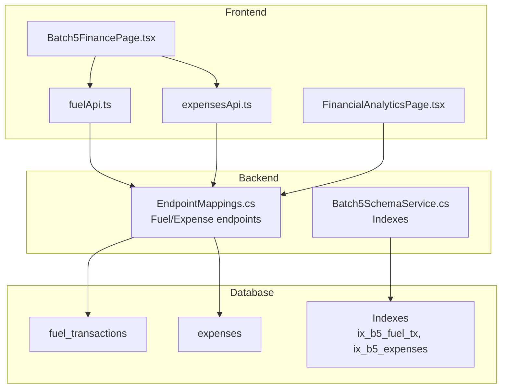
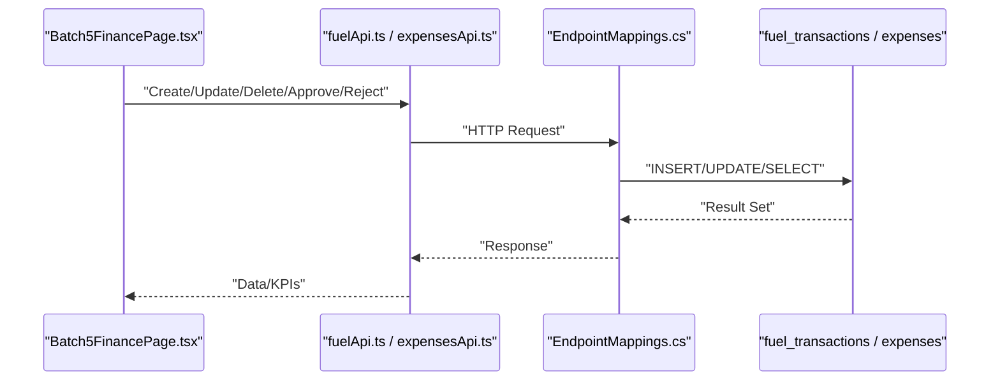
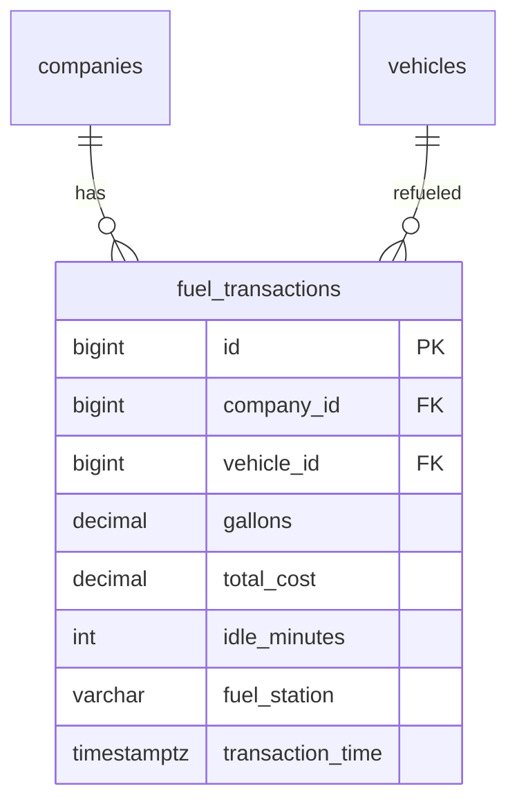
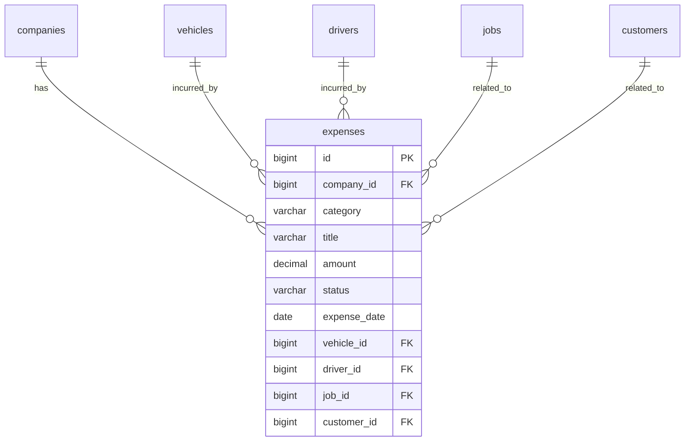
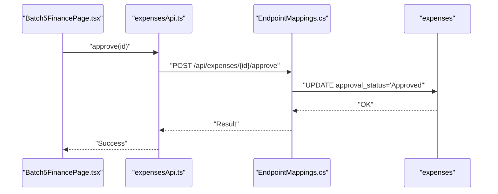
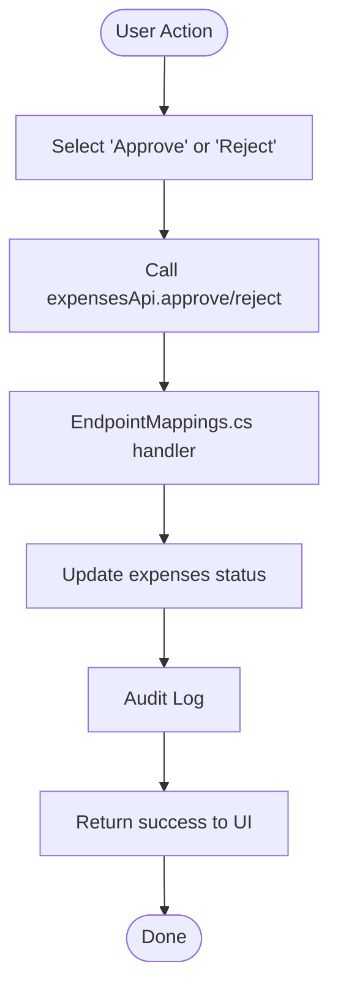
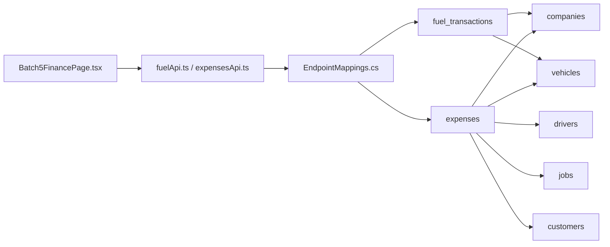

# Financial Transaction Tables

<cite>
**Referenced Files in This Document**
- [001_schema.sql](file://db/init/001_schema.sql)
- [001_schema.sql](file://database/init/001_schema.sql)
- [expensesApi.ts](file://frontend/src/services/expensesApi.ts)
- [fuelApi.ts](file://frontend/src/services/fuelApi.ts)
- [EndpointMappings.cs](file://backend-dotnet/Controllers/EndpointMappings.cs)
- [Batch5SchemaService.cs](file://backend-dotnet/Services/Batch5SchemaService.cs)
- [Batch5FinancePage.tsx](file://frontend/src/pages/Batch5FinancePage.tsx)
- [FinancialAnalyticsPage.tsx](file://frontend/src/pages/FinancialAnalyticsPage.tsx)
</cite>

## Table of Contents
1. [Introduction](#introduction)
2. [Project Structure](#project-structure)
3. [Core Components](#core-components)
4. [Architecture Overview](#architecture-overview)
5. [Detailed Component Analysis](#detailed-component-analysis)
6. [Dependency Analysis](#dependency-analysis)
7. [Performance Considerations](#performance-considerations)
8. [Troubleshooting Guide](#troubleshooting-guide)
9. [Conclusion](#conclusion)
10. [Appendices](#appendices)

## Introduction
This document describes the financial transaction tables and systems for fuel transactions, operating expenses, and related financial records. It explains how gallons purchased, total cost, idle minutes tracking, and fuel station identification are modeled, how expense categorization, approval workflows, and expense date tracking operate, and how maintenance costs integrate with financial transactions. It also covers asset depreciation tracking, budget management, vendor payment processing, receipt management, and financial reporting capabilities. Finally, it provides examples of fuel transaction workflows, expense approval processes, and financial reconciliation procedures.

## Project Structure
The financial domain spans database schemas, backend API controllers, and frontend services/pages:
- Database schemas define fuel_transactions, expenses, and supporting indexes.
- Backend controllers expose endpoints for fuel and expense operations, approvals, and summaries.
- Frontend services encapsulate API calls for fuel and expenses; pages orchestrate workflows and KPIs.

**Diagram sources**
- [001_schema.sql:372-381](file://db/init/001_schema.sql#L372-L381)
- [001_schema.sql:438-446](file://database/init/001_schema.sql#L438-L446)
- [EndpointMappings.cs:5141-5282](file://backend-dotnet/Controllers/EndpointMappings.cs#L5141-L5282)
- [Batch5SchemaService.cs:208-225](file://backend-dotnet/Services/Batch5SchemaService.cs#L208-L225)
- [fuelApi.ts:1-26](file://frontend/src/services/fuelApi.ts#L1-L26)
- [expensesApi.ts:1-21](file://frontend/src/services/expensesApi.ts#L1-L21)
- [Batch5FinancePage.tsx:55-644](file://frontend/src/pages/Batch5FinancePage.tsx#L55-L644)
- [FinancialAnalyticsPage.tsx:138-212](file://frontend/src/pages/FinancialAnalyticsPage.tsx#L138-L212)

**Section sources**
- [001_schema.sql:372-381](file://db/init/001_schema.sql#L372-L381)
- [001_schema.sql:438-446](file://database/init/001_schema.sql#L438-L446)
- [EndpointMappings.cs:5141-5282](file://backend-dotnet/Controllers/EndpointMappings.cs#L5141-L5282)
- [Batch5SchemaService.cs:208-225](file://backend-dotnet/Services/Batch5SchemaService.cs#L208-L225)
- [fuelApi.ts:1-26](file://frontend/src/services/fuelApi.ts#L1-L26)
- [expensesApi.ts:1-21](file://frontend/src/services/expensesApi.ts#L1-L21)
- [Batch5FinancePage.tsx:55-644](file://frontend/src/pages/Batch5FinancePage.tsx#L55-L644)
- [FinancialAnalyticsPage.tsx:138-212](file://frontend/src/pages/FinancialAnalyticsPage.tsx#L138-L212)

## Core Components
- fuel_transactions: Stores per-fuel-up data including gallons, total cost, idle minutes, fuel station, and timestamp. Includes foreign keys to company and vehicle.
- expenses: Stores operating expenses with category, title, amount, status, and expense_date. Includes optional foreign keys to vehicle, driver, job, and customer.
- Backend endpoints: Provide fuel transaction CRUD, anomaly review, idling events, and expense CRUD, approval, and summary queries.
- Frontend services: Expose typed API methods for fuel and expenses, including approval/rejection actions.
- Indexes: Optimized lookups for fuel anomalies, idling events, and expense approvals.

**Section sources**
- [001_schema.sql:372-381](file://db/init/001_schema.sql#L372-L381)
- [001_schema.sql:438-446](file://database/init/001_schema.sql#L438-L446)
- [EndpointMappings.cs:5141-5282](file://backend-dotnet/Controllers/EndpointMappings.cs#L5141-L5282)
- [Batch5SchemaService.cs:208-225](file://backend-dotnet/Services/Batch5SchemaService.cs#L208-L225)
- [fuelApi.ts:1-26](file://frontend/src/services/fuelApi.ts#L1-L26)
- [expensesApi.ts:1-21](file://frontend/src/services/expensesApi.ts#L1-L21)

## Architecture Overview
The financial transaction system follows a layered architecture:
- Data layer: fuel_transactions and expenses tables with appropriate constraints and indexes.
- Service layer: backend controllers expose REST endpoints for fuel and expense operations.
- Presentation layer: frontend services and pages consume endpoints to manage workflows and display KPIs.

**Diagram sources**
- [Batch5FinancePage.tsx:55-644](file://frontend/src/pages/Batch5FinancePage.tsx#L55-L644)
- [fuelApi.ts:1-26](file://frontend/src/services/fuelApi.ts#L1-L26)
- [expensesApi.ts:1-21](file://frontend/src/services/expensesApi.ts#L1-L21)
- [EndpointMappings.cs:5141-5282](file://backend-dotnet/Controllers/EndpointMappings.cs#L5141-L5282)
- [001_schema.sql:372-381](file://db/init/001_schema.sql#L372-L381)
- [001_schema.sql:438-446](file://database/init/001_schema.sql#L438-L446)

## Detailed Component Analysis

### fuel_transactions table
- Purpose: Capture fuel purchase events with gallons, total cost, idle minutes, fuel station, and timestamp.
- Key attributes:
  - gallons: Purchased volume.
  - total_cost: Monetary amount.
  - idle_minutes: Engine idle time during refueling.
  - fuel_station: Name or identifier of the station.
  - transaction_time: Timestamp of the transaction.
- Foreign keys:
  - company_id (PostgreSQL schema) or tenant_id (MySQL schema).
  - vehicle_id (optional).
- Indexes:
  - ix_b5_fuel_tx: Optimizes fuel analytics by company, vehicle, driver, anomaly status, and date.

**Diagram sources**
- [001_schema.sql:372-381](file://database/init/001_schema.sql#L372-L381)
- [Batch5SchemaService.cs:208-225](file://backend-dotnet/Services/Batch5SchemaService.cs#L208-L225)

**Section sources**
- [001_schema.sql:372-381](file://database/init/001_schema.sql#L372-L381)
- [Batch5SchemaService.cs:208-225](file://backend-dotnet/Services/Batch5SchemaService.cs#L208-L225)

### expenses table
- Purpose: Record operating expenses with category, amount, approval status, and expense date.
- Key attributes:
  - category: Expense category (e.g., fuel, maintenance, tolls).
  - title: Description of the expense.
  - amount: Monetary amount.
  - status/approval_status: Workflow state (e.g., Pending, Approved, Rejected).
  - expense_date: Date the expense was incurred.
- Optional foreign keys:
  - vehicle_id, driver_id, job_id, customer_id.
- Indexes:
  - ix_b5_expenses: Optimizes expense queries by company, vehicle, driver, approval status, and expense_date.

**Diagram sources**
- [001_schema.sql:438-446](file://database/init/001_schema.sql#L438-L446)
- [Batch5SchemaService.cs:208-225](file://backend-dotnet/Services/Batch5SchemaService.cs#L208-L225)

**Section sources**
- [001_schema.sql:438-446](file://database/init/001_schema.sql#L438-L446)
- [Batch5SchemaService.cs:208-225](file://backend-dotnet/Services/Batch5SchemaService.cs#L208-L225)

### Backend endpoints for fuel and expenses
- Fuel endpoints:
  - List/summary, transaction detail, create/update/delete.
  - Idling events CRUD and recommendations.
  - Vehicle/driver summaries and anomaly review.
- Expense endpoints:
  - Summary and list with risk heat scores and recommendations.
  - Detail view with audit trail and recommendations.
  - Create, update, approve, reject, and import preview placeholders.
- Permissions:
  - Approve/reject require finance:manage permission.

**Diagram sources**
- [Batch5FinancePage.tsx:634-644](file://frontend/src/pages/Batch5FinancePage.tsx#L634-L644)
- [expensesApi.ts:16-17](file://frontend/src/services/expensesApi.ts#L16-L17)
- [EndpointMappings.cs:5247-5265](file://backend-dotnet/Controllers/EndpointMappings.cs#L5247-L5265)

**Section sources**
- [EndpointMappings.cs:5141-5282](file://backend-dotnet/Controllers/EndpointMappings.cs#L5141-L5282)
- [expensesApi.ts:1-21](file://frontend/src/services/expensesApi.ts#L1-L21)

### Frontend services and pages
- fuelApi.ts:
  - Provides methods for fuel transactions, idling events, summaries, anomalies, and recommendations.
- expensesApi.ts:
  - Provides methods for expense CRUD, approval/rejection, categories, and recommendations.
- Batch5FinancePage.tsx:
  - Orchestrates fuel anomalies and expense approvals via runAction.
- FinancialAnalyticsPage.tsx:
  - Demonstrates invoice/payment analytics and KPIs (complementary to financial reporting).

**Diagram sources**
- [Batch5FinancePage.tsx:634-644](file://frontend/src/pages/Batch5FinancePage.tsx#L634-L644)
- [expensesApi.ts:16-17](file://frontend/src/services/expensesApi.ts#L16-L17)
- [EndpointMappings.cs:5247-5265](file://backend-dotnet/Controllers/EndpointMappings.cs#L5247-L5265)

**Section sources**
- [fuelApi.ts:1-26](file://frontend/src/services/fuelApi.ts#L1-L26)
- [expensesApi.ts:1-21](file://frontend/src/services/expensesApi.ts#L1-L21)
- [Batch5FinancePage.tsx:55-644](file://frontend/src/pages/Batch5FinancePage.tsx#L55-L644)
- [FinancialAnalyticsPage.tsx:138-212](file://frontend/src/pages/FinancialAnalyticsPage.tsx#L138-L212)

## Dependency Analysis
- fuel_transactions depends on company and vehicle.
- expenses depends on company and optionally on vehicle, driver, job, and customer.
- Backend controllers depend on database queries and audit logging.
- Frontend pages depend on services for data fetching and mutation.

**Diagram sources**
- [001_schema.sql:372-381](file://database/init/001_schema.sql#L372-L381)
- [001_schema.sql:438-446](file://database/init/001_schema.sql#L438-L446)
- [EndpointMappings.cs:5141-5282](file://backend-dotnet/Controllers/EndpointMappings.cs#L5141-L5282)
- [fuelApi.ts:1-26](file://frontend/src/services/fuelApi.ts#L1-L26)
- [expensesApi.ts:1-21](file://frontend/src/services/expensesApi.ts#L1-L21)
- [Batch5FinancePage.tsx:55-644](file://frontend/src/pages/Batch5FinancePage.tsx#L55-L644)

**Section sources**
- [001_schema.sql:372-381](file://database/init/001_schema.sql#L372-L381)
- [001_schema.sql:438-446](file://database/init/001_schema.sql#L438-L446)
- [EndpointMappings.cs:5141-5282](file://backend-dotnet/Controllers/EndpointMappings.cs#L5141-L5282)
- [fuelApi.ts:1-26](file://frontend/src/services/fuelApi.ts#L1-L26)
- [expensesApi.ts:1-21](file://frontend/src/services/expensesApi.ts#L1-L21)
- [Batch5FinancePage.tsx:55-644](file://frontend/src/pages/Batch5FinancePage.tsx#L55-L644)

## Performance Considerations
- Indexes:
  - ix_b5_fuel_tx: Improves fuel analytics and anomaly filtering.
  - ix_b5_expenses: Improves expense listing and approval workflows.
- Data types:
  - Use numeric types for currency and decimals for precise calculations.
- Pagination and filtering:
  - Prefer server-side pagination and filters for large datasets (as seen in backend handlers).
- Audit logs:
  - Keep audit trails minimal and indexed by time for efficient retrieval.

[No sources needed since this section provides general guidance]

## Troubleshooting Guide
- Expense approval failures:
  - Verify permissions (finance:manage) and that the expense exists.
  - Check backend audit logs for approval/rejection actions.
- Missing receipts:
  - Use expense recommendations to prompt uploading receipts before approval.
- Fuel anomalies:
  - Review anomalies and mark as reviewed after investigation.
- Data discrepancies:
  - Cross-check fuel_transactions and expenses against audit logs and entity joins.

**Section sources**
- [EndpointMappings.cs:5141-5282](file://backend-dotnet/Controllers/EndpointMappings.cs#L5141-L5282)
- [Batch5FinancePage.tsx:634-644](file://frontend/src/pages/Batch5FinancePage.tsx#L634-L644)

## Conclusion
The financial transaction system integrates fuel and expense data with robust backend endpoints and frontend workflows. It supports approval workflows, anomaly detection, receipt tracking, and reporting. Proper indexing and permission controls ensure performance and governance. The described components and flows provide a solid foundation for fleet financial management.

[No sources needed since this section summarizes without analyzing specific files]

## Appendices

### Appendix A: Fuel Transaction Workflow Example
- Steps:
  - Create fuel transaction with gallons, total cost, idle minutes, fuel station, and timestamp.
  - Optionally associate with vehicle.
  - Review anomalies and recommendations.
  - Use vehicle/driver summaries for insights.

**Section sources**
- [001_schema.sql:372-381](file://database/init/001_schema.sql#L372-L381)
- [fuelApi.ts:1-26](file://frontend/src/services/fuelApi.ts#L1-L26)
- [Batch5FinancePage.tsx:55-644](file://frontend/src/pages/Batch5FinancePage.tsx#L55-L644)

### Appendix B: Expense Approval Process Example
- Steps:
  - Create expense with category, title, amount, and expense_date.
  - Optionally attach vehicle/driver/job/customer.
  - Approve or reject via API with finance:manage permission.
  - View recommendations and audit trail.

**Section sources**
- [001_schema.sql:438-446](file://database/init/001_schema.sql#L438-L446)
- [expensesApi.ts:1-21](file://frontend/src/services/expensesApi.ts#L1-L21)
- [EndpointMappings.cs:5247-5265](file://backend-dotnet/Controllers/EndpointMappings.cs#L5247-L5265)

### Appendix C: Financial Reconciliation Procedures
- Procedures:
  - Match fuel_transactions to vendor statements and receipts.
  - Reconcile expenses against approved reports and receipts.
  - Monitor aging invoices and payments for cash flow.
  - Use backend summaries and frontend KPIs for oversight.

**Section sources**
- [EndpointMappings.cs:5141-5147](file://backend-dotnet/Controllers/EndpointMappings.cs#L5141-L5147)
- [FinancialAnalyticsPage.tsx:138-212](file://frontend/src/pages/FinancialAnalyticsPage.tsx#L138-L212)