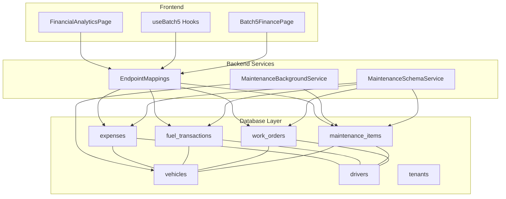
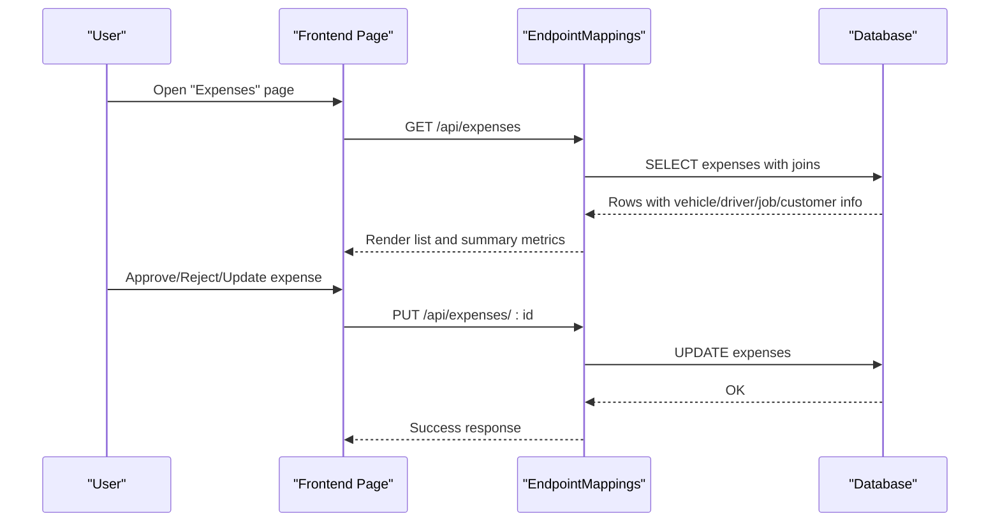
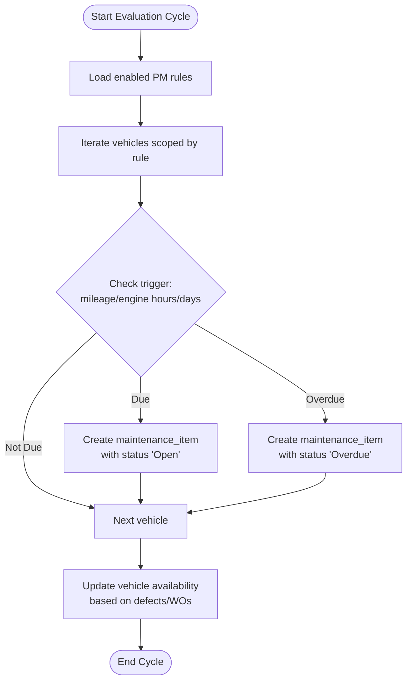
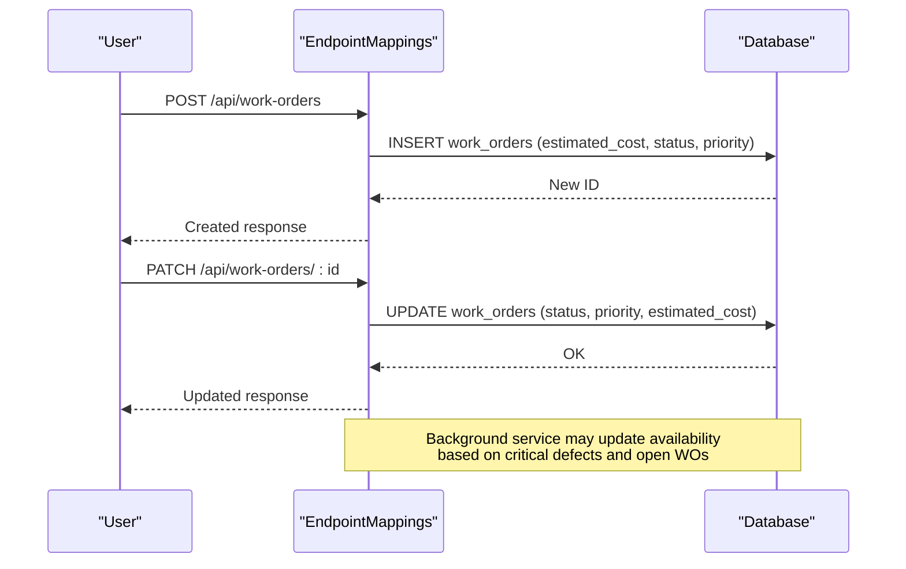
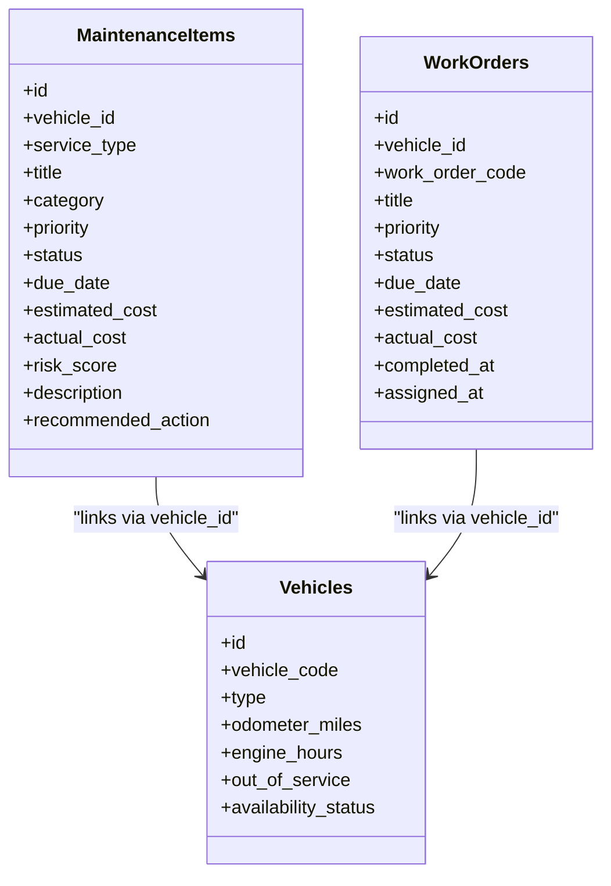
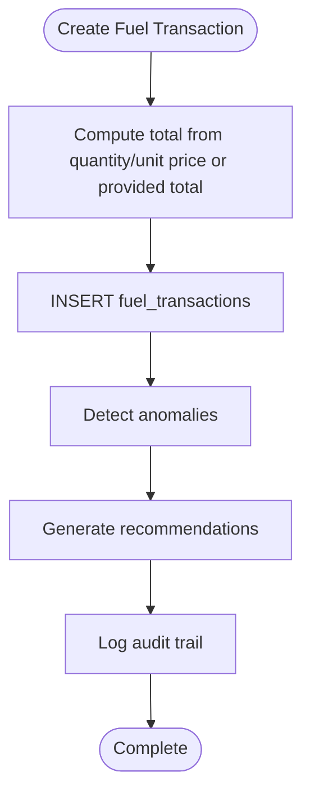
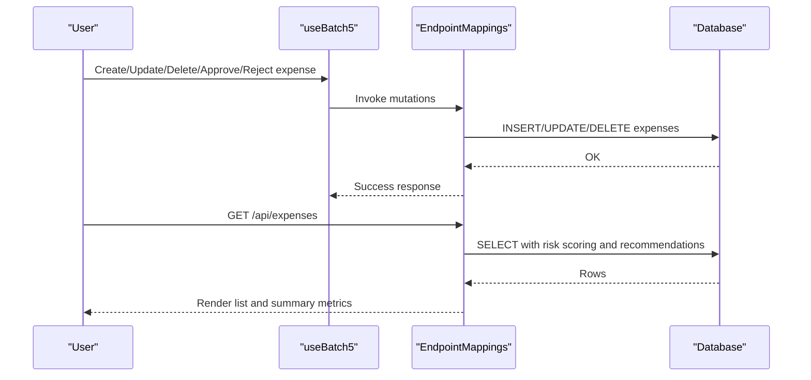
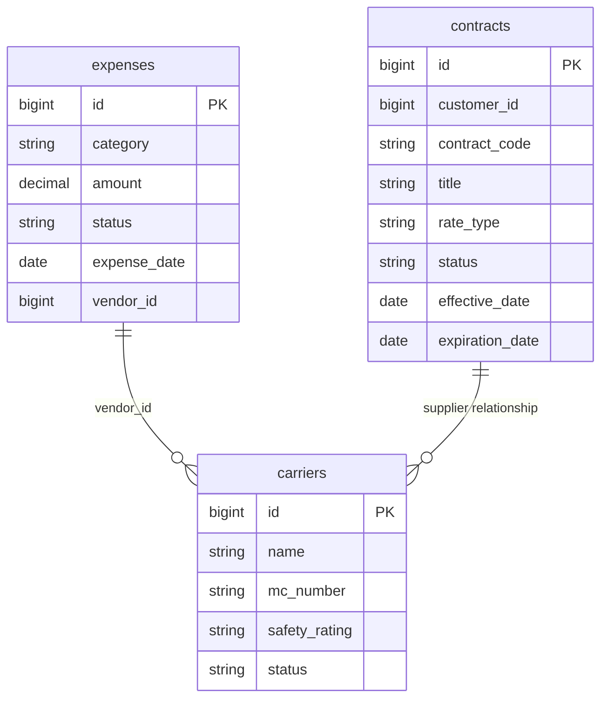
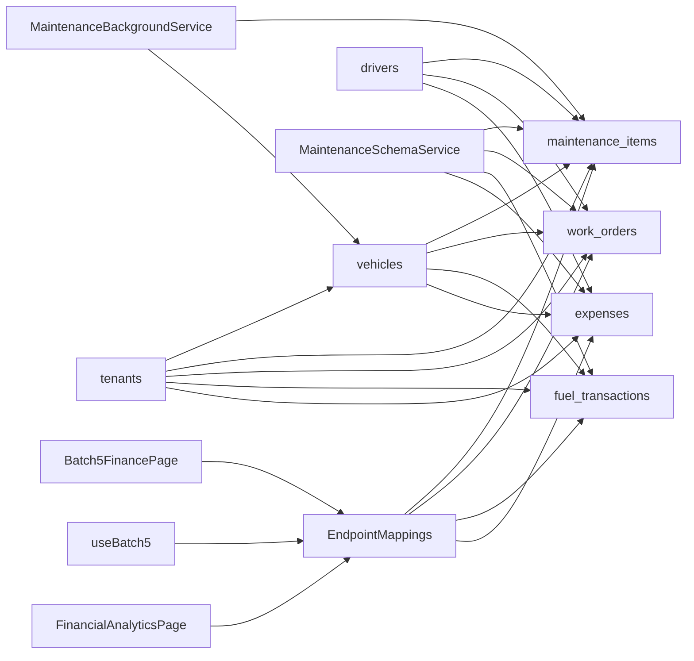

# Maintenance & Financial Tables

<cite>
**Referenced Files in This Document**
- [001_schema.sql](file://db/init/001_schema.sql)
- [002_seed.sql](file://db/init/002_seed.sql)
- [MaintenanceSchemaService.cs](file://backend-dotnet/Services/MaintenanceSchemaService.cs)
- [MaintenanceBackgroundService.cs](file://backend-dotnet/Services/MaintenanceBackgroundService.cs)
- [EndpointMappings.cs](file://backend-dotnet/Controllers/EndpointMappings.cs)
- [useBatch5.ts](file://frontend/src/hooks/useBatch5.ts)
- [Batch5FinancePage.tsx](file://frontend/src/pages/Batch5FinancePage.tsx)
- [FinancialAnalyticsPage.tsx](file://frontend/src/pages/FinancialAnalyticsPage.tsx)
</cite>

## Table of Contents
1. [Introduction](#introduction)
2. [Project Structure](#project-structure)
3. [Core Components](#core-components)
4. [Architecture Overview](#architecture-overview)
5. [Detailed Component Analysis](#detailed-component-analysis)
6. [Dependency Analysis](#dependency-analysis)
7. [Performance Considerations](#performance-considerations)
8. [Troubleshooting Guide](#troubleshooting-guide)
9. [Conclusion](#conclusion)

## Introduction
This document provides comprehensive documentation for maintenance and financial data tables, focusing on preventive maintenance scheduling, work order lifecycle management, and maintenance cost tracking. It also covers fuel transaction processing, expense categorization, and financial reporting capabilities. The integration between maintenance activities and financial costs, asset depreciation tracking, and budget management is explained, along with work order parts and labor tracking, vendor management, and supplier relationship data structures.

## Project Structure
The maintenance and financial data spans three primary areas:
- Database schema and seed data defining maintenance_items, work_orders, fuel_transactions, and expenses
- Backend services implementing preventive maintenance scheduling and lifecycle management
- Frontend pages and hooks enabling user interaction with financial analytics and expense workflows

**Diagram sources**
- [001_schema.sql:203-263](file://db/init/001_schema.sql#L203-L263)
- [MaintenanceSchemaService.cs:64-124](file://backend-dotnet/Services/MaintenanceSchemaService.cs#L64-L124)
- [MaintenanceBackgroundService.cs:41-177](file://backend-dotnet/Services/MaintenanceBackgroundService.cs#L41-L177)
- [EndpointMappings.cs:4216-4232](file://backend-dotnet/Controllers/EndpointMappings.cs#L4216-L4232)
- [Batch5FinancePage.tsx:55-65](file://frontend/src/pages/Batch5FinancePage.tsx#L55-L65)
- [useBatch5.ts:36-60](file://frontend/src/hooks/useBatch5.ts#L36-L60)
- [FinancialAnalyticsPage.tsx:233-257](file://frontend/src/pages/FinancialAnalyticsPage.tsx#L233-L257)

**Section sources**
- [001_schema.sql:203-263](file://db/init/001_schema.sql#L203-L263)
- [002_seed.sql:200-271](file://db/init/002_seed.sql#L200-L271)
- [MaintenanceSchemaService.cs:10-169](file://backend-dotnet/Services/MaintenanceSchemaService.cs#L10-L169)
- [MaintenanceBackgroundService.cs:18-306](file://backend-dotnet/Services/MaintenanceBackgroundService.cs#L18-L306)
- [EndpointMappings.cs:4216-4232](file://backend-dotnet/Controllers/EndpointMappings.cs#L4216-L4232)
- [Batch5FinancePage.tsx:55-65](file://frontend/src/pages/Batch5FinancePage.tsx#L55-L65)
- [useBatch5.ts:36-60](file://frontend/src/hooks/useBatch5.ts#L36-L60)
- [FinancialAnalyticsPage.tsx:233-257](file://frontend/src/pages/FinancialAnalyticsPage.tsx#L233-L257)

## Core Components
- maintenance_items: Preventive and corrective maintenance tasks with due dates, risk levels, and status tracking
- work_orders: Work order lifecycle with priority, status, due dates, estimated and actual costs
- fuel_transactions: Fuel purchase records with gallons, total cost, station, and idle minutes
- expenses: Operational expenses with categories, amounts, statuses, and optional job/vehicle associations
- Related entities: vehicles, drivers, and tenants support cross-entity linking and reporting

**Section sources**
- [001_schema.sql:158-172](file://db/init/001_schema.sql#L158-L172)
- [001_schema.sql:203-213](file://db/init/001_schema.sql#L203-L213)
- [002_seed.sql:200-271](file://db/init/002_seed.sql#L200-L271)

## Architecture Overview
The system integrates database tables, backend services, and frontend modules to deliver a cohesive maintenance and financial workflow:
- Database tables define the canonical data model for maintenance and finance
- Backend services enforce preventive maintenance scheduling and lifecycle updates
- Controllers expose endpoints for CRUD operations and analytics
- Frontend pages enable user-driven workflows for expenses and financial analytics

**Diagram sources**
- [EndpointMappings.cs:5149-5239](file://backend-dotnet/Controllers/EndpointMappings.cs#L5149-L5239)
- [useBatch5.ts:39-60](file://frontend/src/hooks/useBatch5.ts#L39-L60)
- [Batch5FinancePage.tsx:55-65](file://frontend/src/pages/Batch5FinancePage.tsx#L55-L65)

## Detailed Component Analysis

### Preventive Maintenance Scheduling System
The preventive maintenance system evaluates rules against vehicle attributes and generates maintenance items when thresholds are met. It updates vehicle availability based on critical defects and open work orders.

**Diagram sources**
- [MaintenanceBackgroundService.cs:41-177](file://backend-dotnet/Services/MaintenanceBackgroundService.cs#L41-L177)
- [MaintenanceSchemaService.cs:101-123](file://backend-dotnet/Services/MaintenanceSchemaService.cs#L101-L123)

**Section sources**
- [MaintenanceBackgroundService.cs:41-177](file://backend-dotnet/Services/MaintenanceBackgroundService.cs#L41-L177)
- [MaintenanceSchemaService.cs:101-123](file://backend-dotnet/Services/MaintenanceSchemaService.cs#L101-L123)

### Work Order Lifecycle Management
Work orders track lifecycle from creation to completion, including priority, status, due dates, and cost tracking. The system supports estimated and actual cost fields and lifecycle timestamps.

**Diagram sources**
- [EndpointMappings.cs:4225-4232](file://backend-dotnet/Controllers/EndpointMappings.cs#L4225-L4232)
- [MaintenanceBackgroundService.cs:179-235](file://backend-dotnet/Services/MaintenanceBackgroundService.cs#L179-L235)

**Section sources**
- [EndpointMappings.cs:4225-4232](file://backend-dotnet/Controllers/EndpointMappings.cs#L4225-L4232)
- [MaintenanceBackgroundService.cs:179-235](file://backend-dotnet/Services/MaintenanceBackgroundService.cs#L179-L235)

### Maintenance Cost Tracking
Maintenance cost tracking integrates preventive and corrective work orders with associated costs. The system distinguishes between estimated and actual costs and updates vehicle availability accordingly.

**Diagram sources**
- [001_schema.sql:158-172](file://db/init/001_schema.sql#L158-L172)
- [001_schema.sql:61-74](file://db/init/001_schema.sql#L61-L74)
- [MaintenanceSchemaService.cs:56-62](file://backend-dotnet/Services/MaintenanceSchemaService.cs#L56-L62)

**Section sources**
- [001_schema.sql:158-172](file://db/init/001_schema.sql#L158-L172)
- [001_schema.sql:61-74](file://db/init/001_schema.sql#L61-L74)
- [MaintenanceSchemaService.cs:56-62](file://backend-dotnet/Services/MaintenanceSchemaService.cs#L56-L62)

### Fuel Transaction Processing
Fuel transactions capture gallons purchased, total cost, fuel station, and idle minutes. The system computes totals and supports anomaly detection and recommendations.

**Diagram sources**
- [EndpointMappings.cs:4947-4953](file://backend-dotnet/Controllers/EndpointMappings.cs#L4947-L4953)
- [EndpointMappings.cs:4234-4239](file://backend-dotnet/Controllers/EndpointMappings.cs#L4234-L4239)

**Section sources**
- [EndpointMappings.cs:4947-4953](file://backend-dotnet/Controllers/EndpointMappings.cs#L4947-L4953)
- [EndpointMappings.cs:4234-4239](file://backend-dotnet/Controllers/EndpointMappings.cs#L4234-L4239)
- [002_seed.sql:220-224](file://db/init/002_seed.sql#L220-L224)

### Expense Categorization and Financial Reporting
Expenses support categorization, approval workflows, anomaly detection, and financial analytics. The frontend exposes summaries and KPIs for expense management.

**Diagram sources**
- [useBatch5.ts:39-60](file://frontend/src/hooks/useBatch5.ts#L39-L60)
- [EndpointMappings.cs:5149-5239](file://backend-dotnet/Controllers/EndpointMappings.cs#L5149-L5239)
- [Batch5FinancePage.tsx:55-65](file://frontend/src/pages/Batch5FinancePage.tsx#L55-L65)

**Section sources**
- [useBatch5.ts:39-60](file://frontend/src/hooks/useBatch5.ts#L39-L60)
- [EndpointMappings.cs:5149-5239](file://backend-dotnet/Controllers/EndpointMappings.cs#L5149-L5239)
- [Batch5FinancePage.tsx:55-65](file://frontend/src/pages/Batch5FinancePage.tsx#L55-L65)
- [FinancialAnalyticsPage.tsx:233-257](file://frontend/src/pages/FinancialAnalyticsPage.tsx#L233-L257)

### Vendor Management and Supplier Relationships
Vendor management and supplier relationships are supported through expense records and carrier data. Carriers and contracts are maintained for supplier relationship management.

**Diagram sources**
- [002_seed.sql:265-280](file://db/init/002_seed.sql#L265-L280)
- [002_seed.sql:129-132](file://db/init/002_seed.sql#L129-L132)

**Section sources**
- [002_seed.sql:265-280](file://db/init/002_seed.sql#L265-L280)
- [002_seed.sql:129-132](file://db/init/002_seed.sql#L129-L132)

## Dependency Analysis
The maintenance and financial modules depend on shared entities and services:
- Entities: vehicles, drivers, tenants underpin cross-module relationships
- Services: MaintenanceSchemaService ensures schema consistency and seeds default rules
- Controllers: EndpointMappings centralize CRUD and analytics queries for maintenance and finance
- Frontend: Batch5FinancePage and useBatch5 hooks integrate user workflows with backend APIs

**Diagram sources**
- [001_schema.sql:61-74](file://db/init/001_schema.sql#L61-L74)
- [001_schema.sql:158-172](file://db/init/001_schema.sql#L158-L172)
- [001_schema.sql:203-213](file://db/init/001_schema.sql#L203-L213)
- [MaintenanceSchemaService.cs:64-124](file://backend-dotnet/Services/MaintenanceSchemaService.cs#L64-L124)
- [MaintenanceBackgroundService.cs:179-235](file://backend-dotnet/Services/MaintenanceBackgroundService.cs#L179-L235)
- [EndpointMappings.cs:4216-4232](file://backend-dotnet/Controllers/EndpointMappings.cs#L4216-L4232)
- [Batch5FinancePage.tsx:55-65](file://frontend/src/pages/Batch5FinancePage.tsx#L55-L65)
- [useBatch5.ts:36-60](file://frontend/src/hooks/useBatch5.ts#L36-L60)
- [FinancialAnalyticsPage.tsx:233-257](file://frontend/src/pages/FinancialAnalyticsPage.tsx#L233-L257)

**Section sources**
- [001_schema.sql:61-74](file://db/init/001_schema.sql#L61-L74)
- [001_schema.sql:158-172](file://db/init/001_schema.sql#L158-L172)
- [001_schema.sql:203-213](file://db/init/001_schema.sql#L203-L213)
- [MaintenanceSchemaService.cs:64-124](file://backend-dotnet/Services/MaintenanceSchemaService.cs#L64-L124)
- [MaintenanceBackgroundService.cs:179-235](file://backend-dotnet/Services/MaintenanceBackgroundService.cs#L179-L235)
- [EndpointMappings.cs:4216-4232](file://backend-dotnet/Controllers/EndpointMappings.cs#L4216-L4232)
- [Batch5FinancePage.tsx:55-65](file://frontend/src/pages/Batch5FinancePage.tsx#L55-L65)
- [useBatch5.ts:36-60](file://frontend/src/hooks/useBatch5.ts#L36-L60)
- [FinancialAnalyticsPage.tsx:233-257](file://frontend/src/pages/FinancialAnalyticsPage.tsx#L233-L257)

## Performance Considerations
- Indexes on frequently filtered and joined columns (e.g., company_id, status, vehicle_id) improve query performance
- Background services run at fixed intervals to avoid real-time contention; tune intervals based on fleet size and workload
- Aggregated queries for summaries (total expenses, approved counts) should leverage appropriate indexes and avoid unnecessary scans
- Use pagination and filtering in frontend lists to reduce payload sizes

## Troubleshooting Guide
- Preventive maintenance not generated: Verify PM rules are enabled and vehicle attributes (odometer/engine hours) are populated; confirm no duplicate open items exist
- Vehicle availability incorrect: Check critical defects and open work orders; ensure background service runs and updates are applied
- Expense approvals failing: Confirm user permissions (finance:manage) and validate required fields; inspect audit logs for errors
- Fuel anomalies: Review anomaly detection logic and recommendations; ensure transaction data completeness

**Section sources**
- [MaintenanceBackgroundService.cs:179-301](file://backend-dotnet/Services/MaintenanceBackgroundService.cs#L179-L301)
- [EndpointMappings.cs:5182-5239](file://backend-dotnet/Controllers/EndpointMappings.cs#L5182-L5239)

## Conclusion
The maintenance and financial data model provides a robust foundation for preventive maintenance scheduling, work order lifecycle management, and cost tracking. Fuel transactions and expense categorization integrate seamlessly with financial reporting and vendor management. The backend services and frontend modules collectively support efficient operations, visibility, and governance across maintenance and financial domains.