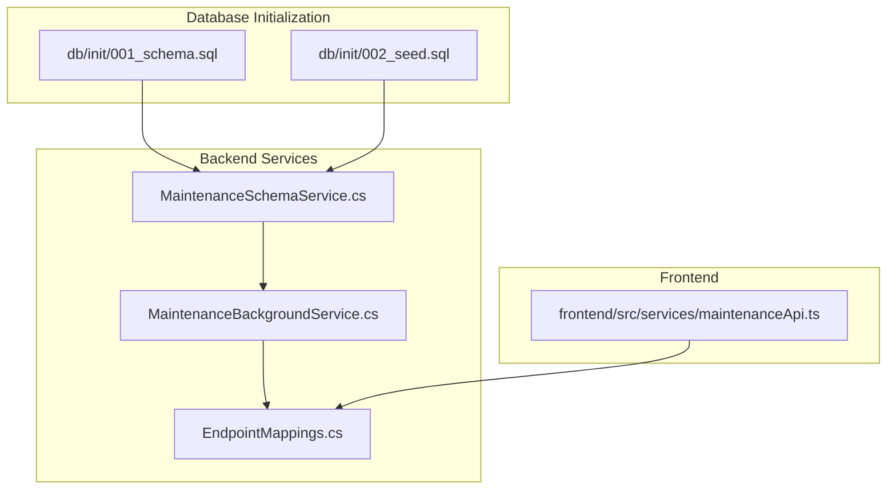
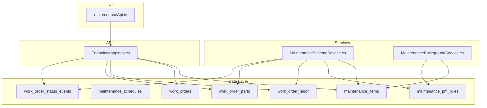
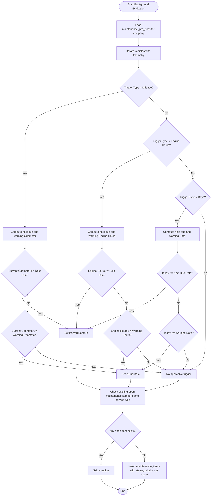
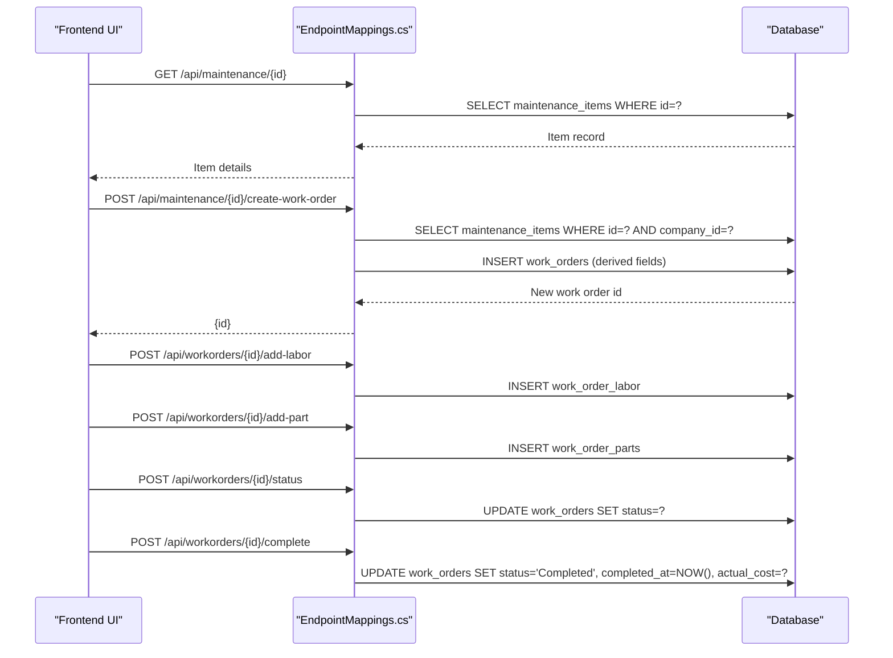
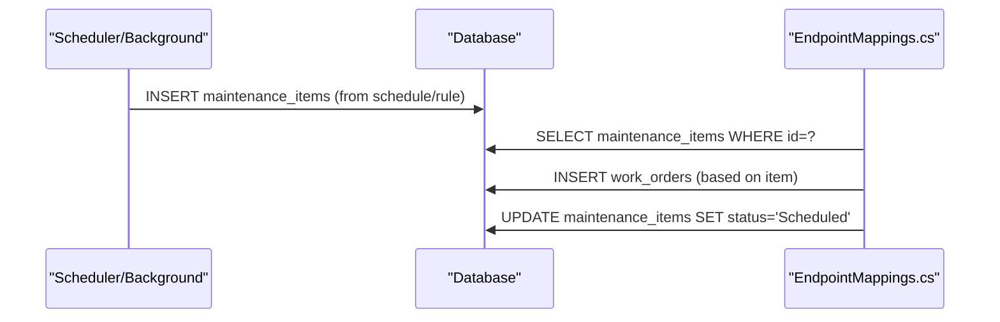
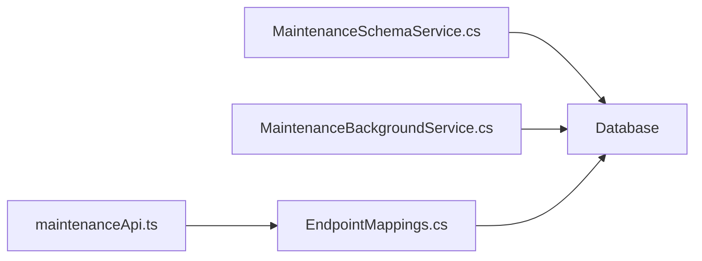

# Maintenance System Tables

<cite>
**Referenced Files in This Document**
- [001_schema.sql](file://db/init/001_schema.sql)
- [002_seed.sql](file://db/init/002_seed.sql)
- [MaintenanceSchemaService.cs](file://backend-dotnet/Services/MaintenanceSchemaService.cs)
- [MaintenanceBackgroundService.cs](file://backend-dotnet/Services/MaintenanceBackgroundService.cs)
- [EndpointMappings.cs](file://backend-dotnet/Controllers/EndpointMappings.cs)
- [maintenanceApi.ts](file://frontend/src/services/maintenanceApi.ts)
- [MaintenanceTests.cs](file://backend-dotnet.Tests/MaintenanceTests.cs)
</cite>

## Table of Contents
1. [Introduction](#introduction)
2. [Project Structure](#project-structure)
3. [Core Components](#core-components)
4. [Architecture Overview](#architecture-overview)
5. [Detailed Component Analysis](#detailed-component-analysis)
6. [Dependency Analysis](#dependency-analysis)
7. [Performance Considerations](#performance-considerations)
8. [Troubleshooting Guide](#troubleshooting-guide)
9. [Conclusion](#conclusion)
10. [Appendices](#appendices)

## Introduction
This document explains the maintenance system tables and workflows in the platform, focusing on preventive maintenance scheduling and the end-to-end work order lifecycle. It covers:
- Preventive maintenance triggers based on date, mileage, and engine hours
- Lifecycle from maintenance item creation to work order execution and completion
- Labor and parts tracking integrated with cost calculations
- Maintenance item categorization, due date tracking, and risk scoring
- Integration between maintenance schedules and actual work orders
- Vendor management and maintenance cost tracking
- Practical workflows and troubleshooting guidance

## Project Structure
The maintenance domain spans database schema initialization, backend services for schema evolution and background generation of maintenance items, API endpoints for work order management, and frontend service bindings.

**Diagram sources**
- [001_schema.sql:1-263](file://db/init/001_schema.sql#L1-L263)
- [002_seed.sql:1-70](file://db/init/002_seed.sql#L1-L70)
- [MaintenanceSchemaService.cs:1-169](file://backend-dotnet/Services/MaintenanceSchemaService.cs#L1-L169)
- [MaintenanceBackgroundService.cs:101-179](file://backend-dotnet/Services/MaintenanceBackgroundService.cs#L101-L179)
- [EndpointMappings.cs:3163-3285](file://backend-dotnet/Controllers/EndpointMappings.cs#L3163-L3285)
- [maintenanceApi.ts:1-102](file://frontend/src/services/maintenanceApi.ts#L1-L102)

**Section sources**
- [001_schema.sql:1-263](file://db/init/001_schema.sql#L1-L263)
- [002_seed.sql:1-70](file://db/init/002_seed.sql#L1-L70)
- [MaintenanceSchemaService.cs:1-169](file://backend-dotnet/Services/MaintenanceSchemaService.cs#L1-L169)
- [MaintenanceBackgroundService.cs:101-179](file://backend-dotnet/Services/MaintenanceBackgroundService.cs#L101-L179)
- [EndpointMappings.cs:3163-3285](file://backend-dotnet/Controllers/EndpointMappings.cs#L3163-L3285)
- [maintenanceApi.ts:1-102](file://frontend/src/services/maintenanceApi.ts#L1-L102)

## Core Components
- maintenance_items: Captures preventive and reactive maintenance tasks with due dates, priorities, risk scores, and estimated costs.
- maintenance_schedules: Stores planned schedules for maintenance items linked to vehicles/assets.
- work_orders: Tracks work order lifecycle from creation to completion, including labor and parts entries and cost tracking.
- work_order_labor: Records labor hours, rates, and timestamps for each work order.
- work_order_parts: Tracks parts used per work order with quantities and unit costs.
- work_order_status_events: Logs status transitions for auditability and reporting.
- maintenance_pm_rules: Defines tenant-configurable preventive maintenance rules with triggers and thresholds.
- dvir_reports, dvir_defects, dvir_inspection_results: Support defect and inspection workflows integrated with maintenance.

**Section sources**
- [001_schema.sql:348-420](file://db/init/001_schema.sql#L348-L420)
- [001_schema.sql:744-768](file://db/init/001_schema.sql#L744-L768)
- [001_schema.sql:769-780](file://db/init/001_schema.sql#L769-L780)
- [001_schema.sql:781-794](file://db/init/001_schema.sql#L781-L794)
- [001_schema.sql:795-806](file://db/init/001_schema.sql#L795-L806)
- [001_schema.sql:104-123](file://db/init/001_schema.sql#L104-L123)
- [001_schema.sql:68-80](file://db/init/001_schema.sql#L68-L80)
- [001_schema.sql:104-123](file://db/init/001_schema.sql#L104-L123)

## Architecture Overview
The system integrates schema evolution, background generation of maintenance items, API-driven work order lifecycle, and frontend consumption.

**Diagram sources**
- [MaintenanceSchemaService.cs:64-124](file://backend-dotnet/Services/MaintenanceSchemaService.cs#L64-L124)
- [MaintenanceBackgroundService.cs:101-179](file://backend-dotnet/Services/MaintenanceBackgroundService.cs#L101-L179)
- [EndpointMappings.cs:3163-3285](file://backend-dotnet/Controllers/EndpointMappings.cs#L3163-L3285)
- [maintenanceApi.ts:1-102](file://frontend/src/services/maintenanceApi.ts#L1-L102)

## Detailed Component Analysis

### Preventive Maintenance Scheduling System
Preventive maintenance is governed by configurable rules that generate maintenance items when thresholds are met. Triggers supported:
- Mileage-based: interval in miles with warning threshold percentage
- Engine hours-based: interval in engine hours with warning threshold percentage
- Date-based: interval in days with warning threshold percentage

The background service evaluates each vehicle against applicable rules, computes due/overdue states, and inserts maintenance items with appropriate priority and risk score. It avoids duplicating open items for the same service type on the same vehicle.

**Diagram sources**
- [MaintenanceBackgroundService.cs:101-179](file://backend-dotnet/Services/MaintenanceBackgroundService.cs#L101-L179)
- [MaintenanceTests.cs:357-420](file://backend-dotnet.Tests/MaintenanceTests.cs#L357-L420)

**Section sources**
- [MaintenanceBackgroundService.cs:101-179](file://backend-dotnet/Services/MaintenanceBackgroundService.cs#L101-L179)
- [MaintenanceSchemaService.cs:104-123](file://backend-dotnet/Services/MaintenanceSchemaService.cs#L104-L123)
- [MaintenanceTests.cs:357-420](file://backend-dotnet.Tests/MaintenanceTests.cs#L357-L420)

### Work Order Lifecycle: Creation, Execution, Completion
The lifecycle spans creation from a maintenance item, assignment, status transitions, labor and parts entries, cost approvals, and completion.

**Diagram sources**
- [EndpointMappings.cs:3259-3285](file://backend-dotnet/Controllers/EndpointMappings.cs#L3259-L3285)
- [EndpointMappings.cs:686-710](file://backend-dotnet/Controllers/EndpointMappings.cs#L686-L710)
- [maintenanceApi.ts:48-63](file://frontend/src/services/maintenanceApi.ts#L48-L63)

**Section sources**
- [EndpointMappings.cs:3259-3285](file://backend-dotnet/Controllers/EndpointMappings.cs#L3259-L3285)
- [EndpointMappings.cs:686-710](file://backend-dotnet/Controllers/EndpointMappings.cs#L686-L710)
- [maintenanceApi.ts:48-63](file://frontend/src/services/maintenanceApi.ts#L48-L63)

### Maintenance Items: Categorization, Due Tracking, Risk Assessment
Maintenance items capture:
- Category and service type (e.g., Preventive Maintenance, Brake Inspection)
- Priority and risk score
- Estimated cost and recommended actions
- Due date, due odometer, and due engine hours
- Status tracking (Open, Scheduled, In Progress, Overdue, Deferred, Completed, Cancelled)

Risk scoring and priority are derived from triggers and overdue conditions. The system supports tenant isolation via company_id and maintains auditability through status events.

**Section sources**
- [001_schema.sql:348-420](file://db/init/001_schema.sql#L348-L420)
- [MaintenanceBackgroundService.cs:150-172](file://backend-dotnet/Services/MaintenanceBackgroundService.cs#L150-L172)
- [EndpointMappings.cs:3163-3186](file://backend-dotnet/Controllers/EndpointMappings.cs#L3163-L3186)

### Integration Between Schedules and Work Orders
Maintenance schedules define planned intervals and due dates for vehicles/assets. When a maintenance item is created from a schedule, it can be transformed into a work order. The system supports:
- Creating work orders from maintenance items
- Updating maintenance item status to Scheduled/Deferred
- Linking work orders to maintenance items and vehicles/assets

**Diagram sources**
- [EndpointMappings.cs:3212-3285](file://backend-dotnet/Controllers/EndpointMappings.cs#L3212-L3285)

**Section sources**
- [EndpointMappings.cs:3212-3285](file://backend-dotnet/Controllers/EndpointMappings.cs#L3212-L3285)

### Labor and Parts Management with Cost Calculation
Labor and parts are tracked per work order:
- work_order_labor: records technician hours, rates, and timestamps
- work_order_parts: tracks part usage, quantities, and unit costs
- work_orders: stores estimated and actual costs, downtime hours, and cost approval status

Cost calculation aggregates labor and parts costs into actual cost upon completion. Approvals can be managed via dedicated endpoints.

**Section sources**
- [001_schema.sql:769-780](file://db/init/001_schema.sql#L769-L780)
- [001_schema.sql:781-794](file://db/init/001_schema.sql#L781-L794)
- [001_schema.sql:359-420](file://db/init/001_schema.sql#L359-L420)
- [EndpointMappings.cs:686-710](file://backend-dotnet/Controllers/EndpointMappings.cs#L686-L710)

### Vendor Management and Cost Tracking
Vendor information can be associated with work orders (e.g., vendor_name). Cost tracking includes:
- Estimated vs. actual costs
- Approved vs. pending cost approvals
- Downtime hours impact
- Cost approval status

These fields enable financial reporting and budgeting aligned with maintenance activities.

**Section sources**
- [001_schema.sql:359-420](file://db/init/001_schema.sql#L359-L420)
- [EndpointMappings.cs:3290-3298](file://backend-dotnet/Controllers/EndpointMappings.cs#L3290-L3298)

## Dependency Analysis
The maintenance domain depends on:
- Schema evolution service to ensure required tables and columns exist
- Background service to generate maintenance items based on rules
- API endpoints to manage maintenance items and work orders
- Frontend service bindings to expose maintenance operations

**Diagram sources**
- [MaintenanceSchemaService.cs:10-16](file://backend-dotnet/Services/MaintenanceSchemaService.cs#L10-L16)
- [MaintenanceBackgroundService.cs:101-179](file://backend-dotnet/Services/MaintenanceBackgroundService.cs#L101-L179)
- [EndpointMappings.cs:3163-3285](file://backend-dotnet/Controllers/EndpointMappings.cs#L3163-L3285)
- [maintenanceApi.ts:1-102](file://frontend/src/services/maintenanceApi.ts#L1-L102)

**Section sources**
- [MaintenanceSchemaService.cs:10-16](file://backend-dotnet/Services/MaintenanceSchemaService.cs#L10-L16)
- [MaintenanceBackgroundService.cs:101-179](file://backend-dotnet/Services/MaintenanceBackgroundService.cs#L101-L179)
- [EndpointMappings.cs:3163-3285](file://backend-dotnet/Controllers/EndpointMappings.cs#L3163-L3285)
- [maintenanceApi.ts:1-102](file://frontend/src/services/maintenanceApi.ts#L1-L102)

## Performance Considerations
- Indexes on frequently filtered columns (company_id, status, vehicle_id) improve query performance for maintenance items and work orders.
- Background generation of maintenance items should be scoped to active vehicles and companies to minimize unnecessary scans.
- Use pagination and selective field retrieval in API endpoints to reduce payload sizes.
- Monitor query plans for large datasets and add targeted indexes as needed.

## Troubleshooting Guide
Common scenarios and resolutions:
- Duplicate open maintenance items: The background service checks for existing open items before insertion. If duplicates appear, verify the open item filtering logic and status values.
- Overdue items getting critical priority and high risk: Confirm overdue thresholds and risk score assignments align with business rules.
- Work order not appearing after item creation: Ensure the create-work-order endpoint is invoked and that the item’s status is updated accordingly.
- Labor/parts not reflected in costs: Verify entries are made under the correct work order and that completion updates actual cost.

**Section sources**
- [MaintenanceBackgroundService.cs:138-148](file://backend-dotnet/Services/MaintenanceBackgroundService.cs#L138-L148)
- [MaintenanceTests.cs:396-420](file://backend-dotnet.Tests/MaintenanceTests.cs#L396-L420)
- [EndpointMappings.cs:3259-3285](file://backend-dotnet/Controllers/EndpointMappings.cs#L3259-L3285)

## Conclusion
The maintenance system provides a robust framework for preventive maintenance scheduling, lifecycle management of work orders, and cost tracking. By leveraging configurable rules, structured labor and parts management, and tenant-aware operations, fleets can maintain readiness while controlling costs and downtime.

## Appendices

### API Surface for Maintenance and Work Orders
- Maintenance items: list, detail, create, update, delete, schedule, defer, create work order
- Work orders: list, summary, create, assign, add labor, add part, approve cost, complete, status update
- PM rules: list, upsert
- DVIR and faults: inspections, defects, fault codes

**Section sources**
- [maintenanceApi.ts:6-101](file://frontend/src/services/maintenanceApi.ts#L6-L101)
- [EndpointMappings.cs:3163-3285](file://backend-dotnet/Controllers/EndpointMappings.cs#L3163-L3285)