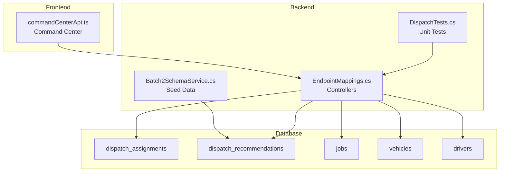
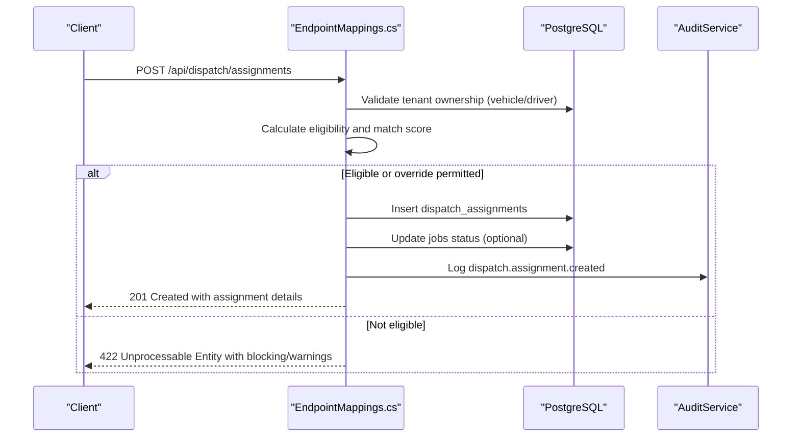
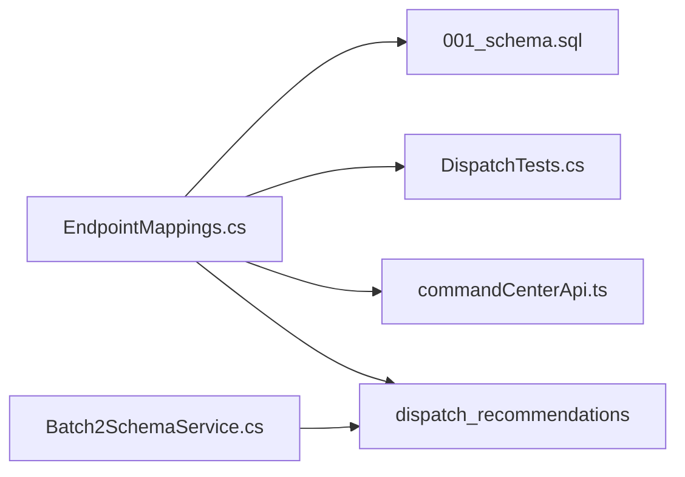

# Dispatch Assignment Tables

<cite>
**Referenced Files in This Document**
- [001_schema.sql](file://database/init/001_schema.sql)
- [EndpointMappings.cs](file://backend-dotnet/Controllers/EndpointMappings.cs)
- [DispatchTests.cs](file://backend-dotnet.Tests/DispatchTests.cs)
- [Batch2SchemaService.cs](file://backend-dotnet.Services/Batch2SchemaService.cs)
- [commandCenterApi.ts](file://frontend/src/services/commandCenterApi.ts)
</cite>

## Table of Contents
1. [Introduction](#introduction)
2. [Project Structure](#project-structure)
3. [Core Components](#core-components)
4. [Architecture Overview](#architecture-overview)
5. [Detailed Component Analysis](#detailed-component-analysis)
6. [Dependency Analysis](#dependency-analysis)
7. [Performance Considerations](#performance-considerations)
8. [Troubleshooting Guide](#troubleshooting-guide)
9. [Conclusion](#conclusion)

## Introduction
This document explains the dispatch assignment tables and related systems that power automated matching and manual override workflows. It covers:
- The dispatch_assignments table and its role in capturing assignments
- The dispatch_recommendations table and its recommendation scoring system
- The automated dispatch matching algorithm and match_score calculation
- Real-time dispatch coordination, assignment status tracking, and integration with the command center
- Performance optimization strategies for high-frequency dispatch decisions
- Audit trail mechanisms for assignment changes

## Project Structure
The dispatch domain spans schema definitions, backend controllers implementing the business logic, tests validating eligibility and state transitions, and frontend services integrating with the command center dashboard.

**Diagram sources**
- [001_schema.sql:291-300](file://database/init/001_schema.sql#L291-L300)
- [001_schema.sql:591-600](file://database/init/001_schema.sql#L591-L600)
- [EndpointMappings.cs:9050-9175](file://backend-dotnet/Controllers/EndpointMappings.cs#L9050-L9175)
- [DispatchTests.cs:11-77](file://backend-dotnet.Tests/DispatchTests.cs#L11-L77)
- [Batch2SchemaService.cs:254-259](file://backend-dotnet.Services/Batch2SchemaService.cs#L254-L259)
- [commandCenterApi.ts:1-8](file://frontend/src/services/commandCenterApi.ts#L1-L8)

**Section sources**
- [001_schema.sql:291-300](file://database/init/001_schema.sql#L291-L300)
- [001_schema.sql:591-600](file://database/init/001_schema.sql#L591-L600)
- [EndpointMappings.cs:9050-9175](file://backend-dotnet/Controllers/EndpointMappings.cs#L9050-L9175)
- [DispatchTests.cs:11-77](file://backend-dotnet.Tests/DispatchTests.cs#L11-L77)
- [Batch2SchemaService.cs:254-259](file://backend-dotnet.Services/Batch2SchemaService.cs#L254-L259)
- [commandCenterApi.ts:1-8](file://frontend/src/services/commandCenterApi.ts#L1-L8)

## Core Components
- dispatch_assignments: Stores the canonical assignment record with match_score, eligibility metadata, and timestamps for lifecycle events.
- dispatch_recommendations: Stores recommendation entries with recommendation text and score for manual override scenarios.
- Eligibility and match scoring: Implemented in the backend controller with calculations based on driver safety/readiness, vehicle readiness/risk, and clamping to a bounded range.
- State machine transitions: Enforced via controller logic to ensure valid progression from draft to delivered/cancelled/exception.
- Audit trail: Logged for assignment creation, acceptance, status updates, and exception creation.

**Section sources**
- [001_schema.sql:291-300](file://database/init/001_schema.sql#L291-L300)
- [001_schema.sql:591-600](file://database/init/001_schema.sql#L591-L600)
- [EndpointMappings.cs:4482-4493](file://backend-dotnet/Controllers/EndpointMappings.cs#L4482-L4493)
- [EndpointMappings.cs:9050-9175](file://backend-dotnet/Controllers/EndpointMappings.cs#L9050-L9175)
- [EndpointMappings.cs:9594-9615](file://backend-dotnet/Controllers/EndpointMappings.cs#L9594-L9615)
- [DispatchTests.cs:205-216](file://backend-dotnet.Tests/DispatchTests.cs#L205-L216)

## Architecture Overview
The dispatch assignment system integrates schema-defined tables, backend controllers implementing matching and state transitions, seeded recommendations, and a command center front-end surface.

**Diagram sources**
- [EndpointMappings.cs:9050-9175](file://backend-dotnet/Controllers/EndpointMappings.cs#L9050-L9175)

## Detailed Component Analysis

### dispatch_assignments table
Purpose:
- Captures the final assignment of a job to a driver and vehicle, including match_score, eligibility metadata, and timestamps for lifecycle events.

Key attributes:
- company_id, job_id, vehicle_id, driver_id
- match_score (stored decimal)
- assignment_status and status fields for lifecycle
- timestamps: assigned_at, accepted_at, actual_pickup_at, actual_delivery_at, completed_at
- eligibility_json, override_reason, and flags indicating whether safety/HOS overrides were applied

Assignment lifecycle:
- Creation sets initial status to Assigned and records match_score and eligibility metadata.
- Acceptance updates status to Accepted and captures acceptance timestamp.
- Status transitions follow a strict state machine enforced by the controller.

Audit and notifications:
- Audit logs are emitted on create, accept, status change, and exception creation.
- Notifications are triggered upon assignment creation.

**Section sources**
- [001_schema.sql:291-300](file://database/init/001_schema.sql#L291-L300)
- [EndpointMappings.cs:9110-9155](file://backend-dotnet/Controllers/EndpointMappings.cs#L9110-L9155)
- [EndpointMappings.cs:9177-9272](file://backend-dotnet/Controllers/EndpointMappings.cs#L9177-L9272)
- [EndpointMappings.cs:9274-9320](file://backend-dotnet/Controllers/EndpointMappings.cs#L9274-L9320)

### Automated dispatch matching algorithm and match_score calculation
Methodology:
- Base score is initialized and adjusted by:
  - Driver safety_score contribution (bounded)
  - Vehicle readiness_score contribution (bounded)
  - Vehicle risk_score penalty (bounded)
- Final score is clamped to a fixed range.

Calculation details:
- Uses driver.readiness_score, driver.safety_score, vehicle.readiness_score, and vehicle.risk_score.
- Applies Math.Clamp to keep the score within bounds.

Recommendation scoring:
- dispatch_recommendations stores recommendation text and score for manual override scenarios.
- Recommendations can be surfaced via auto-suggest endpoint.

**Section sources**
- [EndpointMappings.cs:4482-4493](file://backend-dotnet/Controllers/EndpointMappings.cs#L4482-L4493)
- [001_schema.sql:591-600](file://database/init/001_schema.sql#L591-L600)
- [EndpointMappings.cs:2824-2835](file://backend-dotnet/Controllers/EndpointMappings.cs#L2824-L2835)
- [Batch2SchemaService.cs:254-259](file://backend-dotnet.Services/Batch2SchemaService.cs#L254-L259)

### Eligibility checks and override permissions
Eligibility factors:
- Vehicle out-of-service hard blocks assignment regardless of override.
- Driver status must be Available/Idle; otherwise requires override.
- Vehicle status must be Available/Idle/Active; otherwise requires override.
- Safety score thresholds and HOS hours influence warnings and eligibility.

Override mechanism:
- Non-OOS blocks require explicit permission (dispatch:override).
- OOS blocks cannot be overridden.

Duplicate active assignment protection:
- Prevents assigning a driver or vehicle already on an active assignment unless override is used.

**Section sources**
- [DispatchTests.cs:80-133](file://backend-dotnet.Tests/DispatchTests.cs#L80-L133)
- [DispatchTests.cs:95-103](file://backend-dotnet.Tests/DispatchTests.cs#L95-L103)
- [DispatchTests.cs:135-148](file://backend-dotnet.Tests/DispatchTests.cs#L135-L148)
- [DispatchTests.cs:150-203](file://backend-dotnet.Tests/DispatchTests.cs#L150-L203)
- [EndpointMappings.cs:4468-4480](file://backend-dotnet/Controllers/EndpointMappings.cs#L4468-L4480)
- [EndpointMappings.cs:9050-9072](file://backend-dotnet/Controllers/EndpointMappings.cs#L9050-L9072)
- [EndpointMappings.cs:9085-9098](file://backend-dotnet/Controllers/EndpointMappings.cs#L9085-L9098)

### Assignment status tracking and state machine
States and transitions:
- Draft → Assigned → Accepted → En Route → At Pickup → Loaded → In Transit → At Delivery → Delivered
- Exceptions can occur at multiple stages and can resume to In Transit or be cancelled.

Timestamps:
- actual_pickup_at and actual_delivery_at are set based on target status.
- completed_at is set on delivered.

Mirroring with jobs:
- When an assignment is linked to a job, status updates are mirrored on the job record.

**Section sources**
- [EndpointMappings.cs:9594-9615](file://backend-dotnet/Controllers/EndpointMappings.cs#L9594-L9615)
- [EndpointMappings.cs:9214-9249](file://backend-dotnet/Controllers/EndpointMappings.cs#L9214-L9249)

### dispatch_recommendations table and manual override scenarios
Purpose:
- Provides recommendation entries with recommendation text and score for manual override scenarios.

Auto-suggest:
- Endpoint returns top recommendations ordered by score, including match reasons.

Seeding:
- Batch2 seed inserts sample recommendations for demonstration.

**Section sources**
- [001_schema.sql:591-600](file://database/init/001_schema.sql#L591-L600)
- [EndpointMappings.cs:2824-2835](file://backend-dotnet/Controllers/EndpointMappings.cs#L2824-L2835)
- [Batch2SchemaService.cs:254-259](file://backend-dotnet.Services/Batch2SchemaService.cs#L254-L259)

### Real-time dispatch coordination and command center integration
Command center:
- Aggregates KPIs, actions, timeline events, and insights for dispatch visibility.
- Provides a unified dashboard surface for operators.

Frontend integration:
- Frontend service exposes a summary endpoint consumed by the command center page.

**Section sources**
- [EndpointMappings.cs:1707-1713](file://backend-dotnet/Controllers/EndpointMappings.cs#L1707-L1713)
- [commandCenterApi.ts:1-8](file://frontend/src/services/commandCenterApi.ts#L1-L8)

## Dependency Analysis
The dispatch assignment system depends on:
- Schema tables for persistence
- Backend controller logic for eligibility, matching, and state transitions
- Tests validating eligibility rules and state machine correctness
- Seed data for recommendations
- Frontend services for command center integration

**Diagram sources**
- [EndpointMappings.cs:9050-9175](file://backend-dotnet/Controllers/EndpointMappings.cs#L9050-L9175)
- [001_schema.sql:291-300](file://database/init/001_schema.sql#L291-L300)
- [001_schema.sql:591-600](file://database/init/001_schema.sql#L591-L600)
- [DispatchTests.cs:11-77](file://backend-dotnet.Tests/DispatchTests.cs#L11-L77)
- [Batch2SchemaService.cs:254-259](file://backend-dotnet.Services/Batch2SchemaService.cs#L254-L259)
- [commandCenterApi.ts:1-8](file://frontend/src/services/commandCenterApi.ts#L1-L8)

**Section sources**
- [EndpointMappings.cs:9050-9175](file://backend-dotnet/Controllers/EndpointMappings.cs#L9050-L9175)
- [001_schema.sql:291-300](file://database/init/001_schema.sql#L291-L300)
- [001_schema.sql:591-600](file://database/init/001_schema.sql#L591-L600)
- [DispatchTests.cs:11-77](file://backend-dotnet.Tests/DispatchTests.cs#L11-L77)
- [Batch2SchemaService.cs:254-259](file://backend-dotnet.Services/Batch2SchemaService.cs#L254-L259)
- [commandCenterApi.ts:1-8](file://frontend/src/services/commandCenterApi.ts#L1-L8)

## Performance Considerations
- Matching algorithm:
  - Simple arithmetic and clamp operations; minimal CPU overhead.
  - Consider caching frequently accessed driver/vehicle scores if hot-path contention arises.
- Eligibility checks:
  - Single-row lookups for driver/vehicle status and tenant ownership.
  - Indexes on company_id and status fields reduce scan costs.
- Assignment creation:
  - Single INSERT plus optional job update; ensure UPSERT patterns avoid duplicate active assignments.
- Recommendation retrieval:
  - ORDER BY score DESC with LIMIT; ensure appropriate indexes on score/status for efficient sorting.
- Audit logging:
  - Emit logs asynchronously where feasible to minimize latency spikes during high-frequency dispatch decisions.

[No sources needed since this section provides general guidance]

## Troubleshooting Guide
Common issues and resolutions:
- Vehicle out-of-service hard block:
  - Cannot be overridden; fix vehicle status before reattempting assignment.
- Driver/vehicle unavailable:
  - Requires override permission (dispatch:override) to proceed.
- Duplicate active assignment:
  - Prevented unless override is used; resolve conflicting assignment first.
- Invalid status transition:
  - Follow the state machine; correct target status to a valid next state.
- Audit trail gaps:
  - Verify audit logs are emitted on create, accept, status change, and exception creation.

**Section sources**
- [DispatchTests.cs:80-133](file://backend-dotnet.Tests/DispatchTests.cs#L80-L133)
- [DispatchTests.cs:135-148](file://backend-dotnet.Tests/DispatchTests.cs#L135-L148)
- [EndpointMappings.cs:9050-9072](file://backend-dotnet/Controllers/EndpointMappings.cs#L9050-L9072)
- [EndpointMappings.cs:9085-9098](file://backend-dotnet/Controllers/EndpointMappings.cs#L9085-L9098)
- [EndpointMappings.cs:9594-9615](file://backend-dotnet/Controllers/EndpointMappings.cs#L9594-L9615)

## Conclusion
The dispatch assignment system combines schema-defined tables, a robust eligibility and matching engine, strict state-machine enforcement, and comprehensive audit logging. The dispatch_recommendations table supports manual override scenarios, while the command center provides real-time visibility. Performance can be optimized through targeted indexing and asynchronous auditing, ensuring reliable high-frequency dispatch decisions.