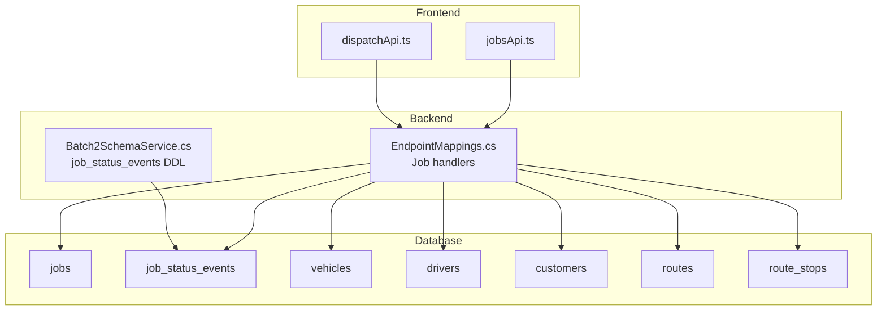
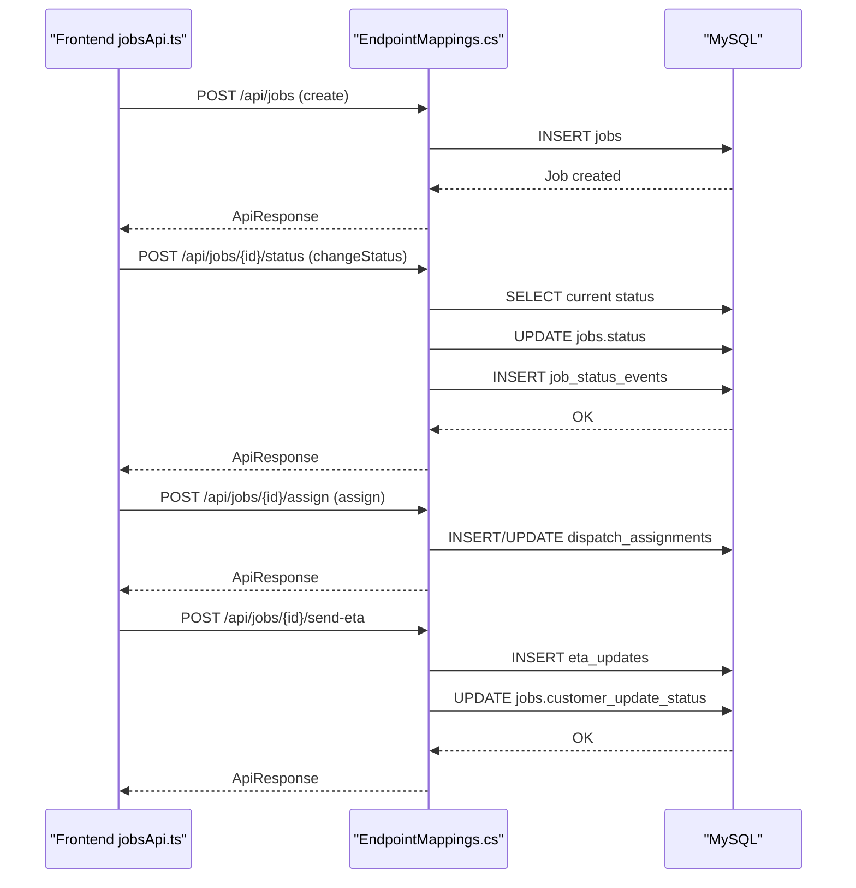
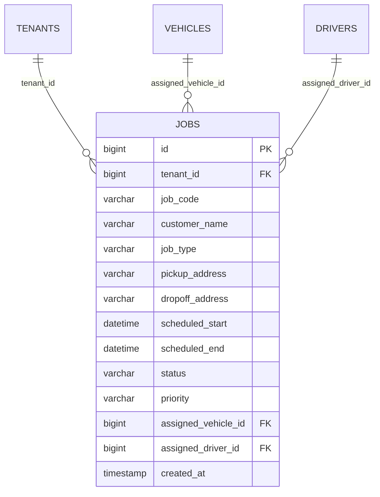
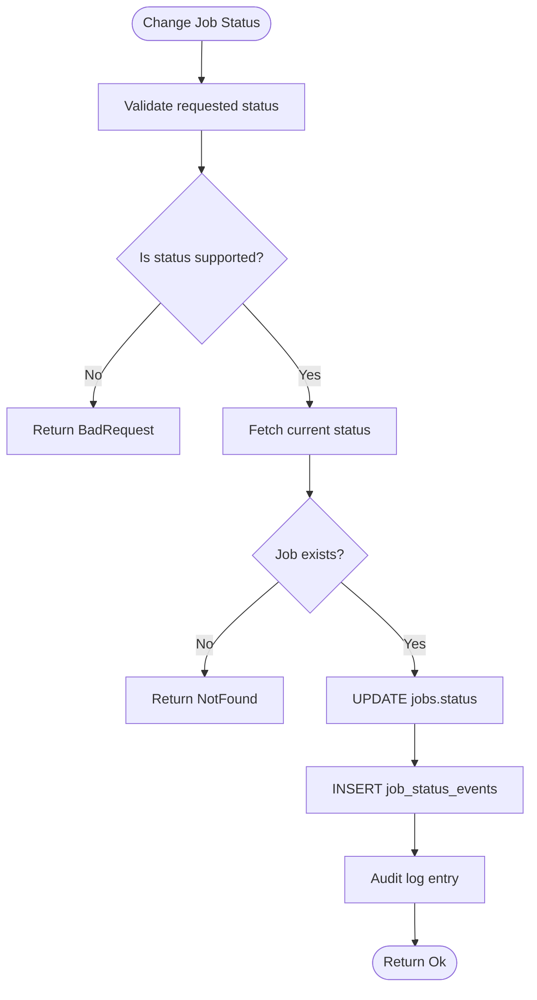
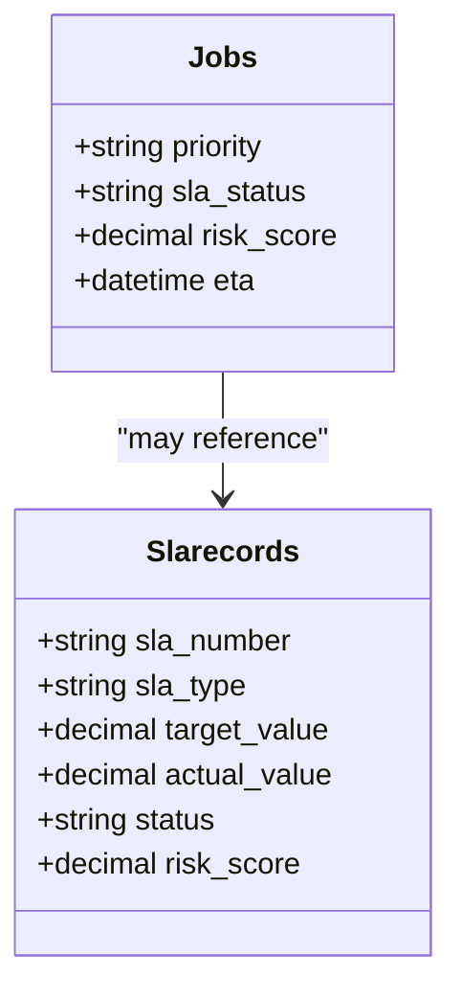
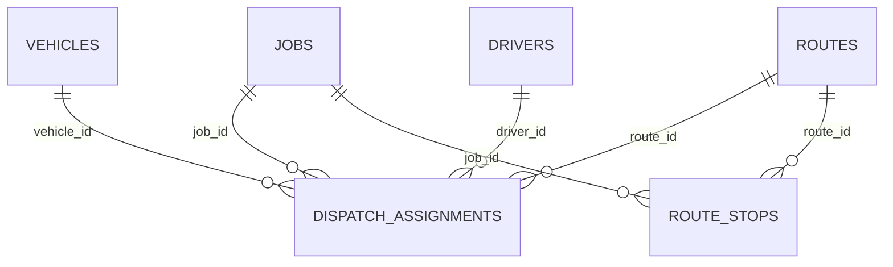
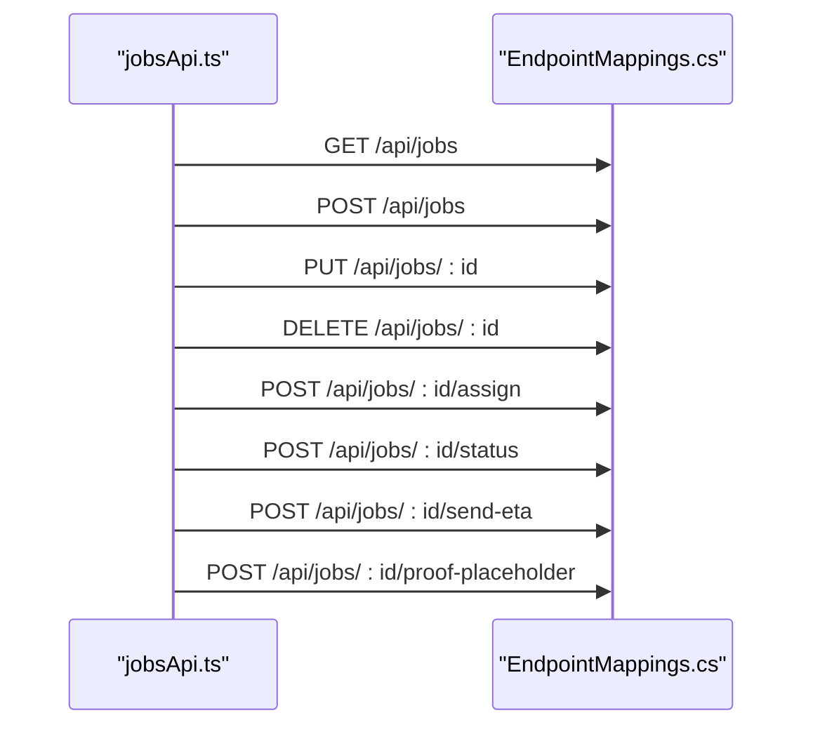
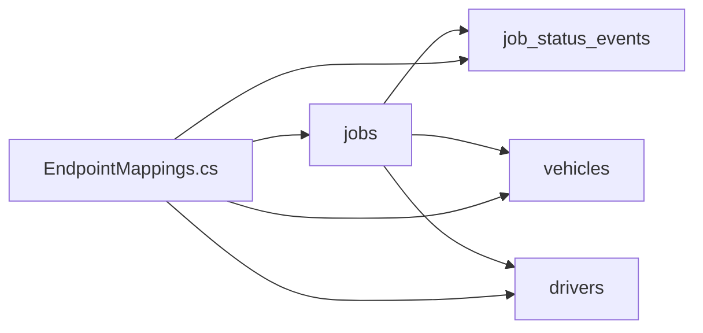

# Jobs Table

<cite>
**Referenced Files in This Document**
- [001_schema.sql](file://db/init/001_schema.sql)
- [001_schema.sql](file://database/init/001_schema.sql)
- [EndpointMappings.cs](file://backend-dotnet/Controllers/EndpointMappings.cs)
- [Batch2SchemaService.cs](file://backend-dotnet/Services/Batch2SchemaService.cs)
- [jobsApi.ts](file://frontend/src/services/jobsApi.ts)
- [dispatchApi.ts](file://frontend/src/services/dispatchApi.ts)
- [MODULE_COVERAGE_MATRIX.md](file://docs/MODULE_COVERAGE_MATRIX.md)
</cite>

## Table of Contents
1. [Introduction](#introduction)
2. [Project Structure](#project-structure)
3. [Core Components](#core-components)
4. [Architecture Overview](#architecture-overview)
5. [Detailed Component Analysis](#detailed-component-analysis)
6. [Dependency Analysis](#dependency-analysis)
7. [Performance Considerations](#performance-considerations)
8. [Troubleshooting Guide](#troubleshooting-guide)
9. [Conclusion](#conclusion)

## Introduction
This document provides comprehensive documentation for the jobs table and related operational entities in the dispatch workflow. It covers job lifecycle management (creation, assignment, execution, completion), status tracking, priority and SLA systems, scheduling constraints, audit trails via job_status_events, and the job-related API endpoints. It also includes performance considerations and indexing strategies for efficient job queries.

## Project Structure
The jobs domain spans database schema, backend controllers, and frontend services:
- Database schema defines the jobs table, related operational tables, and indexes.
- Backend controllers expose REST endpoints for job CRUD, status changes, ETA updates, and proof placeholders.
- Frontend services encapsulate client-side API calls for jobs and dispatch operations.



**Diagram sources**
- [001_schema.sql:76-95](file://db/init/001_schema.sql#L76-L95)
- [001_schema.sql:683-695](file://database/init/001_schema.sql#L683-L695)
- [EndpointMappings.cs:2651-2680](file://backend-dotnet/Controllers/EndpointMappings.cs#L2651-L2680)
- [Batch2SchemaService.cs:120-122](file://backend-dotnet/Services/Batch2SchemaService.cs#L120-L122)
- [jobsApi.ts:6-33](file://frontend/src/services/jobsApi.ts#L6-L33)
- [dispatchApi.ts:6-117](file://frontend/src/services/dispatchApi.ts#L6-L117)

**Section sources**
- [001_schema.sql:76-95](file://db/init/001_schema.sql#L76-L95)
- [001_schema.sql:683-695](file://database/init/001_schema.sql#L683-L695)
- [EndpointMappings.cs:2651-2680](file://backend-dotnet/Controllers/EndpointMappings.cs#L2651-L2680)
- [Batch2SchemaService.cs:120-122](file://backend-dotnet/Services/Batch2SchemaService.cs#L120-L122)
- [jobsApi.ts:6-33](file://frontend/src/services/jobsApi.ts#L6-L33)
- [dispatchApi.ts:6-117](file://frontend/src/services/dispatchApi.ts#L6-L117)

## Core Components
- jobs table: central entity for job definition, scheduling, priority, status, and associations to vehicles and drivers.
- job_status_events table: audit trail capturing status transitions with timestamps and metadata.
- Backend controllers: job CRUD, status change, ETA update, proof placeholder creation, and dispatch orchestration.
- Frontend services: client APIs for jobs and dispatch operations.

**Section sources**
- [001_schema.sql:76-95](file://db/init/001_schema.sql#L76-L95)
- [001_schema.sql:683-695](file://database/init/001_schema.sql#L683-L695)
- [EndpointMappings.cs:2651-2680](file://backend-dotnet/Controllers/EndpointMappings.cs#L2651-L2680)
- [jobsApi.ts:6-33](file://frontend/src/services/jobsApi.ts#L6-L33)
- [dispatchApi.ts:6-117](file://frontend/src/services/dispatchApi.ts#L6-L117)

## Architecture Overview
The job lifecycle is managed through a combination of database entities and backend endpoints. The frontend interacts with the backend via typed services to perform job operations and dispatch actions.



**Diagram sources**
- [jobsApi.ts:25-31](file://frontend/src/services/jobsApi.ts#L25-L31)
- [EndpointMappings.cs:2651-2680](file://backend-dotnet/Controllers/EndpointMappings.cs#L2651-L2680)
- [001_schema.sql:683-695](file://database/init/001_schema.sql#L683-L695)

## Detailed Component Analysis

### Jobs Table Schema and Relationships
The jobs table captures essential attributes for dispatch operations:
- Identity: id, job_code, tenant_id
- Customer and routing: customer_name, pickup_address, dropoff_address
- Scheduling: scheduled_start, scheduled_end
- Status and priority: status, priority
- Assignment linkage: assigned_vehicle_id, assigned_driver_id
- Timestamps: created_at

Constraints and relationships:
- Foreign keys to tenants, vehicles, and drivers
- Unique constraint on tenant_id + job_code

Indexes and performance:
- Unique index on tenant_id + job_code
- Additional indexes exist on related entities (e.g., location_events)



**Diagram sources**
- [001_schema.sql:76-95](file://db/init/001_schema.sql#L76-L95)

**Section sources**
- [001_schema.sql:76-95](file://db/init/001_schema.sql#L76-L95)

### Job Lifecycle Management
- Creation: Frontend posts job payload; backend inserts into jobs.
- Assignment: Frontend triggers assignment endpoint; backend manages dispatch_assignments and job status.
- Execution: Status transitions occur as jobs move from Unassigned → Assigned → En Route → In Progress → At Stop → Completed/Delivered.
- Completion: Final status recorded; audit trail maintained.

```mermaid
stateDiagram-v2
[*] --> Unassigned
Unassigned --> Assigned : "dispatch assignment created"
Assigned --> "En Route" : "driver accepted"
"En Route" --> "In Progress" : "start work"
"In Progress" --> "At Stop" : "at pickup/dropoff"
"At Stop" --> Completed : "delivery confirmed"
Completed --> Delivered : "POD recorded"
Unassigned --> Cancelled : "manual cancellation"
Assigned --> Cancelled : "cancellation"
"En Route" --> Cancelled : "cancellation"
"In Progress" --> Cancelled : "cancellation"
"At Stop" --> Cancelled : "cancellation"
```

**Section sources**
- [EndpointMappings.cs:2651-2680](file://backend-dotnet/Controllers/EndpointMappings.cs#L2651-L2680)

### Status Tracking System and Transitions
Supported statuses include Unassigned, Assigned, En Route, In Progress, At Stop, Completed, Delivered, Delayed, At Risk, Exception. The backend validates transitions and logs events.



**Diagram sources**
- [EndpointMappings.cs:2651-2680](file://backend-dotnet/Controllers/EndpointMappings.cs#L2651-L2680)
- [001_schema.sql:683-695](file://database/init/001_schema.sql#L683-L695)

**Section sources**
- [EndpointMappings.cs:2651-2680](file://backend-dotnet/Controllers/EndpointMappings.cs#L2651-L2680)
- [001_schema.sql:683-695](file://database/init/001_schema.sql#L683-L695)

### Priority System and SLA Tracking
- Priority: Normal, High, etc., influences dispatch recommendations and visibility.
- SLA: Jobs may carry SLA status and risk scores; SLA records track targets and breaches.
- ETA confidence and risk: computed based on planned vs. actual delivery and exceptions.



**Diagram sources**
- [EndpointMappings.cs:10117-10130](file://backend-dotnet/Controllers/EndpointMappings.cs#L10117-L10130)
- [Batch2SchemaService.cs:142-158](file://backend-dotnet/Services/Batch2SchemaService.cs#L142-L158)

**Section sources**
- [EndpointMappings.cs:10117-10130](file://backend-dotnet/Controllers/EndpointMappings.cs#L10117-L10130)
- [Batch2SchemaService.cs:142-158](file://backend-dotnet/Services/Batch2SchemaService.cs#L142-L158)

### Scheduling Constraints
- scheduled_start and scheduled_end define time windows.
- Availability checks for drivers and vehicles influence assignment feasibility.
- Recommendations consider proximity, safety scores, HOS, and vehicle readiness.

**Section sources**
- [EndpointMappings.cs:2752-2804](file://backend-dotnet/Controllers/EndpointMappings.cs#L2752-L2804)
- [dispatchApi.ts:80-117](file://frontend/src/services/dispatchApi.ts#L80-L117)

### Dispatch Workflow Entities
- vehicles and drivers: availability and readiness metrics.
- routes and route_stops: structured delivery sequences.
- dispatch_assignments: links jobs to assigned resources.



**Diagram sources**
- [001_schema.sql:97-124](file://db/init/001_schema.sql#L97-L124)

**Section sources**
- [001_schema.sql:97-124](file://db/init/001_schema.sql#L97-L124)

### Audit Trail: job_status_events
Each status change generates a job_status_events record with previous/new status, title, description, and timestamps. This enables auditability and timeline reconstruction.

**Section sources**
- [001_schema.sql:683-695](file://database/init/001_schema.sql#L683-L695)
- [EndpointMappings.cs:2668-2676](file://backend-dotnet/Controllers/EndpointMappings.cs#L2668-L2676)

### Job-Related API Endpoints
Frontend services expose the following job endpoints:
- List, summary, detail
- Create, update, delete
- Import preview
- Assign, change status, send ETA, proof placeholder



**Diagram sources**
- [jobsApi.ts:6-33](file://frontend/src/services/jobsApi.ts#L6-L33)
- [EndpointMappings.cs:2651-2680](file://backend-dotnet/Controllers/EndpointMappings.cs#L2651-L2680)

**Section sources**
- [jobsApi.ts:6-33](file://frontend/src/services/jobsApi.ts#L6-L33)
- [dispatchApi.ts:6-117](file://frontend/src/services/dispatchApi.ts#L6-L117)

## Dependency Analysis
- jobs depends on tenants, vehicles, and drivers via foreign keys.
- job_status_events depends on jobs and tracks status transitions.
- dispatch endpoints depend on jobs and related assignment tables.



**Diagram sources**
- [001_schema.sql:76-95](file://db/init/001_schema.sql#L76-L95)
- [001_schema.sql:683-695](file://database/init/001_schema.sql#L683-L695)
- [EndpointMappings.cs:2651-2680](file://backend-dotnet/Controllers/EndpointMappings.cs#L2651-L2680)

**Section sources**
- [001_schema.sql:76-95](file://db/init/001_schema.sql#L76-L95)
- [001_schema.sql:683-695](file://database/init/001_schema.sql#L683-L695)
- [EndpointMappings.cs:2651-2680](file://backend-dotnet/Controllers/EndpointMappings.cs#L2651-L2680)

## Performance Considerations
Indexing strategies for efficient job queries:
- jobs: Unique index on (tenant_id, job_code) for fast lookup by tenant and job code.
- job_status_events: Composite index on (job_id, occurred_at) to efficiently query status history per job.
- Related entities: location_events includes composite indexes on (vehicle_id, event_time) and (tenant_id, event_time) to optimize telemetry-based dispatch insights.

Additional recommendations:
- Partition large tables by tenant/company where appropriate.
- Use selective filters (status, scheduled_start, tenant_id) to minimize scans.
- Batch operations for bulk ETA updates and recommendations to reduce round trips.

**Section sources**
- [001_schema.sql:76-95](file://db/init/001_schema.sql#L76-L95)
- [001_schema.sql:683-695](file://database/init/001_schema.sql#L683-L695)
- [EndpointMappings.cs:2837-2846](file://backend-dotnet/Controllers/EndpointMappings.cs#L2837-L2846)

## Troubleshooting Guide
Common issues and resolutions:
- Invalid status transition: Ensure the requested status is in the allowed set; otherwise the backend returns a bad request response.
- Job not found: Verify tenant scoping and job identifiers; backend checks company_id and returns not found if absent.
- Duplicate job codes: jobs.job_code is unique per tenant; resolve conflicts by adjusting codes.
- ETA update failures: Confirm job exists and optional fields like ETA and confidence level are provided appropriately.

Audit and tracing:
- job_status_events provides a complete audit trail of status changes with timestamps and descriptions.
- Backend logs include audit entries for job status changes and ETA updates.

**Section sources**
- [EndpointMappings.cs:2651-2680](file://backend-dotnet/Controllers/EndpointMappings.cs#L2651-L2680)
- [001_schema.sql:683-695](file://database/init/001_schema.sql#L683-L695)

## Conclusion
The jobs table and associated operational entities form a robust foundation for dispatch operations. The defined status transitions, priority and SLA mechanisms, and comprehensive audit trail enable reliable lifecycle management. The frontend services and backend controllers provide a clear API surface for job operations, while strategic indexing supports high-volume processing. Extending the schema with additional operational fields and indexes further enhances performance and observability.