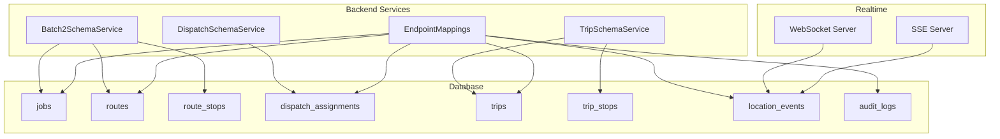
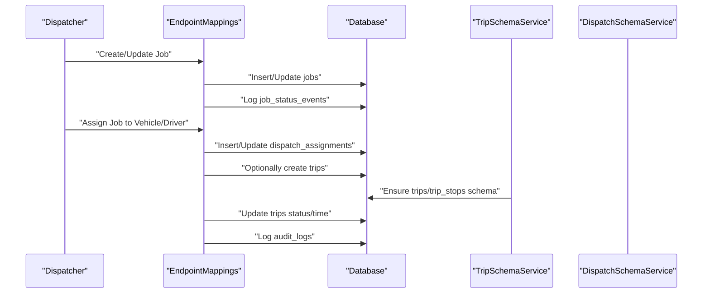
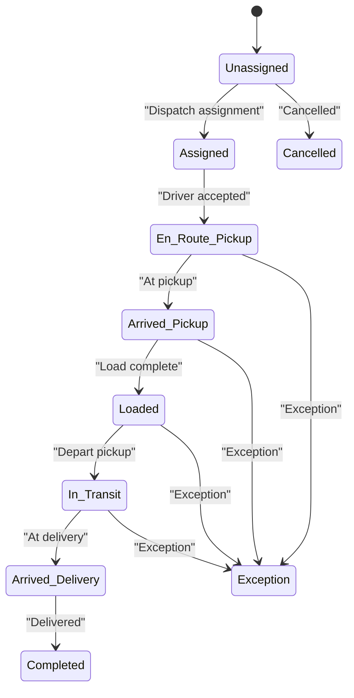
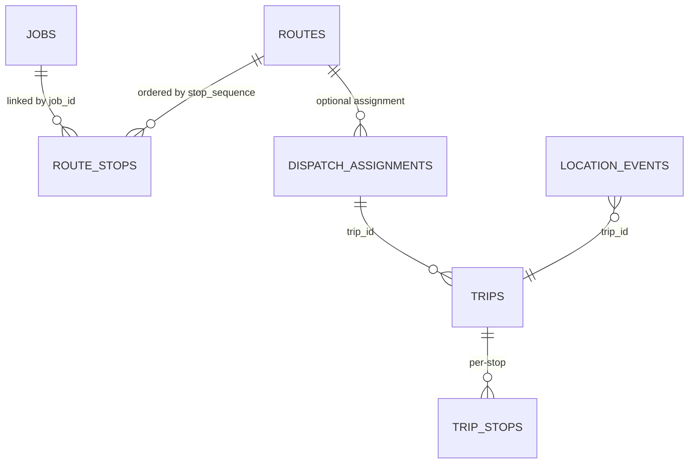
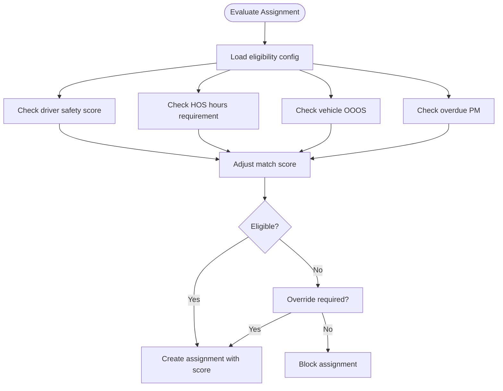
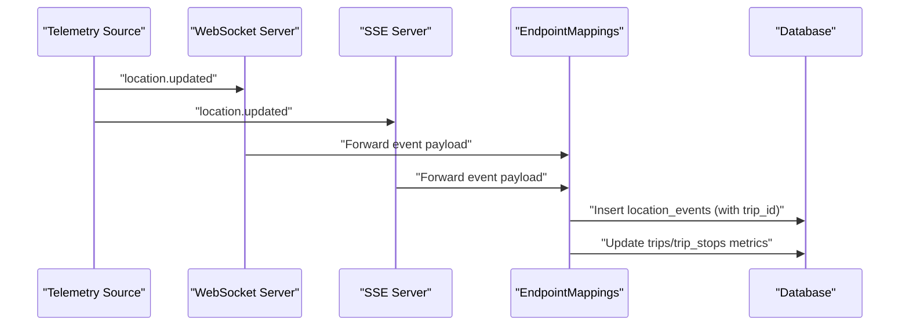
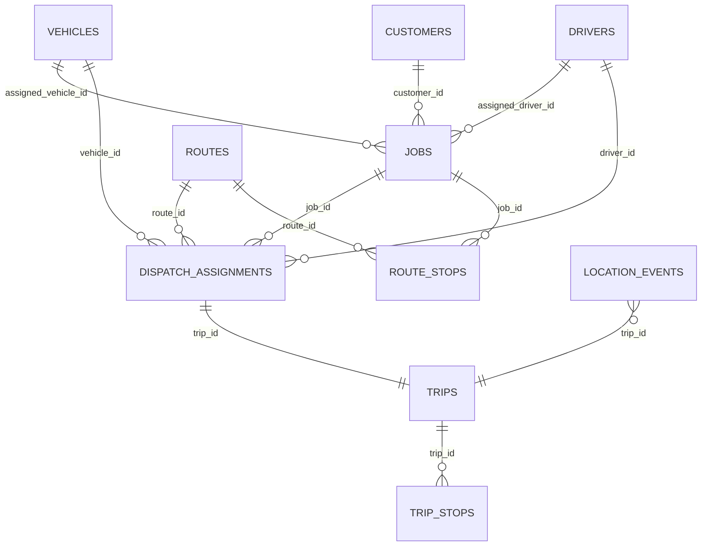

# Operational Data Tables

<cite>
**Referenced Files in This Document**
- [001_schema.sql](file://db/init/001_schema.sql)
- [002_seed.sql](file://db/init/002_seed.sql)
- [EndpointMappings.cs](file://backend-dotnet/Controllers/EndpointMappings.cs)
- [DispatchSchemaService.cs](file://backend-dotnet/Services/DispatchSchemaService.cs)
- [TripSchemaService.cs](file://backend-dotnet/Services/TripSchemaService.cs)
- [Batch2SchemaService.cs](file://backend-dotnet/Services/Batch2SchemaService.cs)
- [DispatchTests.cs](file://backend-dotnet.Tests/DispatchTests.cs)
- [server.js](file://node-services/events/src/server.js)
- [server.js](file://services/node-events/src/server.js)
- [MODULE_COVERAGE_MATRIX.md](file://docs/MODULE_COVERAGE_MATRIX.md)
</cite>

## Table of Contents
1. [Introduction](#introduction)
2. [Project Structure](#project-structure)
3. [Core Components](#core-components)
4. [Architecture Overview](#architecture-overview)
5. [Detailed Component Analysis](#detailed-component-analysis)
6. [Dependency Analysis](#dependency-analysis)
7. [Performance Considerations](#performance-considerations)
8. [Troubleshooting Guide](#troubleshooting-guide)
9. [Conclusion](#conclusion)
10. [Appendices](#appendices)

## Introduction
This document describes the operational data tables supporting jobs, routes, trips, dispatch assignments, and related operational entities. It explains the job lifecycle, route planning data structures, dispatch assignment scoring, route optimization data, real-time tracking, event logging, status tracking, and audit trails. It also covers performance considerations and indexing strategies for high-frequency operational data.

## Project Structure
The operational domain spans:
- Database schema and seed data defining core entities and indexes
- Backend services that evolve schema and expose operational endpoints
- Real-time event streaming for live tracking
- Tests validating dispatch/trip integration and scoring logic



**Diagram sources**
- [001_schema.sql](file://db/init/001_schema.sql)
- [DispatchSchemaService.cs](file://backend-dotnet/Services/DispatchSchemaService.cs)
- [Batch2SchemaService.cs](file://backend-dotnet/Services/Batch2SchemaService.cs)
- [TripSchemaService.cs](file://backend-dotnet/Services/TripSchemaService.cs)
- [EndpointMappings.cs](file://backend-dotnet/Controllers/EndpointMappings.cs)
- [server.js](file://node-services/events/src/server.js)
- [server.js](file://services/node-events/src/server.js)

**Section sources**
- [001_schema.sql](file://db/init/001_schema.sql)
- [002_seed.sql](file://db/init/002_seed.sql)
- [EndpointMappings.cs](file://backend-dotnet/Controllers/EndpointMappings.cs)
- [DispatchSchemaService.cs](file://backend-dotnet/Services/DispatchSchemaService.cs)
- [TripSchemaService.cs](file://backend-dotnet/Services/TripSchemaService.cs)
- [Batch2SchemaService.cs](file://backend-dotnet/Services/Batch2SchemaService.cs)
- [server.js](file://node-services/events/src/server.js)
- [server.js](file://services/node-events/src/server.js)

## Core Components
- jobs: Operational work items with scheduling, priority, SLA windows, and status tracking. Extended with Batch 2 fields for ETA, SLA status, proof status, tracking code, risk score, and estimates.
- routes: Planned route definitions with metadata such as region, type, planned timestamps, totals, efficiency score, SLA risk, and optimization mode.
- route_stops: Ordered stops linking to jobs, with time windows, lat/lng, proof status, and sequencing.
- dispatch_assignments: Links jobs to vehicles/drivers, captures match score/reasons, timestamps, eligibility JSON, and exception counts. Supports route/trailer/planned/actual timestamps and trip linkage.
- trips: Trip execution records with planned/actual timestamps, origin/destination, distances/durations, stop metrics, compliance scores, and telemetry gap tracking.
- trip_stops: Per-trip stop records mirroring route_stops with actual arrival/departure times and deviations.
- location_events: Real-time GPS and operational telemetry with vehicle/driver codes, speed, heading, and event types, indexed for efficient queries.
- audit_logs: Immutable audit trail keyed by entity and tenant/company.

**Section sources**
- [001_schema.sql](file://db/init/001_schema.sql)
- [Batch2SchemaService.cs](file://backend-dotnet/Services/Batch2SchemaService.cs)
- [DispatchSchemaService.cs](file://backend-dotnet/Services/DispatchSchemaService.cs)
- [TripSchemaService.cs](file://backend-dotnet/Services/TripSchemaService.cs)

## Architecture Overview
The operational workflow connects jobs to routes and trips via dispatch assignments. Real-time location updates feed into location_events, enabling live tracking and compliance monitoring. Status transitions are logged and audited, while Batch 2 enhancements enrich ETA, SLA, and proof capture.



**Diagram sources**
- [EndpointMappings.cs](file://backend-dotnet/Controllers/EndpointMappings.cs)
- [Batch2SchemaService.cs](file://backend-dotnet/Services/Batch2SchemaService.cs)
- [DispatchSchemaService.cs](file://backend-dotnet/Services/DispatchSchemaService.cs)
- [TripSchemaService.cs](file://backend-dotnet/Services/TripSchemaService.cs)

## Detailed Component Analysis

### Jobs Lifecycle and Tracking
- Lifecycle: Jobs move through statuses such as Unassigned, Assigned, En Route, At Stop, Completed, Delayed, At Risk. Transitions are recorded in job_status_events with timestamps and notes.
- SLA and ETA: Batch 2 adds sla_window_start/end, eta, sla_status, proof_status, tracking_code, risk_score, and financial estimates.
- Tracking: customer_eta_links and eta_updates support customer visibility and proactive ETA messaging.



**Diagram sources**
- [EndpointMappings.cs](file://backend-dotnet/Controllers/EndpointMappings.cs)
- [Batch2SchemaService.cs](file://backend-dotnet/Services/Batch2SchemaService.cs)

**Section sources**
- [EndpointMappings.cs](file://backend-dotnet/Controllers/EndpointMappings.cs)
- [Batch2SchemaService.cs](file://backend-dotnet/Services/Batch2SchemaService.cs)
- [002_seed.sql](file://db/init/002_seed.sql)

### Route Planning and Optimization
- routes: Contains route metadata, region, type, planned timestamps, totals, efficiency score, SLA risk, cost estimate, and optimization mode.
- route_stops: Defines ordered stops with time windows, lat/lng, proof status, and sequencing aligned to jobs.
- route_paths: Stores optimized path geometry and metrics for visualization/reporting.
- route_recommendations: AI-driven recommendations with scores and status.



**Diagram sources**
- [001_schema.sql](file://db/init/001_schema.sql)
- [Batch2SchemaService.cs](file://backend-dotnet/Services/Batch2SchemaService.cs)
- [TripSchemaService.cs](file://backend-dotnet/Services/TripSchemaService.cs)

**Section sources**
- [001_schema.sql](file://db/init/001_schema.sql)
- [Batch2SchemaService.cs](file://backend-dotnet/Services/Batch2SchemaService.cs)
- [TripSchemaService.cs](file://backend-dotnet/Services/TripSchemaService.cs)

### Dispatch Assignment Scoring and Eligibility
- dispatch_assignments: Captures match_score, match_reasons_json, eligibility_json, exception_count, and timestamps for planned/actual pickups/deliveries. Includes route_id, trailer_id, trip_id, and notes.
- dispatch_eligibility_config: Tenant-configurable thresholds for driver safety score, critical defects, open work orders, OOOS, minimum HOS, and overdue PM.
- Eligibility evaluation adjusts match scores and flags overrides.



**Diagram sources**
- [DispatchSchemaService.cs](file://backend-dotnet/Services/DispatchSchemaService.cs)
- [EndpointMappings.cs](file://backend-dotnet/Controllers/EndpointMappings.cs)

**Section sources**
- [DispatchSchemaService.cs](file://backend-dotnet/Services/DispatchSchemaService.cs)
- [EndpointMappings.cs](file://backend-dotnet/Controllers/EndpointMappings.cs)

### Trips and Real-Time Tracking
- trips: Execution record with planned/actual timestamps, origin/destination, distances/durations, stop metrics, compliance scores, and telemetry gaps.
- trip_stops: Per-trip stop with planned/actual arrivals/departures, time windows, delays, and deviation flags.
- location_events: Indexed by company and event_time; trip_id and trip_sequence enable breadcrumb replay and compliance checks.



**Diagram sources**
- [server.js](file://node-services/events/src/server.js)
- [server.js](file://services/node-events/src/server.js)
- [EndpointMappings.cs](file://backend-dotnet/Controllers/EndpointMappings.cs)
- [TripSchemaService.cs](file://backend-dotnet/Services/TripSchemaService.cs)

**Section sources**
- [server.js](file://node-services/events/src/server.js)
- [server.js](file://services/node-events/src/server.js)
- [EndpointMappings.cs](file://backend-dotnet/Controllers/EndpointMappings.cs)
- [TripSchemaService.cs](file://backend-dotnet/Services/TripSchemaService.cs)

### Operational Event Logging, Status Tracking, and Audit Trails
- job_status_events: Tracks status transitions with timestamps and notes.
- entity_timeline_events: Generalized timeline for entities.
- audit_logs: Immutable logs keyed by company and entity, with JSON details and timestamps.
- Tests validate assignment-to-route/trip linkage and trip activation/completion flows.

```mermaid
sequenceDiagram
participant Actor as "Actor"
participant API as "EndpointMappings"
participant DB as "Database"
Actor->>API : "Change job status"
API->>DB : "UPDATE jobs.status"
API->>DB : "INSERT job_status_events"
API->>DB : "INSERT audit_logs"
API-->>Actor : "Success response"
```

**Diagram sources**
- [EndpointMappings.cs](file://backend-dotnet/Controllers/EndpointMappings.cs)
- [DispatchTests.cs](file://backend-dotnet.Tests/DispatchTests.cs)

**Section sources**
- [EndpointMappings.cs](file://backend-dotnet/Controllers/EndpointMappings.cs)
- [DispatchTests.cs](file://backend-dotnet.Tests/DispatchTests.cs)
- [002_seed.sql](file://db/init/002_seed.sql)

## Dependency Analysis
- jobs depends on customers, vehicles, drivers; Batch 2 adds route_id and SLA fields.
- routes depends on vehicles/drivers; route_stops depends on jobs and routes.
- dispatch_assignments links jobs to vehicles/drivers and optionally routes/trips.
- trips depends on routes/jobs/vehicles/drivers; trip_stops mirrors route_stops.
- location_events ties vehicles/drivers to trips for breadcrumb replay.
- audit_logs depends on actors and entities.



**Diagram sources**
- [001_schema.sql](file://db/init/001_schema.sql)
- [Batch2SchemaService.cs](file://backend-dotnet/Services/Batch2SchemaService.cs)
- [TripSchemaService.cs](file://backend-dotnet/Services/TripSchemaService.cs)

**Section sources**
- [001_schema.sql](file://db/init/001_schema.sql)
- [Batch2SchemaService.cs](file://backend-dotnet/Services/Batch2SchemaService.cs)
- [TripSchemaService.cs](file://backend-dotnet/Services/TripSchemaService.cs)

## Performance Considerations
- Indexing strategy:
  - location_events: composite indexes on company_id,event_time and vehicle_id,event_time for fast time-series queries.
  - dispatch_assignments: indexes on company_id,status, driver_id, vehicle_id, trip_id for assignment queries.
  - trips: indexes on company_id,status, vehicle_id, driver_id, route_id for trip filtering and telemetry joins.
  - trip_stops: index on trip_id,stop_sequence for ordered stop processing.
  - audit_logs: composite indexes on company_id,created_at and entity_name/entity_id for audit drill-down.
- High-frequency updates:
  - Prefer batch inserts for location_events and minimize transaction overhead.
  - Use partitioning or retention policies for historical telemetry.
  - Apply connection pooling and limit page sizes for reporting endpoints.
- Query constraints:
  - SecureQueryBuilder enforces limits on fields/filters/page size and validates operators to prevent injection and excessive scans.

**Section sources**
- [001_schema.sql](file://db/init/001_schema.sql)
- [DispatchSchemaService.cs](file://backend-dotnet/Services/DispatchSchemaService.cs)
- [TripSchemaService.cs](file://backend-dotnet/Services/TripSchemaService.cs)
- [EndpointMappings.cs](file://backend-dotnet/Controllers/EndpointMappings.cs)
- [MODULE_COVERAGE_MATRIX.md](file://docs/MODULE_COVERAGE_MATRIX.md)

## Troubleshooting Guide
- Assignment eligibility failures:
  - Verify dispatch_eligibility_config thresholds and ensure driver/vehicle readiness meets criteria.
  - Check eligibility_json and exception_count in dispatch_assignments for override reasons.
- Trip activation/completion:
  - Confirm trip status transitions align with dispatch state machine and that trips are created/linked from assignments.
- Real-time tracking:
  - Validate WebSocket/SSE endpoints and ensure location_events includes trip_id and trip_sequence for breadcrumb replay.
- Audit and timelines:
  - Use audit_logs endpoint with entity filters and verify entity_timeline_events indexing for performance.

**Section sources**
- [DispatchSchemaService.cs](file://backend-dotnet/Services/DispatchSchemaService.cs)
- [EndpointMappings.cs](file://backend-dotnet/Controllers/EndpointMappings.cs)
- [DispatchTests.cs](file://backend-dotnet.Tests/DispatchTests.cs)
- [server.js](file://node-services/events/src/server.js)
- [server.js](file://services/node-events/src/server.js)

## Conclusion
The operational data model integrates jobs, routes, trips, and dispatch assignments with robust status tracking, real-time telemetry, and auditability. Batch 2 enhancements improve SLA visibility, ETA reliability, and proof capture. Proper indexing and secure query construction ensure performance and safety for high-frequency updates.

## Appendices
- Example endpoints and queries:
  - List dispatch assignments with job/route/vehicle/driver details
  - Retrieve job status change timeline
  - Stream live location events via WebSocket/SSE
  - Audit trail lookup by entity

**Section sources**
- [EndpointMappings.cs](file://backend-dotnet/Controllers/EndpointMappings.cs)
- [server.js](file://node-services/events/src/server.js)
- [server.js](file://services/node-events/src/server.js)