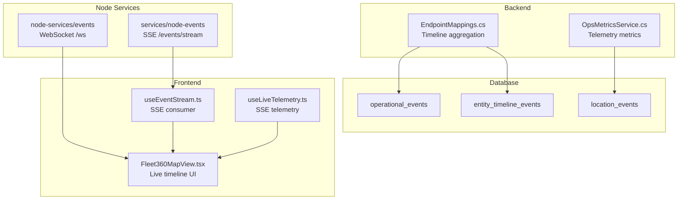
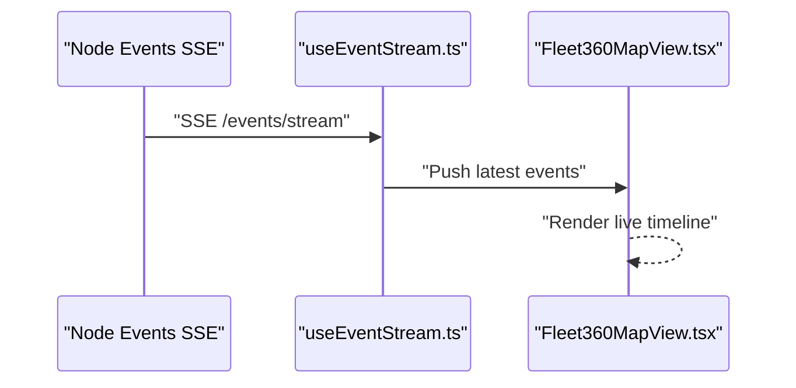
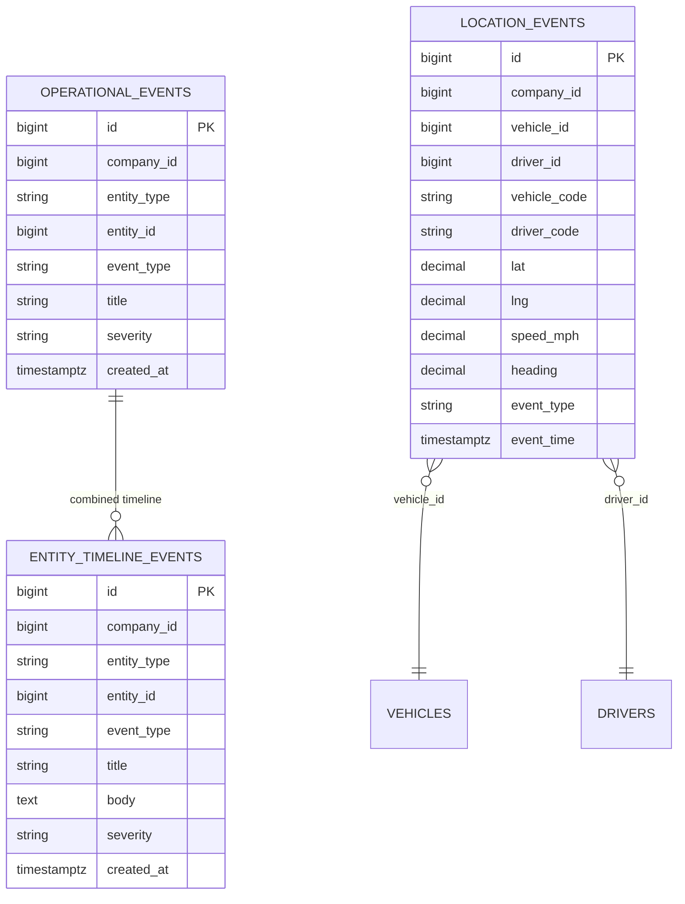
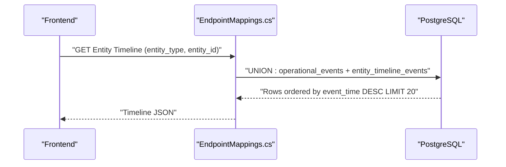
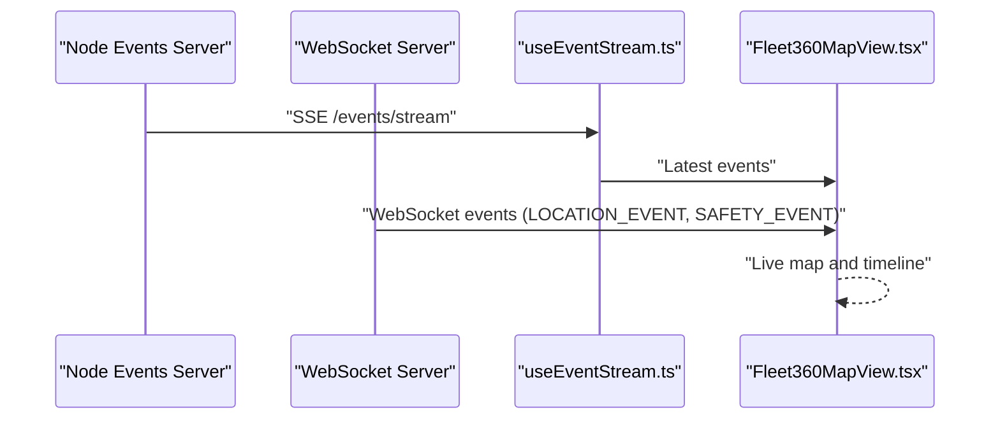
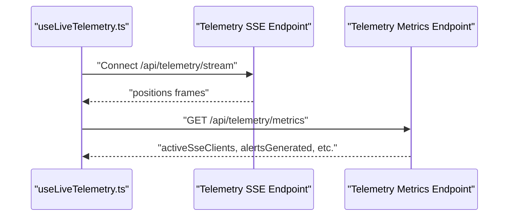
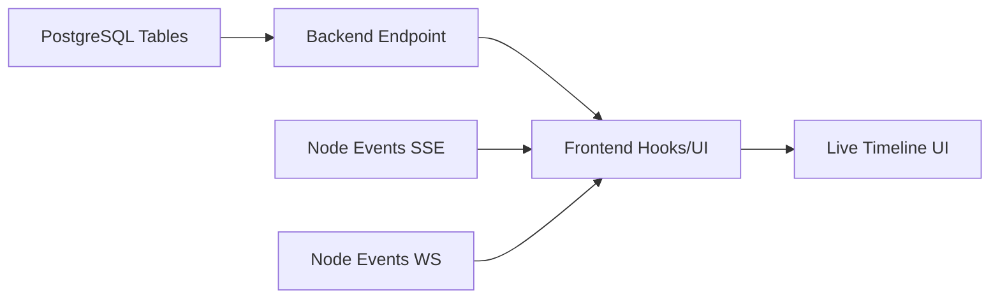

# Operational Events and Logging

<cite>
**Referenced Files in This Document**
- [001_schema.sql](file://db/init/001_schema.sql)
- [002_seed.sql](file://db/init/002_seed.sql)
- [EndpointMappings.cs](file://backend-dotnet/Controllers/EndpointMappings.cs)
- [useEventStream.ts](file://frontend/src/hooks/useEventStream.ts)
- [useLiveTelemetry.ts](file://frontend/src/hooks/useLiveTelemetry.ts)
- [server.js (node-services/events)](file://node-services/events/src/server.js)
- [server.js (services/node-events)](file://services/node-events/src/server.js)
- [ObservabilitySchemaService.cs](file://backend-dotnet/Services/ObservabilitySchemaService.cs)
- [OpsMetricsService.cs](file://backend-dotnet/Services/OpsMetricsService.cs)
- [Fleet360MapView.tsx](file://frontend/src/components/Fleet360MapView.tsx)
</cite>

## Table of Contents
1. [Introduction](#introduction)
2. [Project Structure](#project-structure)
3. [Core Components](#core-components)
4. [Architecture Overview](#architecture-overview)
5. [Detailed Component Analysis](#detailed-component-analysis)
6. [Dependency Analysis](#dependency-analysis)
7. [Performance Considerations](#performance-considerations)
8. [Troubleshooting Guide](#troubleshooting-guide)
9. [Conclusion](#conclusion)
10. [Appendices](#appendices)

## Introduction
This document explains the operational event logging and timeline tracking systems in the platform. It covers:
- The operational_events table for real-time operational activity capture
- The entity_timeline_events table for comprehensive audit trails
- Event categorization taxonomy (for example, location.updated, job.status.changed, vehicle.maintenance.scheduled)
- Severity levels and their usage
- Real-time event streaming architecture and WebSocket integration for live monitoring
- Performance characteristics, indexing strategies, and retrieval patterns
- Filtering and time-based querying capabilities
- Integration with the observability dashboard for operational insights

## Project Structure
The eventing stack spans database schemas, backend controllers, Node.js services, and frontend hooks:
- Database: event tables and indexes
- Backend: event ingestion and timeline aggregation endpoints
- Node services: SSE and WebSocket event producers
- Frontend: event feed consumers and live telemetry streams

**Diagram sources**
- [001_schema.sql:126-144](file://db/init/001_schema.sql#L126-L144)
- [002_seed.sql:338-344](file://db/init/002_seed.sql#L338-L344)
- [EndpointMappings.cs:4083-4092](file://backend-dotnet/Controllers/EndpointMappings.cs#L4083-L4092)
- [server.js (services/node-events):101-114](file://services/node-events/src/server.js#L101-L114)
- [server.js (node-services/events):21-28](file://node-services/events/src/server.js#L21-L28)
- [useEventStream.ts:1-22](file://frontend/src/hooks/useEventStream.ts#L1-L22)
- [useLiveTelemetry.ts:71-149](file://frontend/src/hooks/useLiveTelemetry.ts#L71-L149)
- [Fleet360MapView.tsx:695-709](file://frontend/src/components/Fleet360MapView.tsx#L695-L709)

**Section sources**
- [001_schema.sql:126-144](file://db/init/001_schema.sql#L126-L144)
- [002_seed.sql:338-344](file://db/init/002_seed.sql#L338-L344)
- [EndpointMappings.cs:4083-4092](file://backend-dotnet/Controllers/EndpointMappings.cs#L4083-L4092)
- [server.js (services/node-events):101-114](file://services/node-events/src/server.js#L101-L114)
- [server.js (node-services/events):21-28](file://node-services/events/src/server.js#L21-L28)
- [useEventStream.ts:1-22](file://frontend/src/hooks/useEventStream.ts#L1-L22)
- [useLiveTelemetry.ts:71-149](file://frontend/src/hooks/useLiveTelemetry.ts#L71-L149)
- [Fleet360MapView.tsx:695-709](file://frontend/src/components/Fleet360MapView.tsx#L695-L709)

## Core Components
- operational_events: captures real-time operational activity for entities (Vehicle, Driver, Job, Route, Customer). Includes event_type, severity, and timestamps for ordering.
- entity_timeline_events: stores historical timeline entries for entities, enabling combined timeline views with operational_events.
- location_events: captures GPS and telemetry-like location updates with indexes optimized for time-series queries.
- Backend aggregation endpoint: unions timelines for a given entity and limits recent events.
- Node event services: produce SSE and WebSocket streams for live monitoring.
- Frontend hooks: consume SSE and WebSocket streams to render live feeds and telemetry.

**Section sources**
- [001_schema.sql:126-144](file://db/init/001_schema.sql#L126-L144)
- [002_seed.sql:338-344](file://db/init/002_seed.sql#L338-L344)
- [EndpointMappings.cs:4083-4092](file://backend-dotnet/Controllers/EndpointMappings.cs#L4083-L4092)
- [server.js (services/node-events):101-114](file://services/node-events/src/server.js#L101-L114)
- [server.js (node-services/events):21-28](file://node-services/events/src/server.js#L21-L28)
- [useEventStream.ts:1-22](file://frontend/src/hooks/useEventStream.ts#L1-L22)
- [useLiveTelemetry.ts:71-149](file://frontend/src/hooks/useLiveTelemetry.ts#L71-L149)

## Architecture Overview
The system supports two complementary live update channels:
- SSE for lightweight, browser-friendly event feeds
- WebSocket for bidirectional and scalable fan-out to multiple clients

**Diagram sources**
- [server.js (services/node-events):101-114](file://services/node-events/src/server.js#L101-L114)
- [useEventStream.ts:1-22](file://frontend/src/hooks/useEventStream.ts#L1-L22)
- [Fleet360MapView.tsx:695-709](file://frontend/src/components/Fleet360MapView.tsx#L695-L709)

## Detailed Component Analysis

### Event Tables and Indexing
- operational_events
  - Columns include company_id, entity_type, entity_id, event_type, title, severity, and created_at.
  - Supports time-based queries and limits for recent events.
- entity_timeline_events
  - Stores entity-centric timeline entries with severity and optional body.
  - Combined with operational_events for unified timeline views.
- location_events
  - Indexed by vehicle_id and event_time, and by tenant_id and event_time to accelerate time-series filters.

**Diagram sources**
- [001_schema.sql:126-144](file://db/init/001_schema.sql#L126-L144)
- [002_seed.sql:338-344](file://db/init/002_seed.sql#L338-L344)

**Section sources**
- [001_schema.sql:126-144](file://db/init/001_schema.sql#L126-L144)
- [002_seed.sql:338-344](file://db/init/002_seed.sql#L338-L344)

### Timeline Aggregation Endpoint
The backend endpoint combines recent timeline entries for a given entity by unioning operational_events and entity_timeline_events, ordering by event_time descending and limiting results.

**Diagram sources**
- [EndpointMappings.cs:4083-4092](file://backend-dotnet/Controllers/EndpointMappings.cs#L4083-L4092)

**Section sources**
- [EndpointMappings.cs:4083-4092](file://backend-dotnet/Controllers/EndpointMappings.cs#L4083-L4092)

### Event Streaming and WebSocket Integration
- SSE producer (services/node-events): exposes /events/stream for periodic event emissions.
- Frontend consumer (useEventStream.ts): subscribes to SSE and maintains a rolling window of events.
- WebSocket producer (node-services/events): broadcasts location and safety events to connected clients.
- Frontend consumer (Fleet360MapView.tsx): renders live events from WebSocket.

**Diagram sources**
- [server.js (services/node-events):101-114](file://services/node-events/src/server.js#L101-L114)
- [server.js (node-services/events):21-28](file://node-services/events/src/server.js#L21-L28)
- [useEventStream.ts:1-22](file://frontend/src/hooks/useEventStream.ts#L1-L22)
- [Fleet360MapView.tsx:695-709](file://frontend/src/components/Fleet360MapView.tsx#L695-L709)

**Section sources**
- [server.js (services/node-events):101-114](file://services/node-events/src/server.js#L101-L114)
- [server.js (node-services/events):21-28](file://node-services/events/src/server.js#L21-L28)
- [useEventStream.ts:1-22](file://frontend/src/hooks/useEventStream.ts#L1-L22)
- [Fleet360MapView.tsx:695-709](file://frontend/src/components/Fleet360MapView.tsx#L695-L709)

### Event Categorization and Severity
- Event categories include, but are not limited to: location.updated, geofence.entered, geofence.exited, job.created, job.assigned, job.status_changed, job.delayed, route.optimized, vehicle.idle, safety.event, dashcam.event, coaching.created, incident.created, evidence.package_created, insurance.report_created, maintenance.due, maintenance.overdue, maintenance.warning, workorder.created, workorder.status_changed, workorder.completed, dvir.submitted, dvir.critical_defect, dvir.mechanic_reviewed, document.expiring, document.expired, eta.sent, proof.completed, dispatch.recommendation, customer.feedback, fuel.transaction_created, fuel.anomaly_detected, idling.threshold_exceeded, expense.created, expense.approved, expense.rejected, contract.expiring, carrier.compliance_risk, margin.risk_detected, cost.leakage_detected, cost.action_created, compliance.violation_detected, compliance.document_expiring, compliance.audit_package_created, hos.warning, hos.log_certified, eld.malfunction, dvir.compliance_warning, localization.preference_changed, cross_border.risk_detected, report.run_completed, report.export_requested, scheduled_report.created, kpi.drift_detected, sla.breach_detected, audit.sensitive_action, executive.snapshot_created, ai.report_recommended.
- Severity levels include Info, Warning, High, Critical.

**Section sources**
- [services/node-events/src/server.js:14-78](file://services/node-events/src/server.js#L14-L78)
- [002_seed.sql:338-344](file://db/init/002_seed.sql#L338-L344)

### Telemetry and Live Monitoring
- Frontend hook useLiveTelemetry.ts establishes an EventSource connection to a telemetry SSE endpoint, handles reconnects, and updates position lists.
- Backend telemetry metrics endpoint exposes counters such as active SSE clients and alert generation statistics.

**Diagram sources**
- [useLiveTelemetry.ts:71-149](file://frontend/src/hooks/useLiveTelemetry.ts#L71-L149)
- [EndpointMappings.cs:7134-7149](file://backend-dotnet/Controllers/EndpointMappings.cs#L7134-L7149)

**Section sources**
- [useLiveTelemetry.ts:71-149](file://frontend/src/hooks/useLiveTelemetry.ts#L71-L149)
- [EndpointMappings.cs:7134-7149](file://backend-dotnet/Controllers/EndpointMappings.cs#L7134-L7149)

## Dependency Analysis
- Backend timeline aggregation depends on:
  - operational_events for live operational signals
  - entity_timeline_events for historical entity events
- Node services depend on:
  - database connectivity to insert events and broadcast updates
- Frontend depends on:
  - SSE endpoints for event feeds
  - WebSocket endpoints for real-time fan-out

**Diagram sources**
- [EndpointMappings.cs:4083-4092](file://backend-dotnet/Controllers/EndpointMappings.cs#L4083-L4092)
- [server.js (services/node-events):101-114](file://services/node-events/src/server.js#L101-L114)
- [server.js (node-services/events):21-28](file://node-services/events/src/server.js#L21-L28)
- [useEventStream.ts:1-22](file://frontend/src/hooks/useEventStream.ts#L1-L22)
- [useLiveTelemetry.ts:71-149](file://frontend/src/hooks/useLiveTelemetry.ts#L71-L149)

**Section sources**
- [EndpointMappings.cs:4083-4092](file://backend-dotnet/Controllers/EndpointMappings.cs#L4083-L4092)
- [server.js (services/node-events):101-114](file://services/node-events/src/server.js#L101-L114)
- [server.js (node-services/events):21-28](file://node-services/events/src/server.js#L21-L28)
- [useEventStream.ts:1-22](file://frontend/src/hooks/useEventStream.ts#L1-L22)
- [useLiveTelemetry.ts:71-149](file://frontend/src/hooks/useLiveTelemetry.ts#L71-L149)

## Performance Considerations
- Indexing strategies
  - location_events: composite indexes on (vehicle_id, event_time) and (tenant_id, event_time) optimize time-range queries for vehicle telemetry.
  - service_run_history and platform_incidents: indexes on service_name, status, and opened_at support operational monitoring and incident triage.
- Query patterns
  - Timeline aggregation uses ORDER BY event_time DESC with LIMIT 20 to cap frontend rendering costs.
  - Telemetry metrics endpoints compute aggregates over recent windows to avoid scanning entire histories.
- Streaming overhead
  - SSE and WebSocket connections are tracked; metrics expose active client counts to monitor load.
- Recommendations
  - Partition or shard by company_id/tenant_id for high-volume deployments.
  - Use materialized summaries for frequently accessed time windows.
  - Tune LIMIT and refresh intervals based on UI needs and network capacity.

**Section sources**
- [001_schema.sql:139-140](file://db/init/001_schema.sql#L139-L140)
- [ObservabilitySchemaService.cs:40-47](file://backend-dotnet/Services/ObservabilitySchemaService.cs#L40-L47)
- [ObservabilitySchemaService.cs:82-89](file://backend-dotnet/Services/ObservabilitySchemaService.cs#L82-L89)
- [EndpointMappings.cs:4083-4092](file://backend-dotnet/Controllers/EndpointMappings.cs#L4083-L4092)
- [EndpointMappings.cs:7134-7149](file://backend-dotnet/Controllers/EndpointMappings.cs#L7134-L7149)

## Troubleshooting Guide
- Live feed not updating
  - Verify SSE endpoint availability and CORS configuration.
  - Confirm frontend EventSource connection lifecycle and error handlers.
- WebSocket events missing
  - Check WebSocket server health and broadcast function invocation.
  - Validate client subscriptions and reconnection logic.
- Excessive latency or dropped events
  - Review active SSE client metrics and adjust refresh intervals.
  - Consider reducing event frequency or increasing buffer sizes.
- Timeline gaps
  - Ensure timeline aggregation endpoint is invoked with correct entity_type and entity_id.
  - Confirm that operational_events and entity_timeline_events are populated consistently.

**Section sources**
- [server.js (services/node-events):101-114](file://services/node-events/src/server.js#L101-L114)
- [server.js (node-services/events):21-28](file://node-services/events/src/server.js#L21-L28)
- [useEventStream.ts:1-22](file://frontend/src/hooks/useEventStream.ts#L1-L22)
- [useLiveTelemetry.ts:71-149](file://frontend/src/hooks/useLiveTelemetry.ts#L71-L149)
- [EndpointMappings.cs:7134-7149](file://backend-dotnet/Controllers/EndpointMappings.cs#L7134-L7149)

## Conclusion
The platform integrates database-backed operational_events and entity_timeline_events with robust streaming infrastructure (SSE and WebSocket) to deliver live operational insights. Proper indexing, time-windowed queries, and metrics enable scalable performance. The frontend hooks and UI components provide a responsive, real-time monitoring experience aligned with the observability dashboard.

## Appendices

### Event Filtering and Time-Based Queries
- Time-based filtering
  - Use created_at or event_time comparisons to constrain queries to recent windows.
  - Example patterns appear in telemetry metrics and security event queries.
- Filtering by entity and type
  - Filter by entity_type and entity_id to scope timeline results.
  - Filter by event_type to focus on specific categories.

**Section sources**
- [EndpointMappings.cs:4083-4092](file://backend-dotnet/Controllers/EndpointMappings.cs#L4083-L4092)
- [OpsMetricsService.cs:49-76](file://backend-dotnet/Services/OpsMetricsService.cs#L49-L76)