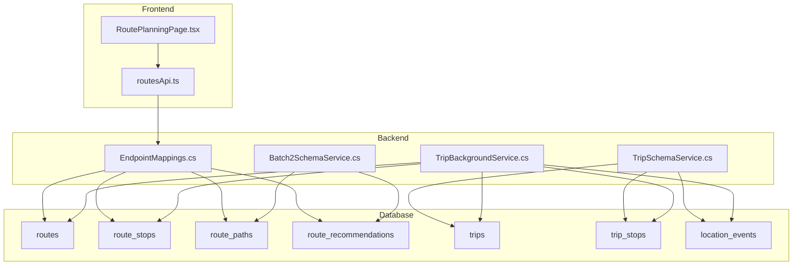
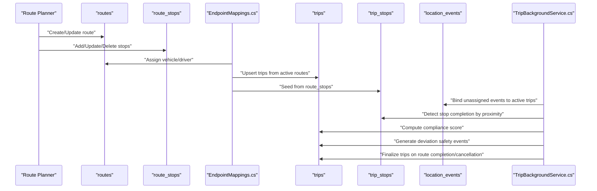
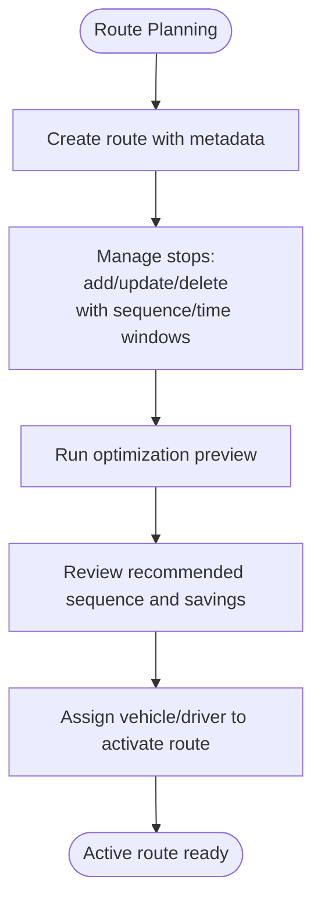
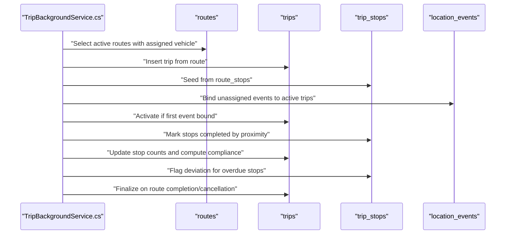
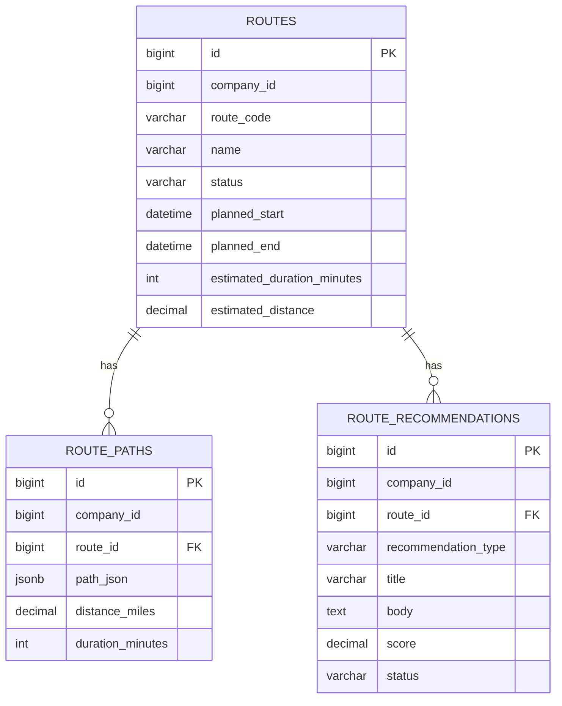
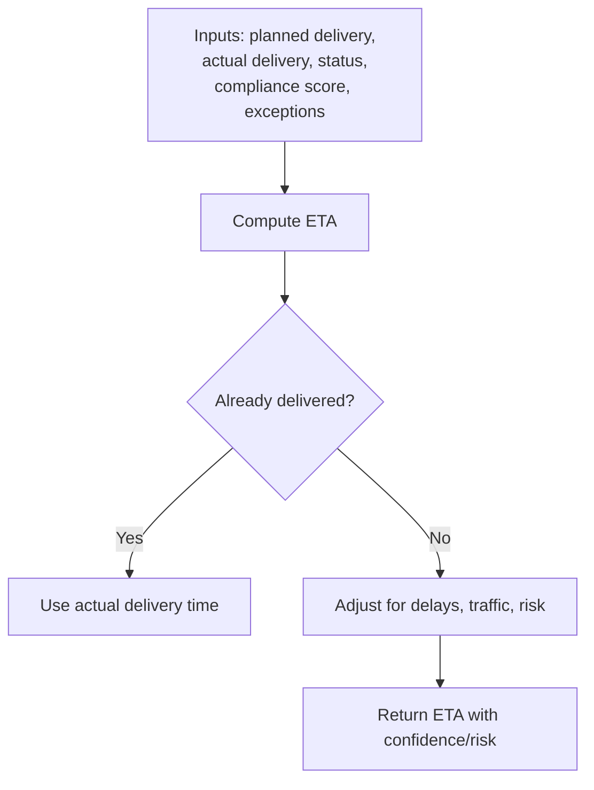
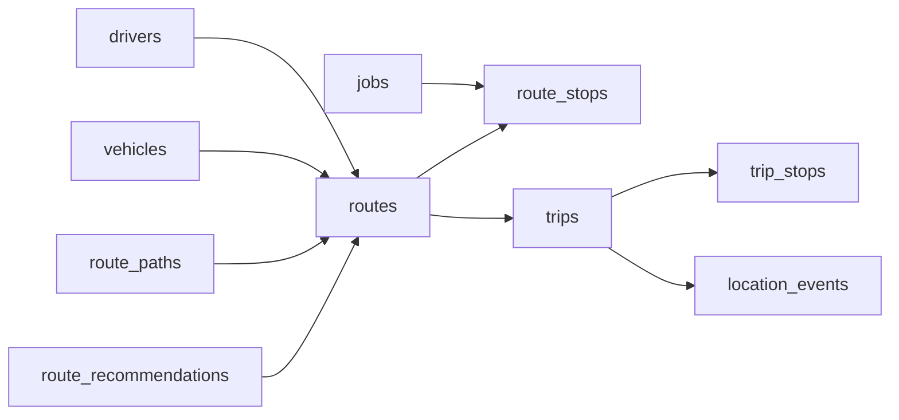

# Routes and Trips Tables

<cite>
**Referenced Files in This Document**
- [001_schema.sql](file://db/init/001_schema.sql)
- [002_seed.sql](file://db/init/002_seed.sql)
- [EndpointMappings.cs](file://backend-dotnet/Controllers/EndpointMappings.cs)
- [TripSchemaService.cs](file://backend-dotnet/Services/TripSchemaService.cs)
- [TripBackgroundService.cs](file://backend-dotnet/Services/TripBackgroundService.cs)
- [Batch2SchemaService.cs](file://backend-dotnet/Services/Batch2SchemaService.cs)
- [routesApi.ts](file://frontend/src/services/routesApi.ts)
- [RoutePlanningPage.tsx](file://frontend/src/pages/RoutePlanningPage.tsx)
</cite>

## Table of Contents
1. [Introduction](#introduction)
2. [Project Structure](#project-structure)
3. [Core Components](#core-components)
4. [Architecture Overview](#architecture-overview)
5. [Detailed Component Analysis](#detailed-component-analysis)
6. [Dependency Analysis](#dependency-analysis)
7. [Performance Considerations](#performance-considerations)
8. [Troubleshooting Guide](#troubleshooting-guide)
9. [Conclusion](#conclusion)

## Introduction
This document explains the operational journey tracking system centered on routes and trips. It covers:
- Route planning, stop sequencing, and optimization previews
- The relationship between routes, route_stops, and the trip execution lifecycle
- The route_path table for storing optimized paths and the route_recommendations system
- The trip lifecycle from planning through execution, including status tracking
- ETA calculation, real-time location updates, and route deviation monitoring
- Multi-stop deliveries via route_stops and performance implications of route optimization

## Project Structure
The system spans database schemas, backend services/controllers, and frontend UI:
- Database bootstrap defines base entities (routes, route_stops) and later-enrichment tables (route_paths, route_recommendations, trips, trip_stops)
- Backend services create trips from active routes, bind telemetry, compute compliance, and detect deviations
- Frontend exposes route planning UI and route stop management

**Diagram sources**
- [001_schema.sql:97-124](file://db/init/001_schema.sql#L97-L124)
- [001_schema.sql:697-701](file://db/init/001_schema.sql#L697-L701)
- [Batch2SchemaService.cs:130-147](file://backend-dotnet/Services/Batch2SchemaService.cs#L130-L147)
- [TripSchemaService.cs:62-117](file://backend-dotnet/Services/TripSchemaService.cs#L62-L117)
- [EndpointMappings.cs:2910-2926](file://backend-dotnet/Controllers/EndpointMappings.cs#L2910-L2926)
- [TripBackgroundService.cs:84-173](file://backend-dotnet/Services/TripBackgroundService.cs#L84-L173)

**Section sources**
- [001_schema.sql:97-124](file://db/init/001_schema.sql#L97-L124)
- [001_schema.sql:697-701](file://db/init/001_schema.sql#L697-L701)
- [Batch2SchemaService.cs:130-147](file://backend-dotnet/Services/Batch2SchemaService.cs#L130-L147)
- [TripSchemaService.cs:62-117](file://backend-dotnet/Services/TripSchemaService.cs#L62-L117)
- [EndpointMappings.cs:2910-2926](file://backend-dotnet/Controllers/EndpointMappings.cs#L2910-L2926)
- [TripBackgroundService.cs:84-173](file://backend-dotnet/Services/TripBackgroundService.cs#L84-L173)

## Core Components
- routes: Top-level route plan with metadata, scheduling, and assignment
- route_stops: Ordered stops with SLA windows, coordinates, and status
- route_paths: Persisted optimized path representation for a route
- route_recommendations: AI/advisor-driven suggestions for route improvements
- trips: Execution record derived from active routes, with status and metrics
- trip_stops: Per-stop plan linked to route_stops, with arrival/departure timestamps and compliance flags
- location_events: Telemetry breadcrumbs enabling real-time tracking and compliance

**Section sources**
- [001_schema.sql:97-124](file://db/init/001_schema.sql#L97-L124)
- [001_schema.sql:697-701](file://db/init/001_schema.sql#L697-L701)
- [Batch2SchemaService.cs:130-147](file://backend-dotnet/Services/Batch2SchemaService.cs#L130-L147)
- [TripSchemaService.cs:62-117](file://backend-dotnet/Services/TripSchemaService.cs#L62-L117)
- [TripSchemaService.cs:24-55](file://backend-dotnet/Services/TripSchemaService.cs#L24-L55)

## Architecture Overview
The runtime lifecycle connects planning to execution:
- Route planning and stop sequencing occur in routes and route_stops
- On assignment, active routes spawn trips and seed trip_stops
- Real-time location_events are bound to trips; proximity triggers stop completion
- Compliance scoring aggregates stop timing, telemetry gaps, and speeding events
- Deviation detection raises safety events for overdue stops outside bounding boxes
- Completion conditions finalize trips when the parent route completes or cancels

**Diagram sources**
- [EndpointMappings.cs:2928-2956](file://backend-dotnet/Controllers/EndpointMappings.cs#L2928-L2956)
- [EndpointMappings.cs:3022-3033](file://backend-dotnet/Controllers/EndpointMappings.cs#L3022-L3033)
- [TripBackgroundService.cs:84-173](file://backend-dotnet/Services/TripBackgroundService.cs#L84-L173)
- [TripBackgroundService.cs:175-214](file://backend-dotnet/Services/TripBackgroundService.cs#L175-L214)
- [TripBackgroundService.cs:216-272](file://backend-dotnet/Services/TripBackgroundService.cs#L216-L272)
- [TripBackgroundService.cs:274-402](file://backend-dotnet/Services/TripBackgroundService.cs#L274-L402)
- [TripBackgroundService.cs:404-502](file://backend-dotnet/Services/TripBackgroundService.cs#L404-L502)
- [TripBackgroundService.cs:504-540](file://backend-dotnet/Services/TripBackgroundService.cs#L504-L540)

## Detailed Component Analysis

### Routes and Route Stops
- routes stores route metadata, scheduling, assignment, and performance indicators
- route_stops captures ordered stops with time windows, coordinates, and status
- Stop CRUD endpoints support adding, updating, and removing stops; sequence validation ensures ordering
- Optimization preview endpoint computes a synthetic efficiency score and recommended sequence

**Diagram sources**
- [EndpointMappings.cs:2928-2956](file://backend-dotnet/Controllers/EndpointMappings.cs#L2928-L2956)
- [EndpointMappings.cs:2964-3004](file://backend-dotnet/Controllers/EndpointMappings.cs#L2964-L3004)
- [EndpointMappings.cs:3006-3020](file://backend-dotnet/Controllers/EndpointMappings.cs#L3006-L3020)
- [EndpointMappings.cs:3022-3033](file://backend-dotnet/Controllers/EndpointMappings.cs#L3022-L3033)

**Section sources**
- [001_schema.sql:97-124](file://db/init/001_schema.sql#L97-L124)
- [EndpointMappings.cs:2928-2956](file://backend-dotnet/Controllers/EndpointMappings.cs#L2928-L2956)
- [EndpointMappings.cs:2964-3004](file://backend-dotnet/Controllers/EndpointMappings.cs#L2964-L3004)
- [EndpointMappings.cs:3006-3020](file://backend-dotnet/Controllers/EndpointMappings.cs#L3006-L3020)
- [EndpointMappings.cs:3022-3033](file://backend-dotnet/Controllers/EndpointMappings.cs#L3022-L3033)

### Trip Lifecycle and Execution
- Trips are auto-created from active routes with an assigned vehicle
- trip_stops are seeded from route_stops with planned windows and statuses
- location_events are bound to trips and ordered by time to enable breadcrumb replay
- Trip activation occurs upon first bound event; actual start time is recorded
- Stop completion is detected via proximity thresholds; arrival delay is calculated against time windows
- Compliance score is computed from start delay, missed stops, late arrivals, telemetry gaps, and speeding events
- Deviation safety events are raised for overdue stops outside the bounding box when no open deviation exists
- Trips finalize when the parent route reaches Completed or Cancelled

**Diagram sources**
- [TripBackgroundService.cs:84-173](file://backend-dotnet/Services/TripBackgroundService.cs#L84-L173)
- [TripBackgroundService.cs:175-214](file://backend-dotnet/Services/TripBackgroundService.cs#L175-L214)
- [TripBackgroundService.cs:216-272](file://backend-dotnet/Services/TripBackgroundService.cs#L216-L272)
- [TripBackgroundService.cs:274-402](file://backend-dotnet/Services/TripBackgroundService.cs#L274-L402)
- [TripBackgroundService.cs:404-502](file://backend-dotnet/Services/TripBackgroundService.cs#L404-L502)
- [TripBackgroundService.cs:504-540](file://backend-dotnet/Services/TripBackgroundService.cs#L504-L540)

**Section sources**
- [TripSchemaService.cs:62-117](file://backend-dotnet/Services/TripSchemaService.cs#L62-L117)
- [TripBackgroundService.cs:84-173](file://backend-dotnet/Services/TripBackgroundService.cs#L84-L173)
- [TripBackgroundService.cs:175-214](file://backend-dotnet/Services/TripBackgroundService.cs#L175-L214)
- [TripBackgroundService.cs:216-272](file://backend-dotnet/Services/TripBackgroundService.cs#L216-L272)
- [TripBackgroundService.cs:274-402](file://backend-dotnet/Services/TripBackgroundService.cs#L274-L402)
- [TripBackgroundService.cs:404-502](file://backend-dotnet/Services/TripBackgroundService.cs#L404-L502)
- [TripBackgroundService.cs:504-540](file://backend-dotnet/Services/TripBackgroundService.cs#L504-L540)

### Route Path and Recommendations
- route_paths persists optimized paths with distance and duration for a given route
- route_recommendations provides AI/advisor-driven suggestions for route improvement
- These tables are created and seeded by Batch2SchemaService

**Diagram sources**
- [001_schema.sql:697-701](file://db/init/001_schema.sql#L697-L701)
- [Batch2SchemaService.cs:130-147](file://backend-dotnet/Services/Batch2SchemaService.cs#L130-L147)

**Section sources**
- [001_schema.sql:697-701](file://db/init/001_schema.sql#L697-L701)
- [Batch2SchemaService.cs:130-147](file://backend-dotnet/Services/Batch2SchemaService.cs#L130-L147)

### ETA Calculation and Real-Time Updates
- ETA engine computes realistic ETAs using actual delivery status, assignment state, vehicle telemetry, compliance metrics, and exceptions
- Frontend exposes customer-facing ETA tracking and update mechanisms
- The system integrates planned vs. actual delivery windows and risk scoring

**Diagram sources**
- [EndpointMappings.cs:9993-10011](file://backend-dotnet/Controllers/EndpointMappings.cs#L9993-L10011)

**Section sources**
- [EndpointMappings.cs:9993-10011](file://backend-dotnet/Controllers/EndpointMappings.cs#L9993-L10011)

### Frontend Integration
- routesApi provides CRUD for routes and stops, plus optimization preview and assignments
- RoutePlanningPage renders route lists, summaries, and stop grids, and triggers optimization previews

**Section sources**
- [routesApi.ts:6-29](file://frontend/src/services/routesApi.ts#L6-L29)
- [RoutePlanningPage.tsx:12-49](file://frontend/src/pages/RoutePlanningPage.tsx#L12-L49)

## Dependency Analysis
- routes depends on vehicles and drivers for assignment
- route_stops depends on jobs/customers for context
- trips depends on routes, vehicles, and drivers; binds to location_events
- trip_stops depends on route_stops for seeding and on trips for execution
- route_paths and route_recommendations enrich route planning and recommendations

**Diagram sources**
- [001_schema.sql:26-59](file://db/init/001_schema.sql#L26-L59)
- [001_schema.sql:97-124](file://db/init/001_schema.sql#L97-L124)
- [001_schema.sql:697-701](file://db/init/001_schema.sql#L697-L701)
- [Batch2SchemaService.cs:130-147](file://backend-dotnet/Services/Batch2SchemaService.cs#L130-L147)

**Section sources**
- [001_schema.sql:26-59](file://db/init/001_schema.sql#L26-L59)
- [001_schema.sql:97-124](file://db/init/001_schema.sql#L97-L124)
- [001_schema.sql:697-701](file://db/init/001_schema.sql#L697-L701)
- [Batch2SchemaService.cs:130-147](file://backend-dotnet/Services/Batch2SchemaService.cs#L130-L147)

## Performance Considerations
- Proximity detection uses bounding boxes to avoid expensive distance calculations; thresholds are tuned for ~300 m accuracy
- Compliance scoring aggregates counts and time differences; indexing on trips and location_events supports efficient scans
- Optimization preview uses a lightweight formula to estimate efficiency gains and time savings
- Telemetry gap detection leverages ordered event times; maintaining trip_sequence improves accuracy
- Recommendations and paths are persisted for reuse, reducing repeated recomputation

[No sources needed since this section provides general guidance]

## Troubleshooting Guide
Common issues and resolutions:
- Trips not activating: ensure location_events exist for the assigned vehicle within the trip time window; verify binding logic and indexes
- Stop completion not detected: confirm proximity thresholds and that events are ordered by time; check trip_sequence population
- Deviation alerts not raised: verify overdue stop conditions and absence of existing open deviation events
- Compliance score anomalies: review start delay thresholds, missed stop logic, telemetry gaps, and speeding counts
- Route optimization preview inconsistencies: note that preview uses synthetic scoring; actual optimization is external to the shown code

**Section sources**
- [TripBackgroundService.cs:175-214](file://backend-dotnet/Services/TripBackgroundService.cs#L175-L214)
- [TripBackgroundService.cs:216-272](file://backend-dotnet/Services/TripBackgroundService.cs#L216-L272)
- [TripBackgroundService.cs:404-502](file://backend-dotnet/Services/TripBackgroundService.cs#L404-L502)
- [TripBackgroundService.cs:274-402](file://backend-dotnet/Services/TripBackgroundService.cs#L274-L402)

## Conclusion
The routes and trips system integrates route planning, stop sequencing, and execution tracking with real-time telemetry and compliance. The design emphasizes automated trip creation, proximity-based stop completion, deviation monitoring, and synthetic optimization previews. Persisted route paths and recommendations further enhance planning and operational insights.