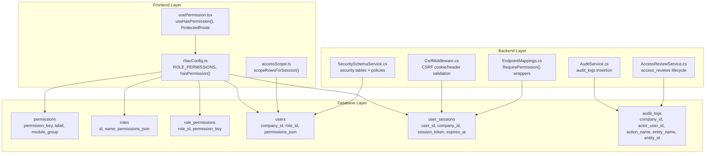
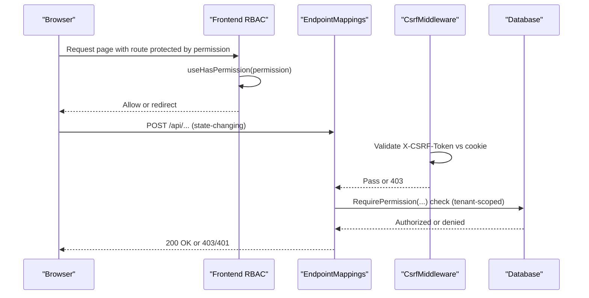
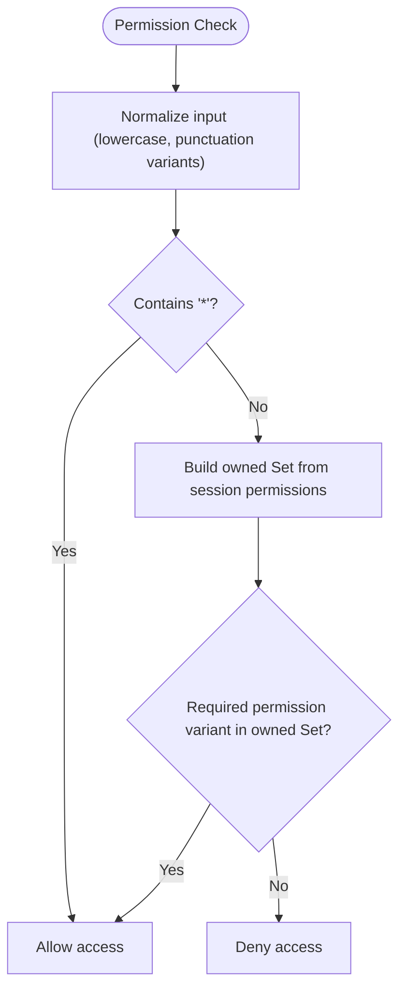
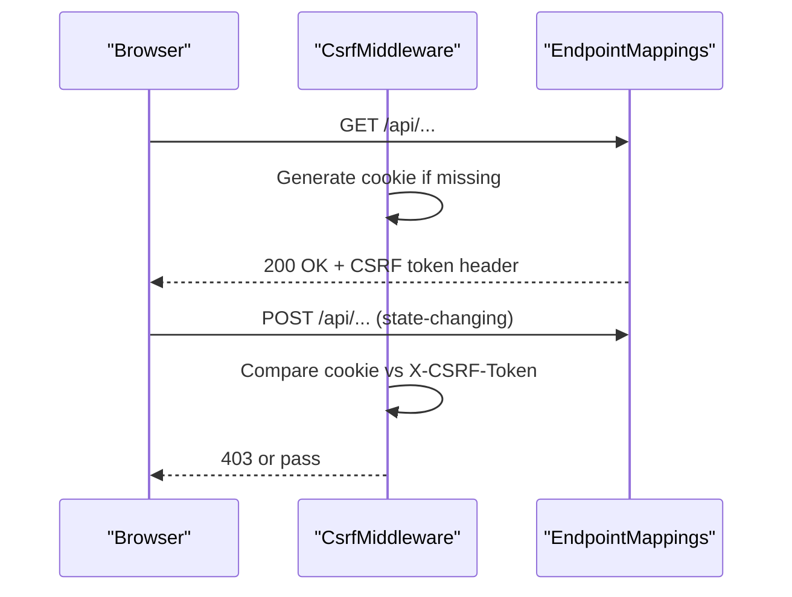
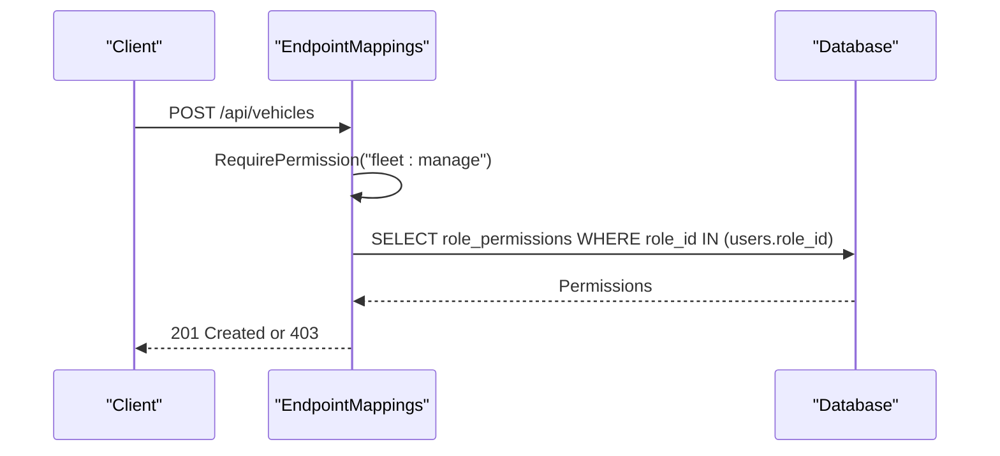
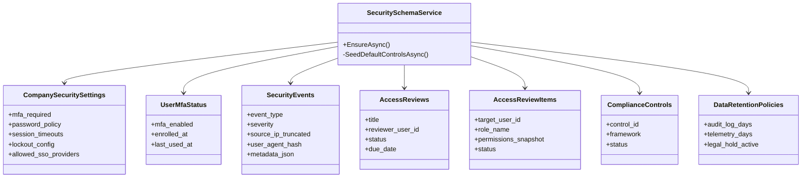
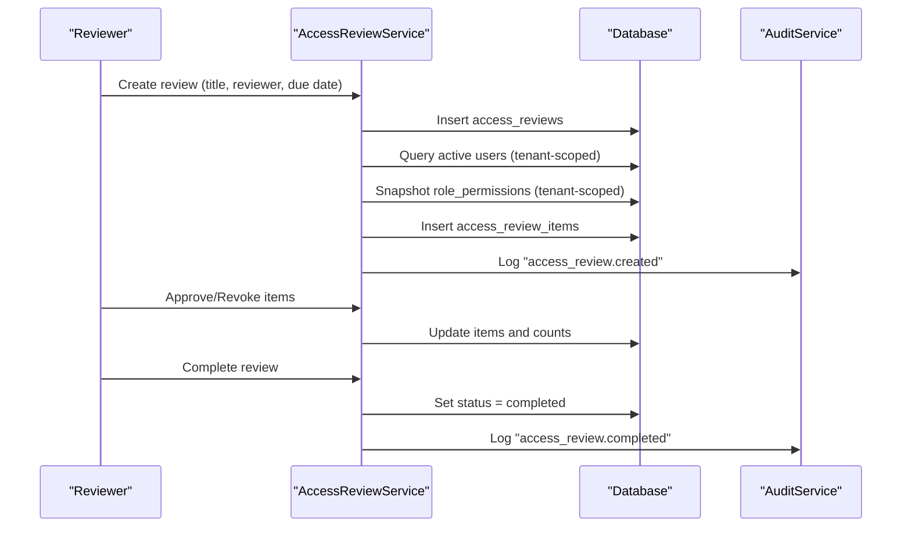
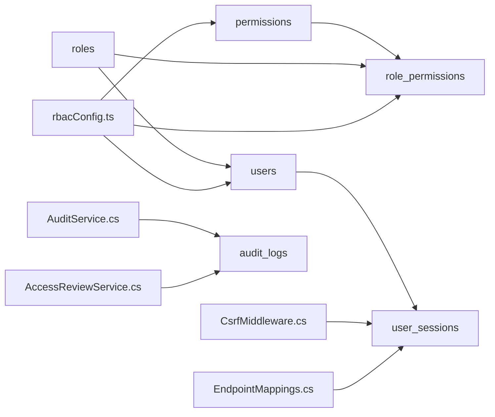

# RBAC & Security Tables

<cite>
**Referenced Files in This Document**
- [001_schema.sql](file://database/init/001_schema.sql)
- [002_seed.sql](file://database/init/002_seed.sql)
- [rbacConfig.ts](file://frontend/src/auth/rbacConfig.ts)
- [accessScope.ts](file://frontend/src/auth/accessScope.ts)
- [demoUsers.ts](file://frontend/src/auth/demoUsers.ts)
- [usePermission.tsx](file://frontend/src/hooks/usePermission.tsx)
- [CsrfMiddleware.cs](file://backend-dotnet/Middleware/CsrfMiddleware.cs)
- [EndpointMappings.cs](file://backend-dotnet/Controllers/EndpointMappings.cs)
- [SecuritySchemaService.cs](file://backend-dotnet/Services/SecuritySchemaService.cs)
- [AuditService.cs](file://backend-dotnet/Services/AuditService.cs)
- [AccessReviewService.cs](file://backend-dotnet/Services/AccessReviewService.cs)
- [LOGIN_RBAC_CSRF.md](file://docs/LOGIN_RBAC_CSRF.md)
</cite>

## Table of Contents
1. [Introduction](#introduction)
2. [Project Structure](#project-structure)
3. [Core Components](#core-components)
4. [Architecture Overview](#architecture-overview)
5. [Detailed Component Analysis](#detailed-component-analysis)
6. [Dependency Analysis](#dependency-analysis)
7. [Performance Considerations](#performance-considerations)
8. [Troubleshooting Guide](#troubleshooting-guide)
9. [Conclusion](#conclusion)

## Introduction
This document explains the Role-Based Access Control (RBAC) and security-related tables that underpin the platform’s authorization and auditing systems. It covers the permission system architecture, role inheritance patterns, fine-grained access control, session and token management, CSRF protection, and enterprise-grade security features such as access reviews, compliance controls, and data retention. It also addresses multi-tenant permission isolation and performance considerations for permission checking at scale.

## Project Structure
The RBAC and security model spans three layers:
- Database schema and seed data define canonical permissions, roles, role-to-permission mappings, and user sessions.
- Frontend RBAC utilities provide permission checks, wildcard support, and tenant-scoped row filtering.
- Backend middleware and services enforce CSRF protection, tenant scoping, audit logging, and advanced security controls.



**Diagram sources**
- [001_schema.sql:653-679](file://database/init/001_schema.sql#L653-L679)
- [rbacConfig.ts:326-364](file://frontend/src/auth/rbacConfig.ts#L326-L364)
- [accessScope.ts:14-30](file://frontend/src/auth/accessScope.ts#L14-L30)
- [usePermission.tsx:12-40](file://frontend/src/hooks/usePermission.tsx#L12-L40)
- [CsrfMiddleware.cs:19-55](file://backend-dotnet/Middleware/CsrfMiddleware.cs#L19-L55)
- [EndpointMappings.cs:136-151](file://backend-dotnet/Controllers/EndpointMappings.cs#L136-L151)
- [SecuritySchemaService.cs:26-51](file://backend-dotnet/Services/SecuritySchemaService.cs#L26-L51)
- [AuditService.cs:9-21](file://backend-dotnet/Services/AuditService.cs#L9-L21)
- [AccessReviewService.cs:23-112](file://backend-dotnet/Services/AccessReviewService.cs#L23-L112)

**Section sources**
- [001_schema.sql:653-679](file://database/init/001_schema.sql#L653-L679)
- [rbacConfig.ts:326-364](file://frontend/src/auth/rbacConfig.ts#L326-L364)
- [accessScope.ts:14-30](file://frontend/src/auth/accessScope.ts#L14-L30)
- [usePermission.tsx:12-40](file://frontend/src/hooks/usePermission.tsx#L12-L40)
- [CsrfMiddleware.cs:19-55](file://backend-dotnet/Middleware/CsrfMiddleware.cs#L19-L55)
- [EndpointMappings.cs:136-151](file://backend-dotnet/Controllers/EndpointMappings.cs#L136-L151)
- [SecuritySchemaService.cs:26-51](file://backend-dotnet/Services/SecuritySchemaService.cs#L26-L51)
- [AuditService.cs:9-21](file://backend-dotnet/Services/AuditService.cs#L9-L21)
- [AccessReviewService.cs:23-112](file://backend-dotnet/Services/AccessReviewService.cs#L23-L112)

## Core Components
- Permissions catalog: Canonical permission keys with labels and module groups.
- Roles and role_permissions: Role-to-permission mapping with support for wildcard “*” granting full access.
- Users and user_sessions: Tenant-scoped user records and session tokens with TTL.
- Frontend RBAC utilities: Permission lookup, wildcard normalization, and tenant-aware row scoping.
- Backend CSRF middleware: Cookie-based CSRF token generation and validation for state-changing requests.
- Audit and access review services: Immutable audit logs and structured access review campaigns.

**Section sources**
- [002_seed.sql:483-511](file://database/init/002_seed.sql#L483-L511)
- [002_seed.sql:512-537](file://database/init/002_seed.sql#L512-L537)
- [001_schema.sql:653-679](file://database/init/001_schema.sql#L653-L679)
- [rbacConfig.ts:372-383](file://frontend/src/auth/rbacConfig.ts#L372-L383)
- [accessScope.ts:14-30](file://frontend/src/auth/accessScope.ts#L14-L30)
- [CsrfMiddleware.cs:19-55](file://backend-dotnet/Middleware/CsrfMiddleware.cs#L19-L55)
- [AuditService.cs:9-21](file://backend-dotnet/Services/AuditService.cs#L9-L21)
- [AccessReviewService.cs:23-112](file://backend-dotnet/Services/AccessReviewService.cs#L23-L112)

## Architecture Overview
The RBAC architecture integrates frontend and backend components to enforce tenant-scoped, fine-grained authorization. Permissions are represented as canonical keys with module grouping. Roles inherit permissions either directly or via wildcard. Sessions carry permissions and tenant context. CSRF middleware protects state-changing operations. Audit logging captures privileged actions. Access reviews enable governance workflows.



**Diagram sources**
- [usePermission.tsx:12-40](file://frontend/src/hooks/usePermission.tsx#L12-L40)
- [rbacConfig.ts:372-383](file://frontend/src/auth/rbacConfig.ts#L372-L383)
- [CsrfMiddleware.cs:19-55](file://backend-dotnet/Middleware/CsrfMiddleware.cs#L19-L55)
- [EndpointMappings.cs:136-151](file://backend-dotnet/Controllers/EndpointMappings.cs#L136-L151)

## Detailed Component Analysis

### Database Schema: Permissions, Roles, Role-Permissions, and Sessions
- permissions: Canonical permission_key entries with module_group for categorization.
- roles: Role definitions with optional JSONB permissions_json for overrides.
- role_permissions: Many-to-many mapping from roles to permission keys.
- users: Tenant-scoped user records with role_id and optional permissions_json overrides.
- user_sessions: Session tokens scoped to user_id and company_id with TTL.

```mermaid
erDiagram
PERMISSIONS {
bigint id PK
varchar permission_key UK
varchar label
varchar module_group
text description
}
ROLES {
bigint id PK
varchar name UK
jsonb permissions_json
}
ROLE_PERMISSIONS {
bigint id PK
bigint role_id FK
varchar permission_key
unique role_id+permission_key
}
USERS {
bigint id PK
bigint company_id
bigint role_id FK
varchar role_name
jsonb permissions_json
}
USER_SESSIONS {
bigint id PK
bigint user_id FK
bigint company_id
varchar session_token UK
timestamptz expires_at
}
PERMISSIONS ||--o{ ROLE_PERMISSIONS : "maps"
ROLES ||--o{ ROLE_PERMISSIONS : "owns"
ROLES ||--o{ USERS : "assigned"
USERS ||--o{ USER_SESSIONS : "has"
```

**Diagram sources**
- [001_schema.sql:653-679](file://database/init/001_schema.sql#L653-L679)

**Section sources**
- [001_schema.sql:653-679](file://database/init/001_schema.sql#L653-L679)
- [002_seed.sql:483-511](file://database/init/002_seed.sql#L483-L511)
- [002_seed.sql:512-537](file://database/init/002_seed.sql#L512-L537)

### Frontend RBAC Utilities
- Permission catalog and role-to-permission mapping are centralized for consistent enforcement across the UI.
- hasPermission supports wildcard matching and punctuation normalization (dots vs colons, hyphens vs underscores).
- useHasPermission wraps permission checks for components and guards.
- scopeRowsForSession filters lists based on driver/customer identities and role semantics.



**Diagram sources**
- [rbacConfig.ts:372-383](file://frontend/src/auth/rbacConfig.ts#L372-L383)

**Section sources**
- [rbacConfig.ts:326-364](file://frontend/src/auth/rbacConfig.ts#L326-L364)
- [rbacConfig.ts:372-383](file://frontend/src/auth/rbacConfig.ts#L372-L383)
- [usePermission.tsx:12-40](file://frontend/src/hooks/usePermission.tsx#L12-L40)
- [accessScope.ts:14-30](file://frontend/src/auth/accessScope.ts#L14-L30)

### Backend CSRF Middleware and Session Management
- CSRF cookie is generated for GET requests and validated for state-changing methods (POST/PUT/DELETE), except login.
- Tokens are Base64-encoded random values and exposed via response header for frontend consumption.
- Sessions are tenant-scoped via company_id and include permissions for downstream checks.



**Diagram sources**
- [CsrfMiddleware.cs:19-55](file://backend-dotnet/Middleware/CsrfMiddleware.cs#L19-L55)
- [EndpointMappings.cs:21-22](file://backend-dotnet/Controllers/EndpointMappings.cs#L21-L22)

**Section sources**
- [CsrfMiddleware.cs:19-55](file://backend-dotnet/Middleware/CsrfMiddleware.cs#L19-L55)
- [EndpointMappings.cs:21-22](file://backend-dotnet/Controllers/EndpointMappings.cs#L21-L22)

### Permission Enforcement in Backend Endpoints
- RequirePermission wrappers enforce tenant-scoped permission checks before invoking handlers.
- Tenant isolation is achieved via GetCompanyId and company_id scoping on all queries.



**Diagram sources**
- [EndpointMappings.cs:136-151](file://backend-dotnet/Controllers/EndpointMappings.cs#L136-L151)

**Section sources**
- [EndpointMappings.cs:136-151](file://backend-dotnet/Controllers/EndpointMappings.cs#L136-L151)

### Security Tables and Policies
- SecuritySchemaService defines enterprise-grade security tables and columns, including company-level security settings, MFA status, security events, SSO connections, access reviews, compliance controls, backup verification, data retention policies, and export requests.
- Users table is augmented with login attempt counters, lockout windows, and password change flags.



**Diagram sources**
- [SecuritySchemaService.cs:26-51](file://backend-dotnet/Services/SecuritySchemaService.cs#L26-L51)
- [SecuritySchemaService.cs:57-68](file://backend-dotnet/Services/SecuritySchemaService.cs#L57-L68)
- [SecuritySchemaService.cs:70-86](file://backend-dotnet/Services/SecuritySchemaService.cs#L70-L86)
- [SecuritySchemaService.cs:130-149](file://backend-dotnet/Services/SecuritySchemaService.cs#L130-L149)
- [SecuritySchemaService.cs:162-179](file://backend-dotnet/Services/SecuritySchemaService.cs#L162-L179)
- [SecuritySchemaService.cs:195-209](file://backend-dotnet/Services/SecuritySchemaService.cs#L195-L209)
- [SecuritySchemaService.cs:276-293](file://backend-dotnet/Services/SecuritySchemaService.cs#L276-L293)
- [SecuritySchemaService.cs:300-318](file://backend-dotnet/Services/SecuritySchemaService.cs#L300-L318)

**Section sources**
- [SecuritySchemaService.cs:26-51](file://backend-dotnet/Services/SecuritySchemaService.cs#L26-L51)
- [SecuritySchemaService.cs:57-68](file://backend-dotnet/Services/SecuritySchemaService.cs#L57-L68)
- [SecuritySchemaService.cs:70-86](file://backend-dotnet/Services/SecuritySchemaService.cs#L70-L86)
- [SecuritySchemaService.cs:130-149](file://backend-dotnet/Services/SecuritySchemaService.cs#L130-L149)
- [SecuritySchemaService.cs:162-179](file://backend-dotnet/Services/SecuritySchemaService.cs#L162-L179)
- [SecuritySchemaService.cs:195-209](file://backend-dotnet/Services/SecuritySchemaService.cs#L195-L209)
- [SecuritySchemaService.cs:276-293](file://backend-dotnet/Services/SecuritySchemaService.cs#L276-L293)
- [SecuritySchemaService.cs:300-318](file://backend-dotnet/Services/SecuritySchemaService.cs#L300-L318)

### Access Review Mechanisms and Compliance Reporting
- AccessReviewService manages lifecycle: create campaign, snapshot user roles and permissions, approve or revoke items, and complete reviews.
- AuditService logs all privileged actions with tenant scoping and actor identification.
- Compliance controls and evidence tables support SOC2 readiness and internal governance.



**Diagram sources**
- [AccessReviewService.cs:23-112](file://backend-dotnet/Services/AccessReviewService.cs#L23-L112)
- [AccessReviewService.cs:151-174](file://backend-dotnet/Services/AccessReviewService.cs#L151-L174)
- [AccessReviewService.cs:176-194](file://backend-dotnet/Services/AccessReviewService.cs#L176-L194)
- [AuditService.cs:23-46](file://backend-dotnet/Services/AuditService.cs#L23-L46)

**Section sources**
- [AccessReviewService.cs:23-112](file://backend-dotnet/Services/AccessReviewService.cs#L23-L112)
- [AccessReviewService.cs:151-174](file://backend-dotnet/Services/AccessReviewService.cs#L151-L174)
- [AccessReviewService.cs:176-194](file://backend-dotnet/Services/AccessReviewService.cs#L176-L194)
- [AuditService.cs:23-46](file://backend-dotnet/Services/AuditService.cs#L23-L46)

### Multi-Tenant Permission Isolation
- All RBAC and security tables include company_id to enforce tenant isolation.
- Frontend scopeRowsForSession filters lists by driver/customer identity for portal roles.
- Backend RequirePermission and data queries consistently scope by company_id.

**Section sources**
- [001_schema.sql:653-679](file://database/init/001_schema.sql#L653-L679)
- [accessScope.ts:14-30](file://frontend/src/auth/accessScope.ts#L14-L30)
- [EndpointMappings.cs:136-151](file://backend-dotnet/Controllers/EndpointMappings.cs#L136-L151)

## Dependency Analysis
The RBAC stack exhibits clear separation of concerns:
- Database tables define canonical permissions and role mappings.
- Frontend utilities depend on the canonical permission catalog and role mappings.
- Backend middleware depends on session context and enforces CSRF and tenant scoping.
- Audit and access review services depend on audit_logs and access_reviews respectively.



**Diagram sources**
- [001_schema.sql:653-679](file://database/init/001_schema.sql#L653-L679)
- [rbacConfig.ts:326-364](file://frontend/src/auth/rbacConfig.ts#L326-L364)
- [CsrfMiddleware.cs:19-55](file://backend-dotnet/Middleware/CsrfMiddleware.cs#L19-L55)
- [EndpointMappings.cs:136-151](file://backend-dotnet/Controllers/EndpointMappings.cs#L136-L151)
- [AuditService.cs:9-21](file://backend-dotnet/Services/AuditService.cs#L9-L21)
- [AccessReviewService.cs:23-112](file://backend-dotnet/Services/AccessReviewService.cs#L23-L112)

**Section sources**
- [001_schema.sql:653-679](file://database/init/001_schema.sql#L653-L679)
- [rbacConfig.ts:326-364](file://frontend/src/auth/rbacConfig.ts#L326-L364)
- [CsrfMiddleware.cs:19-55](file://backend-dotnet/Middleware/CsrfMiddleware.cs#L19-L55)
- [EndpointMappings.cs:136-151](file://backend-dotnet/Controllers/EndpointMappings.cs#L136-L151)
- [AuditService.cs:9-21](file://backend-dotnet/Services/AuditService.cs#L9-L21)
- [AccessReviewService.cs:23-112](file://backend-dotnet/Services/AccessReviewService.cs#L23-L112)

## Performance Considerations
- Permission checks are O(1) array includes and Set lookups with pre-normalized variants.
- Token validation is O(1) string comparison.
- Wildcard matching and punctuation normalization are precomputed for efficiency.
- Indexes on user_sessions (token, user_id) and audit_logs (tenant, time) optimize lookups.
- Tenant scoping via company_id ensures targeted queries and prevents cross-tenant scans.

[No sources needed since this section provides general guidance]

## Troubleshooting Guide
- CSRF token mismatch (403): Ensure X-CSRF-Token header matches cookie and credentials are sent with requests.
- Permission denied redirects: Verify role-to-permission mapping and wildcard patterns; confirm permission string normalization.
- Session expired: Re-login to obtain a new session; backend enforces TTL and rotation on re-authentication.
- Access review not found: Confirm company_id scoping and review status.

**Section sources**
- [LOGIN_RBAC_CSRF.md:215-235](file://docs/LOGIN_RBAC_CSRF.md#L215-L235)
- [CsrfMiddleware.cs:36-49](file://backend-dotnet/Middleware/CsrfMiddleware.cs#L36-L49)
- [EndpointMappings.cs:136-151](file://backend-dotnet/Controllers/EndpointMappings.cs#L136-L151)
- [AccessReviewService.cs:182-188](file://backend-dotnet/Services/AccessReviewService.cs#L182-L188)

## Conclusion
The RBAC and security model combines canonical permissions, role mappings, and tenant-scoped sessions with robust CSRF protection and comprehensive audit logging. Frontend utilities provide efficient permission checks and row-level scoping, while backend services enforce tenant isolation and support advanced governance workflows such as access reviews and compliance controls. Together, these components deliver fine-grained authorization, strong security posture, and scalable permission evaluation.