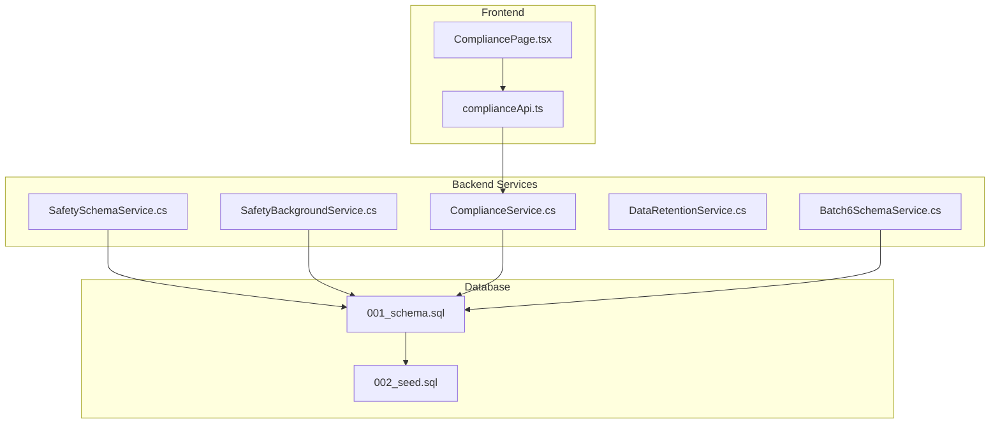
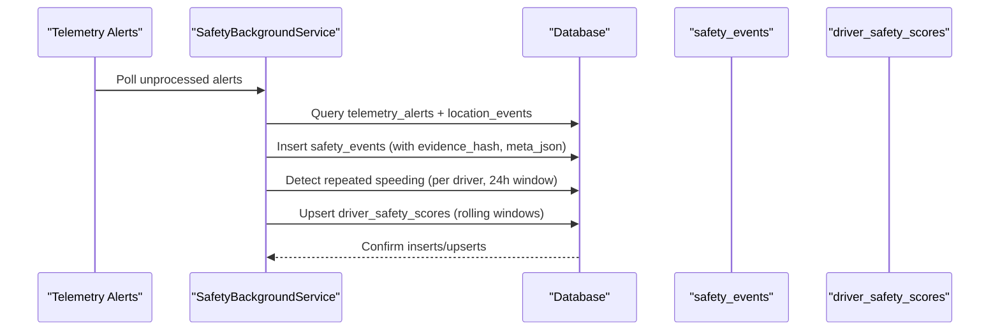
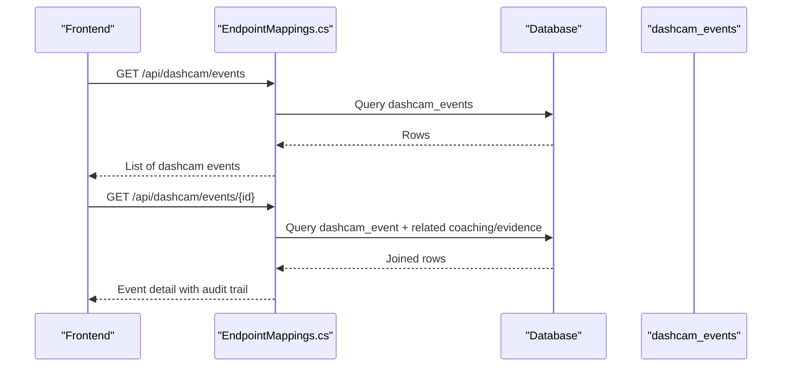
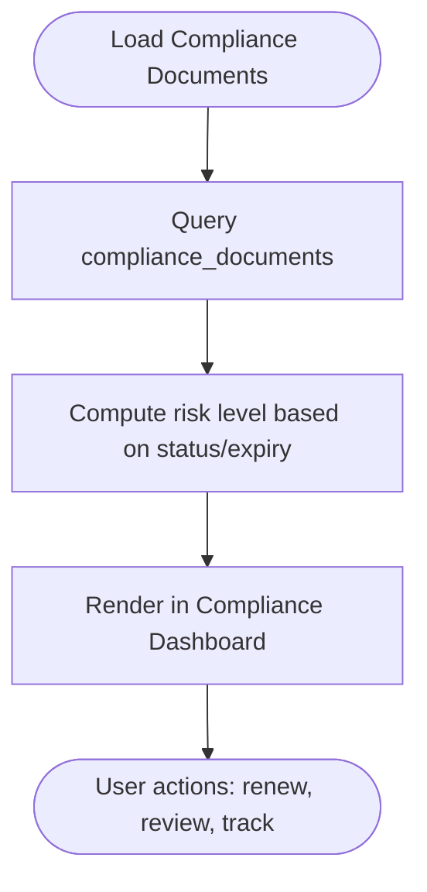
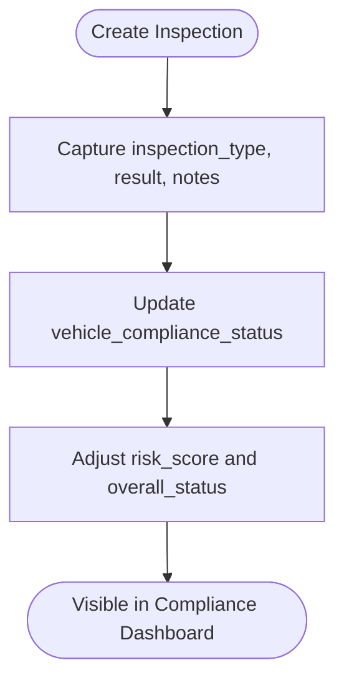
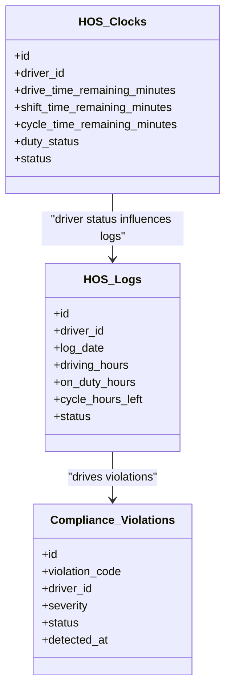
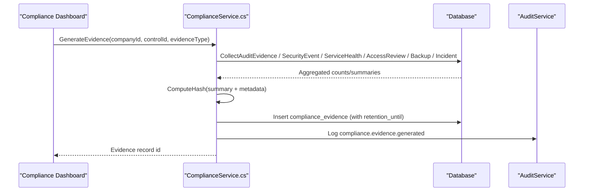
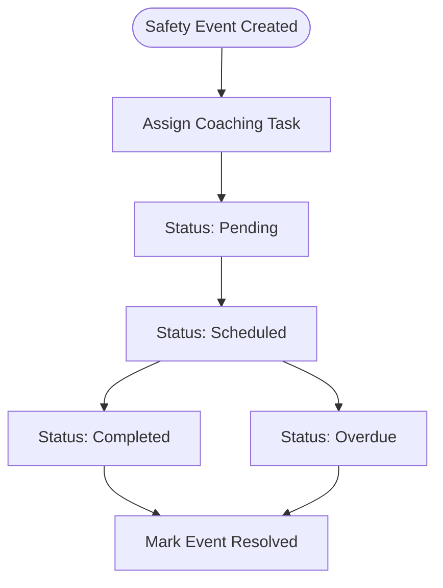
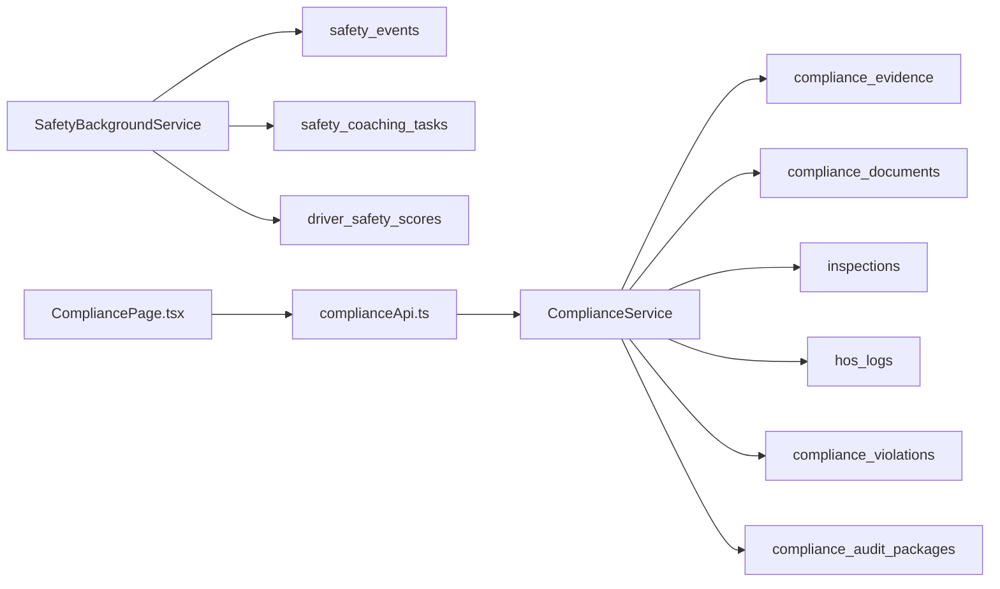

# Safety & Compliance Tables

<cite>
**Referenced Files in This Document**
- [SafetySchemaService.cs](file://backend-dotnet/Services/SafetySchemaService.cs)
- [SafetyBackgroundService.cs](file://backend-dotnet/Services/SafetyBackgroundService.cs)
- [ComplianceService.cs](file://backend-dotnet/Services/ComplianceService.cs)
- [EndpointMappings.cs](file://backend-dotnet/Controllers/EndpointMappings.cs)
- [001_schema.sql](file://database/init/001_schema.sql)
- [002_seed.sql](file://database/init/002_seed.sql)
- [DataRetentionService.cs](file://backend-dotnet/Services/DataRetentionService.cs)
- [Batch6SchemaService.cs](file://backend-dotnet/Services/Batch6SchemaService.cs)
- [SafetyTests.cs](file://backend-dotnet.Tests/SafetyTests.cs)
- [CompliancePage.tsx](file://frontend/src/pages/CompliancePage.tsx)
- [complianceApi.ts](file://frontend/src/services/complianceApi.ts)
</cite>

## Table of Contents
1. [Introduction](#introduction)
2. [Project Structure](#project-structure)
3. [Core Components](#core-components)
4. [Architecture Overview](#architecture-overview)
5. [Detailed Component Analysis](#detailed-component-analysis)
6. [Dependency Analysis](#dependency-analysis)
7. [Performance Considerations](#performance-considerations)
8. [Troubleshooting Guide](#troubleshooting-guide)
9. [Conclusion](#conclusion)
10. [Appendices](#appendices)

## Introduction
This document explains the safety and compliance data tables and workflows that underpin the safety event tracking system, driver coaching workflows, and regulatory compliance management. It covers:
- Safety event tracking and dashcam evidence linkage
- Driver coaching lifecycle and scoring
- Document expiration tracking and inspection scheduling
- Hours of Service (HOS) monitoring and ELD integration
- Compliance scoring mechanisms and regulatory reporting
- Data retention policies and audit trail requirements

## Project Structure
The safety and compliance domain spans backend services, database schemas, and frontend UI components:
- Backend services define schema creation, background processing, and compliance evidence generation
- Database initialization scripts define the canonical table structures
- Frontend pages and APIs surface compliance dashboards and HOS monitoring



**Diagram sources**
- [SafetySchemaService.cs:5-131](file://backend-dotnet/Services/SafetySchemaService.cs#L5-L131)
- [SafetyBackgroundService.cs:13-295](file://backend-dotnet/Services/SafetyBackgroundService.cs#L13-L295)
- [ComplianceService.cs:26-241](file://backend-dotnet/Services/ComplianceService.cs#L26-L241)
- [Batch6SchemaService.cs:142-200](file://backend-dotnet/Services/Batch6SchemaService.cs#L142-L200)
- [001_schema.sql:383-436](file://database/init/001_schema.sql#L383-L436)
- [002_seed.sql:226-263](file://database/init/002_seed.sql#L226-L263)
- [CompliancePage.tsx:78-502](file://frontend/src/pages/CompliancePage.tsx#L78-L502)
- [complianceApi.ts:33-108](file://frontend/src/services/complianceApi.ts#L33-L108)

**Section sources**
- [SafetySchemaService.cs:5-131](file://backend-dotnet/Services/SafetySchemaService.cs#L5-L131)
- [SafetyBackgroundService.cs:13-295](file://backend-dotnet/Services/SafetyBackgroundService.cs#L13-L295)
- [ComplianceService.cs:26-241](file://backend-dotnet/Services/ComplianceService.cs#L26-L241)
- [Batch6SchemaService.cs:142-200](file://backend-dotnet/Services/Batch6SchemaService.cs#L142-L200)
- [001_schema.sql:383-436](file://database/init/001_schema.sql#L383-L436)
- [002_seed.sql:226-263](file://database/init/002_seed.sql#L226-L263)
- [CompliancePage.tsx:78-502](file://frontend/src/pages/CompliancePage.tsx#L78-L502)
- [complianceApi.ts:33-108](file://frontend/src/services/complianceApi.ts#L33-L108)

## Core Components
- Safety events: automated ingestion from telemetry alerts, repeated-speeding detection, and scoring recomputation
- Dashcam events: AI-driven incident review linked to safety events
- Compliance documents: expiration tracking and status computation
- Inspections: scheduled and post-trip DVIR workflows
- HOS logs: driver on-duty cycles, ELD integration, and violation detection
- Compliance scoring and reporting: evidence generation and audit packages

**Section sources**
- [SafetySchemaService.cs:14-131](file://backend-dotnet/Services/SafetySchemaService.cs#L14-L131)
- [SafetyBackgroundService.cs:63-295](file://backend-dotnet/Services/SafetyBackgroundService.cs#L63-L295)
- [EndpointMappings.cs:4254-4261](file://backend-dotnet/Controllers/EndpointMappings.cs#L4254-L4261)
- [001_schema.sql:1282-1365](file://database/init/001_schema.sql#L1282-L1365)
- [002_seed.sql:242-263](file://database/init/002_seed.sql#L242-L263)

## Architecture Overview
The safety and compliance system integrates telemetry, dashcam, and compliance domains with background services and frontend dashboards.

```mermaid
graph TB
subgraph "Telemetry & Safety"
TA["Telemetry Alerts"]
SBS["SafetyBackgroundService"]
SE["safety_events"]
SCT["safety_coaching_tasks"]
DSS["driver_safety_scores"]
end
subgraph "Dashcam"
DE["dashcam_events"]
end
subgraph "Compliance"
CD["compliance_documents"]
INS["inspections"]
HOS["hos_logs"]
HOSC["hos_clocks"]
CV["compliance_violations"]
CAP["compliance_audit_packages"]
end
subgraph "Compliance Evidence"
CS["ComplianceService"]
end
TA --> SBS --> SE
SE --> SCT
SBS --> DSS
SE <- --> DE
CD --> CS
INS --> CS
HOS --> CS
HOSC --> CS
CV --> CS
CAP --> CS
```

**Diagram sources**
- [SafetyBackgroundService.cs:63-203](file://backend-dotnet/Services/SafetyBackgroundService.cs#L63-L203)
- [SafetySchemaService.cs:14-79](file://backend-dotnet/Services/SafetySchemaService.cs#L14-L79)
- [EndpointMappings.cs:4254-4261](file://backend-dotnet/Controllers/EndpointMappings.cs#L4254-L4261)
- [001_schema.sql:383-436](file://database/init/001_schema.sql#L383-L436)
- [001_schema.sql:1282-1365](file://database/init/001_schema.sql#L1282-L1365)
- [ComplianceService.cs:80-131](file://backend-dotnet/Services/ComplianceService.cs#L80-L131)

## Detailed Component Analysis

### Safety Events and Scoring
- Automated ingestion: New telemetry alerts are transformed into safety events with evidence hashing and metadata
- Repeated speeding detection: Patterns within 24 hours generate a higher-severity event
- Driver scoring: Recalculation of rolling 7/30/90-day scores with breakdown JSON



**Diagram sources**
- [SafetyBackgroundService.cs:69-145](file://backend-dotnet/Services/SafetyBackgroundService.cs#L69-L145)
- [SafetyBackgroundService.cs:149-203](file://backend-dotnet/Services/SafetyBackgroundService.cs#L149-L203)
- [SafetyBackgroundService.cs:206-253](file://backend-dotnet/Services/SafetyBackgroundService.cs#L206-L253)

**Section sources**
- [SafetyBackgroundService.cs:63-295](file://backend-dotnet/Services/SafetyBackgroundService.cs#L63-L295)
- [SafetySchemaService.cs:14-79](file://backend-dotnet/Services/SafetySchemaService.cs#L14-L79)
- [SafetyTests.cs:10-117](file://backend-dotnet.Tests/SafetyTests.cs#L10-L117)

### Dashcam Events and Safety Linkage
- Dashcam events are linked to safety events and support AI summaries and coaching outcomes
- Dashcam endpoints expose lists, details, and related coaching tasks/evidence packages



**Diagram sources**
- [EndpointMappings.cs:3715-3724](file://backend-dotnet/Controllers/EndpointMappings.cs#L3715-L3724)

**Section sources**
- [EndpointMappings.cs:3710-3724](file://backend-dotnet/Controllers/EndpointMappings.cs#L3710-L3724)
- [001_schema.sql:395-403](file://database/init/001_schema.sql#L395-L403)

### Compliance Documents and Expiration Tracking
- Documents track related entity type/id, type/name, expiry date, and status
- Expiration risk is computed client-side and surfaced in dashboards



**Diagram sources**
- [EndpointMappings.cs:4254-4261](file://backend-dotnet/Controllers/EndpointMappings.cs#L4254-L4261)
- [001_schema.sql:405-414](file://database/init/001_schema.sql#L405-L414)

**Section sources**
- [EndpointMappings.cs:4254-4261](file://backend-dotnet/Controllers/EndpointMappings.cs#L4254-L4261)
- [001_schema.sql:405-414](file://database/init/001_schema.sql#L405-L414)
- [002_seed.sql:242-249](file://database/init/002_seed.sql#L242-L249)

### Inspections and DVIR Workflows
- Post-trip and pre-trip inspection records capture type, result, and notes
- Used to compute vehicle compliance status and inform risk scoring



**Diagram sources**
- [001_schema.sql:416-425](file://database/init/001_schema.sql#L416-L425)
- [001_schema.sql:1296-1308](file://database/init/001_schema.sql#L1296-L1308)
- [002_seed.sql:251-257](file://database/init/002_seed.sql#L251-L257)

**Section sources**
- [001_schema.sql:416-425](file://database/init/001_schema.sql#L416-L425)
- [001_schema.sql:1296-1308](file://database/init/001_schema.sql#L1296-L1308)
- [002_seed.sql:251-257](file://database/init/002_seed.sql#L251-L257)

### Hours of Service (HOS) Monitoring
- HOS logs track daily driving/on-duty cycles and remaining cycle hours
- Clocks reflect driver status and duty state
- Violations are categorized and surfaced for escalation



**Diagram sources**
- [001_schema.sql:1310-1322](file://database/init/001_schema.sql#L1310-L1322)
- [001_schema.sql:1337-1351](file://database/init/001_schema.sql#L1337-L1351)
- [Batch6SchemaService.cs:191-200](file://backend-dotnet/Services/Batch6SchemaService.cs#L191-L200)

**Section sources**
- [001_schema.sql:1310-1322](file://database/init/001_schema.sql#L1310-L1322)
- [001_schema.sql:1337-1351](file://database/init/001_schema.sql#L1337-L1351)
- [Batch6SchemaService.cs:191-200](file://backend-dotnet/Services/Batch6SchemaService.cs#L191-L200)
- [EndpointMappings.cs:5762-5767](file://backend-dotnet/Controllers/EndpointMappings.cs#L5762-L5767)

### Compliance Scoring and Regulatory Reporting
- ComplianceService generates evidence for SOC2-readiness controls using real system data
- Evidence includes audit logs, security events, service health, access reviews, backups, and incidents
- Evidence is hashed and stored with retention metadata



**Diagram sources**
- [ComplianceService.cs:80-131](file://backend-dotnet/Services/ComplianceService.cs#L80-L131)
- [ComplianceService.cs:135-232](file://backend-dotnet/Services/ComplianceService.cs#L135-L232)

**Section sources**
- [ComplianceService.cs:26-241](file://backend-dotnet/Services/ComplianceService.cs#L26-L241)

### Driver Coaching Workflows
- Safety events spawn coaching tasks with lifecycle statuses
- Tasks are assigned, tracked, and outcomes recorded
- Coaching is triggered by repeated speeding and low safety scores



**Diagram sources**
- [SafetySchemaService.cs:43-61](file://backend-dotnet/Services/SafetySchemaService.cs#L43-L61)
- [SafetyBackgroundService.cs:149-203](file://backend-dotnet/Services/SafetyBackgroundService.cs#L149-L203)

**Section sources**
- [SafetySchemaService.cs:43-61](file://backend-dotnet/Services/SafetySchemaService.cs#L43-L61)
- [SafetyTests.cs:199-258](file://backend-dotnet.Tests/SafetyTests.cs#L199-L258)

## Dependency Analysis
- SafetyBackgroundService depends on telemetry_rules for score weights and writes to safety_events, safety_coaching_tasks, and driver_safety_scores
- ComplianceService depends on multiple system tables to build evidence
- Frontend dashboards depend on backend endpoints for compliance summaries and HOS metrics



**Diagram sources**
- [SafetyBackgroundService.cs:63-253](file://backend-dotnet/Services/SafetyBackgroundService.cs#L63-L253)
- [ComplianceService.cs:80-131](file://backend-dotnet/Services/ComplianceService.cs#L80-L131)
- [CompliancePage.tsx:78-502](file://frontend/src/pages/CompliancePage.tsx#L78-L502)
- [complianceApi.ts:33-108](file://frontend/src/services/complianceApi.ts#L33-L108)

**Section sources**
- [SafetyBackgroundService.cs:63-253](file://backend-dotnet/Services/SafetyBackgroundService.cs#L63-L253)
- [ComplianceService.cs:80-131](file://backend-dotnet/Services/ComplianceService.cs#L80-L131)
- [CompliancePage.tsx:78-502](file://frontend/src/pages/CompliancePage.tsx#L78-L502)
- [complianceApi.ts:33-108](file://frontend/src/services/complianceApi.ts#L33-L108)

## Performance Considerations
- Background processing runs at fixed intervals to avoid contention; ensure indexes are maintained for high-cardinality queries
- Scoring recomputation is windowed to reduce CPU load
- Evidence generation uses minimal hashing and avoids storing raw PII

## Troubleshooting Guide
- Safety event duplicates: UNIQUE KEY on source_telemetry_alert_id prevents double-processing
- Repeated speeding thresholds: configurable per tenant via telemetry_rules
- Legal hold overrides retention: DataRetentionService preserves data when legal_hold_active is true
- Audit trail: ComplianceService logs all evidence generation actions

**Section sources**
- [SafetyBackgroundService.cs:140-144](file://backend-dotnet/Services/SafetyBackgroundService.cs#L140-L144)
- [SafetyTests.cs:299-337](file://backend-dotnet.Tests/SafetyTests.cs#L299-L337)
- [DataRetentionService.cs:16-131](file://backend-dotnet/Services/DataRetentionService.cs#L16-L131)
- [ComplianceService.cs:127-128](file://backend-dotnet/Services/ComplianceService.cs#L127-L128)

## Conclusion
The safety and compliance system provides automated safety event tracking, dashcam-linked incident review, driver coaching workflows, and robust compliance reporting. Tenant-scoped scoring, evidence-based compliance controls, and HOS monitoring enable scalable, auditable operations across multi-country jurisdictions.

## Appendices

### Data Models Overview

```mermaid
erDiagram
safety_events {
bigint id PK
bigint company_id
bigint driver_id
bigint vehicle_id
bigint device_id
bigint source_telemetry_alert_id
varchar event_type
varchar severity
decimal score_impact
varchar status
timestamptz event_time
text notes
varchar evidence_hash
}
safety_coaching_tasks {
bigint id PK
bigint company_id
bigint safety_event_id
bigint driver_id
bigint assigned_to
bigint assigned_by
date due_date
varchar status
varchar coaching_type
text notes
text outcome
timestamptz driver_acknowledged_at
timestamptz completed_at
}
driver_safety_scores {
bigint id PK
bigint company_id
bigint driver_id
decimal score_7d
decimal score_30d
decimal score_90d
int events_7d
int events_30d
int events_90d
jsonb breakdown_json
timestamptz computed_at
}
dashcam_events {
bigint id PK
bigint company_id
bigint safety_event_id
varchar title
varchar severity
varchar coaching_status
timestamptz event_time
}
compliance_documents {
bigint id PK
bigint company_id
varchar related_entity_type
bigint related_entity_id
varchar document_type
varchar document_name
date expiry_date
varchar status
}
inspections {
bigint id PK
bigint company_id
bigint vehicle_id
bigint driver_id
varchar inspection_type
varchar result
text notes
}
hos_logs {
bigint id PK
bigint driver_id
bigint vehicle_id
date log_date
varchar country_code
bigint profile_id
varchar status
timestamptz start_time
timestamptz end_time
}
compliance_violations {
bigint id PK
varchar violation_code
bigint rule_id
bigint profile_id
varchar country_code
bigint driver_id
bigint vehicle_id
varchar severity
text description
varchar status
timestamptz detected_at
timestamptz resolved_at
}
compliance_evidence {
bigint id PK
varchar control_id
varchar evidence_type
varchar source_system
varchar source_entity
bigint source_record_id
varchar title
text safe_summary
timestamptz generated_at
varchar evidence_hash
date retention_until
varchar generated_by
}
```


**Diagram sources**
- [001_schema.sql:383-436](file://database/init/001_schema.sql#L383-L436)
- [001_schema.sql:1337-1365](file://database/init/001_schema.sql#L1337-L1365)
- [001_schema.sql:405-414](file://database/init/001_schema.sql#L405-L414)
- [001_schema.sql:416-425](file://database/init/001_schema.sql#L416-L425)
- [001_schema.sql:1310-1322](file://database/init/001_schema.sql#L1310-L1322)