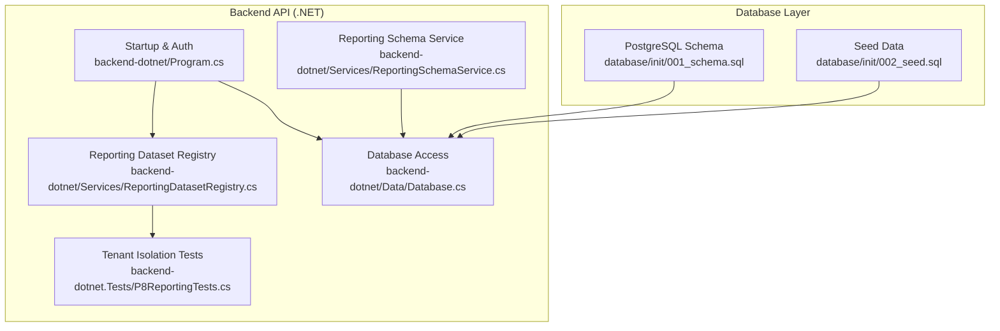
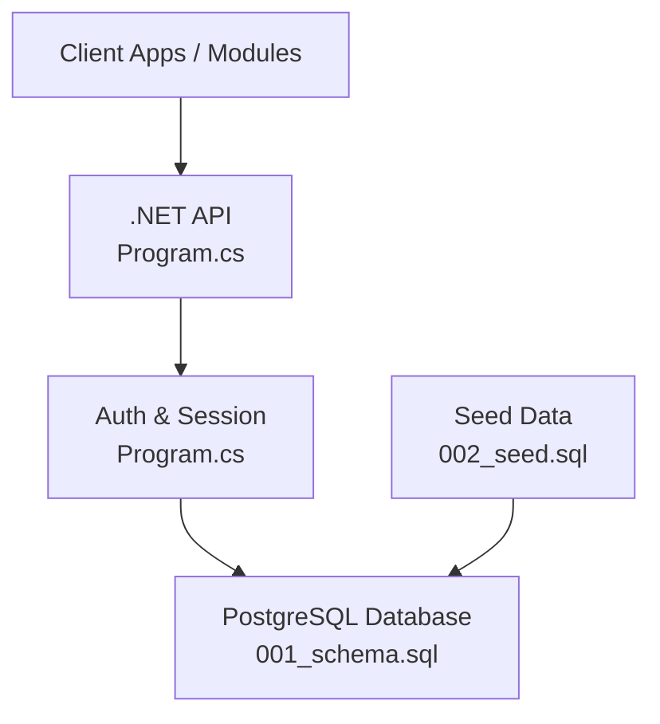
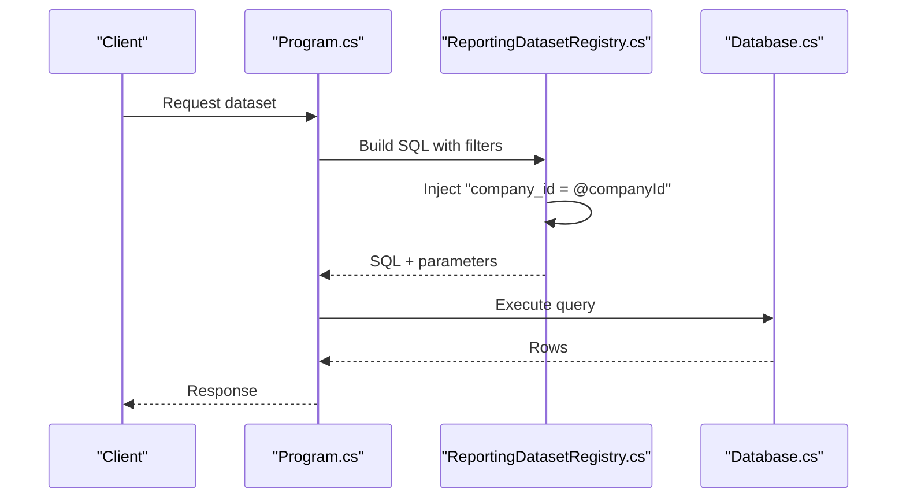
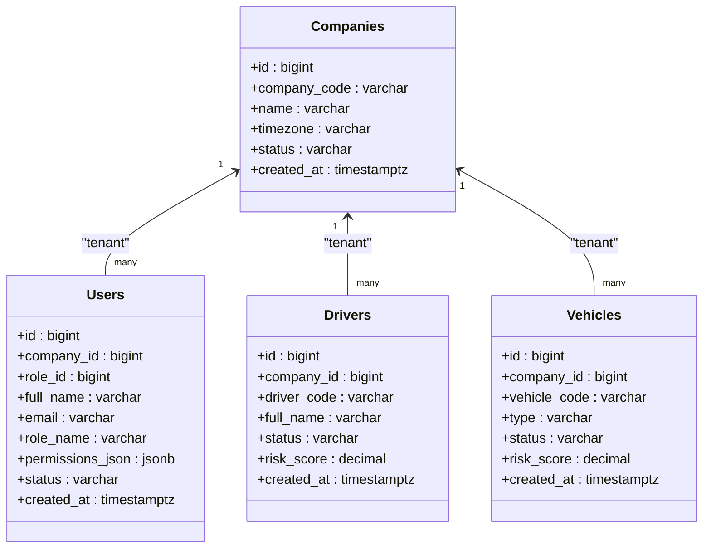
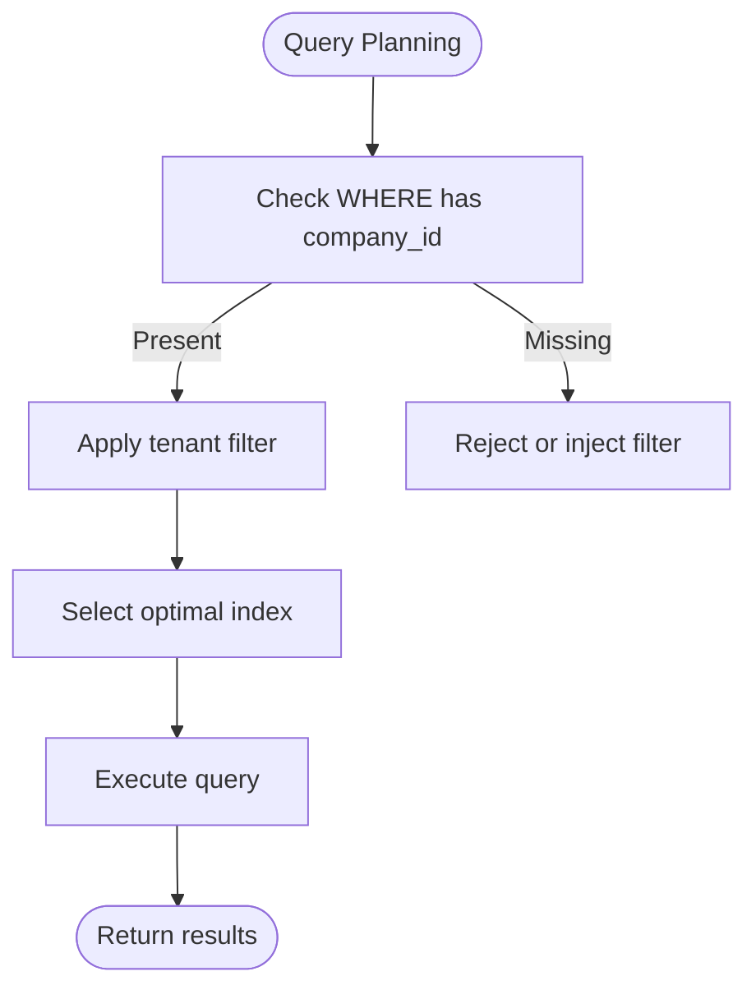
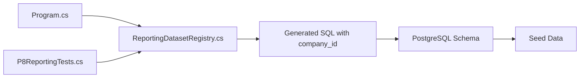

# Schema Overview

<cite>
**Referenced Files in This Document**
- [001_schema.sql](file://database/init/001_schema.sql)
- [002_seed.sql](file://database/init/002_seed.sql)
- [Database.cs](file://backend-dotnet/Data/Database.cs)
- [Program.cs](file://backend-dotnet/Program.cs)
- [ReportingDatasetRegistry.cs](file://backend-dotnet/Services/ReportingDatasetRegistry.cs)
- [P8ReportingTests.cs](file://backend-dotnet.Tests/P8ReportingTests.cs)
- [ReportingSchemaService.cs](file://backend-dotnet/Services/ReportingSchemaService.cs)
- [ARCHITECTURE.md](file://docs/ARCHITECTURE.md)
</cite>

## Table of Contents
1. [Introduction](#introduction)
2. [Project Structure](#project-structure)
3. [Core Components](#core-components)
4. [Architecture Overview](#architecture-overview)
5. [Detailed Component Analysis](#detailed-component-analysis)
6. [Dependency Analysis](#dependency-analysis)
7. [Performance Considerations](#performance-considerations)
8. [Troubleshooting Guide](#troubleshooting-guide)
9. [Conclusion](#conclusion)

## Introduction
This document provides a comprehensive schema overview for the OpsTrax database design. It explains the multi-tenant architecture centered on company_id as the isolation mechanism, the normalized table structure, primary and foreign key conventions, and the migration from MySQL to PostgreSQL with timestamptz, JSONB fields, and identity columns. It also covers indexing strategies optimized for common access patterns, the separation of core entities versus tenant-specific data, and the implications for data isolation and querying.

## Project Structure
The database schema and seed data are defined under the database initialization scripts. The backend .NET API implements tenant-aware data access and enforces company_id scoping for all queries.

**Diagram sources**
- [001_schema.sql:1-1525](file://database/init/001_schema.sql#L1-L1525)
- [002_seed.sql:1-537](file://database/init/002_seed.sql#L1-L537)
- [Database.cs:1-86](file://backend-dotnet/Data/Database.cs#L1-L86)
- [Program.cs:1-452](file://backend-dotnet/Program.cs#L1-L452)
- [ReportingDatasetRegistry.cs:669-701](file://backend-dotnet/Services/ReportingDatasetRegistry.cs#L669-L701)
- [P8ReportingTests.cs:567-596](file://backend-dotnet.Tests/P8ReportingTests.cs#L567-L596)
- [ReportingSchemaService.cs:1-116](file://backend-dotnet/Services/ReportingSchemaService.cs#L1-L116)

**Section sources**
- [001_schema.sql:1-1525](file://database/init/001_schema.sql#L1-L1525)
- [002_seed.sql:1-537](file://database/init/002_seed.sql#L1-L537)
- [Database.cs:1-86](file://backend-dotnet/Data/Database.cs#L1-L86)
- [Program.cs:1-452](file://backend-dotnet/Program.cs#L1-L452)
- [ReportingDatasetRegistry.cs:669-701](file://backend-dotnet/Services/ReportingDatasetRegistry.cs#L669-L701)
- [P8ReportingTests.cs:567-596](file://backend-dotnet.Tests/P8ReportingTests.cs#L567-L596)
- [ReportingSchemaService.cs:1-116](file://backend-dotnet/Services/ReportingSchemaService.cs#L1-L116)
- [ARCHITECTURE.md:1-69](file://docs/ARCHITECTURE.md#L1-L69)

## Core Components
- Multi-tenant isolation: All tenant-specific tables include company_id as a mandatory filter in queries and views.
- Identity columns: Tables use GENERATED ALWAYS AS IDENTITY for primary keys.
- Timestamps: All temporal fields use TIMESTAMPTZ for timezone-aware persistence.
- JSONB: Structured metadata and configuration are stored as JSONB for flexible schema evolution.
- Indexing: Strategic indexes optimize frequent access patterns (tenant-scoped lookups, status filters, time-series queries).
- Normalization: Core entities (companies, users, roles) separate from operational records (vehicles, drivers, jobs, safety, maintenance).

**Section sources**
- [001_schema.sql:4-12](file://database/init/001_schema.sql#L4-L12)
- [001_schema.sql:20-34](file://database/init/001_schema.sql#L20-L34)
- [001_schema.sql:627-680](file://database/init/001_schema.sql#L627-L680)
- [002_seed.sql:20-60](file://database/init/002_seed.sql#L20-L60)
- [ReportingDatasetRegistry.cs:675-679](file://backend-dotnet/Services/ReportingDatasetRegistry.cs#L675-L679)
- [P8ReportingTests.cs:580-591](file://backend-dotnet.Tests/P8ReportingTests.cs#L580-L591)

## Architecture Overview
The system uses a PostgreSQL schema with company_id as the tenant discriminator. The .NET API enforces tenant scoping at query time and persists structured data using JSONB. The architecture supports future extensions for compliance, safety, maintenance, and AI-driven insights.

**Diagram sources**
- [Program.cs:101-244](file://backend-dotnet/Program.cs#L101-L244)
- [001_schema.sql:1-1525](file://database/init/001_schema.sql#L1-L1525)
- [002_seed.sql:1-537](file://database/init/002_seed.sql#L1-L537)

**Section sources**
- [ARCHITECTURE.md:1-69](file://docs/ARCHITECTURE.md#L1-L69)
- [Program.cs:101-244](file://backend-dotnet/Program.cs#L101-L244)
- [001_schema.sql:1-1525](file://database/init/001_schema.sql#L1-L1525)

## Detailed Component Analysis

### Multi-Tenant Design and company_id Isolation
- All tenant-specific tables include company_id as a mandatory filter in generated SQL and reporting datasets.
- The reporting dataset registry injects company_id into WHERE clauses and validates that user-provided filters cannot override the tenant filter.
- Backend tests assert that generated SQL always contains company_id for critical datasets.

**Diagram sources**
- [ReportingDatasetRegistry.cs:675-679](file://backend-dotnet/Services/ReportingDatasetRegistry.cs#L675-L679)
- [P8ReportingTests.cs:580-591](file://backend-dotnet.Tests/P8ReportingTests.cs#L580-L591)
- [Database.cs:17-34](file://backend-dotnet/Data/Database.cs#L17-L34)

**Section sources**
- [ReportingDatasetRegistry.cs:669-701](file://backend-dotnet/Services/ReportingDatasetRegistry.cs#L669-L701)
- [P8ReportingTests.cs:567-596](file://backend-dotnet.Tests/P8ReportingTests.cs#L567-L596)
- [Database.cs:17-34](file://backend-dotnet/Data/Database.cs#L17-L34)

### Core Entities vs. Tenant-Specific Data
- Core entities: companies, roles, permissions, users, user_sessions.
- Tenant-specific operational data: drivers, vehicles, customers, assets, jobs, routes, trips, location_events, safety, maintenance, compliance, finance, reporting, and more.

**Diagram sources**
- [001_schema.sql:4-12](file://database/init/001_schema.sql#L4-L12)
- [001_schema.sql:20-34](file://database/init/001_schema.sql#L20-L34)
- [001_schema.sql:36-55](file://database/init/001_schema.sql#L36-L55)
- [001_schema.sql:57-79](file://database/init/001_schema.sql#L57-L79)

**Section sources**
- [001_schema.sql:4-12](file://database/init/001_schema.sql#L4-L12)
- [001_schema.sql:20-34](file://database/init/001_schema.sql#L20-L34)
- [001_schema.sql:36-55](file://database/init/001_schema.sql#L36-L55)
- [001_schema.sql:57-79](file://database/init/001_schema.sql#L57-L79)

### Indexing Strategy and Performance Optimization
- Tenant-scoped indexes: e.g., vehicles(company_id, status, risk_score), drivers(company_id, status, risk_score), customers(company_id, status, risk_score).
- Time-series lookups: location_events(company_id, event_time), audit_logs(company_id, created_at DESC).
- Common join and lookup indexes: ix_vehicles_assigned_driver, ix_drivers_assigned_vehicle, ix_jobs_assigned_vehicle, ix_jobs_assigned_driver.
- JSONB and composite indexes for reporting and audit trails.

**Diagram sources**
- [001_schema.sql:627-680](file://database/init/001_schema.sql#L627-L680)
- [001_schema.sql:327-327](file://database/init/001_schema.sql#L327-L327)
- [001_schema.sql:530-531](file://database/init/001_schema.sql#L530-L531)
- [ReportingDatasetRegistry.cs:675-679](file://backend-dotnet/Services/ReportingDatasetRegistry.cs#L675-L679)

**Section sources**
- [001_schema.sql:627-680](file://database/init/001_schema.sql#L627-L680)
- [001_schema.sql:327-327](file://database/init/001_schema.sql#L327-L327)
- [001_schema.sql:530-531](file://database/init/001_schema.sql#L530-L531)
- [ReportingDatasetRegistry.cs:669-701](file://backend-dotnet/Services/ReportingDatasetRegistry.cs#L669-L701)

### Migration from MySQL to PostgreSQL
- Identity columns: AUTO_INCREMENT → GENERATED ALWAYS AS IDENTITY.
- Timestamps: DATETIME/TIMESTAMP → TIMESTAMPTZ.
- JSON: JSON → JSONB for advanced querying and indexing.
- Sequences and idempotent re-seeding: TRUNCATE ... RESTART IDENTITY CASCADE; setval(...) to preserve continuity.

**Section sources**
- [001_schema.sql:1-3](file://database/init/001_schema.sql#L1-L3)
- [002_seed.sql:5-18](file://database/init/002_seed.sql#L5-L18)

### Reporting and Audit Trail Extensions
- Reporting schema service adds saved_reports, report_execution_log, and scheduled_report_deliveries with JSONB and tenant scoping.
- Indexes on saved_reports and report_execution_log improve query performance for visibility and audit.

**Section sources**
- [ReportingSchemaService.cs:46-114](file://backend-dotnet/Services/ReportingSchemaService.cs#L46-L114)

## Dependency Analysis
The backend API depends on the PostgreSQL schema for data integrity and uses JSONB for flexible reporting and compliance metadata. Tenant isolation is enforced by injecting company_id into all generated SQL and validated by tests.

**Diagram sources**
- [Program.cs:101-244](file://backend-dotnet/Program.cs#L101-L244)
- [ReportingDatasetRegistry.cs:669-701](file://backend-dotnet/Services/ReportingDatasetRegistry.cs#L669-L701)
- [P8ReportingTests.cs:567-596](file://backend-dotnet.Tests/P8ReportingTests.cs#L567-L596)
- [001_schema.sql:1-1525](file://database/init/001_schema.sql#L1-L1525)

**Section sources**
- [Program.cs:101-244](file://backend-dotnet/Program.cs#L101-L244)
- [ReportingDatasetRegistry.cs:669-701](file://backend-dotnet/Services/ReportingDatasetRegistry.cs#L669-L701)
- [P8ReportingTests.cs:567-596](file://backend-dotnet.Tests/P8ReportingTests.cs#L567-L596)
- [001_schema.sql:1-1525](file://database/init/001_schema.sql#L1-L1525)

## Performance Considerations
- Prefer tenant-scoped indexes to minimize scans and leverage selective filtering.
- Use JSONB fields judiciously; create GIN indexes only when querying nested structures frequently.
- Keep company_id in WHERE clauses to ensure index usage; avoid full-table scans.
- Normalize core entities to reduce duplication and maintain referential integrity.

[No sources needed since this section provides general guidance]

## Troubleshooting Guide
- Tenant isolation failures: Verify that generated SQL includes company_id and that tests pass.
- JSONB parsing errors: Ensure JSONB fields are properly serialized and validated before insertion.
- Connection and query execution: Use the Database.cs helpers to execute parameterized queries safely.

**Section sources**
- [P8ReportingTests.cs:567-596](file://backend-dotnet.Tests/P8ReportingTests.cs#L567-L596)
- [Database.cs:17-34](file://backend-dotnet/Data/Database.cs#L17-L34)

## Conclusion
OpsTrax employs a robust multi-tenant schema centered on company_id, with PostgreSQL-native features (identity columns, timestamptz, JSONB) enabling scalable and secure operations. Strategic indexing and backend enforcement ensure efficient, isolated access to tenant data across modules ranging from fleet and dispatch to safety, compliance, and reporting.