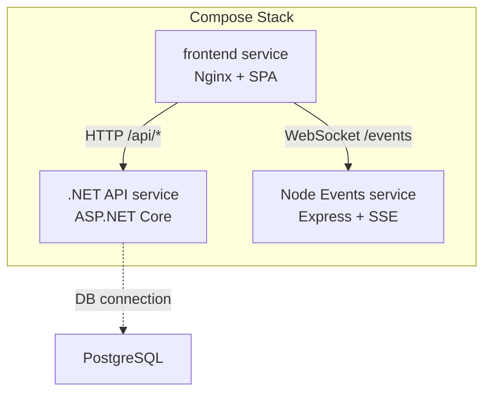
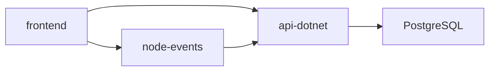

# Containerization Setup

<cite>
**Referenced Files in This Document**
- [Dockerfile](file://Dockerfile)
- [docker-compose.yml](file://docker-compose.yml)
- [frontend/Dockerfile](file://frontend/Dockerfile)
- [frontend/nginx.conf](file://frontend/nginx.conf)
- [frontend/.dockerignore](file://frontend/.dockerignore)
- [frontend/package.json](file://frontend/package.json)
- [backend-dotnet/Dockerfile](file://backend-dotnet/Dockerfile)
- [backend-dotnet/Program.cs](file://backend-dotnet/Program.cs)
- [backend-dotnet/Opstrax.Api.csproj](file://backend-dotnet/Opstrax.Api.csproj)
- [services/node-events/Dockerfile](file://services/node-events/Dockerfile)
- [services/node-events/package.json](file://services/node-events/package.json)
- [node-services/events/Dockerfile](file://node-services/events/Dockerfile)
- [node-services/events/.dockerignore](file://node-services/events/.dockerignore)
- [package.json](file://package.json)
</cite>

## Table of Contents
1. [Introduction](#introduction)
2. [Project Structure](#project-structure)
3. [Core Components](#core-components)
4. [Architecture Overview](#architecture-overview)
5. [Detailed Component Analysis](#detailed-component-analysis)
6. [Dependency Analysis](#dependency-analysis)
7. [Performance Considerations](#performance-considerations)
8. [Troubleshooting Guide](#troubleshooting-guide)
9. [Conclusion](#conclusion)
10. [Appendices](#appendices)

## Introduction
This document describes the containerization setup for OpsTrax components, covering the multi-stage Docker builds for the frontend, backend (.NET), and Node.js event service. It explains base images, dependency management, security hardening, volume mounting strategies, environment variable handling, secrets management, container networking, port mappings, inter-service communication, resource limits, health checks, restart policies, troubleshooting, and production optimization techniques.

## Project Structure
The repository defines three primary services with dedicated Dockerfiles and compose orchestration:
- Frontend service built with Nginx serving a static React SPA
- Backend service built as a .NET 8 web API using a two-stage Docker build
- Node.js event service built with Alpine Linux and minimal runtime footprint



**Diagram sources**
- [docker-compose.yml:1-45](file://docker-compose.yml#L1-L45)

**Section sources**
- [docker-compose.yml:1-45](file://docker-compose.yml#L1-L45)

## Core Components
- Frontend (Nginx): Serves prebuilt SPA and proxies API and events traffic to backend services.
- Backend (.NET): Multi-stage build publishing ASP.NET Core app; exposes health endpoints and config-driven CORS.
- Node Events: Minimal Express server with CORS and Helmet for SSE/event streaming.

Key containerization artifacts:
- Frontend image: Nginx Alpine base, static assets copied, Nginx config mapped
- Backend image: .NET SDK stage to restore/build/publish, runtime stage with ASP.NET Core runtime
- Node Events image: Node Alpine base, npm install, single EXPOSE and CMD

**Section sources**
- [frontend/Dockerfile:1-6](file://frontend/Dockerfile#L1-L6)
- [frontend/nginx.conf:1-31](file://frontend/nginx.conf#L1-L31)
- [backend-dotnet/Dockerfile:1-13](file://backend-dotnet/Dockerfile#L1-L13)
- [services/node-events/Dockerfile:1-8](file://services/node-events/Dockerfile#L1-L8)

## Architecture Overview
The compose stack defines three services with explicit port mappings and inter-service DNS resolution. The frontend listens on port 80 inside the container and is published to host port 10000. The .NET API listens on port 8080 and is published to host 8088. The Node events service listens on port 8090 and is published to host 8090. Environment variables configure URLs, database connections, and CORS.

```mermaid
graph TB
subgraph "Host Network"
H_FE["Port 10000 -> 80 (frontend)"]
H_API["Port 8088 -> 8080 (backend)"]
H_EVT["Port 8090 -> 8090 (events)"]
end
subgraph "Docker Compose Network"
C_FE["frontend"]
C_API["api-dotnet"]
C_EVT["node-events"]
end
H_FE <- --> C_FE
H_API <- --> C_API
H_EVT <- --> C_EVT
C_FE --> |"http://api-dotnet:8080"| C_API
C_FE --> |"ws://node-events:8090"| C_EVT
```

**Diagram sources**
- [docker-compose.yml:13-43](file://docker-compose.yml#L13-L43)

**Section sources**
- [docker-compose.yml:1-45](file://docker-compose.yml#L1-L45)

## Detailed Component Analysis

### Frontend Container (Nginx SPA)
- Base image: Nginx Alpine
- Static build: Copies prebuilt SPA to Nginx HTML root
- Proxying: Routes /api/* to backend API host and / to SPA fallback
- Health endpoint: Returns plaintext ok for health checks
- Ports: Exposes 80; published to host 10000
- Build args: Accepts VITE_API_BASE_URL and VITE_NODE_EVENTS_URL for dev-time overrides

Operational notes:
- Nginx config enables SPA routing and sets up proxy headers
- Compose mounts the frontend service and sets restart policy
- Environment variables for API and events base URLs are passed during build

**Section sources**
- [frontend/Dockerfile:1-6](file://frontend/Dockerfile#L1-L6)
- [frontend/nginx.conf:1-31](file://frontend/nginx.conf#L1-L31)
- [docker-compose.yml:4-17](file://docker-compose.yml#L4-L17)
- [frontend/package.json:9-14](file://frontend/package.json#L9-L14)

### Backend Container (.NET API)
- Multi-stage build:
  - Build stage: .NET SDK restores and publishes Release output
  - Runtime stage: ASP.NET Core runtime copies published output
- Ports: Exposes 8080; container environment binds ASPNETCORE_URLS to port 8080
- Health endpoints: /health, /health/live, /health/ready, /health/deep
- CORS: Controlled by environment variable Cors:AllowedOrigins; defaults to frontend origin
- Database: Connection string configured via environment ConnectionStrings:DefaultConnection
- Restart policy: Unset in compose defaults to no restart

Runtime behavior:
- Startup runs schema bootstrap steps for multiple domains
- Applies global security headers and CSRF middleware
- Implements rate limiting per client IP for API paths
- Exposes Swagger UI endpoints for API documentation

**Section sources**
- [backend-dotnet/Dockerfile:1-13](file://backend-dotnet/Dockerfile#L1-L13)
- [backend-dotnet/Program.cs:10-90](file://backend-dotnet/Program.cs#L10-L90)
- [backend-dotnet/Program.cs:55-63](file://backend-dotnet/Program.cs#L55-L63)
- [backend-dotnet/Program.cs:249-378](file://backend-dotnet/Program.cs#L249-L378)
- [docker-compose.yml:19-31](file://docker-compose.yml#L19-L31)
- [backend-dotnet/Opstrax.Api.csproj:1-17](file://backend-dotnet/Opstrax.Api.csproj#L1-L17)

### Node Events Container (Express SSE)
- Base image: Node Alpine
- Dependencies: Installs from package manifest; optional no-audit/fund flags
- Ports: Exposes 8090; container environment sets PORT
- Inter-service: Connects to backend API via API_BASE_URL and applies CORS via CORS_ORIGIN
- Restart policy: Unset in compose defaults to no restart

**Section sources**
- [services/node-events/Dockerfile:1-8](file://services/node-events/Dockerfile#L1-L8)
- [services/node-events/package.json:1-17](file://services/node-events/package.json#L1-L17)
- [docker-compose.yml:32-43](file://docker-compose.yml#L32-L43)

### Alternative Node Events (node-services/events)
- Identical structure to services/node-events with a separate .dockerignore
- Useful for isolated builds or testing alternate configurations

**Section sources**
- [node-services/events/Dockerfile:1-8](file://node-services/events/Dockerfile#L1-L8)
- [node-services/events/.dockerignore:1-4](file://node-services/events/.dockerignore#L1-L4)

## Dependency Analysis
- Frontend depends on backend API and Node events for real-time updates
- Backend depends on PostgreSQL via ConnectionStrings.DefaultConnection
- Node events depends on backend API for event sourcing and CORS configuration
- Compose manages service dependencies via depends_on and network visibility



**Diagram sources**
- [docker-compose.yml:15-17](file://docker-compose.yml#L15-L17)
- [docker-compose.yml:25-28](file://docker-compose.yml#L25-L28)
- [docker-compose.yml:38-41](file://docker-compose.yml#L38-L41)

**Section sources**
- [docker-compose.yml:1-45](file://docker-compose.yml#L1-L45)

## Performance Considerations
- Multi-stage builds reduce runtime image size and attack surface
- Alpine-based images minimize footprint and download time
- Frontend Nginx handles static delivery efficiently; avoid unnecessary layers
- Backend health endpoints (/ready and /deep) enable fast failure detection and reduced downtime
- Node events service is lightweight; keep worker threads and concurrency aligned with workload

[No sources needed since this section provides general guidance]

## Troubleshooting Guide
Common issues and resolutions:
- Port conflicts on host 10000, 8088, or 8090:
  - Verify host ports are free or adjust compose port mappings
- CORS errors from frontend to backend:
  - Confirm Cors:AllowedOrigins matches frontend origin; ensure environment variable is set in compose
- API readiness failures:
  - Check /health/ready response; verify database connectivity and connection string
- Frontend proxying to API:
  - Ensure VITE_API_BASE_URL points to api-dotnet:8080 inside Docker network
- Frontend proxying to events:
  - Ensure VITE_NODE_EVENTS_URL points to node-events:8090 inside Docker network
- Health checks failing:
  - Confirm /health/live returns 200 and /health/ready connects to DB

**Section sources**
- [docker-compose.yml:25-28](file://docker-compose.yml#L25-L28)
- [docker-compose.yml:38-41](file://docker-compose.yml#L38-L41)
- [backend-dotnet/Program.cs:249-294](file://backend-dotnet/Program.cs#L249-L294)
- [frontend/nginx.conf:12-19](file://frontend/nginx.conf#L12-L19)

## Conclusion
The containerization setup leverages multi-stage builds, Alpine-based images, and a clear separation of concerns across frontend, backend, and event services. Compose orchestrates networking, port mappings, and environment configuration. Health endpoints and CORS controls support robust operation. Production deployments should add resource limits, persistent volumes for logs/data, secret management, and hardened runtime policies.

[No sources needed since this section summarizes without analyzing specific files]

## Appendices

### Volume Mounting Strategies
- Current setup relies on copying built artifacts into images:
  - Frontend: dist copied into Nginx HTML root
  - Backend: published output copied into runtime image
  - Node events: source copied and installed dependencies
- Recommended production mounts:
  - Logs: mount /var/log/nginx and application logs directories
  - Static assets: bind-mount dist folder for hot-reload during dev
  - Database: mount PostgreSQL data directory for persistence
  - Secrets: mount environment files or use external secret stores

[No sources needed since this section provides general guidance]

### Environment Variables and Secrets Management
- Frontend build args:
  - VITE_API_BASE_URL: API base URL for proxying
  - VITE_NODE_EVENTS_URL: Events base URL for WebSocket/SSE
- Backend runtime:
  - ASPNETCORE_URLS: container binding for ASP.NET Core
  - ConnectionStrings:DefaultConnection: PostgreSQL connection string
  - Cors:AllowedOrigins: comma-separated allowed origins
- Node events:
  - PORT: listening port
  - API_BASE_URL: backend API address
  - CORS_ORIGIN: allowed origin for events service
- Secrets:
  - Store sensitive values (e.g., connection strings) outside Dockerfiles
  - Use Docker secrets or external secret managers in production
  - Avoid committing secrets to version control

**Section sources**
- [docker-compose.yml:8-10](file://docker-compose.yml#L8-L10)
- [docker-compose.yml:25-28](file://docker-compose.yml#L25-L28)
- [docker-compose.yml:38-41](file://docker-compose.yml#L38-L41)
- [frontend/nginx.conf:12-19](file://frontend/nginx.conf#L12-L19)

### Container Networking and Inter-Service Communication
- Services communicate via Docker Compose network using service names:
  - frontend resolves api-dotnet and node-events
  - node-events resolves api-dotnet
- DNS resolution uses service names as hostnames within the compose network
- Proxies and CORS are configured to match these internal hostnames

**Section sources**
- [docker-compose.yml:15-17](file://docker-compose.yml#L15-L17)
- [docker-compose.yml](file://docker-compose.yml#L40)
- [frontend/nginx.conf:12-19](file://frontend/nginx.conf#L12-L19)

### Health Checks, Resource Limits, and Restart Policies
- Health checks:
  - /health/live: liveness probe
  - /health/ready: readiness probe against DB
  - /health/deep: comprehensive status including DB, services, and config validation
- Restart policies:
  - Set restart: unless-stopped for frontend and node-events in compose
- Resource limits:
  - Add deploy.resources.limits in compose for CPU/memory
  - Consider ulimits for file descriptors and core dumps

**Section sources**
- [backend-dotnet/Program.cs:249-378](file://backend-dotnet/Program.cs#L249-L378)
- [docker-compose.yml](file://docker-compose.yml#L12)
- [docker-compose.yml](file://docker-compose.yml#L37)

### Security Hardening Checklist
- Remove development dependencies from runtime images
- Pin base image digests for reproducibility
- Enable read-only root filesystem and drop unnecessary capabilities
- Use non-root users in containers
- Rotate secrets regularly and restrict access to secrets storage
- Harden Nginx and Express configurations (headers, timeouts, limits)
- Scan images for vulnerabilities and apply OS-level updates

[No sources needed since this section provides general guidance]

### Build and Runtime Notes
- Node engine requirement:
  - Root package.json requires Node >= 22 for local tooling; frontend Dockerfile uses Nginx for containerized serving
- .NET target framework:
  - Backend targets net8.0; ensure matching SDK/runtime versions across stages

**Section sources**
- [package.json:3-5](file://package.json#L3-L5)
- [frontend/package.json:6-8](file://frontend/package.json#L6-L8)
- [backend-dotnet/Opstrax.Api.csproj](file://backend-dotnet/Opstrax.Api.csproj#L3)