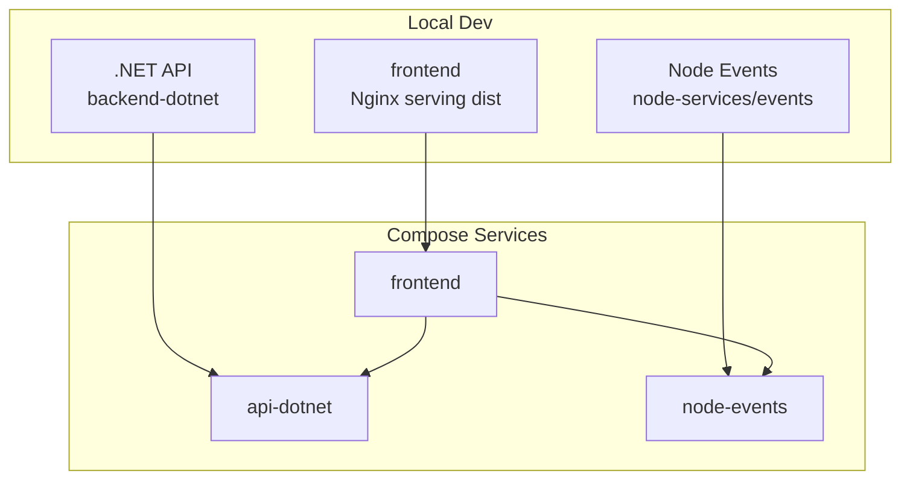
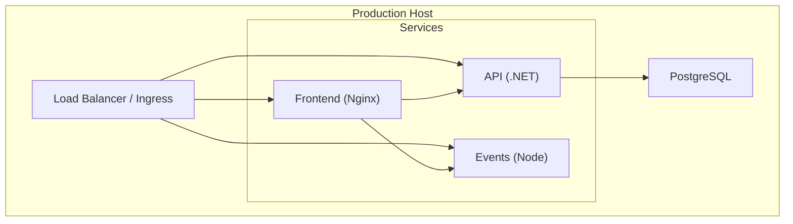
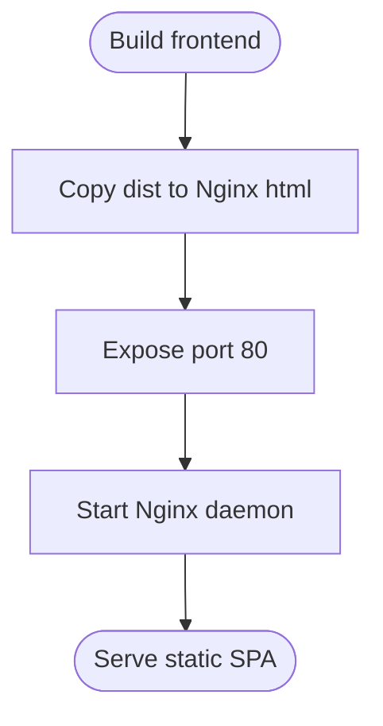
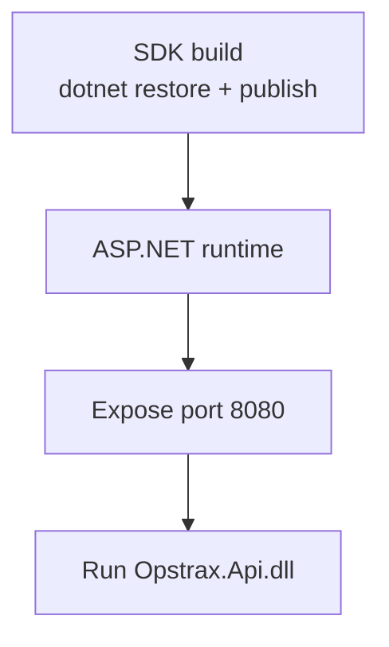
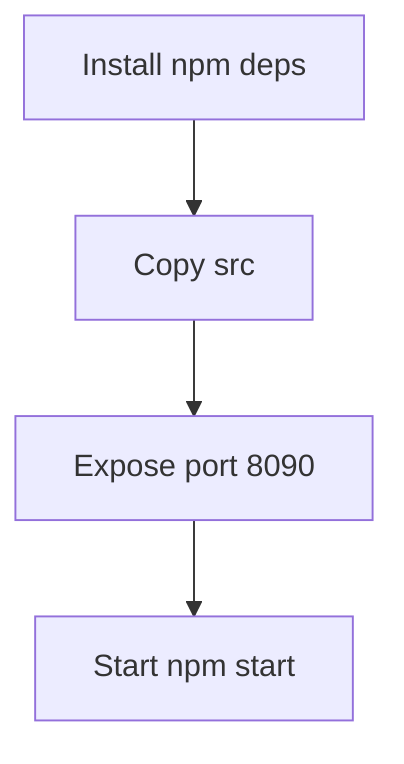
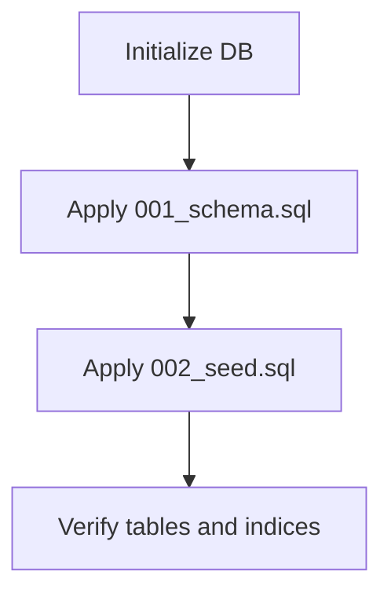
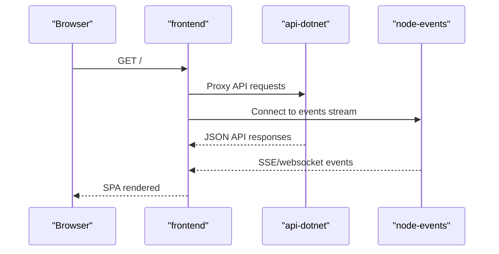
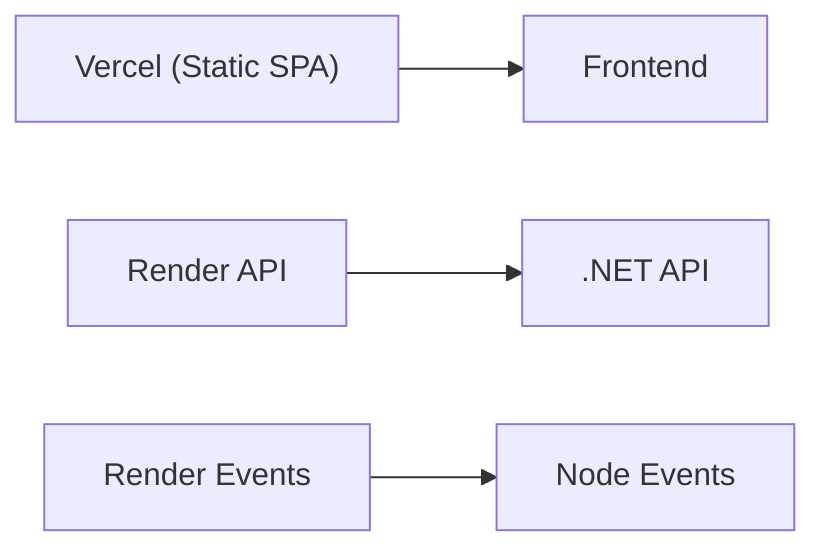
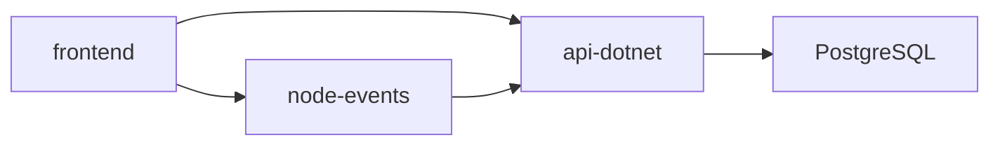

# Deployment & Operations

<cite>
**Referenced Files in This Document**
- [docker-compose.yml](file://docker-compose.yml)
- [PRODUCTION_READINESS.md](file://PRODUCTION_READINESS.md)
- [render.yaml](file://render.yaml)
- [vercel.json](file://vercel.json)
- [start-local.sh](file://start-local.sh)
- [stop-local.sh](file://stop-local.sh)
- [frontend/Dockerfile](file://frontend/Dockerfile)
- [backend-dotnet/Dockerfile](file://backend-dotnet/Dockerfile)
- [services/node-events/Dockerfile](file://services/node-events/Dockerfile)
- [api-dotnet/Dockerfile](file://api-dotnet/Dockerfile)
- [node-services/events/Dockerfile](file://node-services/events/Dockerfile)
- [db/init/001_schema.sql](file://db/init/001_schema.sql)
- [db/init/002_seed.sql](file://db/init/002_seed.sql)
- [database/init/001_schema.sql](file://database/init/001_schema.sql)
- [database/init/002_seed.sql](file://database/init/002_seed.sql)
- [backend/package.json](file://backend/package.json)
</cite>

## Table of Contents
1. [Introduction](#introduction)
2. [Project Structure](#project-structure)
3. [Core Components](#core-components)
4. [Architecture Overview](#architecture-overview)
5. [Detailed Component Analysis](#detailed-component-analysis)
6. [Dependency Analysis](#dependency-analysis)
7. [Performance Considerations](#performance-considerations)
8. [Troubleshooting Guide](#troubleshooting-guide)
9. [Conclusion](#conclusion)
10. [Appendices](#appendices)

## Introduction
This document provides comprehensive deployment and operations guidance for OpsTrax in production environments. It covers containerization with Docker, multi-service orchestration via Docker Compose, production-grade configurations, environment-specific settings, secrets management, infrastructure prerequisites, readiness and UAT checklists, monitoring and alerting, scaling and high availability, backup and disaster recovery, database maintenance, system updates, performance monitoring, log aggregation, troubleshooting, deployment pipelines, blue-green strategies, and rollback procedures tailored for enterprise fleets.

## Project Structure
OpsTrax consists of:
- A React/Vite frontend served by Nginx in a container
- A .NET API service (backend-dotnet)
- A lightweight Node.js event streaming service
- Optional legacy backend-dotnet/api-dotnet artifacts present for historical parity
- Database initialization scripts for both MySQL and PostgreSQL variants
- Orchestration via Docker Compose and platform-specific deployment manifests (Render and Vercel)

**Diagram sources**
- [docker-compose.yml:3-44](file://docker-compose.yml#L3-L44)
- [frontend/Dockerfile:1-6](file://frontend/Dockerfile#L1-L6)
- [backend-dotnet/Dockerfile:1-13](file://backend-dotnet/Dockerfile#L1-L13)
- [services/node-events/Dockerfile:1-8](file://services/node-events/Dockerfile#L1-L8)
- [api-dotnet/Dockerfile:1-13](file://api-dotnet/Dockerfile#L1-L13)
- [node-services/events/Dockerfile:1-8](file://node-services/events/Dockerfile#L1-L8)

**Section sources**
- [docker-compose.yml:1-45](file://docker-compose.yml#L1-L45)
- [frontend/Dockerfile:1-6](file://frontend/Dockerfile#L1-L6)
- [backend-dotnet/Dockerfile:1-13](file://backend-dotnet/Dockerfile#L1-L13)
- [services/node-events/Dockerfile:1-8](file://services/node-events/Dockerfile#L1-L8)
- [api-dotnet/Dockerfile:1-13](file://api-dotnet/Dockerfile#L1-L13)
- [node-services/events/Dockerfile:1-8](file://node-services/events/Dockerfile#L1-L8)

## Core Components
- Frontend container: Nginx serves the built SPA; exposes port 80; mapped to host port 10000.
- .NET API container: ASP.NET Core app exposing port 8080; configured via environment variables for connection strings and CORS.
- Node Events container: Lightweight service exposing health endpoint and configurable CORS; connects to API via internal hostname.
- Optional legacy containers: api-dotnet and node-services/events Dockerfiles exist for compatibility.

Operational scripts:
- Local lifecycle: start-local.sh builds frontend, tears down old containers, brings up services, and prints endpoints.
- Stop: stop-local.sh downs the stack.

**Section sources**
- [docker-compose.yml:4-44](file://docker-compose.yml#L4-L44)
- [start-local.sh:1-15](file://start-local.sh#L1-L15)
- [stop-local.sh:1-4](file://stop-local.sh#L1-L4)

## Architecture Overview
The production architecture supports:
- Containerized microservices orchestrated by Docker Compose
- Platform-as-a-Service deployments for API and Node services (Render) and static frontend (Vercel)
- Database initialization via SQL scripts for both MySQL and PostgreSQL variants

**Diagram sources**
- [render.yaml:1-41](file://render.yaml#L1-L41)
- [vercel.json:1-12](file://vercel.json#L1-L12)
- [database/init/001_schema.sql:1-20](file://database/init/001_schema.sql#L1-L20)
- [database/init/002_seed.sql:1-20](file://database/init/002_seed.sql#L1-L20)

## Detailed Component Analysis

### Frontend Containerization and Static Serving
- Image: Nginx base image
- Behavior: Copies built SPA into HTML root and runs Nginx daemon
- Ports: Exposes 80; published to host 10000 in Compose
- Health: No explicit health check in Compose; rely on upstream API and events health

**Diagram sources**
- [frontend/Dockerfile:1-6](file://frontend/Dockerfile#L1-L6)

**Section sources**
- [frontend/Dockerfile:1-6](file://frontend/Dockerfile#L1-L6)
- [docker-compose.yml:4-17](file://docker-compose.yml#L4-L17)

### .NET API Containerization and Runtime
- Multi-stage build: SDK stage restores and publishes; runtime stage runs ASP.NET Core
- Ports: Exposes 8080; Compose maps to 8088 for local dev
- Environment: ASPNETCORE_URLS, ConnectionStrings__DefaultConnection, Cors__AllowedOrigins
- Health: Render manifest defines health check path at /health

**Diagram sources**
- [backend-dotnet/Dockerfile:1-13](file://backend-dotnet/Dockerfile#L1-L13)
- [api-dotnet/Dockerfile:1-13](file://api-dotnet/Dockerfile#L1-L13)

**Section sources**
- [backend-dotnet/Dockerfile:1-13](file://backend-dotnet/Dockerfile#L1-L13)
- [api-dotnet/Dockerfile:1-13](file://api-dotnet/Dockerfile#L1-L13)
- [docker-compose.yml:19-31](file://docker-compose.yml#L19-L31)
- [render.yaml:1-41](file://render.yaml#L1-L41)

### Node Events Containerization
- Base: Node alpine
- Behavior: Installs dependencies, copies source, exposes port 8090
- Environment: PORT, API_BASE_URL, CORS_ORIGIN
- Health: Render manifest defines health check path at /health

**Diagram sources**
- [services/node-events/Dockerfile:1-8](file://services/node-events/Dockerfile#L1-L8)
- [node-services/events/Dockerfile:1-8](file://node-services/events/Dockerfile#L1-L8)

**Section sources**
- [services/node-events/Dockerfile:1-8](file://services/node-events/Dockerfile#L1-L8)
- [node-services/events/Dockerfile:1-8](file://node-services/events/Dockerfile#L1-L8)
- [docker-compose.yml:32-44](file://docker-compose.yml#L32-L44)
- [render.yaml:20-41](file://render.yaml#L20-L41)

### Database Initialization and Migration Strategy
Two complementary initialization sets are provided:
- MySQL variant under db/: schema and seed scripts
- PostgreSQL variant under database/: schema and seed scripts

Recommendation:
- Choose PostgreSQL for production and apply database/init/*.sql scripts during provisioning or CI/CD.

**Diagram sources**
- [database/init/001_schema.sql:1-20](file://database/init/001_schema.sql#L1-L20)
- [database/init/002_seed.sql:1-20](file://database/init/002_seed.sql#L1-L20)

**Section sources**
- [db/init/001_schema.sql:1-263](file://db/init/001_schema.sql#L1-L263)
- [db/init/002_seed.sql:1-70](file://db/init/002_seed.sql#L1-L70)
- [database/init/001_schema.sql:1-20](file://database/init/001_schema.sql#L1-L20)
- [database/init/002_seed.sql:1-20](file://database/init/002_seed.sql#L1-L20)

### Orchestration with Docker Compose
- Services: frontend, api-dotnet, node-events
- Networking: Compose network enables inter-service DNS resolution
- Dependencies: frontend depends_on api-dotnet and node-events
- Port mappings: host-to-container exposure for local development

**Diagram sources**
- [docker-compose.yml:3-44](file://docker-compose.yml#L3-L44)

**Section sources**
- [docker-compose.yml:1-45](file://docker-compose.yml#L1-L45)

### Platform Deployments (Render and Vercel)
- Render:
  - opstrax-api: Docker runtime, rootDir backend-dotnet, health check at /health
  - opstrax-events: Docker runtime, rootDir node-services/events, health check at /health
  - Environment variables include ASPNETCORE_URLS, PORT, PG_CONNECTION, CORS-related vars
- Vercel:
  - Frontend build: installCommand/buildCommand/outputDirectory
  - Rewrites to serve SPA at “/”

**Diagram sources**
- [render.yaml:1-41](file://render.yaml#L1-L41)
- [vercel.json:1-12](file://vercel.json#L1-L12)

**Section sources**
- [render.yaml:1-41](file://render.yaml#L1-L41)
- [vercel.json:1-12](file://vercel.json#L1-L12)

## Dependency Analysis
- Frontend depends on API and Events services for runtime data and streams.
- API depends on PostgreSQL for persistence; connection string supplied via environment variable.
- Node Events depends on API for event sourcing and CORS policy aligned with frontend origin.

**Diagram sources**
- [docker-compose.yml:3-44](file://docker-compose.yml#L3-L44)
- [render.yaml:1-41](file://render.yaml#L1-L41)

**Section sources**
- [docker-compose.yml:19-44](file://docker-compose.yml#L19-L44)
- [render.yaml:10-41](file://render.yaml#L10-L41)

## Performance Considerations
- Container sizing and CPU/memory limits should be set per environment in production orchestrators.
- Enable gzip/static caching in Nginx for the frontend.
- Tune .NET GC and Kestrel settings for throughput and latency.
- Use connection pooling and limit concurrent connections to the database.
- Implement circuit breakers and retries for inter-service calls.
- Monitor and scale horizontally based on CPU, memory, and queue depth metrics.

[No sources needed since this section provides general guidance]

## Troubleshooting Guide
Common checks and remediation steps:
- Health and readiness
  - API: verify /health endpoint on Render and internal port 8080 in Compose
  - Events: verify /health endpoint on Render and internal port 8090 in Compose
- Connectivity
  - Confirm DNS resolution between frontend and API/Events
  - Validate CORS origins and allowed origins in environment variables
- Database
  - Restore from backups and re-apply schema/seed scripts as documented in production readiness
- Rollback
  - Re-deploy previous known-good images for frontend and API

**Section sources**
- [render.yaml:8-26](file://render.yaml#L8-L26)
- [docker-compose.yml:25-43](file://docker-compose.yml#L25-L43)
- [PRODUCTION_READINESS.md:15-28](file://PRODUCTION_READINESS.md#L15-L28)

## Conclusion
OpsTrax provides a clear container-first architecture with Docker Compose for local development and Render/Vercel for production hosting. The system is modular, with a static frontend, a .NET API, and a Node event service, plus robust database initialization scripts. By applying the production readiness checklist, implementing monitoring and alerting, and adopting scalable patterns, OpsTrax can operate reliably in enterprise environments.

[No sources needed since this section summarizes without analyzing specific files]

## Appendices

### Production Readiness Checklist
- Build artifacts: frontend, backend, backend-dotnet
- Database: initialize schema and seed data using PostgreSQL scripts
- Secrets: configure environment variables for database connection and CORS
- Health checks: confirm /health endpoints for API and Events
- UAT: validate login, RBAC, protected routes, core page loads, and error boundaries

**Section sources**
- [PRODUCTION_READINESS.md:9-28](file://PRODUCTION_READINESS.md#L9-L28)

### Monitoring and Alerting
- Define health endpoints and integrate with platform health checks (Render)
- Instrument API and Events for latency, error rates, and throughput
- Centralize logs from containers and databases
- Set up alerts for failing health checks, elevated error rates, and resource saturation

[No sources needed since this section provides general guidance]

### Scaling and High Availability
- Horizontal scaling: run multiple replicas behind a load balancer
- Sticky sessions: avoid if SSE/websocket is used; otherwise enable sticky sessions
- Database HA: use managed PostgreSQL with replication and automated backups

[No sources needed since this section provides general guidance]

### Load Balancing Patterns
- Ingress controller routing to frontend, API, and Events
- API gateway or reverse proxy for request shaping and rate limiting
- CDN for static assets

[No sources needed since this section provides general guidance]

### Backup and Disaster Recovery
- Database backups: schedule regular logical backups of PostgreSQL
- Object storage: maintain versioned and tenant-scoped assets
- Rollback: redeploy previous known-good images for frontend and API

**Section sources**
- [PRODUCTION_READINESS.md:15-28](file://PRODUCTION_READINESS.md#L15-L28)

### Database Maintenance
- Apply schema changes via idempotent scripts
- Seed data refresh for non-production environments
- Index tuning and vacuum/analyze for performance

**Section sources**
- [database/init/001_schema.sql:1-20](file://database/init/001_schema.sql#L1-L20)
- [database/init/002_seed.sql:1-20](file://database/init/002_seed.sql#L1-L20)

### System Updates
- Rolling updates: deploy new images with zero-downtime by leveraging replicas and health checks
- Blue-green deployments: maintain two identical environments and switch traffic after validation

[No sources needed since this section provides general guidance]

### Performance Monitoring
- Metrics: CPU, memory, disk, network, database queries
- Tracing: distributed tracing across API and Events
- Dashboards: visualize latency, error rates, and capacity utilization

[No sources needed since this section provides general guidance]

### Log Aggregation
- Collect container logs and structured logs from applications
- Ship logs to centralized logging systems (e.g., SIEM or cloud-native solutions)
- Retention policies aligned with compliance

[No sources needed since this section provides general guidance]

### Deployment Pipelines
- CI: build frontend/backend/backend-dotnet, run tests
- CD: push images to registry, deploy to staging, promote to production
- Gatekeeping: pre-deploy health checks, canary releases, and rollback automation

[No sources needed since this section provides general guidance]

### Blue-Green Deployments and Rollbacks
- Maintain two identical environments; route traffic to one at a time
- Validate post-deploy health and metrics before switching
- Rollback by reverting traffic to the previous environment

[No sources needed since this section provides general guidance]