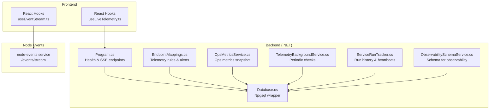
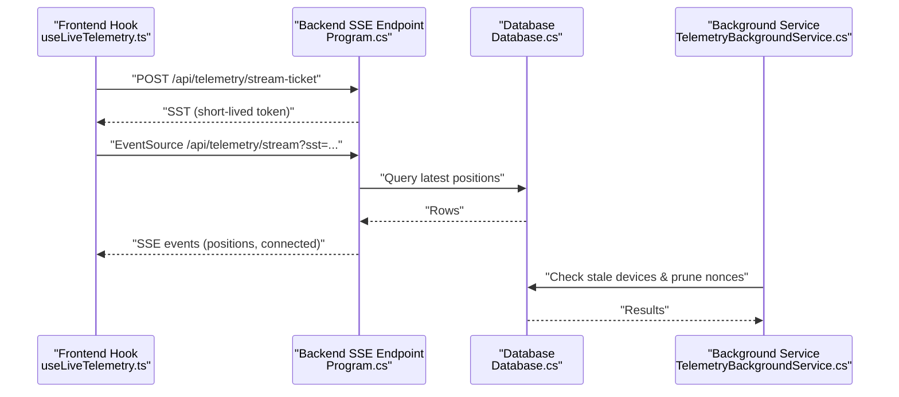
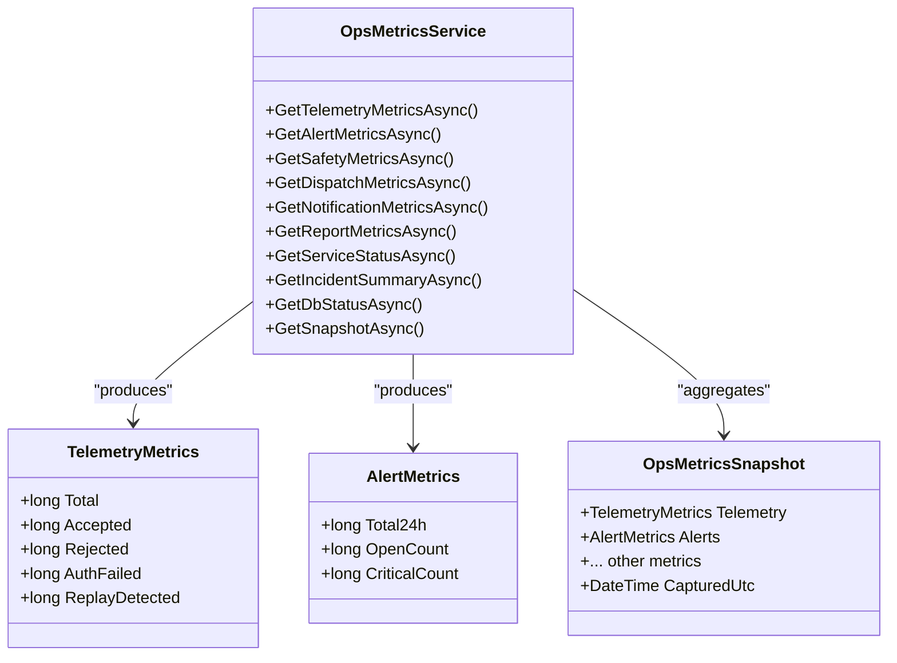
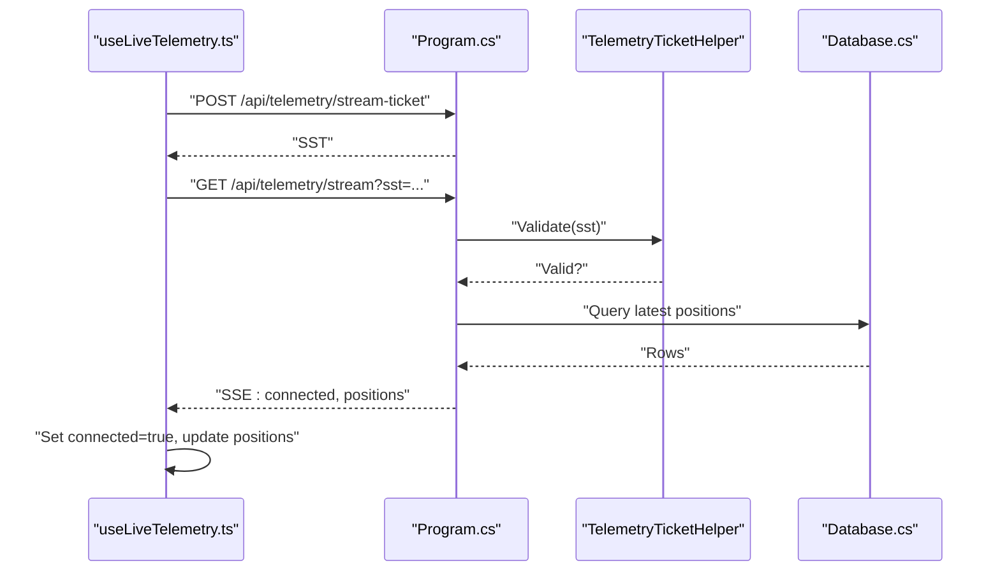
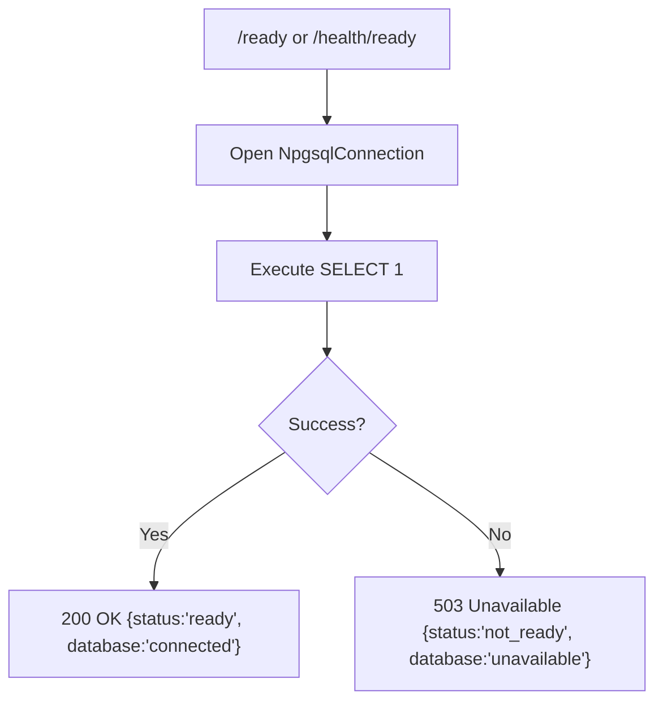
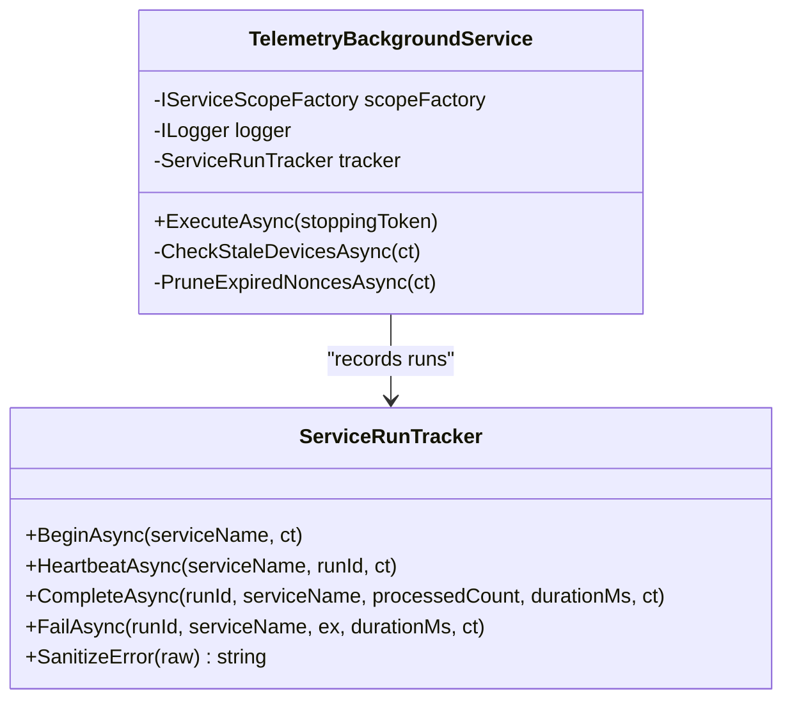
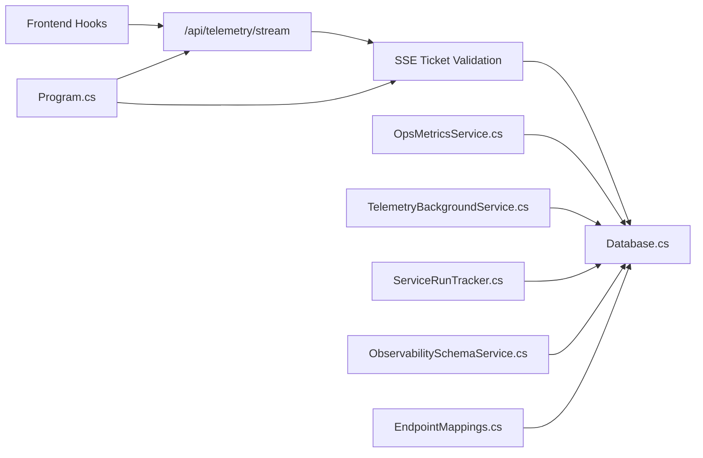

# Monitoring & Alerting

<cite>
**Referenced Files in This Document**
- [Program.cs](file://backend-dotnet/Program.cs)
- [EndpointMappings.cs](file://backend-dotnet/Controllers/EndpointMappings.cs)
- [OpsMetricsService.cs](file://backend-dotnet/Services/OpsMetricsService.cs)
- [TelemetryBackgroundService.cs](file://backend-dotnet/Services/TelemetryBackgroundService.cs)
- [ServiceRunTracker.cs](file://backend-dotnet/Services/ServiceRunTracker.cs)
- [ObservabilitySchemaService.cs](file://backend-dotnet/Services/ObservabilitySchemaService.cs)
- [Database.cs](file://backend-dotnet/Data/Database.cs)
- [health.routes.ts](file://backend/src/modules/health/health.routes.ts)
- [useEventStream.ts](file://frontend/src/hooks/useEventStream.ts)
- [useLiveTelemetry.ts](file://frontend/src/hooks/useLiveTelemetry.ts)
- [docker-compose.yml](file://docker-compose.yml)
- [Dockerfile](file://Dockerfile)
- [render.yaml](file://render.yaml)
- [P9ObservabilityTests.cs](file://backend-dotnet.Tests/P9ObservabilityTests.cs)
</cite>

## Table of Contents
1. [Introduction](#introduction)
2. [Project Structure](#project-structure)
3. [Core Components](#core-components)
4. [Architecture Overview](#architecture-overview)
5. [Detailed Component Analysis](#detailed-component-analysis)
6. [Dependency Analysis](#dependency-analysis)
7. [Performance Considerations](#performance-considerations)
8. [Troubleshooting Guide](#troubleshooting-guide)
9. [Conclusion](#conclusion)
10. [Appendices](#appendices)

## Introduction
This document provides comprehensive monitoring and alerting guidance for OpsTrax production systems. It covers Application Performance Monitoring (APM), custom metrics collection, health checks, real-time event streaming, WebSocket/SSE connection tracking, event processing metrics, database performance monitoring, query optimization tracking, connection pool management, infrastructure monitoring, log aggregation and analysis, alerting thresholds, notification channels, escalation procedures, and troubleshooting workflows for common scenarios.

## Project Structure
The monitoring and alerting surface spans backend services (C# .NET), frontend React hooks, Node event streaming service, and orchestration via Docker Compose and Render. Key monitoring touchpoints include:
- Health probes and deep diagnostics (/health, /ready, /health/deep)
- SSE telemetry streams with short-lived tickets
- Background services tracked via service_run_history and service_heartbeats
- Operational metrics snapshot via OpsMetricsService
- Database connectivity and schema observability tables



**Diagram sources**
- [Program.cs:249-378](file://backend-dotnet/Program.cs#L249-L378)
- [EndpointMappings.cs:7058-7084](file://backend-dotnet/Controllers/EndpointMappings.cs#L7058-L7084)
- [OpsMetricsService.cs:46-212](file://backend-dotnet/Services/OpsMetricsService.cs#L46-L212)
- [TelemetryBackgroundService.cs:17-103](file://backend-dotnet/Services/TelemetryBackgroundService.cs#L17-L103)
- [ServiceRunTracker.cs:31-179](file://backend-dotnet/Services/ServiceRunTracker.cs#L31-L179)
- [ObservabilitySchemaService.cs:16-91](file://backend-dotnet/Services/ObservabilitySchemaService.cs#L16-L91)
- [Database.cs:5-86](file://backend-dotnet/Data/Database.cs#L5-L86)
- [useEventStream.ts:1-22](file://frontend/src/hooks/useEventStream.ts#L1-L22)
- [useLiveTelemetry.ts:71-149](file://frontend/src/hooks/useLiveTelemetry.ts#L71-L149)

**Section sources**
- [Program.cs:249-378](file://backend-dotnet/Program.cs#L249-L378)
- [docker-compose.yml:1-45](file://docker-compose.yml#L1-L45)
- [Dockerfile:1-14](file://Dockerfile#L1-L14)
- [render.yaml:1-41](file://render.yaml#L1-L41)

## Core Components
- Health and readiness probes: Kubernetes-friendly endpoints for liveness, readiness, and deep diagnostics.
- SSE telemetry streams: Real-time position updates with short-lived tickets and connection tracking.
- Background services: Periodic tasks with run tracking and incident auto-creation.
- Operational metrics: Aggregated snapshots across telemetry, alerts, safety, dispatch, notifications, reports, services, incidents, and database status.
- Observability schema: Tables for service run history, heartbeats, and platform incidents.
- Database connectivity: Centralized Npgsql wrapper with scalar and query helpers.

**Section sources**
- [Program.cs:257-378](file://backend-dotnet/Program.cs#L257-L378)
- [EndpointMappings.cs:7058-7084](file://backend-dotnet/Controllers/EndpointMappings.cs#L7058-L7084)
- [TelemetryBackgroundService.cs:17-103](file://backend-dotnet/Services/TelemetryBackgroundService.cs#L17-L103)
- [ServiceRunTracker.cs:31-179](file://backend-dotnet/Services/ServiceRunTracker.cs#L31-L179)
- [OpsMetricsService.cs:46-212](file://backend-dotnet/Services/OpsMetricsService.cs#L46-L212)
- [ObservabilitySchemaService.cs:16-91](file://backend-dotnet/Services/ObservabilitySchemaService.cs#L16-L91)
- [Database.cs:5-86](file://backend-dotnet/Data/Database.cs#L5-L86)

## Architecture Overview
The monitoring architecture integrates frontend event streams, backend health and SSE endpoints, background service tracking, and database-backed observability artifacts.



**Diagram sources**
- [useLiveTelemetry.ts:108-149](file://frontend/src/hooks/useLiveTelemetry.ts#L108-L149)
- [Program.cs:149-172](file://backend-dotnet/Program.cs#L149-L172)
- [Program.cs:7061-7070](file://backend-dotnet/Program.cs#L7061-L7070)
- [Program.cs:7076-7084](file://backend-dotnet/Program.cs#L7076-L7084)
- [Database.cs:17-34](file://backend-dotnet/Data/Database.cs#L17-L34)
- [TelemetryBackgroundService.cs:46-89](file://backend-dotnet/Services/TelemetryBackgroundService.cs#L46-L89)

## Detailed Component Analysis

### Health Checks and Readiness
- Endpoints:
  - /health and /health/live: Always 200 when process is alive (liveness probe).
  - /ready and /health/ready: DB connectivity check returning 503 when unavailable.
  - /health/deep: Comprehensive check including DB latency, service heartbeats, and sanitized config validation.
- Security and privacy:
  - Deep health excludes sensitive values and exposes only check names, levels, and messages.
  - Tests validate absence of secrets in health responses.

```mermaid
flowchart TD
Start(["Probe Request"]) --> Path{"Path"}
Path --> |"/health/live"| Live["Return {status:'alive'}"]
Path --> |"/ready" or "/health/ready"| Ready["Open DB connection<br/>SELECT 1"]
Ready --> Ok{"Connected?"}
Ok --> |Yes| OkResp["200 OK {status:'ready', database:'connected'}"]
Ok --> |No| Unavail["503 Unavailable {status:'not_ready', database:'unavailable'}"]
Path --> |"/health/deep"| Deep["DB check + service heartbeats + config validation"]
Deep --> Status["Compute overall status"]
Status --> Resp["Return JSON with checks and status"]
```

**Diagram sources**
- [Program.cs:257-378](file://backend-dotnet/Program.cs#L257-L378)
- [P9ObservabilityTests.cs:425-518](file://backend-dotnet.Tests/P9ObservabilityTests.cs#L425-L518)

**Section sources**
- [Program.cs:257-378](file://backend-dotnet/Program.cs#L257-L378)
- [P9ObservabilityTests.cs:425-518](file://backend-dotnet.Tests/P9ObservabilityTests.cs#L425-L518)

### Application Performance Monitoring (APM)
- Metrics aggregation:
  - OpsMetricsService collects telemetry, alerts, safety, dispatch, notifications, reports, services, incidents, and database status in a single snapshot.
  - Telemetry metrics include totals, accepted, rejected, auth failures, and replay detections over the last 24 hours.
  - Alert metrics include counts for open and critical alerts over the last 24 hours.
- Frontend integration:
  - useEventStream and useLiveTelemetry demonstrate SSE consumption and connection state tracking.



**Diagram sources**
- [OpsMetricsService.cs:46-212](file://backend-dotnet/Services/OpsMetricsService.cs#L46-L212)
- [OpsMetricsService.cs:223-238](file://backend-dotnet/Services/OpsMetricsService.cs#L223-L238)

**Section sources**
- [OpsMetricsService.cs:46-212](file://backend-dotnet/Services/OpsMetricsService.cs#L46-L212)
- [useEventStream.ts:1-22](file://frontend/src/hooks/useEventStream.ts#L1-L22)
- [useLiveTelemetry.ts:71-149](file://frontend/src/hooks/useLiveTelemetry.ts#L71-L149)

### Real-Time Event Streaming and Connection Tracking
- SSE endpoint:
  - /api/telemetry/stream sets appropriate headers and writes a connected event, then continuously streams positions.
  - Tracks active clients and flushes initial connected event.
- Stream ticketing:
  - Short-lived tickets (sst) are required; validated via HMAC signature and scoped to companyId.
  - Prevents long-lived tokens in query strings and logs.
- Frontend hooks:
  - useEventStream consumes /events/stream from node-events service.
  - useLiveTelemetry obtains SST, opens EventSource, tracks connected state, handles errors, and refreshes positions.



**Diagram sources**
- [Program.cs:149-172](file://backend-dotnet/Program.cs#L149-L172)
- [Program.cs:7061-7084](file://backend-dotnet/Program.cs#L7061-L7084)
- [Database.cs:17-34](file://backend-dotnet/Data/Database.cs#L17-L34)
- [useLiveTelemetry.ts:108-149](file://frontend/src/hooks/useLiveTelemetry.ts#L108-L149)

**Section sources**
- [Program.cs:149-172](file://backend-dotnet/Program.cs#L149-L172)
- [Program.cs:7061-7084](file://backend-dotnet/Program.cs#L7061-L7084)
- [useEventStream.ts:1-22](file://frontend/src/hooks/useEventStream.ts#L1-L22)
- [useLiveTelemetry.ts:71-149](file://frontend/src/hooks/useLiveTelemetry.ts#L71-L149)

### Database Performance Monitoring and Connection Pool Management
- Connectivity:
  - Health readiness probes test DB connectivity via SELECT 1.
  - Deep health measures DB latency.
- Schema and observability:
  - ObservabilitySchemaService creates and maintains service_run_history, service_heartbeats, and platform_incidents tables.
- Connection handling:
  - Database.cs wraps NpgsqlConnection with helpers for queries, scalars, and inserts.
- Recommendations:
  - Use connection pooling via Npgsql defaults.
  - Monitor slow queries and index usage; leverage service_run_history for execution timing.



**Diagram sources**
- [Program.cs:260-294](file://backend-dotnet/Program.cs#L260-L294)
- [Database.cs:10-15](file://backend-dotnet/Data/Database.cs#L10-L15)
- [ObservabilitySchemaService.cs:16-91](file://backend-dotnet/Services/ObservabilitySchemaService.cs#L16-L91)

**Section sources**
- [Program.cs:260-294](file://backend-dotnet/Program.cs#L260-L294)
- [Database.cs:10-86](file://backend-dotnet/Data/Database.cs#L10-L86)
- [ObservabilitySchemaService.cs:16-91](file://backend-dotnet/Services/ObservabilitySchemaService.cs#L16-L91)

### Background Services, Metrics, and Alerting
- Background service lifecycle:
  - TelemetryBackgroundService runs every 5 minutes, checking stale devices and pruning expired nonces.
  - Uses ServiceRunTracker to record run history and heartbeats, with sanitized error messages.
- Incident automation:
  - After 3+ consecutive failures, ServiceRunTracker can auto-create platform incidents via IncidentService.
- Telemetry rules and alerts:
  - EndpointMappings exposes telemetry rules listing and alert management endpoints for acknowledgments and resolutions.



**Diagram sources**
- [TelemetryBackgroundService.cs:17-103](file://backend-dotnet/Services/TelemetryBackgroundService.cs#L17-L103)
- [ServiceRunTracker.cs:31-179](file://backend-dotnet/Services/ServiceRunTracker.cs#L31-L179)

**Section sources**
- [TelemetryBackgroundService.cs:17-103](file://backend-dotnet/Services/TelemetryBackgroundService.cs#L17-L103)
- [ServiceRunTracker.cs:31-179](file://backend-dotnet/Services/ServiceRunTracker.cs#L31-L179)
- [EndpointMappings.cs:7169-7234](file://backend-dotnet/Controllers/EndpointMappings.cs#L7169-L7234)

### Infrastructure Monitoring (CPU, Memory, Disk, Network)
- Containerization:
  - Docker Compose defines services for frontend, backend (.NET), and node-events.
  - Render deployment config specifies health check path and environment variables.
- Guidance:
  - Deploy Prometheus Node Exporter and Grafana for host-level metrics.
  - Track container CPU/memory/disk via orchestrator metrics.
  - Monitor network egress and latency to PostgreSQL and external integrations.

**Section sources**
- [docker-compose.yml:1-45](file://docker-compose.yml#L1-L45)
- [Dockerfile:1-14](file://Dockerfile#L1-L14)
- [render.yaml:1-41](file://render.yaml#L1-L41)

### Log Aggregation, Centralized Logging, and Log Analysis
- Backend logging:
  - Structured logs capture sanitized error messages; raw stack traces are not persisted.
  - Error sanitization removes secrets, tokens, and IP addresses.
- Frontend:
  - React hooks manage SSE connection state and errors; surface minimal diagnostic info to users.
- Recommendations:
  - Ship logs to a centralized collector (e.g., ELK/EFK or Loki/Grafana stack).
  - Index by service_name, severity, and tenant/company scopes.
  - Retain logs per policy; purge sensitive data post-sanitization.

**Section sources**
- [ServiceRunTracker.cs:181-203](file://backend-dotnet/Services/ServiceRunTracker.cs#L181-L203)
- [useLiveTelemetry.ts:143-149](file://frontend/src/hooks/useLiveTelemetry.ts#L143-L149)

### Alerting Thresholds, Notification Channels, and Escalation
- Thresholds:
  - Stale device detection uses per-tenant thresholds from telemetry_rules; default 15 minutes.
  - Consecutive failure threshold for platform incident creation is 3 (escalate to 10+ for critical severity).
- Notifications:
  - Frontend surfaces alerts and supports acknowledge/close actions via API endpoints.
- Escalation:
  - ServiceRunTracker auto-creates platform incidents after repeated failures; severity escalates at higher thresholds.
- Recommendations:
  - Define SLOs for SSE connection uptime and DB latency.
  - Configure PagerDuty/Jira/Teams integration for critical alerts.
  - Enforce on-call rotations and runbooks for recurring failures.

**Section sources**
- [TelemetryBackgroundService.cs:52-89](file://backend-dotnet/Services/TelemetryBackgroundService.cs#L52-L89)
- [ServiceRunTracker.cs:27-179](file://backend-dotnet/Services/ServiceRunTracker.cs#L27-L179)
- [EndpointMappings.cs:7169-7234](file://backend-dotnet/Controllers/EndpointMappings.cs#L7169-L7234)

## Dependency Analysis
- Program.cs wires health endpoints, SSE routing, and authentication gating for SSE.
- EndpointMappings.cs defines telemetry rules and alert management routes.
- OpsMetricsService.cs depends on Database.cs for metrics queries.
- TelemetryBackgroundService.cs and ServiceRunTracker.cs depend on ObservabilitySchemaService tables.
- Frontend hooks depend on backend SSE endpoints and node-events service.



**Diagram sources**
- [Program.cs:149-172](file://backend-dotnet/Program.cs#L149-L172)
- [Program.cs:7061-7084](file://backend-dotnet/Program.cs#L7061-L7084)
- [EndpointMappings.cs:7222-7234](file://backend-dotnet/Controllers/EndpointMappings.cs#L7222-L7234)
- [OpsMetricsService.cs:46-212](file://backend-dotnet/Services/OpsMetricsService.cs#L46-L212)
- [TelemetryBackgroundService.cs:46-89](file://backend-dotnet/Services/TelemetryBackgroundService.cs#L46-L89)
- [ServiceRunTracker.cs:31-179](file://backend-dotnet/Services/ServiceRunTracker.cs#L31-L179)
- [ObservabilitySchemaService.cs:16-91](file://backend-dotnet/Services/ObservabilitySchemaService.cs#L16-L91)
- [Database.cs:5-86](file://backend-dotnet/Data/Database.cs#L5-L86)

**Section sources**
- [Program.cs:149-172](file://backend-dotnet/Program.cs#L149-L172)
- [Program.cs:7061-7084](file://backend-dotnet/Program.cs#L7061-L7084)
- [EndpointMappings.cs:7222-7234](file://backend-dotnet/Controllers/EndpointMappings.cs#L7222-L7234)
- [OpsMetricsService.cs:46-212](file://backend-dotnet/Services/OpsMetricsService.cs#L46-L212)
- [TelemetryBackgroundService.cs:46-89](file://backend-dotnet/Services/TelemetryBackgroundService.cs#L46-L89)
- [ServiceRunTracker.cs:31-179](file://backend-dotnet/Services/ServiceRunTracker.cs#L31-L179)
- [ObservabilitySchemaService.cs:16-91](file://backend-dotnet/Services/ObservabilitySchemaService.cs#L16-L91)
- [Database.cs:5-86](file://backend-dotnet/Data/Database.cs#L5-L86)

## Performance Considerations
- SSE streaming:
  - Keep sst TTL short (e.g., 90 seconds) to reduce exposure windows.
  - Close stale connections and retry on error to minimize backlog.
- Database:
  - Use indexes on frequently filtered columns (company_id, timestamps).
  - Monitor slow query log and optimize telemetry_events and telemetry_alerts queries.
- Background services:
  - Schedule periodic tasks to avoid contention; track durations in service_run_history.
- Frontend:
  - Limit retained SSE events to recent N to control memory growth.

## Troubleshooting Guide
- Health probes failing:
  - Verify /ready returns 200; if not, inspect DB connectivity and credentials.
  - Use /health/deep to confirm DB latency and service statuses.
- SSE stream disconnects:
  - Confirm sst is present and valid; ensure backend validates HMAC signature.
  - Check frontend connection state and error handler; retry after transient failures.
- Stale device alerts:
  - Review telemetry_rules thresholds per tenant; adjust default 15-minute window if needed.
  - Investigate missing positions and device authentication.
- Background service failures:
  - Inspect service_run_history and service_heartbeats; address repeated failures and auto-created incidents.
- Logs and secrets:
  - Ensure sanitized error messages are persisted; avoid exposing secrets in structured logs.

**Section sources**
- [Program.cs:260-294](file://backend-dotnet/Program.cs#L260-L294)
- [Program.cs:296-378](file://backend-dotnet/Program.cs#L296-L378)
- [Program.cs:149-172](file://backend-dotnet/Program.cs#L149-L172)
- [useLiveTelemetry.ts:143-149](file://frontend/src/hooks/useLiveTelemetry.ts#L143-L149)
- [TelemetryBackgroundService.cs:46-89](file://backend-dotnet/Services/TelemetryBackgroundService.cs#L46-L89)
- [ServiceRunTracker.cs:111-179](file://backend-dotnet/Services/ServiceRunTracker.cs#L111-L179)

## Conclusion
OpsTrax provides robust built-in monitoring via health probes, SSE streams with short-lived tickets, background service tracking, and operational metrics aggregation. Combine these with infrastructure metrics, centralized logging, and alerting policies to achieve comprehensive production observability. Regularly review thresholds, incident escalations, and query performance to maintain reliability and responsiveness.

## Appendices
- Orchestration and deployment:
  - Docker Compose and Render configurations define health checks and environment variables.
- Frontend monitoring hooks:
  - useEventStream and useLiveTelemetry demonstrate SSE consumption and connection state.

**Section sources**
- [docker-compose.yml:1-45](file://docker-compose.yml#L1-L45)
- [render.yaml:1-41](file://render.yaml#L1-L41)
- [useEventStream.ts:1-22](file://frontend/src/hooks/useEventStream.ts#L1-L22)
- [useLiveTelemetry.ts:71-149](file://frontend/src/hooks/useLiveTelemetry.ts#L71-L149)