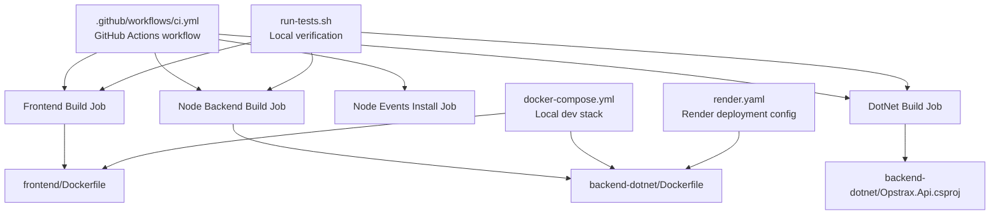
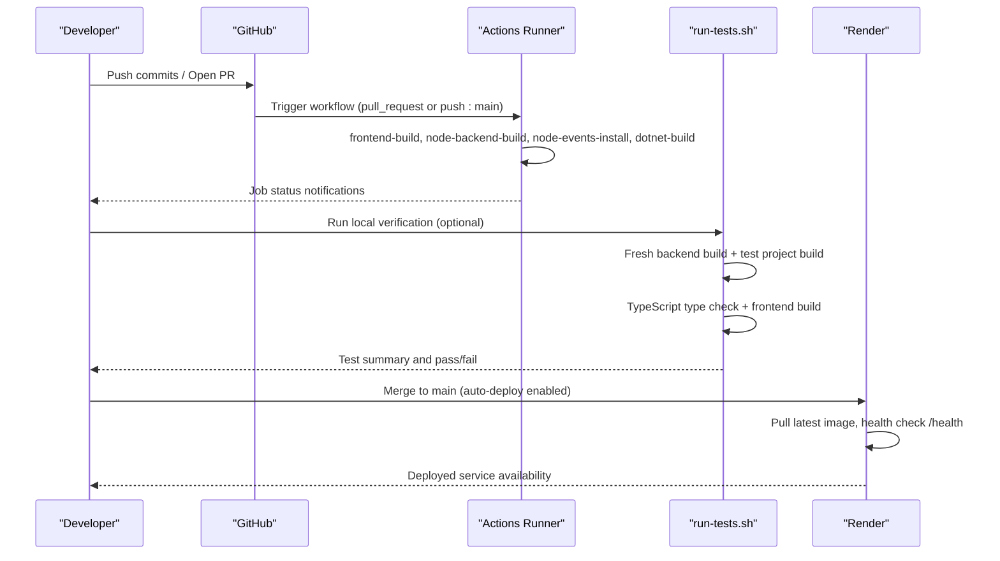
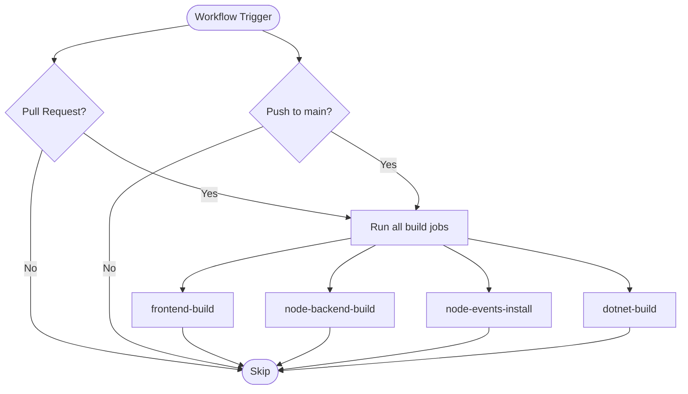
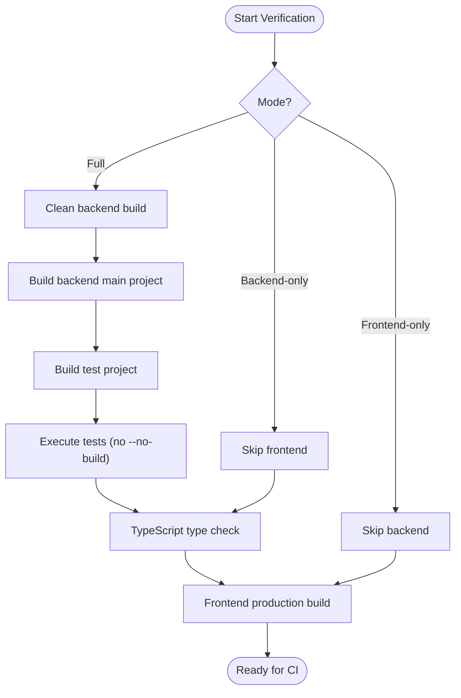
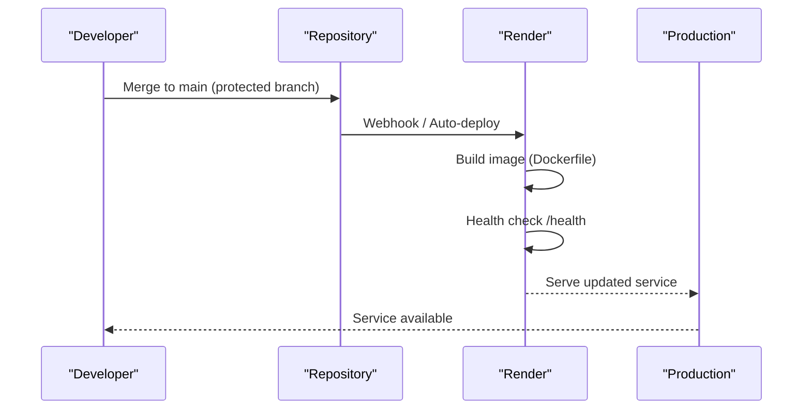
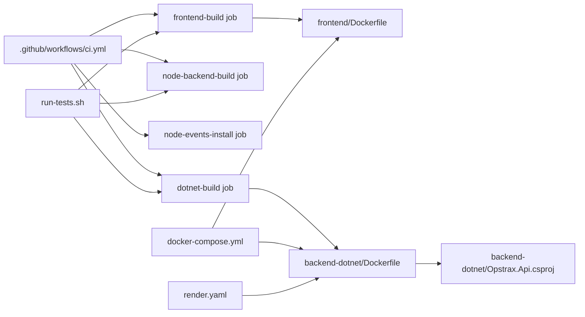

# CI/CD Pipeline

<cite>
**Referenced Files in This Document**
- [ci.yml](file://.github/workflows/ci.yml)
- [run-tests.sh](file://run-tests.sh)
- [package.json](file://package.json)
- [frontend/package.json](file://frontend/package.json)
- [backend/package.json](file://backend/package.json)
- [backend-dotnet/Opstrax.Api.csproj](file://backend-dotnet/Opstrax.Api.csproj)
- [frontend/Dockerfile](file://frontend/Dockerfile)
- [backend-dotnet/Dockerfile](file://backend-dotnet/Dockerfile)
- [docker-compose.yml](file://docker-compose.yml)
- [render.yaml](file://render.yaml)
- [PRODUCTION_READINESS.md](file://PRODUCTION_READINESS.md)
- [PRODUCTION_QA_MATRIX.md](file://PRODUCTION_QA_MATRIX.md)
</cite>

## Table of Contents
1. [Introduction](#introduction)
2. [Project Structure](#project-structure)
3. [Core Components](#core-components)
4. [Architecture Overview](#architecture-overview)
5. [Detailed Component Analysis](#detailed-component-analysis)
6. [Dependency Analysis](#dependency-analysis)
7. [Performance Considerations](#performance-considerations)
8. [Troubleshooting Guide](#troubleshooting-guide)
9. [Conclusion](#conclusion)
10. [Appendices](#appendices)

## Introduction
This document describes the CI/CD pipeline for OpsTrax, focusing on GitHub Actions workflow configuration, build triggers, automated testing, code quality and security practices, and deployment strategies to staging and production. It also outlines branch protection, pull request validation, merge requirements, artifact management, release tagging, and versioning strategies. Guidance for troubleshooting, manual interventions, and emergency deployments is included.

## Project Structure
The repository organizes the CI/CD pipeline around a single GitHub Actions workflow and supporting build/test scripts and deployment manifests:
- Workflow: [.github/workflows/ci.yml](file://.github/workflows/ci.yml)
- Local verification and test orchestration: [run-tests.sh](file://run-tests.sh)
- Node engine constraints: [package.json](file://package.json), [frontend/package.json](file://frontend/package.json), [backend/package.json](file://backend/package.json)
- .NET project configuration: [backend-dotnet/Opstrax.Api.csproj](file://backend-dotnet/Opstrax.Api.csproj)
- Container images: [frontend/Dockerfile](file://frontend/Dockerfile), [backend-dotnet/Dockerfile](file://backend-dotnet/Dockerfile)
- Local compose stack: [docker-compose.yml](file://docker-compose.yml)
- Render deployment configuration: [render.yaml](file://render.yaml)
- Operational readiness and QA matrix: [PRODUCTION_READINESS.md](file://PRODUCTION_READINESS.md), [PRODUCTION_QA_MATRIX.md](file://PRODUCTION_QA_MATRIX.md)

**Diagram sources**
- [ci.yml](file://.github/workflows/ci.yml)
- [run-tests.sh](file://run-tests.sh)
- [frontend/Dockerfile](file://frontend/Dockerfile)
- [backend-dotnet/Dockerfile](file://backend-dotnet/Dockerfile)
- [backend-dotnet/Opstrax.Api.csproj](file://backend-dotnet/Opstrax.Api.csproj)
- [docker-compose.yml](file://docker-compose.yml)
- [render.yaml](file://render.yaml)

**Section sources**
- [ci.yml](file://.github/workflows/ci.yml)
- [run-tests.sh](file://run-tests.sh)
- [package.json](file://package.json)
- [frontend/package.json](file://frontend/package.json)
- [backend/package.json](file://backend/package.json)
- [backend-dotnet/Opstrax.Api.csproj](file://backend-dotnet/Opstrax.Api.csproj)
- [frontend/Dockerfile](file://frontend/Dockerfile)
- [backend-dotnet/Dockerfile](file://backend-dotnet/Dockerfile)
- [docker-compose.yml](file://docker-compose.yml)
- [render.yaml](file://render.yaml)

## Core Components
- GitHub Actions workflow: Executes frontend build, Node backend build, Node events install, and .NET build on pull requests and pushes to main.
- Local verification script: Enforces fresh builds before running tests to prevent stale-binary issues and validates frontend TypeScript and production builds.
- Containerization: Separate Dockerfiles for frontend (Nginx) and backend (.NET) enable reproducible builds and deployment.
- Deployment targets: Render-managed Docker deployments for API and Node events services with health checks and environment variables.
- Operational readiness: Recovery notes and UAT checklist support production stability and rollback procedures.

**Section sources**
- [ci.yml](file://.github/workflows/ci.yml)
- [run-tests.sh](file://run-tests.sh)
- [frontend/Dockerfile](file://frontend/Dockerfile)
- [backend-dotnet/Dockerfile](file://backend-dotnet/Dockerfile)
- [render.yaml](file://render.yaml)
- [PRODUCTION_READINESS.md](file://PRODUCTION_READINESS.md)

## Architecture Overview
The CI/CD pipeline integrates GitHub Actions with local verification and external deployment platforms. The workflow ensures builds for all major components, while the verification script enforces quality gates locally. Render manages production deployments with health checks and environment variable synchronization.

**Diagram sources**
- [ci.yml](file://.github/workflows/ci.yml)
- [run-tests.sh](file://run-tests.sh)
- [render.yaml](file://render.yaml)

## Detailed Component Analysis

### GitHub Actions Workflow
- Triggers:
  - pull_request: Validates proposed changes across all components.
  - push to main: Initiates builds for continuous integration prior to deployment.
- Jobs:
  - frontend-build: Checks out code, sets up Node 22, installs dependencies, and builds the frontend.
  - node-backend-build: Installs dependencies and builds the Node backend.
  - node-events-install: Installs dependencies for the Node events service.
  - dotnet-build: Restores and builds the .NET API project.

**Diagram sources**
- [ci.yml](file://.github/workflows/ci.yml)

**Section sources**
- [ci.yml](file://.github/workflows/ci.yml)

### Automated Testing Procedures
- Local verification:
  - Ensures a clean backend build, rebuilds the test project, and executes tests without relying on cached binaries.
  - Performs TypeScript type checking and a production build for the frontend.
  - Provides explicit modes: full, backend-only, and frontend-only.
- CI alignment:
  - The workflow does not currently run tests; the verification script is recommended for local quality assurance.
  - To align CI with testing, add a dedicated job to execute backend and frontend tests after builds.

**Diagram sources**
- [run-tests.sh](file://run-tests.sh)

**Section sources**
- [run-tests.sh](file://run-tests.sh)

### Code Quality and Security Scanning
- Code quality:
  - Frontend linting is defined via the frontend package scripts; integrate lint execution in CI for consistent enforcement.
  - TypeScript type checking is part of the verification script and should be mirrored in CI.
- Security scanning:
  - No explicit security scans (SAST, SCA, secrets detection) are configured in the workflow.
  - Recommendations:
    - Add a security scan job using industry-standard tools.
    - Integrate secrets scanning to prevent accidental commits.
    - Enforce branch protection rules requiring successful security scans before merging.

[No sources needed since this section provides general guidance]

### Vulnerability Assessment Processes
- Container hardening:
  - Use minimal base images and pin versions in Dockerfiles.
  - Regularly rebuild images to incorporate upstream security updates.
- Dependency hygiene:
  - Pin dependency versions and periodically audit for known vulnerabilities.
  - Automate dependency updates with pull requests gated by tests.

[No sources needed since this section provides general guidance]

### Automated Deployment to Staging and Production
- Staging/Production environments:
  - Render-managed deployments for the API and Node events services.
  - Auto-deploy is enabled; deployments occur on push to the configured branch.
  - Health checks are performed against the /health endpoint.
- Environment variables:
  - Render synchronizes environment variables per service; ensure sensitive values are managed securely.
- Approval gates:
  - No explicit approval gates are defined in the repository; introduce required reviewers or protected branches as needed.

**Diagram sources**
- [render.yaml](file://render.yaml)

**Section sources**
- [render.yaml](file://render.yaml)

### Branch Protection, Pull Request Validation, and Merge Requirements
- Current state:
  - The repository does not include explicit branch protection rules or pull request checks in the workflow.
- Recommended requirements:
  - Require at least one approving review.
  - Require status checks (build jobs) to pass before allowing merges.
  - Protect main with restrictions on force-pushes and direct commits.

[No sources needed since this section provides general guidance]

### Artifact Management, Release Tagging, and Versioning Strategies
- Artifacts:
  - The workflow does not currently upload artifacts; consider uploading build outputs for traceability.
- Versioning:
  - Frontend and backend packages define semantic versions; maintain consistency across services.
  - Release tagging:
    - Tag releases on main after successful production deployments.
    - Include changelog entries and checksums where applicable.

[No sources needed since this section provides general guidance]

## Dependency Analysis
The pipeline’s primary dependencies are the workflow configuration and supporting scripts. The verification script orchestrates backend and frontend checks, while Dockerfiles define build outputs consumed by Render.

**Diagram sources**
- [ci.yml](file://.github/workflows/ci.yml)
- [run-tests.sh](file://run-tests.sh)
- [frontend/Dockerfile](file://frontend/Dockerfile)
- [backend-dotnet/Dockerfile](file://backend-dotnet/Dockerfile)
- [backend-dotnet/Opstrax.Api.csproj](file://backend-dotnet/Opstrax.Api.csproj)
- [docker-compose.yml](file://docker-compose.yml)
- [render.yaml](file://render.yaml)

**Section sources**
- [ci.yml](file://.github/workflows/ci.yml)
- [run-tests.sh](file://run-tests.sh)
- [frontend/Dockerfile](file://frontend/Dockerfile)
- [backend-dotnet/Dockerfile](file://backend-dotnet/Dockerfile)
- [backend-dotnet/Opstrax.Api.csproj](file://backend-dotnet/Opstrax.Api.csproj)
- [docker-compose.yml](file://docker-compose.yml)
- [render.yaml](file://render.yaml)

## Performance Considerations
- Parallelism:
  - The workflow runs four jobs concurrently; ensure runner resources match workload demands.
- Caching:
  - Enable dependency caching for Node and .NET restores to reduce build times.
- Image size:
  - Optimize Dockerfiles to minimize layers and avoid unnecessary files in the final image.

[No sources needed since this section provides general guidance]

## Troubleshooting Guide
- Stale-binary failures:
  - The verification script prevents silent failures caused by outdated binaries by enforcing fresh builds before tests.
- Local reproduction:
  - Use the verification script to replicate CI checks locally and confirm frontend type checks and production builds.
- Operational recovery:
  - Follow recovery notes for database restoration and rollback procedures.
- UAT validation:
  - Use the QA matrix to verify feature coverage and permission enforcement in production-like environments.

**Section sources**
- [run-tests.sh](file://run-tests.sh)
- [PRODUCTION_READINESS.md](file://PRODUCTION_READINESS.md)
- [PRODUCTION_QA_MATRIX.md](file://PRODUCTION_QA_MATRIX.md)

## Conclusion
OpsTrax employs a straightforward CI pipeline via GitHub Actions and a robust local verification script to ensure quality. While the workflow currently focuses on building components, integrating automated testing, security scanning, and approval gates would strengthen the pipeline. Render handles production deployments with health checks, and operational documentation supports reliable recovery and validation.

[No sources needed since this section summarizes without analyzing specific files]

## Appendices

### Appendix A: CI/CD Checklist
- Ensure all jobs run on pull requests and pushes to main.
- Add a dedicated test job aligned with the verification script.
- Integrate linting and type checking in CI.
- Add security scanning and secrets detection.
- Configure branch protection requiring reviews and passing checks.
- Enable artifact uploads for traceability.
- Define release tagging and versioning policies.
- Document emergency rollback procedures and manual intervention steps.

[No sources needed since this section provides general guidance]