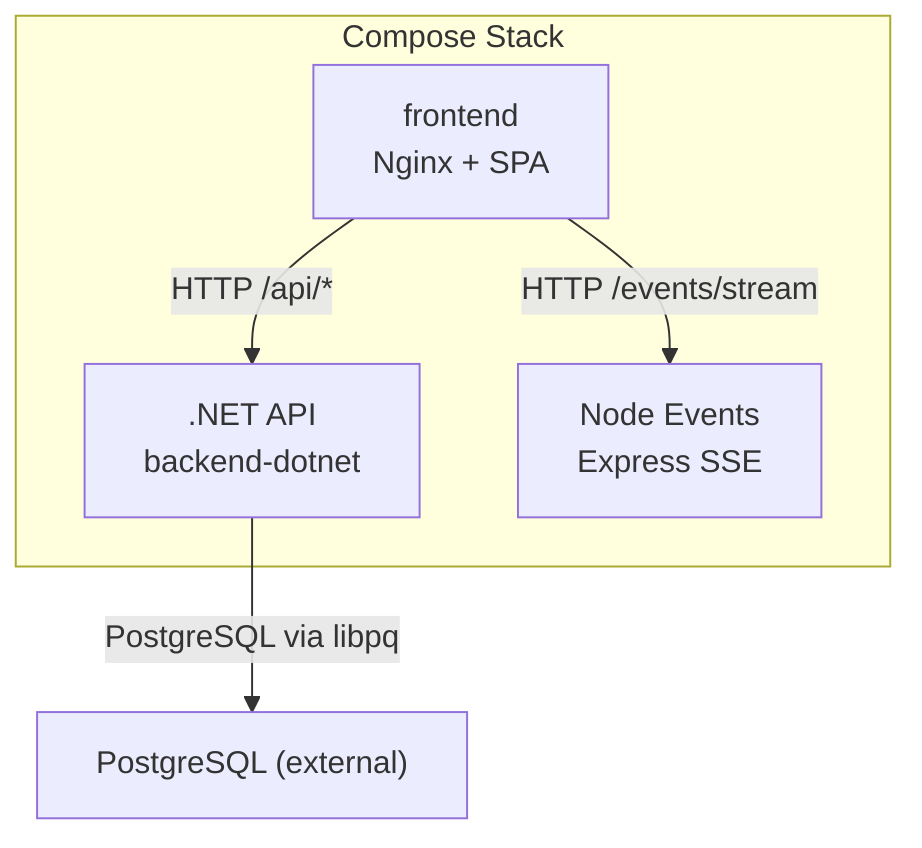
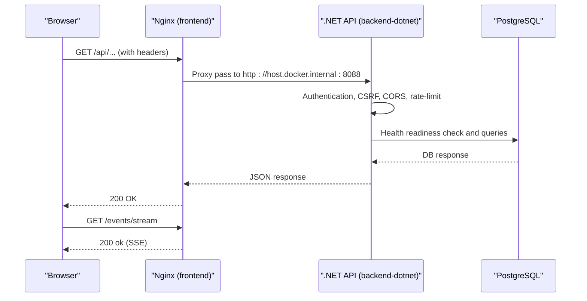
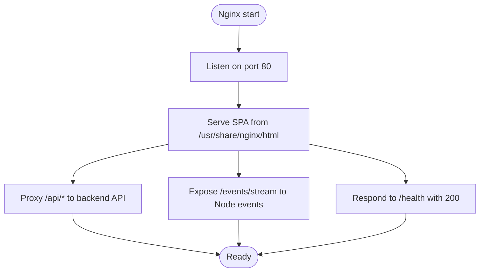
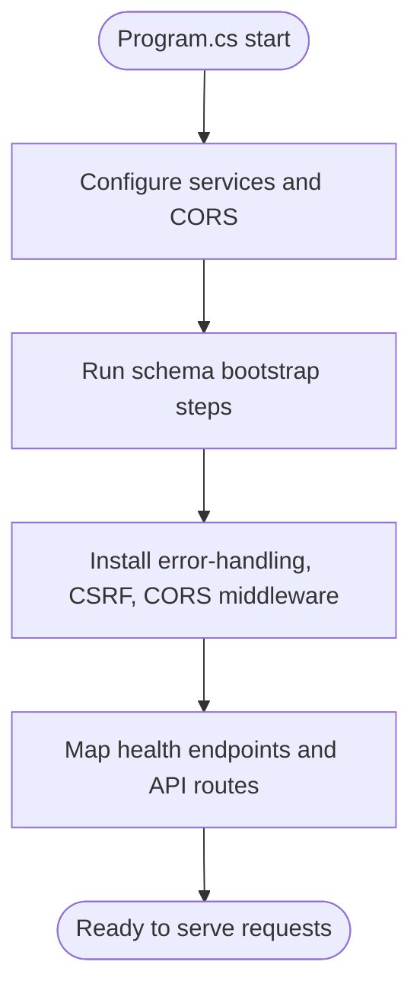
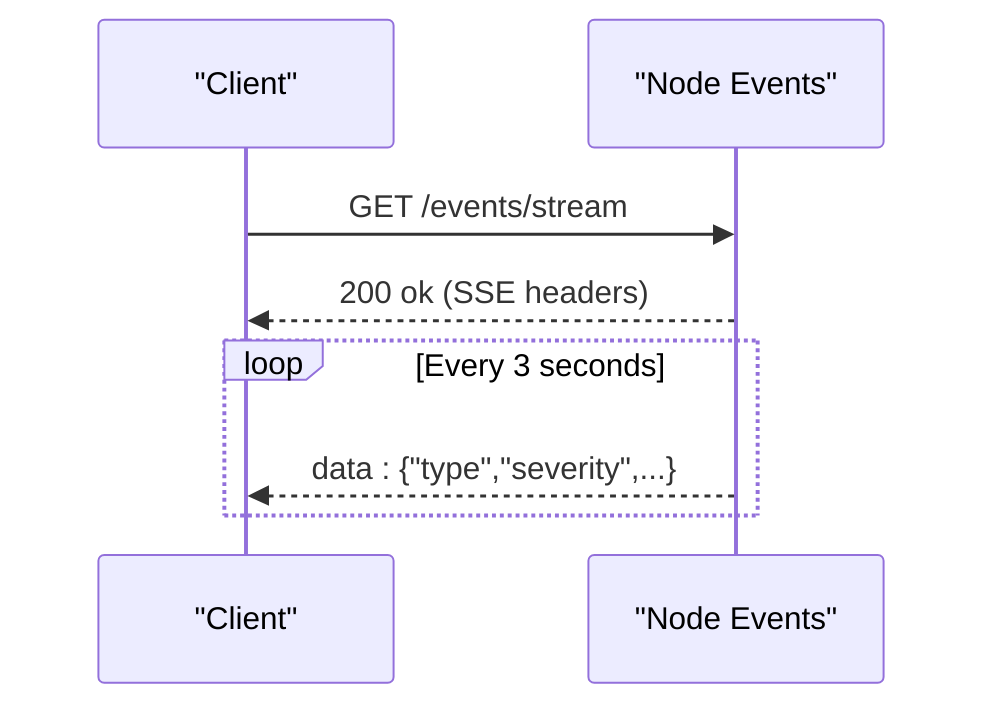
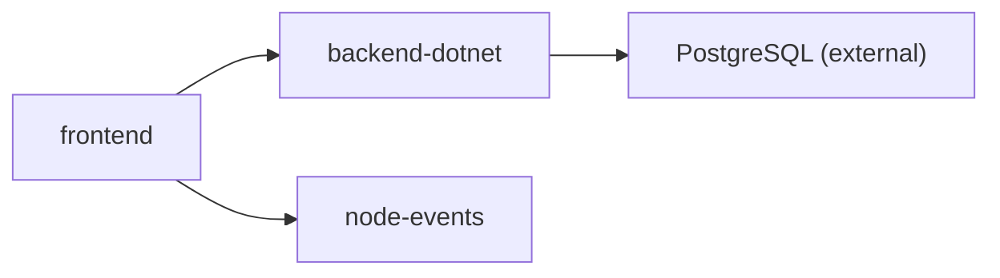

# Docker Compose Configuration

<cite>
**Referenced Files in This Document**
- [docker-compose.yml](file://docker-compose.yml)
- [frontend/Dockerfile](file://frontend/Dockerfile)
- [frontend/nginx.conf](file://frontend/nginx.conf)
- [frontend/package.json](file://frontend/package.json)
- [frontend/.dockerignore](file://frontend/.dockerignore)
- [api-dotnet/Dockerfile](file://api-dotnet/Dockerfile)
- [backend-dotnet/Dockerfile](file://backend-dotnet/Dockerfile)
- [backend-dotnet/Program.cs](file://backend-dotnet/Program.cs)
- [backend-dotnet/Data/Database.cs](file://backend-dotnet/Data/Database.cs)
- [services/node-events/Dockerfile](file://services/node-events/Dockerfile)
- [services/node-events/src/server.js](file://services/node-events/src/server.js)
</cite>

## Table of Contents
1. [Introduction](#introduction)
2. [Project Structure](#project-structure)
3. [Core Components](#core-components)
4. [Architecture Overview](#architecture-overview)
5. [Detailed Component Analysis](#detailed-component-analysis)
6. [Dependency Analysis](#dependency-analysis)
7. [Performance Considerations](#performance-considerations)
8. [Troubleshooting Guide](#troubleshooting-guide)
9. [Conclusion](#conclusion)
10. [Appendices](#appendices)

## Introduction
This document provides comprehensive Docker Compose configuration guidance for the OpsTrax platform. It covers service definitions for the frontend, backend (.NET API), and a supporting Node.js events service, along with environment variables, port mappings, service dependencies, and operational best practices. It also outlines multi-stage builds, image optimization, security hardening, and inter-service communication patterns. Guidance is included for adapting the configuration between local development and production environments.

## Project Structure
The platform consists of three primary services orchestrated via Docker Compose:
- Frontend: Nginx-based static site proxying API and serving SPA assets.
- Backend API: .NET-based REST API with health endpoints and database connectivity.
- Node Events: Express-based SSE endpoint for simulated real-time events.

**Diagram sources**
- [docker-compose.yml:3-44](file://docker-compose.yml#L3-L44)
- [frontend/nginx.conf:12-19](file://frontend/nginx.conf#L12-L19)
- [services/node-events/src/server.js:101-114](file://services/node-events/src/server.js#L101-L114)
- [backend-dotnet/Program.cs:257-294](file://backend-dotnet/Program.cs#L257-L294)

**Section sources**
- [docker-compose.yml:1-45](file://docker-compose.yml#L1-L45)

## Core Components
This section documents each service’s build context, runtime configuration, environment variables, ports, and dependencies.

- Frontend Service
  - Build: Nginx multi-stage image built from the frontend directory.
  - Ports: Publishes host port 10000 to container port 80.
  - Environment: Built with Vite base URLs injected during build.
  - Dependencies: Depends on backend API and Node events service.
  - Restart policy: Unset-stopped restart behavior.
  - Health: Nginx health endpoint returns a simple plaintext response.

- Backend API Service (.NET)
  - Build: Multi-stage .NET SDK build followed by runtime image.
  - Ports: Publishes host port 8088 to container port 8080.
  - Environment:
    - ASPNETCORE_URLS: binds to all interfaces on port 8080.
    - ConnectionStrings:DefaultConnection: configured via external variable.
    - Cors:AllowedOrigins: allows the frontend origin.
  - Dependencies: None declared in Compose; assumes PostgreSQL availability externally.
  - Restart policy: Unset-stopped restart behavior.
  - Health: Provides /health, /health/live, /health/ready, and /health/deep endpoints.

- Node Events Service (Express)
  - Build: Node Alpine image with installed dependencies.
  - Ports: Publishes host port 8090 to container port 8090.
  - Environment:
    - PORT: listening port inside the container.
    - API_BASE_URL: upstream API base URL for internal routing.
    - CORS_ORIGIN: allowed origin for browser clients.
  - Restart policy: Unset-stopped restart behavior.
  - Health: Provides /health endpoint.

**Section sources**
- [docker-compose.yml:4-17](file://docker-compose.yml#L4-L17)
- [docker-compose.yml:19-31](file://docker-compose.yml#L19-L31)
- [docker-compose.yml:32-44](file://docker-compose.yml#L32-L44)
- [frontend/Dockerfile:1-6](file://frontend/Dockerfile#L1-L6)
- [frontend/nginx.conf:12-29](file://frontend/nginx.conf#L12-L29)
- [backend-dotnet/Dockerfile:1-13](file://backend-dotnet/Dockerfile#L1-L13)
- [backend-dotnet/Program.cs:257-294](file://backend-dotnet/Program.cs#L257-L294)
- [services/node-events/Dockerfile:1-8](file://services/node-events/Dockerfile#L1-L8)
- [services/node-events/src/server.js:97-114](file://services/node-events/src/server.js#L97-L114)

## Architecture Overview
The frontend proxies API and SSE traffic to backend services. The backend validates sessions and rate-limits requests, while the Node events service emits simulated events over Server-Sent Events.

**Diagram sources**
- [frontend/nginx.conf:12-19](file://frontend/nginx.conf#L12-L19)
- [backend-dotnet/Program.cs:92-245](file://backend-dotnet/Program.cs#L92-L245)
- [backend-dotnet/Data/Database.cs:10-15](file://backend-dotnet/Data/Database.cs#L10-L15)
- [services/node-events/src/server.js:101-114](file://services/node-events/src/server.js#L101-L114)

## Detailed Component Analysis

### Frontend Service
- Purpose: Serve SPA and proxy API/SSE traffic.
- Build: Nginx image with prebuilt SPA assets.
- Runtime behavior:
  - Proxies /api/* to the backend API.
  - Serves single-page fallback for client-side routing.
  - Exposes a lightweight /health endpoint returning a simple response.
- Ports:
  - Host 10000 -> Container 80.
- Environment:
  - Build-time variables for Vite base URLs.
- Dependencies:
  - Depends on backend API and Node events service.

**Diagram sources**
- [frontend/nginx.conf:1-31](file://frontend/nginx.conf#L1-L31)
- [frontend/Dockerfile:1-6](file://frontend/Dockerfile#L1-L6)

**Section sources**
- [frontend/Dockerfile:1-6](file://frontend/Dockerfile#L1-L6)
- [frontend/nginx.conf:12-29](file://frontend/nginx.conf#L12-L29)
- [frontend/package.json:9-13](file://frontend/package.json#L9-L13)
- [frontend/.dockerignore:1-5](file://frontend/.dockerignore#L1-L5)
- [docker-compose.yml:4-17](file://docker-compose.yml#L4-L17)

### Backend API Service (.NET)
- Purpose: REST API with health endpoints, CORS, CSRF protection, and rate limiting.
- Build: Multi-stage .NET SDK build to runtime image.
- Runtime behavior:
  - Binds to all interfaces on port 8080.
  - Initializes database schema steps and hosted services.
  - Enforces CORS policy from configuration.
  - Implements authentication middleware and rate limiting.
  - Exposes health endpoints for liveness/readiness/deep checks.
- Ports:
  - Host 8088 -> Container 8080.
- Environment:
  - ASPNETCORE_URLS set to bind on port 8080.
  - ConnectionStrings:DefaultConnection via external variable.
  - Cors:AllowedOrigins set to the frontend origin.

**Diagram sources**
- [backend-dotnet/Program.cs:10-90](file://backend-dotnet/Program.cs#L10-L90)
- [backend-dotnet/Program.cs:92-245](file://backend-dotnet/Program.cs#L92-L245)
- [backend-dotnet/Program.cs:257-378](file://backend-dotnet/Program.cs#L257-L378)

**Section sources**
- [backend-dotnet/Dockerfile:1-13](file://backend-dotnet/Dockerfile#L1-L13)
- [backend-dotnet/Program.cs:257-294](file://backend-dotnet/Program.cs#L257-L294)
- [backend-dotnet/Data/Database.cs:10-15](file://backend-dotnet/Data/Database.cs#L10-L15)
- [docker-compose.yml:19-31](file://docker-compose.yml#L19-L31)

### Node Events Service (Express)
- Purpose: Simulate real-time events via Server-Sent Events.
- Build: Node Alpine image with installed dependencies.
- Runtime behavior:
  - Enables Helmet (CSP disabled) and CORS.
  - JSON body parsing with size limit.
  - Emits a curated list of event types at intervals.
  - Provides /health, /events/stream, and demo endpoints.
- Ports:
  - Host 8090 -> Container 8090.
- Environment:
  - PORT, CORS_ORIGIN, API_BASE_URL.

**Diagram sources**
- [services/node-events/src/server.js:101-114](file://services/node-events/src/server.js#L101-L114)

**Section sources**
- [services/node-events/Dockerfile:1-8](file://services/node-events/Dockerfile#L1-L8)
- [services/node-events/src/server.js:97-138](file://services/node-events/src/server.js#L97-L138)
- [docker-compose.yml:32-44](file://docker-compose.yml#L32-L44)

## Dependency Analysis
- Service dependencies:
  - Frontend depends on backend API and Node events service.
- Inter-service communication:
  - Frontend proxies API requests to backend API.
  - Frontend proxies SSE requests to Node events service.
  - Backend API connects to PostgreSQL via libpq.

**Diagram sources**
- [docker-compose.yml:15-17](file://docker-compose.yml#L15-L17)
- [frontend/nginx.conf:12-19](file://frontend/nginx.conf#L12-L19)
- [backend-dotnet/Data/Database.cs:10-15](file://backend-dotnet/Data/Database.cs#L10-L15)

**Section sources**
- [docker-compose.yml:15-17](file://docker-compose.yml#L15-L17)
- [frontend/nginx.conf:12-19](file://frontend/nginx.conf#L12-L19)
- [backend-dotnet/Data/Database.cs:10-15](file://backend-dotnet/Data/Database.cs#L10-L15)

## Performance Considerations
- Image optimization
  - Multi-stage builds reduce runtime image size and attack surface.
  - Alpine-based images minimize footprint.
- Resource limits
  - Consider adding CPU/memory constraints per service in Compose for predictable performance.
- Network and proxy tuning
  - Adjust Nginx worker processes and keepalive timeouts for concurrent connections.
- Database connectivity
  - Use connection pooling and tune pool size based on workload.
- Caching and compression
  - Enable gzip/static caching in Nginx for SPA assets.
- Health checks
  - Add Compose healthchecks for readiness and liveness to improve rollout reliability.

[No sources needed since this section provides general guidance]

## Troubleshooting Guide
- Frontend cannot reach backend API
  - Verify Nginx proxy target matches backend API port and host binding.
  - Confirm CORS configuration allows the frontend origin.
- Backend reports not ready
  - Check database connection string and PostgreSQL availability.
  - Review readiness endpoint response for connectivity errors.
- Node events SSE not received
  - Ensure the frontend is requesting the correct SSE endpoint.
  - Confirm CORS_ORIGIN allows the frontend origin.
- Port conflicts
  - Change published host ports in Compose if 10000, 8088, or 8090 are in use.

**Section sources**
- [frontend/nginx.conf:12-19](file://frontend/nginx.conf#L12-L19)
- [backend-dotnet/Program.cs:257-294](file://backend-dotnet/Program.cs#L257-L294)
- [services/node-events/src/server.js:97-114](file://services/node-events/src/server.js#L97-L114)
- [docker-compose.yml:13-14](file://docker-compose.yml#L13-L14)
- [docker-compose.yml:29-30](file://docker-compose.yml#L29-L30)
- [docker-compose.yml:42-43](file://docker-compose.yml#L42-L43)

## Conclusion
The Docker Compose configuration defines a clear separation of concerns: Nginx serves the SPA and proxies API/SSE traffic, the .NET backend enforces security and business logic with health endpoints, and the Node events service provides simulated real-time updates. By leveraging multi-stage builds, strict CORS, and health endpoints, the stack is both secure and operable. Extending the configuration with health checks, resource limits, and environment-specific overrides enables robust local and production deployments.

[No sources needed since this section summarizes without analyzing specific files]

## Appendices

### Local Development vs Production Configuration Examples
- Local development
  - Use docker-compose up to run services locally.
  - Keep default ports and CORS origin aligned with localhost.
  - Ensure PostgreSQL runs externally or via a Compose volume/service.
- Production
  - Replace host ports with non-conflicting values.
  - Set environment variables for database connection and CORS origins.
  - Add healthchecks, restart policies, and resource limits.
  - Place services behind a reverse proxy or ingress controller.

[No sources needed since this section provides general guidance]

### Security Hardening Checklist
- Disable CSP in development only; enable CSP in production.
- Restrict CORS origins to trusted domains.
- Use HTTPS termination at a reverse proxy in production.
- Limit exposed ports and disable unnecessary services.
- Pin base images to specific versions and rebuild periodically.

[No sources needed since this section provides general guidance]