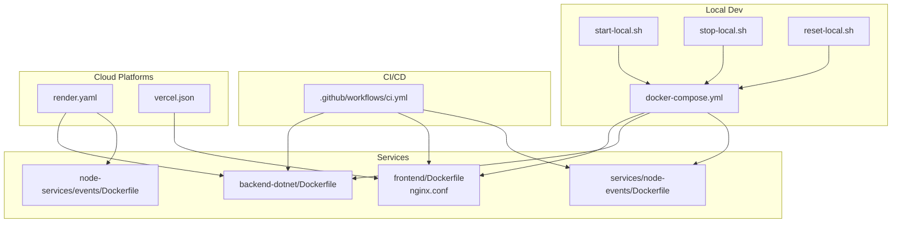
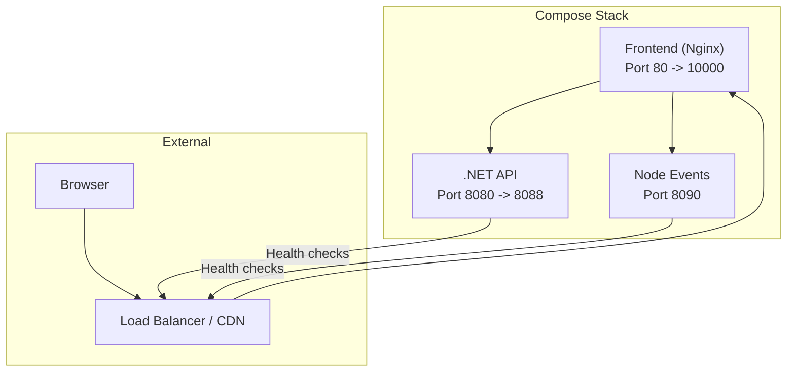
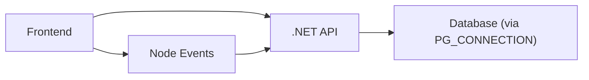

# Orchestration & Deployment

<cite>
**Referenced Files in This Document**
- [docker-compose.yml](file://docker-compose.yml)
- [start-local.sh](file://start-local.sh)
- [stop-local.sh](file://stop-local.sh)
- [reset-local.sh](file://reset-local.sh)
- [render.yaml](file://render.yaml)
- [vercel.json](file://vercel.json)
- [.github/workflows/ci.yml](file://.github/workflows/ci.yml)
- [frontend/Dockerfile](file://frontend/Dockerfile)
- [backend-dotnet/Dockerfile](file://backend-dotnet/Dockerfile)
- [services/node-events/Dockerfile](file://services/node-events/Dockerfile)
- [node-services/events/Dockerfile](file://node-services/events/Dockerfile)
- [frontend/nginx.conf](file://frontend/nginx.conf)
- [backend-dotnet/Program.cs](file://backend-dotnet/Program.cs)
- [services/node-events/src/server.js](file://services/node-events/src/server.js)
- [node-services/events/src/server.js](file://node-services/events/src/server.js)
</cite>

## Table of Contents
1. [Introduction](#introduction)
2. [Project Structure](#project-structure)
3. [Core Components](#core-components)
4. [Architecture Overview](#architecture-overview)
5. [Detailed Component Analysis](#detailed-component-analysis)
6. [Dependency Analysis](#dependency-analysis)
7. [Performance Considerations](#performance-considerations)
8. [Troubleshooting Guide](#troubleshooting-guide)
9. [Conclusion](#conclusion)
10. [Appendices](#appendices)

## Introduction
This document provides comprehensive orchestration and deployment guidance for OpsTrax across development, staging, and production environments. It explains Docker Compose service definitions, networking, and volume mounts; outlines multi-environment deployment strategies; documents CI/CD integration; and details operational practices such as blue-green deployments, rolling updates, rollbacks, service discovery, load balancing, health monitoring, deployment validation, and security hardening.

## Project Structure
The repository includes:
- Docker Compose for local multi-service orchestration
- GitHub Actions CI pipeline
- Render platform configuration for cloud deployment
- Vercel configuration for frontend hosting
- Multi-stage Dockerfiles for frontend, .NET API, and Node event services
- Health endpoints for readiness and liveness checks

**Diagram sources**
- [docker-compose.yml:1-45](file://docker-compose.yml#L1-L45)
- [start-local.sh:1-15](file://start-local.sh#L1-L15)
- [stop-local.sh:1-4](file://stop-local.sh#L1-L4)
- [reset-local.sh:1-11](file://reset-local.sh#L1-L11)
- [.github/workflows/ci.yml:1-52](file://.github/workflows/ci.yml#L1-L52)
- [render.yaml:1-41](file://render.yaml#L1-L41)
- [vercel.json:1-12](file://vercel.json#L1-L12)
- [frontend/Dockerfile:1-6](file://frontend/Dockerfile#L1-L6)
- [backend-dotnet/Dockerfile:1-13](file://backend-dotnet/Dockerfile#L1-L13)
- [services/node-events/Dockerfile:1-8](file://services/node-events/Dockerfile#L1-L8)
- [node-services/events/Dockerfile:1-8](file://node-services/events/Dockerfile#L1-L8)

**Section sources**
- [docker-compose.yml:1-45](file://docker-compose.yml#L1-L45)
- [.github/workflows/ci.yml:1-52](file://.github/workflows/ci.yml#L1-L52)
- [render.yaml:1-41](file://render.yaml#L1-L41)
- [vercel.json:1-12](file://vercel.json#L1-L12)

## Core Components
- Frontend service: Nginx-based image serving prebuilt SPA; configured via nginx.conf; exposed on port 80 inside the container and mapped externally per compose definition.
- .NET API service: Multi-stage Docker build; exposes health endpoints for readiness and liveness; environment-driven configuration for URLs, CORS, and database connection.
- Node events service: Express-based SSE/WS service with health endpoint; configurable CORS origin and port; designed to emit telemetry and event streams.
- Docker Compose: Defines three primary services, interdependencies, port mappings, and environment variables for local development.

Key orchestration elements:
- Service dependencies: Frontend depends_on API and Node events.
- Port mappings: Frontend 10000:80, API 8088:8080, Node events 8090:8090.
- Environment variables: API uses ASP.NET URLs, CORS, and a database connection string; Node events uses PORT and CORS origin.

**Section sources**
- [docker-compose.yml:3-44](file://docker-compose.yml#L3-L44)
- [frontend/Dockerfile:1-6](file://frontend/Dockerfile#L1-L6)
- [backend-dotnet/Dockerfile:1-13](file://backend-dotnet/Dockerfile#L1-L13)
- [services/node-events/Dockerfile:1-8](file://services/node-events/Dockerfile#L1-L8)
- [backend-dotnet/Program.cs:257-294](file://backend-dotnet/Program.cs#L257-L294)
- [services/node-events/src/server.js:97-138](file://services/node-events/src/server.js#L97-L138)

## Architecture Overview
The system comprises a frontend Nginx container, a .NET API container, and a Node events container. Compose orchestrates service startup order, port exposure, and environment configuration. CI builds artifacts and pushes images; cloud platforms deploy and scale services with health checks.

**Diagram sources**
- [docker-compose.yml:4-44](file://docker-compose.yml#L4-L44)
- [backend-dotnet/Program.cs:257-294](file://backend-dotnet/Program.cs#L257-L294)
- [services/node-events/src/server.js:97-138](file://services/node-events/src/server.js#L97-L138)

## Detailed Component Analysis

### Docker Compose Service Definitions
- Frontend service:
  - Builds from frontend context with a Dockerfile.
  - Exposes port 80 internally; mapped to host 10000.
  - Depends on API and Node events.
  - Passes Vite base URLs via build args.
- API service (.NET):
  - Builds from backend-dotnet context.
  - Exposes port 8080; mapped to host 8088.
  - Sets ASP.NET URLs and CORS allowed origins.
  - Reads database connection string from environment variable.
- Node events service:
  - Builds from services/node-events context.
  - Exposes port 8090; mapped to host 8090.
  - Configures PORT, API_BASE_URL, and CORS origin.

Networking:
- Services communicate via service names as hostnames within the Compose network.
- No explicit networks section implies default bridge network usage.

Volumes:
- No named volumes are defined in the provided compose file; persistent storage is not configured here.

**Section sources**
- [docker-compose.yml:4-44](file://docker-compose.yml#L4-L44)

### Local Startup and Lifecycle Scripts
- start-local.sh:
  - Ensures a .env exists, installs and builds frontend, removes orphans, and starts all services with rebuild.
  - Prints helpful URLs for UI, API Swagger, and Node events health.
- stop-local.sh:
  - Stops and removes orphan containers.
- reset-local.sh:
  - Installs/builds frontend, tears down with volumes, removes containers, then starts fresh.

These scripts streamline developer workflows and ensure reproducible local environments.

**Section sources**
- [start-local.sh:1-15](file://start-local.sh#L1-L15)
- [stop-local.sh:1-4](file://stop-local.sh#L1-L4)
- [reset-local.sh:1-11](file://reset-local.sh#L1-L11)

### CI/CD Pipeline Integration
- Trigger conditions:
  - Runs on pull_request and push to main.
- Jobs:
  - Frontend build: installs and builds frontend.
  - Node backend build: installs and builds backend.
  - Node events install: installs node-services/events.
  - .NET build: restores and builds backend-dotnet project.

This pipeline validates builds across components and prepares artifacts for downstream deployment.

**Section sources**
- [.github/workflows/ci.yml:1-52](file://.github/workflows/ci.yml#L1-L52)

### Cloud Deployment Strategies

#### Render Platform
- Two web services are defined:
  - opstrax-api: .NET API built from backend-dotnet with Dockerfile; healthCheckPath set to /health; autoDeploy enabled; environment variables include ASPNETCORE_ENVIRONMENT, ASPNETCORE_URLS, PORT, and PG_CONNECTION.
  - opstrax-events: Node events built from node-services/events with Dockerfile; healthCheckPath set to /health; autoDeploy enabled; environment variables include CORS_ORIGIN and MySQL credentials.

Render’s health checks integrate with the service’s /health endpoints for readiness and liveness.

**Section sources**
- [render.yaml:1-41](file://render.yaml#L1-L41)
- [backend-dotnet/Program.cs:257-294](file://backend-dotnet/Program.cs#L257-L294)
- [node-services/events/src/server.js:30-32](file://node-services/events/src/server.js#L30-L32)

#### Vercel Frontend Hosting
- vercel.json defines install/build commands for the frontend, output directory, and rewrites to serve SPA routes.
- This complements the cloud-hosted backend/API by providing a CDN-backed frontend.

**Section sources**
- [vercel.json:1-12](file://vercel.json#L1-L12)

### Multi-Environment Deployment Strategies
- Development:
  - Use docker-compose with local port mappings and environment variables loaded from .env.
  - Scripts support quick start/stop/reset for iterative development.
- Staging:
  - Mirror Render configuration with environment variables for staging databases and domains.
  - Enable health checks and autoscaling as appropriate.
- Production:
  - Prefer immutable deployments with versioned tags.
  - Use blue-green or rolling updates with health checks gating traffic transitions.
  - Enforce secrets management and certificate provisioning outside the repository.

[No sources needed since this section provides general guidance]

### Blue-Green Deployments and Rolling Updates
- Blue-Green:
  - Maintain two identical environments (blue/green). Route traffic to the inactive environment after validating the new version on the active environment.
  - Use health endpoints to gate traffic switches.
- Rolling Updates:
  - Gradually replace instances with new versions while ensuring minimum healthy replicas remain online.
  - Combine with readiness probes to prevent traffic routing to unhealthy pods.

[No sources needed since this section provides general guidance]

### Rollback Procedures
- Re-deploy the previous known-good image tag.
- Switch traffic back to the previously validated environment.
- Monitor health endpoints and logs during rollback.

[No sources needed since this section provides general guidance]

### Service Discovery and Load Balancing
- Compose:
  - Services resolve each other by service name within the default network.
- Cloud:
  - Render manages routing and load balancing; configure domain names and SSL termination at the platform level.
  - Use platform health checks to gate traffic.

[No sources needed since this section provides general guidance]

### Health Monitoring
- .NET API exposes:
  - /health and /health/live for liveness.
  - /ready and /health/ready for readiness.
  - /health/deep for comprehensive checks including database connectivity and service heartbeats.
- Node events expose:
  - /health for liveness/readiness.

Configure platform health checks to target these endpoints.

**Section sources**
- [backend-dotnet/Program.cs:257-378](file://backend-dotnet/Program.cs#L257-L378)
- [services/node-events/src/server.js:97-138](file://services/node-events/src/server.js#L97-L138)
- [node-services/events/src/server.js:30-32](file://node-services/events/src/server.js#L30-L32)

### Deployment Validation and Smoke Testing
- Validate service health:
  - Call /health, /ready, and /health/ready for API.
  - Call /health for Node events.
- Verify frontend:
  - Confirm SPA loads and navigates to the main route.
  - Ensure API and events endpoints are reachable from the frontend.
- Smoke tests:
  - Navigate to the UI base URL.
  - Trigger a simple API call and confirm response.
  - Connect to Node events SSE/WS and observe events.

[No sources needed since this section provides general guidance]

### Post-Deployment Verification
- End-to-end checks:
  - UI renders and interacts with API.
  - Real-time events stream through Node events.
  - Database connectivity verified by readiness endpoints.
- Monitoring:
  - Observe platform health metrics and logs.

[No sources needed since this section provides general guidance]

### Secrets Management, Certificates, and Security Hardening
- Secrets:
  - Store sensitive values (database passwords, API keys) in platform-managed secret stores or environment variables.
  - Avoid committing secrets to the repository.
- Certificates:
  - Provision TLS certificates at the platform edge (e.g., Render or CDN) and terminate TLS there.
- Security hardening:
  - API:
    - CORS configured via environment variable.
    - Helmet-like headers applied in middleware.
    - Rate limiting and authentication enforced for protected endpoints.
  - Frontend:
    - Nginx serves static assets with minimal configuration; rely on platform CDN for caching and security.
  - Node events:
    - Helmet enabled; CORS configured via environment variable.

**Section sources**
- [backend-dotnet/Program.cs:55-63](file://backend-dotnet/Program.cs#L55-L63)
- [backend-dotnet/Program.cs:92-99](file://backend-dotnet/Program.cs#L92-L99)
- [services/node-events/src/server.js:10-12](file://services/node-events/src/server.js#L10-L12)

## Dependency Analysis
The frontend depends on the API and Node events services. The API depends on the database connection string. The Node events service depends on the API base URL and CORS origin.

**Diagram sources**
- [docker-compose.yml:15-17](file://docker-compose.yml#L15-L17)
- [docker-compose.yml:27](file://docker-compose.yml#L27)
- [docker-compose.yml:40](file://docker-compose.yml#L40)

**Section sources**
- [docker-compose.yml:15-17](file://docker-compose.yml#L15-L17)
- [docker-compose.yml:27](file://docker-compose.yml#L27)
- [docker-compose.yml:40](file://docker-compose.yml#L40)

## Performance Considerations
- Container resource limits and autoscaling should be configured at the platform level for production.
- Use CDN and caching for the frontend to reduce origin load.
- Optimize API and Node events throughput with horizontal scaling and health-based routing.

[No sources needed since this section provides general guidance]

## Troubleshooting Guide
- Frontend not loading:
  - Verify port mapping 10000:80 and that the API and Node events are healthy.
- API readiness failures:
  - Check database connectivity and environment variables for the connection string.
- Node events SSE/WS issues:
  - Confirm CORS origin matches the frontend URL and that the service responds to /health.
- Local cleanup:
  - Use reset-local.sh to remove volumes and restart the stack.

**Section sources**
- [reset-local.sh:8-10](file://reset-local.sh#L8-L10)
- [backend-dotnet/Program.cs:260-294](file://backend-dotnet/Program.cs#L260-L294)
- [services/node-events/src/server.js:97-138](file://services/node-events/src/server.js#L97-L138)

## Conclusion
OpsTrax provides a clear, modular deployment story using Docker Compose for local development, GitHub Actions for CI, and Render/Vercel for cloud hosting. Health endpoints enable robust monitoring and safe rollout strategies. By applying blue-green or rolling update patterns, managing secrets securely, and leveraging platform capabilities for TLS and load balancing, teams can operate reliable, scalable production deployments.

## Appendices

### Appendix A: Local Development Workflow
- Start services: run start-local.sh.
- Stop services: run stop-local.sh.
- Reset and rebuild: run reset-local.sh.

**Section sources**
- [start-local.sh:1-15](file://start-local.sh#L1-L15)
- [stop-local.sh:1-4](file://stop-local.sh#L1-L4)
- [reset-local.sh:1-11](file://reset-local.sh#L1-L11)

### Appendix B: Health Endpoint Reference
- API:
  - /health, /health/live
  - /ready, /health/ready
  - /health/deep
- Node events:
  - /health

**Section sources**
- [backend-dotnet/Program.cs:257-378](file://backend-dotnet/Program.cs#L257-L378)
- [services/node-events/src/server.js:97-138](file://services/node-events/src/server.js#L97-L138)
- [node-services/events/src/server.js:30-32](file://node-services/events/src/server.js#L30-L32)