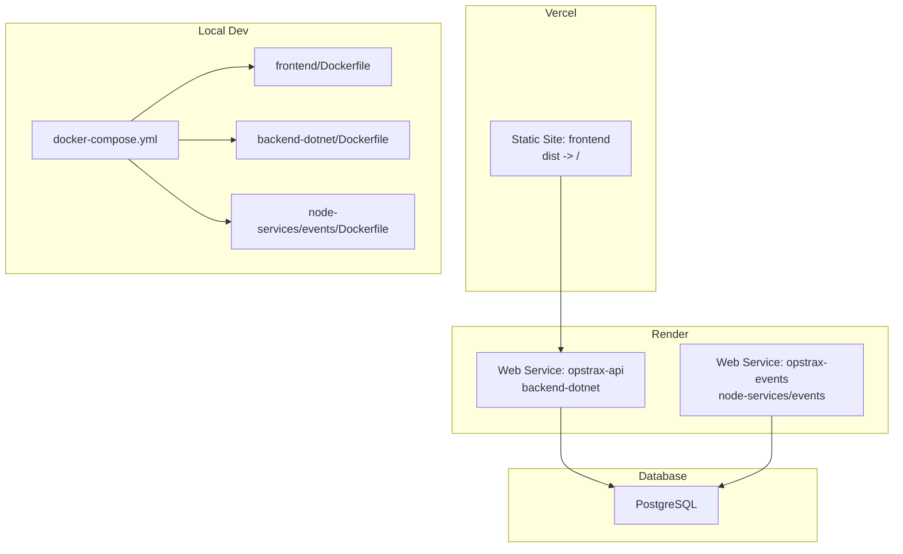
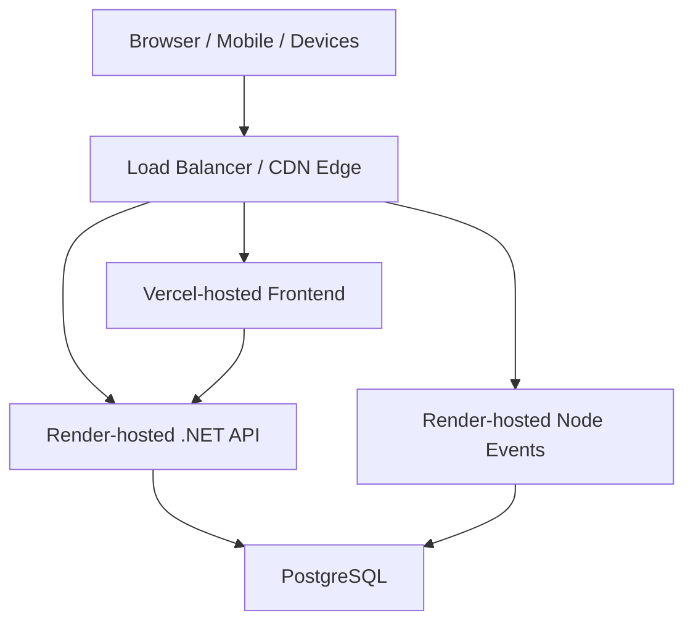
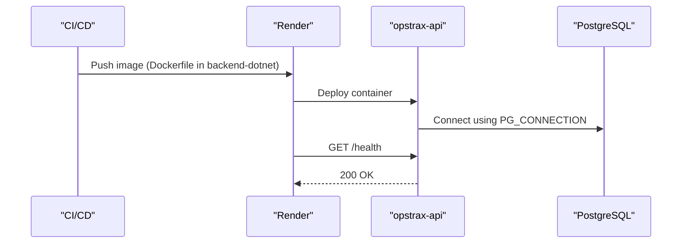
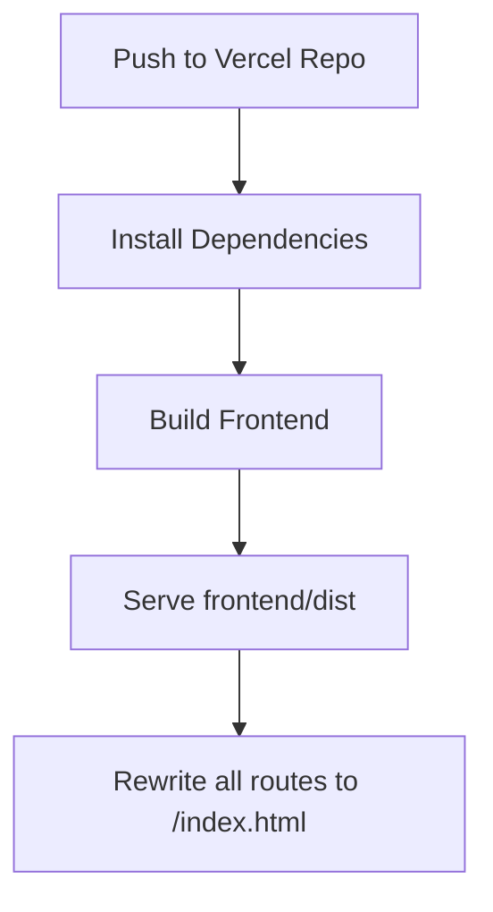
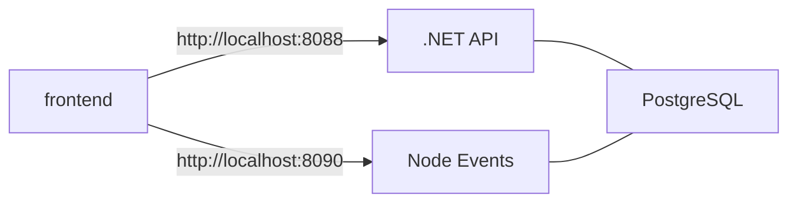
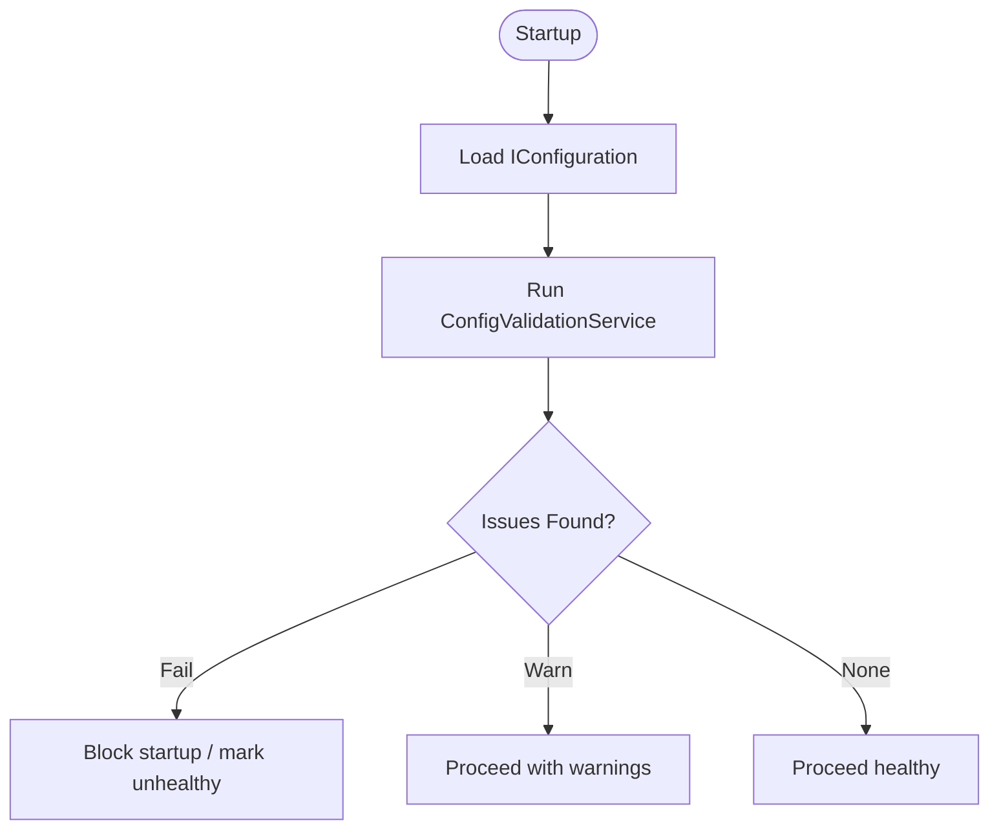
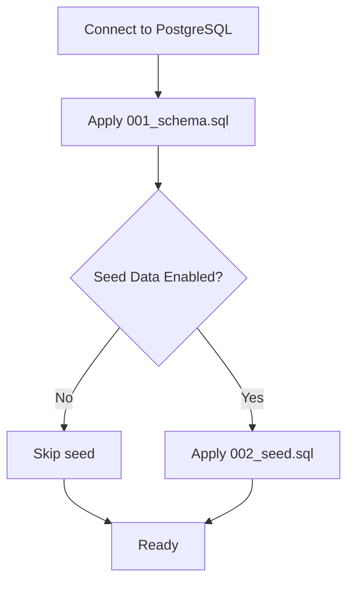
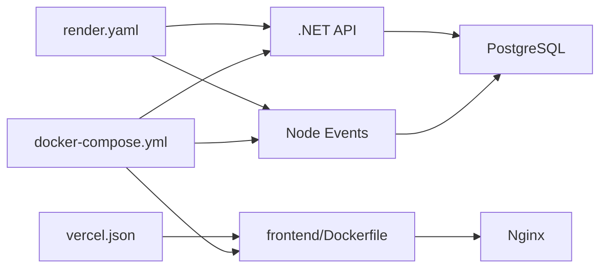

# Production Deployment

<cite>
**Referenced Files in This Document**
- [render.yaml](file://render.yaml)
- [vercel.json](file://vercel.json)
- [docker-compose.yml](file://docker-compose.yml)
- [Dockerfile](file://Dockerfile)
- [backend-dotnet/Dockerfile](file://backend-dotnet/Dockerfile)
- [frontend/Dockerfile](file://frontend/Dockerfile)
- [node-services/events/Dockerfile](file://node-services/events/Dockerfile)
- [services/node-events/Dockerfile](file://services/node-events/Dockerfile)
- [backend-dotnet/Program.cs](file://backend-dotnet/Program.cs)
- [backend-dotnet/Data/Database.cs](file://backend-dotnet/Data/Database.cs)
- [backend-dotnet/Middleware/ErrorHandlingMiddleware.cs](file://backend-dotnet/Middleware/ErrorHandlingMiddleware.cs)
- [backend-dotnet/Services/ConfigValidationService.cs](file://backend-dotnet/Services/ConfigValidationService.cs)
- [database/init/001_schema.sql](file://database/init/001_schema.sql)
- [database/init/002_seed.sql](file://database/init/002_seed.sql)
- [db/init/001_schema.sql](file://db/init/001_schema.sql)
- [db/init/002_seed.sql](file://db/init/002_seed.sql)
</cite>

## Table of Contents
1. [Introduction](#introduction)
2. [Project Structure](#project-structure)
3. [Core Components](#core-components)
4. [Architecture Overview](#architecture-overview)
5. [Detailed Component Analysis](#detailed-component-analysis)
6. [Dependency Analysis](#dependency-analysis)
7. [Performance Considerations](#performance-considerations)
8. [Troubleshooting Guide](#troubleshooting-guide)
9. [Conclusion](#conclusion)
10. [Appendices](#appendices)

## Introduction
This document provides production-grade deployment guidance for OpsTrax across cloud platforms and local environments. It covers Render and Vercel deployment strategies, environment variable and secrets management, configuration validation, database migrations and seeding, backups and disaster recovery, load balancing and SSL/TLS, CDN integration, observability and metrics, and end-to-end deployment checklists with pre/post validation and rollback procedures.

## Project Structure
OpsTrax comprises:
- Frontend built with React and served via Nginx in a containerized deployment
- Backend API written in .NET 8, exposing health/readiness endpoints and Swagger
- Node.js event streaming service
- PostgreSQL database with schema and seed scripts
- Container orchestration via Docker Compose for local development
- Platform-specific deployment manifests for Render and Vercel

**Diagram sources**
- [render.yaml:1-41](file://render.yaml#L1-L41)
- [vercel.json:1-12](file://vercel.json#L1-L12)
- [docker-compose.yml:1-45](file://docker-compose.yml#L1-L45)
- [frontend/Dockerfile:1-6](file://frontend/Dockerfile#L1-L6)
- [backend-dotnet/Dockerfile:1-13](file://backend-dotnet/Dockerfile#L1-L13)
- [node-services/events/Dockerfile:1-8](file://node-services/events/Dockerfile#L1-L8)

**Section sources**
- [render.yaml:1-41](file://render.yaml#L1-L41)
- [vercel.json:1-12](file://vercel.json#L1-L12)
- [docker-compose.yml:1-45](file://docker-compose.yml#L1-L45)

## Core Components
- API Service (Render web service): .NET 8 backend with health endpoints, CORS, rate limiting, and schema bootstrapping
- Event Streaming Service (Render web service): Node.js SSE endpoint for telemetry streams
- Frontend (Vercel): Static React site served via Nginx container locally; Vercel static build in production
- Database: PostgreSQL with normalized schema and seed data for demonstration and testing
- Local Orchestration: docker-compose for frontend, API, and event service containers

Key production capabilities:
- Health probes: /health, /health/live, /health/ready, /health/deep
- Configuration validation: runtime checks for secrets and environment
- Database connectivity abstraction and migrations via schema services
- CORS and CSRF middleware for security hardening

**Section sources**
- [backend-dotnet/Program.cs:249-378](file://backend-dotnet/Program.cs#L249-L378)
- [backend-dotnet/Services/ConfigValidationService.cs:15-96](file://backend-dotnet/Services/ConfigValidationService.cs#L15-L96)
- [backend-dotnet/Data/Database.cs:10-15](file://backend-dotnet/Data/Database.cs#L10-L15)
- [backend-dotnet/Middleware/ErrorHandlingMiddleware.cs:6-21](file://backend-dotnet/Middleware/ErrorHandlingMiddleware.cs#L6-L21)

## Architecture Overview

**Diagram sources**
- [render.yaml:1-41](file://render.yaml#L1-L41)
- [vercel.json:1-12](file://vercel.json#L1-L12)
- [backend-dotnet/Program.cs:249-378](file://backend-dotnet/Program.cs#L249-L378)

## Detailed Component Analysis

### Render Deployment Strategy
Render supports two web services:
- opstrax-api: .NET backend containerized under backend-dotnet
- opstrax-events: Node.js event streaming containerized under node-services/events

Environment variables:
- opstrax-api
  - ASPNETCORE_ENVIRONMENT: Production
  - ASPNETCORE_URLS: http://0.0.0.0:8080
  - PORT: 8080
  - PG_CONNECTION: externalized (Render does not sync secrets by default)
- opstrax-events
  - CORS_ORIGIN: externalized
  - MYSQL_HOST, MYSQL_PORT, MYSQL_DATABASE, MYSQL_USER, MYSQL_PASSWORD: externalized

Health checks:
- Both services use /health for health check path

Auto-deploy:
- Enabled for both services

**Diagram sources**
- [render.yaml:1-41](file://render.yaml#L1-L41)
- [backend-dotnet/Dockerfile:1-13](file://backend-dotnet/Dockerfile#L1-L13)
- [backend-dotnet/Program.cs:257-294](file://backend-dotnet/Program.cs#L257-L294)

**Section sources**
- [render.yaml:1-41](file://render.yaml#L1-L41)

### Vercel Deployment Strategy
Vercel configuration builds the frontend and serves the static output:
- Install: cd frontend && npm install --no-audit --no-fund
- Build: cd frontend && npm run build
- Output: frontend/dist
- Rewrites: single-page app rewrite to serve index.html for all routes

**Diagram sources**
- [vercel.json:1-12](file://vercel.json#L1-L12)

**Section sources**
- [vercel.json:1-12](file://vercel.json#L1-L12)

### Local Docker Compose (Reference)
docker-compose defines three services:
- frontend: Nginx serving dist, ports mapped 10000:80, depends on API and events
- api-dotnet: .NET backend, environment variables for connection and CORS, ports 8088:8080
- node-events: Node.js events, environment variables for API base URL and CORS, ports 8090:8090

**Diagram sources**
- [docker-compose.yml:1-45](file://docker-compose.yml#L1-L45)

**Section sources**
- [docker-compose.yml:1-45](file://docker-compose.yml#L1-L45)

### Environment Variables and Secrets Management
Render-managed variables:
- opstrax-api
  - PG_CONNECTION: database connection string (Render does not sync secrets by default; treat as secret)
  - ASPNETCORE_ENVIRONMENT: Production
  - ASPNETCORE_URLS: http://0.0.0.0:8080
  - PORT: 8080
- opstrax-events
  - CORS_ORIGIN: comma-separated origins
  - MYSQL_HOST, MYSQL_PORT, MYSQL_DATABASE, MYSQL_USER, MYSQL_PASSWORD: externalized

Recommendations:
- Store secrets in Render’s encrypted environment variables
- Avoid committing secrets to version control
- Use separate environment blocks for dev/stage/prod
- Rotate keys regularly and maintain key versioning

**Section sources**
- [render.yaml:10-40](file://render.yaml#L10-L40)

### Configuration Validation
The API validates configuration at runtime and on deep health checks:
- JWT signing key length and presence
- Database connection string
- Telemetry device HMAC secret
- SSE ticket key
- Environment mode (prefer Production)
- Demo seed data flag
- Email SMTP provider
- CORS origins
- Report scheduler toggle

**Diagram sources**
- [backend-dotnet/Program.cs:296-378](file://backend-dotnet/Program.cs#L296-L378)
- [backend-dotnet/Services/ConfigValidationService.cs:15-96](file://backend-dotnet/Services/ConfigValidationService.cs#L15-L96)

**Section sources**
- [backend-dotnet/Services/ConfigValidationService.cs:15-96](file://backend-dotnet/Services/ConfigValidationService.cs#L15-L96)
- [backend-dotnet/Program.cs:296-378](file://backend-dotnet/Program.cs#L296-L378)

### Database Migrations and Seeding
Two schema sets are provided:
- PostgreSQL schema and seed (preferred for production)
- MySQL-derived schema and seed (for legacy/demo)

Production guidance:
- Use database/init/*.sql for PostgreSQL deployments
- Apply schema first, then seed data
- Keep seed data disabled in production unless explicitly required for demos
- Version control schema changes and automate via CI/CD

**Diagram sources**
- [database/init/001_schema.sql:1-20](file://database/init/001_schema.sql#L1-L20)
- [database/init/002_seed.sql:1-20](file://database/init/002_seed.sql#L1-L20)
- [db/init/001_schema.sql:1-20](file://db/init/001_schema.sql#L1-L20)
- [db/init/002_seed.sql:1-20](file://db/init/002_seed.sql#L1-L20)

**Section sources**
- [database/init/001_schema.sql:1-20](file://database/init/001_schema.sql#L1-L20)
- [database/init/002_seed.sql:1-20](file://database/init/002_seed.sql#L1-L20)
- [db/init/001_schema.sql:1-20](file://db/init/001_schema.sql#L1-L20)
- [db/init/002_seed.sql:1-20](file://db/init/002_seed.sql#L1-L20)

### Load Balancing and SSL/TLS
- Use a CDN or reverse proxy in front of Render/Vercel for TLS termination and caching
- Configure domain certificates at the CDN edge; Render and Vercel handle origin-to-edge encryption
- Enforce HTTPS redirects at the CDN level
- Consider enabling HTTP/2 and OCSP stapling at the CDN

[No sources needed since this section provides general guidance]

### CDN Integration
- Serve frontend from Vercel edge networks
- Cache static assets aggressively; set appropriate cache-control headers
- Use CDN-managed origin shield to reduce origin load
- Enable compression (gzip/br) and minification at the CDN

[No sources needed since this section provides general guidance]

### Monitoring and Alerting
- Health endpoints:
  - /health/live: process liveness
  - /health/ready: DB connectivity
  - /health/deep: comprehensive checks including DB, background services, and configuration
- Use CDN/edge health checks to monitor global availability
- Log aggregation: centralize logs from Render and Vercel; ship to SIEM or log analytics
- Metrics: track response latency, error rates, throughput, and database query times
- Alert thresholds: CPU/memory/disk on Render instances; DB latency; 5xx errors; deep health degradation

**Section sources**
- [backend-dotnet/Program.cs:257-378](file://backend-dotnet/Program.cs#L257-L378)

### Error Handling and Resilience
- Global error middleware returns generic 500 responses and logs exceptions
- Health endpoints return structured JSON for automation
- Rate limiting protects APIs from abuse
- CORS and CSRF middleware enhance browser security

**Section sources**
- [backend-dotnet/Middleware/ErrorHandlingMiddleware.cs:6-21](file://backend-dotnet/Middleware/ErrorHandlingMiddleware.cs#L6-L21)
- [backend-dotnet/Program.cs:92-103](file://backend-dotnet/Program.cs#L92-L103)
- [backend-dotnet/Program.cs:105-127](file://backend-dotnet/Program.cs#L105-L127)

## Dependency Analysis

**Diagram sources**
- [frontend/Dockerfile:1-6](file://frontend/Dockerfile#L1-L6)
- [backend-dotnet/Dockerfile:1-13](file://backend-dotnet/Dockerfile#L1-L13)
- [node-services/events/Dockerfile:1-8](file://node-services/events/Dockerfile#L1-L8)
- [render.yaml:1-41](file://render.yaml#L1-L41)
- [vercel.json:1-12](file://vercel.json#L1-L12)
- [docker-compose.yml:1-45](file://docker-compose.yml#L1-L45)

**Section sources**
- [render.yaml:1-41](file://render.yaml#L1-L41)
- [vercel.json:1-12](file://vercel.json#L1-L12)
- [docker-compose.yml:1-45](file://docker-compose.yml#L1-L45)

## Performance Considerations
- Container sizing: provision adequate CPU/memory for .NET API and Node events
- Database pooling: tune connection limits and timeouts
- CDN caching: cache static assets and API responses where safe
- Compression: enable gzip/br at CDN and origin
- Health checks: keep lightweight; avoid heavy operations in /health

[No sources needed since this section provides general guidance]

## Troubleshooting Guide
Common production issues and resolutions:
- Unhealthy /health/deep
  - Verify database connectivity and credentials
  - Check background service heartbeats and logs
- CORS errors
  - Ensure allowed origins are explicitly configured and not wildcards
- Rate limiting
  - Reduce client-side polling frequency or implement exponential backoff
- Missing secrets
  - Confirm Render environment variables are set and not synced unintentionally
- 500 errors
  - Review global error logs and stack traces

**Section sources**
- [backend-dotnet/Program.cs:296-378](file://backend-dotnet/Program.cs#L296-L378)
- [backend-dotnet/Middleware/ErrorHandlingMiddleware.cs:6-21](file://backend-dotnet/Middleware/ErrorHandlingMiddleware.cs#L6-L21)
- [backend-dotnet/Services/ConfigValidationService.cs:76-82](file://backend-dotnet/Services/ConfigValidationService.cs#L76-L82)

## Conclusion
OpsTrax can be deployed reliably on Render and Vercel with strong separation of concerns between frontend, API, and event services. Robust configuration validation, health endpoints, and database schema management enable safe production operations. Adopt CDN and centralized logging for performance and observability, and enforce strict secrets management and environment controls.

[No sources needed since this section summarizes without analyzing specific files]

## Appendices

### Deployment Checklists
- Pre-deployment
  - Review and lock down environment variables (Render)
  - Validate database connectivity and schema
  - Confirm CORS origins and JWT/HMAC keys
  - Disable demo seed data in production
- Deployment
  - Build and push images for API and events
  - Build frontend via Vercel
  - Promote to production environment
- Post-deployment
  - Verify /health/live, /health/ready, /health/deep
  - Smoke test API endpoints and event streaming
  - Confirm CDN caching and HTTPS

[No sources needed since this section provides general guidance]

### Rollback Procedures
- Reverse to prior images for API and events on Render
- Revert frontend to previous Vercel deployment
- Restore database from recent backup if schema or data was changed
- Monitor /health/deep and logs during rollback

[No sources needed since this section provides general guidance]

### Emergency Response Protocols
- Critical incident escalation
  - Notify on-call team via pager/integration
  - Freeze new deployments until resolved
- Immediate actions
  - Scale up instances if needed
  - Temporarily relax rate limits for affected clients
  - Redirect traffic away from failing regions
- Post-mortem
  - Document root cause and remediation steps
  - Update runbooks and alert thresholds

[No sources needed since this section provides general guidance]