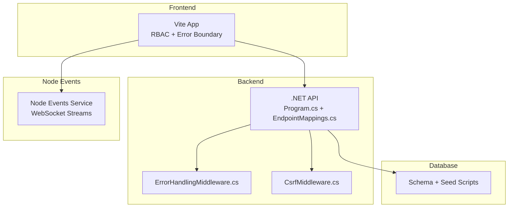
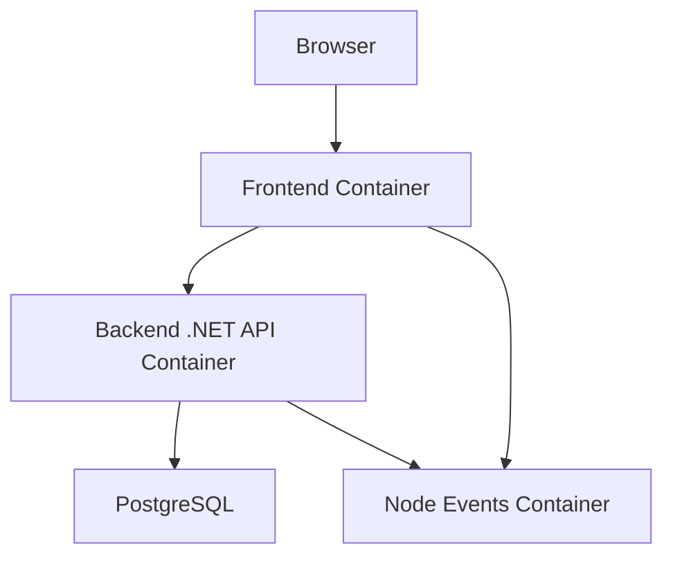
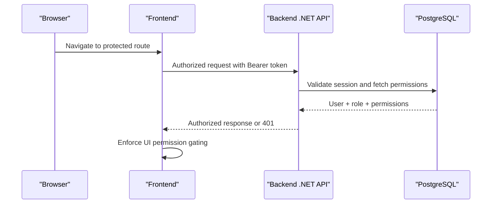
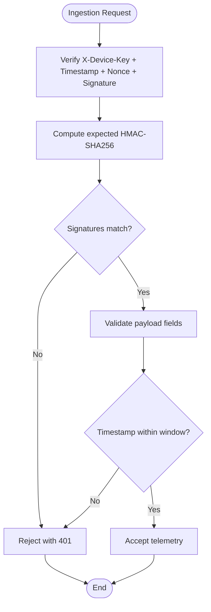
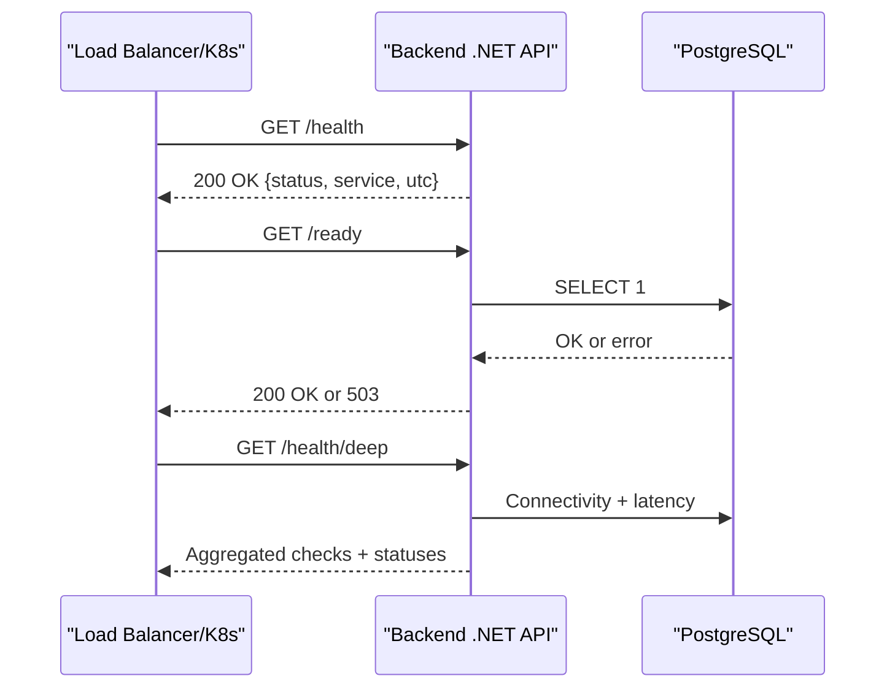
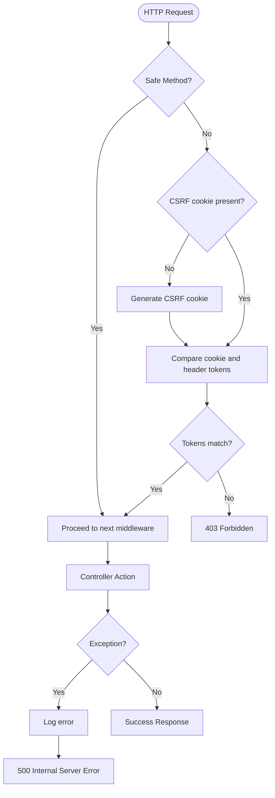
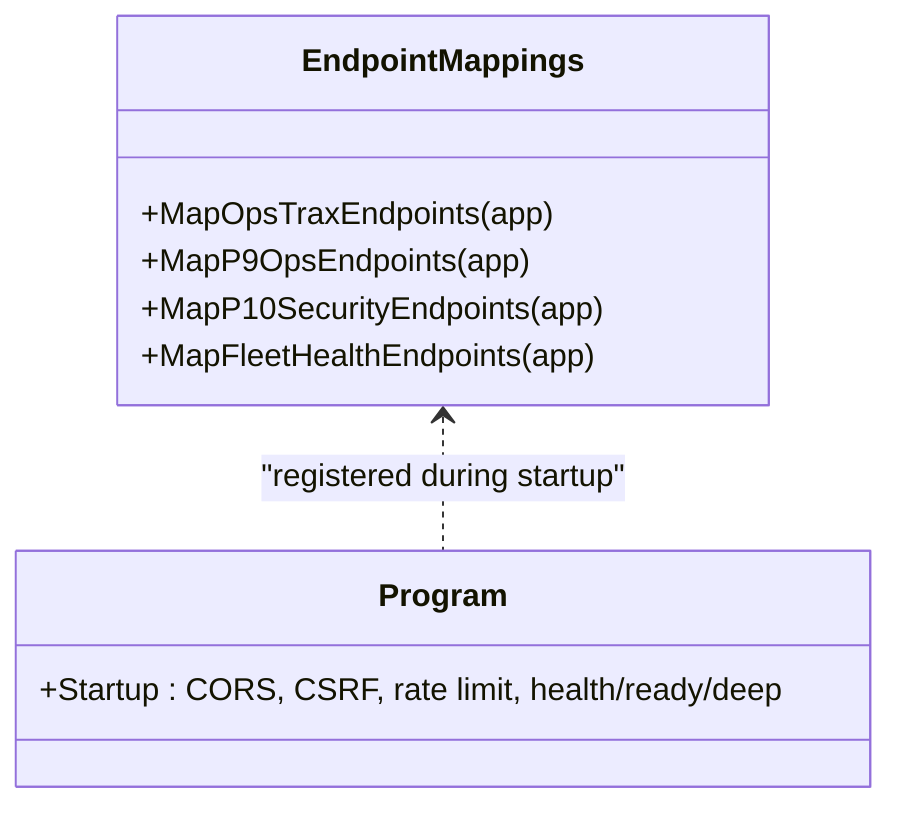
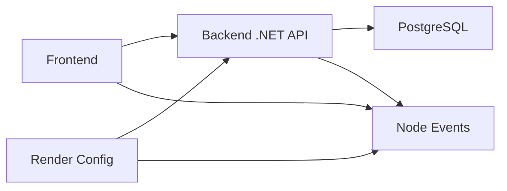

# Production Readiness

<cite>
**Referenced Files in This Document**
- [PRODUCTION_QA_MATRIX.md](file://PRODUCTION_QA_MATRIX.md)
- [PRODUCTION_READINESS.md](file://PRODUCTION_READINESS.md)
- [FINAL_HARDENING_REPORT.md](file://docs/FINAL_HARDENING_REPORT.md)
- [NEXT_PRODUCTION_ROADMAP.md](file://docs/NEXT_PRODUCTION_ROADMAP.md)
- [docker-compose.yml](file://docker-compose.yml)
- [render.yaml](file://render.yaml)
- [Program.cs](file://backend-dotnet/Program.cs)
- [EndpointMappings.cs](file://backend-dotnet/Controllers/EndpointMappings.cs)
- [ErrorHandlingMiddleware.cs](file://backend-dotnet/Middleware/ErrorHandlingMiddleware.cs)
- [CsrfMiddleware.cs](file://backend-dotnet/Middleware/CsrfMiddleware.cs)
- [TelemetryHmacHelper.cs](file://backend-dotnet/TelemetryHmacHelper.cs)
- [TelemetryKeyStore.cs](file://backend-dotnet/TelemetryKeyStore.cs)
- [TelemetryTicketHelper.cs](file://backend-dotnet/TelemetryTicketHelper.cs)
- [rbacConfig.ts](file://frontend/src/auth/rbacConfig.ts)
- [001_schema.sql](file://db/init/001_schema.sql)
- [002_seed.sql](file://db/init/002_seed.sql)
</cite>

## Table of Contents
1. [Introduction](#introduction)
2. [Project Structure](#project-structure)
3. [Core Components](#core-components)
4. [Architecture Overview](#architecture-overview)
5. [Detailed Component Analysis](#detailed-component-analysis)
6. [Dependency Analysis](#dependency-analysis)
7. [Performance Considerations](#performance-considerations)
8. [Troubleshooting Guide](#troubleshooting-guide)
9. [Conclusion](#conclusion)
10. [Appendices](#appendices)

## Introduction
This document provides production readiness guidance for OpsTrax enterprise deployment. It consolidates the current posture, operational checks, recovery notes, and UAT checklist from the repository’s production documentation. It also synthesizes security hardening tasks, compliance considerations, infrastructure requirements, observability, and operational runbooks referenced in the roadmap and hardening report. The goal is to enable teams to validate readiness, plan hardening, and operate the system reliably in production.

## Project Structure
The repository is a multi-service, multi-language monorepo with:
- Frontend built with Vite and TypeScript, enforcing RBAC and permission-aware UI states.
- Backend .NET API exposing 200+ REST endpoints mapped by module and supporting health/ready probes.
- Node events service for real-time WebSocket streams.
- Database initialization scripts and seed data for schema and demo content.
- Deployment configurations for Render and Docker Compose.

**Diagram sources**
- [docker-compose.yml:1-45](file://docker-compose.yml#L1-L45)
- [render.yaml:1-41](file://render.yaml#L1-L41)
- [Program.cs:1-452](file://backend-dotnet/Program.cs#L1-L452)
- [EndpointMappings.cs:1-800](file://backend-dotnet/Controllers/EndpointMappings.cs#L1-L800)
- [ErrorHandlingMiddleware.cs:1-22](file://backend-dotnet/Middleware/ErrorHandlingMiddleware.cs#L1-L22)
- [CsrfMiddleware.cs:1-62](file://backend-dotnet/Middleware/CsrfMiddleware.cs#L1-L62)
- [001_schema.sql](file://db/init/001_schema.sql)
- [002_seed.sql](file://db/init/002_seed.sql)

**Section sources**
- [docker-compose.yml:1-45](file://docker-compose.yml#L1-L45)
- [render.yaml:1-41](file://render.yaml#L1-L41)
- [Program.cs:1-452](file://backend-dotnet/Program.cs#L1-L452)
- [EndpointMappings.cs:1-800](file://backend-dotnet/Controllers/EndpointMappings.cs#L1-L800)

## Core Components
- Frontend: Vite application with RBAC constants and role-permission matrices, ensuring UI actions respect permissions and rendering permission-denied states gracefully.
- Backend: .NET API with CORS, CSRF protection, rate limiting, health/ready/deep probes, and comprehensive endpoint mapping across modules.
- Node Events: WebSocket service for real-time updates and telemetry streams.
- Database: PostgreSQL schema and seed scripts for initial state and demo data.

**Section sources**
- [PRODUCTION_READINESS.md:5-7](file://PRODUCTION_READINESS.md#L5-L7)
- [rbacConfig.ts:1-404](file://frontend/src/auth/rbacConfig.ts#L1-L404)
- [Program.cs:55-103](file://backend-dotnet/Program.cs#L55-L103)
- [docker-compose.yml:1-45](file://docker-compose.yml#L1-L45)
- [001_schema.sql](file://db/init/001_schema.sql)
- [002_seed.sql](file://db/init/002_seed.sql)

## Architecture Overview
The system comprises three primary containers orchestrated by Docker Compose and deployed via Render. The frontend communicates with the .NET API and Node events service. The API enforces authentication, authorization, and tenant scoping, while the Node service emits real-time events.

**Diagram sources**
- [docker-compose.yml:1-45](file://docker-compose.yml#L1-L45)
- [render.yaml:1-41](file://render.yaml#L1-L41)

## Detailed Component Analysis

### Authentication, Authorization, and RBAC
- Frontend RBAC: Centralized permission constants and role-to-permissions mapping define granular capabilities across modules.
- Backend authentication: Session-based middleware validates bearer tokens, injects user/company context, and aggregates permissions from user and role scopes.
- CSRF protection: Cookie-based CSRF token generation and validation for state-changing requests.
- Permissions coverage: Verified across modules in the production QA matrix, ensuring UI actions align with backend permissions.

**Diagram sources**
- [Program.cs:190-244](file://backend-dotnet/Program.cs#L190-L244)
- [rbacConfig.ts:326-364](file://frontend/src/auth/rbacConfig.ts#L326-L364)

**Section sources**
- [rbacConfig.ts:1-404](file://frontend/src/auth/rbacConfig.ts#L1-L404)
- [Program.cs:190-244](file://backend-dotnet/Program.cs#L190-L244)
- [PRODUCTION_QA_MATRIX.md:3-57](file://PRODUCTION_QA_MATRIX.md#L3-L57)

### Telemetry Ingestion and Streaming
- Device ingestion: HMAC-SHA256 signature verification using canonical request components and body hash.
- Stream tickets: Short-lived signed tokens (SST) for Server-Sent Events (SSE) without embedding long-lived session tokens in URLs.
- Validation helpers: Coordinate range checks, speed bounds, and freshness windows.

**Diagram sources**
- [TelemetryHmacHelper.cs:1-33](file://backend-dotnet/TelemetryHmacHelper.cs#L1-L33)
- [TelemetryTicketHelper.cs:1-51](file://backend-dotnet/TelemetryTicketHelper.cs#L1-L51)

**Section sources**
- [TelemetryHmacHelper.cs:1-33](file://backend-dotnet/TelemetryHmacHelper.cs#L1-L33)
- [TelemetryTicketHelper.cs:1-51](file://backend-dotnet/TelemetryTicketHelper.cs#L1-L51)
- [TelemetryKeyStore.cs:1-12](file://backend-dotnet/TelemetryKeyStore.cs#L1-L12)

### Health, Readiness, and Deep Probes
- Health endpoints: Live, ready, and deep probes expose service status and DB connectivity.
- Deep probe: Aggregates DB latency, background service heartbeats, and configuration validation results.

**Diagram sources**
- [Program.cs:257-378](file://backend-dotnet/Program.cs#L257-L378)

**Section sources**
- [Program.cs:257-378](file://backend-dotnet/Program.cs#L257-L378)

### Error Handling and CSRF Protection
- Unhandled exceptions: Centralized error handler returns standardized failure responses and logs errors.
- CSRF middleware: Generates and validates CSRF tokens for non-safe methods, with exemptions for login and health endpoints.

**Diagram sources**
- [ErrorHandlingMiddleware.cs:1-22](file://backend-dotnet/Middleware/ErrorHandlingMiddleware.cs#L1-L22)
- [CsrfMiddleware.cs:1-62](file://backend-dotnet/Middleware/CsrfMiddleware.cs#L1-L62)

**Section sources**
- [ErrorHandlingMiddleware.cs:1-22](file://backend-dotnet/Middleware/ErrorHandlingMiddleware.cs#L1-L22)
- [CsrfMiddleware.cs:1-62](file://backend-dotnet/Middleware/CsrfMiddleware.cs#L1-L62)

### Endpoint Coverage and Module Surface
- EndpointMappings registers hundreds of REST endpoints across modules (vehicles, drivers, dispatch, safety, maintenance, compliance, reporting, etc.).
- Public endpoints include health, telemetry ingest/stream, and customer-facing tracking.

**Diagram sources**
- [EndpointMappings.cs:19-382](file://backend-dotnet/Controllers/EndpointMappings.cs#L19-L382)
- [Program.cs:19-90](file://backend-dotnet/Program.cs#L19-L90)

**Section sources**
- [EndpointMappings.cs:19-382](file://backend-dotnet/Controllers/EndpointMappings.cs#L19-L382)
- [Program.cs:19-90](file://backend-dotnet/Program.cs#L19-L90)

## Dependency Analysis
- Frontend depends on backend endpoints and Node events for real-time updates.
- Backend depends on PostgreSQL for persistence and Node events for telemetry streams.
- Render configuration defines health checks and environment variables for the API and events service.

**Diagram sources**
- [docker-compose.yml:1-45](file://docker-compose.yml#L1-L45)
- [render.yaml:1-41](file://render.yaml#L1-L41)

**Section sources**
- [docker-compose.yml:1-45](file://docker-compose.yml#L1-L45)
- [render.yaml:1-41](file://render.yaml#L1-L41)

## Performance Considerations
- Current state: The repository demonstrates foundational health/ready probes and basic rate limiting. Additional performance hardening is outlined in the roadmap (indexes, caching, structured logging, APM, frontend bundling, CDN).
- Recommended actions:
  - Add database indexes on tenant and frequently filtered columns.
  - Introduce API response caching for high-frequency read endpoints.
  - Enable structured logging and APM for observability.
  - Implement frontend route-level code splitting and CDN for static assets.

[No sources needed since this section provides general guidance]

## Troubleshooting Guide
- Health probes: Verify /health, /ready, and /health/deep return expected statuses.
- Authentication: Confirm bearer token presence and validity; ensure session not expired.
- Permissions: Validate UI actions are disabled when missing permissions; confirm backend denies unauthorized access.
- Telemetry: Check device signatures and SST issuance/expiration; ensure fresh timestamps and valid coordinates/speed ranges.
- Error handling: Inspect centralized error logs and standardized failure responses.

**Section sources**
- [Program.cs:257-378](file://backend-dotnet/Program.cs#L257-L378)
- [Program.cs:190-244](file://backend-dotnet/Program.cs#L190-L244)
- [TelemetryTicketHelper.cs:15-36](file://backend-dotnet/TelemetryTicketHelper.cs#L15-L36)
- [ErrorHandlingMiddleware.cs:1-22](file://backend-dotnet/Middleware/ErrorHandlingMiddleware.cs#L1-L22)

## Conclusion
OpsTrax currently provides a robust foundation for production with RBAC, CSRF protection, health probes, and telemetry security. The roadmap outlines critical hardening steps for security, multi-tenant isolation, live integrations, AI/LLM, payments, and observability. Teams should prioritize the tasks in the roadmap, aligning with the QA matrix and hardening report to achieve enterprise-grade readiness.

[No sources needed since this section summarizes without analyzing specific files]

## Appendices

### Production Quality Assurance Matrix
- The QA matrix documents module coverage, route permissions, data sources, and notes across modules. It confirms pass/fail status for UI features and backend protections.

**Section sources**
- [PRODUCTION_QA_MATRIX.md:3-57](file://PRODUCTION_QA_MATRIX.md#L3-L57)

### Security Hardening and Compliance Considerations
- Hardening report details route audits, backend endpoint coverage, multi-language support, country compliance framework, security posture, and known build constraints.
- Roadmap outlines security and auth hardening (signed JWTs, password hashing, row-level isolation, HTTPS enforcement, rate limiting, CORS lockdown, secrets management), along with regulatory compliance tasks.

**Section sources**
- [FINAL_HARDENING_REPORT.md:9-157](file://docs/FINAL_HARDENING_REPORT.md#L9-L157)
- [NEXT_PRODUCTION_ROADMAP.md:10-118](file://docs/NEXT_PRODUCTION_ROADMAP.md#L10-L118)

### Infrastructure Requirements and Deployment
- Docker Compose: Defines frontend, backend, and Node events services with ports and environment variables.
- Render: Configures health checks, environment variables, and auto-deploy settings for the API and events service.

**Section sources**
- [docker-compose.yml:1-45](file://docker-compose.yml#L1-L45)
- [render.yaml:1-41](file://render.yaml#L1-L41)

### Monitoring and Observability
- Health endpoints (/health, /ready, /health/deep) provide liveness/readiness and deep status.
- Roadmap recommends structured logging, APM, and frontend bundling for improved observability.

**Section sources**
- [Program.cs:257-378](file://backend-dotnet/Program.cs#L257-L378)
- [NEXT_PRODUCTION_ROADMAP.md:71-81](file://docs/NEXT_PRODUCTION_ROADMAP.md#L71-L81)

### Backup and Disaster Recovery
- Recovery notes specify restoring database from backups, versioning tenant-scoped assets, and rolling back to known-good images.

**Section sources**
- [PRODUCTION_READINESS.md:15-19](file://PRODUCTION_READINESS.md#L15-L19)

### Operational Runbooks and Change Management
- Operational checks include building frontend/backend and .NET projects.
- UAT checklist ensures login success, route protection, core page loads, persistence, health endpoints, and graceful error states.

**Section sources**
- [PRODUCTION_READINESS.md:9-29](file://PRODUCTION_READINESS.md#L9-L29)

### Database Schema and Seed Data
- Schema and seed scripts initialize tables and demo data for development and testing.

**Section sources**
- [001_schema.sql](file://db/init/001_schema.sql)
- [002_seed.sql](file://db/init/002_seed.sql)