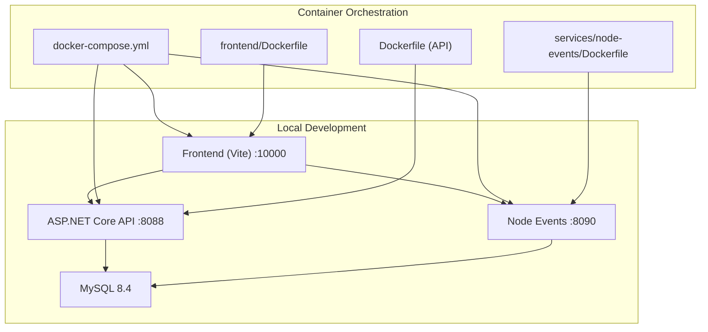
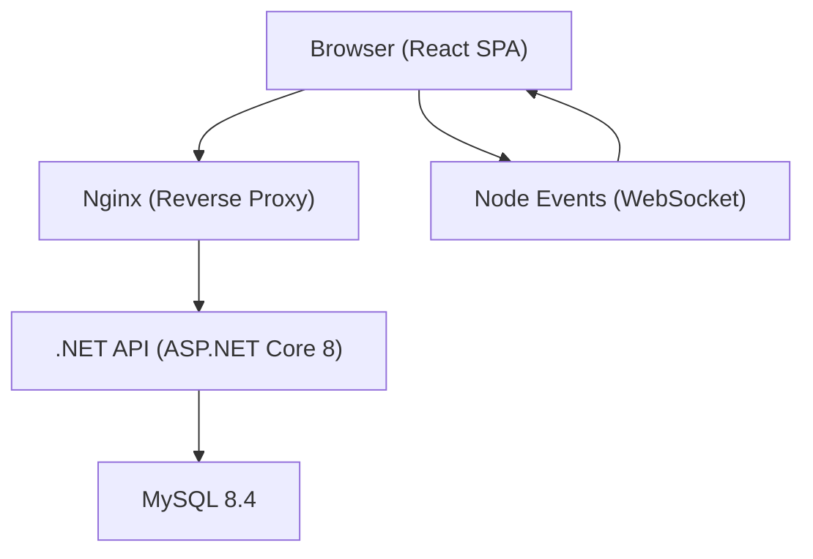
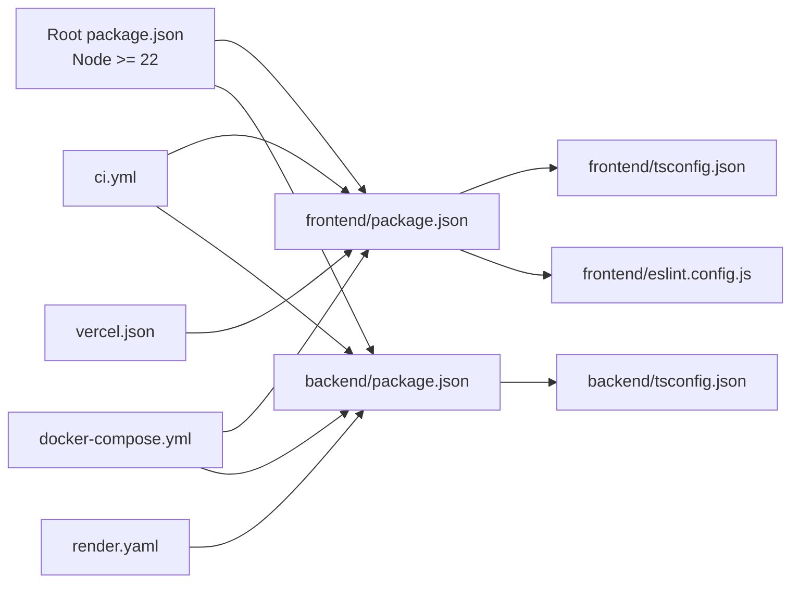

# Development Guidelines

<cite>
**Referenced Files in This Document**
- [README.md](file://README.md)
- [package.json](file://package.json)
- [frontend/package.json](file://frontend/package.json)
- [backend/package.json](file://backend/package.json)
- [frontend/tsconfig.json](file://frontend/tsconfig.json)
- [backend/tsconfig.json](file://backend/tsconfig.json)
- [frontend/eslint.config.js](file://frontend/eslint.config.js)
- [.github/workflows/ci.yml](file://.github/workflows/ci.yml)
- [start-local.sh](file://start-local.sh)
- [reset-local.sh](file://reset-local.sh)
- [stop-local.sh](file://stop-local.sh)
- [run-tests.sh](file://run-tests.sh)
- [docker-compose.yml](file://docker-compose.yml)
- [Dockerfile](file://Dockerfile)
- [render.yaml](file://render.yaml)
- [vercel.json](file://vercel.json)
- [docs/ARCHITECTURE.md](file://docs/ARCHITECTURE.md)
- [docs/API_ENDPOINTS.md](file://docs/API_ENDPOINTS.md)
- [docs/NEXT_BUILD_SEQUENCE.md](file://docs/NEXT_BUILD_SEQUENCE.md)
- [docs/NEXT_PRODUCTION_ROADMAP.md](file://docs/NEXT_PRODUCTION_ROADMAP.md)
- [docs/MODULE_COVERAGE_MATRIX.md](file://docs/MODULE_COVERAGE_MATRIX.md)
- [docs/FINAL_HARDENING_REPORT.md](file://docs/FINAL_HARDENING_REPORT.md)
- [docs/KNOWN_LIMITATIONS.md](file://docs/KNOWN_LIMITATIONS.md)
- [docs/LOGIN_RBAC_CSRF.md](file://docs/LOGIN_RBAC_CSRF.md)
- [PRODUCTION_QA_MATRIX.md](file://PRODUCTION_QA_MATRIX.md)
- [PRODUCTION_READINESS.md](file://PRODUCTION_READINESS.md)
</cite>

## Table of Contents
1. [Introduction](#introduction)
2. [Project Structure](#project-structure)
3. [Core Components](#core-components)
4. [Architecture Overview](#architecture-overview)
5. [Detailed Component Analysis](#detailed-component-analysis)
6. [Dependency Analysis](#dependency-analysis)
7. [Performance Considerations](#performance-considerations)
8. [Troubleshooting Guide](#troubleshooting-guide)
9. [Release and Versioning](#release-and-versioning)
10. [Contribution Guidelines](#contribution-guidelines)
11. [Appendices](#appendices)

## Introduction
This document defines the contributor workflow and development standards for OpsTrax. It consolidates code standards, naming conventions, architectural patterns, branching and commit conventions, pull request processes, code review expectations, testing and quality gates, linting and formatting, monorepo structure, dependency management, local development, debugging, release and changelog practices, and documentation standards. The goal is to ensure consistent, reliable, and secure contributions across the frontend, backend, and supporting services.

## Project Structure
OpsTrax is a multi-service, containerized platform with:
- Frontend (React 19, TypeScript, Vite)
- Backend API (ASP.NET Core 8, C#)
- Node Events service (WebSocket streaming)
- Database (MySQL 8.4)
- Supporting scripts and CI/CD configurations

**Diagram sources**
- [docker-compose.yml:1-45](file://docker-compose.yml#L1-L45)
- [Dockerfile:1-14](file://Dockerfile#L1-L14)
- [frontend/Dockerfile](file://frontend/Dockerfile)
- [services/node-events/Dockerfile](file://services/node-events/Dockerfile)

**Section sources**
- [README.md:1-166](file://README.md#L1-L166)
- [docker-compose.yml:1-45](file://docker-compose.yml#L1-L45)

## Core Components
- Frontend (React 19, TypeScript, Vite): Provides the user interface, routing, stateful data fetching via TanStack Query, and real-time updates via WebSocket.
- Backend API (.NET 8 Minimal API): Exposes REST endpoints, enforces RBAC, and integrates with MySQL.
- Node Events: WebSocket service broadcasting live fleet events to clients.
- Database: MySQL 8.4 with auto-migrating schema and seeded demo data.
- CI/CD: GitHub Actions job validating frontend build, backend build, and .NET build.

**Section sources**
- [README.md:24-34](file://README.md#L24-L34)
- [.github/workflows/ci.yml:1-52](file://.github/workflows/ci.yml#L1-L52)

## Architecture Overview
The platform follows a layered architecture:
- Presentation: React SPA served via Vite and proxied by Nginx in production.
- API: ASP.NET Core 8 REST API with JWT-style sessions and RBAC.
- Data: MySQL 8.4 with auto-migration and seed data.
- Streaming: Node Events WebSocket service for real-time updates.

**Diagram sources**
- [README.md:117-142](file://README.md#L117-L142)
- [docker-compose.yml:1-45](file://docker-compose.yml#L1-L45)

## Detailed Component Analysis

### Frontend Development Standards
- Language and Toolchain
  - TypeScript strict mode enabled.
  - Vite for dev/build/preview.
  - ESLint flat config with recommended rules and React-specific plugins.
- Naming Conventions
  - Feature-based folder layout under src/modules and src/pages.
  - Hooks prefixed with use*, e.g., useAuth, useLiveTelemetry.
  - Services named with Api suffix, e.g., dispatchApi.ts, complianceApi.ts.
  - Components PascalCase, e.g., DriverDashboardPage.tsx.
- Formatting and Linting
  - ESLint configured via flat config with browser globals and React refresh hooks.
  - Run lint via npm script; ensure no warnings or errors before submitting PRs.
- Type Safety
  - Strict tsconfig with ES2022 target and DOM libraries.
  - Path aliases (@/*) configured for cleaner imports.
- Real-Time Updates
  - WebSocket client integration via dedicated hooks and event streams.

**Section sources**
- [frontend/tsconfig.json:1-26](file://frontend/tsconfig.json#L1-L26)
- [frontend/eslint.config.js:1-30](file://frontend/eslint.config.js#L1-L30)
- [frontend/package.json:1-42](file://frontend/package.json#L1-L42)

### Backend (Node.js) Development Standards
- Language and Toolchain
  - TypeScript strict mode enabled.
  - Express-based server with middleware for error handling and logging.
  - Zod for schema validation.
- Naming Conventions
  - Registry and route files per domain/module (e.g., compliance.registry.ts, compliance.routes.ts).
  - Types colocated with modules (e.g., compliance.types.ts).
- Testing and Quality Gates
  - Type-check via tsc --noEmit.
  - Build via tsc; start via node dist/server.js.
- Security
  - Helmet, CORS, and Morgan included in dependencies.

**Section sources**
- [backend/tsconfig.json:1-16](file://backend/tsconfig.json#L1-L16)
- [backend/package.json:1-39](file://backend/package.json#L1-L39)

### Backend API (.NET/C#) Standards
- Language and Toolchain
  - ASP.NET Core 8 Minimal API with C# 12.
  - Docker multi-stage build for deployment.
- Middleware and Security
  - Error handling and CSRF middleware present in backend-dotnet.
  - RBAC enforced at endpoint level (see docs).
- Telemetry and Background Services
  - HMAC helpers and background services for telemetry and governance.
- Testing
  - Test projects for multiple domains; run via dotnet test with fresh builds.

**Section sources**
- [README.md:28-34](file://README.md#L28-L34)
- [backend-dotnet/Controllers/EndpointMappings.cs](file://backend-dotnet/Controllers/EndpointMappings.cs)
- [backend-dotnet/Middleware/ErrorHandlingMiddleware.cs](file://backend-dotnet/Middleware/ErrorHandlingMiddleware.cs)
- [backend-dotnet/Middleware/CsrfMiddleware.cs](file://backend-dotnet/Middleware/CsrfMiddleware.cs)
- [backend-dotnet/Services/TelemetryHmacHelper.cs](file://backend-dotnet/TelemetryHmacHelper.cs)
- [backend-dotnet/Services/TelemetryKeyStore.cs](file://backend-dotnet/TelemetryKeyStore.cs)
- [backend-dotnet/Services/TelemetryTicketHelper.cs](file://backend-dotnet/TelemetryTicketHelper.cs)

### Node Events Service Standards
- Language and Toolchain
  - Node.js 20 with Express and ws for WebSocket.
- Ports and Environment
  - Default port 8090; CORS origin configurable.
- Health Checks
  - Health endpoint exposed for orchestration.

**Section sources**
- [docker-compose.yml:32-44](file://docker-compose.yml#L32-L44)

### Database and Schema
- Database
  - MySQL 8.4 with auto-migrating schema and seeded data.
- Initialization
  - SQL scripts under db/init and database/init.

**Section sources**
- [README.md:20-21](file://README.md#L20-L21)
- [db/init/001_schema.sql](file://db/init/001_schema.sql)
- [db/init/002_seed.sql](file://db/init/002_seed.sql)

### CI/CD and Quality Gates
- CI Job
  - Builds frontend and backend, restores and builds .NET project.
  - Runs on pull requests and pushes to main.
- Local Verification
  - run-tests.sh enforces fresh builds and type checks before running tests.

**Section sources**
- [.github/workflows/ci.yml:1-52](file://.github/workflows/ci.yml#L1-L52)
- [run-tests.sh:1-88](file://run-tests.sh#L1-L88)

## Dependency Analysis
- Monorepo Layout
  - Root package.json pins Node >= 22 for the repo.
  - Frontend and backend packages define their own engines and scripts.
- Containerization
  - docker-compose orchestrates frontend, .NET API, and Node Events.
  - render.yaml and vercel.json define cloud deployments.
- External Dependencies
  - Frontend: React 19, TanStack Query, Tailwind CSS, Axios, Leaflet, Recharts.
  - Backend: Express, Helmet, Morgan, CORS, Zod.
  - .NET: Minimal APIs, middleware stack, and services for telemetry and compliance.

**Diagram sources**
- [package.json:1-7](file://package.json#L1-L7)
- [frontend/package.json:1-42](file://frontend/package.json#L1-L42)
- [backend/package.json:1-39](file://backend/package.json#L1-L39)
- [frontend/tsconfig.json:1-26](file://frontend/tsconfig.json#L1-L26)
- [backend/tsconfig.json:1-16](file://backend/tsconfig.json#L1-L16)
- [frontend/eslint.config.js:1-30](file://frontend/eslint.config.js#L1-L30)
- [.github/workflows/ci.yml:1-52](file://.github/workflows/ci.yml#L1-L52)
- [docker-compose.yml:1-45](file://docker-compose.yml#L1-L45)
- [render.yaml:1-41](file://render.yaml#L1-L41)
- [vercel.json:1-12](file://vercel.json#L1-L12)

**Section sources**
- [package.json:1-7](file://package.json#L1-L7)
- [frontend/package.json:1-42](file://frontend/package.json#L1-L42)
- [backend/package.json:1-39](file://backend/package.json#L1-L39)

## Performance Considerations
- Use strict TypeScript settings to catch performance-impacting issues early.
- Prefer lazy-loading heavy components and data modules in the frontend.
- Minimize unnecessary re-renders by leveraging React.memo and query caching.
- Keep WebSocket connections efficient; avoid redundant broadcasts.
- Optimize database queries and ensure proper indexing in schema migrations.

## Troubleshooting Guide
- Local Setup
  - Use start-local.sh to initialize environment, rebuild frontend, and start all services.
  - Use reset-local.sh to clean volumes and containers before restarting.
  - Use stop-local.sh to gracefully shut down services.
- Tests
  - run-tests.sh ensures fresh builds and type checks before running backend and frontend validations.
- CI Failures
  - Verify Node version and engine constraints.
  - Confirm frontend and backend builds succeed locally before pushing.

**Section sources**
- [start-local.sh:1-15](file://start-local.sh#L1-L15)
- [reset-local.sh:1-11](file://reset-local.sh#L1-L11)
- [stop-local.sh:1-4](file://stop-local.sh#L1-L4)
- [run-tests.sh:1-88](file://run-tests.sh#L1-L88)
- [.github/workflows/ci.yml:1-52](file://.github/workflows/ci.yml#L1-L52)

## Release and Versioning
- Versioning Strategy
  - Semantic versioning is recommended for packages and releases.
  - Tag releases consistently and maintain a changelog.
- Changelog Maintenance
  - Track breaking changes, features, fixes, and deprecations per release.
- Release Artifacts
  - Multi-stage Docker builds produce optimized images for API and Node Events.
  - Frontend built via Vite and deployed via static hosting (vercel.json).
- Cloud Deployments
  - render.yaml configures health checks and environment variables for API and Node Events.
  - vercel.json configures frontend build and output directory.

**Section sources**
- [Dockerfile:1-14](file://Dockerfile#L1-L14)
- [render.yaml:1-41](file://render.yaml#L1-L41)
- [vercel.json:1-12](file://vercel.json#L1-L12)

## Contribution Guidelines

### Branching and Commit Conventions
- Branch Strategy
  - Use feature branches for new work; merge via pull requests targeting main.
- Commit Messages
  - Use imperative mood; keep subject concise but descriptive.
  - Reference issue numbers when applicable.
- Pull Requests
  - Include a summary, rationale, and testing notes.
  - Ensure CI passes and code review approval is obtained.

### Code Review Guidelines
- Review Checklist
  - Correctness: Does the change address the stated problem?
  - Tests: Are new tests added or existing tests updated?
  - Security: Are inputs validated and RBAC enforced?
  - Performance: Are there unnecessary computations or network calls?
  - Style: Are naming conventions followed and linting clean?
- Approval Policy
  - Require at least one maintainer approval before merging.

### Testing Requirements and Quality Gates
- Backend (.NET)
  - Fresh builds and tests via dotnet test; avoid --no-build.
- Frontend
  - Type check via tsc --noEmit.
  - Production build via npm run build.
- CI
  - All jobs must pass before merging.

**Section sources**
- [.github/workflows/ci.yml:1-52](file://.github/workflows/ci.yml#L1-L52)
- [run-tests.sh:1-88](file://run-tests.sh#L1-L88)

### Code Standards and Formatting
- Frontend
  - ESLint flat config with recommended rules; run npm run lint.
  - Strict tsconfig with DOM and ES2022 targets.
- Backend (Node.js)
  - Strict tsconfig and tsc type checks.
- .NET
  - Follow minimal API patterns; enforce RBAC and middleware usage.

**Section sources**
- [frontend/eslint.config.js:1-30](file://frontend/eslint.config.js#L1-L30)
- [frontend/tsconfig.json:1-26](file://frontend/tsconfig.json#L1-L26)
- [backend/tsconfig.json:1-16](file://backend/tsconfig.json#L1-L16)

### Debugging Procedures
- Local Debugging
  - Start services with start-local.sh; inspect logs from docker compose.
  - Use browser dev tools for frontend; attach debugger to Node.js processes if needed.
- API Debugging
  - Use Swagger/OpenAPI endpoints exposed by the .NET API.
- WebSocket Debugging
  - Verify health endpoints and connection logs for Node Events.

**Section sources**
- [start-local.sh:1-15](file://start-local.sh#L1-L15)
- [docker-compose.yml:1-45](file://docker-compose.yml#L1-L45)

### Documentation Standards
- Maintain documentation in docs/ and alongside code where appropriate.
- Reference product modules, architecture, endpoints, and coverage matrices.
- Update documentation when introducing new features or changing behavior.

**Section sources**
- [docs/ARCHITECTURE.md](file://docs/ARCHITECTURE.md)
- [docs/API_ENDPOINTS.md](file://docs/API_ENDPOINTS.md)
- [docs/MODULE_COVERAGE_MATRIX.md](file://docs/MODULE_COVERAGE_MATRIX.md)
- [docs/NEXT_BUILD_SEQUENCE.md](file://docs/NEXT_BUILD_SEQUENCE.md)
- [docs/NEXT_PRODUCTION_ROADMAP.md](file://docs/NEXT_PRODUCTION_ROADMAP.md)
- [docs/FINAL_HARDENING_REPORT.md](file://docs/FINAL_HARDENING_REPORT.md)
- [docs/KNOWN_LIMITATIONS.md](file://docs/KNOWN_LIMITATIONS.md)
- [docs/LOGIN_RBAC_CSRF.md](file://docs/LOGIN_RBAC_CSRF.md)
- [PRODUCTION_QA_MATRIX.md](file://PRODUCTION_QA_MATRIX.md)
- [PRODUCTION_READINESS.md](file://PRODUCTION_READINESS.md)

## Appendices

### Local Development Setup
- Prerequisites
  - Docker and Docker Compose installed.
  - Node >= 22 (as defined in root and frontend/backend package.json).
- Steps
  - Copy .env.example to .env if needed.
  - Run start-local.sh to build frontend and start all services.
  - Access:
    - Frontend: http://localhost:10000
    - API Swagger: http://localhost:8088/swagger
    - Node Events health: http://localhost:8090/health

**Section sources**
- [start-local.sh:1-15](file://start-local.sh#L1-L15)
- [README.md:67-81](file://README.md#L67-L81)

### CI/CD Pipeline
- Triggers
  - Pull requests and pushes to main.
- Jobs
  - Frontend build, Node backend build, Node events install, .NET build.

**Section sources**
- [.github/workflows/ci.yml:1-52](file://.github/workflows/ci.yml#L1-L52)

### Deployment Targets
- Render (API and Node Events)
  - Health checks, environment variables, and auto-deploy enabled.
- Vercel (Frontend)
  - Install and build commands; static output directory.

**Section sources**
- [render.yaml:1-41](file://render.yaml#L1-L41)
- [vercel.json:1-12](file://vercel.json#L1-L12)