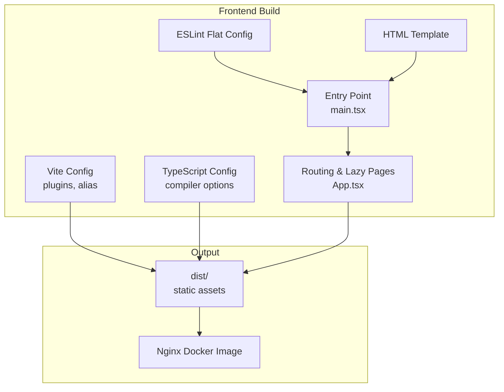
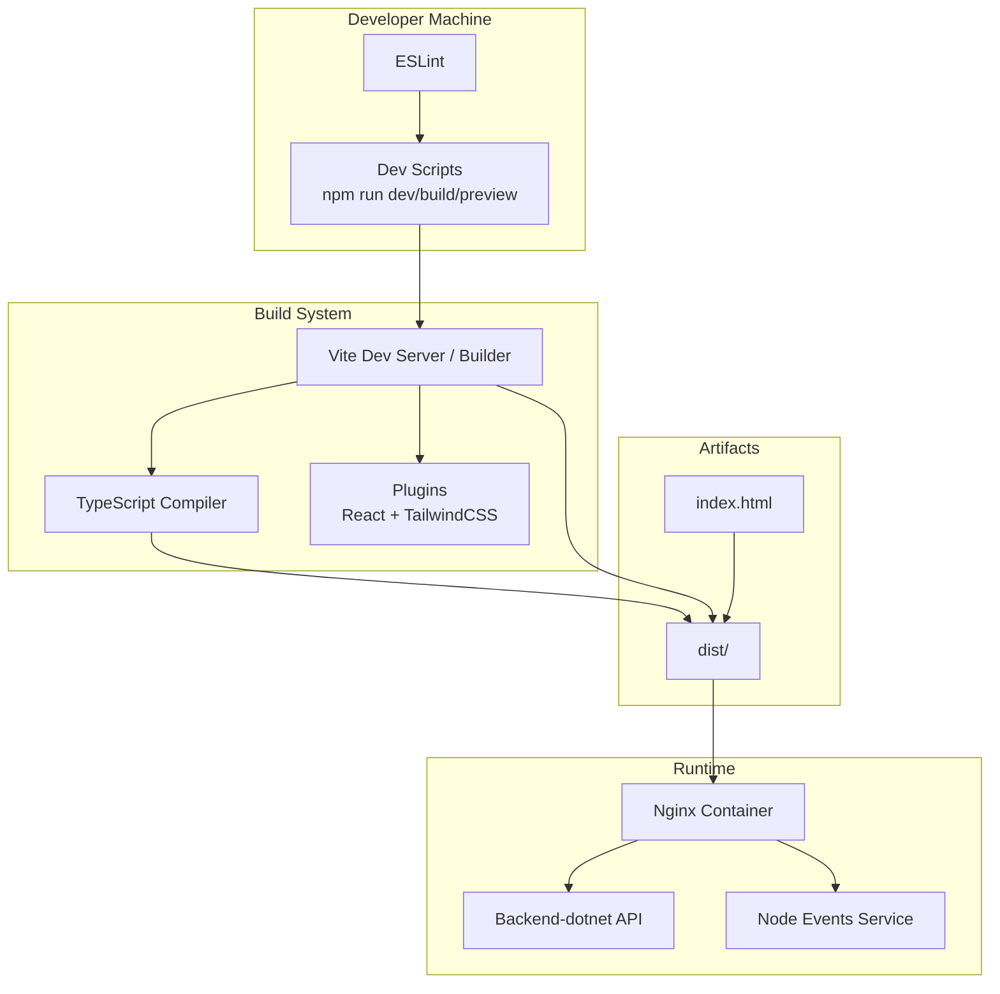
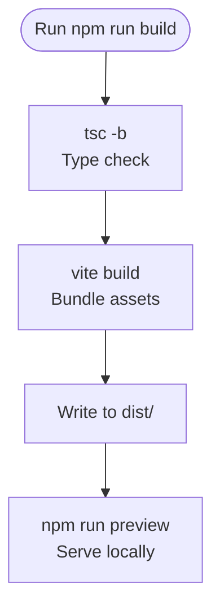
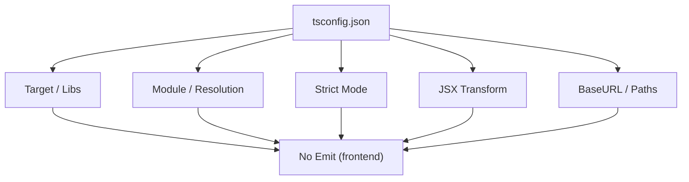
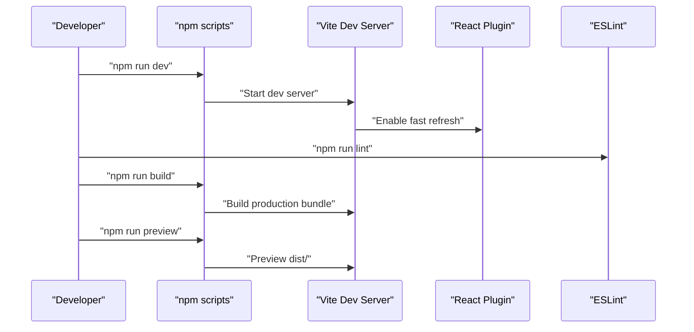
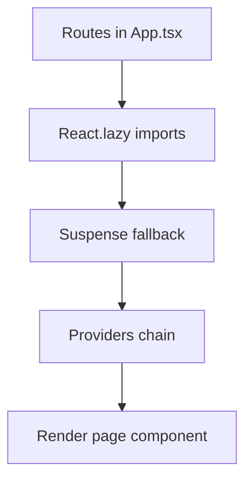
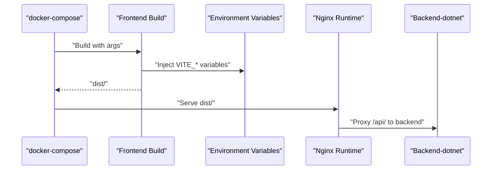
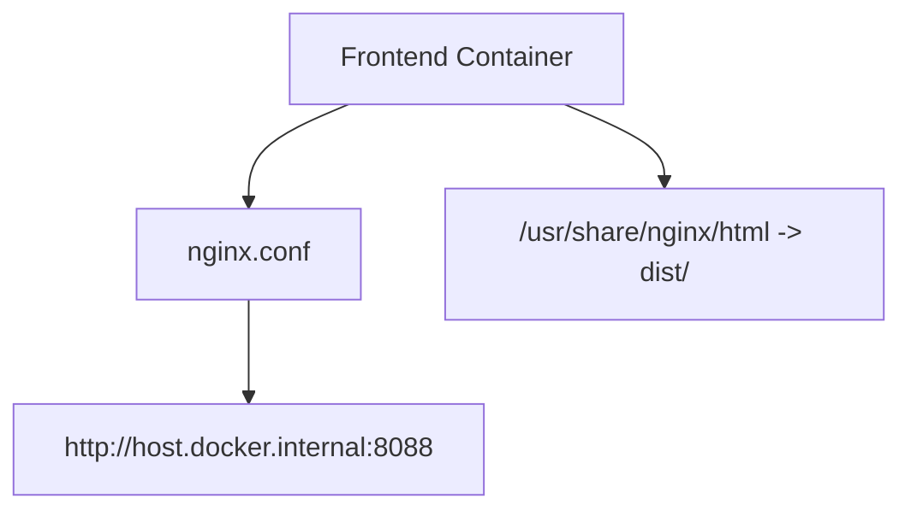
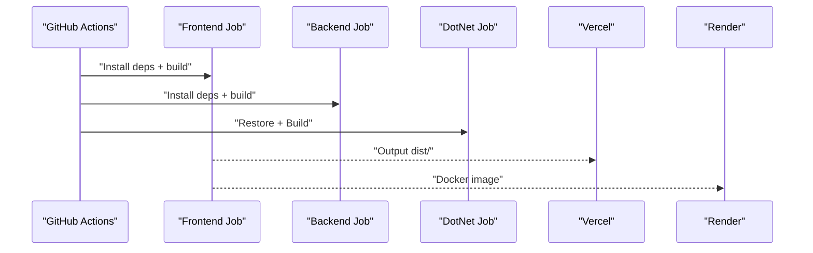
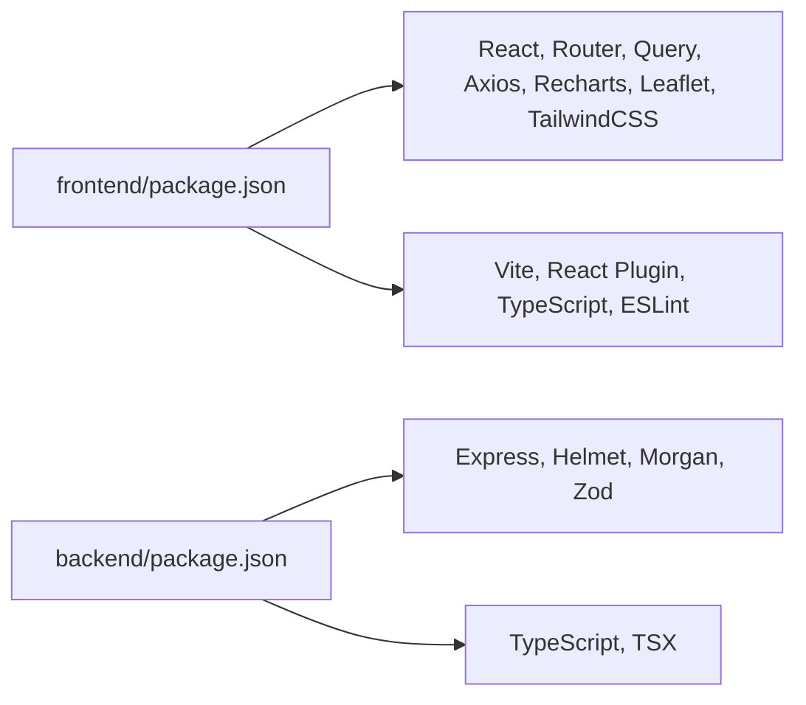

# Build Configuration

<cite>
**Referenced Files in This Document**
- [vite.config.ts](file://frontend/vite.config.ts)
- [package.json](file://frontend/package.json)
- [tsconfig.json](file://frontend/tsconfig.json)
- [eslint.config.js](file://frontend/eslint.config.js)
- [index.html](file://frontend/index.html)
- [main.tsx](file://frontend/src/main.tsx)
- [App.tsx](file://frontend/src/App.tsx)
- [Dockerfile](file://frontend/Dockerfile)
- [nginx.conf](file://frontend/nginx.conf)
- [docker-compose.yml](file://docker-compose.yml)
- [ci.yml](file://.github/workflows/ci.yml)
- [vercel.json](file://vercel.json)
- [render.yaml](file://render.yaml)
- [backend package.json](file://backend/package.json)
- [backend tsconfig.json](file://backend/tsconfig.json)
- [.gitignore](file://frontend/.gitignore)
</cite>

## Table of Contents
1. [Introduction](#introduction)
2. [Project Structure](#project-structure)
3. [Core Components](#core-components)
4. [Architecture Overview](#architecture-overview)
5. [Detailed Component Analysis](#detailed-component-analysis)
6. [Dependency Analysis](#dependency-analysis)
7. [Performance Considerations](#performance-considerations)
8. [Troubleshooting Guide](#troubleshooting-guide)
9. [Conclusion](#conclusion)
10. [Appendices](#appendices)

## Introduction
This document describes the build configuration for the OpsTrax React application. It explains the Vite build system setup, TypeScript compilation settings, development workflow, optimization strategies, code splitting, environment variable management, build targets, deployment configurations, Docker containerization, build caching, and CI/CD integration patterns. The goal is to provide a practical guide for building, developing, and deploying the frontend while maintaining performance and reliability.

## Project Structure
The frontend build pipeline centers on Vite and TypeScript. Key artifacts include:
- Vite configuration for plugins, aliases, and dev server behavior
- TypeScript compiler options for strictness and module resolution
- ESLint flat config for linting during development
- Nginx-based production container image serving static assets
- docker-compose orchestrating frontend, backend-dotnet, and node events
- GitHub Actions CI validating builds across frontend and backend
- Deployment configurations for Vercel and Render

**Diagram sources**
- [vite.config.ts:1-13](file://frontend/vite.config.ts#L1-L13)
- [tsconfig.json:1-26](file://frontend/tsconfig.json#L1-L26)
- [eslint.config.js:1-30](file://frontend/eslint.config.js#L1-L30)
- [index.html:1-21](file://frontend/index.html#L1-L21)
- [main.tsx:1-35](file://frontend/src/main.tsx#L1-L35)
- [App.tsx:1-322](file://frontend/src/App.tsx#L1-L322)
- [Dockerfile:1-6](file://frontend/Dockerfile#L1-L6)

**Section sources**
- [vite.config.ts:1-13](file://frontend/vite.config.ts#L1-L13)
- [tsconfig.json:1-26](file://frontend/tsconfig.json#L1-L26)
- [eslint.config.js:1-30](file://frontend/eslint.config.js#L1-L30)
- [index.html:1-21](file://frontend/index.html#L1-L21)
- [main.tsx:1-35](file://frontend/src/main.tsx#L1-L35)
- [App.tsx:1-322](file://frontend/src/App.tsx#L1-L322)
- [Dockerfile:1-6](file://frontend/Dockerfile#L1-L6)

## Core Components
- Vite configuration
  - Plugins: React Fast Refresh and TailwindCSS integration
  - Path alias for @ pointing to src
  - Dev server configured with host, port, and strict port enforcement
- TypeScript configuration
  - ES2022 target and DOM/ES2022 libs
  - Strict mode, ESNext module, Bundler resolution, JSX transform
  - Path mapping via baseUrl and paths
- ESLint flat config
  - Recommended base, React Hooks, and React Refresh presets
  - Module parsing and browser globals
- HTML template
  - Root div, preconnected fonts, favicon, viewport meta
- Entry point and routing
  - React Query provider, I18n provider, Router, Error boundary, Auth provider
  - Route definitions with extensive lazy loading for code splitting
- Docker and Nginx
  - Nginx Alpine image serving dist with proxy to backend API
  - docker-compose wiring frontend, backend-dotnet, and node events
- CI/CD
  - GitHub Actions job for frontend build using Node 22
  - Backend and DotNet builds orchestrated separately

**Section sources**
- [vite.config.ts:1-13](file://frontend/vite.config.ts#L1-L13)
- [package.json:9-14](file://frontend/package.json#L9-L14)
- [tsconfig.json:2-22](file://frontend/tsconfig.json#L2-L22)
- [eslint.config.js:7-29](file://frontend/eslint.config.js#L7-L29)
- [index.html:1-21](file://frontend/index.html#L1-L21)
- [main.tsx:11-34](file://frontend/src/main.tsx#L11-L34)
- [App.tsx:37-103](file://frontend/src/App.tsx#L37-L103)
- [Dockerfile:1-6](file://frontend/Dockerfile#L1-L6)
- [nginx.conf:1-31](file://frontend/nginx.conf#L1-L31)
- [docker-compose.yml:4-44](file://docker-compose.yml#L4-L44)
- [ci.yml:9-20](file://.github/workflows/ci.yml#L9-L20)

## Architecture Overview
The build and runtime architecture integrates development, bundling, and deployment:

**Diagram sources**
- [package.json:9-14](file://frontend/package.json#L9-L14)
- [vite.config.ts:5-12](file://frontend/vite.config.ts#L5-L12)
- [tsconfig.json:2-22](file://frontend/tsconfig.json#L2-L22)
- [Dockerfile:1-6](file://frontend/Dockerfile#L1-L6)
- [nginx.conf:12-19](file://frontend/nginx.conf#L12-L19)
- [docker-compose.yml:19-43](file://docker-compose.yml#L19-L43)

## Detailed Component Analysis

### Vite Build Configuration
- Plugins
  - React plugin enables fast refresh and JSX transforms
  - TailwindCSS plugin integrates styling pipeline
- Aliasing
  - @ resolves to src for concise imports
- Dev server
  - Host binding to 0.0.0.0, port 10000, strict port enforcement
- Build script
  - tsc -b followed by vite build ensures type checking before bundling

**Diagram sources**
- [package.json:11](file://frontend/package.json#L11)
- [vite.config.ts:5-12](file://frontend/vite.config.ts#L5-L12)

**Section sources**
- [vite.config.ts:1-13](file://frontend/vite.config.ts#L1-L13)
- [package.json:9-14](file://frontend/package.json#L9-L14)

### TypeScript Compilation Settings
- Target and libs
  - ES2022 target with DOM and DOM.Iterable libraries
- Module system
  - ESNext with Bundler resolution for optimal tree-shaking
- Strictness and safety
  - Strict mode, skipLibCheck, esModuleInterop, allowSyntheticDefaultImports
- JSX and paths
  - react-jsx transform, baseUrl and @/* mapping
- No emit in frontend
  - tsc acts as type checker; Vite emits final bundles

**Diagram sources**
- [tsconfig.json:2-22](file://frontend/tsconfig.json#L2-L22)

**Section sources**
- [tsconfig.json:1-26](file://frontend/tsconfig.json#L1-L26)

### Development Workflow
- Dev server
  - npm run dev starts Vite with host/port/strictPort
- Hot Module Replacement
  - React plugin enables fast refresh in development
- Linting
  - npm run lint uses ESLint flat config with recommended rules and React Refresh integration
- Preview
  - npm run preview serves built assets locally

**Diagram sources**
- [package.json:9-14](file://frontend/package.json#L9-L14)
- [eslint.config.js:7-29](file://frontend/eslint.config.js#L7-L29)
- [vite.config.ts:5-12](file://frontend/vite.config.ts#L5-L12)

**Section sources**
- [package.json:9-14](file://frontend/package.json#L9-L14)
- [eslint.config.js:1-30](file://frontend/eslint.config.js#L1-L30)
- [vite.config.ts:5-12](file://frontend/vite.config.ts#L5-L12)

### Code Splitting and Routing
- Route-based lazy loading
  - Extensive use of React.lazy for page components
  - Suspense boundaries for loading states
- Permission-gated routes
  - RequirePermission wrapper restricts access based on RBAC
- Dynamic module routes
  - Modules enumerated from moduleConfig and rendered conditionally

**Diagram sources**
- [App.tsx:37-103](file://frontend/src/App.tsx#L37-L103)
- [App.tsx:124-321](file://frontend/src/App.tsx#L124-L321)
- [main.tsx:11-34](file://frontend/src/main.tsx#L11-L34)

**Section sources**
- [App.tsx:1-322](file://frontend/src/App.tsx#L1-L322)
- [main.tsx:1-35](file://frontend/src/main.tsx#L1-L35)

### Environment Variables and Build Targets
- Frontend environment variables
  - docker-compose injects VITE_API_BASE_URL and VITE_NODE_EVENTS_URL into the frontend build context
  - These variables are consumed at runtime by the app to configure API endpoints
- Build targets
  - Frontend: Vite produces dist/
  - Backend (Node): tsc compiles to dist/ (backend)
  - Backend-dotnet: MSBuild via CI (csproj outside scope here)
- Runtime configuration
  - Nginx proxies /api/ to backend-dotnet service
  - Health checks exposed at /health

**Diagram sources**
- [docker-compose.yml:8-10](file://docker-compose.yml#L8-L10)
- [nginx.conf:12-19](file://frontend/nginx.conf#L12-L19)

**Section sources**
- [docker-compose.yml:8-10](file://docker-compose.yml#L8-L10)
- [nginx.conf:12-19](file://frontend/nginx.conf#L12-L19)

### Bundle Analysis Techniques
- Built-in analysis
  - Vite supports optional plugins for bundle visualization (e.g., vite-bundle-analyzer) for deeper insights
- Practical tips
  - Use Vite’s build log to inspect asset sizes
  - Monitor dist/ contents post-build
  - Leverage lazy-loaded routes to reduce initial payload
- Third-party tools
  - Optional: integrate a bundle analyzer plugin in vite.config.ts for visual reports

[No sources needed since this section provides general guidance]

### Development Server Setup and Hot Module Replacement
- Dev server
  - Host binding to 0.0.0.0, port 10000, strictPort enabled
- HMR
  - React plugin enables fast refresh for rapid iteration
- Local preview
  - npm run preview serves built assets on the same port scheme

**Section sources**
- [package.json:10-12](file://frontend/package.json#L10-L12)
- [vite.config.ts:5-12](file://frontend/vite.config.ts#L5-L12)

### Build Performance Optimization
- Module resolution
  - ESNext + Bundler improves tree-shaking and reduces bundle size
- Strict mode
  - Catches errors early and enables better minification
- Path aliases
  - Reduce long relative imports and improve DX
- Lazy loading
  - Route-based code splitting minimizes initial load
- Type checking before build
  - tsc -b ensures type-safe builds without emitting JavaScript

**Section sources**
- [tsconfig.json:2-22](file://frontend/tsconfig.json#L2-L22)
- [package.json:11](file://frontend/package.json#L11)
- [App.tsx:37-103](file://frontend/src/App.tsx#L37-L103)

### Docker Containerization and Nginx Serving
- Nginx image
  - Alpine-based image serving dist/ as static assets
- Proxy configuration
  - /api/ proxied to backend-dotnet service
- Health endpoint
  - /health returns ok for readiness probes
- Port exposure
  - Frontend container exposes port 80 mapped to host 10000

**Diagram sources**
- [Dockerfile:1-6](file://frontend/Dockerfile#L1-L6)
- [nginx.conf:12-19](file://frontend/nginx.conf#L12-L19)

**Section sources**
- [Dockerfile:1-6](file://frontend/Dockerfile#L1-L6)
- [nginx.conf:1-31](file://frontend/nginx.conf#L1-L31)
- [docker-compose.yml:13-14](file://docker-compose.yml#L13-L14)

### CI/CD Integration Patterns
- GitHub Actions
  - Frontend build job runs on Ubuntu latest with Node 22
  - Steps: checkout, setup-node, npm install, npm run build (frontend)
  - Backend and DotNet builds handled in separate jobs
- Vercel deployment
  - Install and build commands scoped to frontend
  - Rewrites serve SPA at root
- Render deployment
  - Docker-based services for backend-dotnet and node events
  - Health checks and environment variables configured

**Diagram sources**
- [ci.yml:9-20](file://.github/workflows/ci.yml#L9-L20)
- [vercel.json:1-12](file://vercel.json#L1-L12)
- [render.yaml:1-41](file://render.yaml#L1-L41)

**Section sources**
- [ci.yml:1-52](file://.github/workflows/ci.yml#L1-L52)
- [vercel.json:1-12](file://vercel.json#L1-L12)
- [render.yaml:1-41](file://render.yaml#L1-L41)

## Dependency Analysis
- Frontend dependencies
  - React 19, React Router Dom 7, TanStack React Query, Axios, Recharts, Leaflet, TailwindCSS v4
- Dev dependencies
  - Vite 7, @vitejs/plugin-react, TypeScript 5, ESLint 10, React Refresh plugin
- Backend (Node)
  - Express, Helmet, Morgan, Zod, TypeScript, TSX for dev/watch
- Backend-dotnet
  - .NET 8 SDK used in CI; csproj present but build steps external to this repo snapshot

**Diagram sources**
- [package.json:15-40](file://frontend/package.json#L15-L40)
- [backend package.json:22-37](file://backend/package.json#L22-L37)

**Section sources**
- [package.json:15-40](file://frontend/package.json#L15-L40)
- [backend package.json:1-39](file://backend/package.json#L1-39)

## Performance Considerations
- Prefer lazy loading for large route segments to reduce initial bundle size
- Keep strict mode enabled for earlier error detection and better minification
- Use ESNext + Bundler module resolution for optimal tree-shaking
- Minimize third-party dependencies and audit bundle composition regularly
- Enable gzip/HTTP/2 in Nginx for improved transfer speeds (configuration can be extended)

[No sources needed since this section provides general guidance]

## Troubleshooting Guide
- Dev server port conflicts
  - strictPort prevents fallback; change port in npm scripts or free the port
- Alias resolution
  - Ensure @ alias matches baseUrl and paths configuration
- Environment variables not applied
  - Confirm docker-compose args and Vite env prefix rules
- API proxy issues
  - Verify nginx proxy_pass and CORS settings in backend-dotnet
- CI failures
  - Align Node versions across local and CI environments
- Type errors blocking build
  - Run tsc -b locally to catch issues before vite build

**Section sources**
- [package.json:10-12](file://frontend/package.json#L10-L12)
- [vite.config.ts:7-11](file://frontend/vite.config.ts#L7-L11)
- [docker-compose.yml:8-10](file://docker-compose.yml#L8-L10)
- [nginx.conf:12-19](file://frontend/nginx.conf#L12-L19)
- [ci.yml:14-15](file://.github/workflows/ci.yml#L14-L15)

## Conclusion
The OpsTrax React application employs a modern build pipeline centered on Vite and TypeScript with strong developer ergonomics and performance focus. Code splitting via route-based lazy loading, strict TypeScript settings, and a minimal Nginx-based container image deliver a robust development and production experience. CI/CD automation ensures consistent builds across environments, while docker-compose and deployment manifests streamline local and cloud deployments.

## Appendices

### Appendix A: Build Targets and Outputs
- Frontend
  - Scripts: dev, build, preview, lint
  - Output: dist/
- Backend (Node)
  - Scripts: dev, build, start, typecheck
  - Output: dist/
- Backend-dotnet
  - CI builds via dotnet CLI

**Section sources**
- [package.json:9-14](file://frontend/package.json#L9-L14)
- [backend package.json:6-11](file://backend/package.json#L6-L11)
- [ci.yml:43-52](file://.github/workflows/ci.yml#L43-L52)

### Appendix B: Environment Variable Reference
- Frontend
  - VITE_API_BASE_URL: Base URL for API proxy
  - VITE_NODE_EVENTS_URL: WebSocket or event service URL
- Backend-dotnet
  - ASPNETCORE_URLS: Listening URLs
  - ConnectionStrings__DefaultConnection: PostgreSQL connection string
  - Cors__AllowedOrigins: Allowed origins for CORS
- Node Events
  - PORT: Listening port
  - API_BASE_URL: Upstream API base URL
  - CORS_ORIGIN: Allowed origin for CORS

**Section sources**
- [docker-compose.yml:8-28](file://docker-compose.yml#L8-L28)
- [nginx.conf:12-19](file://frontend/nginx.conf#L12-L19)

### Appendix C: Local Development Commands
- Install dependencies
  - cd frontend && npm install
- Start development server
  - npm run dev
- Build for production
  - npm run build
- Preview production build
  - npm run preview
- Lint sources
  - npm run lint

**Section sources**
- [package.json:9-14](file://frontend/package.json#L9-L14)