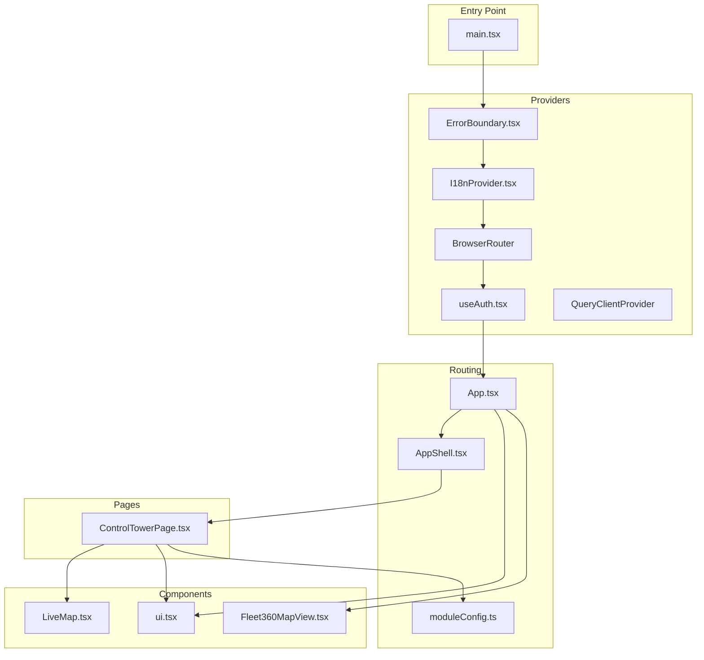
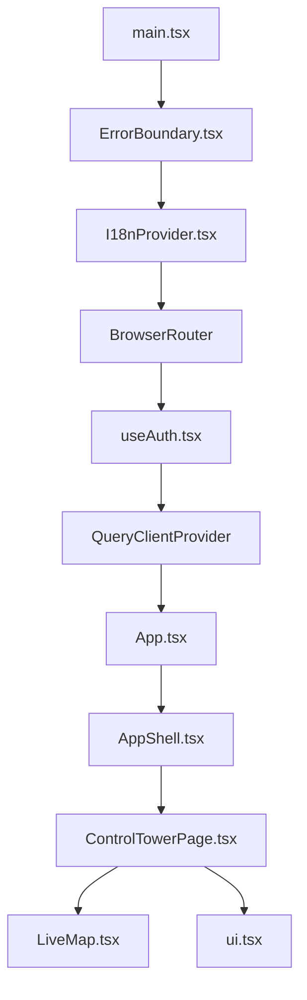
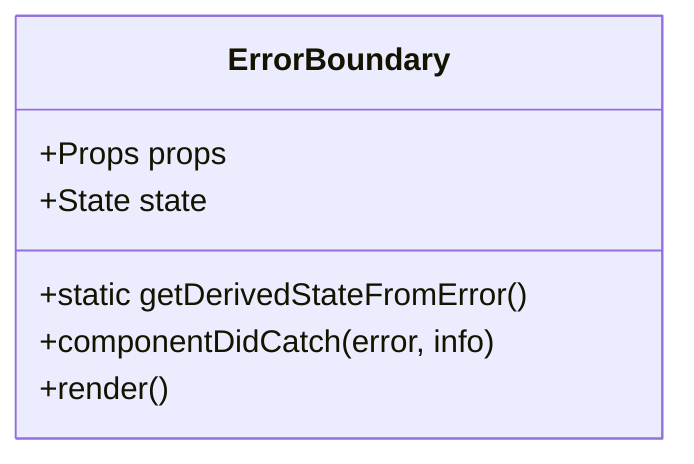
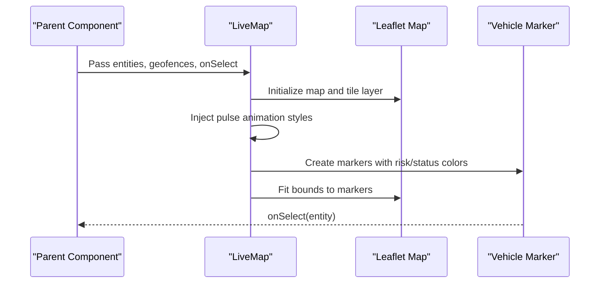
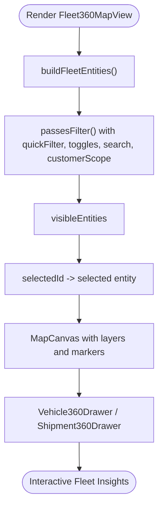
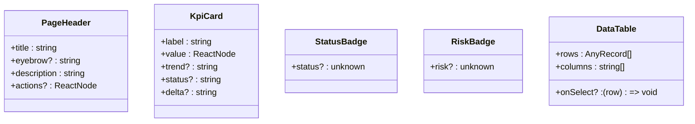
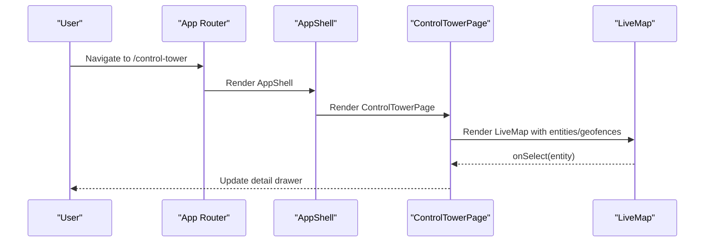
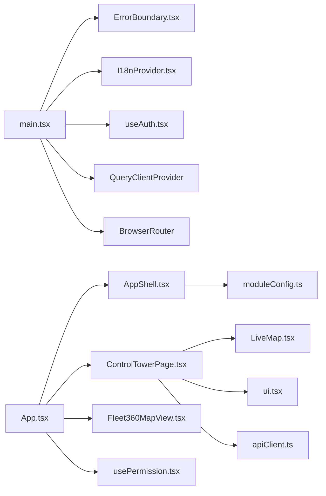

# Component Architecture

<cite>
**Referenced Files in This Document**
- [main.tsx](file://frontend/src/main.tsx)
- [App.tsx](file://frontend/src/App.tsx)
- [AppShell.tsx](file://frontend/src/layouts/AppShell.tsx)
- [ErrorBoundary.tsx](file://frontend/src/components/ErrorBoundary.tsx)
- [LiveMap.tsx](file://frontend/src/components/LiveMap.tsx)
- [Fleet360MapView.tsx](file://frontend/src/components/Fleet360MapView.tsx)
- [ui.tsx](file://frontend/src/components/ui.tsx)
- [ControlTowerPage.tsx](file://frontend/src/pages/ControlTowerPage.tsx)
- [moduleConfig.ts](file://frontend/src/modules/moduleConfig.ts)
- [useAuth.tsx](file://frontend/src/hooks/useAuth.tsx)
- [usePermission.tsx](file://frontend/src/hooks/usePermission.tsx)
- [I18nProvider.tsx](file://frontend/src/i18n/I18nProvider.tsx)
- [apiClient.ts](file://frontend/src/services/apiClient.ts)
- [index.ts](file://frontend/src/types/index.ts)
</cite>

## Table of Contents
1. [Introduction](#introduction)
2. [Project Structure](#project-structure)
3. [Core Components](#core-components)
4. [Architecture Overview](#architecture-overview)
5. [Detailed Component Analysis](#detailed-component-analysis)
6. [Dependency Analysis](#dependency-analysis)
7. [Performance Considerations](#performance-considerations)
8. [Troubleshooting Guide](#troubleshooting-guide)
9. [Conclusion](#conclusion)
10. [Appendices](#appendices)

## Introduction
This document describes the component architecture of the OpsTrax React application. It explains the component hierarchy, reusable UI components, design patterns, and the integration of custom components such as LiveMap and Fleet360MapView. It also covers error boundary implementation, component composition patterns, prop interfaces, lifecycle management, state management, event handling, and performance optimization strategies. Guidance is included for creating new components, testing strategies, and integrating with the broader application architecture.

## Project Structure
The frontend is organized around a shell-based layout with modular routing, a component library, and page-specific components. The main entry point initializes providers for error boundaries, authentication, internationalization, routing, and data fetching. The shell provides navigation and responsive layout, while pages orchestrate data fetching and compose reusable UI components.

**Diagram sources**
- [main.tsx:1-35](file://frontend/src/main.tsx#L1-L35)
- [App.tsx:124-322](file://frontend/src/App.tsx#L124-L322)
- [AppShell.tsx:76-394](file://frontend/src/layouts/AppShell.tsx#L76-L394)
- [moduleConfig.ts:52-134](file://frontend/src/modules/moduleConfig.ts#L52-L134)
- [ControlTowerPage.tsx:13-169](file://frontend/src/pages/ControlTowerPage.tsx#L13-L169)
- [ui.tsx:1-575](file://frontend/src/components/ui.tsx#L1-L575)
- [LiveMap.tsx:78-201](file://frontend/src/components/LiveMap.tsx#L78-L201)
- [Fleet360MapView.tsx:760-800](file://frontend/src/components/Fleet360MapView.tsx#L760-L800)

**Section sources**
- [main.tsx:1-35](file://frontend/src/main.tsx#L1-L35)
- [App.tsx:124-322](file://frontend/src/App.tsx#L124-L322)
- [AppShell.tsx:76-394](file://frontend/src/layouts/AppShell.tsx#L76-L394)
- [moduleConfig.ts:52-134](file://frontend/src/modules/moduleConfig.ts#L52-L134)

## Core Components
- ErrorBoundary: A class-based error boundary that catches rendering errors and displays a friendly recovery interface.
- LiveMap: A Leaflet-based real-time map component that renders vehicle markers, tooltips, and geofences with dynamic styling and selection callbacks.
- Fleet360MapView: A comprehensive fleet visualization with filters, layers, KPIs, and detailed drawers for vehicle, driver, shipment, and safety insights.
- UI Library: Reusable components including PageHeader, KpiCard, StatusBadge, RiskBadge, DataTable, Timeline, ActionQueue, and others.
- AppShell: A responsive shell with collapsible navigation groups, user menu, notifications, and language switching.
- ControlTowerPage: A page orchestrating live telemetry, alerts, event streams, and map visualization.

**Section sources**
- [ErrorBoundary.tsx:12-51](file://frontend/src/components/ErrorBoundary.tsx#L12-L51)
- [LiveMap.tsx:72-201](file://frontend/src/components/LiveMap.tsx#L72-L201)
- [Fleet360MapView.tsx:760-800](file://frontend/src/components/Fleet360MapView.tsx#L760-L800)
- [ui.tsx:37-575](file://frontend/src/components/ui.tsx#L37-L575)
- [AppShell.tsx:76-394](file://frontend/src/layouts/AppShell.tsx#L76-L394)
- [ControlTowerPage.tsx:13-169](file://frontend/src/pages/ControlTowerPage.tsx#L13-L169)

## Architecture Overview
The application follows a layered architecture:
- Providers layer: ErrorBoundary, I18nProvider, AuthProvider, QueryClientProvider, and BrowserRouter.
- Routing layer: App routes define protected routes, module-based navigation, and lazy-loaded pages.
- Shell layer: AppShell manages global navigation, user actions, and responsive layout.
- Page layer: Pages orchestrate data fetching, state, and compose UI components.
- Component library: Shared UI primitives and specialized components (LiveMap, Fleet360MapView).

**Diagram sources**
- [main.tsx:20-34](file://frontend/src/main.tsx#L20-L34)
- [App.tsx:124-322](file://frontend/src/App.tsx#L124-L322)
- [AppShell.tsx:76-394](file://frontend/src/layouts/AppShell.tsx#L76-L394)
- [ControlTowerPage.tsx:13-169](file://frontend/src/pages/ControlTowerPage.tsx#L13-L169)
- [LiveMap.tsx:78-201](file://frontend/src/components/LiveMap.tsx#L78-L201)
- [ui.tsx:37-575](file://frontend/src/components/ui.tsx#L37-L575)

## Detailed Component Analysis

### Error Boundary
- Purpose: Provides a fallback UI when child components throw errors.
- Implementation: Class component with static getDerivedStateFromError and componentDidCatch lifecycle.
- Behavior: Renders a centered panel with refresh action and logs error details.

**Diagram sources**
- [ErrorBoundary.tsx:12-51](file://frontend/src/components/ErrorBoundary.tsx#L12-L51)

**Section sources**
- [ErrorBoundary.tsx:12-51](file://frontend/src/components/ErrorBoundary.tsx#L12-L51)

### LiveMap Component
- Purpose: Render a real-time map with vehicle markers, tooltips, and geofences.
- Props: entities, geofences, onSelect.
- Lifecycle: Initializes Leaflet map once, injects CSS and animations, updates markers and geofences on data changes.
- Rendering: Uses deterministic jitter for demo coordinates, dynamic marker colors based on risk/status, and popup tooltips.

**Diagram sources**
- [LiveMap.tsx:78-201](file://frontend/src/components/LiveMap.tsx#L78-L201)

**Section sources**
- [LiveMap.tsx:72-201](file://frontend/src/components/LiveMap.tsx#L72-L201)

### Fleet360MapView Component
- Purpose: Comprehensive fleet visualization with filters, layers, KPIs, and detailed drawers.
- Props: None (manages internal state for mode, filters, layers, selection).
- Composition: Includes KPI bar, customer mode toggle, filter panel, map canvas, and drawer panels.
- State: Uses useState and useMemo for reactive filtering and selection.
- Rendering: SVG-based map canvas with routes, risk heatmap, geofences, hubs, and interactive markers.

**Diagram sources**
- [Fleet360MapView.tsx:760-800](file://frontend/src/components/Fleet360MapView.tsx#L760-L800)
- [Fleet360MapView.tsx:719-758](file://frontend/src/components/Fleet360MapView.tsx#L719-L758)
- [Fleet360MapView.tsx:380-446](file://frontend/src/components/Fleet360MapView.tsx#L380-L446)

**Section sources**
- [Fleet360MapView.tsx:760-800](file://frontend/src/components/Fleet360MapView.tsx#L760-L800)
- [Fleet360MapView.tsx:719-758](file://frontend/src/components/Fleet360MapView.tsx#L719-L758)
- [Fleet360MapView.tsx:380-446](file://frontend/src/components/Fleet360MapView.tsx#L380-L446)

### UI Component Library
- Purpose: Provide reusable, theme-consistent components for forms, badges, tables, and layouts.
- Examples:
  - PageHeader: Eyebrow, title, description, actions.
  - KpiCard: Value, trend, status with color-coded variants.
  - StatusBadge/RiskBadge: Dynamic badges with severity-aware styling.
  - DataTable: Sortable, searchable table with toolbar.
  - Timeline/ActionQueue: Operational timelines and priority queues.
  - LoadingState/ErrorState/EmptyState: Consistent loading and empty states.

**Diagram sources**
- [ui.tsx:37-575](file://frontend/src/components/ui.tsx#L37-L575)

**Section sources**
- [ui.tsx:37-575](file://frontend/src/components/ui.tsx#L37-L575)

### AppShell and Routing
- AppShell: Collapsible navigation groups, user menu, notifications, language selector, and responsive layout.
- App: Defines protected routes, lazy-loading, permission gating, and module-based navigation.
- moduleConfig: Centralized module metadata and icons for navigation.

**Diagram sources**
- [App.tsx:145-318](file://frontend/src/App.tsx#L145-L318)
- [AppShell.tsx:76-394](file://frontend/src/layouts/AppShell.tsx#L76-L394)
- [ControlTowerPage.tsx:13-169](file://frontend/src/pages/ControlTowerPage.tsx#L13-L169)
- [LiveMap.tsx:78-201](file://frontend/src/components/LiveMap.tsx#L78-L201)

**Section sources**
- [App.tsx:145-318](file://frontend/src/App.tsx#L145-L318)
- [AppShell.tsx:76-394](file://frontend/src/layouts/AppShell.tsx#L76-L394)
- [moduleConfig.ts:52-134](file://frontend/src/modules/moduleConfig.ts#L52-L134)

## Dependency Analysis
- Provider dependencies: main.tsx composes ErrorBoundary, I18nProvider, AuthProvider, QueryClientProvider, and BrowserRouter.
- Routing dependencies: App defines routes and uses RequirePermission for RBAC.
- Component dependencies: ControlTowerPage depends on LiveMap and UI components; AppShell depends on moduleConfig for navigation.
- Data dependencies: apiClient centralizes HTTP requests and CSRF handling; useAuth and usePermission manage session and permissions.

**Diagram sources**
- [main.tsx:20-34](file://frontend/src/main.tsx#L20-L34)
- [App.tsx:124-322](file://frontend/src/App.tsx#L124-L322)
- [AppShell.tsx:76-394](file://frontend/src/layouts/AppShell.tsx#L76-L394)
- [ControlTowerPage.tsx:13-169](file://frontend/src/pages/ControlTowerPage.tsx#L13-L169)
- [LiveMap.tsx:78-201](file://frontend/src/components/LiveMap.tsx#L78-L201)
- [ui.tsx:37-575](file://frontend/src/components/ui.tsx#L37-L575)
- [Fleet360MapView.tsx:760-800](file://frontend/src/components/Fleet360MapView.tsx#L760-L800)
- [moduleConfig.ts:52-134](file://frontend/src/modules/moduleConfig.ts#L52-L134)
- [apiClient.ts:14-79](file://frontend/src/services/apiClient.ts#L14-L79)
- [usePermission.tsx:47-66](file://frontend/src/hooks/usePermission.tsx#L47-L66)

**Section sources**
- [main.tsx:20-34](file://frontend/src/main.tsx#L20-L34)
- [App.tsx:124-322](file://frontend/src/App.tsx#L124-L322)
- [apiClient.ts:14-79](file://frontend/src/services/apiClient.ts#L14-L79)
- [usePermission.tsx:47-66](file://frontend/src/hooks/usePermission.tsx#L47-L66)

## Performance Considerations
- Memoization: useMemo is used for derived data (e.g., visible entities, KPIs) to avoid unnecessary re-renders.
- Efficient updates: LiveMap uses refs to store map instances and selectively updates markers and geofences.
- Lazy loading: Routes use lazy loading to reduce initial bundle size.
- Query caching: QueryClient caches API responses and avoids redundant network calls.
- Conditional rendering: AppShell collapses navigation groups and hides panels to reduce DOM overhead.
- CSS animations: Pulse animations are injected once to minimize repeated style recalculations.

[No sources needed since this section provides general guidance]

## Troubleshooting Guide
- Error Boundary: Displays a friendly recovery screen and logs errors to the console. Use browser devtools to inspect logged error info.
- Authentication: apiClient interceptors handle 401 responses by clearing sessions and redirecting to login.
- Permissions: RequirePermission and PermissionGate components guard routes and render fallback UI when unauthorized.
- Internationalization: I18nProvider synchronizes locale preferences with the backend and falls back to localStorage.

**Section sources**
- [ErrorBoundary.tsx:19-21](file://frontend/src/components/ErrorBoundary.tsx#L19-L21)
- [apiClient.ts:58-72](file://frontend/src/services/apiClient.ts#L58-L72)
- [usePermission.tsx:84-103](file://frontend/src/hooks/usePermission.tsx#L84-L103)
- [I18nProvider.tsx:18-32](file://frontend/src/i18n/I18nProvider.tsx#L18-L32)

## Conclusion
The OpsTrax React application employs a robust component architecture with clear separation of concerns. Providers encapsulate cross-cutting concerns, AppShell delivers consistent navigation and layout, and pages orchestrate data and compose reusable UI components. Specialized components like LiveMap and Fleet360MapView demonstrate advanced patterns for rendering complex visualizations and managing state. The architecture emphasizes performance, maintainability, and user experience through memoization, lazy loading, and consistent UI primitives.

[No sources needed since this section summarizes without analyzing specific files]

## Appendices

### Component Composition Patterns
- Container components (e.g., ControlTowerPage) orchestrate data and pass props to presentational components (e.g., LiveMap, ui.KpiCard).
- Higher-order components: RequirePermission wraps routes to enforce RBAC.
- Hooks composition: useAuth, usePermission, useEventStream, useLiveTelemetry encapsulate state and side effects.

**Section sources**
- [ControlTowerPage.tsx:13-169](file://frontend/src/pages/ControlTowerPage.tsx#L13-L169)
- [useAuth.tsx:33-59](file://frontend/src/hooks/useAuth.tsx#L33-L59)
- [usePermission.tsx:47-66](file://frontend/src/hooks/usePermission.tsx#L47-L66)

### Prop Interfaces and Types
- LiveMapProps: entities, geofences, onSelect.
- UI components accept strongly typed props (e.g., PageHeader, KpiCard, StatusBadge, RiskBadge).
- Type definitions: ApiEnvelope, AnyRecord, ModuleConfig, UserSession.

**Section sources**
- [LiveMap.tsx:72-76](file://frontend/src/components/LiveMap.tsx#L72-L76)
- [ui.tsx:37-156](file://frontend/src/components/ui.tsx#L37-L156)
- [index.ts:1-51](file://frontend/src/types/index.ts#L1-L51)

### Component Lifecycle Management
- Class component: ErrorBoundary lifecycle methods handle error catching and state updates.
- Function components: useEffect for initialization and cleanup; useState for local state; useMemo for derived data.

**Section sources**
- [ErrorBoundary.tsx:15-21](file://frontend/src/components/ErrorBoundary.tsx#L15-L21)
- [LiveMap.tsx:87-122](file://frontend/src/components/LiveMap.tsx#L87-L122)
- [Fleet360MapView.tsx:760-771](file://frontend/src/components/Fleet360MapView.tsx#L760-L771)

### State Management and Event Handling
- Local state: useState for UI state (selection, filters, toggles).
- Global state: useAuth manages session state; usePermission exposes permission checks.
- Event handling: onSelect callbacks propagate selections; mutation hooks trigger refetches.

**Section sources**
- [ControlTowerPage.tsx:14-29](file://frontend/src/pages/ControlTowerPage.tsx#L14-L29)
- [useAuth.tsx:36-50](file://frontend/src/hooks/useAuth.tsx#L36-L50)
- [usePermission.tsx:12-25](file://frontend/src/hooks/usePermission.tsx#L12-L25)

### Testing Strategies
- Unit tests: Focus on pure functions and hooks logic (e.g., filter predicates, badge classification).
- Component tests: Use React Testing Library to test rendering, user interactions, and prop-driven behavior.
- Integration tests: Verify provider chains (ErrorBoundary, AuthProvider, QueryClientProvider) and routing behavior.
- Mock APIs: Stub apiClient and QueryClient to simulate network responses and errors.

[No sources needed since this section provides general guidance]

### Guidelines for Creating New Components
- Keep components small and focused; favor composition over monolithic components.
- Define clear prop interfaces and defaults; use TypeScript types.
- Encapsulate side effects in hooks; keep components declarative.
- Use the UI library for shared primitives; extend only when necessary.
- Implement proper error boundaries and loading states.
- Optimize rendering with memoization and selective updates.

[No sources needed since this section provides general guidance]