# Frontend Architecture

<cite>
**Referenced Files in This Document**
- [main.tsx](file://frontend/src/main.tsx)
- [App.tsx](file://frontend/src/App.tsx)
- [package.json](file://frontend/package.json)
- [vite.config.ts](file://frontend/vite.config.ts)
- [tsconfig.json](file://frontend/tsconfig.json)
- [useAuth.tsx](file://frontend/src/hooks/useAuth.tsx)
- [usePermission.tsx](file://frontend/src/hooks/usePermission.tsx)
- [I18nProvider.tsx](file://frontend/src/i18n/I18nProvider.tsx)
- [index.ts](file://frontend/src/i18n/index.ts)
- [moduleConfig.ts](file://frontend/src/modules/moduleConfig.ts)
- [AppShell.tsx](file://frontend/src/layouts/AppShell.tsx)
- [ErrorBoundary.tsx](file://frontend/src/components/ErrorBoundary.tsx)
- [apiClient.ts](file://frontend/src/services/apiClient.ts)
- [index.css](file://frontend/src/styles/index.css)
- [rbacConfig.ts](file://frontend/src/auth/rbacConfig.ts)
- [index.ts (types)](file://frontend/src/types/index.ts)
</cite>

## Table of Contents
1. [Introduction](#introduction)
2. [Project Structure](#project-structure)
3. [Core Components](#core-components)
4. [Architecture Overview](#architecture-overview)
5. [Detailed Component Analysis](#detailed-component-analysis)
6. [Dependency Analysis](#dependency-analysis)
7. [Performance Considerations](#performance-considerations)
8. [Troubleshooting Guide](#troubleshooting-guide)
9. [Conclusion](#conclusion)
10. [Appendices](#appendices)

## Introduction
This document describes the frontend architecture of the OpsTrax Enterprise React application. It explains the React 19 application structure, component hierarchy, modular design patterns, provider pattern implementation, custom hooks architecture, state management strategies, routing with React Router 7, lazy loading and code-splitting, module-based architecture with 134+ modules, configuration management, dynamic imports, styling architecture with TailwindCSS and theme management, responsive design patterns, build configuration, environment variables, development workflow, performance optimization, bundle analysis, and production deployment considerations.

## Project Structure
The frontend is organized around a feature-driven, modular structure with clear separation of concerns:
- Root entry initializes providers and router
- App orchestrates routes and protected shells
- Layout composes shell and navigation
- Modules define route metadata and icons
- Hooks encapsulate auth, permissions, and i18n
- Services centralize API client and interceptors
- Styles define design tokens and utilities
- Types unify shared interfaces

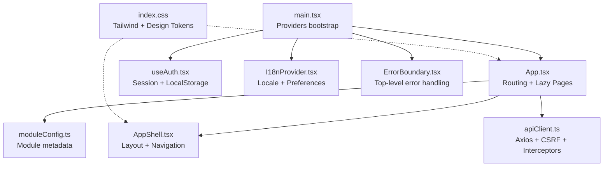

**Diagram sources**
- [main.tsx:1-35](file://frontend/src/main.tsx#L1-L35)
- [App.tsx:1-322](file://frontend/src/App.tsx#L1-L322)
- [AppShell.tsx:1-394](file://frontend/src/layouts/AppShell.tsx#L1-L394)
- [moduleConfig.ts:1-215](file://frontend/src/modules/moduleConfig.ts#L1-L215)
- [useAuth.tsx:1-60](file://frontend/src/hooks/useAuth.tsx#L1-L60)
- [I18nProvider.tsx:1-66](file://frontend/src/i18n/I18nProvider.tsx#L1-L66)
- [ErrorBoundary.tsx:1-51](file://frontend/src/components/ErrorBoundary.tsx#L1-L51)
- [apiClient.ts:1-79](file://frontend/src/services/apiClient.ts#L1-L79)
- [index.css:1-904](file://frontend/src/styles/index.css#L1-L904)

**Section sources**
- [main.tsx:1-35](file://frontend/src/main.tsx#L1-L35)
- [App.tsx:1-322](file://frontend/src/App.tsx#L1-L322)
- [vite.config.ts:1-13](file://frontend/vite.config.ts#L1-L13)
- [tsconfig.json:1-26](file://frontend/tsconfig.json#L1-L26)

## Core Components
- Providers bootstrap order: React Query, i18n, Router, Error Boundary, Auth, App
- App defines protected routes, lazy-loaded pages, and dynamic module routes
- AppShell renders navigation groups, handles permissions, and manages UI state
- useAuth manages session persistence and TTL
- usePermission provides permission checks and guards
- I18nProvider synchronizes locale preferences with backend and local storage
- apiClient centralizes base URL, credentials, CSRF, and error handling
- moduleConfig enumerates 134+ modules with route keys, permissions, and icons
- ErrorBoundary provides graceful degradation on runtime errors

**Section sources**
- [main.tsx:1-35](file://frontend/src/main.tsx#L1-L35)
- [App.tsx:1-322](file://frontend/src/App.tsx#L1-L322)
- [AppShell.tsx:1-394](file://frontend/src/layouts/AppShell.tsx#L1-L394)
- [useAuth.tsx:1-60](file://frontend/src/hooks/useAuth.tsx#L1-L60)
- [usePermission.tsx:1-106](file://frontend/src/hooks/usePermission.tsx#L1-L106)
- [I18nProvider.tsx:1-66](file://frontend/src/i18n/I18nProvider.tsx#L1-L66)
- [moduleConfig.ts:1-215](file://frontend/src/modules/moduleConfig.ts#L1-L215)
- [ErrorBoundary.tsx:1-51](file://frontend/src/components/ErrorBoundary.tsx#L1-L51)
- [apiClient.ts:1-79](file://frontend/src/services/apiClient.ts#L1-L79)

## Architecture Overview
The application follows a layered architecture:
- Presentation Layer: App, AppShell, pages, and components
- Routing Layer: React Router 7 with lazy loading and guards
- State Layer: React Context (Auth, I18n), plus React Query for caching
- Services Layer: Axios-based apiClient with interceptors
- Styling Layer: TailwindCSS with design tokens and utilities

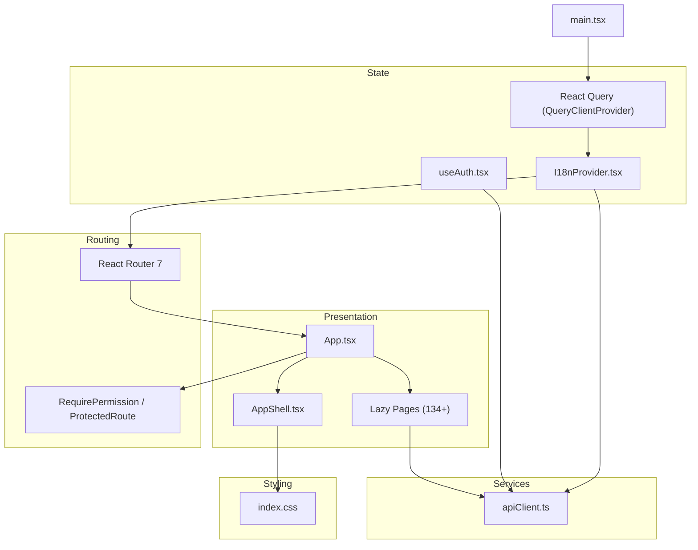

**Diagram sources**
- [main.tsx:1-35](file://frontend/src/main.tsx#L1-L35)
- [App.tsx:1-322](file://frontend/src/App.tsx#L1-L322)
- [AppShell.tsx:1-394](file://frontend/src/layouts/AppShell.tsx#L1-L394)
- [useAuth.tsx:1-60](file://frontend/src/hooks/useAuth.tsx#L1-L60)
- [I18nProvider.tsx:1-66](file://frontend/src/i18n/I18nProvider.tsx#L1-L66)
- [apiClient.ts:1-79](file://frontend/src/services/apiClient.ts#L1-L79)
- [index.css:1-904](file://frontend/src/styles/index.css#L1-L904)

## Detailed Component Analysis

### Provider Pattern and Bootstrapping
- Providers are composed in main.tsx with strict mode and SSR-safe ordering
- React Query provides caching defaults and retry behavior
- I18nProvider sets direction and language attributes on document
- AuthProvider persists session with TTL and localStorage
- ErrorBoundary wraps the app for top-level error handling

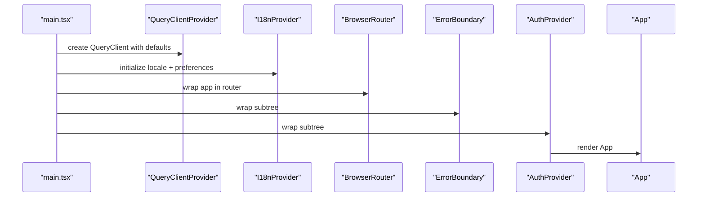

**Diagram sources**
- [main.tsx:1-35](file://frontend/src/main.tsx#L1-L35)
- [I18nProvider.tsx:1-66](file://frontend/src/i18n/I18nProvider.tsx#L1-L66)
- [useAuth.tsx:1-60](file://frontend/src/hooks/useAuth.tsx#L1-L60)

**Section sources**
- [main.tsx:1-35](file://frontend/src/main.tsx#L1-L35)

### Routing and Lazy Loading
- App.tsx defines routes for 134+ modules and dynamic module pages
- Pages are loaded lazily with React.lazy and Suspense fallback
- Protected routes enforce permissions via RequirePermission
- Dynamic module routes are generated from moduleConfig.ts
- Driver portal routes are isolated under /driver with dedicated layout

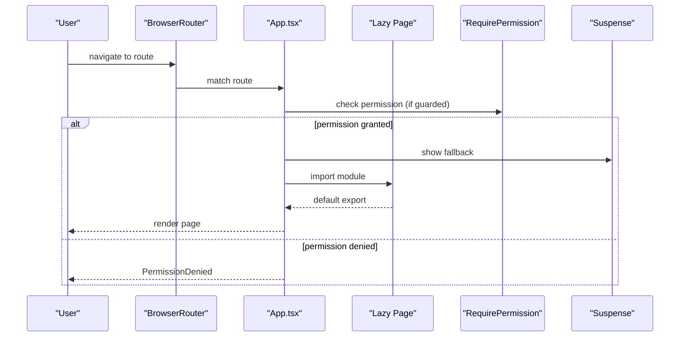

**Diagram sources**
- [App.tsx:1-322](file://frontend/src/App.tsx#L1-L322)
- [usePermission.tsx:1-106](file://frontend/src/hooks/usePermission.tsx#L1-L106)

**Section sources**
- [App.tsx:1-322](file://frontend/src/App.tsx#L1-L322)

### Authentication and Session Management
- useAuth maintains session state and TTL in localStorage
- Session expiry is enforced by stored timestamp
- AuthProvider exposes setSession and logout helpers
- apiClient reads session and injects Authorization and CSRF tokens

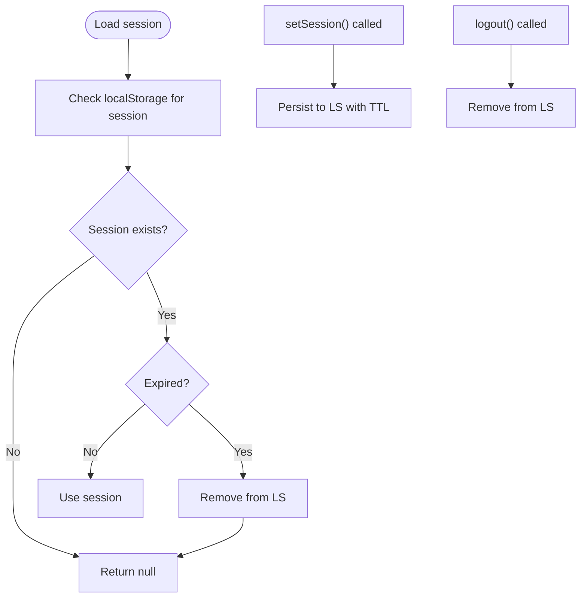

**Diagram sources**
- [useAuth.tsx:1-60](file://frontend/src/hooks/useAuth.tsx#L1-L60)
- [apiClient.ts:1-79](file://frontend/src/services/apiClient.ts#L1-L79)

**Section sources**
- [useAuth.tsx:1-60](file://frontend/src/hooks/useAuth.tsx#L1-L60)

### Internationalization and Theme Management
- I18nProvider loads initial locale from localStorage or defaults to en-US
- On mount, it syncs user preferences from backend and updates localStorage
- Locale changes update document direction and language attributes
- index.css defines design tokens and component utilities for light enterprise theme

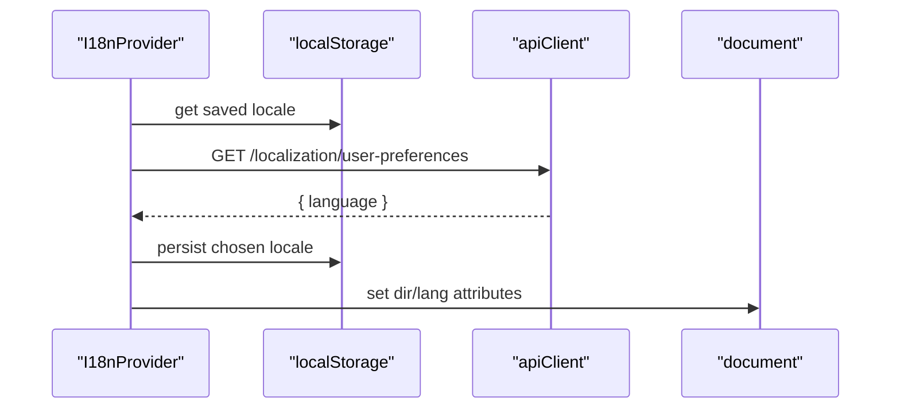

**Diagram sources**
- [I18nProvider.tsx:1-66](file://frontend/src/i18n/I18nProvider.tsx#L1-L66)
- [index.ts:1-40](file://frontend/src/i18n/index.ts#L1-L40)
- [index.css:1-904](file://frontend/src/styles/index.css#L1-L904)

**Section sources**
- [I18nProvider.tsx:1-66](file://frontend/src/i18n/I18nProvider.tsx#L1-L66)
- [index.ts:1-40](file://frontend/src/i18n/index.ts#L1-L40)
- [index.css:1-904](file://frontend/src/styles/index.css#L1-L904)

### RBAC and Permission Gates
- rbacConfig.ts defines canonical permissions and aliases
- hasPermission normalizes punctuation and checks inclusion
- usePermission provides hooks for checking single/multiple/all permissions
- RequirePermission and PermissionGate enforce access at render time

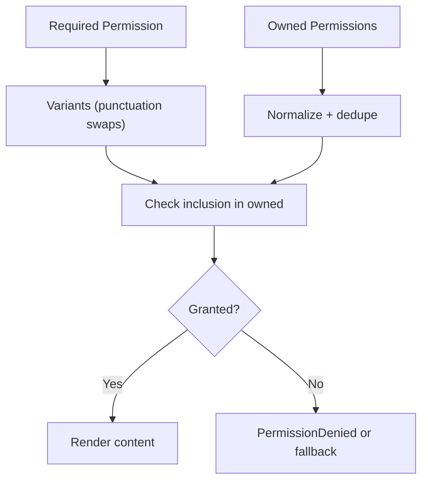

**Diagram sources**
- [rbacConfig.ts:1-404](file://frontend/src/auth/rbacConfig.ts#L1-L404)
- [usePermission.tsx:1-106](file://frontend/src/hooks/usePermission.tsx#L1-L106)

**Section sources**
- [rbacConfig.ts:1-404](file://frontend/src/auth/rbacConfig.ts#L1-L404)
- [usePermission.tsx:1-106](file://frontend/src/hooks/usePermission.tsx#L1-L106)

### Module-Based Architecture and Dynamic Imports
- moduleConfig.ts enumerates 134+ modules with keys, routes, groups, and required permissions
- App.tsx dynamically generates routes for modules not explicitly handled
- Icons are mapped per module key for sidebar rendering
- AppShell filters visible sections based on user permissions

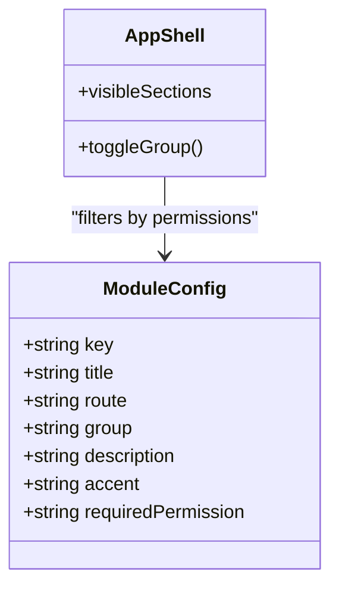

**Diagram sources**
- [moduleConfig.ts:1-215](file://frontend/src/modules/moduleConfig.ts#L1-L215)
- [AppShell.tsx:1-394](file://frontend/src/layouts/AppShell.tsx#L1-L394)

**Section sources**
- [moduleConfig.ts:1-215](file://frontend/src/modules/moduleConfig.ts#L1-L215)
- [AppShell.tsx:1-394](file://frontend/src/layouts/AppShell.tsx#L1-L394)

### API Client and Interceptors
- apiClient creates axios instance with base URL resolution from environment
- Request interceptor adds Authorization and CSRF token
- Response interceptor captures CSRF tokens and handles 401 by clearing session and redirecting
- unwrap utility extracts data from envelope

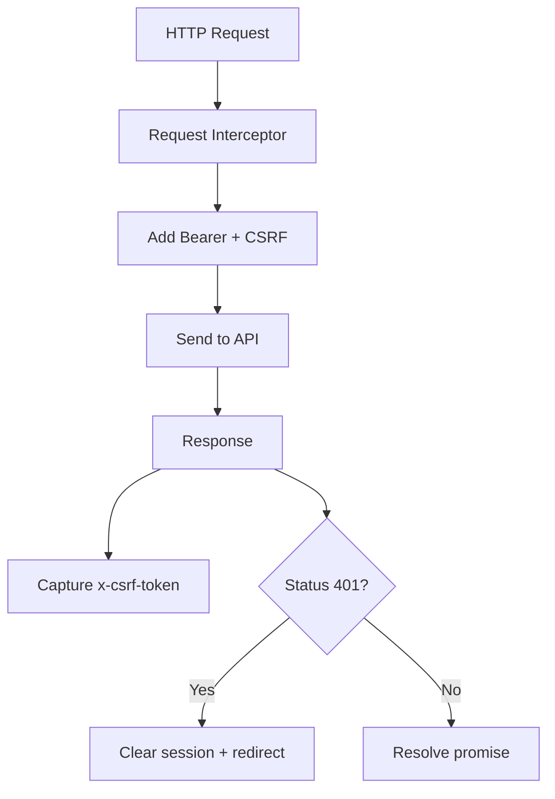

**Diagram sources**
- [apiClient.ts:1-79](file://frontend/src/services/apiClient.ts#L1-L79)

**Section sources**
- [apiClient.ts:1-79](file://frontend/src/services/apiClient.ts#L1-L79)

### Styling Architecture and Responsive Patterns
- TailwindCSS v4 integrates via @tailwindcss/vite plugin
- index.css defines design tokens (colors, shadows, radii) and reusable utilities
- Utilities include buttons, badges, fields, animations, and chart overrides
- AppShell uses responsive breakpoints and mobile-first navigation

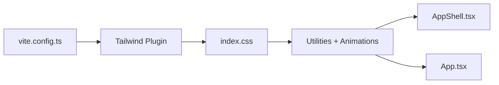

**Diagram sources**
- [vite.config.ts:1-13](file://frontend/vite.config.ts#L1-L13)
- [index.css:1-904](file://frontend/src/styles/index.css#L1-L904)
- [AppShell.tsx:1-394](file://frontend/src/layouts/AppShell.tsx#L1-L394)

**Section sources**
- [vite.config.ts:1-13](file://frontend/vite.config.ts#L1-L13)
- [index.css:1-904](file://frontend/src/styles/index.css#L1-L904)

## Dependency Analysis
- Build toolchain: Vite with React and Tailwind plugins
- Runtime: React 19, React Router 7, React Query 5, Axios
- Styling: TailwindCSS v4, design tokens, animations
- TypeScript configured for bundler resolution and JSX transform

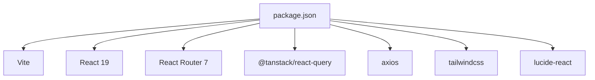

**Diagram sources**
- [package.json:1-42](file://frontend/package.json#L1-L42)

**Section sources**
- [package.json:1-42](file://frontend/package.json#L1-L42)
- [tsconfig.json:1-26](file://frontend/tsconfig.json#L1-L26)

## Performance Considerations
- Lazy loading and code splitting reduce initial bundle size; verify with Vite build analyzer
- React Query caching reduces redundant network calls; tune query keys and stale times
- Tailwind purging and minimal CSS usage improve runtime performance
- Avoid unnecessary re-renders by memoizing computed lists (e.g., visibleSections)
- Prefer lightweight icons and defer heavy charts until needed

[No sources needed since this section provides general guidance]

## Troubleshooting Guide
- Top-level errors: ErrorBoundary displays a friendly message and refresh option
- Authentication errors: apiClient clears session on 401 and redirects to login
- Permission denials: RequirePermission renders PermissionDenied with requested permission
- Locale issues: I18nProvider falls back to en-US and persists selection in localStorage

**Section sources**
- [ErrorBoundary.tsx:1-51](file://frontend/src/components/ErrorBoundary.tsx#L1-L51)
- [apiClient.ts:1-79](file://frontend/src/services/apiClient.ts#L1-L79)
- [usePermission.tsx:1-106](file://frontend/src/hooks/usePermission.tsx#L1-L106)
- [I18nProvider.tsx:1-66](file://frontend/src/i18n/I18nProvider.tsx#L1-L66)

## Conclusion
OpsTrax Enterprise employs a robust, modular frontend architecture leveraging React 19, React Router 7, and React Query. The provider pattern, custom hooks, and centralized API client deliver a scalable foundation. The module-based routing with 134+ modules, combined with lazy loading and permission gates, ensures maintainability and performance. TailwindCSS with design tokens enables consistent theming and responsive UI. The build and environment configuration supports efficient development and reliable production deployments.

## Appendices

### Environment Variables and Base URLs
- API base URL resolved from VITE_API_BASE_URL or VITE_DOTNET_API_URL with sensible default
- Node events URL resolved from VITE_NODE_EVENTS_URL with sensible default

**Section sources**
- [apiClient.ts:1-20](file://frontend/src/services/apiClient.ts#L1-L20)

### Type Definitions
- ApiEnvelope standardizes API responses
- ModuleConfig describes module metadata
- UserSession carries token, CSRF, user, role, company, and permissions

**Section sources**
- [index.ts (types):1-51](file://frontend/src/types/index.ts#L1-L51)