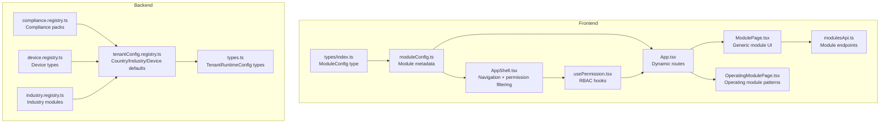
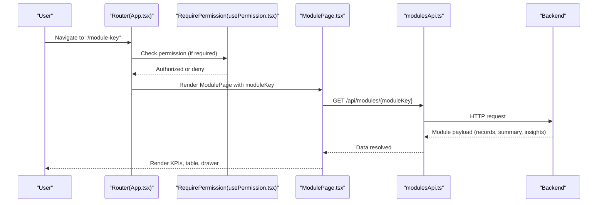
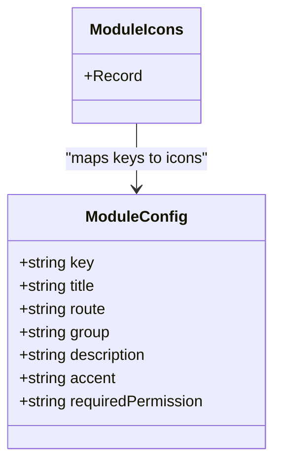
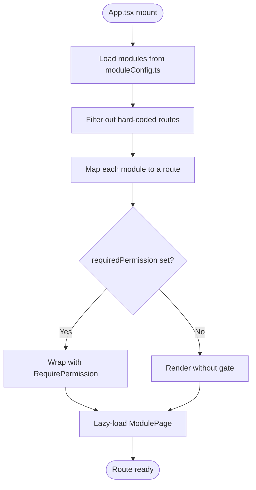
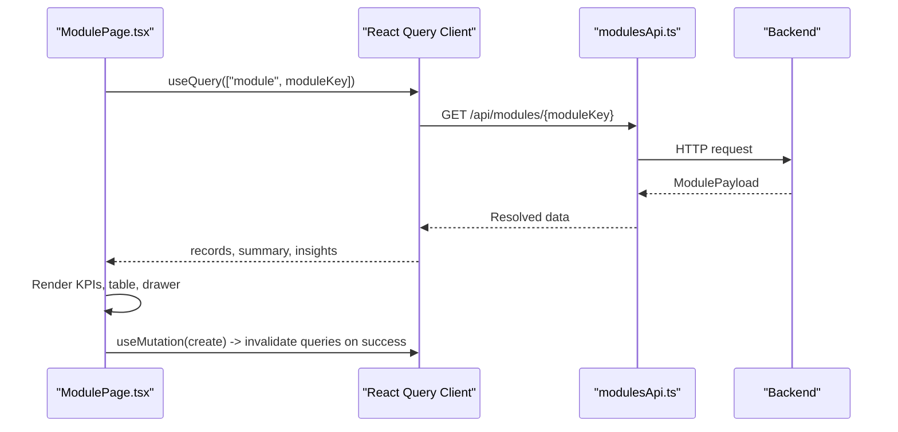
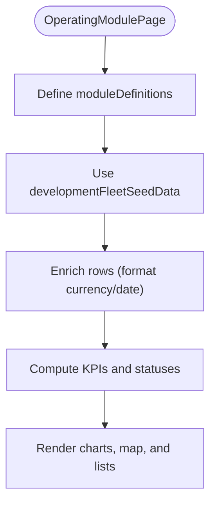
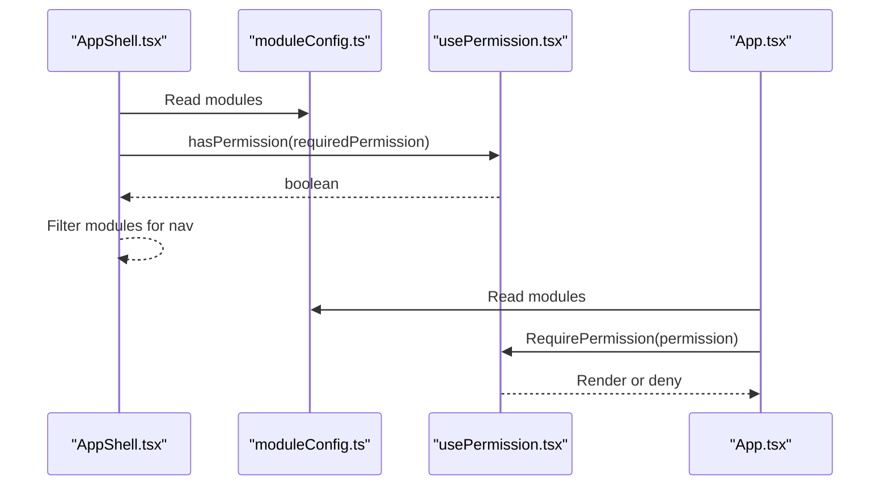
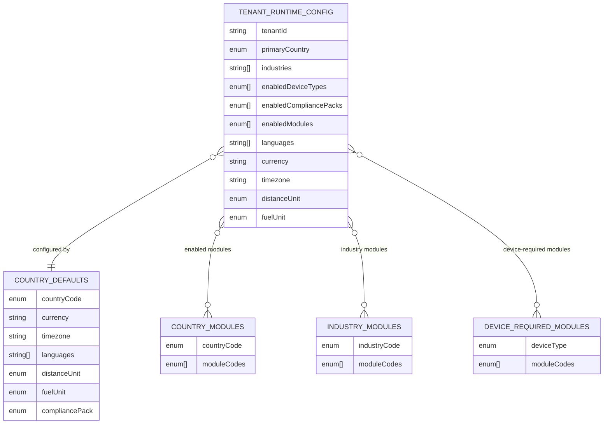
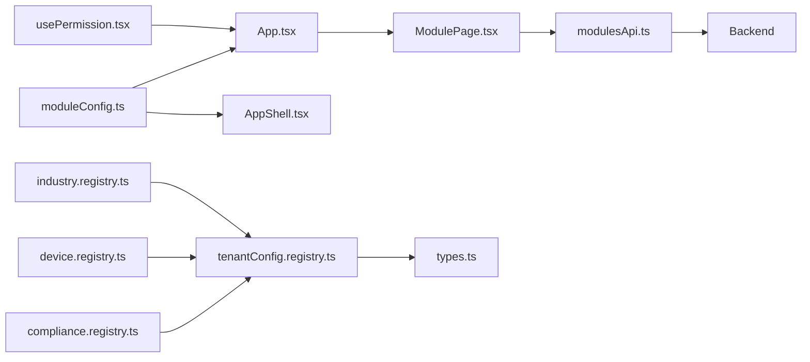

# Module System

<cite>
**Referenced Files in This Document**
- [moduleConfig.ts](file://frontend/src/modules/moduleConfig.ts)
- [ModulePage.tsx](file://frontend/src/pages/ModulePage.tsx)
- [OperatingModulePage.tsx](file://frontend/src/pages/OperatingModulePage.tsx)
- [App.tsx](file://frontend/src/App.tsx)
- [AppShell.tsx](file://frontend/src/layouts/AppShell.tsx)
- [modulesApi.ts](file://frontend/src/services/modulesApi.ts)
- [usePermission.tsx](file://frontend/src/hooks/usePermission.tsx)
- [index.ts](file://frontend/src/types/index.ts)
- [tenantConfig.registry.ts](file://backend/src/modules/tenant-config/tenantConfig.registry.ts)
- [types.ts](file://backend/src/modules/tenant-config/types.ts)
- [compliance.registry.ts](file://backend/src/modules/compliance/compliance.registry.ts)
- [device.registry.ts](file://backend/src/modules/devices/device.registry.ts)
- [industry.registry.ts](file://backend/src/modules/industry/industry.registry.ts)
</cite>

## Table of Contents
1. [Introduction](#introduction)
2. [Project Structure](#project-structure)
3. [Core Components](#core-components)
4. [Architecture Overview](#architecture-overview)
5. [Detailed Component Analysis](#detailed-component-analysis)
6. [Dependency Analysis](#dependency-analysis)
7. [Performance Considerations](#performance-considerations)
8. [Troubleshooting Guide](#troubleshooting-guide)
9. [Conclusion](#conclusion)
10. [Appendices](#appendices)

## Introduction
This document describes the module system powering the OpsTrax React application. It explains the 134+ module architecture, module configuration management, dynamic module loading, and module-specific route handling. It covers the ModulePage component implementation, operating module patterns, and module permission management. It also provides module development guidelines, testing strategies, performance optimization tips, module isolation practices, shared module dependencies, and upgrade strategies.

## Project Structure
The module system spans the frontend and backend:
- Frontend defines module metadata, routes, UI components, and permission gating.
- Backend defines module registries for compliance packs, device types, industries, and tenant runtime configuration.

**Diagram sources**
- [moduleConfig.ts:1-215](file://frontend/src/modules/moduleConfig.ts#L1-L215)
- [ModulePage.tsx:1-125](file://frontend/src/pages/ModulePage.tsx#L1-L125)
- [OperatingModulePage.tsx:1-800](file://frontend/src/pages/OperatingModulePage.tsx#L1-L800)
- [App.tsx:124-322](file://frontend/src/App.tsx#L124-L322)
- [AppShell.tsx:76-394](file://frontend/src/layouts/AppShell.tsx#L76-L394)
- [modulesApi.ts:1-49](file://frontend/src/services/modulesApi.ts#L1-L49)
- [usePermission.tsx:1-106](file://frontend/src/hooks/usePermission.tsx#L1-L106)
- [index.ts:19-41](file://frontend/src/types/index.ts#L19-L41)
- [tenantConfig.registry.ts:1-178](file://backend/src/modules/tenant-config/tenantConfig.registry.ts#L1-L178)
- [types.ts:54-67](file://backend/src/modules/tenant-config/types.ts#L54-L67)
- [compliance.registry.ts:1-142](file://backend/src/modules/compliance/compliance.registry.ts#L1-L142)
- [device.registry.ts:1-61](file://backend/src/modules/devices/device.registry.ts#L1-L61)
- [industry.registry.ts:1-52](file://backend/src/modules/industry/industry.registry.ts#L1-L52)

**Section sources**
- [moduleConfig.ts:1-215](file://frontend/src/modules/moduleConfig.ts#L1-L215)
- [App.tsx:124-322](file://frontend/src/App.tsx#L124-L322)
- [AppShell.tsx:76-394](file://frontend/src/layouts/AppShell.tsx#L76-L394)
- [modulesApi.ts:1-49](file://frontend/src/services/modulesApi.ts#L1-L49)
- [usePermission.tsx:1-106](file://frontend/src/hooks/usePermission.tsx#L1-L106)
- [index.ts:19-41](file://frontend/src/types/index.ts#L19-L41)
- [tenantConfig.registry.ts:1-178](file://backend/src/modules/tenant-config/tenantConfig.registry.ts#L1-L178)
- [types.ts:54-67](file://backend/src/modules/tenant-config/types.ts#L54-L67)
- [compliance.registry.ts:1-142](file://backend/src/modules/compliance/compliance.registry.ts#L1-L142)
- [device.registry.ts:1-61](file://backend/src/modules/devices/device.registry.ts#L1-L61)
- [industry.registry.ts:1-52](file://backend/src/modules/industry/industry.registry.ts#L1-L52)

## Core Components
- Module metadata and icons: Centralized module definitions and icon mapping enable consistent navigation and UI rendering.
- Dynamic routes: The router composes routes from module metadata, applying permission checks and lazy-loading.
- Generic module page: ModulePage provides a reusable UI scaffold for any module with standardized KPIs, filters, data table, and detail drawer.
- Permission gating: RBAC hooks enforce module access based on user permissions.
- Backend registries: Tenant defaults, compliance packs, device types, and industry modules define platform configuration.

**Section sources**
- [moduleConfig.ts:52-134](file://frontend/src/modules/moduleConfig.ts#L52-L134)
- [moduleConfig.ts:136-214](file://frontend/src/modules/moduleConfig.ts#L136-L214)
- [App.tsx:278-315](file://frontend/src/App.tsx#L278-L315)
- [ModulePage.tsx:55-125](file://frontend/src/pages/ModulePage.tsx#L55-L125)
- [usePermission.tsx:47-66](file://frontend/src/hooks/usePermission.tsx#L47-L66)
- [tenantConfig.registry.ts:9-178](file://backend/src/modules/tenant-config/tenantConfig.registry.ts#L9-L178)
- [compliance.registry.ts:3-141](file://backend/src/modules/compliance/compliance.registry.ts#L3-L141)
- [device.registry.ts:3-60](file://backend/src/modules/devices/device.registry.ts#L3-L60)
- [industry.registry.ts:1-51](file://backend/src/modules/industry/industry.registry.ts#L1-L51)

## Architecture Overview
The module system follows a declarative configuration pattern:
- Frontend reads module metadata and builds routes dynamically.
- Each module route renders either a generic ModulePage or a specialized OperatingModulePage.
- Permission gates ensure only authorized users can access protected modules.
- Backend registries supply tenant-specific defaults and module sets.

**Diagram sources**
- [App.tsx:278-315](file://frontend/src/App.tsx#L278-L315)
- [usePermission.tsx:47-66](file://frontend/src/hooks/usePermission.tsx#L47-L66)
- [ModulePage.tsx:63-70](file://frontend/src/pages/ModulePage.tsx#L63-L70)
- [modulesApi.ts:43-48](file://frontend/src/services/modulesApi.ts#L43-L48)

## Detailed Component Analysis

### Module Metadata and Icons
- moduleConfig.ts defines 134+ modules with keys, titles, routes, groups, descriptions, accents, and optional required permissions.
- Icons are mapped per module key for consistent navigation presentation.

**Diagram sources**
- [moduleConfig.ts:19-41](file://frontend/src/types/index.ts#L19-L41)
- [moduleConfig.ts:136-214](file://frontend/src/modules/moduleConfig.ts#L136-L214)

**Section sources**
- [moduleConfig.ts:52-134](file://frontend/src/modules/moduleConfig.ts#L52-L134)
- [moduleConfig.ts:136-214](file://frontend/src/modules/moduleConfig.ts#L136-L214)
- [index.ts:19-41](file://frontend/src/types/index.ts#L19-L41)

### Dynamic Module Routing
- App.tsx constructs routes from moduleConfig.ts, filtering out hard-coded routes and applying RequirePermission wrappers when requiredPermission exists.
- Lazy loading ensures fast initial bundle sizes.

**Diagram sources**
- [App.tsx:278-315](file://frontend/src/App.tsx#L278-L315)
- [moduleConfig.ts:52-134](file://frontend/src/modules/moduleConfig.ts#L52-L134)

**Section sources**
- [App.tsx:278-315](file://frontend/src/App.tsx#L278-L315)

### ModulePage Component Implementation
- ModulePage fetches module data via modulesApi, displays KPIs, a filter bar, a data table, AI insights, and a detail drawer.
- Supports a “Review Queue” mode and a generic create modal for records.

**Diagram sources**
- [ModulePage.tsx:63-70](file://frontend/src/pages/ModulePage.tsx#L63-L70)
- [modulesApi.ts:43-48](file://frontend/src/services/modulesApi.ts#L43-L48)

**Section sources**
- [ModulePage.tsx:55-125](file://frontend/src/pages/ModulePage.tsx#L55-L125)
- [modulesApi.ts:12-41](file://frontend/src/services/modulesApi.ts#L12-L41)

### Operating Module Patterns
- OperatingModulePage demonstrates patterns for operational modules: enriched rows, KPIs, charts, map previews, and vehicle monitoring.
- Uses seeded data and helper functions to compute derived metrics and statuses.

**Diagram sources**
- [OperatingModulePage.tsx:160-441](file://frontend/src/pages/OperatingModulePage.tsx#L160-L441)
- [OperatingModulePage.tsx:447-461](file://frontend/src/pages/OperatingModulePage.tsx#L447-L461)

**Section sources**
- [OperatingModulePage.tsx:160-441](file://frontend/src/pages/OperatingModulePage.tsx#L160-L441)
- [OperatingModulePage.tsx:447-461](file://frontend/src/pages/OperatingModulePage.tsx#L447-L461)

### Permission Management
- usePermission.tsx exposes hooks for checking permissions and gating routes/components.
- App.tsx wraps module routes with RequirePermission when requiredPermission is present.
- AppShell filters navigation items based on user permissions.

**Diagram sources**
- [AppShell.tsx:116-124](file://frontend/src/layouts/AppShell.tsx#L116-L124)
- [moduleConfig.ts:52-134](file://frontend/src/modules/moduleConfig.ts#L52-L134)
- [usePermission.tsx:47-66](file://frontend/src/hooks/usePermission.tsx#L47-L66)
- [App.tsx:278-315](file://frontend/src/App.tsx#L278-L315)

**Section sources**
- [usePermission.tsx:1-106](file://frontend/src/hooks/usePermission.tsx#L1-L106)
- [AppShell.tsx:116-124](file://frontend/src/layouts/AppShell.tsx#L116-L124)
- [App.tsx:278-315](file://frontend/src/App.tsx#L278-L315)

### Backend Registries and Tenant Configuration
- tenantConfig.registry.ts defines country defaults, enabled modules per country, industry modules, and device-required modules.
- types.ts enumerates module codes and the TenantRuntimeConfig shape.
- compliance.registry.ts, device.registry.ts, and industry.registry.ts provide domain-specific module catalogs.

**Diagram sources**
- [tenantConfig.registry.ts:9-178](file://backend/src/modules/tenant-config/tenantConfig.registry.ts#L9-L178)
- [types.ts:54-67](file://backend/src/modules/tenant-config/types.ts#L54-L67)
- [compliance.registry.ts:3-141](file://backend/src/modules/compliance/compliance.registry.ts#L3-L141)
- [device.registry.ts:3-60](file://backend/src/modules/devices/device.registry.ts#L3-L60)
- [industry.registry.ts:1-51](file://backend/src/modules/industry/industry.registry.ts#L1-L51)

**Section sources**
- [tenantConfig.registry.ts:9-178](file://backend/src/modules/tenant-config/tenantConfig.registry.ts#L9-L178)
- [types.ts:54-67](file://backend/src/modules/tenant-config/types.ts#L54-L67)
- [compliance.registry.ts:3-141](file://backend/src/modules/compliance/compliance.registry.ts#L3-L141)
- [device.registry.ts:3-60](file://backend/src/modules/devices/device.registry.ts#L3-L60)
- [industry.registry.ts:1-51](file://backend/src/modules/industry/industry.registry.ts#L1-L51)

## Dependency Analysis
- Frontend dependencies:
  - moduleConfig.ts feeds App.tsx, AppShell.tsx, and ModulePage.tsx.
  - modulesApi.ts depends on apiClient and endpoint mapping for module-specific endpoints.
  - usePermission.tsx integrates with auth and router guards.
- Backend dependencies:
  - tenantConfig.registry.ts centralizes defaults and module sets used across the platform.
  - Registries inform UI composition and route generation.

**Diagram sources**
- [moduleConfig.ts:52-134](file://frontend/src/modules/moduleConfig.ts#L52-L134)
- [App.tsx:278-315](file://frontend/src/App.tsx#L278-L315)
- [AppShell.tsx:116-124](file://frontend/src/layouts/AppShell.tsx#L116-L124)
- [ModulePage.tsx:63-70](file://frontend/src/pages/ModulePage.tsx#L63-L70)
- [modulesApi.ts:12-41](file://frontend/src/services/modulesApi.ts#L12-L41)
- [usePermission.tsx:47-66](file://frontend/src/hooks/usePermission.tsx#L47-L66)
- [tenantConfig.registry.ts:9-178](file://backend/src/modules/tenant-config/tenantConfig.registry.ts#L9-L178)
- [types.ts:54-67](file://backend/src/modules/tenant-config/types.ts#L54-L67)
- [compliance.registry.ts:3-141](file://backend/src/modules/compliance/compliance.registry.ts#L3-L141)
- [device.registry.ts:3-60](file://backend/src/modules/devices/device.registry.ts#L3-L60)
- [industry.registry.ts:1-51](file://backend/src/modules/industry/industry.registry.ts#L1-L51)

**Section sources**
- [moduleConfig.ts:52-134](file://frontend/src/modules/moduleConfig.ts#L52-L134)
- [App.tsx:278-315](file://frontend/src/App.tsx#L278-L315)
- [AppShell.tsx:116-124](file://frontend/src/layouts/AppShell.tsx#L116-L124)
- [ModulePage.tsx:63-70](file://frontend/src/pages/ModulePage.tsx#L63-L70)
- [modulesApi.ts:12-41](file://frontend/src/services/modulesApi.ts#L12-L41)
- [usePermission.tsx:47-66](file://frontend/src/hooks/usePermission.tsx#L47-L66)
- [tenantConfig.registry.ts:9-178](file://backend/src/modules/tenant-config/tenantConfig.registry.ts#L9-L178)
- [types.ts:54-67](file://backend/src/modules/tenant-config/types.ts#L54-L67)
- [compliance.registry.ts:3-141](file://backend/src/modules/compliance/compliance.registry.ts#L3-L141)
- [device.registry.ts:3-60](file://backend/src/modules/devices/device.registry.ts#L3-L60)
- [industry.registry.ts:1-51](file://backend/src/modules/industry/industry.registry.ts#L1-L51)

## Performance Considerations
- Lazy loading: Routes are lazily loaded to reduce initial bundle size.
- React Query: Efficient caching and invalidation minimize redundant network requests.
- Icon mapping: Predefined icon map avoids dynamic imports inside loops.
- Permission filtering: AppShell filters navigation items client-side to avoid rendering unauthorized links.
- Backend defaults: Centralized registries reduce branching logic and improve predictability.

[No sources needed since this section provides general guidance]

## Troubleshooting Guide
- Permission denied: RequirePermission displays a denial UI when a user lacks the required permission.
- Missing module route: Verify module.key exists in moduleConfig.ts and is not filtered out by App.tsx.
- API endpoint mismatch: modulesApi.ts maps module keys to endpoints; confirm the backend exposes the expected route.
- Navigation missing: AppShell filters modules by permission; ensure the user has the required permission.

**Section sources**
- [usePermission.tsx:84-103](file://frontend/src/hooks/usePermission.tsx#L84-L103)
- [App.tsx:278-315](file://frontend/src/App.tsx#L278-L315)
- [modulesApi.ts:12-41](file://frontend/src/services/modulesApi.ts#L12-L41)
- [AppShell.tsx:116-124](file://frontend/src/layouts/AppShell.tsx#L116-L124)

## Conclusion
The OpsTrax module system combines declarative frontend configuration with backend-driven registries to deliver a scalable, permission-aware, and maintainable platform. The 134+ modules are consistently routed, rendered, and secured, enabling rapid feature delivery and tenant customization.

[No sources needed since this section summarizes without analyzing specific files]

## Appendices

### Module Development Guidelines
- Add or update module entries in moduleConfig.ts with key, title, route, group, description, accent, and optional requiredPermission.
- Implement or reuse ModulePage.tsx for generic modules; use OperatingModulePage.tsx patterns for operational modules.
- Define endpoints in modulesApi.ts if the module requires dedicated backend routes.
- Gate routes in App.tsx using RequirePermission when requiredPermission is set.
- Keep navigation filtering in AppShell.tsx synchronized with moduleConfig.ts.

**Section sources**
- [moduleConfig.ts:52-134](file://frontend/src/modules/moduleConfig.ts#L52-L134)
- [ModulePage.tsx:55-125](file://frontend/src/pages/ModulePage.tsx#L55-L125)
- [modulesApi.ts:12-41](file://frontend/src/services/modulesApi.ts#L12-L41)
- [App.tsx:278-315](file://frontend/src/App.tsx#L278-L315)
- [AppShell.tsx:116-124](file://frontend/src/layouts/AppShell.tsx#L116-L124)

### Module Testing Strategies
- Unit tests for ModulePage: Mock modulesApi responses and assert KPI rendering, table rows, and drawer behavior.
- Integration tests for routes: Verify RequirePermission gating and navigation filtering in AppShell.
- Backend registry tests: Validate country/industry/device module mappings and defaults.

[No sources needed since this section provides general guidance]

### Module Isolation and Shared Dependencies
- Isolation: Each module’s route and UI are encapsulated; ModulePage provides a consistent shell.
- Shared dependencies: React Query, TanStack Router, Lucide icons, and shared UI components.

**Section sources**
- [ModulePage.tsx:55-125](file://frontend/src/pages/ModulePage.tsx#L55-L125)
- [App.tsx:278-315](file://frontend/src/App.tsx#L278-L315)

### Module Upgrade Strategies
- Registry-driven upgrades: Update tenantConfig.registry.ts defaults and module sets; frontend adapts automatically.
- Backward compatibility: Maintain module keys and routes; introduce new keys for new features.
- Gradual rollout: Use feature flags and tenant configuration to enable modules per tenant.

**Section sources**
- [tenantConfig.registry.ts:9-178](file://backend/src/modules/tenant-config/tenantConfig.registry.ts#L9-L178)
- [types.ts:54-67](file://backend/src/modules/tenant-config/types.ts#L54-L67)