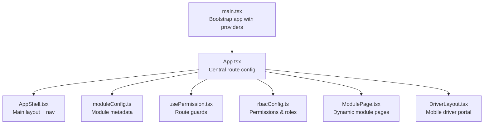
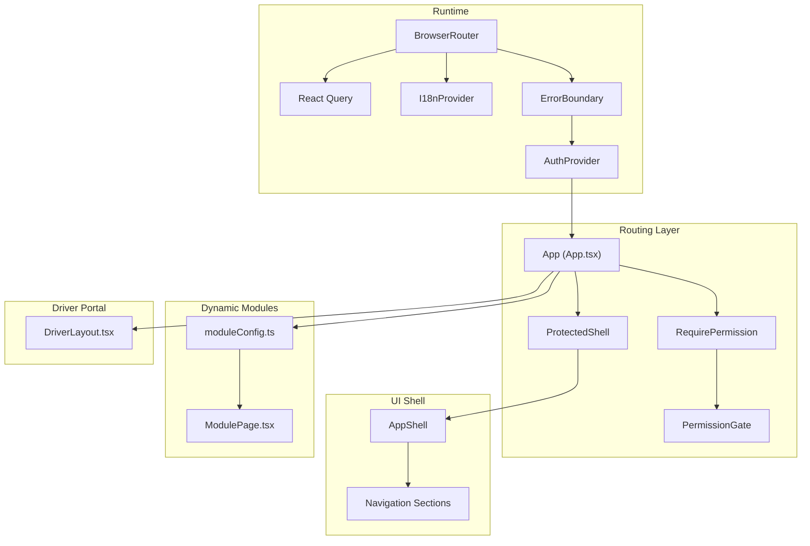
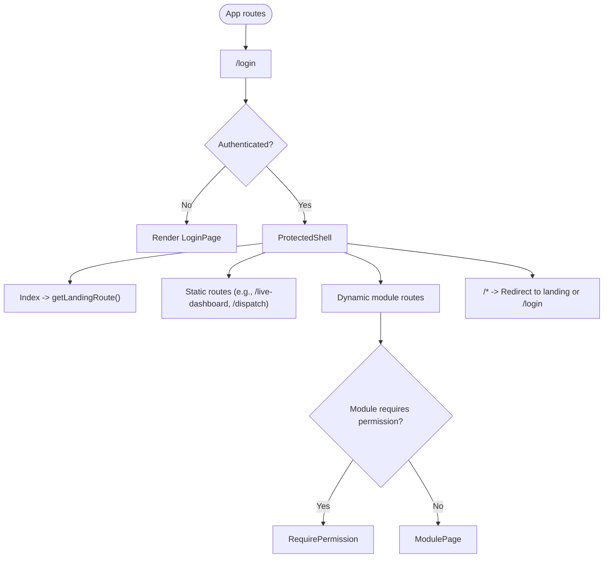
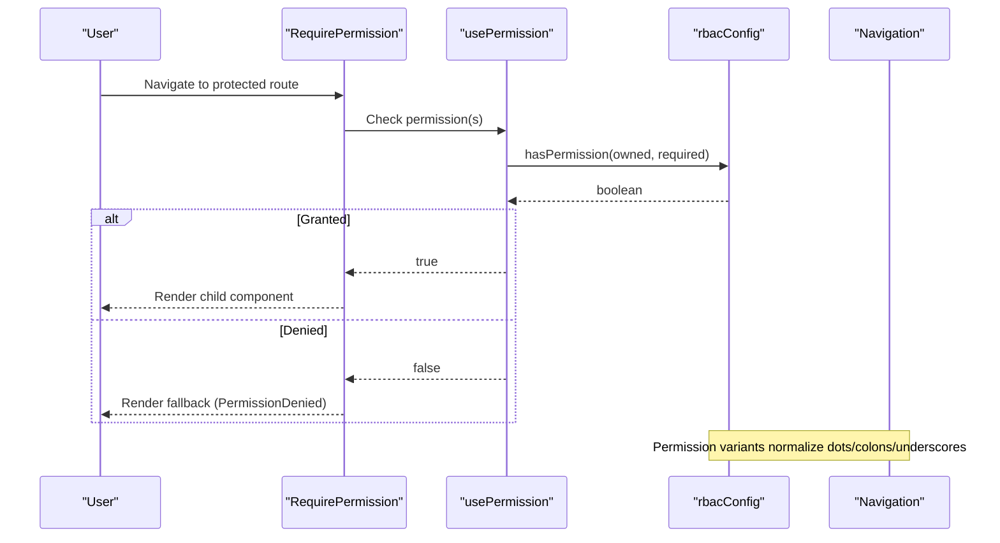
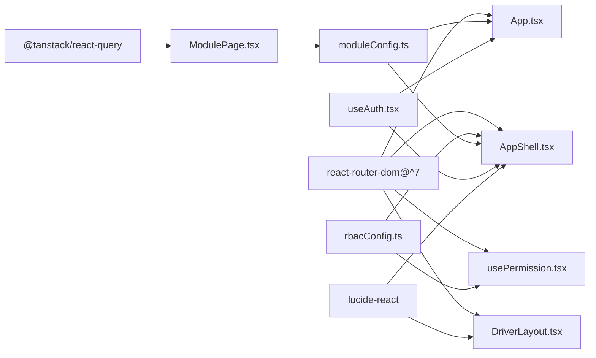

# Routing & Navigation

<cite>
**Referenced Files in This Document**
- [main.tsx](file://frontend/src/main.tsx)
- [App.tsx](file://frontend/src/App.tsx)
- [AppShell.tsx](file://frontend/src/layouts/AppShell.tsx)
- [moduleConfig.ts](file://frontend/src/modules/moduleConfig.ts)
- [usePermission.tsx](file://frontend/src/hooks/usePermission.tsx)
- [rbacConfig.ts](file://frontend/src/auth/rbacConfig.ts)
- [useAuth.tsx](file://frontend/src/hooks/useAuth.tsx)
- [types/index.ts](file://frontend/src/types/index.ts)
- [ModulePage.tsx](file://frontend/src/pages/ModulePage.tsx)
- [DriverLayout.tsx](file://frontend/src/pages/driver/DriverLayout.tsx)
- [package.json](file://frontend/package.json)
- [vite.config.ts](file://frontend/vite.config.ts)
</cite>

## Table of Contents
1. [Introduction](#introduction)
2. [Project Structure](#project-structure)
3. [Core Components](#core-components)
4. [Architecture Overview](#architecture-overview)
5. [Detailed Component Analysis](#detailed-component-analysis)
6. [Dependency Analysis](#dependency-analysis)
7. [Performance Considerations](#performance-considerations)
8. [Troubleshooting Guide](#troubleshooting-guide)
9. [Conclusion](#conclusion)

## Introduction
This document explains the routing and navigation system of the OpsTrax React application. It covers the React Router 7 implementation, route configuration, dynamic route generation from module metadata, permission-based route protection, lazy loading strategies, the AppShell layout system, navigation patterns, and landing page determination based on user permissions. It also addresses route guards, redirect logic, navigation performance optimization, route preloading, and SEO considerations for a single-page application.

## Project Structure
The routing and navigation logic is centered around:
- Application bootstrap and router setup
- Central route configuration and protected shell
- Module-based dynamic route generation
- Permission-aware navigation and guards
- Layout composition and driver portal

**Diagram sources**
- [main.tsx:1-35](file://frontend/src/main.tsx#L1-L35)
- [App.tsx:124-321](file://frontend/src/App.tsx#L124-L321)
- [AppShell.tsx:76-393](file://frontend/src/layouts/AppShell.tsx#L76-L393)
- [moduleConfig.ts:52-134](file://frontend/src/modules/moduleConfig.ts#L52-L134)
- [usePermission.tsx:47-66](file://frontend/src/hooks/usePermission.tsx#L47-L66)
- [rbacConfig.ts:379-387](file://frontend/src/auth/rbacConfig.ts#L379-L387)
- [ModulePage.tsx:55-124](file://frontend/src/pages/ModulePage.tsx#L55-L124)
- [DriverLayout.tsx:16-82](file://frontend/src/pages/driver/DriverLayout.tsx#L16-L82)

**Section sources**
- [main.tsx:1-35](file://frontend/src/main.tsx#L1-L35)
- [App.tsx:124-321](file://frontend/src/App.tsx#L124-L321)
- [moduleConfig.ts:52-134](file://frontend/src/modules/moduleConfig.ts#L52-L134)

## Core Components
- Router bootstrap and providers: The app initializes React Query, internationalization, browser routing, error boundary, authentication provider, and wraps the root App component.
- Central route configuration: Routes are declared centrally, including static routes, lazy-loaded pages, driver portal, and dynamic module routes.
- Permission system: Canonical permission constants, variant normalization, and role-to-permissions mapping enable flexible permission checks.
- Route guards: RequirePermission and ProtectedRoute enforce access control and redirect unauthorized users.
- AppShell layout: Provides the main navigation sidebar, responsive header, and content area with permission-aware visibility.
- Dynamic module pages: ModulePage renders module-specific lists and insights based on module metadata.
- Driver portal: A dedicated mobile-first layout with bottom navigation and offline awareness.

**Section sources**
- [main.tsx:1-35](file://frontend/src/main.tsx#L1-L35)
- [App.tsx:124-321](file://frontend/src/App.tsx#L124-L321)
- [rbacConfig.ts:1-404](file://frontend/src/auth/rbacConfig.ts#L1-L404)
- [usePermission.tsx:1-106](file://frontend/src/hooks/usePermission.tsx#L1-L106)
- [AppShell.tsx:76-393](file://frontend/src/layouts/AppShell.tsx#L76-L393)
- [ModulePage.tsx:55-124](file://frontend/src/pages/ModulePage.tsx#L55-L124)
- [DriverLayout.tsx:16-82](file://frontend/src/pages/driver/DriverLayout.tsx#L16-L82)

## Architecture Overview
The routing architecture combines centralized route configuration with a module-driven extension mechanism. Authentication and permissions gate access to routes and navigation items. Lazy loading is applied to most pages to optimize initial bundle size.

**Diagram sources**
- [main.tsx:20-34](file://frontend/src/main.tsx#L20-L34)
- [App.tsx:119-122](file://frontend/src/App.tsx#L119-L122)
- [App.tsx:145-316](file://frontend/src/App.tsx#L145-L316)
- [AppShell.tsx:116-124](file://frontend/src/layouts/AppShell.tsx#L116-L124)
- [moduleConfig.ts:52-134](file://frontend/src/modules/moduleConfig.ts#L52-L134)
- [ModulePage.tsx:55-124](file://frontend/src/pages/ModulePage.tsx#L55-L124)
- [DriverLayout.tsx:16-82](file://frontend/src/pages/driver/DriverLayout.tsx#L16-L82)

## Detailed Component Analysis

### React Router 7 Setup and Providers
- The application mounts BrowserRouter at the root and composes providers for error boundaries, authentication, i18n, and React Query.
- Suspense is used globally to wrap route rendering, ensuring lazy-loaded components render a consistent loading state.

**Section sources**
- [main.tsx:1-35](file://frontend/src/main.tsx#L1-L35)

### Central Route Configuration and Dynamic Generation
- Static routes include login, driver portal, and numerous operational routes grouped by domain.
- Dynamic routes are generated from module metadata, filtering out duplicates already handled statically.
- Each dynamic route conditionally applies RequirePermission based on module.requiredPermission.
- A wildcard route redirects unmatched paths to the user’s landing route or login.

**Diagram sources**
- [App.tsx:107-117](file://frontend/src/App.tsx#L107-L117)
- [App.tsx:145-316](file://frontend/src/App.tsx#L145-L316)
- [moduleConfig.ts:52-134](file://frontend/src/modules/moduleConfig.ts#L52-L134)

**Section sources**
- [App.tsx:107-117](file://frontend/src/App.tsx#L107-L117)
- [App.tsx:145-316](file://frontend/src/App.tsx#L145-L316)
- [moduleConfig.ts:52-134](file://frontend/src/modules/moduleConfig.ts#L52-L134)

### Landing Page Determination Based on Permissions
- The landing route is computed from the current session permissions, prioritizing driver self-service, dashboard access, customer portal, and fallbacks.

**Section sources**
- [App.tsx:107-117](file://frontend/src/App.tsx#L107-L117)
- [rbacConfig.ts:326-364](file://frontend/src/auth/rbacConfig.ts#L326-L364)

### Permission-Based Route Protection
- RequirePermission enforces either a single permission or any of a list of permissions, rendering a fallback or denying access.
- PermissionGate allows conditional rendering based on permission presence.
- ProtectedRoute ensures general authentication before rendering nested routes.

**Diagram sources**
- [usePermission.tsx:47-66](file://frontend/src/hooks/usePermission.tsx#L47-L66)
- [rbacConfig.ts:379-387](file://frontend/src/auth/rbacConfig.ts#L379-L387)

**Section sources**
- [usePermission.tsx:47-66](file://frontend/src/hooks/usePermission.tsx#L47-L66)
- [rbacConfig.ts:379-387](file://frontend/src/auth/rbacConfig.ts#L379-L387)

### Module-Based Routing System
- Module metadata defines keys, titles, routes, groups, descriptions, accents, and optional required permissions.
- Dynamic routes are generated by iterating modules, excluding those already statically routed, and wrapping with permission checks when applicable.
- ModulePage renders module-specific data, KPIs, filters, and AI insights.

**Section sources**
- [moduleConfig.ts:52-134](file://frontend/src/modules/moduleConfig.ts#L52-L134)
- [App.tsx:278-315](file://frontend/src/App.tsx#L278-L315)
- [ModulePage.tsx:55-124](file://frontend/src/pages/ModulePage.tsx#L55-L124)

### AppShell Layout System and Navigation Patterns
- AppShell builds navigation sections from module metadata and filters items by permission.
- Sidebar groups items by category, collapses sections, and highlights active links.
- Responsive design includes a mobile drawer and fixed header with user actions, notifications, and language switching.
- The layout renders Outlet for the current route and integrates with ProtectedShell.

**Section sources**
- [AppShell.tsx:14-65](file://frontend/src/layouts/AppShell.tsx#L14-L65)
- [AppShell.tsx:116-124](file://frontend/src/layouts/AppShell.tsx#L116-L124)
- [AppShell.tsx:176-200](file://frontend/src/layouts/AppShell.tsx#L176-L200)

### Driver Portal Navigation
- A dedicated mobile-first layout under /driver/* with bottom navigation tailored for drivers.
- Integrates offline queue status and unread notifications badge.

**Section sources**
- [DriverLayout.tsx:7-14](file://frontend/src/pages/driver/DriverLayout.tsx#L7-L14)
- [DriverLayout.tsx:16-82](file://frontend/src/pages/driver/DriverLayout.tsx#L16-L82)
- [App.tsx:134-143](file://frontend/src/App.tsx#L134-L143)

### Route Guards and Redirect Logic
- ProtectedShell redirects unauthenticated users to /login while preserving the intended destination.
- Index route redirects to the computed landing route.
- Wildcard route redirects to landing or login depending on session presence.

**Section sources**
- [App.tsx:119-122](file://frontend/src/App.tsx#L119-L122)
- [App.tsx:146](file://frontend/src/App.tsx#L146)
- [App.tsx:317](file://frontend/src/App.tsx#L317)

### Lazy Loading Strategies
- Pages are lazily imported using React.lazy with dynamic imports and Suspense wrapping the Routes.
- This reduces initial bundle size and defers heavy components until needed.

**Section sources**
- [App.tsx:37-105](file://frontend/src/App.tsx#L37-L105)
- [App.tsx:128-129](file://frontend/src/App.tsx#L128-L129)

### Authentication and Session Management
- AuthProvider persists session with TTL in localStorage and exposes logout.
- useAuth provides session state and logout to AppShell and route guards.

**Section sources**
- [useAuth.tsx:33-59](file://frontend/src/hooks/useAuth.tsx#L33-L59)
- [AppShell.tsx:77-78](file://frontend/src/layouts/AppShell.tsx#L77-L78)

### Types and Metadata
- ModuleConfig describes module shape including requiredPermission.
- UserSession carries permissions array used by guards and navigation visibility.

**Section sources**
- [types/index.ts:19-50](file://frontend/src/types/index.ts#L19-L50)

## Dependency Analysis
The routing system depends on:
- React Router 7 for declarative routing and navigation.
- TanStack React Query for data fetching within module pages.
- Lucide icons for navigation and module icons.
- Tailwind CSS for responsive layout and UI.

**Diagram sources**
- [package.json:25](file://frontend/package.json#L25)
- [App.tsx:1-10](file://frontend/src/App.tsx#L1-L10)
- [AppShell.tsx:1-12](file://frontend/src/layouts/AppShell.tsx#L1-L12)
- [usePermission.tsx:1-6](file://frontend/src/hooks/usePermission.tsx#L1-L6)
- [moduleConfig.ts:1-49](file://frontend/src/modules/moduleConfig.ts#L1-L49)
- [ModulePage.tsx:1-7](file://frontend/src/pages/ModulePage.tsx#L1-L7)
- [useAuth.tsx:1-5](file://frontend/src/hooks/useAuth.tsx#L1-L5)
- [DriverLayout.tsx:1-6](file://frontend/src/pages/driver/DriverLayout.tsx#L1-L6)

**Section sources**
- [package.json:15-27](file://frontend/package.json#L15-L27)
- [vite.config.ts:1-13](file://frontend/vite.config.ts#L1-L13)

## Performance Considerations
- Lazy loading: Implemented via React.lazy and Suspense to defer expensive components.
- Minimal re-renders: AppShell computes visible sections memoized by permissions and session.
- Efficient guards: Permission checks leverage normalized variants and sets for fast evaluation.
- Route preloading: No explicit preloading is configured; consider adding preloading for frequently accessed routes if needed.
- Bundle splitting: Dynamic imports naturally split bundles by route.

[No sources needed since this section provides general guidance]

## Troubleshooting Guide
- Permission denied pages: RequirePermission renders a dedicated PermissionDenied component when access is denied.
- Unauthenticated access: ProtectedShell redirects to /login; ensure AuthProvider is mounted.
- Unknown routes: Wildcard route navigates to landing or login; verify getLandingRoute logic and session permissions.
- Navigation visibility: AppShell filters items by permission; confirm module.requiredPermission and user.permissions alignment.

**Section sources**
- [usePermission.tsx:84-103](file://frontend/src/hooks/usePermission.tsx#L84-L103)
- [App.tsx:119-122](file://frontend/src/App.tsx#L119-L122)
- [App.tsx:317](file://frontend/src/App.tsx#L317)
- [AppShell.tsx:116-124](file://frontend/src/layouts/AppShell.tsx#L116-L124)

## Conclusion
OpsTrax employs a robust, module-driven routing architecture powered by React Router 7. Central route configuration, permission-aware guards, and lazy loading deliver a scalable and secure navigation experience. The AppShell layout provides intuitive navigation across functional domains, while the driver portal offers a mobile-first experience. The system’s design supports maintainability, performance, and accessibility for diverse user roles.