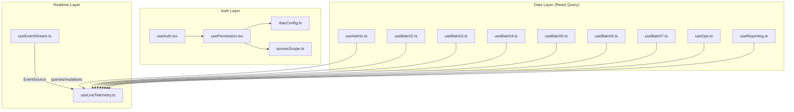
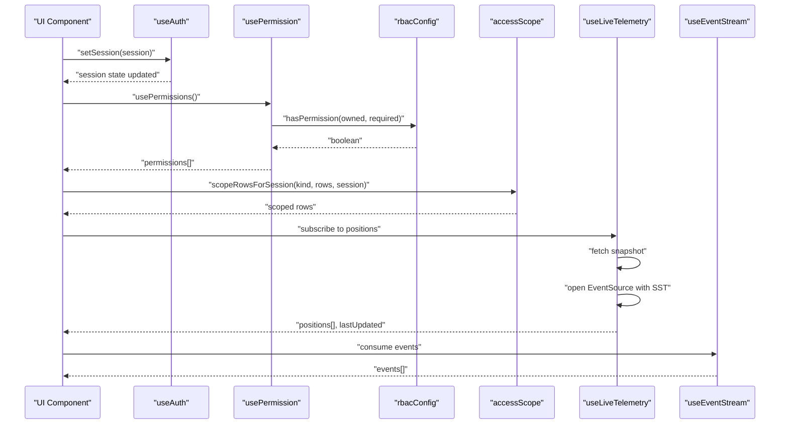
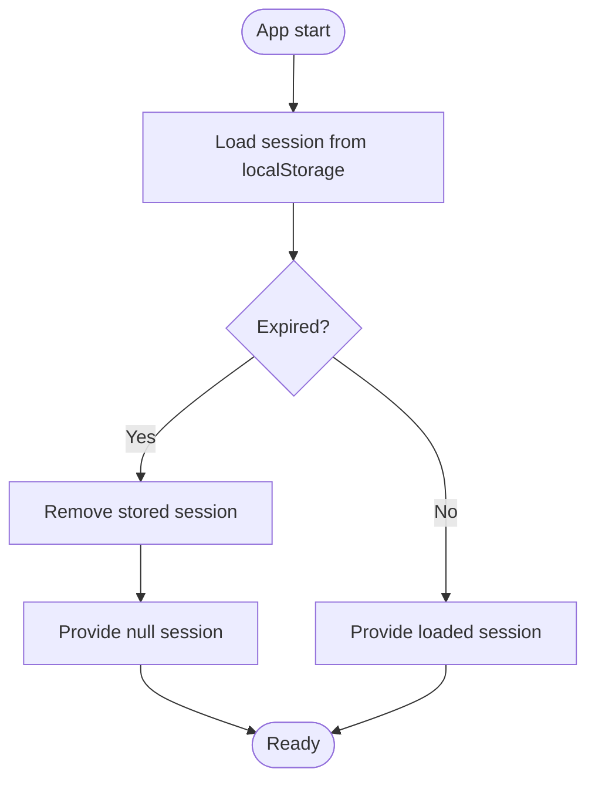
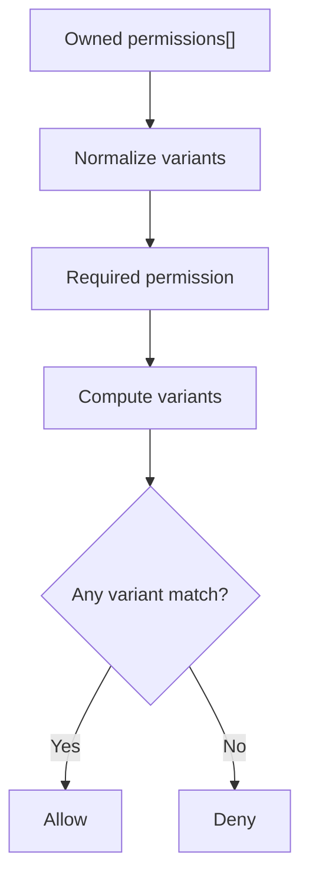
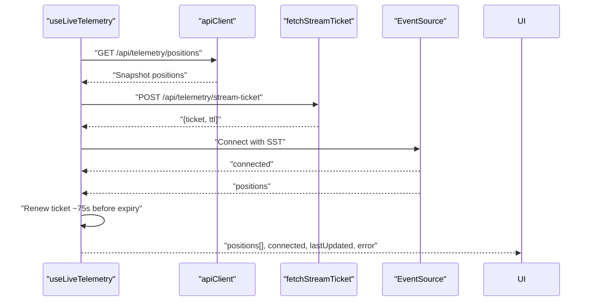
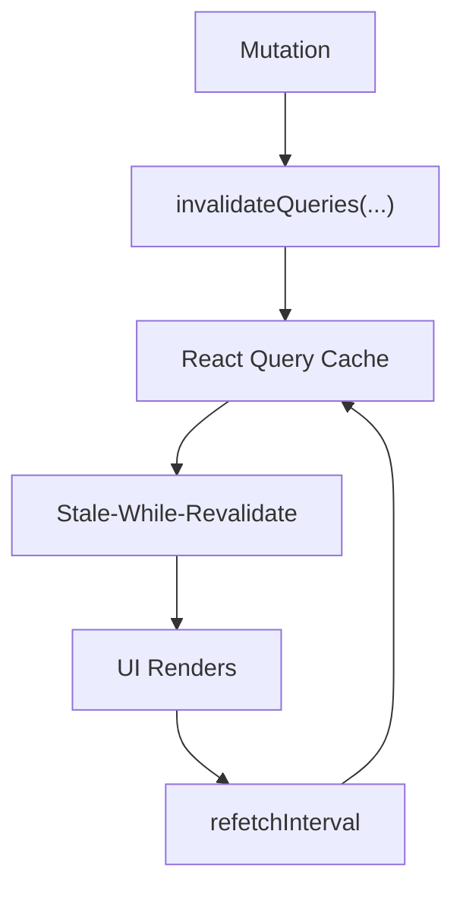
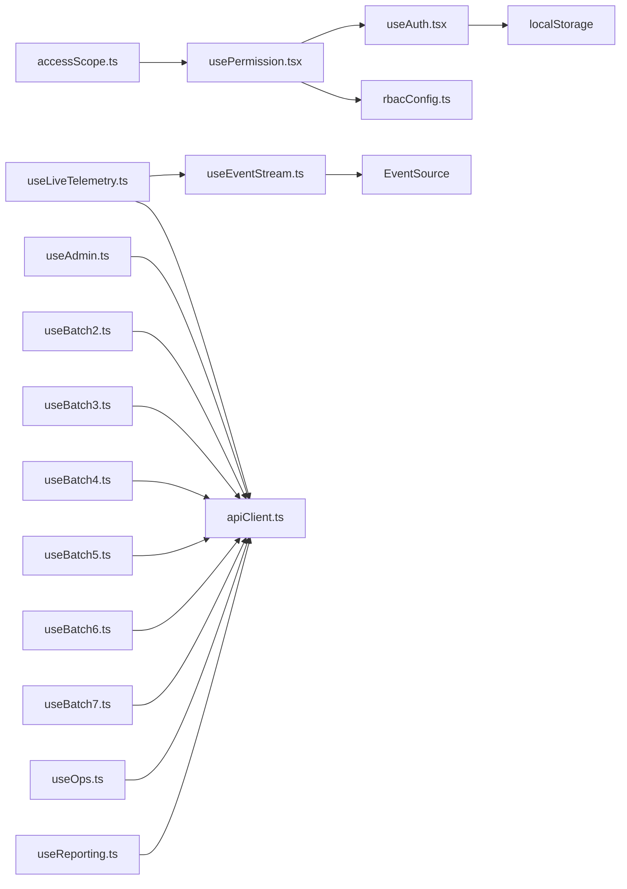

# State Management

<cite>
**Referenced Files in This Document**
- [useAuth.tsx](file://frontend/src/hooks/useAuth.tsx)
- [usePermission.tsx](file://frontend/src/hooks/usePermission.tsx)
- [rbacConfig.ts](file://frontend/src/auth/rbacConfig.ts)
- [accessScope.ts](file://frontend/src/auth/accessScope.ts)
- [useEventStream.ts](file://frontend/src/hooks/useEventStream.ts)
- [useLiveTelemetry.ts](file://frontend/src/hooks/useLiveTelemetry.ts)
- [useAdmin.ts](file://frontend/src/hooks/useAdmin.ts)
- [useBatch2.ts](file://frontend/src/hooks/useBatch2.ts)
- [useBatch3.ts](file://frontend/src/hooks/useBatch3.ts)
- [useBatch4.ts](file://frontend/src/hooks/useBatch4.ts)
- [useBatch5.ts](file://frontend/src/hooks/useBatch5.ts)
- [useBatch6.ts](file://frontend/src/hooks/useBatch6.ts)
- [useBatch7.ts](file://frontend/src/hooks/useBatch7.ts)
- [useOps.ts](file://frontend/src/hooks/useOps.ts)
- [useReporting.ts](file://frontend/src/hooks/useReporting.ts)
</cite>

## Table of Contents
1. [Introduction](#introduction)
2. [Project Structure](#project-structure)
3. [Core Components](#core-components)
4. [Architecture Overview](#architecture-overview)
5. [Detailed Component Analysis](#detailed-component-analysis)
6. [Dependency Analysis](#dependency-analysis)
7. [Performance Considerations](#performance-considerations)
8. [Troubleshooting Guide](#troubleshooting-guide)
9. [Conclusion](#conclusion)
10. [Appendices](#appendices)

## Introduction
This document explains the state management architecture of the OpsTrax React application. It focuses on the custom hook ecosystem, authentication state lifecycle, permission-based access control, and real-time data synchronization via event streams and live telemetry. It also covers state persistence strategies, caching and invalidation patterns, synchronization guarantees, error handling, performance considerations for large-scale updates, and practical debugging techniques.

## Project Structure
The state management spans several layers:
- Authentication and session state: centralized provider and hook with local storage persistence
- Authorization and permissions: RBAC constants, variants normalization, and gating utilities
- Real-time updates: EventSource-based event stream and live telemetry with short-lived tickets
- Data fetching and caching: React Query-based hooks grouped by functional domains
- Scope-based filtering: row-level scoping for driver/customer portals

**Diagram sources**
- [useAuth.tsx:1-60](file://frontend/src/hooks/useAuth.tsx#L1-L60)
- [usePermission.tsx:1-106](file://frontend/src/hooks/usePermission.tsx#L1-L106)
- [rbacConfig.ts:1-404](file://frontend/src/auth/rbacConfig.ts#L1-L404)
- [accessScope.ts:1-75](file://frontend/src/auth/accessScope.ts#L1-L75)
- [useEventStream.ts:1-23](file://frontend/src/hooks/useEventStream.ts#L1-L23)
- [useLiveTelemetry.ts:1-169](file://frontend/src/hooks/useLiveTelemetry.ts#L1-L169)
- [useAdmin.ts:1-76](file://frontend/src/hooks/useAdmin.ts#L1-L76)
- [useBatch2.ts:1-21](file://frontend/src/hooks/useBatch2.ts#L1-L21)
- [useBatch3.ts:1-22](file://frontend/src/hooks/useBatch3.ts#L1-L22)
- [useBatch4.ts:1-24](file://frontend/src/hooks/useBatch4.ts#L1-L24)
- [useBatch5.ts:1-150](file://frontend/src/hooks/useBatch5.ts#L1-L150)
- [useBatch6.ts:1-149](file://frontend/src/hooks/useBatch6.ts#L1-L149)
- [useBatch7.ts:1-175](file://frontend/src/hooks/useBatch7.ts#L1-L175)
- [useOps.ts:1-86](file://frontend/src/hooks/useOps.ts#L1-L86)
- [useReporting.ts:1-157](file://frontend/src/hooks/useReporting.ts#L1-L157)

**Section sources**
- [useAuth.tsx:1-60](file://frontend/src/hooks/useAuth.tsx#L1-L60)
- [usePermission.tsx:1-106](file://frontend/src/hooks/usePermission.tsx#L1-L106)
- [rbacConfig.ts:1-404](file://frontend/src/auth/rbacConfig.ts#L1-L404)
- [accessScope.ts:1-75](file://frontend/src/auth/accessScope.ts#L1-L75)
- [useEventStream.ts:1-23](file://frontend/src/hooks/useEventStream.ts#L1-L23)
- [useLiveTelemetry.ts:1-169](file://frontend/src/hooks/useLiveTelemetry.ts#L1-L169)
- [useAdmin.ts:1-76](file://frontend/src/hooks/useAdmin.ts#L1-L76)
- [useBatch2.ts:1-21](file://frontend/src/hooks/useBatch2.ts#L1-L21)
- [useBatch3.ts:1-22](file://frontend/src/hooks/useBatch3.ts#L1-L22)
- [useBatch4.ts:1-24](file://frontend/src/hooks/useBatch4.ts#L1-L24)
- [useBatch5.ts:1-150](file://frontend/src/hooks/useBatch5.ts#L1-L150)
- [useBatch6.ts:1-149](file://frontend/src/hooks/useBatch6.ts#L1-L149)
- [useBatch7.ts:1-175](file://frontend/src/hooks/useBatch7.ts#L1-L175)
- [useOps.ts:1-86](file://frontend/src/hooks/useOps.ts#L1-L86)
- [useReporting.ts:1-157](file://frontend/src/hooks/useReporting.ts#L1-L157)

## Core Components
- Authentication state provider and hook:
  - Centralized session state with local storage persistence and TTL
  - Provider exposes setSession and logout functions
- Permission utilities:
  - Extract current permissions from session
  - Compute permission membership with flexible variant normalization
  - Gate routes and components based on permissions
- Real-time subsystems:
  - Generic event stream consumer for server-sent events
  - Live telemetry with snapshot + SSE, short-lived tickets, and auto-renewal
- Domain-specific data hooks:
  - React Query-based hooks for admin, dispatch, safety, finance, compliance, reporting, and operational metrics
  - Stale-while-revalidate and refetch-interval patterns for responsive UX

**Section sources**
- [useAuth.tsx:1-60](file://frontend/src/hooks/useAuth.tsx#L1-L60)
- [usePermission.tsx:1-106](file://frontend/src/hooks/usePermission.tsx#L1-L106)
- [rbacConfig.ts:1-404](file://frontend/src/auth/rbacConfig.ts#L1-L404)
- [useEventStream.ts:1-23](file://frontend/src/hooks/useEventStream.ts#L1-L23)
- [useLiveTelemetry.ts:1-169](file://frontend/src/hooks/useLiveTelemetry.ts#L1-L169)
- [useAdmin.ts:1-76](file://frontend/src/hooks/useAdmin.ts#L1-L76)
- [useBatch2.ts:1-21](file://frontend/src/hooks/useBatch2.ts#L1-L21)
- [useBatch3.ts:1-22](file://frontend/src/hooks/useBatch3.ts#L1-L22)
- [useBatch4.ts:1-24](file://frontend/src/hooks/useBatch4.ts#L1-L24)
- [useBatch5.ts:1-150](file://frontend/src/hooks/useBatch5.ts#L1-L150)
- [useBatch6.ts:1-149](file://frontend/src/hooks/useBatch6.ts#L1-L149)
- [useBatch7.ts:1-175](file://frontend/src/hooks/useBatch7.ts#L1-L175)
- [useOps.ts:1-86](file://frontend/src/hooks/useOps.ts#L1-L86)
- [useReporting.ts:1-157](file://frontend/src/hooks/useReporting.ts#L1-L157)

## Architecture Overview
The state management architecture combines:
- Centralized auth state with local persistence
- Permission evaluation and UI gating
- Real-time ingestion via EventSource with snapshot fallback
- Domain data caching and invalidation via React Query
- Row-level scoping for portal roles

**Diagram sources**
- [useAuth.tsx:1-60](file://frontend/src/hooks/useAuth.tsx#L1-L60)
- [usePermission.tsx:1-106](file://frontend/src/hooks/usePermission.tsx#L1-L106)
- [rbacConfig.ts:1-404](file://frontend/src/auth/rbacConfig.ts#L1-L404)
- [accessScope.ts:1-75](file://frontend/src/auth/accessScope.ts#L1-L75)
- [useLiveTelemetry.ts:1-169](file://frontend/src/hooks/useLiveTelemetry.ts#L1-L169)
- [useEventStream.ts:1-23](file://frontend/src/hooks/useEventStream.ts#L1-L23)

## Detailed Component Analysis

### Authentication State Management (useAuth)
- Persistence: Session stored in local storage with TTL; on load, expiration is checked and cleared if expired
- Provider value memoization: Stable identity prevents unnecessary re-renders
- Public API: setSession persists and updates state; logout clears session and storage

**Diagram sources**
- [useAuth.tsx:9-23](file://frontend/src/hooks/useAuth.tsx#L9-L23)

**Section sources**
- [useAuth.tsx:1-60](file://frontend/src/hooks/useAuth.tsx#L1-L60)

### Permission-Based State Management (usePermission + rbacConfig + accessScope)
- Permission extraction: Hook reads current session permissions
- Permission checking: Flexible normalization supports dot/colon/underscore differences and case-insensitive matching
- Role-to-permissions mapping: Comprehensive role-to-permission sets enable coarse-grained access control
- UI gating: ProtectedRoute, RequirePermission, PermissionGate enforce runtime checks
- Row-level scoping: Portal roles filter datasets by driver/customer identity fields

**Diagram sources**
- [rbacConfig.ts:372-387](file://frontend/src/auth/rbacConfig.ts#L372-L387)

**Section sources**
- [usePermission.tsx:1-106](file://frontend/src/hooks/usePermission.tsx#L1-L106)
- [rbacConfig.ts:1-404](file://frontend/src/auth/rbacConfig.ts#L1-L404)
- [accessScope.ts:1-75](file://frontend/src/auth/accessScope.ts#L1-L75)

### Real-Time Data Synchronization (useEventStream + useLiveTelemetry)
- Generic event stream:
  - Subscribes to server-sent events and maintains a bounded recent history
  - Ignores malformed frames to maintain resilience
- Live telemetry:
  - Snapshot fetch on mount for immediate data
  - EventSource connection with custom event types ("positions", "connected")
  - Short-lived tickets (SST) fetched via API and passed as query param to avoid exposing long-lived tokens
  - Auto-renewal 15s before ticket expiry to prevent disconnections
  - Error handling toggles connected flag and surfaces transient errors

**Diagram sources**
- [useLiveTelemetry.ts:71-169](file://frontend/src/hooks/useLiveTelemetry.ts#L71-L169)

**Section sources**
- [useEventStream.ts:1-23](file://frontend/src/hooks/useEventStream.ts#L1-L23)
- [useLiveTelemetry.ts:1-169](file://frontend/src/hooks/useLiveTelemetry.ts#L1-L169)

### State Persistence Strategies and Caching Mechanisms
- Authentication:
  - Local storage with TTL ensures session continuity across reloads while bounding lifetime
- Domain data:
  - React Query provides caching, stale-while-revalidate, and refetch-intervals
  - Mutations invalidate targeted queries to keep views consistent
- Real-time:
  - Snapshot + SSE hybrid minimizes latency and handles network interruptions gracefully

**Diagram sources**
- [useAdmin.ts:1-76](file://frontend/src/hooks/useAdmin.ts#L1-L76)
- [useBatch2.ts:1-21](file://frontend/src/hooks/useBatch2.ts#L1-L21)
- [useBatch3.ts:1-22](file://frontend/src/hooks/useBatch3.ts#L1-L22)
- [useBatch4.ts:1-24](file://frontend/src/hooks/useBatch4.ts#L1-L24)
- [useBatch5.ts:1-150](file://frontend/src/hooks/useBatch5.ts#L1-L150)
- [useBatch6.ts:1-149](file://frontend/src/hooks/useBatch6.ts#L1-L149)
- [useBatch7.ts:1-175](file://frontend/src/hooks/useBatch7.ts#L1-L175)
- [useOps.ts:1-86](file://frontend/src/hooks/useOps.ts#L1-L86)
- [useReporting.ts:1-157](file://frontend/src/hooks/useReporting.ts#L1-L157)

**Section sources**
- [useAuth.tsx:1-60](file://frontend/src/hooks/useAuth.tsx#L1-L60)
- [useAdmin.ts:1-76](file://frontend/src/hooks/useAdmin.ts#L1-L76)
- [useBatch2.ts:1-21](file://frontend/src/hooks/useBatch2.ts#L1-L21)
- [useBatch3.ts:1-22](file://frontend/src/hooks/useBatch3.ts#L1-L22)
- [useBatch4.ts:1-24](file://frontend/src/hooks/useBatch4.ts#L1-L24)
- [useBatch5.ts:1-150](file://frontend/src/hooks/useBatch5.ts#L1-L150)
- [useBatch6.ts:1-149](file://frontend/src/hooks/useBatch6.ts#L1-L149)
- [useBatch7.ts:1-175](file://frontend/src/hooks/useBatch7.ts#L1-L175)
- [useOps.ts:1-86](file://frontend/src/hooks/useOps.ts#L1-L86)
- [useReporting.ts:1-157](file://frontend/src/hooks/useReporting.ts#L1-L157)

### State Synchronization Patterns and Error Handling
- Snapshot-first real-time:
  - Immediate UI feedback via snapshot
  - SSE updates keep data fresh; malformed frames are ignored
- Connection lifecycle:
  - Connected flag toggled on "connected" and "error" events
  - Auto-renewal avoids mid-stream expiry
- React Query invalidation:
  - Mutations trigger cache invalidation to synchronize downstream queries
- Permission-driven rendering:
  - Gating components and routes prevent unauthorized state mutations

**Section sources**
- [useLiveTelemetry.ts:71-169](file://frontend/src/hooks/useLiveTelemetry.ts#L71-L169)
- [useAdmin.ts:1-76](file://frontend/src/hooks/useAdmin.ts#L1-L76)
- [useBatch2.ts:1-21](file://frontend/src/hooks/useBatch2.ts#L1-L21)
- [useBatch3.ts:1-22](file://frontend/src/hooks/useBatch3.ts#L1-L22)
- [useBatch4.ts:1-24](file://frontend/src/hooks/useBatch4.ts#L1-L24)
- [useBatch5.ts:1-150](file://frontend/src/hooks/useBatch5.ts#L1-L150)
- [useBatch6.ts:1-149](file://frontend/src/hooks/useBatch6.ts#L1-L149)
- [useBatch7.ts:1-175](file://frontend/src/hooks/useBatch7.ts#L1-L175)
- [useOps.ts:1-86](file://frontend/src/hooks/useOps.ts#L1-L86)
- [useReporting.ts:1-157](file://frontend/src/hooks/useReporting.ts#L1-L157)

## Dependency Analysis
- useAuth depends on:
  - Local storage for persistence
  - Context for provider-consumer relationship
- usePermission depends on:
  - useAuth for session
  - rbacConfig for permission computation
  - accessScope for row-level scoping
- Real-time hooks depend on:
  - EventSource for streaming
  - apiClient for snapshot and ticket acquisition
- Domain hooks depend on:
  - Service APIs for data
  - React Query for caching and invalidation

**Diagram sources**
- [useAuth.tsx:1-60](file://frontend/src/hooks/useAuth.tsx#L1-L60)
- [usePermission.tsx:1-106](file://frontend/src/hooks/usePermission.tsx#L1-L106)
- [rbacConfig.ts:1-404](file://frontend/src/auth/rbacConfig.ts#L1-L404)
- [accessScope.ts:1-75](file://frontend/src/auth/accessScope.ts#L1-L75)
- [useEventStream.ts:1-23](file://frontend/src/hooks/useEventStream.ts#L1-L23)
- [useLiveTelemetry.ts:1-169](file://frontend/src/hooks/useLiveTelemetry.ts#L1-L169)
- [useAdmin.ts:1-76](file://frontend/src/hooks/useAdmin.ts#L1-L76)
- [useBatch2.ts:1-21](file://frontend/src/hooks/useBatch2.ts#L1-L21)
- [useBatch3.ts:1-22](file://frontend/src/hooks/useBatch3.ts#L1-L22)
- [useBatch4.ts:1-24](file://frontend/src/hooks/useBatch4.ts#L1-L24)
- [useBatch5.ts:1-150](file://frontend/src/hooks/useBatch5.ts#L1-L150)
- [useBatch6.ts:1-149](file://frontend/src/hooks/useBatch6.ts#L1-L149)
- [useBatch7.ts:1-175](file://frontend/src/hooks/useBatch7.ts#L1-L175)
- [useOps.ts:1-86](file://frontend/src/hooks/useOps.ts#L1-L86)
- [useReporting.ts:1-157](file://frontend/src/hooks/useReporting.ts#L1-L157)

**Section sources**
- [useAuth.tsx:1-60](file://frontend/src/hooks/useAuth.tsx#L1-L60)
- [usePermission.tsx:1-106](file://frontend/src/hooks/usePermission.tsx#L1-L106)
- [rbacConfig.ts:1-404](file://frontend/src/auth/rbacConfig.ts#L1-L404)
- [accessScope.ts:1-75](file://frontend/src/auth/accessScope.ts#L1-L75)
- [useEventStream.ts:1-23](file://frontend/src/hooks/useEventStream.ts#L1-L23)
- [useLiveTelemetry.ts:1-169](file://frontend/src/hooks/useLiveTelemetry.ts#L1-L169)
- [useAdmin.ts:1-76](file://frontend/src/hooks/useAdmin.ts#L1-L76)
- [useBatch2.ts:1-21](file://frontend/src/hooks/useBatch2.ts#L1-L21)
- [useBatch3.ts:1-22](file://frontend/src/hooks/useBatch3.ts#L1-L22)
- [useBatch4.ts:1-24](file://frontend/src/hooks/useBatch4.ts#L1-L24)
- [useBatch5.ts:1-150](file://frontend/src/hooks/useBatch5.ts#L1-L150)
- [useBatch6.ts:1-149](file://frontend/src/hooks/useBatch6.ts#L1-L149)
- [useBatch7.ts:1-175](file://frontend/src/hooks/useBatch7.ts#L1-L175)
- [useOps.ts:1-86](file://frontend/src/hooks/useOps.ts#L1-L86)
- [useReporting.ts:1-157](file://frontend/src/hooks/useReporting.ts#L1-L157)

## Performance Considerations
- Real-time updates:
  - Use snapshot + SSE to minimize latency and handle network interruptions
  - Auto-renewal reduces downtime near ticket expiry
- Caching:
  - Configure staleTime/refetchInterval per domain to balance freshness and bandwidth
  - Use targeted invalidation to avoid full-cache flushes
- Rendering:
  - Memoize derived values (e.g., provider value) to reduce re-renders
  - Prefer fine-grained hooks to limit component subscriptions
- Large-scale updates:
  - Limit event buffer sizes and throttle updates where appropriate
  - Defer heavy computations to background threads or virtualization

[No sources needed since this section provides general guidance]

## Troubleshooting Guide
- Authentication
  - If session disappears after reload, confirm TTL and localStorage availability
  - On expiration, session is cleared automatically; re-authenticate
- Permissions
  - Verify normalized variants; mismatches often stem from punctuation differences
  - Confirm role-to-permissions mapping aligns with backend expectations
- Real-time telemetry
  - Check "connected" flag and error message for transient failures
  - Ensure SST retrieval succeeds; missing tickets cause connection failures
  - Validate EventSource URL construction and query parameters
- React Query
  - Inspect query keys and invalidation triggers
  - Adjust staleTime/refetchInterval for responsiveness vs. performance
- Row-level scoping
  - Confirm driver/customer identity resolution and field mappings
  - Validate that scoped fields exist in dataset records

**Section sources**
- [useAuth.tsx:1-60](file://frontend/src/hooks/useAuth.tsx#L1-L60)
- [rbacConfig.ts:1-404](file://frontend/src/auth/rbacConfig.ts#L1-L404)
- [accessScope.ts:1-75](file://frontend/src/auth/accessScope.ts#L1-L75)
- [useLiveTelemetry.ts:71-169](file://frontend/src/hooks/useLiveTelemetry.ts#L71-L169)
- [useAdmin.ts:1-76](file://frontend/src/hooks/useAdmin.ts#L1-L76)

## Conclusion
OpsTrax employs a layered state management approach combining a simple, resilient authentication provider, robust RBAC utilities, and a real-time subsystem built on snapshots and EventSource. Domain data is managed via React Query with thoughtful caching and invalidation strategies. Together, these patterns deliver responsive, secure, and scalable state handling suitable for enterprise-grade fleets and operations.

[No sources needed since this section summarizes without analyzing specific files]

## Appendices
- Best practices
  - Keep session state minimal and immutable
  - Normalize permissions and cache computed variants
  - Use snapshot + SSE for live dashboards
  - Invalidate precisely to reduce unnecessary refetches
  - Add defensive parsing and error boundaries around real-time frames
  - Test scoping logic with representative datasets

[No sources needed since this section provides general guidance]