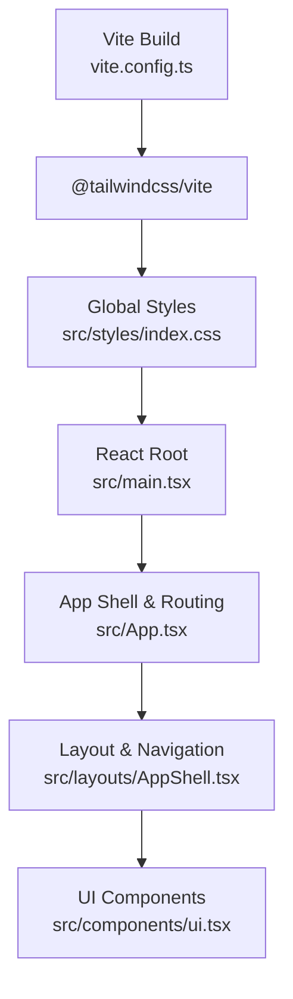
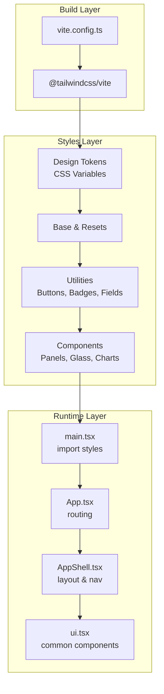
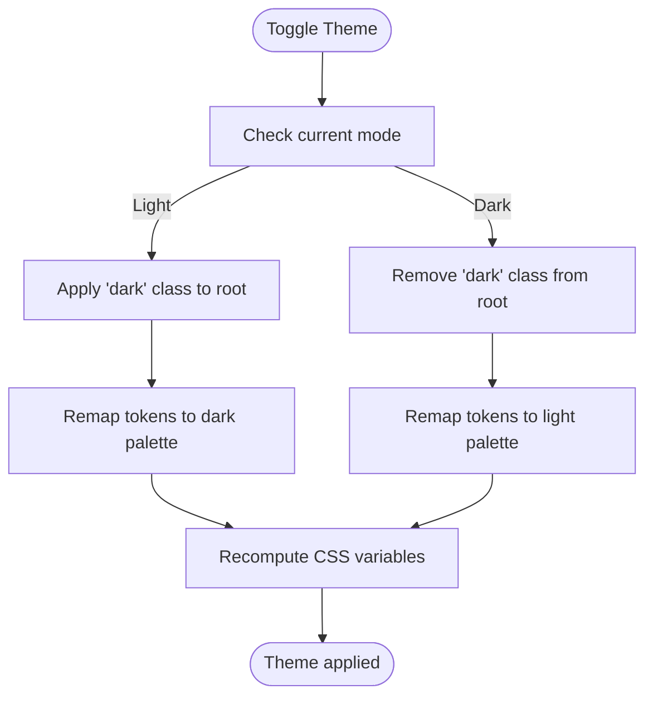
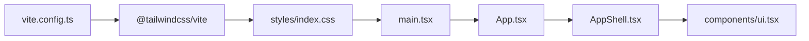

# Styling & Theming

<cite>
**Referenced Files in This Document**
- [index.css](file://frontend/src/styles/index.css)
- [vite.config.ts](file://frontend/vite.config.ts)
- [main.tsx](file://frontend/src/main.tsx)
- [App.tsx](file://frontend/src/App.tsx)
- [AppShell.tsx](file://frontend/src/layouts/AppShell.tsx)
- [ui.tsx](file://frontend/src/components/ui.tsx)
- [moduleConfig.ts](file://frontend/src/modules/moduleConfig.ts)
- [types.ts](file://frontend/src/types/index.ts)
</cite>

## Table of Contents
1. [Introduction](#introduction)
2. [Project Structure](#project-structure)
3. [Core Components](#core-components)
4. [Architecture Overview](#architecture-overview)
5. [Detailed Component Analysis](#detailed-component-analysis)
6. [Dependency Analysis](#dependency-analysis)
7. [Performance Considerations](#performance-considerations)
8. [Troubleshooting Guide](#troubleshooting-guide)
9. [Conclusion](#conclusion)

## Introduction
This document explains the styling and theming system of the OpsTrax React application. It covers the TailwindCSS integration, the custom CSS architecture, theme tokens and utilities, component styling patterns, responsive design, and the current state of dark mode support. It also outlines best practices for maintainability and performance in a large-scale application.

## Project Structure
The frontend uses Vite with TailwindCSS v4 and a custom CSS foundation. Styles are centralized in a single stylesheet that defines design tokens, base styles, reusable utilities, and component-specific classes. The application boots by importing the global stylesheet early in the React tree.

**Diagram sources**
- [vite.config.ts:1-13](file://frontend/vite.config.ts#L1-L13)
- [index.css:1-10](file://frontend/src/styles/index.css#L1-L10)
- [main.tsx:1-10](file://frontend/src/main.tsx#L1-L10)
- [App.tsx:1-322](file://frontend/src/App.tsx#L1-L322)
- [AppShell.tsx:1-394](file://frontend/src/layouts/AppShell.tsx#L1-L394)
- [ui.tsx:1-575](file://frontend/src/components/ui.tsx#L1-L575)

**Section sources**
- [vite.config.ts:1-13](file://frontend/vite.config.ts#L1-L13)
- [index.css:1-10](file://frontend/src/styles/index.css#L1-L10)
- [main.tsx:1-10](file://frontend/src/main.tsx#L1-L10)

## Core Components
- Design tokens and base styles: Centralized in the global stylesheet, including CSS variables for colors, radii, shadows, and typography defaults.
- Utility classes: Reusable helpers for buttons, badges, fields, animations, gradients, and layout scaffolding.
- Component classes: Panel, glass, map surface/pins, KPI cards, tables, progress bars, and specialized UI patterns.
- Responsive utilities: Media queries and grid configurations tailored to control tower and dashboard contexts.

Key implementation references:
- Tokens and base: [index.css:8-72](file://frontend/src/styles/index.css#L8-L72)
- Utilities and components: [index.css:82-904](file://frontend/src/styles/index.css#L82-L904)
- Global imports and plugin: [index.css:1](file://frontend/src/styles/index.css#L1), [vite.config.ts:2](file://frontend/vite.config.ts#L2)
- Early stylesheet import: [main.tsx:9](file://frontend/src/main.tsx#L9)

**Section sources**
- [index.css:8-72](file://frontend/src/styles/index.css#L8-L72)
- [index.css:82-904](file://frontend/src/styles/index.css#L82-L904)
- [vite.config.ts:1-13](file://frontend/vite.config.ts#L1-L13)
- [main.tsx:1-10](file://frontend/src/main.tsx#L1-L10)

## Architecture Overview
The styling architecture blends Tailwind’s utility-first approach with a custom CSS foundation:

- TailwindCSS v4 is integrated via the official Vite plugin.
- The global stylesheet defines a cohesive design system using CSS custom properties (variables) and composes Tailwind utilities with custom classes.
- Component libraries and third-party charts receive targeted overrides to align with the design system.

**Diagram sources**
- [vite.config.ts:1-13](file://frontend/vite.config.ts#L1-L13)
- [index.css:1-10](file://frontend/src/styles/index.css#L1-L10)
- [index.css:8-72](file://frontend/src/styles/index.css#L8-L72)
- [index.css:82-904](file://frontend/src/styles/index.css#L82-L904)
- [main.tsx:1-10](file://frontend/src/main.tsx#L1-L10)
- [App.tsx:1-322](file://frontend/src/App.tsx#L1-L322)
- [AppShell.tsx:1-394](file://frontend/src/layouts/AppShell.tsx#L1-L394)
- [ui.tsx:1-575](file://frontend/src/components/ui.tsx#L1-L575)

## Detailed Component Analysis

### TailwindCSS Integration and Plugin Setup
- The Vite configuration enables TailwindCSS via the dedicated plugin, ensuring JIT processing and proper class extraction during builds.
- The global stylesheet begins with an explicit import directive for Tailwind, followed by the custom design system.

Implementation references:
- Plugin registration: [vite.config.ts:2](file://frontend/vite.config.ts#L2)
- Tailwind import: [index.css:1](file://frontend/src/styles/index.css#L1)

**Section sources**
- [vite.config.ts:1-13](file://frontend/vite.config.ts#L1-L13)
- [index.css:1](file://frontend/src/styles/index.css#L1)

### Design Tokens and Theme Foundation
- CSS variables define the entire palette: backgrounds, surfaces, borders, brand accents, text, radii, and shadows.
- The base resets and body establish minimum viewport sizing, background, and text color using tokens.
- Selection and scrollbar styles are customized for brand consistency.

Implementation references:
- Tokens and base: [index.css:8-72](file://frontend/src/styles/index.css#L8-L72)

**Section sources**
- [index.css:8-72](file://frontend/src/styles/index.css#L8-L72)

### Utility Classes and Component Classes
- Utilities: Buttons (primary, ghost, icon), badges, fields, section titles, card hover effects, KPI accent borders, nav active indicator, gradient text, animation helpers, table sorting, staggered children, chart overrides, and login-specific animations.
- Component classes: Panels, glass overlays, map surfaces and pins, skeletons, live dots, progress bars, score rings, notification badges, status/risk badges, control tower variants, and responsive grids.

Implementation references:
- Utilities and components: [index.css:82-904](file://frontend/src/styles/index.css#L82-L904)

**Section sources**
- [index.css:82-904](file://frontend/src/styles/index.css#L82-L904)

### Responsive Design Patterns
- Media queries tailor control tower layouts and status grids for larger screens.
- Layouts leverage Tailwind utilities alongside custom grid classes to adapt to breakpoints.

Implementation references:
- Control tower responsive: [index.css:896-904](file://frontend/src/styles/index.css#L896-L904)
- Layout usage in shell: [AppShell.tsx:264-390](file://frontend/src/layouts/AppShell.tsx#L264-L390)

**Section sources**
- [index.css:896-904](file://frontend/src/styles/index.css#L896-L904)
- [AppShell.tsx:264-390](file://frontend/src/layouts/AppShell.tsx#L264-L390)

### Component Styling Approaches
- AppShell: Uses Tailwind utilities for layout and spacing, applies custom classes for branding and interactions (e.g., nav active bar, field, panel).
- UI components: Compose panel, button, badge, and field classes to create consistent patterns for KPI cards, data tables, filters, drawers, loading states, and insights.

Implementation references:
- AppShell composition: [AppShell.tsx:127-232](file://frontend/src/layouts/AppShell.tsx#L127-L232)
- UI components: [ui.tsx:37-575](file://frontend/src/components/ui.tsx#L37-L575)

**Section sources**
- [AppShell.tsx:127-232](file://frontend/src/layouts/AppShell.tsx#L127-L232)
- [ui.tsx:37-575](file://frontend/src/components/ui.tsx#L37-L575)

### Dark Mode Implementation and Theme Switching
- Current state: The stylesheet sets a light color scheme and defines tokens for a light enterprise aesthetic. There is no explicit dark mode class toggling or automatic inversion in the provided files.
- Recommended approach: Introduce a root-level dark mode class and invert or remap tokens accordingly, while preserving component overrides for readability and contrast.

Note: The current code does not include dark mode logic. The following diagram illustrates a conceptual approach.

[No sources needed since this diagram shows conceptual workflow, not actual code structure]

### Color System, Typography Hierarchy, and Spacing Conventions
- Color system: Brand teal/blue/violet, surface palettes (background, raised, sunken), borders (standard, strong, accent), and text tokens (primary, secondary, muted).
- Typography: Inter is the primary font stack; headings and body sizes are established via semantic usage and utility classes.
- Spacing: Consistent use of padding/margin utilities and custom tokens for radii and shadows.

Implementation references:
- Tokens: [index.css:8-52](file://frontend/src/styles/index.css#L8-L52)
- Body and selection: [index.css:64-74](file://frontend/src/styles/index.css#L64-L74)
- Typography defaults: [index.css:10](file://frontend/src/styles/index.css#L10)

**Section sources**
- [index.css:8-52](file://frontend/src/styles/index.css#L8-L52)
- [index.css:64-74](file://frontend/src/styles/index.css#L64-L74)
- [index.css:10](file://frontend/src/styles/index.css#L10)

### Chart and Third-Party Overrides
- Recharts tooltips and grid lines are overridden to match the design system’s surfaces and typography.
- These overrides ensure consistent appearance across dashboards and control towers.

Implementation references:
- Recharts overrides: [index.css:395-408](file://frontend/src/styles/index.css#L395-L408)

**Section sources**
- [index.css:395-408](file://frontend/src/styles/index.css#L395-L408)

### Module-Based Styling and Navigation
- Modules define groups and icons used in the navigation shell, enabling consistent visual grouping and accent colors.
- The shell composes Tailwind utilities with custom classes to achieve active states, hover effects, and responsive behavior.

Implementation references:
- Module config: [moduleConfig.ts:52-134](file://frontend/src/modules/moduleConfig.ts#L52-L134)
- Navigation shell: [AppShell.tsx:14-65](file://frontend/src/layouts/AppShell.tsx#L14-L65)

**Section sources**
- [moduleConfig.ts:52-134](file://frontend/src/modules/moduleConfig.ts#L52-L134)
- [AppShell.tsx:14-65](file://frontend/src/layouts/AppShell.tsx#L14-L65)

## Dependency Analysis
The styling pipeline depends on TailwindCSS and the Vite plugin. The global stylesheet is imported at the application root and consumed by all components.

**Diagram sources**
- [vite.config.ts:1-13](file://frontend/vite.config.ts#L1-L13)
- [index.css:1](file://frontend/src/styles/index.css#L1)
- [main.tsx:1-10](file://frontend/src/main.tsx#L1-L10)
- [App.tsx:1-322](file://frontend/src/App.tsx#L1-L322)
- [AppShell.tsx:1-394](file://frontend/src/layouts/AppShell.tsx#L1-L394)
- [ui.tsx:1-575](file://frontend/src/components/ui.tsx#L1-L575)

**Section sources**
- [vite.config.ts:1-13](file://frontend/vite.config.ts#L1-L13)
- [index.css:1](file://frontend/src/styles/index.css#L1)
- [main.tsx:1-10](file://frontend/src/main.tsx#L1-L10)
- [App.tsx:1-322](file://frontend/src/App.tsx#L1-L322)
- [AppShell.tsx:1-394](file://frontend/src/layouts/AppShell.tsx#L1-L394)
- [ui.tsx:1-575](file://frontend/src/components/ui.tsx#L1-L575)

## Performance Considerations
- Prefer Tailwind utilities for common patterns to reduce custom CSS bloat.
- Consolidate frequently used combinations into shared component classes to minimize repetition.
- Keep the global stylesheet scoped; avoid overly broad selectors that increase cascade complexity.
- Use CSS variables for theme tokens to enable easy updates and reduce duplication.
- Leverage media queries sparingly and co-locate responsive concerns with components.

[No sources needed since this section provides general guidance]

## Troubleshooting Guide
- Tailwind classes not applying:
  - Verify the Tailwind plugin is registered in the Vite config and the stylesheet begins with the Tailwind import directive.
  - Ensure the global stylesheet is imported at the top of the React tree.
- Unexpected colors or contrast:
  - Confirm CSS variable values for backgrounds, surfaces, and text are correct.
  - Review component-specific overrides for panels and charts.
- Animation or layout glitches:
  - Check media query breakpoints and ensure custom grid classes are applied conditionally.
  - Validate that interactive states (hover, focus) are not overridden by later declarations.

**Section sources**
- [vite.config.ts:1-13](file://frontend/vite.config.ts#L1-L13)
- [index.css:1](file://frontend/src/styles/index.css#L1)
- [main.tsx:1-10](file://frontend/src/main.tsx#L1-L10)
- [index.css:82-904](file://frontend/src/styles/index.css#L82-L904)

## Conclusion
OpsTrax employs a hybrid styling architecture: TailwindCSS for utility-first primitives and a custom CSS foundation for cohesive design tokens, reusable utilities, and component classes. The system emphasizes consistency, scalability, and maintainability. While dark mode is not currently implemented, the token-driven approach makes adding a dark theme straightforward. Adopting the recommended practices will help sustain a robust, performant, and accessible design system across the application.