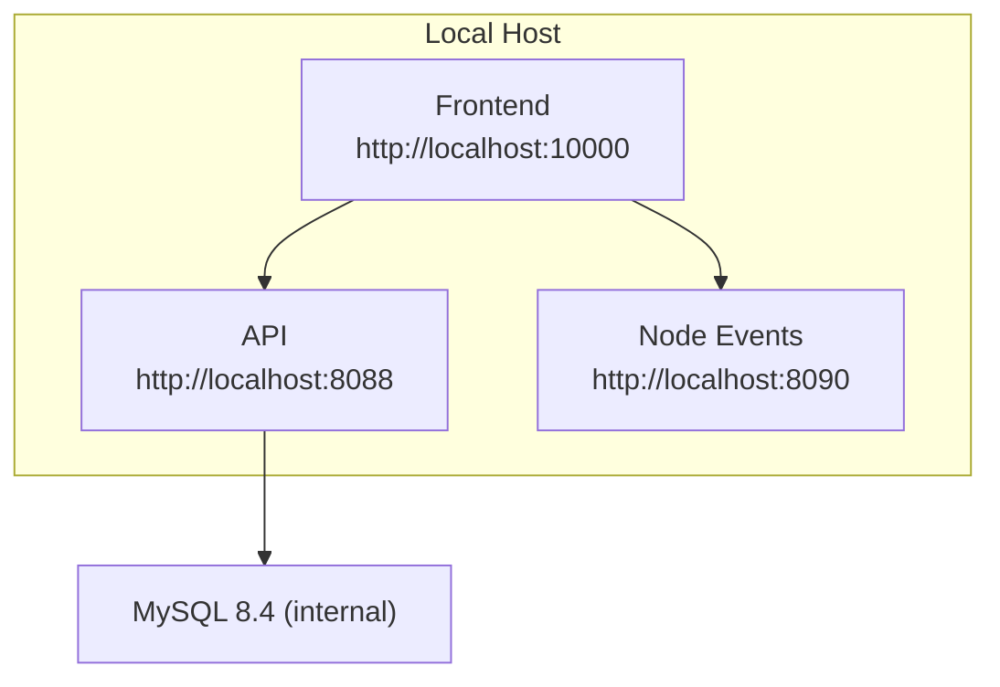

# Getting Started

<cite>
**Referenced Files in This Document**
- [README.md](file://README.md)
- [docker-compose.yml](file://docker-compose.yml)
- [package.json](file://package.json)
- [frontend/package.json](file://frontend/package.json)
- [backend/package.json](file://backend/package.json)
- [start-local.sh](file://start-local.sh)
- [stop-local.sh](file://stop-local.sh)
- [reset-local.sh](file://reset-local.sh)
- [frontend/src/pages/LoginPage.tsx](file://frontend/src/pages/LoginPage.tsx)
- [frontend/src/services/authApi.ts](file://frontend/src/services/authApi.ts)
- [frontend/src/auth/demoUsers.ts](file://frontend/src/auth/demoUsers.ts)
- [frontend/src/auth/rbacConfig.ts](file://frontend/src/auth/rbacConfig.ts)
- [backend-dotnet/Program.cs](file://backend-dotnet/Program.cs)
- [backend-dotnet/Controllers/EndpointMappings.cs](file://backend-dotnet/Controllers/EndpointMappings.cs)
</cite>

## Table of Contents
1. [Introduction](#introduction)
2. [Prerequisites](#prerequisites)
3. [System Requirements](#system-requirements)
4. [Environment Setup](#environment-setup)
5. [Local Development Workflow](#local-development-workflow)
6. [Demo Credentials and Initial Login](#demo-credentials-and-initial-login)
7. [First-Time User Walkthrough](#first-time-user-walkthrough)
8. [Accessing Services](#accessing-services)
9. [Development Workflow, Hot Reload, and Debugging](#development-workflow-hot-reload-and-debugging)
10. [Common Setup Issues and Troubleshooting](#common-setup-issues-and-troubleshooting)
11. [Architecture Overview](#architecture-overview)
12. [Conclusion](#conclusion)

## Introduction
This guide helps you quickly set up and run OpsTrax Enterprise Build locally using Docker Compose. It covers prerequisites, environment setup, local development workflow, service ports, demo credentials, initial login, and practical examples for accessing the frontend, API, and WebSocket services. It also includes troubleshooting tips and guidance for development iteration.

## Prerequisites
- Docker Desktop (with Docker Compose included)
- Node.js version aligned with project engines:
  - Root project engine requirement: Node >= 22
  - Frontend engine requirement: Node >= 22
- Git (optional, for cloning the repository)
- A modern web browser

**Section sources**
- [package.json:1-7](file://package.json#L1-L7)
- [frontend/package.json:6-8](file://frontend/package.json#L6-L8)

## System Requirements
- Minimum RAM: 8 GB recommended for smooth local development
- Disk space: At least 2 GB free for containers and databases
- CPU: Modern x64 processor
- OS: Windows, macOS, or Linux with Docker Desktop installed

## Environment Setup
1. Clone the repository (if not already present).
2. Ensure Docker Desktop is running.
3. Open a terminal in the repository root.

**Section sources**
- [README.md:67-81](file://README.md#L67-L81)

## Local Development Workflow
Start all services with Docker Compose:
- Use the provided convenience script to build and start services:
  - On Unix-like systems: run the start script
  - On Windows: open PowerShell and run the start script

```bash
./start-local.sh
```

Expected output after successful startup:
- Frontend available at http://localhost:10000
- API Swagger available at http://localhost:8088/swagger
- Node Events health endpoint at http://localhost:8090/health

You can also bring up services manually:
```bash
docker compose up --build
```

To stop services:
```bash
./stop-local.sh
```

To reset and rebuild volumes:
```bash
./reset-local.sh
```

Ports and services:
- Frontend: http://localhost:10000
- API: http://localhost:8088
- Node Events: http://localhost:8090

These ports are defined in the Docker Compose configuration and environment variables.

**Section sources**
- [docker-compose.yml:13-14](file://docker-compose.yml#L13-L14)
- [docker-compose.yml:29-30](file://docker-compose.yml#L29-L30)
- [docker-compose.yml:42-43](file://docker-compose.yml#L42-L43)
- [start-local.sh:11-14](file://start-local.sh#L11-L14)

## Demo Credentials and Initial Login
The platform ships with pre-seeded demo users. Use any of the following credentials to log in:
- Email: admin@opstrax.com
- Password: Admin@12345

Other demo roles include Dispatcher, Driver, Mechanic, and Customer. These accounts are ready to use immediately with realistic operational data.

Login flow:
- Navigate to the frontend login page at http://localhost:10000
- Enter the demo email and password
- Click Sign in

The frontend login page supports a “Try a demo account” dropdown for quick selection of available roles.

**Section sources**
- [README.md:53-63](file://README.md#L53-L63)
- [frontend/src/pages/LoginPage.tsx:284-467](file://frontend/src/pages/LoginPage.tsx#L284-L467)
- [frontend/src/services/authApi.ts:35-57](file://frontend/src/services/authApi.ts#L35-L57)

## First-Time User Walkthrough
After logging in:
- You land on the Command Center dashboard
- Explore modules such as Vehicles, Drivers, Dispatch, Safety, Maintenance, Compliance, and Reports
- Use the navigation menu to switch between modules
- Real-time updates are streamed via the Node Events WebSocket service

Note: The first-time walkthrough is guided by the application’s navigation and module pages. There is no separate onboarding wizard.

**Section sources**
- [frontend/src/pages/LoginPage.tsx:284-467](file://frontend/src/pages/LoginPage.tsx#L284-L467)

## Accessing Services
- Frontend: http://localhost:10000
- API Swagger: http://localhost:8088/swagger
- Node Events health: http://localhost:8090/health

Example endpoints (subject to change):
- API base URL configured in the frontend build arguments
- Node Events base URL configured in the Node Events service environment

**Section sources**
- [docker-compose.yml:9-10](file://docker-compose.yml#L9-L10)
- [docker-compose.yml:40-41](file://docker-compose.yml#L40-L41)
- [README.md:67-81](file://README.md#L67-L81)

## Development Workflow, Hot Reload, and Debugging
- Frontend development:
  - The frontend runs on port 10000 and is proxied by Nginx in production builds
  - For local development, the frontend package scripts expose a dev server on port 10000
  - Hot reload is supported during development

- Backend API (ASP.NET Core):
  - The API is exposed on port 8088
  - Use Swagger at /swagger to explore endpoints

- Node Events (WebSocket):
  - The WebSocket service runs on port 8090
  - Health endpoint: /health

- Authentication and permissions:
  - The frontend resolves demo users and sets a temporary CSRF token for demo mode
  - RBAC permissions are defined centrally and enforced by the API

- Debugging tips:
  - Verify service logs via Docker Compose
  - Confirm CORS and origin configurations match the frontend host
  - Ensure the database is reachable and migrations ran successfully

**Section sources**
- [frontend/package.json:9-13](file://frontend/package.json#L9-L13)
- [backend-dotnet/Program.cs:55-63](file://backend-dotnet/Program.cs#L55-L63)
- [frontend/src/services/authApi.ts:10-33](file://frontend/src/services/authApi.ts#L10-L33)
- [frontend/src/auth/rbacConfig.ts:326-364](file://frontend/src/auth/rbacConfig.ts#L326-L364)

## Common Setup Issues and Troubleshooting
- Port conflicts:
  - If ports 10000, 8088, or 8090 are in use, stop the conflicting applications or adjust the Docker Compose ports accordingly.

- Docker build errors:
  - Ensure Docker Desktop is running and has sufficient memory allocated
  - Re-run the reset script to remove orphaned containers and rebuild volumes

- CORS or origin mismatch:
  - The API allows origins from http://localhost:10000
  - Verify the frontend environment variable matches the host and port

- API not reachable:
  - Confirm the API container is healthy and the /ready and /health endpoints return success
  - Check that the database connection string is properly resolved

- Demo login fallback:
  - If the backend login fails, the frontend falls back to a demo session when the email exists in the demo user list and demo mode is enabled

- Node Events health:
  - Visit http://localhost:8090/health to confirm the WebSocket service is running

**Section sources**
- [docker-compose.yml:28-28](file://docker-compose.yml#L28-L28)
- [frontend/src/services/authApi.ts:46-56](file://frontend/src/services/authApi.ts#L46-L56)
- [backend-dotnet/Program.cs:257-294](file://backend-dotnet/Program.cs#L257-L294)

## Architecture Overview
The platform consists of:
- Frontend (React/Vite) served on port 10000
- API (ASP.NET Core) on port 8088 with Swagger
- Node Events (WebSocket) on port 8090
- Database (MySQL 8.4) managed internally



**Diagram sources**
- [README.md:17-19](file://README.md#L17-L19)
- [docker-compose.yml:3-44](file://docker-compose.yml#L3-L44)

## Conclusion
You are now ready to run OpsTrax Enterprise Build locally. Use the provided scripts to start, stop, and reset the environment. Log in with the demo credentials, explore the modules, and leverage the API Swagger and WebSocket health endpoints for verification. For persistent development, rely on the frontend dev server and the API’s Swagger documentation.