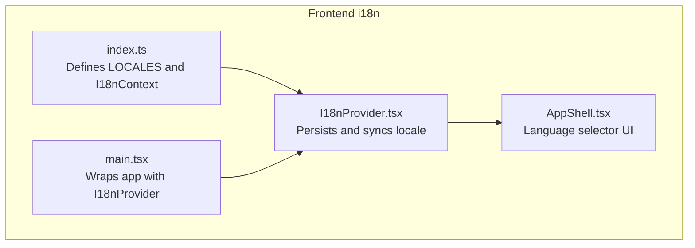
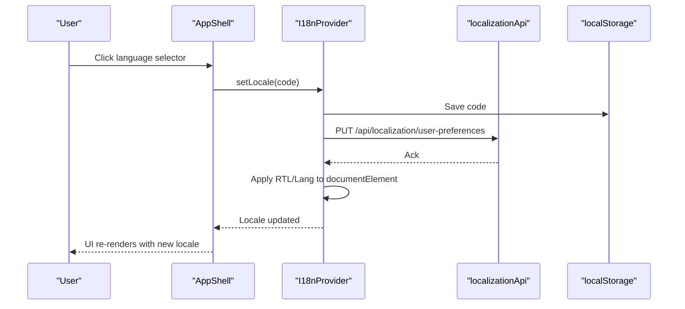
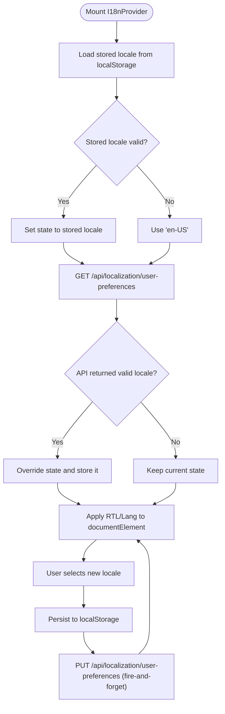
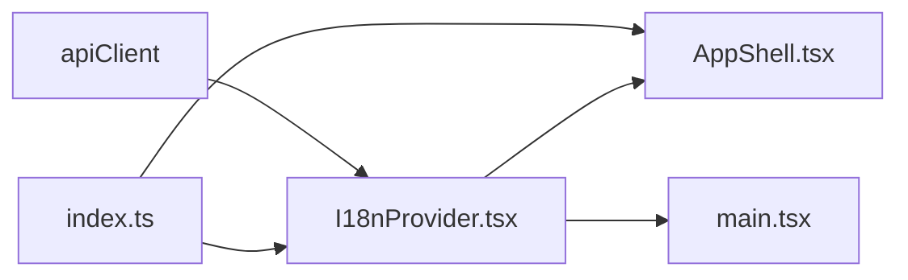

# Internationalization

<cite>
**Referenced Files in This Document**
- [index.ts](file://frontend/src/i18n/index.ts)
- [I18nProvider.tsx](file://frontend/src/i18n/I18nProvider.tsx)
- [AppShell.tsx](file://frontend/src/layouts/AppShell.tsx)
- [main.tsx](file://frontend/src/main.tsx)
- [formatters.ts](file://frontend/src/utils/formatters.ts)
- [MODULE_COVERAGE_MATRIX.md](file://docs/MODULE_COVERAGE_MATRIX.md)
- [README.md](file://README.md)
- [complianceApi.ts](file://frontend/src/services/complianceApi.ts)
</cite>

## Table of Contents
1. [Introduction](#introduction)
2. [Project Structure](#project-structure)
3. [Core Components](#core-components)
4. [Architecture Overview](#architecture-overview)
5. [Detailed Component Analysis](#detailed-component-analysis)
6. [Dependency Analysis](#dependency-analysis)
7. [Performance Considerations](#performance-considerations)
8. [Troubleshooting Guide](#troubleshooting-guide)
9. [Conclusion](#conclusion)
10. [Appendices](#appendices)

## Introduction
This document explains OpsTrax internationalization (i18n) implementation and how the platform supports multiple languages, right-to-left (RTL) layouts, and locale-specific formatting. It covers the React-based i18n provider, locale management, dynamic language switching, supported locales, RTL handling, and localization workflows. It also outlines the module coverage for localization, backend APIs involved, and compliance considerations.

## Project Structure
The i18n system is implemented in the frontend under the i18n directory and integrated into the application shell and routing. The provider sets the document direction and language attributes, persists user preferences, and exposes a translation function to components.

**Diagram sources**
- [index.ts:1-39](file://frontend/src/i18n/index.ts#L1-L39)
- [I18nProvider.tsx:1-66](file://frontend/src/i18n/I18nProvider.tsx#L1-L66)
- [AppShell.tsx:290-394](file://frontend/src/layouts/AppShell.tsx#L290-L394)
- [main.tsx:1-34](file://frontend/src/main.tsx#L1-L34)

**Section sources**
- [index.ts:1-39](file://frontend/src/i18n/index.ts#L1-L39)
- [I18nProvider.tsx:1-66](file://frontend/src/i18n/I18nProvider.tsx#L1-L66)
- [AppShell.tsx:290-394](file://frontend/src/layouts/AppShell.tsx#L290-L394)
- [main.tsx:1-34](file://frontend/src/main.tsx#L1-L34)

## Core Components
- Locale registry and context
  - LOCALES defines supported locales with labels, native labels, dictionaries, and RTL flags.
  - I18nContext exposes locale, setter, translation function, and RTL flag.
- Provider
  - Initializes locale from localStorage or defaults to a supported locale.
  - Syncs user preferences from the backend on mount and persists changes.
  - Applies document direction and language attributes on locale change.
- Language selector UI
  - AppShell renders a language menu using LOCALES and invokes the provider’s setter.

Key responsibilities:
- Locale selection and persistence
- Backend synchronization of user preferences
- RTL layout application
- Translation function fallback

**Section sources**
- [index.ts:12-39](file://frontend/src/i18n/index.ts#L12-L39)
- [I18nProvider.tsx:9-66](file://frontend/src/i18n/I18nProvider.tsx#L9-L66)
- [AppShell.tsx:297-322](file://frontend/src/layouts/AppShell.tsx#L297-L322)

## Architecture Overview
The i18n architecture follows React patterns:
- A context provider manages locale state and exposes a translation function.
- The UI reads from the context and triggers locale changes.
- Backend APIs support retrieving and updating user preferences and localization settings.

**Diagram sources**
- [AppShell.tsx:297-322](file://frontend/src/layouts/AppShell.tsx#L297-L322)
- [I18nProvider.tsx:34-46](file://frontend/src/i18n/I18nProvider.tsx#L34-L46)
- [complianceApi.ts:100-107](file://frontend/src/services/complianceApi.ts#L100-L107)

**Section sources**
- [I18nProvider.tsx:18-46](file://frontend/src/i18n/I18nProvider.tsx#L18-L46)
- [complianceApi.ts:100-107](file://frontend/src/services/complianceApi.ts#L100-L107)

## Detailed Component Analysis

### Locale Registry and Translation Function
- LOCALES enumerates supported locales with:
  - label and nativeLabel for display
  - dict for translations
  - rtl flag for layout direction
- I18nContext provides:
  - locale: current locale code
  - setLocale: updates locale and persists
  - t: translation function with fallback to key
  - isRtl: computed from LOCALES

Implementation highlights:
- Strong typing via I18nKeys ensures translation keys are validated at compile time.
- Fallback behavior returns the key itself if a translation is missing.

**Section sources**
- [index.ts:12-39](file://frontend/src/i18n/index.ts#L12-L39)

### Provider Lifecycle and Persistence
- Initialization
  - Reads stored locale from localStorage; falls back to a supported default.
- Mount synchronization
  - Fetches user preferences from the backend; if present and valid, overrides current locale and stores it.
- Locale change
  - Persists immediately to localStorage.
  - Sends a non-blocking request to update backend preferences.
- DOM attributes
  - Sets documentElement.dir and documentElement.lang based on the selected locale.

**Diagram sources**
- [I18nProvider.tsx:9-46](file://frontend/src/i18n/I18nProvider.tsx#L9-L46)

**Section sources**
- [I18nProvider.tsx:9-52](file://frontend/src/i18n/I18nProvider.tsx#L9-L52)
- [I18nProvider.tsx:34-46](file://frontend/src/i18n/I18nProvider.tsx#L34-L46)

### Language Selector UI
- AppShell displays a compact language menu using LOCALES.
- Each option shows the native label and marks RTL locales.
- Selecting a locale calls the provider’s setLocale and closes the menu.

Integration points:
- Uses LOCALES to enumerate options.
- Calls the context-provided setLocale.

**Section sources**
- [AppShell.tsx:297-322](file://frontend/src/layouts/AppShell.tsx#L297-L322)
- [index.ts:12-19](file://frontend/src/i18n/index.ts#L12-L19)

### Backend APIs for Localization
The frontend interacts with the following localization endpoints:
- GET /api/localization/user-preferences
- PUT /api/localization/user-preferences
- GET /api/localization/settings
- PUT /api/localization/settings
- GET /api/localization/languages
- GET /api/localization/countries

These endpoints support retrieving and updating user preferences, tenant settings, and available languages and countries.

**Section sources**
- [complianceApi.ts:100-107](file://frontend/src/services/complianceApi.ts#L100-L107)

### Locale-Specific Formatting
The codebase includes utility formatters for dates, numbers, and currencies. These are used across the application for consistent presentation.

- Dates and times
  - formatDate and formatDateTime convert ISO timestamps to localized short date/time strings.
- Numbers and currency
  - formatCurrency uses a fixed locale for currency formatting.
  - Other numeric formatters (percent, distance, fuel) rely on toLocaleString or toFixed behavior.
- Duration and minutes
  - formatMinutesAsClock and formatDuration format time durations consistently.

Note: The current implementation applies fixed locale formatting for currency and date/time. For broader locale-aware formatting, consider passing locale-specific options to these utilities.

**Section sources**
- [formatters.ts:52-68](file://frontend/src/utils/formatters.ts#L52-L68)
- [formatters.ts:18-20](file://frontend/src/utils/formatters.ts#L18-L20)
- [formatters.ts:44-50](file://frontend/src/utils/formatters.ts#L44-L50)

## Dependency Analysis
- Provider depends on:
  - index.ts for LOCALES and I18nContext
  - apiClient for backend synchronization
  - localStorage for persistence
- AppShell depends on:
  - LOCALES for rendering options
  - I18nContext for setLocale
- main.tsx wraps the app with I18nProvider to make context available globally.

**Diagram sources**
- [index.ts:1-39](file://frontend/src/i18n/index.ts#L1-L39)
- [I18nProvider.tsx:1-6](file://frontend/src/i18n/I18nProvider.tsx#L1-L6)
- [AppShell.tsx:297-322](file://frontend/src/layouts/AppShell.tsx#L297-L322)
- [main.tsx:20-31](file://frontend/src/main.tsx#L20-L31)

**Section sources**
- [index.ts:1-39](file://frontend/src/i18n/index.ts#L1-L39)
- [I18nProvider.tsx:1-6](file://frontend/src/i18n/I18nProvider.tsx#L1-L6)
- [AppShell.tsx:297-322](file://frontend/src/layouts/AppShell.tsx#L297-L322)
- [main.tsx:20-31](file://frontend/src/main.tsx#L20-L31)

## Performance Considerations
- Translation lookups are O(1) dictionary accesses.
- Locale switching is lightweight; DOM attribute changes are minimal.
- Backend calls are fire-and-forget; failures are silent to avoid blocking UI.
- Consider memoizing translation calls in frequently rendered components to reduce re-renders.

## Troubleshooting Guide
Common issues and resolutions:
- Locale not persisting
  - Verify localStorage key and that setLocale writes to it.
  - Confirm the provider initializes from stored values.
- Backend preference not applied
  - Ensure the API returns a valid locale code present in LOCALES.
  - Check network requests for errors.
- RTL layout not applied
  - Confirm the selected locale has rtl: true.
  - Verify documentElement.dir is updated after locale change.
- Translation fallback
  - If a key is missing, the translation function returns the key itself. Add missing keys to the locale dictionaries.

**Section sources**
- [I18nProvider.tsx:9-32](file://frontend/src/i18n/I18nProvider.tsx#L9-L32)
- [I18nProvider.tsx:48-52](file://frontend/src/i18n/I18nProvider.tsx#L48-L52)
- [index.ts:56-58](file://frontend/src/i18n/index.ts#L56-L58)

## Conclusion
OpsTrax implements a straightforward, React-based i18n system with strong locale management, persistent user preferences, and automatic RTL layout application. The provider integrates cleanly with the UI and backend, enabling dynamic language switching and localization settings. While the current formatting utilities apply fixed locale formatting, the foundation is in place to expand to locale-aware formatting across the application.

## Appendices

### Supported Locales and RTL Status
- English (US): LTR
- English (Canada): LTR
- French (Canada): LTR
- Arabic (Saudi Arabia): RTL
- Arabic (UAE): RTL
- Urdu (Pakistan): RTL

These are defined in the locale registry and reflected in the language selector UI.

**Section sources**
- [index.ts:12-19](file://frontend/src/i18n/index.ts#L12-L19)
- [AppShell.tsx:309-318](file://frontend/src/layouts/AppShell.tsx#L309-L318)

### Module Coverage Matrix References
- Localization and RTL are part of the Settings module and Batch 6 completion.
- The matrix indicates localization features, backend tables, and event types.

**Section sources**
- [MODULE_COVERAGE_MATRIX.md:142-144](file://docs/MODULE_COVERAGE_MATRIX.md#L142-L144)
- [MODULE_COVERAGE_MATRIX.md:242](file://docs/MODULE_COVERAGE_MATRIX.md#L242)

### Compliance and Regional Considerations
- Country and compliance coverage includes US, Canada, Saudi Arabia, UAE, and Pakistan.
- Localization aligns with supported regions and languages.

**Section sources**
- [README.md:85-116](file://README.md#L85-L116)