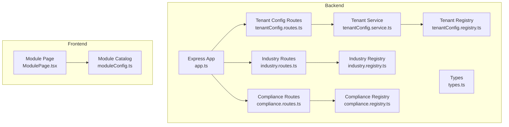
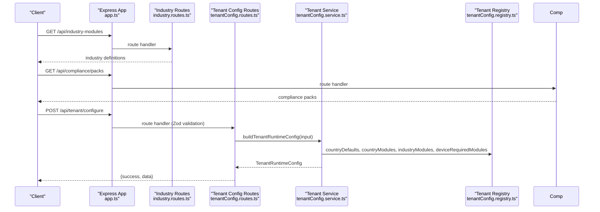
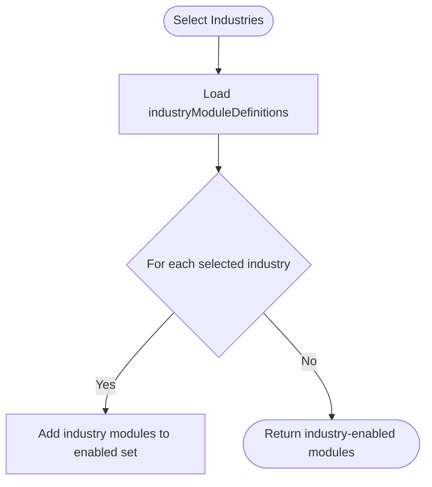
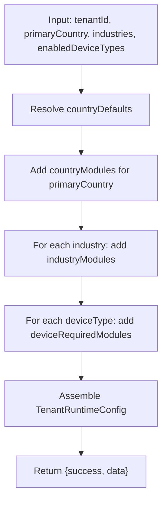
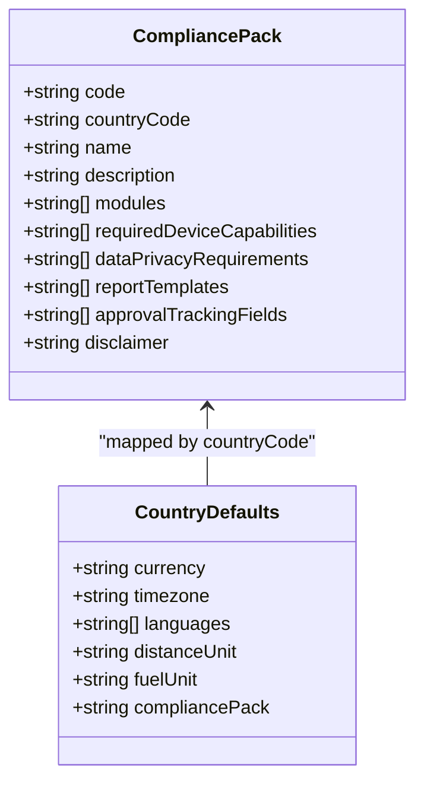
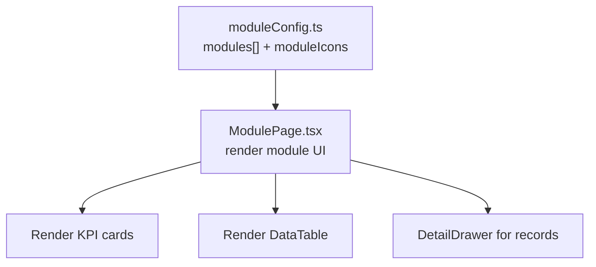
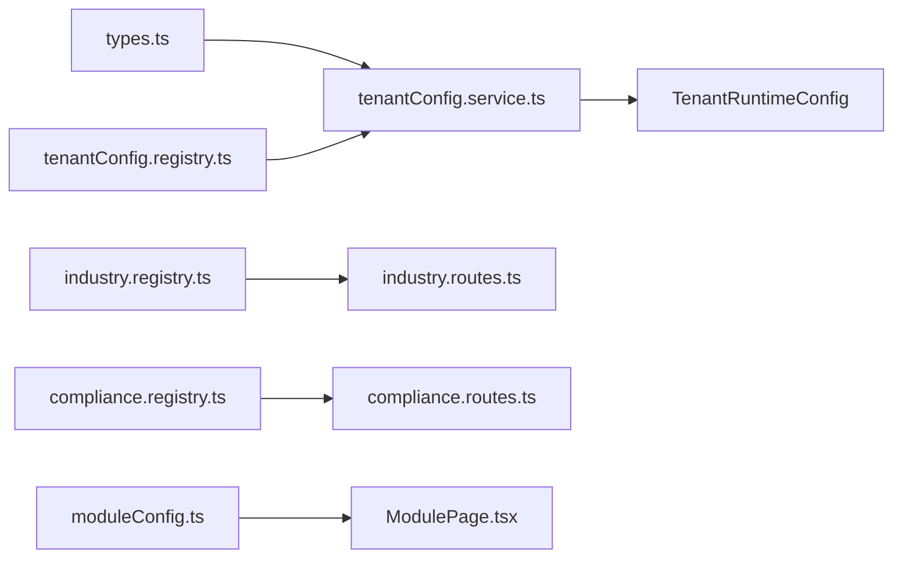

# Industry Module Customization

<cite>
**Referenced Files in This Document**
- [industry.registry.ts](file://backend/src/modules/industry/industry.registry.ts)
- [industry.routes.ts](file://backend/src/modules/industry/industry.routes.ts)
- [tenantConfig.registry.ts](file://backend/src/modules/tenant-config/tenantConfig.registry.ts)
- [tenantConfig.routes.ts](file://backend/src/modules/tenant-config/tenantConfig.routes.ts)
- [tenantConfig.service.ts](file://backend/src/modules/tenant-config/tenantConfig.service.ts)
- [types.ts](file://backend/src/modules/tenant-config/types.ts)
- [compliance.registry.ts](file://backend/src/modules/compliance/compliance.registry.ts)
- [compliance.routes.ts](file://backend/src/modules/compliance/compliance.routes.ts)
- [compliance.types.ts](file://backend/src/modules/compliance/compliance.types.ts)
- [app.ts](file://backend/src/app.ts)
- [moduleConfig.ts](file://frontend/src/modules/moduleConfig.ts)
- [ModulePage.tsx](file://frontend/src/pages/ModulePage.tsx)
- [MODULE_COVERAGE_MATRIX.md](file://docs/MODULE_COVERAGE_MATRIX.md)
</cite>

## Table of Contents
1. [Introduction](#introduction)
2. [Project Structure](#project-structure)
3. [Core Components](#core-components)
4. [Architecture Overview](#architecture-overview)
5. [Detailed Component Analysis](#detailed-component-analysis)
6. [Dependency Analysis](#dependency-analysis)
7. [Performance Considerations](#performance-considerations)
8. [Troubleshooting Guide](#troubleshooting-guide)
9. [Conclusion](#conclusion)
10. [Appendices](#appendices)

## Introduction
This document explains how industry-specific modules are customized and activated in a multi-tenant deployment. It covers:
- Industry module activation patterns and industry-specific workflows
- Regulatory compliance requirements and country-specific compliance packs
- Vertical-specific configurations and module enablement/disabling
- White-label and branding considerations per industry
- Module dependency management and cross-industry compatibility
- Migration strategies and operational reporting requirements
- Examples of successful industry implementations and customization patterns

The system centers on a declarative industry catalog, a tenant configuration builder, and country-specific compliance packs that together produce a tenant runtime configuration enabling only the modules required for a given industry and geography.

## Project Structure
The industry customization capability spans backend modules for industry catalogs, tenant configuration, and compliance packs, and a frontend module catalog that renders available modules.

**Diagram sources**
- [app.ts:16-97](file://backend/src/app.ts#L16-L97)
- [industry.routes.ts:1-14](file://backend/src/modules/industry/industry.routes.ts#L1-L14)
- [tenantConfig.routes.ts:1-58](file://backend/src/modules/tenant-config/tenantConfig.routes.ts#L1-L58)
- [compliance.routes.ts:1-24](file://backend/src/modules/compliance/compliance.routes.ts#L1-L24)
- [industry.registry.ts:1-52](file://backend/src/modules/industry/industry.registry.ts#L1-L52)
- [tenantConfig.registry.ts:1-178](file://backend/src/modules/tenant-config/tenantConfig.registry.ts#L1-L178)
- [tenantConfig.service.ts:1-65](file://backend/src/modules/tenant-config/tenantConfig.service.ts#L1-L65)
- [types.ts:1-68](file://backend/src/modules/tenant-config/types.ts#L1-L68)
- [compliance.registry.ts:1-142](file://backend/src/modules/compliance/compliance.registry.ts#L1-L142)
- [moduleConfig.ts:1-215](file://frontend/src/modules/moduleConfig.ts#L1-L215)
- [ModulePage.tsx:1-125](file://frontend/src/pages/ModulePage.tsx#L1-L125)

**Section sources**
- [app.ts:16-97](file://backend/src/app.ts#L16-L97)
- [industry.registry.ts:1-52](file://backend/src/modules/industry/industry.registry.ts#L1-L52)
- [tenantConfig.registry.ts:1-178](file://backend/src/modules/tenant-config/tenantConfig.registry.ts#L1-L178)
- [compliance.registry.ts:1-142](file://backend/src/modules/compliance/compliance.registry.ts#L1-L142)
- [moduleConfig.ts:1-215](file://frontend/src/modules/moduleConfig.ts#L1-L215)

## Core Components
- Industry catalog: Defines industry codes, names, descriptions, and the modules they enable.
- Tenant configuration builder: Aggregates country defaults, industry modules, and device-required modules into a tenant runtime configuration.
- Compliance packs: Encapsulate regulatory requirements, required device capabilities, privacy controls, report templates, and approval tracking fields per country.
- Frontend module catalog: Provides UI metadata (titles, icons, groups, permissions) for rendering available modules.

Key responsibilities:
- Industry activation: Select industries to enable industry-specific modules.
- Compliance alignment: Automatically include compliance packs and required modules based on primary country.
- Device-driven enablement: Enable modules based on the device types deployed.
- Runtime configuration: Produce a normalized set of enabled modules and compliance packs for the tenant.

**Section sources**
- [industry.registry.ts:1-52](file://backend/src/modules/industry/industry.registry.ts#L1-L52)
- [tenantConfig.service.ts:25-64](file://backend/src/modules/tenant-config/tenantConfig.service.ts#L25-L64)
- [compliance.registry.ts:3-142](file://backend/src/modules/compliance/compliance.registry.ts#L3-L142)
- [moduleConfig.ts:52-134](file://frontend/src/modules/moduleConfig.ts#L52-L134)

## Architecture Overview
The system exposes REST endpoints to discover industries and compliance packs, and to build a tenant runtime configuration from industry and device selections.

**Diagram sources**
- [app.ts:90-94](file://backend/src/app.ts#L90-L94)
- [industry.routes.ts:6-11](file://backend/src/modules/industry/industry.routes.ts#L6-L11)
- [compliance.routes.ts:6-21](file://backend/src/modules/compliance/compliance.routes.ts#L6-L21)
- [tenantConfig.routes.ts:38-55](file://backend/src/modules/tenant-config/tenantConfig.routes.ts#L38-L55)
- [tenantConfig.service.ts:25-64](file://backend/src/modules/tenant-config/tenantConfig.service.ts#L25-L64)
- [tenantConfig.registry.ts:9-178](file://backend/src/modules/tenant-config/tenantConfig.registry.ts#L9-L178)

## Detailed Component Analysis

### Industry Module Activation
- Industry registry defines industry codes and the modules they enable. Selection of an industry adds those modules to the tenant’s enabled module set.
- The industry discovery endpoint returns the full catalog for selection in tenant configuration.

**Diagram sources**
- [industry.registry.ts:1-52](file://backend/src/modules/industry/industry.registry.ts#L1-L52)
- [industry.routes.ts:6-11](file://backend/src/modules/industry/industry.routes.ts#L6-L11)

**Section sources**
- [industry.registry.ts:1-52](file://backend/src/modules/industry/industry.registry.ts#L1-L52)
- [industry.routes.ts:1-14](file://backend/src/modules/industry/industry.routes.ts#L1-L14)

### Tenant Configuration Builder
- Validates input using Zod schema for tenantId, primaryCountry, operatingCountries, industries, and enabledDeviceTypes.
- Builds a TenantRuntimeConfig by combining:
  - Country defaults (currency, timezone, languages, units, compliance pack)
  - Country module baseline
  - Industry modules
  - Device-required modules
- Returns enabledModules, enabledCompliancePacks, and localization settings.

**Diagram sources**
- [tenantConfig.routes.ts:7-36](file://backend/src/modules/tenant-config/tenantConfig.routes.ts#L7-L36)
- [tenantConfig.service.ts:25-64](file://backend/src/modules/tenant-config/tenantConfig.service.ts#L25-L64)
- [tenantConfig.registry.ts:9-178](file://backend/src/modules/tenant-config/tenantConfig.registry.ts#L9-L178)
- [types.ts:54-67](file://backend/src/modules/tenant-config/types.ts#L54-L67)

**Section sources**
- [tenantConfig.routes.ts:1-58](file://backend/src/modules/tenant-config/tenantConfig.routes.ts#L1-L58)
- [tenantConfig.service.ts:1-65](file://backend/src/modules/tenant-config/tenantConfig.service.ts#L1-L65)
- [tenantConfig.registry.ts:1-178](file://backend/src/modules/tenant-config/tenantConfig.registry.ts#L1-L178)
- [types.ts:1-68](file://backend/src/modules/tenant-config/types.ts#L1-L68)

### Compliance Frameworks
- Compliance packs define modules, required device capabilities, privacy requirements, report templates, and approval tracking fields per country.
- The compliance discovery endpoint returns all packs or filters by countryCode.
- The tenant builder automatically includes the primary country’s compliance pack in enabledCompliancePacks.

**Diagram sources**
- [compliance.types.ts:1-13](file://backend/src/modules/compliance/compliance.types.ts#L1-L13)
- [compliance.registry.ts:3-142](file://backend/src/modules/compliance/compliance.registry.ts#L3-L142)
- [tenantConfig.registry.ts:9-64](file://backend/src/modules/tenant-config/tenantConfig.registry.ts#L9-L64)

**Section sources**
- [compliance.registry.ts:1-142](file://backend/src/modules/compliance/compliance.registry.ts#L1-L142)
- [compliance.routes.ts:1-24](file://backend/src/modules/compliance/compliance.routes.ts#L1-L24)
- [tenantConfig.registry.ts:9-64](file://backend/src/modules/tenant-config/tenantConfig.registry.ts#L9-L64)

### Frontend Module Catalog and UI Adaptations
- The frontend module catalog defines module keys, titles, descriptions, groups, icons, and required permissions.
- The module page dynamically loads module metadata and renders KPIs, filters, data tables, and insights.
- Branding and white-labeling are primarily handled through localization and settings; per-industry theming is not explicitly implemented in the analyzed code.

**Diagram sources**
- [moduleConfig.ts:52-134](file://frontend/src/modules/moduleConfig.ts#L52-L134)
- [moduleConfig.ts:136-215](file://frontend/src/modules/moduleConfig.ts#L136-L215)
- [ModulePage.tsx:55-124](file://frontend/src/pages/ModulePage.tsx#L55-L124)

**Section sources**
- [moduleConfig.ts:1-215](file://frontend/src/modules/moduleConfig.ts#L1-L215)
- [ModulePage.tsx:1-125](file://frontend/src/pages/ModulePage.tsx#L1-L125)

### Regulatory Compliance Requirements
- Required device capabilities ensure the platform can collect the telemetry needed for compliance workflows (e.g., engine hours, ignition status, GPS location).
- Data privacy requirements drive audit logging, retention policies, and role-based access.
- Report templates and approval tracking fields standardize reporting and governance across industries.

**Section sources**
- [compliance.registry.ts:11-27](file://backend/src/modules/compliance/compliance.registry.ts#L11-L27)
- [compliance.registry.ts:29-56](file://backend/src/modules/compliance/compliance.registry.ts#L29-L56)
- [compliance.registry.ts:58-98](file://backend/src/modules/compliance/compliance.registry.ts#L58-L98)
- [compliance.registry.ts:100-126](file://backend/src/modules/compliance/compliance.registry.ts#L100-L126)
- [compliance.registry.ts:128-140](file://backend/src/modules/compliance/compliance.registry.ts#L128-L140)

### Industry-Specific Workflows
- Logistics: delivery dispatch, route optimization, proof of delivery, fuel monitoring.
- Cold Chain: temperature monitoring, humidity monitoring, alerts.
- School Transport: student tracking, route safety, geofencing.
- Construction: equipment tracking, geofencing, maintenance.
- Oil & Gas: journey management, dashcam safety, geofencing, maintenance.
- Rental Fleet: availability, rental status, maintenance, geofencing.
- Delivery Fleet: dispatch, route optimization, proof of delivery.

These workflows are enabled by selecting the corresponding industry and device types.

**Section sources**
- [industry.registry.ts:1-52](file://backend/src/modules/industry/industry.registry.ts#L1-L52)
- [tenantConfig.registry.ts:126-159](file://backend/src/modules/tenant-config/tenantConfig.registry.ts#L126-L159)
- [tenantConfig.registry.ts:161-177](file://backend/src/modules/tenant-config/tenantConfig.registry.ts#L161-L177)

### Module Enablement/Disabling Mechanisms
- Enablement: Selected industries and enabled device types add modules to the enabled set.
- Disabling: Not explicitly modeled; the tenant builder computes enabled modules from inputs. To disable, exclude industries and device types from the configuration request.

**Section sources**
- [tenantConfig.service.ts:34-48](file://backend/src/modules/tenant-config/tenantConfig.service.ts#L34-L48)
- [tenantConfig.routes.ts:13-36](file://backend/src/modules/tenant-config/tenantConfig.routes.ts#L13-L36)

### Cross-Industry Compatibility and Dependencies
- Country module baseline ensures a minimum set of modules per jurisdiction.
- Industry modules extend the baseline with vertical-specific capabilities.
- Device-required modules enforce dependencies on specific devices (e.g., dashcams for dashcam safety).

**Section sources**
- [tenantConfig.registry.ts:66-124](file://backend/src/modules/tenant-config/tenantConfig.registry.ts#L66-L124)
- [tenantConfig.registry.ts:126-159](file://backend/src/modules/tenant-config/tenantConfig.registry.ts#L126-L159)
- [tenantConfig.registry.ts:161-177](file://backend/src/modules/tenant-config/tenantConfig.registry.ts#L161-L177)

### Migration Strategies
- Runtime-safe schema/seed backfills demonstrate safe migrations for new modules and data models across batches.
- Compliance and reporting modules were progressively added with seeded data and placeholder endpoints, allowing staged rollouts.

**Section sources**
- [MODULE_COVERAGE_MATRIX.md:77-114](file://docs/MODULE_COVERAGE_MATRIX.md#L77-L114)
- [MODULE_COVERAGE_MATRIX.md:115-162](file://docs/MODULE_COVERAGE_MATRIX.md#L115-L162)
- [MODULE_COVERAGE_MATRIX.md:163-192](file://docs/MODULE_COVERAGE_MATRIX.md#L163-L192)

### Industry-Specific Data Models and Reporting
- Compliance packs define report templates and approval tracking fields.
- The module coverage matrix documents report/export placeholders and seeded datasets for reporting modules.

**Section sources**
- [compliance.registry.ts:23-27](file://backend/src/modules/compliance/compliance.registry.ts#L23-L27)
- [compliance.registry.ts:48-56](file://backend/src/modules/compliance/compliance.registry.ts#L48-L56)
- [compliance.registry.ts:84-98](file://backend/src/modules/compliance/compliance.registry.ts#L84-L98)
- [compliance.registry.ts:118-126](file://backend/src/modules/compliance/compliance.registry.ts#L118-L126)
- [MODULE_COVERAGE_MATRIX.md:167-171](file://docs/MODULE_COVERAGE_MATRIX.md#L167-L171)
- [MODULE_COVERAGE_MATRIX.md:229-235](file://docs/MODULE_COVERAGE_MATRIX.md#L229-L235)

### Examples of Successful Industry Implementations
- Logistics and Delivery Fleet: Dispatch, route optimization, proof of delivery modules are included for these industries.
- Cold Chain: Temperature monitoring and alerts modules are industry-specific.
- School Transport: Tracking and geofencing modules align with safety and attendance workflows.
- Construction: Equipment tracking, fuel monitoring, maintenance, and geofencing modules.
- Oil & Gas: Journey management, dashcam safety, geofencing, and maintenance modules.
- Rental Fleet: Fleet management, maintenance, and geofencing modules.

**Section sources**
- [industry.registry.ts:1-52](file://backend/src/modules/industry/industry.registry.ts#L1-L52)
- [tenantConfig.registry.ts:126-159](file://backend/src/modules/tenant-config/tenantConfig.registry.ts#L126-L159)

## Dependency Analysis
The tenant configuration builder composes multiple registries to compute the runtime configuration. The frontend module catalog consumes the module metadata to render UI components.

**Diagram sources**
- [types.ts:1-68](file://backend/src/modules/tenant-config/types.ts#L1-L68)
- [tenantConfig.service.ts:1-15](file://backend/src/modules/tenant-config/tenantConfig.service.ts#L1-L15)
- [tenantConfig.registry.ts:1-178](file://backend/src/modules/tenant-config/tenantConfig.registry.ts#L1-L178)
- [industry.registry.ts:1-52](file://backend/src/modules/industry/industry.registry.ts#L1-L52)
- [industry.routes.ts:1-14](file://backend/src/modules/industry/industry.routes.ts#L1-L14)
- [compliance.registry.ts:1-142](file://backend/src/modules/compliance/compliance.registry.ts#L1-L142)
- [compliance.routes.ts:1-24](file://backend/src/modules/compliance/compliance.routes.ts#L1-L24)
- [moduleConfig.ts:1-215](file://frontend/src/modules/moduleConfig.ts#L1-L215)
- [ModulePage.tsx:1-125](file://frontend/src/pages/ModulePage.tsx#L1-L125)

**Section sources**
- [tenantConfig.service.ts:1-65](file://backend/src/modules/tenant-config/tenantConfig.service.ts#L1-L65)
- [moduleConfig.ts:1-215](file://frontend/src/modules/moduleConfig.ts#L1-L215)

## Performance Considerations
- Centralized computation in the tenant builder avoids repeated lookups and deduplicates modules using a Set.
- Zod validation occurs at the route level to fail fast on invalid inputs.
- The industry and compliance discovery endpoints return static catalogs, minimizing database queries.

[No sources needed since this section provides general guidance]

## Troubleshooting Guide
Common issues and resolutions:
- Unsupported country: The tenant builder throws an error for unsupported primaryCountry. Verify the primaryCountry is one of the supported values.
- Invalid configuration request: The tenant route validates input using Zod. Check the returned error details for missing or invalid fields.
- Missing modules: Ensure the selected industries and enabled device types are included in the registries. Confirm that the primary country’s baseline modules are intended.

**Section sources**
- [tenantConfig.service.ts:28-32](file://backend/src/modules/tenant-config/tenantConfig.service.ts#L28-L32)
- [tenantConfig.routes.ts:41-47](file://backend/src/modules/tenant-config/tenantConfig.routes.ts#L41-L47)

## Conclusion
The industry module customization system provides a robust, declarative mechanism to tailor a tenant’s enabled modules and compliance packs by selecting industries and device types. The backend composes country baselines, industry-specific modules, and device dependencies into a single runtime configuration, while the frontend renders the available modules with consistent UI metadata. Compliance packs standardize regulatory workflows, and the module coverage matrix documents reporting and analytics capabilities across modules.

[No sources needed since this section summarizes without analyzing specific files]

## Appendices

### API Endpoints Summary
- GET /api/industry-modules: Returns industry definitions.
- GET /api/compliance/packs: Returns all compliance packs.
- GET /api/compliance/packs/:countryCode: Returns compliance packs filtered by country.
- POST /api/tenant/configure: Builds tenant runtime configuration from industries and device types.

**Section sources**
- [industry.routes.ts:6-11](file://backend/src/modules/industry/industry.routes.ts#L6-L11)
- [compliance.routes.ts:6-21](file://backend/src/modules/compliance/compliance.routes.ts#L6-L21)
- [tenantConfig.routes.ts:38-55](file://backend/src/modules/tenant-config/tenantConfig.routes.ts#L38-L55)