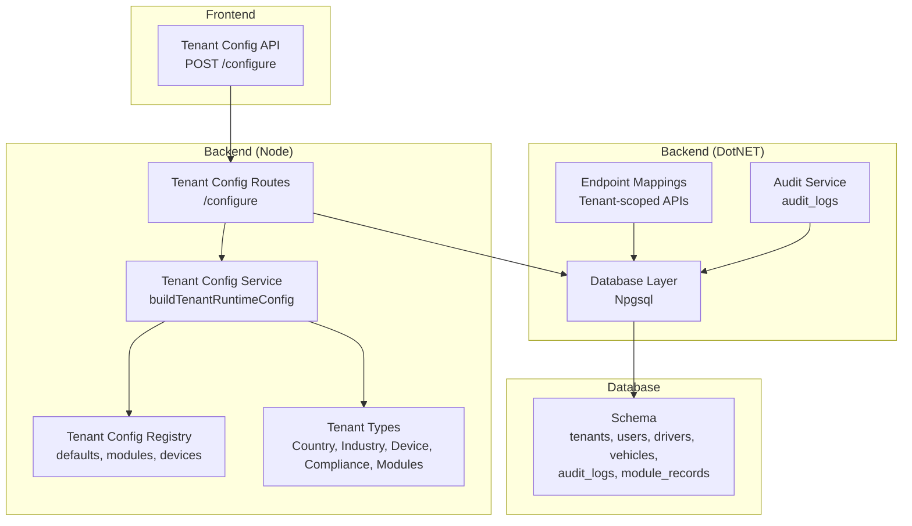
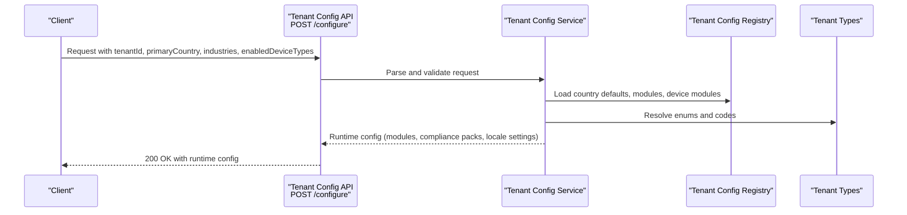
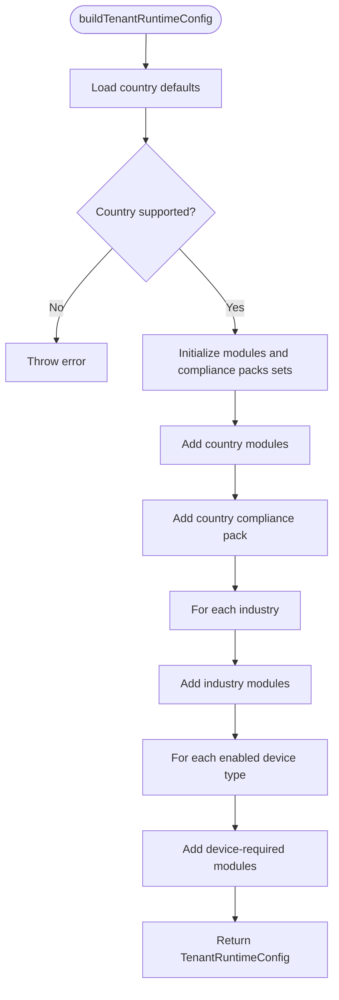
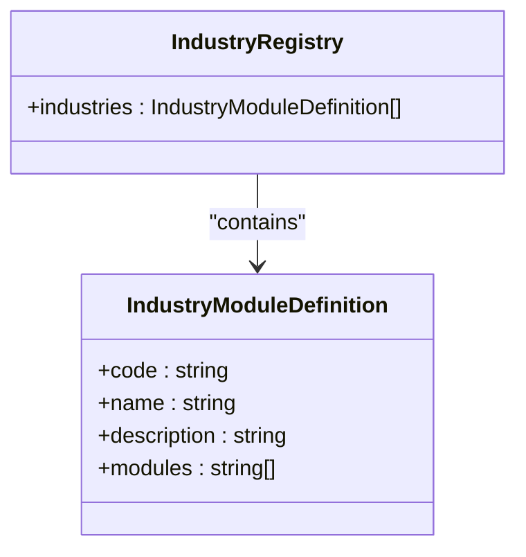
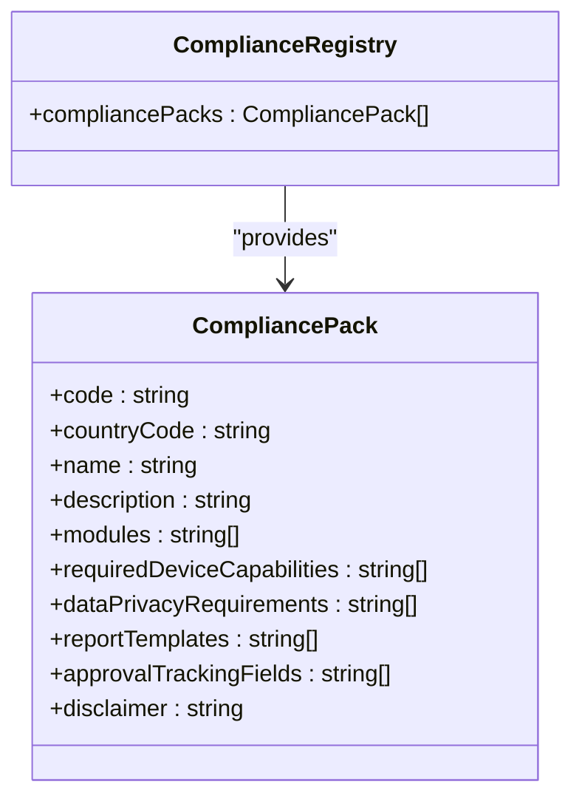
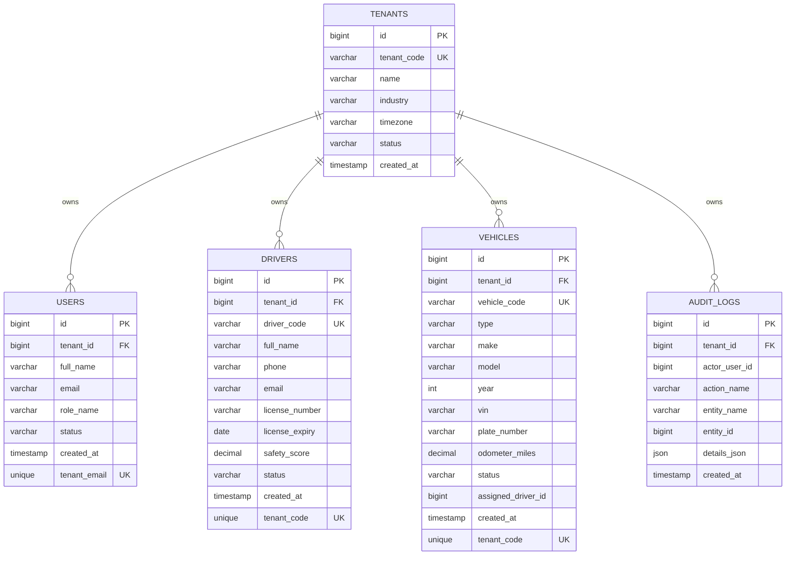
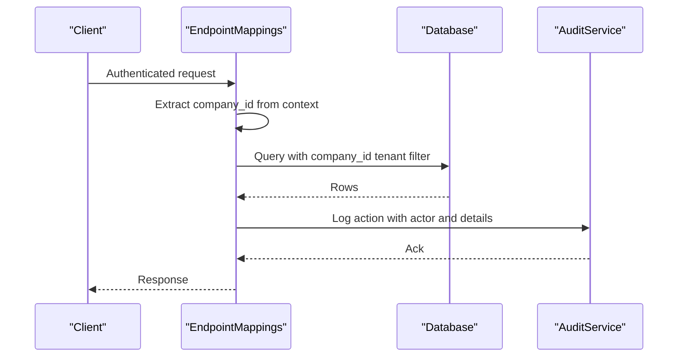
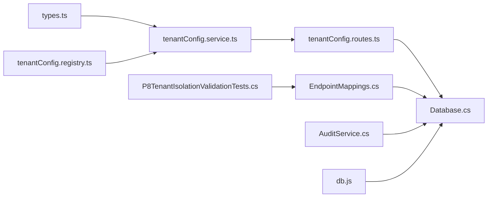

# Multi-tenant Architecture

<cite>
**Referenced Files in This Document**
- [tenantConfig.service.ts](file://backend/src/modules/tenant-config/tenantConfig.service.ts)
- [tenantConfig.routes.ts](file://backend/src/modules/tenant-config/tenantConfig.routes.ts)
- [tenantConfig.registry.ts](file://backend/src/modules/tenant-config/tenantConfig.registry.ts)
- [types.ts](file://backend/src/modules/tenant-config/types.ts)
- [industry.registry.ts](file://backend/src/modules/industry/industry.registry.ts)
- [compliance.registry.ts](file://backend/src/modules/compliance/compliance.registry.ts)
- [compliance.types.ts](file://backend/src/modules/compliance/compliance.types.ts)
- [001_schema.sql](file://db/init/001_schema.sql)
- [Database.cs](file://backend-dotnet/Data/Database.cs)
- [EndpointMappings.cs](file://backend-dotnet/Controllers/EndpointMappings.cs)
- [AuditService.cs](file://backend-dotnet/Services/AuditService.cs)
- [db.js](file://node-services/events/src/db.js)
- [P8TenantIsolationValidationTests.cs](file://backend-dotnet.Tests/P8ReportingTests.cs)
</cite>

## Table of Contents
1. [Introduction](#introduction)
2. [Project Structure](#project-structure)
3. [Core Components](#core-components)
4. [Architecture Overview](#architecture-overview)
5. [Detailed Component Analysis](#detailed-component-analysis)
6. [Dependency Analysis](#dependency-analysis)
7. [Performance Considerations](#performance-considerations)
8. [Troubleshooting Guide](#troubleshooting-guide)
9. [Conclusion](#conclusion)
10. [Appendices](#appendices)

## Introduction
This document describes the multi-tenant architecture for OpsTrax enterprise deployments. It explains tenant isolation strategies, data partitioning, and multi-tenant database design patterns. It also documents the tenant configuration service, industry-specific module activation, and tenant customization capabilities. Onboarding, configuration management, and branding options are covered alongside white-label and reseller capabilities, tenant hierarchies, shared versus isolated resources, and billing integration. Security, audit trails, and compliance isolation are addressed along with tenant-specific API access, module permissions, and configuration inheritance patterns.

## Project Structure
The multi-tenant design spans three primary layers:
- Frontend and backend orchestration define tenant-aware APIs and UI routing.
- Backend services encapsulate tenant configuration, industry modules, and compliance packs.
- Database schema enforces tenant isolation via per-tenant records and foreign keys.

**Diagram sources**
- [tenantConfig.routes.ts:1-58](file://backend/src/modules/tenant-config/tenantConfig.routes.ts#L1-L58)
- [tenantConfig.service.ts:1-65](file://backend/src/modules/tenant-config/tenantConfig.service.ts#L1-L65)
- [tenantConfig.registry.ts:1-178](file://backend/src/modules/tenant-config/tenantConfig.registry.ts#L1-L178)
- [types.ts:1-68](file://backend/src/modules/tenant-config/types.ts#L1-L68)
- [Database.cs:1-86](file://backend-dotnet/Data/Database.cs#L1-L86)
- [EndpointMappings.cs:1-13566](file://backend-dotnet/Controllers/EndpointMappings.cs#L1-L13566)
- [AuditService.cs:1-48](file://backend-dotnet/Services/AuditService.cs#L1-L48)
- [001_schema.sql:1-263](file://db/init/001_schema.sql#L1-L263)

**Section sources**
- [tenantConfig.routes.ts:1-58](file://backend/src/modules/tenant-config/tenantConfig.routes.ts#L1-L58)
- [tenantConfig.service.ts:1-65](file://backend/src/modules/tenant-config/tenantConfig.service.ts#L1-L65)
- [tenantConfig.registry.ts:1-178](file://backend/src/modules/tenant-config/tenantConfig.registry.ts#L1-L178)
- [types.ts:1-68](file://backend/src/modules/tenant-config/types.ts#L1-L68)
- [001_schema.sql:1-263](file://db/init/001_schema.sql#L1-L263)
- [Database.cs:1-86](file://backend-dotnet/Data/Database.cs#L1-L86)
- [EndpointMappings.cs:1-13566](file://backend-dotnet/Controllers/EndpointMappings.cs#L1-L13566)
- [AuditService.cs:1-48](file://backend-dotnet/Services/AuditService.cs#L1-L48)

## Core Components
- Tenant Configuration Service: Builds a runtime configuration for a tenant based on country defaults, industry modules, and enabled device types.
- Tenant Configuration Registry: Provides default settings, module mappings, and compliance packs per country and per industry/device.
- Industry Module Registry: Defines industry-specific module sets for verticals such as logistics, cold chain, school transport, construction, oil & gas, rental fleet, and delivery fleet.
- Compliance Packs Registry: Encapsulates regional compliance requirements, required device capabilities, privacy controls, report templates, and approval tracking fields.
- Database Schema: Enforces tenant isolation with per-tenant tables and foreign keys; includes audit logging for immutable activity records.
- Endpoint Mappings: Tenant-scoped API endpoints with permission checks and audit logging.
- Audit Service: Centralized logging of actions with tenant context.

**Section sources**
- [tenantConfig.service.ts:1-65](file://backend/src/modules/tenant-config/tenantConfig.service.ts#L1-L65)
- [tenantConfig.registry.ts:1-178](file://backend/src/modules/tenant-config/tenantConfig.registry.ts#L1-L178)
- [industry.registry.ts:1-52](file://backend/src/modules/industry/industry.registry.ts#L1-L52)
- [compliance.registry.ts:1-142](file://backend/src/modules/compliance/compliance.registry.ts#L1-L142)
- [compliance.types.ts:1-13](file://backend/src/modules/compliance/compliance.types.ts#L1-L13)
- [001_schema.sql:1-263](file://db/init/001_schema.sql#L1-L263)
- [EndpointMappings.cs:1-13566](file://backend-dotnet/Controllers/EndpointMappings.cs#L1-L13566)
- [AuditService.cs:1-48](file://backend-dotnet/Services/AuditService.cs#L1-L48)

## Architecture Overview
OpsTrax employs a shared-nothing multi-tenant pattern with strong isolation:
- Data Partitioning: Each tenant’s data resides in tenant-scoped tables with foreign keys linking entities (users, drivers, vehicles, jobs, routes, safety events, fuel transactions, compliance documents, audit logs).
- Tenant Isolation: APIs enforce tenant scoping using a company identifier resolved from the HTTP context; queries consistently filter by company_id.
- Configuration Inheritance: Country defaults and module mappings cascade into a tenant’s runtime configuration, which is then used to enable modules and compliance packs.
- Compliance and Privacy: Regional compliance packs define required device capabilities, privacy controls, and reporting templates.
- Auditability: All sensitive operations log immutable audit entries with actor, action, entity, and details.

**Diagram sources**
- [tenantConfig.routes.ts:1-58](file://backend/src/modules/tenant-config/tenantConfig.routes.ts#L1-L58)
- [tenantConfig.service.ts:1-65](file://backend/src/modules/tenant-config/tenantConfig.service.ts#L1-L65)
- [tenantConfig.registry.ts:1-178](file://backend/src/modules/tenant-config/tenantConfig.registry.ts#L1-L178)
- [types.ts:1-68](file://backend/src/modules/tenant-config/types.ts#L1-L68)

## Detailed Component Analysis

### Tenant Configuration Service
The service composes a tenant’s runtime configuration by combining:
- Country defaults (currency, timezone, languages, units, compliance pack)
- Country module baseline
- Industry module additions
- Device-required module additions
It throws on unsupported countries and returns a normalized configuration object.

**Diagram sources**
- [tenantConfig.service.ts:1-65](file://backend/src/modules/tenant-config/tenantConfig.service.ts#L1-L65)
- [tenantConfig.registry.ts:1-178](file://backend/src/modules/tenant-config/tenantConfig.registry.ts#L1-L178)
- [types.ts:1-68](file://backend/src/modules/tenant-config/types.ts#L1-L68)

**Section sources**
- [tenantConfig.service.ts:1-65](file://backend/src/modules/tenant-config/tenantConfig.service.ts#L1-L65)
- [tenantConfig.registry.ts:1-178](file://backend/src/modules/tenant-config/tenantConfig.registry.ts#L1-L178)
- [types.ts:1-68](file://backend/src/modules/tenant-config/types.ts#L1-L68)

### Industry Module Activation
Industry registries define module sets per vertical. These are additive to the country baseline and can be combined with device-required modules to produce the final enabled module list.

**Diagram sources**
- [industry.registry.ts:1-52](file://backend/src/modules/industry/industry.registry.ts#L1-L52)

**Section sources**
- [industry.registry.ts:1-52](file://backend/src/modules/industry/industry.registry.ts#L1-L52)

### Compliance Packs and Regional Requirements
Compliance packs encode regional requirements, device capabilities, privacy controls, report templates, and approval tracking fields. They are selected from country defaults and can be extended by industry/device selections.

**Diagram sources**
- [compliance.types.ts:1-13](file://backend/src/modules/compliance/compliance.types.ts#L1-L13)
- [compliance.registry.ts:1-142](file://backend/src/modules/compliance/compliance.registry.ts#L1-L142)

**Section sources**
- [compliance.types.ts:1-13](file://backend/src/modules/compliance/compliance.types.ts#L1-L13)
- [compliance.registry.ts:1-142](file://backend/src/modules/compliance/compliance.registry.ts#L1-L142)

### Multi-tenant Database Design Patterns
The schema establishes tenant isolation through:
- A tenants table with tenant identifiers and metadata.
- Per-entity tables scoped by tenant_id with unique constraints per tenant.
- Foreign keys ensuring referential integrity within tenants.
- An audit_logs table with tenant_id and actor_user_id for immutable activity tracking.

**Diagram sources**
- [001_schema.sql:1-263](file://db/init/001_schema.sql#L1-L263)

**Section sources**
- [001_schema.sql:1-263](file://db/init/001_schema.sql#L1-L263)

### Tenant-scoped API Access and Permissions
Endpoint mappings demonstrate tenant-scoped APIs with permission checks and audit logging. Many endpoints resolve company_id from the HTTP context and apply tenant filters to queries. Audit logs capture actor identity, action, and entity details.

**Diagram sources**
- [EndpointMappings.cs:1-13566](file://backend-dotnet/Controllers/EndpointMappings.cs#L1-L13566)
- [AuditService.cs:1-48](file://backend-dotnet/Services/AuditService.cs#L1-L48)
- [Database.cs:1-86](file://backend-dotnet/Data/Database.cs#L1-L86)

**Section sources**
- [EndpointMappings.cs:1-13566](file://backend-dotnet/Controllers/EndpointMappings.cs#L1-L13566)
- [AuditService.cs:1-48](file://backend-dotnet/Services/AuditService.cs#L1-L48)
- [Database.cs:1-86](file://backend-dotnet/Data/Database.cs#L1-L86)

### Tenant Isolation Validation
Tests confirm that generated SQL always includes a tenant filter and that user-provided filters cannot override the tenant constraint, ensuring robust isolation.

**Section sources**
- [P8TenantIsolationValidationTests.cs:567-596](file://backend-dotnet.Tests/P8ReportingTests.cs#L567-L596)

### Node Services Tenant Resolution
A dedicated service resolves tenant identifiers and validates tenant existence, enabling downstream operations to scope queries safely.

**Section sources**
- [db.js:1-34](file://node-services/events/src/db.js#L1-L34)

## Dependency Analysis
The tenant configuration pipeline depends on registry-driven mappings and typed enums. API routes depend on the configuration service and validation schemas. Backend endpoints depend on the database layer and audit service. Tests validate tenant isolation at the SQL level.

**Diagram sources**
- [types.ts:1-68](file://backend/src/modules/tenant-config/types.ts#L1-L68)
- [tenantConfig.service.ts:1-65](file://backend/src/modules/tenant-config/tenantConfig.service.ts#L1-L65)
- [tenantConfig.registry.ts:1-178](file://backend/src/modules/tenant-config/tenantConfig.registry.ts#L1-L178)
- [tenantConfig.routes.ts:1-58](file://backend/src/modules/tenant-config/tenantConfig.routes.ts#L1-L58)
- [Database.cs:1-86](file://backend-dotnet/Data/Database.cs#L1-L86)
- [EndpointMappings.cs:1-13566](file://backend-dotnet/Controllers/EndpointMappings.cs#L1-L13566)
- [AuditService.cs:1-48](file://backend-dotnet/Services/AuditService.cs#L1-L48)
- [P8TenantIsolationValidationTests.cs:567-596](file://backend-dotnet.Tests/P8ReportingTests.cs#L567-L596)
- [db.js:1-34](file://node-services/events/src/db.js#L1-L34)

**Section sources**
- [tenantConfig.service.ts:1-65](file://backend/src/modules/tenant-config/tenantConfig.service.ts#L1-L65)
- [tenantConfig.routes.ts:1-58](file://backend/src/modules/tenant-config/tenantConfig.routes.ts#L1-L58)
- [tenantConfig.registry.ts:1-178](file://backend/src/modules/tenant-config/tenantConfig.registry.ts#L1-L178)
- [types.ts:1-68](file://backend/src/modules/tenant-config/types.ts#L1-L68)
- [EndpointMappings.cs:1-13566](file://backend-dotnet/Controllers/EndpointMappings.cs#L1-L13566)
- [AuditService.cs:1-48](file://backend-dotnet/Services/AuditService.cs#L1-L48)
- [Database.cs:1-86](file://backend-dotnet/Data/Database.cs#L1-L86)
- [P8TenantIsolationValidationTests.cs:567-596](file://backend-dotnet.Tests/P8ReportingTests.cs#L567-L596)
- [db.js:1-34](file://node-services/events/src/db.js#L1-L34)

## Performance Considerations
- Indexes on tenant-scoped tables (e.g., unique tenant_code per entity) improve lookup performance.
- Queries should consistently filter by tenant_id to avoid scanning unrelated tenants’ data.
- Audit logging adds overhead; ensure batching and asynchronous writes where feasible.
- Use connection pooling and parameterized queries to minimize latency and SQL injection risks.

## Troubleshooting Guide
- Unsupported country in tenant configuration: The service throws an error for unsupported country codes; validate input against supported enums.
- Missing tenant in Node services: Tenant resolution fails if tenant_code does not exist; verify tenant creation and code correctness.
- Permission denials: Many endpoints require specific permissions; ensure user roles include required scopes.
- Audit gaps: Confirm that audit logging is invoked after write operations and that actor context is properly extracted from the HTTP context.

**Section sources**
- [tenantConfig.service.ts:1-65](file://backend/src/modules/tenant-config/tenantConfig.service.ts#L1-L65)
- [db.js:1-34](file://node-services/events/src/db.js#L1-L34)
- [EndpointMappings.cs:1-13566](file://backend-dotnet/Controllers/EndpointMappings.cs#L1-L13566)
- [AuditService.cs:1-48](file://backend-dotnet/Services/AuditService.cs#L1-L48)

## Conclusion
OpsTrax implements a robust multi-tenant architecture with clear tenant isolation, explicit configuration inheritance, and regionally compliant module activation. The design leverages a shared-nothing data model, tenant-scoped APIs, and comprehensive audit logging to meet enterprise needs for security, compliance, and scalability.

## Appendices

### Tenant Onboarding and Configuration Management
- Onboarding: Create tenant in tenants table; provision users and initial entities.
- Configuration: Call tenant configuration endpoint to derive runtime modules and compliance packs.
- Validation: Use tests and endpoint mappings to ensure tenant filters are applied and permissions enforced.

**Section sources**
- [001_schema.sql:1-263](file://db/init/001_schema.sql#L1-L263)
- [tenantConfig.routes.ts:1-58](file://backend/src/modules/tenant-config/tenantConfig.routes.ts#L1-L58)
- [P8TenantIsolationValidationTests.cs:567-596](file://backend-dotnet.Tests/P8ReportingTests.cs#L567-L596)

### White-label and Reseller Capabilities
- Branding: Country defaults include languages and timezone; extend with custom branding fields as needed.
- Reseller: Use company_id scoping to separate reseller accounts and apply reseller-specific module toggles.

**Section sources**
- [tenantConfig.registry.ts:1-178](file://backend/src/modules/tenant-config/tenantConfig.registry.ts#L1-L178)
- [EndpointMappings.cs:1-13566](file://backend-dotnet/Controllers/EndpointMappings.cs#L1-L13566)

### Tenant Hierarchies and Shared Resources
- Hierarchies: Company-level scoping via company_id enables hierarchical reseller or group structures.
- Shared resources: Some configurations (e.g., global feature flags) can be modeled as module_records keyed by company_id.

**Section sources**
- [EndpointMappings.cs:1-13566](file://backend-dotnet/Controllers/EndpointMappings.cs#L1-L13566)

### Billing Integration, Usage Tracking, and Resource Allocation
- Billing: Invoices and payments are exposed via tenant-scoped endpoints; leverage module_records for billing-related records.
- Usage tracking: Telemetry endpoints and metrics provide usage insights; combine with audit logs for compliance.
- Resource allocation: Feature flags and module toggles enable controlled rollouts per tenant.

**Section sources**
- [EndpointMappings.cs:376-414](file://backend-dotnet/Controllers/EndpointMappings.cs#L376-L414)
- [EndpointMappings.cs:61-70](file://backend-dotnet/Controllers/EndpointMappings.cs#L61-L70)
- [EndpointMappings.cs:460-478](file://backend-dotnet/Controllers/EndpointMappings.cs#L460-L478)

### Data Security, Audit Trails, and Compliance Isolation
- Security: Tenant filters and permission gates protect data; audit logs capture immutable activity.
- Compliance: Regional compliance packs define required controls and reporting; ensure device capabilities align with pack requirements.

**Section sources**
- [AuditService.cs:1-48](file://backend-dotnet/Services/AuditService.cs#L1-L48)
- [compliance.registry.ts:1-142](file://backend/src/modules/compliance/compliance.registry.ts#L1-L142)
- [P8TenantIsolationValidationTests.cs:567-596](file://backend-dotnet.Tests/P8ReportingTests.cs#L567-L596)

### Tenant-specific API Access, Module Permissions, and Configuration Inheritance
- API access: Tenant-scoped endpoints enforce company_id filtering and permission checks.
- Module permissions: UI and backend rely on permission keys to gate access to modules.
- Configuration inheritance: Country defaults, industry modules, and device-required modules compose the final runtime configuration.

**Section sources**
- [EndpointMappings.cs:1-13566](file://backend-dotnet/Controllers/EndpointMappings.cs#L1-L13566)
- [industry.registry.ts:1-52](file://backend/src/modules/industry/industry.registry.ts#L1-L52)
- [tenantConfig.service.ts:1-65](file://backend/src/modules/tenant-config/tenantConfig.service.ts#L1-L65)