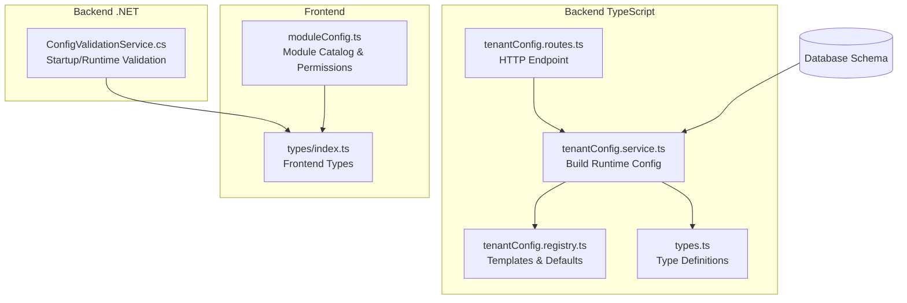
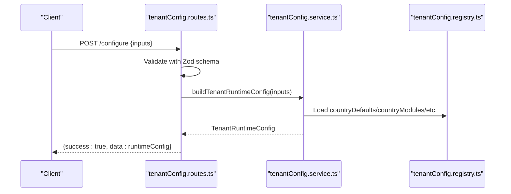
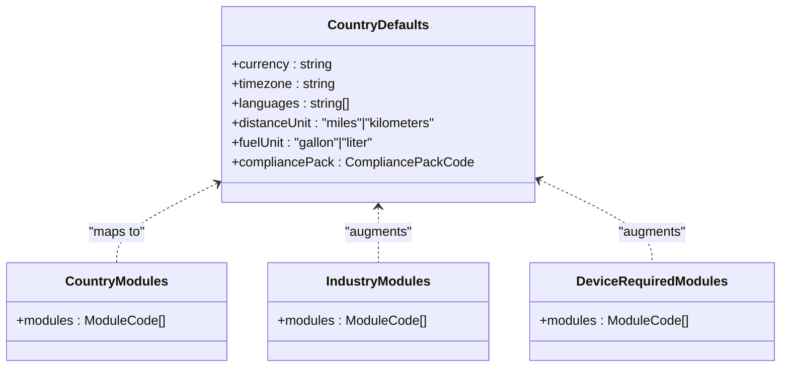
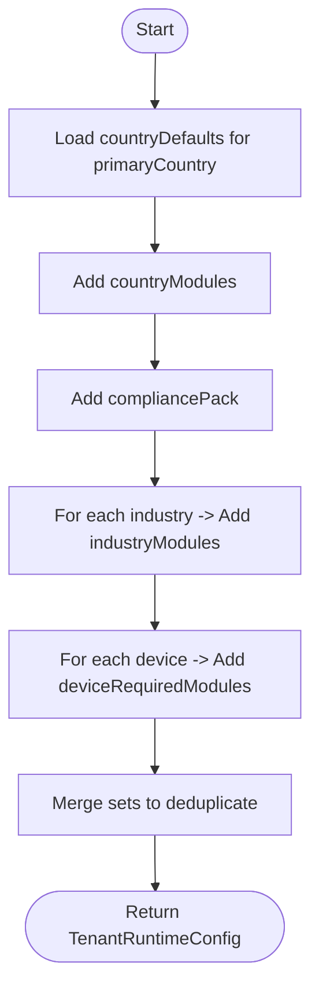
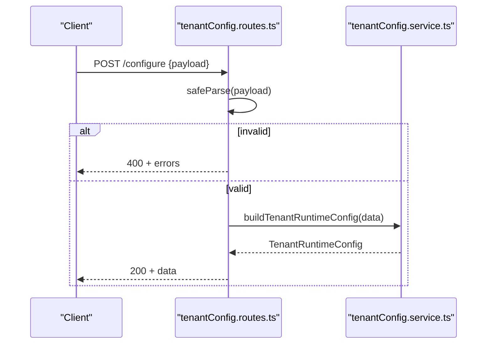
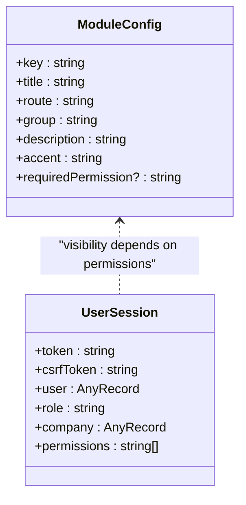
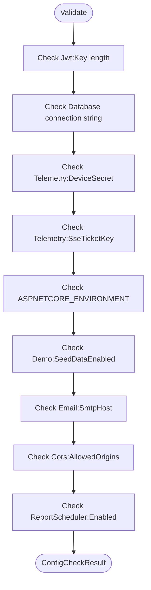
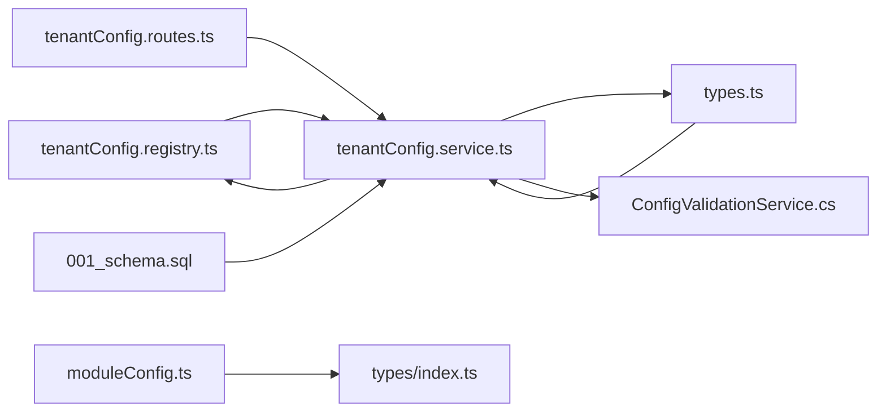

# Tenant Configuration Management

<cite>
**Referenced Files in This Document**
- [tenantConfig.registry.ts](file://backend/src/modules/tenant-config/tenantConfig.registry.ts)
- [tenantConfig.routes.ts](file://backend/src/modules/tenant-config/tenantConfig.routes.ts)
- [tenantConfig.service.ts](file://backend/src/modules/tenant-config/tenantConfig.service.ts)
- [types.ts](file://backend/src/modules/tenant-config/types.ts)
- [ConfigValidationService.cs](file://backend-dotnet/Services/ConfigValidationService.cs)
- [moduleConfig.ts](file://frontend/src/modules/moduleConfig.ts)
- [index.ts](file://frontend/src/types/index.ts)
- [001_schema.sql](file://db/init/001_schema.sql)
</cite>

## Table of Contents
1. [Introduction](#introduction)
2. [Project Structure](#project-structure)
3. [Core Components](#core-components)
4. [Architecture Overview](#architecture-overview)
5. [Detailed Component Analysis](#detailed-component-analysis)
6. [Dependency Analysis](#dependency-analysis)
7. [Performance Considerations](#performance-considerations)
8. [Troubleshooting Guide](#troubleshooting-guide)
9. [Conclusion](#conclusion)
10. [Appendices](#appendices)

## Introduction
This document describes the tenant configuration management system, focusing on tenant onboarding workflows, configuration templates, default settings management, dynamic configuration updates, validation, and change propagation. It also covers tenant-specific settings such as branding, module activation, permission overrides, and custom fields, along with configuration inheritance patterns, override hierarchies, conflict resolution, backup and restore procedures, versioning, and practical troubleshooting guidance.

## Project Structure
The tenant configuration system spans three primary areas:
- Backend TypeScript module for building runtime configuration from templates and defaults
- Backend .NET service for validating runtime configuration at startup and on demand
- Frontend module catalog used to enforce permission-based module visibility



**Diagram sources**
- [tenantConfig.registry.ts:1-178](file://backend/src/modules/tenant-config/tenantConfig.registry.ts#L1-L178)
- [tenantConfig.service.ts:1-65](file://backend/src/modules/tenant-config/tenantConfig.service.ts#L1-L65)
- [tenantConfig.routes.ts:1-58](file://backend/src/modules/tenant-config/tenantConfig.routes.ts#L1-L58)
- [types.ts:1-68](file://backend/src/modules/tenant-config/types.ts#L1-L68)
- [ConfigValidationService.cs:1-107](file://backend-dotnet/Services/ConfigValidationService.cs#L1-L107)
- [moduleConfig.ts:1-215](file://frontend/src/modules/moduleConfig.ts#L1-L215)
- [index.ts:1-51](file://frontend/src/types/index.ts#L1-L51)
- [001_schema.sql:1-263](file://db/init/001_schema.sql#L1-L263)

**Section sources**
- [tenantConfig.registry.ts:1-178](file://backend/src/modules/tenant-config/tenantConfig.registry.ts#L1-L178)
- [tenantConfig.service.ts:1-65](file://backend/src/modules/tenant-config/tenantConfig.service.ts#L1-L65)
- [tenantConfig.routes.ts:1-58](file://backend/src/modules/tenant-config/tenantConfig.routes.ts#L1-L58)
- [types.ts:1-68](file://backend/src/modules/tenant-config/types.ts#L1-L68)
- [ConfigValidationService.cs:1-107](file://backend-dotnet/Services/ConfigValidationService.cs#L1-L107)
- [moduleConfig.ts:1-215](file://frontend/src/modules/moduleConfig.ts#L1-L215)
- [index.ts:1-51](file://frontend/src/types/index.ts#L1-L51)
- [001_schema.sql:1-263](file://db/init/001_schema.sql#L1-L263)

## Core Components
- Template registry: Defines country defaults, module sets, industry modules, and device-required modules.
- Configuration builder: Aggregates inputs (primary country, industries, device types) into a runtime configuration.
- HTTP endpoint: Exposes a validated configuration builder API.
- Type system: Strongly typed enums and runtime configuration shape.
- Validation service: Validates environment/runtime configuration for security and correctness.
- Frontend module catalog: Defines module metadata and required permissions for visibility.

Key responsibilities:
- Onboarding: Accept tenant inputs and produce a normalized runtime configuration.
- Templates: Provide default settings and module activation rules per country/industry/device.
- Validation: Ensure secure and compliant runtime configuration.
- Propagation: Frontend consumes runtime configuration to control module visibility and permissions.

**Section sources**
- [tenantConfig.registry.ts:1-178](file://backend/src/modules/tenant-config/tenantConfig.registry.ts#L1-L178)
- [tenantConfig.service.ts:1-65](file://backend/src/modules/tenant-config/tenantConfig.service.ts#L1-L65)
- [tenantConfig.routes.ts:1-58](file://backend/src/modules/tenant-config/tenantConfig.routes.ts#L1-L58)
- [types.ts:1-68](file://backend/src/modules/tenant-config/types.ts#L1-L68)
- [ConfigValidationService.cs:1-107](file://backend-dotnet/Services/ConfigValidationService.cs#L1-L107)
- [moduleConfig.ts:1-215](file://frontend/src/modules/moduleConfig.ts#L1-L215)

## Architecture Overview
The tenant configuration system follows a template-driven approach:
- Inputs: tenantId, primaryCountry, operatingCountries, industries, enabledDeviceTypes
- Templates: countryDefaults, countryModules, industryModules, deviceRequiredModules
- Builder: Aggregates templates and inputs into a TenantRuntimeConfig
- Validation: Ensures runtime configuration is valid and secure
- Frontend: Uses module catalog and permissions to render appropriate UI



**Diagram sources**
- [tenantConfig.routes.ts:1-58](file://backend/src/modules/tenant-config/tenantConfig.routes.ts#L1-L58)
- [tenantConfig.service.ts:1-65](file://backend/src/modules/tenant-config/tenantConfig.service.ts#L1-L65)
- [tenantConfig.registry.ts:1-178](file://backend/src/modules/tenant-config/tenantConfig.registry.ts#L1-L178)

## Detailed Component Analysis

### Template Registry
The registry defines:
- Country defaults: currency, timezone, languages, units, and compliance pack
- Country module sets: base modules per country
- Industry module sets: industry-specific modules
- Device-required modules: modules implied by device types



**Diagram sources**
- [tenantConfig.registry.ts:9-178](file://backend/src/modules/tenant-config/tenantConfig.registry.ts#L9-L178)

**Section sources**
- [tenantConfig.registry.ts:1-178](file://backend/src/modules/tenant-config/tenantConfig.registry.ts#L1-L178)

### Configuration Builder
The builder:
- Loads country defaults for the primary country
- Adds country modules and compliance pack
- Merges industry modules
- Merges device-required modules
- Produces a normalized TenantRuntimeConfig



**Diagram sources**
- [tenantConfig.service.ts:25-64](file://backend/src/modules/tenant-config/tenantConfig.service.ts#L25-L64)

**Section sources**
- [tenantConfig.service.ts:1-65](file://backend/src/modules/tenant-config/tenantConfig.service.ts#L1-L65)

### HTTP Endpoint
The endpoint:
- Validates inputs using Zod schema
- Calls the builder
- Returns success with runtime configuration



**Diagram sources**
- [tenantConfig.routes.ts:38-55](file://backend/src/modules/tenant-config/tenantConfig.routes.ts#L38-L55)

**Section sources**
- [tenantConfig.routes.ts:1-58](file://backend/src/modules/tenant-config/tenantConfig.routes.ts#L1-L58)

### Type System
Strongly typed enums and runtime configuration:
- CountryCode, IndustryCode, DeviceType, CompliancePackCode, ModuleCode
- TenantRuntimeConfig shape with tenantId, countries, industries, device types, modules, and locale settings

```mermaid
classDiagram
class CountryCode {
<<enum>>
"US","CA","SA","AE","CUSTOM"
}
class IndustryCode {
<<enum>>
"logistics","cold_chain","school_transport","construction","oil_gas","rental_fleet","delivery_fleet"
}
class DeviceType {
<<enum>>
"obd_ii","j1939_can","gps_tracker","dashcam","temperature_sensor","fuel_sensor","ble_rfid_driver_id","tire_pressure_sensor"
}
class CompliancePackCode {
<<enum>>
"USA_FMCSA_ELD","CANADA_ELD","KSA_TGA_WASL_READY","UAE_TRANSPORT_READY","CUSTOM_COUNTRY_RULES"
}
class ModuleCode {
<<enum>>
"fleet_dashboard","live_map","driver_management","vehicle_management","device_management","eld_hos","dvir","wasl_ready_reporting","pdpl_privacy_controls","cst_device_approval_tracker","cold_chain_monitoring","temperature_alerts","fuel_monitoring","dashcam_safety","school_transport_tracking","construction_equipment_tracking","oil_gas_journey_management","rental_fleet_management","delivery_dispatch","proof_of_delivery","maintenance","route_optimization","geofencing"
}
class TenantRuntimeConfig {
+tenantId : string
+operatingCountries : CountryCode[]
+primaryCountry : CountryCode
+industries : IndustryCode[]
+enabledDeviceTypes : DeviceType[]
+enabledCompliancePacks : CompliancePackCode[]
+enabledModules : ModuleCode[]
+languages : string[]
+currency : string
+timezone : string
+distanceUnit : "miles"|"kilometers"
+fuelUnit : "gallon"|"liter"
}
```

**Diagram sources**
- [types.ts:1-68](file://backend/src/modules/tenant-config/types.ts#L1-L68)

**Section sources**
- [types.ts:1-68](file://backend/src/modules/tenant-config/types.ts#L1-L68)

### Frontend Module Catalog and Permissions
The frontend module catalog:
- Defines modules with keys, routes, groups, descriptions, accents, and required permissions
- Used to gate module visibility based on user permissions



**Diagram sources**
- [moduleConfig.ts:19-41](file://frontend/src/modules/moduleConfig.ts#L19-L41)
- [index.ts:43-50](file://frontend/src/types/index.ts#L43-L50)

**Section sources**
- [moduleConfig.ts:1-215](file://frontend/src/modules/moduleConfig.ts#L1-L215)
- [index.ts:1-51](file://frontend/src/types/index.ts#L1-L51)

### Runtime Configuration Validation (.NET)
The validation service:
- Checks JWT key strength, database connection, telemetry secrets, environment mode, demo seed data, email provider, CORS origins, and report scheduler
- Returns a structured result with pass/warn/fail checks



**Diagram sources**
- [ConfigValidationService.cs:15-96](file://backend-dotnet/Services/ConfigValidationService.cs#L15-L96)

**Section sources**
- [ConfigValidationService.cs:1-107](file://backend-dotnet/Services/ConfigValidationService.cs#L1-L107)

## Dependency Analysis
- Backend TypeScript depends on:
  - Registry for templates and defaults
  - Types for strong typing
  - Express for routing
- Frontend depends on:
  - Module catalog for UI composition
  - Types for session and module metadata
- Database schema supports tenant identity and related entities



**Diagram sources**
- [tenantConfig.registry.ts:1-178](file://backend/src/modules/tenant-config/tenantConfig.registry.ts#L1-L178)
- [tenantConfig.service.ts:1-65](file://backend/src/modules/tenant-config/tenantConfig.service.ts#L1-L65)
- [tenantConfig.routes.ts:1-58](file://backend/src/modules/tenant-config/tenantConfig.routes.ts#L1-L58)
- [types.ts:1-68](file://backend/src/modules/tenant-config/types.ts#L1-L68)
- [ConfigValidationService.cs:1-107](file://backend-dotnet/Services/ConfigValidationService.cs#L1-L107)
- [moduleConfig.ts:1-215](file://frontend/src/modules/moduleConfig.ts#L1-L215)
- [index.ts:1-51](file://frontend/src/types/index.ts#L1-L51)
- [001_schema.sql:1-263](file://db/init/001_schema.sql#L1-L263)

**Section sources**
- [tenantConfig.registry.ts:1-178](file://backend/src/modules/tenant-config/tenantConfig.registry.ts#L1-L178)
- [tenantConfig.service.ts:1-65](file://backend/src/modules/tenant-config/tenantConfig.service.ts#L1-L65)
- [tenantConfig.routes.ts:1-58](file://backend/src/modules/tenant-config/tenantConfig.routes.ts#L1-L58)
- [types.ts:1-68](file://backend/src/modules/tenant-config/types.ts#L1-L68)
- [ConfigValidationService.cs:1-107](file://backend-dotnet/Services/ConfigValidationService.cs#L1-L107)
- [moduleConfig.ts:1-215](file://frontend/src/modules/moduleConfig.ts#L1-L215)
- [index.ts:1-51](file://frontend/src/types/index.ts#L1-L51)
- [001_schema.sql:1-263](file://db/init/001_schema.sql#L1-L263)

## Performance Considerations
- Template lookups are O(1) hash map operations; builder merges sets with minimal overhead.
- Validation is lightweight and performed at startup and on demand.
- Frontend filtering by permissions is efficient using precomputed module catalogs.

## Troubleshooting Guide
Common issues and resolutions:
- Unsupported country: Builder throws on unsupported primaryCountry; ensure input matches registry enum.
- Invalid request payload: Endpoint responds with flattened Zod errors; validate client payload against schema.
- Runtime configuration warnings/invalid: Use validation service result to identify failing checks (e.g., short JWT key, missing secrets).
- Module visibility mismatch: Verify user permissions align with module requiredPermission and that runtime configuration enables the module.

**Section sources**
- [tenantConfig.service.ts:30-32](file://backend/src/modules/tenant-config/tenantConfig.service.ts#L30-L32)
- [tenantConfig.routes.ts:41-47](file://backend/src/modules/tenant-config/tenantConfig.routes.ts#L41-L47)
- [ConfigValidationService.cs:15-96](file://backend-dotnet/Services/ConfigValidationService.cs#L15-L96)
- [moduleConfig.ts:19-41](file://frontend/src/modules/moduleConfig.ts#L19-L41)

## Conclusion
The tenant configuration system provides a robust, template-driven approach to onboarding and managing tenant-specific settings. It leverages strongly typed enums, clear inheritance patterns, and validation to ensure secure and consistent deployments. Frontend integration ensures modules are rendered according to permissions and runtime configuration.

## Appendices

### Tenant Onboarding Workflow
- Collect inputs: tenantId, primaryCountry, operatingCountries, industries, enabledDeviceTypes
- Call /configure endpoint to receive TenantRuntimeConfig
- Apply runtime configuration to backend services and frontend module catalog

**Section sources**
- [tenantConfig.routes.ts:38-55](file://backend/src/modules/tenant-config/tenantConfig.routes.ts#L38-L55)
- [tenantConfig.service.ts:25-64](file://backend/src/modules/tenant-config/tenantConfig.service.ts#L25-L64)

### Configuration Templates and Defaults
- Country defaults define locale and compliance baseline
- Country modules define base capabilities
- Industry modules augment capabilities
- Device-required modules add dependent capabilities

**Section sources**
- [tenantConfig.registry.ts:9-178](file://backend/src/modules/tenant-config/tenantConfig.registry.ts#L9-L178)

### Dynamic Configuration Updates
- Current implementation builds static runtime configuration from inputs
- To enable dynamic updates, persist TenantRuntimeConfig in database and refresh caches/services accordingly

[No sources needed since this section provides general guidance]

### Configuration Validation and Change Propagation
- Backend .NET validates environment/runtime configuration and reports issues
- Frontend uses module catalog and permissions to propagate changes immediately

**Section sources**
- [ConfigValidationService.cs:15-96](file://backend-dotnet/Services/ConfigValidationService.cs#L15-L96)
- [moduleConfig.ts:19-41](file://frontend/src/modules/moduleConfig.ts#L19-L41)

### Tenant-Specific Settings
- Branding: Not modeled in current templates; can be added as optional fields in TenantRuntimeConfig
- Modules activation: Controlled by enabledModules and requiredPermission gating
- Permission overrides: Managed by frontend module catalog requiredPermission
- Custom fields: Can be introduced via extended TenantRuntimeConfig and backend services

**Section sources**
- [types.ts:54-67](file://backend/src/modules/tenant-config/types.ts#L54-L67)
- [moduleConfig.ts:19-41](file://frontend/src/modules/moduleConfig.ts#L19-L41)

### Configuration Inheritance Patterns and Override Hierarchies
- Primary country sets baseline defaults
- Industries and device types add capabilities
- No explicit overrides are modeled; last-in wins can be implemented by ordering inputs

**Section sources**
- [tenantConfig.service.ts:34-48](file://backend/src/modules/tenant-config/tenantConfig.service.ts#L34-L48)

### Conflict Resolution Strategies
- Deduplication via Set ensures no repeated modules
- Clear precedence: country defaults → industries → device-required modules

**Section sources**
- [tenantConfig.service.ts:34-48](file://backend/src/modules/tenant-config/tenantConfig.service.ts#L34-L48)

### Backup and Restore Procedures and Versioning
- Database schema supports tenant records; extend with configuration snapshots and version fields for backup/restore/versioning
- Implement migration scripts to evolve TenantRuntimeConfig schema over time

**Section sources**
- [001_schema.sql:4-12](file://db/init/001_schema.sql#L4-L12)