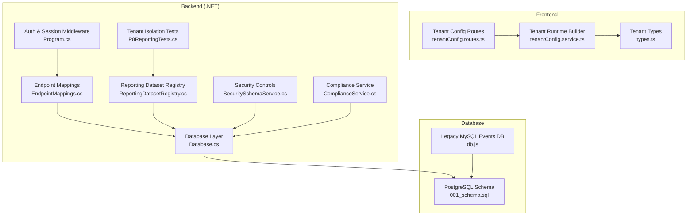
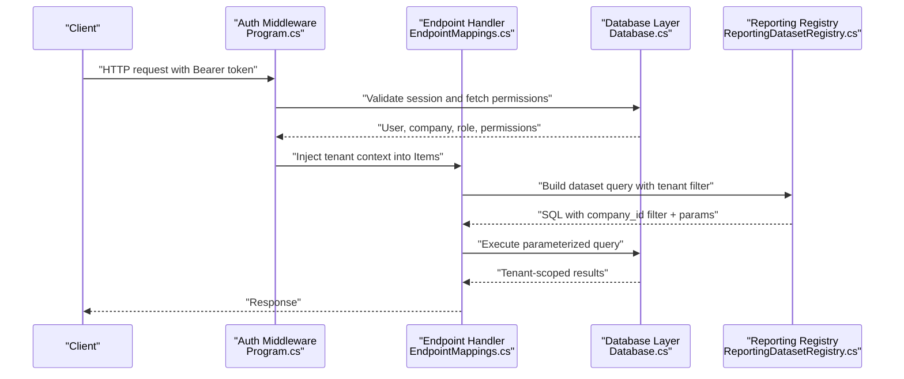
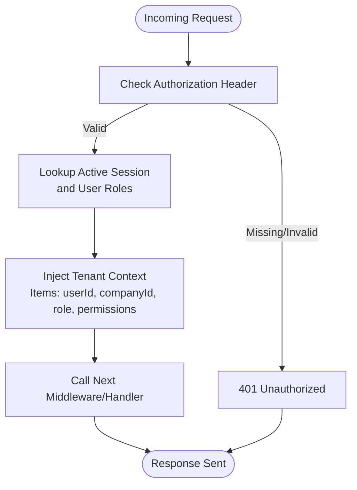
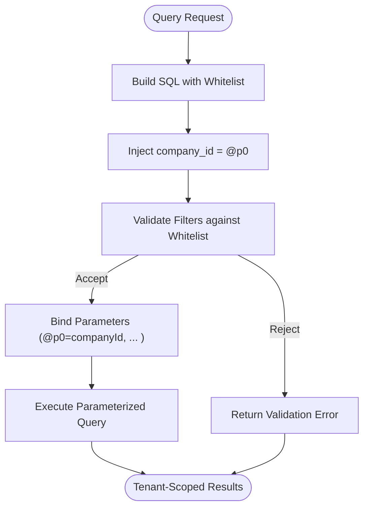
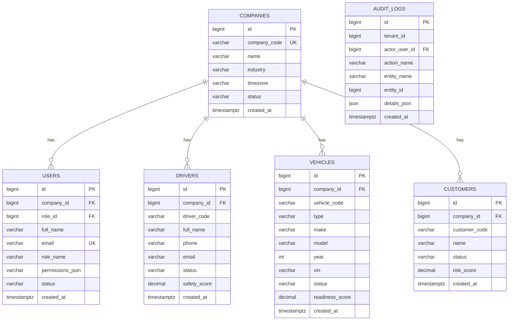
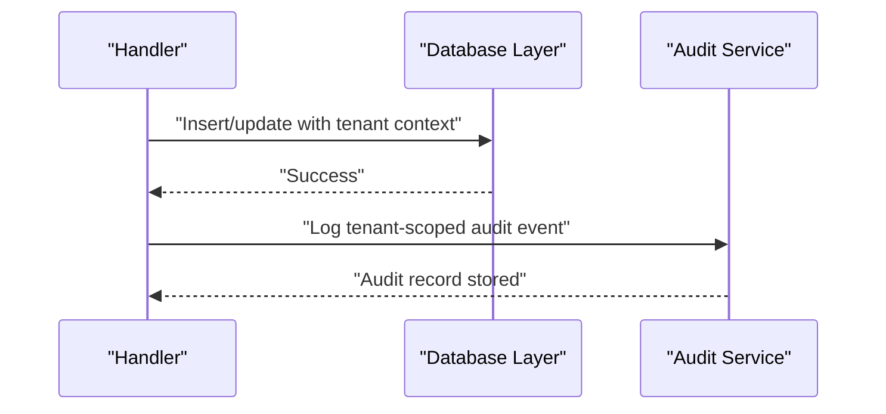
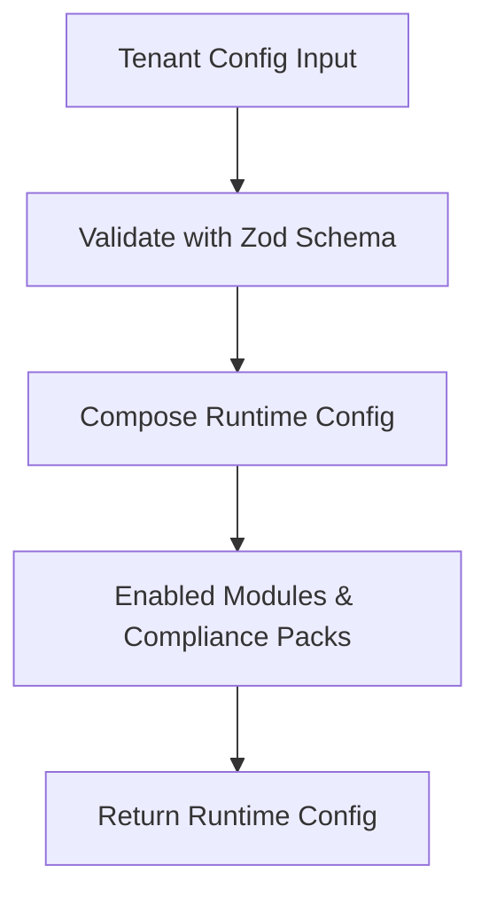
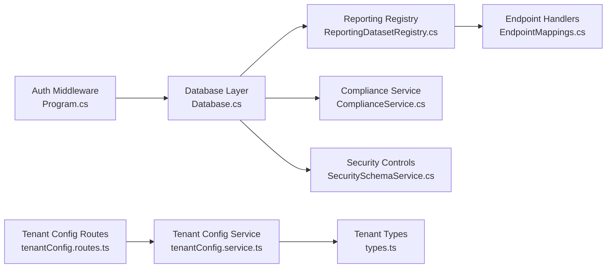

# Tenant Isolation Strategies

<cite>
**Referenced Files in This Document**
- [Program.cs](file://backend-dotnet/Program.cs)
- [EndpointMappings.cs](file://backend-dotnet/Controllers/EndpointMappings.cs)
- [Database.cs](file://backend-dotnet/Data/Database.cs)
- [ReportingDatasetRegistry.cs](file://backend-dotnet/Services/ReportingDatasetRegistry.cs)
- [P8ReportingTests.cs](file://backend-dotnet.Tests/P8ReportingTests.cs)
- [SecuritySchemaService.cs](file://backend-dotnet/Services/SecuritySchemaService.cs)
- [001_schema.sql](file://database/init/001_schema.sql)
- [001_schema.sql](file://db/init/001_schema.sql)
- [tenantConfig.routes.ts](file://backend/src/modules/tenant-config/tenantConfig.routes.ts)
- [tenantConfig.service.ts](file://backend/src/modules/tenant-config/tenantConfig.service.ts)
- [types.ts](file://backend/src/modules/tenant-config/types.ts)
- [db.js](file://node-services/events/src/db.js)
- [ComplianceService.cs](file://backend-dotnet/Services/ComplianceService.cs)
- [ErrorHandlingMiddleware.cs](file://backend-dotnet/Middleware/ErrorHandlingMiddleware.cs)
- [errorHandler.ts](file://backend/src/middleware/errorHandler.ts)
</cite>

## Table of Contents
1. [Introduction](#introduction)
2. [Project Structure](#project-structure)
3. [Core Components](#core-components)
4. [Architecture Overview](#architecture-overview)
5. [Detailed Component Analysis](#detailed-component-analysis)
6. [Dependency Analysis](#dependency-analysis)
7. [Performance Considerations](#performance-considerations)
8. [Troubleshooting Guide](#troubleshooting-guide)
9. [Conclusion](#conclusion)
10. [Appendices](#appendices)

## Introduction
This document details tenant isolation strategies in OpsTrax across database-level and application-layer mechanisms. It explains how schema-level scoping and row-level filtering are enforced, how tenant IDs propagate through API calls and background services, and how isolation boundaries are maintained. It also covers multi-tenant design patterns, shared vs. isolated resources, performance implications, data segregation techniques, audit trail isolation, compliance requirements, and security considerations.

## Project Structure
The repository implements multi-tenancy primarily in the .NET backend with complementary frontend and database assets. Key isolation touchpoints include:
- Authentication and authorization middleware that injects tenant context into HTTP contexts
- Database access layer with strongly scoped queries
- Reporting dataset registry that enforces tenant scoping server-side
- Compliance and security services that reference tenant-scoped controls
- Frontend tenant configuration APIs and runtime configuration builder

**Diagram sources**
- [Program.cs:101-244](file://backend-dotnet/Program.cs#L101-L244)
- [EndpointMappings.cs:61-6417](file://backend-dotnet/Controllers/EndpointMappings.cs#L61-L6417)
- [Database.cs:1-86](file://backend-dotnet/Data/Database.cs#L1-L86)
- [ReportingDatasetRegistry.cs:669-701](file://backend-dotnet/Services/ReportingDatasetRegistry.cs#L669-L701)
- [P8ReportingTests.cs:567-656](file://backend-dotnet.Tests/P8ReportingTests.cs#L567-L656)
- [SecuritySchemaService.cs:379-384](file://backend-dotnet/Services/SecuritySchemaService.cs#L379-L384)
- [ComplianceService.cs:26-56](file://backend-dotnet/Services/ComplianceService.cs#L26-L56)
- [001_schema.sql:1-200](file://database/init/001_schema.sql#L1-L200)
- [001_schema.sql:222-262](file://db/init/001_schema.sql#L222-L262)
- [db.js:1-34](file://node-services/events/src/db.js#L1-L34)
- [tenantConfig.routes.ts:1-57](file://backend/src/modules/tenant-config/tenantConfig.routes.ts#L1-L57)
- [tenantConfig.service.ts:1-65](file://backend/src/modules/tenant-config/tenantConfig.service.ts#L1-L65)
- [types.ts:1-68](file://backend/src/modules/tenant-config/types.ts#L1-L68)

**Section sources**
- [Program.cs:101-244](file://backend-dotnet/Program.cs#L101-L244)
- [tenantConfig.routes.ts:1-57](file://backend/src/modules/tenant-config/tenantConfig.routes.ts#L1-L57)
- [tenantConfig.service.ts:1-65](file://backend/src/modules/tenant-config/tenantConfig.service.ts#L1-L65)
- [types.ts:1-68](file://backend/src/modules/tenant-config/types.ts#L1-L68)

## Core Components
- Authentication and session middleware: Extracts tenant context from validated sessions and injects user, company, role, and permissions into HTTP items for downstream handlers.
- Database access layer: Provides parameterized query helpers to avoid SQL injection and support tenant scoping.
- Reporting dataset registry: Builds secure SQL with mandatory tenant filters and validates that tenant scoping cannot be overridden by user-provided filters.
- Compliance and security services: Reference tenant-scoped controls and audit/logging patterns.
- Frontend tenant configuration: Validates and constructs tenant runtime configuration.

**Section sources**
- [Program.cs:190-244](file://backend-dotnet/Program.cs#L190-L244)
- [Database.cs:17-86](file://backend-dotnet/Data/Database.cs#L17-L86)
- [ReportingDatasetRegistry.cs:669-701](file://backend-dotnet/Services/ReportingDatasetRegistry.cs#L669-L701)
- [P8ReportingTests.cs:567-656](file://backend-dotnet.Tests/P8ReportingTests.cs#L567-L656)
- [ComplianceService.cs:26-56](file://backend-dotnet/Services/ComplianceService.cs#L26-L56)
- [SecuritySchemaService.cs:379-384](file://backend-dotnet/Services/SecuritySchemaService.cs#L379-L384)
- [tenantConfig.routes.ts:1-57](file://backend/src/modules/tenant-config/tenantConfig.routes.ts#L1-L57)
- [tenantConfig.service.ts:1-65](file://backend/src/modules/tenant-config/tenantConfig.service.ts#L1-L65)

## Architecture Overview
The system enforces tenant isolation at three layers:
- Transport/session layer: Tenant context is attached to each request via middleware.
- Application layer: Handlers and services use tenant-aware query builders and database helpers.
- Database layer: Queries include mandatory tenant filters and leverage parameterized statements.

**Diagram sources**
- [Program.cs:190-244](file://backend-dotnet/Program.cs#L190-L244)
- [EndpointMappings.cs:61-6417](file://backend-dotnet/Controllers/EndpointMappings.cs#L61-L6417)
- [Database.cs:17-86](file://backend-dotnet/Data/Database.cs#L17-L86)
- [ReportingDatasetRegistry.cs:669-701](file://backend-dotnet/Services/ReportingDatasetRegistry.cs#L669-L701)

## Detailed Component Analysis

### Tenant Context Propagation (API Layer)
- Authentication middleware validates bearer tokens and resolves user sessions, extracting company_id and permissions.
- Middleware injects user, company, role, and permissions into HTTP items for handlers to consume.
- Certain endpoints bypass session auth (e.g., telemetry ingestion, public tracking), but tenant context is still enforced in query builders.

**Diagram sources**
- [Program.cs:174-244](file://backend-dotnet/Program.cs#L174-L244)

**Section sources**
- [Program.cs:174-244](file://backend-dotnet/Program.cs#L174-L244)

### Database-Level Isolation Patterns
- Row-level tenant scoping: All reporting datasets include a mandatory company_id filter injected server-side.
- Parameterized queries: Tenant filters are passed as parameters, preventing SQL injection and ensuring scoping integrity.
- Validation tests confirm:
  - Generated SQL always contains the tenant filter.
  - Tenant filter cannot be overridden by user-provided filters.
  - First parameter is always the tenant value across datasets.
  - Selecting company_id is rejected to prevent information leakage.

**Diagram sources**
- [ReportingDatasetRegistry.cs:669-701](file://backend-dotnet/Services/ReportingDatasetRegistry.cs#L669-L701)
- [P8ReportingTests.cs:567-656](file://backend-dotnet.Tests/P8ReportingTests.cs#L567-L656)

**Section sources**
- [ReportingDatasetRegistry.cs:669-701](file://backend-dotnet/Services/ReportingDatasetRegistry.cs#L669-L701)
- [P8ReportingTests.cs:567-656](file://backend-dotnet.Tests/P8ReportingTests.cs#L567-L656)

### Multi-Tenant Database Design Patterns
- Shared schema with tenant scoping: The schema defines company_id on core entities and uses foreign keys to companies. This enables a shared schema-per-database pattern with strong row-level isolation.
- Audit and compliance tables: Audit logs and compliance artifacts include tenant_id or company_id to ensure isolation of sensitive records.
- Legacy events service: A separate Node service connects to a legacy MySQL database with tenant scoping via tenant_code and tenant_id lookups.

**Diagram sources**
- [001_schema.sql:1-200](file://database/init/001_schema.sql#L1-L200)
- [001_schema.sql:222-262](file://db/init/001_schema.sql#L222-L262)

**Section sources**
- [001_schema.sql:1-200](file://database/init/001_schema.sql#L1-L200)
- [001_schema.sql:222-262](file://db/init/001_schema.sql#L222-L262)

### Tenant Data Segregation and Audit Trail Isolation
- Compliance controls explicitly reference tenant isolation: “All data queries enforce company_id scoping.”
- Audit logs are tenant-scoped, enabling compliance-ready audit trails per tenant.
- Background services’ health and heartbeat data exclude tenant-sensitive fields, reducing risk of accidental exposure.

**Diagram sources**
- [SecuritySchemaService.cs:379-384](file://backend-dotnet/Services/SecuritySchemaService.cs#L379-L384)
- [ComplianceService.cs:26-56](file://backend-dotnet/Services/ComplianceService.cs#L26-L56)

**Section sources**
- [SecuritySchemaService.cs:379-384](file://backend-dotnet/Services/SecuritySchemaService.cs#L379-L384)
- [ComplianceService.cs:26-56](file://backend-dotnet/Services/ComplianceService.cs#L26-L56)

### Tenant Configuration and Runtime Behavior
- Frontend routes validate and accept tenant configuration inputs (primary country, industries, device types).
- A builder composes a runtime configuration including enabled modules and compliance packs based on country defaults and inputs.
- This ensures tenant-specific capabilities and compliance regimes are applied consistently.

**Diagram sources**
- [tenantConfig.routes.ts:1-57](file://backend/src/modules/tenant-config/tenantConfig.routes.ts#L1-L57)
- [tenantConfig.service.ts:1-65](file://backend/src/modules/tenant-config/tenantConfig.service.ts#L1-L65)
- [types.ts:1-68](file://backend/src/modules/tenant-config/types.ts#L1-L68)

**Section sources**
- [tenantConfig.routes.ts:1-57](file://backend/src/modules/tenant-config/tenantConfig.routes.ts#L1-L57)
- [tenantConfig.service.ts:1-65](file://backend/src/modules/tenant-config/tenantConfig.service.ts#L1-L65)
- [types.ts:1-68](file://backend/src/modules/tenant-config/types.ts#L1-L68)

### Background Services and Tenant Context
- Background services run as hosted services and rely on database connectivity for health and metrics.
- Tests confirm heartbeat entries exclude tenant/customer/driver identifiers, minimizing risk of cross-tenant data leakage in operational signals.

**Section sources**
- [Program.cs:49-54](file://backend-dotnet/Program.cs#L49-L54)
- [P9ObservabilityTests.cs:500-518](file://backend-dotnet.Tests/P9ObservabilityTests.cs#L500-L518)

## Dependency Analysis
- Authentication depends on the database layer to resolve sessions and roles.
- Endpoint handlers depend on the reporting registry for secure query construction.
- Compliance and security services depend on database access for control and audit data.
- Frontend tenant configuration depends on typed enums and registries to build runtime configurations.

**Diagram sources**
- [Program.cs:190-244](file://backend-dotnet/Program.cs#L190-L244)
- [Database.cs:17-86](file://backend-dotnet/Data/Database.cs#L17-L86)
- [ReportingDatasetRegistry.cs:669-701](file://backend-dotnet/Services/ReportingDatasetRegistry.cs#L669-L701)
- [EndpointMappings.cs:61-6417](file://backend-dotnet/Controllers/EndpointMappings.cs#L61-L6417)
- [ComplianceService.cs:26-56](file://backend-dotnet/Services/ComplianceService.cs#L26-L56)
- [SecuritySchemaService.cs:379-384](file://backend-dotnet/Services/SecuritySchemaService.cs#L379-L384)
- [tenantConfig.routes.ts:1-57](file://backend/src/modules/tenant-config/tenantConfig.routes.ts#L1-L57)
- [tenantConfig.service.ts:1-65](file://backend/src/modules/tenant-config/tenantConfig.service.ts#L1-L65)
- [types.ts:1-68](file://backend/src/modules/tenant-config/types.ts#L1-L68)

**Section sources**
- [Program.cs:190-244](file://backend-dotnet/Program.cs#L190-L244)
- [ReportingDatasetRegistry.cs:669-701](file://backend-dotnet/Services/ReportingDatasetRegistry.cs#L669-L701)
- [ComplianceService.cs:26-56](file://backend-dotnet/Services/ComplianceService.cs#L26-L56)
- [SecuritySchemaService.cs:379-384](file://backend-dotnet/Services/SecuritySchemaService.cs#L379-L384)
- [tenantConfig.routes.ts:1-57](file://backend/src/modules/tenant-config/tenantConfig.routes.ts#L1-L57)
- [tenantConfig.service.ts:1-65](file://backend/src/modules/tenant-config/tenantConfig.service.ts#L1-L65)
- [types.ts:1-68](file://backend/src/modules/tenant-config/types.ts#L1-L68)

## Performance Considerations
- Parameterized queries with mandatory tenant filters reduce parsing overhead and improve cache hit rates for prepared statements.
- Centralized tenant scoping in the reporting registry minimizes duplication and reduces risk of missing filters.
- Indexes on company_id and tenant_id fields (where applicable) are essential for query performance in large datasets.
- Background services should avoid scanning entire tenant datasets; instead, use targeted queries and cursors to maintain responsiveness.

## Troubleshooting Guide
- Authentication failures: Verify bearer token validity and session expiration; ensure user status is active.
- Tenant scoping violations: Confirm that generated SQL includes the company_id filter and that user-provided filters cannot override it.
- Audit and compliance gaps: Ensure tenant-scoped audit logs are being written and retention policies are configured.
- Error handling: Both .NET and Express middlewares return generic internal server error responses; inspect logs for underlying causes.

**Section sources**
- [Program.cs:174-244](file://backend-dotnet/Program.cs#L174-L244)
- [P8ReportingTests.cs:567-656](file://backend-dotnet.Tests/P8ReportingTests.cs#L567-L656)
- [ErrorHandlingMiddleware.cs:1-22](file://backend-dotnet/Middleware/ErrorHandlingMiddleware.cs#L1-L22)
- [errorHandler.ts:1-17](file://backend/src/middleware/errorHandler.ts#L1-L17)

## Conclusion
OpsTrax implements robust tenant isolation through:
- Strong transport/session-level tenant context propagation
- Mandatory, parameterized tenant scoping in reporting queries
- Shared schema with row-level tenant filters
- Tenant-scoped audit and compliance artifacts
- Frontend-driven tenant configuration aligned with platform capabilities

These patterns collectively prevent data leakage, support compliance, and enable scalable multi-tenant operations.

## Appendices
- Implementation examples:
  - Tenant ID propagation: See authentication middleware injecting company_id into HTTP items.
  - Database queries: See reporting registry building parameterized SQL with company_id filter.
  - Background services: See hosted services and heartbeat validation tests confirming tenant isolation.

**Section sources**
- [Program.cs:190-244](file://backend-dotnet/Program.cs#L190-L244)
- [ReportingDatasetRegistry.cs:669-701](file://backend-dotnet/Services/ReportingDatasetRegistry.cs#L669-L701)
- [P9ObservabilityTests.cs:500-518](file://backend-dotnet.Tests/P9ObservabilityTests.cs#L500-L518)