# Tenant Security & Compliance

<cite>
**Referenced Files in This Document**
- [compliance.registry.ts](file://backend/src/modules/compliance/compliance.registry.ts)
- [compliance.routes.ts](file://backend/src/modules/compliance/compliance.routes.ts)
- [compliance.types.ts](file://backend/src/modules/compliance/compliance.types.ts)
- [tenantConfig.registry.ts](file://backend/src/modules/tenant-config/tenantConfig.registry.ts)
- [tenantConfig.routes.ts](file://backend/src/modules/tenant-config/tenantConfig.routes.ts)
- [tenantConfig.service.ts](file://backend/src/modules/tenant-config/tenantConfig.service.ts)
- [types.ts](file://backend/src/modules/tenant-config/types.ts)
- [ComplianceService.cs](file://backend-dotnet/Services/ComplianceService.cs)
- [AuditService.cs](file://backend-dotnet/Services/AuditService.cs)
- [SecuritySettingsService.cs](file://backend-dotnet/Services/SecuritySettingsService.cs)
- [DataRetentionService.cs](file://backend-dotnet/Services/DataRetentionService.cs)
- [SecurityEventService.cs](file://backend-dotnet/Services/SecurityEventService.cs)
- [AccessReviewService.cs](file://backend-dotnet/Services/AccessReviewService.cs)
- [SecuritySchemaService.cs](file://backend-dotnet/Services/SecuritySchemaService.cs)
- [EndpointMappings.cs](file://backend-dotnet/Controllers/EndpointMappings.cs)
- [rbacConfig.ts](file://frontend/src/auth/rbacConfig.ts)
- [adminApi.ts](file://frontend/src/services/adminApi.ts)
</cite>

## Table of Contents
1. [Introduction](#introduction)
2. [Project Structure](#project-structure)
3. [Core Components](#core-components)
4. [Architecture Overview](#architecture-overview)
5. [Detailed Component Analysis](#detailed-component-analysis)
6. [Dependency Analysis](#dependency-analysis)
7. [Performance Considerations](#performance-considerations)
8. [Troubleshooting Guide](#troubleshooting-guide)
9. [Conclusion](#conclusion)
10. [Appendices](#appendices)

## Introduction
This document provides comprehensive guidance for tenant security and compliance in multi-tenant environments. It explains how tenant-specific access control, role-based permissions, and audit trail isolation are implemented, along with encryption posture, secure tenant separation, and compliance framework integration. It also covers data sovereignty, GDPR-aligned patterns, industry-specific regulations, security monitoring, threat detection, incident response, data export/import governance, compliance reporting, and audit log management. Finally, it includes best practices and compliance checklists tailored for tenant deployments.

## Project Structure
The solution comprises:
- Frontend RBAC configuration and admin APIs for role and permission management
- Backend TypeScript modules for tenant configuration and compliance packs
- Backend .NET services for audit, compliance, security settings, data retention, security events, access reviews, and schema controls
- Centralized endpoint mappings defining role-to-permission defaults

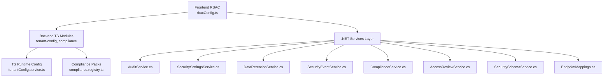

**Diagram sources**
- [rbacConfig.ts:333-375](file://frontend/src/auth/rbacConfig.ts#L333-L375)
- [tenantConfig.service.ts:25-64](file://backend/src/modules/tenant-config/tenantConfig.service.ts#L25-L64)
- [compliance.registry.ts:3-141](file://backend/src/modules/compliance/compliance.registry.ts#L3-L141)
- [AuditService.cs:7-47](file://backend-dotnet/Services/AuditService.cs#L7-L47)
- [SecuritySettingsService.cs:14-189](file://backend-dotnet/Services/SecuritySettingsService.cs#L14-L189)
- [DataRetentionService.cs:16-131](file://backend-dotnet/Services/DataRetentionService.cs#L16-L131)
- [SecurityEventService.cs:31-152](file://backend-dotnet/Services/SecurityEventService.cs#L31-L152)
- [ComplianceService.cs:26-241](file://backend-dotnet/Services/ComplianceService.cs#L26-L241)
- [AccessReviewService.cs:21-28](file://backend-dotnet/Services/AccessReviewService.cs#L21-L28)
- [SecuritySchemaService.cs:354-362](file://backend-dotnet/Services/SecuritySchemaService.cs#L354-L362)
- [EndpointMappings.cs:1454-1456](file://backend-dotnet/Controllers/EndpointMappings.cs#L1454-L1456)

**Section sources**
- [tenantConfig.routes.ts:1-58](file://backend/src/modules/tenant-config/tenantConfig.routes.ts#L1-L58)
- [compliance.routes.ts:1-24](file://backend/src/modules/compliance/compliance.routes.ts#L1-L24)
- [EndpointMappings.cs:12310-12326](file://backend-dotnet/Controllers/EndpointMappings.cs#L12310-L12326)

## Core Components
- Tenant configuration builder: constructs a tenant runtime configuration from country, industry, and device selections, and selects applicable compliance packs.
- Compliance packs registry: defines region-specific compliance packs, required device capabilities, privacy requirements, report templates, and approval tracking fields.
- Audit and security event logging: tenant-scoped logging with sanitization and isolation.
- Security settings and data retention: tenant-level policies for MFA, password, sessions, export approvals, and retention windows.
- Compliance evidence generation: platform-level controls mapped to real-time system data sources.
- Access reviews: tenant-scoped periodic reviews with snapshots and revocation tracking.
- RBAC configuration: role-to-permissions mapping and legacy aliases for backward compatibility.

**Section sources**
- [tenantConfig.service.ts:25-64](file://backend/src/modules/tenant-config/tenantConfig.service.ts#L25-L64)
- [compliance.registry.ts:3-141](file://backend/src/modules/compliance/compliance.registry.ts#L3-L141)
- [AuditService.cs:7-47](file://backend-dotnet/Services/AuditService.cs#L7-L47)
- [SecurityEventService.cs:31-152](file://backend-dotnet/Services/SecurityEventService.cs#L31-L152)
- [SecuritySettingsService.cs:14-189](file://backend-dotnet/Services/SecuritySettingsService.cs#L14-L189)
- [DataRetentionService.cs:16-131](file://backend-dotnet/Services/DataRetentionService.cs#L16-L131)
- [ComplianceService.cs:26-241](file://backend-dotnet/Services/ComplianceService.cs#L26-L241)
- [AccessReviewService.cs:21-28](file://backend-dotnet/Services/AccessReviewService.cs#L21-L28)
- [rbacConfig.ts:333-375](file://frontend/src/auth/rbacConfig.ts#L333-L375)

## Architecture Overview
The system enforces tenant isolation at multiple layers:
- Tenant configuration determines enabled modules and compliance packs per country and industry.
- RBAC maps roles to granular permissions scoped to tenant boundaries.
- Audit and security events are tenant-scoped with sanitization.
- Compliance evidence is generated from real system data and hashed for integrity.
- Data retention and legal hold guard sensitive data lifecycle.

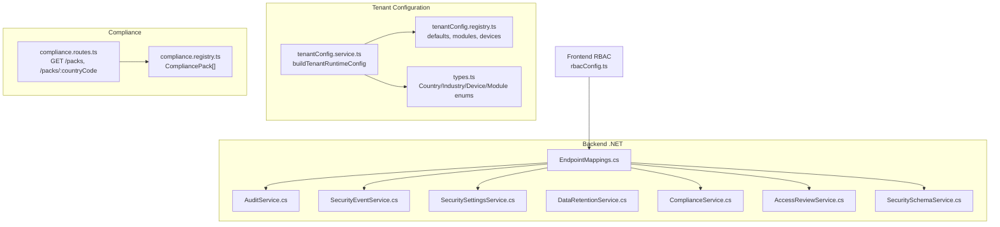

**Diagram sources**
- [tenantConfig.service.ts:25-64](file://backend/src/modules/tenant-config/tenantConfig.service.ts#L25-L64)
- [tenantConfig.registry.ts:9-178](file://backend/src/modules/tenant-config/tenantConfig.registry.ts#L9-L178)
- [types.ts:1-68](file://backend/src/modules/tenant-config/types.ts#L1-L68)
- [compliance.registry.ts:3-141](file://backend/src/modules/compliance/compliance.registry.ts#L3-L141)
- [compliance.routes.ts:1-24](file://backend/src/modules/compliance/compliance.routes.ts#L1-L24)
- [rbacConfig.ts:333-375](file://frontend/src/auth/rbacConfig.ts#L333-L375)
- [EndpointMappings.cs:1454-1456](file://backend-dotnet/Controllers/EndpointMappings.cs#L1454-L1456)
- [AuditService.cs:7-47](file://backend-dotnet/Services/AuditService.cs#L7-L47)
- [SecurityEventService.cs:31-152](file://backend-dotnet/Services/SecurityEventService.cs#L31-L152)
- [SecuritySettingsService.cs:14-189](file://backend-dotnet/Services/SecuritySettingsService.cs#L14-L189)
- [DataRetentionService.cs:16-131](file://backend-dotnet/Services/DataRetentionService.cs#L16-L131)
- [ComplianceService.cs:26-241](file://backend-dotnet/Services/ComplianceService.cs#L26-L241)
- [AccessReviewService.cs:21-28](file://backend-dotnet/Services/AccessReviewService.cs#L21-L28)
- [SecuritySchemaService.cs:354-362](file://backend-dotnet/Services/SecuritySchemaService.cs#L354-L362)

## Detailed Component Analysis

### Tenant Configuration and Compliance Packs
- The tenant configuration builder aggregates modules from country defaults, industries, and device types, and selects compliance packs accordingly.
- Compliance packs define region-specific modules, device capabilities, privacy requirements, report templates, and approval tracking fields.

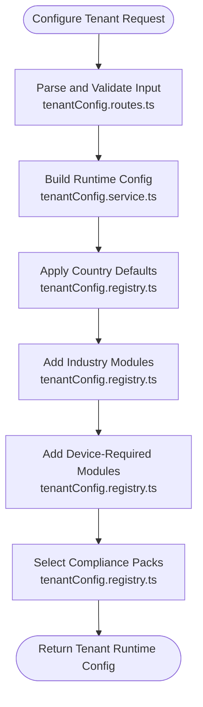

**Diagram sources**
- [tenantConfig.routes.ts:38-55](file://backend/src/modules/tenant-config/tenantConfig.routes.ts#L38-L55)
- [tenantConfig.service.ts:25-64](file://backend/src/modules/tenant-config/tenantConfig.service.ts#L25-L64)
- [tenantConfig.registry.ts:9-178](file://backend/src/modules/tenant-config/tenantConfig.registry.ts#L9-L178)

**Section sources**
- [tenantConfig.routes.ts:1-58](file://backend/src/modules/tenant-config/tenantConfig.routes.ts#L1-L58)
- [tenantConfig.service.ts:25-64](file://backend/src/modules/tenant-config/tenantConfig.service.ts#L25-L64)
- [tenantConfig.registry.ts:9-178](file://backend/src/modules/tenant-config/tenantConfig.registry.ts#L9-L178)
- [compliance.registry.ts:3-141](file://backend/src/modules/compliance/compliance.registry.ts#L3-L141)
- [compliance.types.ts:1-13](file://backend/src/modules/compliance/compliance.types.ts#L1-L13)

### Audit Trail Isolation and Logging
- AuditService logs tenant-scoped audit events with actor identification derived from HTTP context.
- SecurityEventService records tenant-scoped security events with IP truncation and user agent hashing for privacy.

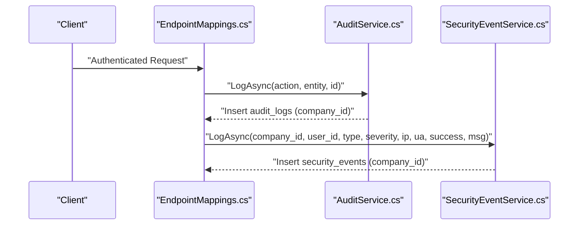

**Diagram sources**
- [EndpointMappings.cs:12310-12326](file://backend-dotnet/Controllers/EndpointMappings.cs#L12310-L12326)
- [AuditService.cs:7-47](file://backend-dotnet/Services/AuditService.cs#L7-L47)
- [SecurityEventService.cs:31-152](file://backend-dotnet/Services/SecurityEventService.cs#L31-L152)

**Section sources**
- [AuditService.cs:7-47](file://backend-dotnet/Services/AuditService.cs#L7-L47)
- [SecurityEventService.cs:31-152](file://backend-dotnet/Services/SecurityEventService.cs#L31-L152)

### Role-Based Access Control (RBAC)
- RBAC configuration maps roles to permission sets, including wildcard grants and legacy aliases.
- EndpointMappings defines default role-to-permission mappings used across the platform.

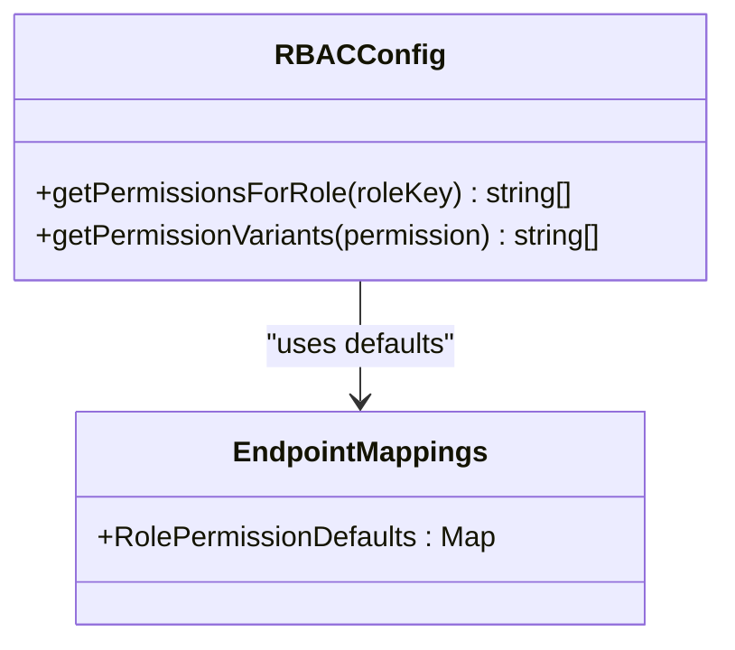

**Diagram sources**
- [rbacConfig.ts:333-375](file://frontend/src/auth/rbacConfig.ts#L333-L375)
- [EndpointMappings.cs:1454-1456](file://backend-dotnet/Controllers/EndpointMappings.cs#L1454-L1456)

**Section sources**
- [rbacConfig.ts:333-375](file://frontend/src/auth/rbacConfig.ts#L333-L375)
- [EndpointMappings.cs:1454-1456](file://backend-dotnet/Controllers/EndpointMappings.cs#L1454-L1456)

### Compliance Evidence Generation and SOC2 Readiness
- ComplianceService generates evidence by querying real system tables and computing SHA-256 hashes for integrity.
- Evidence sources include audit logs, security events, service runs, access reviews, backup verifications, and platform incidents.

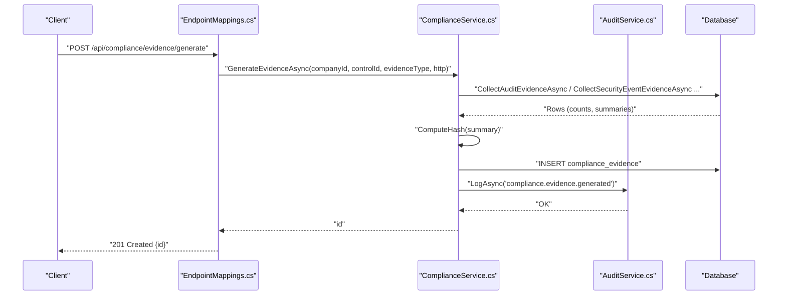

**Diagram sources**
- [EndpointMappings.cs:12319-12321](file://backend-dotnet/Controllers/EndpointMappings.cs#L12319-L12321)
- [ComplianceService.cs:80-131](file://backend-dotnet/Services/ComplianceService.cs#L80-L131)
- [AuditService.cs:7-47](file://backend-dotnet/Services/AuditService.cs#L7-L47)

**Section sources**
- [ComplianceService.cs:26-241](file://backend-dotnet/Services/ComplianceService.cs#L26-L241)

### Data Retention and Legal Hold
- DataRetentionService manages tenant-level retention policies and legal hold flags.
- Safeguards include preventing deletions while legal hold is active and enforcing minimum retention windows.

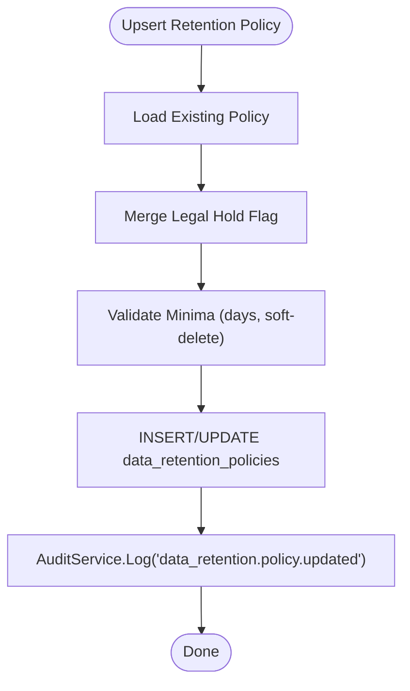

**Diagram sources**
- [DataRetentionService.cs:56-112](file://backend-dotnet/Services/DataRetentionService.cs#L56-L112)
- [AuditService.cs:7-47](file://backend-dotnet/Services/AuditService.cs#L7-L47)

**Section sources**
- [DataRetentionService.cs:16-131](file://backend-dotnet/Services/DataRetentionService.cs#L16-L131)

### Security Settings and Tenant Policies
- SecuritySettingsService defines tenant-level security policies (MFA, password, sessions, export approvals, retention).
- Updates are audited and tenant-scoped.

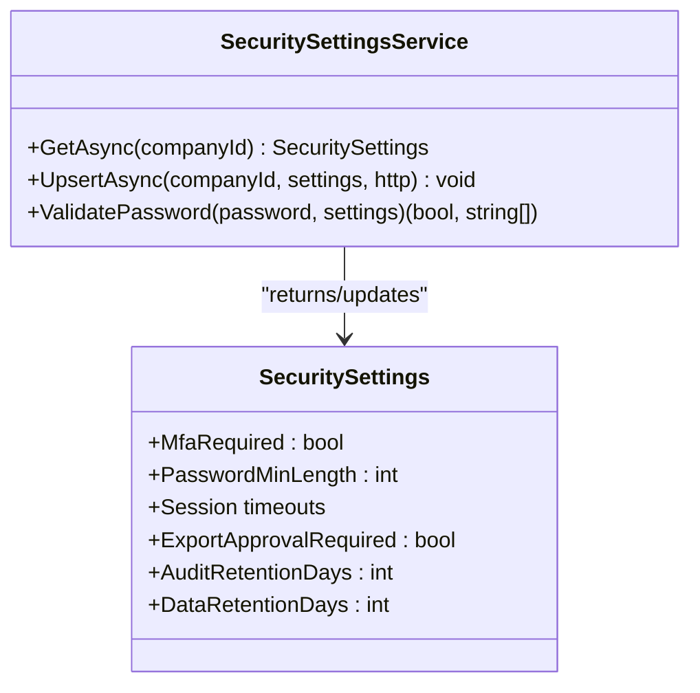

**Diagram sources**
- [SecuritySettingsService.cs:14-189](file://backend-dotnet/Services/SecuritySettingsService.cs#L14-L189)

**Section sources**
- [SecuritySettingsService.cs:14-189](file://backend-dotnet/Services/SecuritySettingsService.cs#L14-L189)

### Access Reviews and Remediation
- AccessReviewService creates tenant-scoped campaigns, snapshots roles/permissions, and tracks revocations.
- Designed to be tenant-aware and audit-logged.

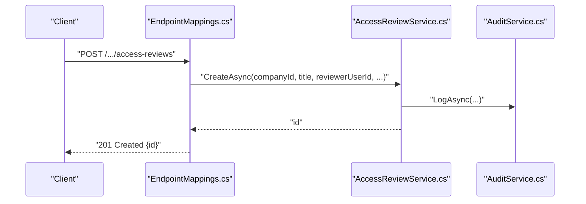

**Diagram sources**
- [EndpointMappings.cs:12310-12313](file://backend-dotnet/Controllers/EndpointMappings.cs#L12310-L12313)
- [AccessReviewService.cs:21-28](file://backend-dotnet/Services/AccessReviewService.cs#L21-L28)
- [AuditService.cs:7-47](file://backend-dotnet/Services/AuditService.cs#L7-L47)

**Section sources**
- [AccessReviewService.cs:21-28](file://backend-dotnet/Services/AccessReviewService.cs#L21-L28)

### Encryption and Secure Separation
- SecurityEventService demonstrates transport integrity safeguards by truncating IPs and hashing user agents.
- ComplianceService computes SHA-256 hashes for evidence integrity.
- Tenant separation is enforced via company_id scoping across audit, security events, compliance, and retention services.

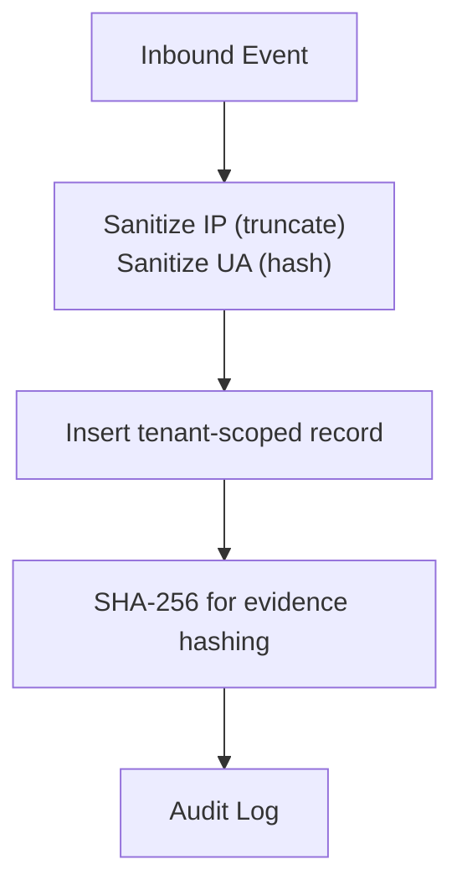

**Diagram sources**
- [SecurityEventService.cs:120-150](file://backend-dotnet/Services/SecurityEventService.cs#L120-L150)
- [ComplianceService.cs:234-239](file://backend-dotnet/Services/ComplianceService.cs#L234-L239)

**Section sources**
- [SecurityEventService.cs:31-152](file://backend-dotnet/Services/SecurityEventService.cs#L31-L152)
- [ComplianceService.cs:26-241](file://backend-dotnet/Services/ComplianceService.cs#L26-L241)

### Compliance Framework Integration
- SecuritySchemaService enumerates SOC2 readiness controls and their implementation status, aligning with audit, monitoring, and incident response domains.

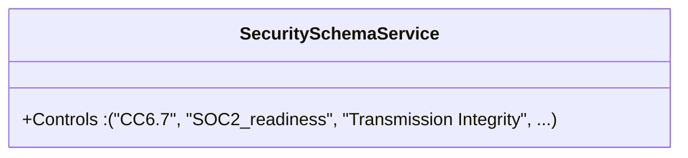

**Diagram sources**
- [SecuritySchemaService.cs:354-362](file://backend-dotnet/Services/SecuritySchemaService.cs#L354-L362)

**Section sources**
- [SecuritySchemaService.cs:354-362](file://backend-dotnet/Services/SecuritySchemaService.cs#L354-L362)

## Dependency Analysis
- Frontend RBAC depends on EndpointMappings defaults for role-to-permission resolution.
- Backend TS modules depend on registries for country, industry, and device mappings.
- .NET services depend on AuditService for auditing and on database tables for persistence.
- ComplianceService depends on multiple system tables to produce real-evidence.

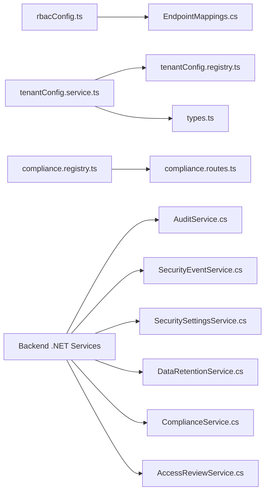

**Diagram sources**
- [rbacConfig.ts:333-375](file://frontend/src/auth/rbacConfig.ts#L333-L375)
- [EndpointMappings.cs:1454-1456](file://backend-dotnet/Controllers/EndpointMappings.cs#L1454-L1456)
- [tenantConfig.service.ts:25-64](file://backend/src/modules/tenant-config/tenantConfig.service.ts#L25-L64)
- [tenantConfig.registry.ts:9-178](file://backend/src/modules/tenant-config/tenantConfig.registry.ts#L9-L178)
- [types.ts:1-68](file://backend/src/modules/tenant-config/types.ts#L1-L68)
- [compliance.registry.ts:3-141](file://backend/src/modules/compliance/compliance.registry.ts#L3-L141)
- [compliance.routes.ts:1-24](file://backend/src/modules/compliance/compliance.routes.ts#L1-L24)
- [AuditService.cs:7-47](file://backend-dotnet/Services/AuditService.cs#L7-L47)
- [SecurityEventService.cs:31-152](file://backend-dotnet/Services/SecurityEventService.cs#L31-L152)
- [SecuritySettingsService.cs:14-189](file://backend-dotnet/Services/SecuritySettingsService.cs#L14-L189)
- [DataRetentionService.cs:16-131](file://backend-dotnet/Services/DataRetentionService.cs#L16-L131)
- [ComplianceService.cs:26-241](file://backend-dotnet/Services/ComplianceService.cs#L26-L241)
- [AccessReviewService.cs:21-28](file://backend-dotnet/Services/AccessReviewService.cs#L21-L28)

**Section sources**
- [EndpointMappings.cs:12310-12326](file://backend-dotnet/Controllers/EndpointMappings.cs#L12310-L12326)
- [tenantConfig.routes.ts:1-58](file://backend/src/modules/tenant-config/tenantConfig.routes.ts#L1-L58)
- [compliance.routes.ts:1-24](file://backend/src/modules/compliance/compliance.routes.ts#L1-L24)

## Performance Considerations
- Limit query sizes for evidence and security events using pagination and time bounds.
- Indexes on company_id, timestamps, and event_type improve tenant-scoped retrieval performance.
- Prefer batched inserts for evidence generation and avoid unnecessary JSON serialization overhead.
- Cache role-to-permission mappings in memory on the server for frequent checks.

## Troubleshooting Guide
- Audit and security events missing: verify company_id propagation from HTTP context and ensure endpoints route through EndpointMappings.
- Excessive PII in logs: confirm IP truncation and user agent hashing are applied in SecurityEventService.
- Compliance evidence not generated: check evidence types and ensure related system tables (audit_logs, security_events, service_run_history, access_reviews, backup_verifications, platform_incidents) contain recent data.
- Data retention not applied: confirm legal_hold_active flag and minimum retention windows are respected in DataRetentionService.
- RBAC mismatches: validate role-to-permission mappings in EndpointMappings and frontend rbacConfig.

**Section sources**
- [AuditService.cs:7-47](file://backend-dotnet/Services/AuditService.cs#L7-L47)
- [SecurityEventService.cs:31-152](file://backend-dotnet/Services/SecurityEventService.cs#L31-L152)
- [ComplianceService.cs:80-131](file://backend-dotnet/Services/ComplianceService.cs#L80-L131)
- [DataRetentionService.cs:56-112](file://backend-dotnet/Services/DataRetentionService.cs#L56-L112)
- [EndpointMappings.cs:1454-1456](file://backend-dotnet/Controllers/EndpointMappings.cs#L1454-L1456)
- [rbacConfig.ts:333-375](file://frontend/src/auth/rbacConfig.ts#L333-L375)

## Conclusion
The platform implements robust tenant security and compliance through:
- Clear tenant configuration and compliance pack selection
- Strong tenant isolation via company_id scoping
- Comprehensive audit and security event logging with sanitization
- Real-evidence compliance generation and SOC2 readiness controls
- Tenant-level security and retention policies with legal hold safeguards
- RBAC aligned with role-to-permission defaults

These mechanisms collectively support data sovereignty, regulatory alignment, and operational resilience across tenants.

## Appendices

### Security Monitoring, Threat Detection, and Incident Response
- Monitor security_events for spikes and anomalies; use aggregated failure counts for threshold-based detection.
- Track service_run_history for system health and auto-create incidents on repeated failures.
- Enforce access reviews to maintain least privilege and track revocations.

**Section sources**
- [SecurityEventService.cs:103-118](file://backend-dotnet/Services/SecurityEventService.cs#L103-L118)
- [ComplianceService.cs:165-178](file://backend-dotnet/Services/ComplianceService.cs#L165-L178)

### Data Export/Import Governance and Compliance Reporting
- Require export approvals via SecuritySettings and track requests in security events.
- Generate compliance evidence from real system data to support audits and reporting.
- Use retention policies to govern data lifecycle and ensure legal hold compliance.

**Section sources**
- [SecuritySettingsService.cs:132-133](file://backend-dotnet/Services/SecuritySettingsService.cs#L132-L133)
- [ComplianceService.cs:80-131](file://backend-dotnet/Services/ComplianceService.cs#L80-L131)
- [DataRetentionService.cs:56-112](file://backend-dotnet/Services/DataRetentionService.cs#L56-L112)

### GDPR and Data Sovereignty Patterns
- Sanitize IP addresses and user agents in security events.
- Enforce tenant isolation via company_id scoping.
- Apply legal hold and retention windows to honor data subject requests and jurisdictional requirements.

**Section sources**
- [SecurityEventService.cs:120-150](file://backend-dotnet/Services/SecurityEventService.cs#L120-L150)
- [DataRetentionService.cs:16-131](file://backend-dotnet/Services/DataRetentionService.cs#L16-L131)

### Compliance Checklists for Tenant Deployments
- Confirm tenant configuration includes correct country, industries, and device types.
- Verify selected compliance packs match regional requirements.
- Enable and tune security settings (MFA, password policy, session timeouts).
- Establish data retention and legal hold policies.
- Run access reviews and remediate elevated privileges.
- Generate and retain compliance evidence for audits.

**Section sources**
- [tenantConfig.service.ts:25-64](file://backend/src/modules/tenant-config/tenantConfig.service.ts#L25-L64)
- [compliance.registry.ts:3-141](file://backend/src/modules/compliance/compliance.registry.ts#L3-L141)
- [SecuritySettingsService.cs:14-189](file://backend-dotnet/Services/SecuritySettingsService.cs#L14-L189)
- [DataRetentionService.cs:16-131](file://backend-dotnet/Services/DataRetentionService.cs#L16-L131)
- [AccessReviewService.cs:21-28](file://backend-dotnet/Services/AccessReviewService.cs#L21-L28)
- [ComplianceService.cs:80-131](file://backend-dotnet/Services/ComplianceService.cs#L80-L131)