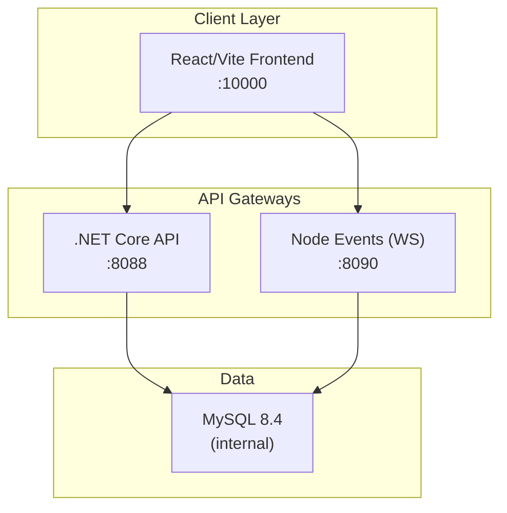
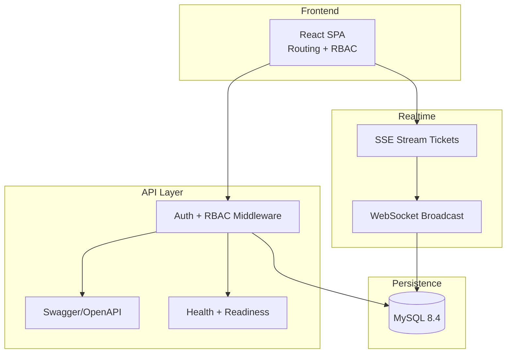
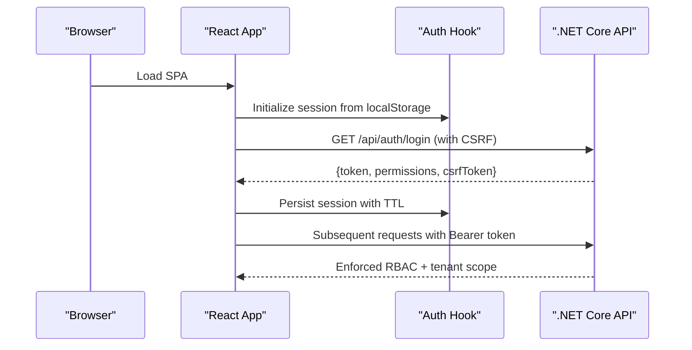
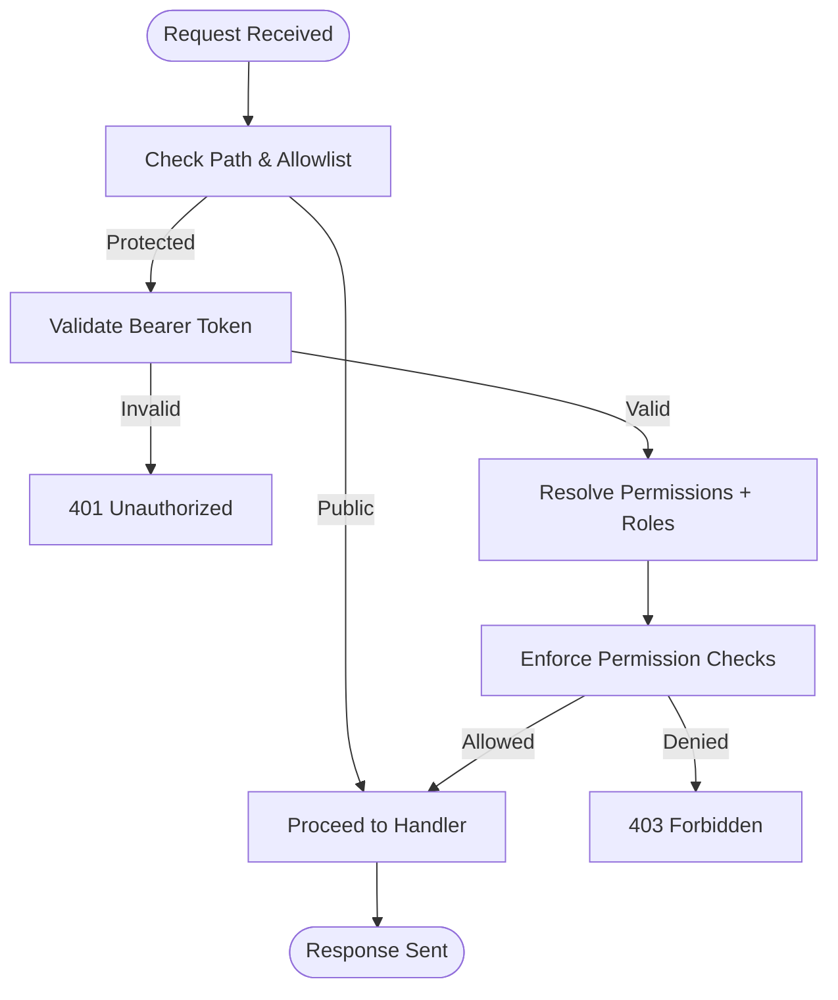
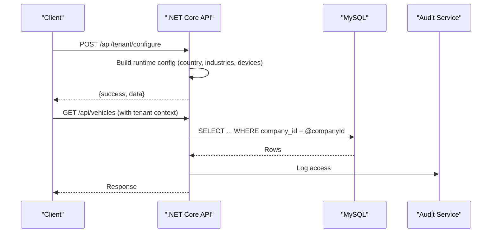
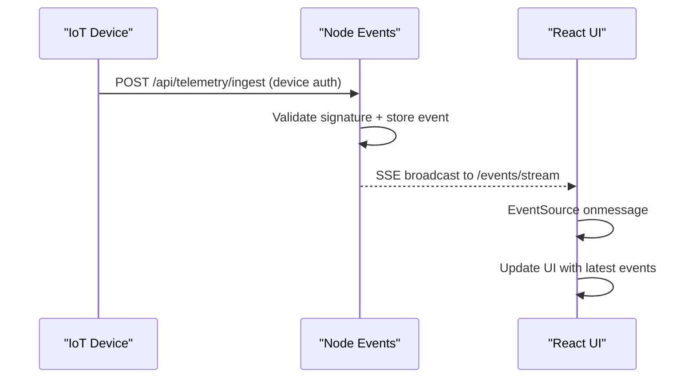
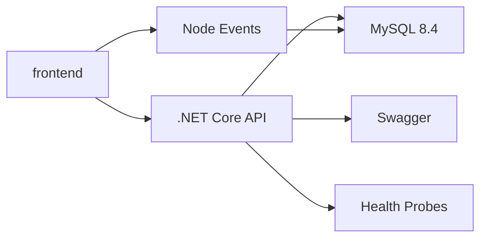

# Architecture Overview

<cite>
**Referenced Files in This Document**
- [README.md](file://README.md)
- [ARCHITECTURE.md](file://docs/ARCHITECTURE.md)
- [docker-compose.yml](file://docker-compose.yml)
- [backend/package.json](file://backend/package.json)
- [backend/src/app.ts](file://backend/src/app.ts)
- [backend/src/server.ts](file://backend/src/server.ts)
- [api-dotnet/Opstrax.Api.csproj](file://api-dotnet/Opstrax.Api.csproj)
- [backend-dotnet/Opstrax.Api.csproj](file://backend-dotnet/Opstrax.Api.csproj)
- [backend-dotnet/Program.cs](file://backend-dotnet/Program.cs)
- [frontend/src/main.tsx](file://frontend/src/main.tsx)
- [frontend/src/App.tsx](file://frontend/src/App.tsx)
- [frontend/src/auth/rbacConfig.ts](file://frontend/src/auth/rbacConfig.ts)
- [frontend/src/hooks/useAuth.tsx](file://frontend/src/hooks/useAuth.tsx)
- [frontend/src/services/authApi.ts](file://frontend/src/services/authApi.ts)
- [frontend/src/hooks/useEventStream.ts](file://frontend/src/hooks/useEventStream.ts)
- [backend/src/modules/tenant-config/tenantConfig.routes.ts](file://backend/src/modules/tenant-config/tenantConfig.routes.ts)
- [backend-dotnet/Controllers/EndpointMappings.cs](file://backend-dotnet/Controllers/EndpointMappings.cs)
</cite>

## Table of Contents
1. [Introduction](#introduction)
2. [Project Structure](#project-structure)
3. [Core Components](#core-components)
4. [Architecture Overview](#architecture-overview)
5. [Detailed Component Analysis](#detailed-component-analysis)
6. [Dependency Analysis](#dependency-analysis)
7. [Performance Considerations](#performance-considerations)
8. [Troubleshooting Guide](#troubleshooting-guide)
9. [Conclusion](#conclusion)

## Introduction
This document presents the OpsTrax architecture overview, focusing on the microservices-based design, containerized deployment, dual backend implementations, and real-time event streaming. It explains the frontend-backend separation, API-first design, and data flow patterns. It also details authentication and authorization layers, multi-tenant isolation, and security architecture, along with system boundaries, component relationships, integration patterns, technology stack choices, scalability considerations, and deployment topology.

## Project Structure
OpsTrax is organized as a multi-service solution:
- React/Vite frontend with strict routing and permission gating
- Dual backend implementations:
  - .NET Core minimal API backend exposing 200+ endpoints
  - Node.js Express backend for telemetry/event ingestion and WebSocket broadcasting
- Shared MySQL 8.4 database for multi-tenant operational data
- Docker Compose orchestration for local development and demo environments



**Diagram sources**
- [docker-compose.yml:3-44](file://docker-compose.yml#L3-L44)
- [README.md:117-142](file://README.md#L117-L142)

**Section sources**
- [README.md:1-166](file://README.md#L1-L166)
- [docker-compose.yml:1-45](file://docker-compose.yml#L1-L45)

## Core Components
- Frontend (React/Vite)
  - Centralized routing with permission-based guards
  - Authentication state persisted locally with TTL
  - Real-time event streaming via EventSource
- .NET Core API
  - Minimal API surface with 200+ endpoints
  - Tenant-aware data access and RBAC enforcement
  - Swagger/OpenAPI exposure and health endpoints
- Node Events
  - Telemetry/event ingestion and WebSocket broadcasting
  - Short-lived stream tickets for secure SSE access
- Database
  - Multi-tenant schema with auto-migrating batches
  - Pre-seeded demo data for rapid evaluation

**Section sources**
- [frontend/src/App.tsx:124-321](file://frontend/src/App.tsx#L124-L321)
- [frontend/src/main.tsx:11-18](file://frontend/src/main.tsx#L11-L18)
- [backend-dotnet/Program.cs:1-452](file://backend-dotnet/Program.cs#L1-L452)
- [backend/src/app.ts:1-97](file://backend/src/app.ts#L1-L97)
- [backend/src/server.ts:1-11](file://backend/src/server.ts#L1-L11)

## Architecture Overview
OpsTrax follows a microservices architecture with:
- API-first design: .NET Core backend exposes REST endpoints and Swagger
- Real-time streaming: Node.js service handles telemetry and event broadcasts
- Frontend-backend separation: React SPA communicates via REST and SSE
- Multi-tenant isolation: Tenant ID resolved from session/token and enforced per query
- Security: CSRF protection, rate limiting, RBAC, and device-authenticated telemetry



**Diagram sources**
- [backend-dotnet/Program.cs:92-245](file://backend-dotnet/Program.cs#L92-L245)
- [backend/src/app.ts:42-96](file://backend/src/app.ts#L42-L96)
- [frontend/src/hooks/useEventStream.ts:1-23](file://frontend/src/hooks/useEventStream.ts#L1-L23)

## Detailed Component Analysis

### Frontend-Backend Separation and API-First Design
- The frontend initializes providers for internationalization, routing, error boundary, and authentication state. It uses TanStack Query for caching and retries.
- Routing is permission-driven; protected routes enforce role and permission checks before rendering.
- API consumption is centralized via a typed client; authentication integrates with both session tokens and CSRF tokens.



**Diagram sources**
- [frontend/src/main.tsx:11-18](file://frontend/src/main.tsx#L11-L18)
- [frontend/src/hooks/useAuth.tsx:1-60](file://frontend/src/hooks/useAuth.tsx#L1-L60)
- [frontend/src/services/authApi.ts:1-58](file://frontend/src/services/authApi.ts#L1-L58)
- [backend-dotnet/Program.cs:21-22](file://backend-dotnet/Program.cs#L21-L22)

**Section sources**
- [frontend/src/App.tsx:124-321](file://frontend/src/App.tsx#L124-L321)
- [frontend/src/main.tsx:11-18](file://frontend/src/main.tsx#L11-L18)
- [frontend/src/hooks/useAuth.tsx:1-60](file://frontend/src/hooks/useAuth.tsx#L1-L60)
- [frontend/src/services/authApi.ts:1-58](file://frontend/src/services/authApi.ts#L1-L58)

### Authentication and Authorization Layers
- Session-based authentication with CSRF protection and TTL-based persistence.
- RBAC configuration defines canonical permissions and role-to-permission mappings.
- Middleware validates bearer tokens, resolves permissions, and enforces tenant isolation.



**Diagram sources**
- [backend-dotnet/Program.cs:105-245](file://backend-dotnet/Program.cs#L105-L245)
- [frontend/src/auth/rbacConfig.ts:1-404](file://frontend/src/auth/rbacConfig.ts#L1-L404)

**Section sources**
- [backend-dotnet/Program.cs:105-245](file://backend-dotnet/Program.cs#L105-L245)
- [frontend/src/auth/rbacConfig.ts:1-404](file://frontend/src/auth/rbacConfig.ts#L1-L404)

### Multi-Tenant Isolation and Data Flow
- Tenant resolution occurs via session/token claims; every query enforces company_id scoping.
- Tenant configuration runtime generation supports country, industry, and device-type enablement.
- Data flows through standardized CRUD endpoints with audit logging and background services.



**Diagram sources**
- [backend/src/modules/tenant-config/tenantConfig.routes.ts:1-58](file://backend/src/modules/tenant-config/tenantConfig.routes.ts#L1-L58)
- [backend-dotnet/Program.cs:190-242](file://backend-dotnet/Program.cs#L190-L242)

**Section sources**
- [backend/src/modules/tenant-config/tenantConfig.routes.ts:1-58](file://backend/src/modules/tenant-config/tenantConfig.routes.ts#L1-L58)
- [backend-dotnet/Program.cs:190-242](file://backend-dotnet/Program.cs#L190-L242)

### Real-Time Event Streaming and Telemetry
- Node.js service ingests telemetry via device-authenticated headers and streams events via SSE.
- Frontend consumes an EventSource endpoint to receive live updates.
- Stream tickets are short-lived and validated server-side to avoid exposing long-lived tokens.



**Diagram sources**
- [backend-dotnet/Program.cs:54-58](file://backend-dotnet/Program.cs#L54-L58)
- [frontend/src/hooks/useEventStream.ts:1-23](file://frontend/src/hooks/useEventStream.ts#L1-L23)

**Section sources**
- [backend-dotnet/Program.cs:54-58](file://backend-dotnet/Program.cs#L54-L58)
- [frontend/src/hooks/useEventStream.ts:1-23](file://frontend/src/hooks/useEventStream.ts#L1-L23)

### API Surface and Endpoint Organization
- The .NET Core backend organizes endpoints by domain modules (vehicles, drivers, dispatch, safety, maintenance, compliance, etc.) and exposes them via strongly-typed handlers.
- EndpointMappings centralizes route registration and permission enforcement.

```mermaid
classDiagram
class EndpointMappings {
+MapOpsTraxEndpoints(app)
+MapP9OpsEndpoints(app)
+MapP10SecurityEndpoints(app)
+MapFleetHealthEndpoints(app)
}
class TelemetryEndpoints {
+POST /api/telemetry/ingest
+POST /api/telemetry/stream-ticket
+GET /api/telemetry/stream
+GET /api/telemetry/positions
}
class SafetyEndpoints {
+GET /api/safety/events
+POST /api/safety/events/{id}/review
+GET /api/safety/drivers/scores
}
EndpointMappings --> TelemetryEndpoints : "maps"
EndpointMappings --> SafetyEndpoints : "maps"
```

**Diagram sources**
- [backend-dotnet/Controllers/EndpointMappings.cs:1-800](file://backend-dotnet/Controllers/EndpointMappings.cs#L1-L800)

**Section sources**
- [backend-dotnet/Controllers/EndpointMappings.cs:1-800](file://backend-dotnet/Controllers/EndpointMappings.cs#L1-L800)

## Dependency Analysis
- Frontend depends on:
  - React Router for navigation
  - TanStack Query for caching and optimistic updates
  - Local storage for session persistence
- Backend-dotnet depends on:
  - Npgsql for PostgreSQL connectivity
  - Swashbuckle for OpenAPI documentation
  - Custom services for schema migration, background tasks, and domain workflows
- Backend (Node.js) depends on:
  - Express for HTTP
  - ws for WebSocket
  - Zod for request validation



**Diagram sources**
- [backend-dotnet/Opstrax.Api.csproj:1-17](file://backend-dotnet/Opstrax.Api.csproj#L1-L17)
- [api-dotnet/Opstrax.Api.csproj:1-12](file://api-dotnet/Opstrax.Api.csproj#L1-L12)
- [backend/package.json:1-39](file://backend/package.json#L1-L39)

**Section sources**
- [backend-dotnet/Opstrax.Api.csproj:1-17](file://backend-dotnet/Opstrax.Api.csproj#L1-L17)
- [api-dotnet/Opstrax.Api.csproj:1-12](file://api-dotnet/Opstrax.Api.csproj#L1-L12)
- [backend/package.json:1-39](file://backend/package.json#L1-L39)

## Performance Considerations
- Frontend
  - TanStack Query configured with retry and disabled refetch on window focus to reduce network churn
  - Local storage session caching reduces repeated login calls
- Backend
  - Rate limiting windows applied per IP for both .NET and Node backends
  - Health endpoints (/health, /ready, /health/deep) support Kubernetes-style probes
- Real-time
  - SSE stream tickets minimize token exposure and enable controlled access
  - Event aggregation limits buffer size to recent items

[No sources needed since this section provides general guidance]

## Troubleshooting Guide
- Authentication failures
  - Verify bearer token presence and validity; ensure CSRF token is set on successful login
- Permission denials
  - Confirm role-to-permission mapping and that tenant context is correctly resolved
- Real-time streaming issues
  - Ensure SSE ticket is requested and used; confirm EventSource connection to Node events service
- Health and readiness
  - Use /health, /ready, and /health/deep endpoints to diagnose service availability and database connectivity

**Section sources**
- [backend-dotnet/Program.cs:105-294](file://backend-dotnet/Program.cs#L105-L294)
- [frontend/src/services/authApi.ts:1-58](file://frontend/src/services/authApi.ts#L1-L58)
- [frontend/src/hooks/useEventStream.ts:1-23](file://frontend/src/hooks/useEventStream.ts#L1-L23)

## Conclusion
OpsTrax employs a robust microservices architecture with a clear separation between the frontend and dual backend implementations. The API-first design, combined with strong RBAC, tenant isolation, and real-time streaming, enables scalable fleet operations. The containerized deployment simplifies local development and future production rollout. The documented security controls, health endpoints, and modular API surface provide a solid foundation for continued growth and compliance-ready operations.