# Enterprise Modules

<cite>
**Referenced Files in This Document**
- [MODULE_COVERAGE_MATRIX.md](file://docs/MODULE_COVERAGE_MATRIX.md)
- [PRODUCT_MODULES.md](file://docs/PRODUCT_MODULES.md)
- [moduleConfig.ts](file://frontend/src/modules/moduleConfig.ts)
- [CommandCenterPage.tsx](file://frontend/src/pages/CommandCenterPage.tsx)
- [DispatchPage.tsx](file://frontend/src/pages/DispatchPage.tsx)
- [modulesApi.ts](file://frontend/src/services/modulesApi.ts)
- [app.ts](file://backend/src/app.ts)
- [tenantConfig.routes.ts](file://backend/src/modules/tenant-config/tenantConfig.routes.ts)
- [compliance.routes.ts](file://backend/src/modules/compliance/compliance.routes.ts)
- [compliance.registry.ts](file://backend/src/modules/compliance/compliance.registry.ts)
- [device.routes.ts](file://backend/src/modules/devices/device.routes.ts)
- [device.registry.ts](file://backend/src/modules/devices/device.registry.ts)
- [industry.routes.ts](file://backend/src/modules/industry/industry.routes.ts)
- [industry.registry.ts](file://backend/src/modules/industry/industry.registry.ts)
</cite>

## Table of Contents
1. [Introduction](#introduction)
2. [Project Structure](#project-structure)
3. [Core Components](#core-components)
4. [Architecture Overview](#architecture-overview)
5. [Detailed Component Analysis](#detailed-component-analysis)
6. [Dependency Analysis](#dependency-analysis)
7. [Performance Considerations](#performance-considerations)
8. [Troubleshooting Guide](#troubleshooting-guide)
9. [Conclusion](#conclusion)
10. [Appendices](#appendices)

## Introduction
This document presents a comprehensive overview of the OpsTrax enterprise modules across seven major categories: Operations Management, Fleet Operations, Safety & Compliance, Maintenance Operations, Financial Operations, Customer Experience, and Analytics & Intelligence. It synthesizes repository insights into module coverage, interdependencies, configuration options, and industry-specific adaptations. The content is grounded in the repository’s module coverage matrix, product module taxonomy, frontend module configuration, backend routing, and tenant configuration APIs.

## Project Structure
The repository organizes enterprise capabilities across three primary layers:
- Frontend (TypeScript): Pages, services, hooks, and UI components implementing module surfaces and workflows.
- Backend (.NET 8 Minimal API): Express-based routers exposing module endpoints and tenant configuration services.
- Docs: Coverage matrix and product module taxonomy defining scope and maturity.

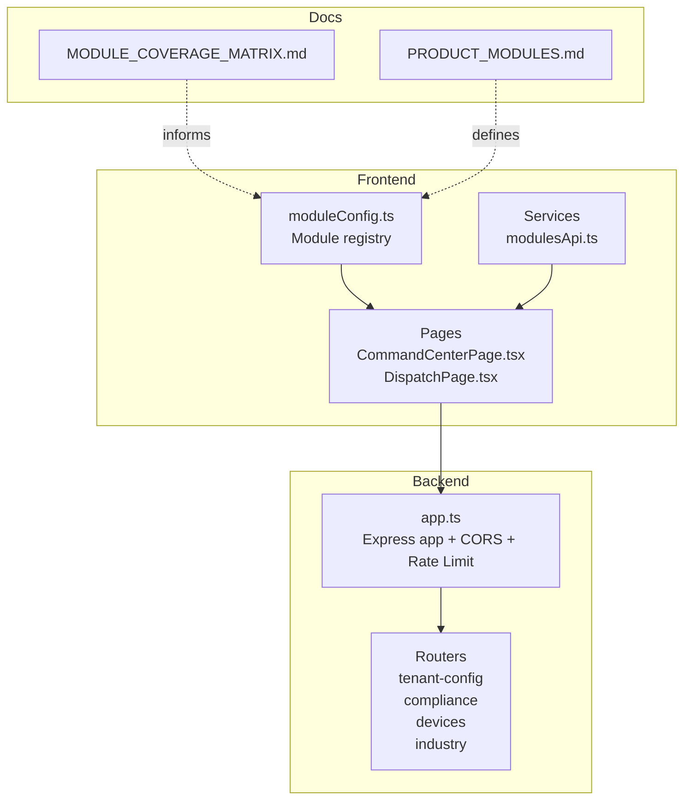

**Diagram sources**
- [moduleConfig.ts:1-215](file://frontend/src/modules/moduleConfig.ts#L1-L215)
- [CommandCenterPage.tsx:1-376](file://frontend/src/pages/CommandCenterPage.tsx#L1-L376)
- [DispatchPage.tsx:1-68](file://frontend/src/pages/DispatchPage.tsx#L1-L68)
- [modulesApi.ts:1-49](file://frontend/src/services/modulesApi.ts#L1-L49)
- [app.ts:1-97](file://backend/src/app.ts#L1-L97)
- [MODULE_COVERAGE_MATRIX.md:1-273](file://docs/MODULE_COVERAGE_MATRIX.md#L1-L273)
- [PRODUCT_MODULES.md:1-66](file://docs/PRODUCT_MODULES.md#L1-L66)

**Section sources**
- [moduleConfig.ts:1-215](file://frontend/src/modules/moduleConfig.ts#L1-L215)
- [MODULE_COVERAGE_MATRIX.md:1-273](file://docs/MODULE_COVERAGE_MATRIX.md#L1-L273)
- [PRODUCT_MODULES.md:1-66](file://docs/PRODUCT_MODULES.md#L1-L66)

## Core Components
- Module registry and navigation: The frontend module registry defines 2532 modules, grouped by functional domains and mapped to routes and permissions. It serves as the canonical source for module keys, icons, and grouping used across the UI.
- Dedicated API services: The frontend modules API consolidates module endpoints, delegating to dedicated endpoints when available and falling back to a generic module route otherwise.
- Backend app wiring: The backend app mounts tenant configuration, compliance packs, device types, industry modules, and telemetry endpoints behind a unified API surface with rate limiting and security headers.

**Section sources**
- [moduleConfig.ts:52-134](file://frontend/src/modules/moduleConfig.ts#L52-L134)
- [modulesApi.ts:12-48](file://frontend/src/services/modulesApi.ts#L12-L48)
- [app.ts:74-94](file://backend/src/app.ts#L74-L94)

## Architecture Overview
The OpsTrax enterprise architecture connects frontend pages and services to backend routers through a modular API design. Tenant configuration enables per-tenant adaptation of country, industry, and device capabilities. Compliance packs and device registries provide industry- and geography-specific adaptations. Industry module definitions enable vertical tailoring.

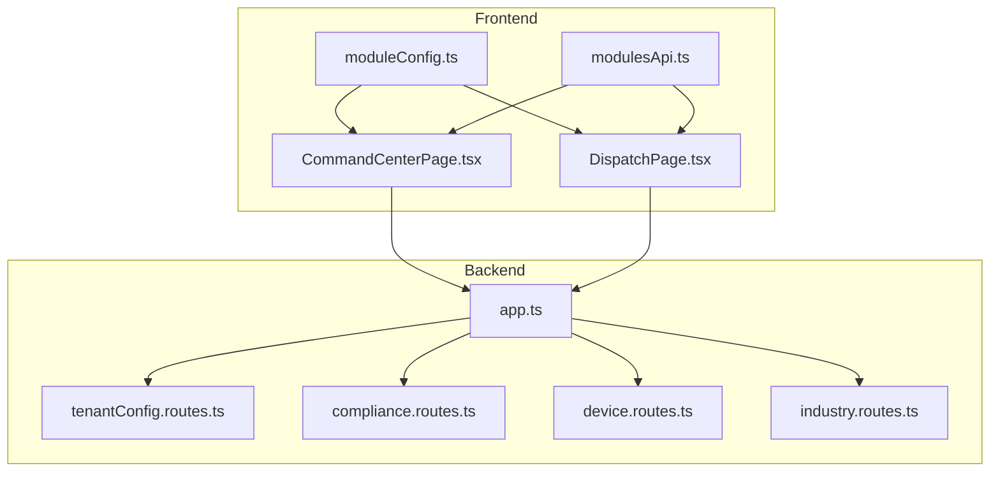

**Diagram sources**
- [CommandCenterPage.tsx:13-54](file://frontend/src/pages/CommandCenterPage.tsx#L13-L54)
- [DispatchPage.tsx:7-20](file://frontend/src/pages/DispatchPage.tsx#L7-L20)
- [modulesApi.ts:43-48](file://frontend/src/services/modulesApi.ts#L43-L48)
- [moduleConfig.ts:52-134](file://frontend/src/modules/moduleConfig.ts#L52-L134)
- [app.ts:74-94](file://backend/src/app.ts#L74-L94)
- [tenantConfig.routes.ts:38-55](file://backend/src/modules/tenant-config/tenantConfig.routes.ts#L38-L55)
- [compliance.routes.ts:6-21](file://backend/src/modules/compliance/compliance.routes.ts#L6-L21)
- [device.routes.ts:6-43](file://backend/src/modules/devices/device.routes.ts#L6-L43)
- [industry.routes.ts:6-11](file://backend/src/modules/industry/industry.routes.ts#L6-L11)

## Detailed Component Analysis

### Operations Management
- Command Center: A live operations dashboard aggregating KPIs, fleet status, exception queue, and AI insights. It integrates with the backend command center summary endpoint and drives navigation to related modules.
- Live Map / Control Tower: A real-time map view with entity selection, filters, and event streams. It consumes backend telemetry and operational events.
- Dispatch Board: A Kanban board for job assignment with match scoring, exception radar, SLA watch, and AI recommendations. It supports bulk actions and live event streaming.

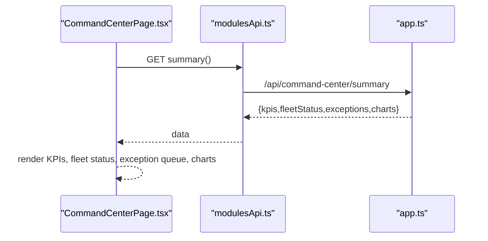

**Diagram sources**
- [CommandCenterPage.tsx:50-54](file://frontend/src/pages/CommandCenterPage.tsx#L50-L54)
- [modulesApi.ts:43-44](file://frontend/src/services/modulesApi.ts#L43-L44)
- [app.ts:74-94](file://backend/src/app.ts#L74-L94)

**Section sources**
- [CommandCenterPage.tsx:49-195](file://frontend/src/pages/CommandCenterPage.tsx#L49-L195)
- [DispatchPage.tsx:12-67](file://frontend/src/pages/DispatchPage.tsx#L12-L67)
- [MODULE_COVERAGE_MATRIX.md:201-244](file://docs/MODULE_COVERAGE_MATRIX.md#L201-L244)

### Fleet Operations
- Vehicles, Drivers, Assets: Dedicated entity pages with CRUD, summary metrics, timelines, and AI recommendations. They integrate with backend endpoints and support assignment workflows.
- Fleet Health, Utilization: Dashboards and analytics focused on risk, readiness, and productivity.

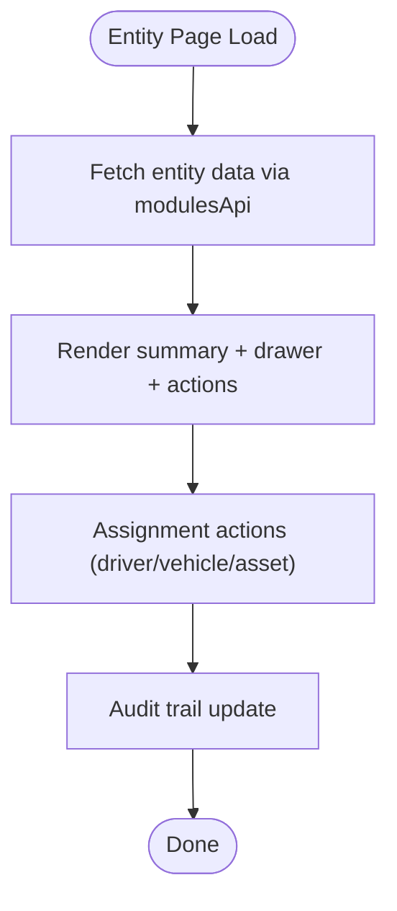

**Diagram sources**
- [modulesApi.ts:43-48](file://frontend/src/services/modulesApi.ts#L43-L48)
- [MODULE_COVERAGE_MATRIX.md:201-244](file://docs/MODULE_COVERAGE_MATRIX.md#L201-L244)

**Section sources**
- [MODULE_COVERAGE_MATRIX.md:201-244](file://docs/MODULE_COVERAGE_MATRIX.md#L201-L244)

### Safety & Compliance
- Safety Events, Driver Coaching, Compliance: Integrated workflows for event management, coaching tasks, and compliance documents. Dashcam and incident review support evidence creation and insurance reporting.
- HOS/ELD and DVIR: Structured modules supporting duty status, ELD device management, and driver vehicle inspection reports.

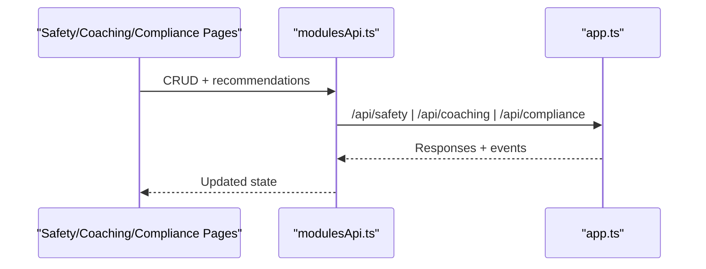

**Diagram sources**
- [modulesApi.ts:12-37](file://frontend/src/services/modulesApi.ts#L12-L37)
- [app.ts:90-94](file://backend/src/app.ts#L90-L94)

**Section sources**
- [MODULE_COVERAGE_MATRIX.md:201-244](file://docs/MODULE_COVERAGE_MATRIX.md#L201-L244)

### Maintenance Operations
- Preventive Maintenance, Work Orders: Scheduling, due/overdue tracking, labor/parts management, and status transitions. Integration with AI maintenance advisor and audit trails.

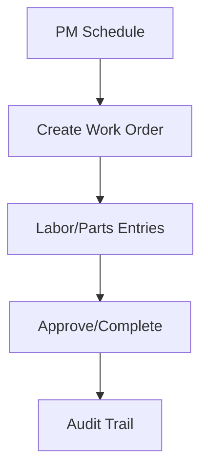

**Diagram sources**
- [MODULE_COVERAGE_MATRIX.md:201-244](file://docs/MODULE_COVERAGE_MATRIX.md#L201-L244)

**Section sources**
- [MODULE_COVERAGE_MATRIX.md:201-244](file://docs/MODULE_COVERAGE_MATRIX.md#L201-L244)

### Financial Operations
- Fuel & Idling, Expenses, Contracts/Rates, Carriers: Full CRUD, KPI dashboards, anomaly detection, and export placeholders. Includes carrier performance and contract rate management.

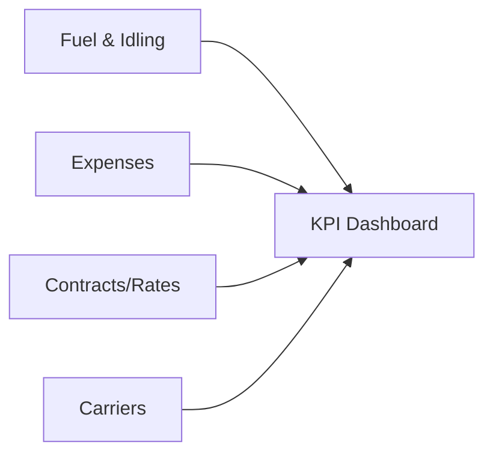

**Diagram sources**
- [MODULE_COVERAGE_MATRIX.md:201-244](file://docs/MODULE_COVERAGE_MATRIX.md#L201-L244)

**Section sources**
- [MODULE_COVERAGE_MATRIX.md:201-244](file://docs/MODULE_COVERAGE_MATRIX.md#L201-L244)

### Customer Experience
- Customer ETA Portal: Internal tracking and public ETA pages with update/send actions, feedback, and recommendations. Supports customer-facing experiences and SLA communications.

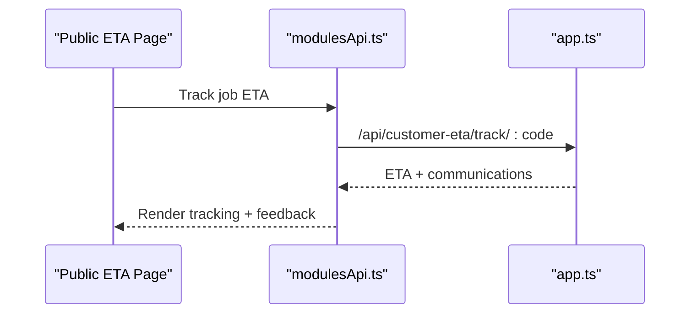

**Diagram sources**
- [modulesApi.ts:12-23](file://frontend/src/services/modulesApi.ts#L12-L23)
- [app.ts:42-52](file://backend/src/app.ts#L42-L52)

**Section sources**
- [MODULE_COVERAGE_MATRIX.md:201-244](file://docs/MODULE_COVERAGE_MATRIX.md#L201-L244)

### Analytics & Intelligence
- Reports & Analytics, SLA/KPI Center, Predictive Cost & Margin, Executive Dashboard, AI Copilot: Comprehensive analytics, KPI monitoring, predictive insights, and AI advisory panels.

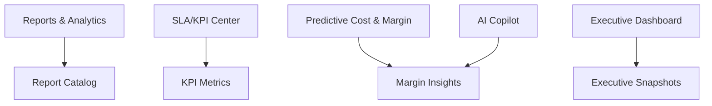

**Diagram sources**
- [MODULE_COVERAGE_MATRIX.md:201-244](file://docs/MODULE_COVERAGE_MATRIX.md#L201-L244)

**Section sources**
- [MODULE_COVERAGE_MATRIX.md:201-244](file://docs/MODULE_COVERAGE_MATRIX.md#L201-L244)

## Dependency Analysis
The module ecosystem exhibits layered dependencies:
- Frontend module registry and pages depend on dedicated API services and backend routers.
- Backend app centralizes routing and applies cross-cutting concerns like CORS, rate limiting, and security headers.
- Tenant configuration enables per-tenant adaptation of country, industry, and device capabilities.
- Compliance packs and device registries provide industry- and geography-specific adaptations.
- Industry module definitions tailor capabilities to sectors such as logistics, cold chain, school transport, construction, oil & gas, rental fleet, and delivery fleet.

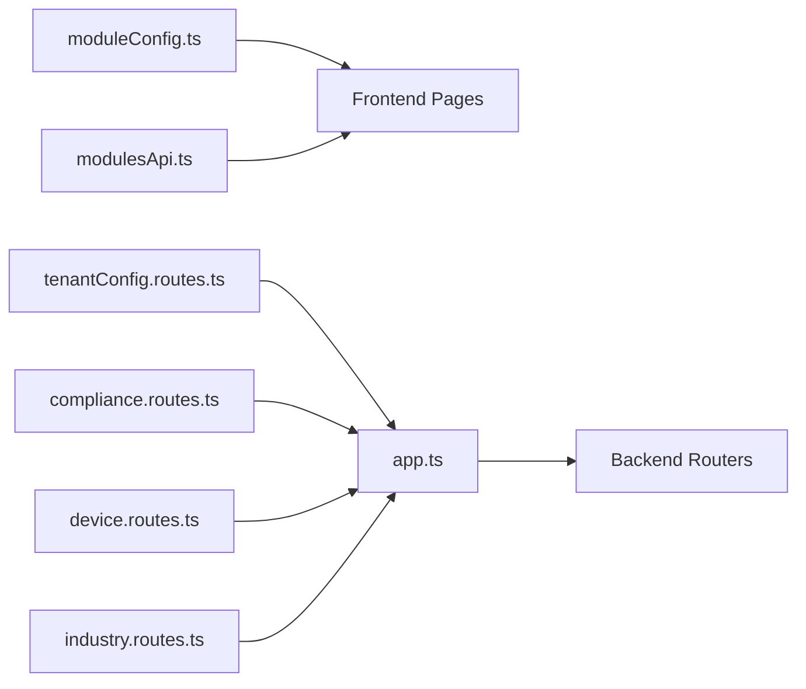

**Diagram sources**
- [moduleConfig.ts:52-134](file://frontend/src/modules/moduleConfig.ts#L52-L134)
- [modulesApi.ts:12-48](file://frontend/src/services/modulesApi.ts#L12-L48)
- [app.ts:74-94](file://backend/src/app.ts#L74-L94)
- [tenantConfig.routes.ts:38-55](file://backend/src/modules/tenant-config/tenantConfig.routes.ts#L38-L55)
- [compliance.routes.ts:6-21](file://backend/src/modules/compliance/compliance.routes.ts#L6-L21)
- [device.routes.ts:6-43](file://backend/src/modules/devices/device.routes.ts#L6-L43)
- [industry.routes.ts:6-11](file://backend/src/modules/industry/industry.routes.ts#L6-L11)

**Section sources**
- [moduleConfig.ts:52-134](file://frontend/src/modules/moduleConfig.ts#L52-L134)
- [modulesApi.ts:12-48](file://frontend/src/services/modulesApi.ts#L12-L48)
- [app.ts:74-94](file://backend/src/app.ts#L74-L94)
- [tenantConfig.routes.ts:38-55](file://backend/src/modules/tenant-config/tenantConfig.routes.ts#L38-L55)
- [compliance.routes.ts:6-21](file://backend/src/modules/compliance/compliance.routes.ts#L6-L21)
- [device.routes.ts:6-43](file://backend/src/modules/devices/device.routes.ts#L6-L43)
- [industry.routes.ts:6-11](file://backend/src/modules/industry/industry.routes.ts#L6-L11)

## Performance Considerations
- Frontend build validation indicates a large module count; code splitting and lazy loading are recommended to manage bundle size and improve initial load performance.
- Real-time feeds (Node SSE) are present for live operations and Control Tower; ensure event stream handling is optimized to avoid UI thrashing.
- Backend rate limiting is configured; ensure frontend retries and caching strategies align with limits to prevent 429 responses.

[No sources needed since this section provides general guidance]

## Troubleshooting Guide
- API health and readiness: The backend exposes health and readiness endpoints; use these to validate service status.
- Authentication exemptions: Certain endpoints are whitelisted for health, readiness, and public customer ETA tracking; verify these when diagnosing access issues.
- Rate limiting: If encountering 429 responses, review rate-limit window and max requests configuration and adjust client-side retry/backoff.

**Section sources**
- [app.ts:74-94](file://backend/src/app.ts#L74-L94)
- [app.ts:42-52](file://backend/src/app.ts#L42-L52)
- [app.ts:17-72](file://backend/src/app.ts#L17-L72)

## Conclusion
OpsTrax enterprise modules deliver a comprehensive, modular platform spanning operations, fleet, safety, maintenance, finance, customer experience, and analytics. The module coverage matrix confirms strong connectivity for Command Center, Control Tower, Dispatch, Vehicles, Drivers, Jobs, and OpsTrax AI Copilot, with ongoing enhancements across financial intelligence, compliance frameworks, and AI advisory capabilities. Tenant configuration, compliance packs, device registries, and industry module definitions enable tailored deployments across diverse markets and use cases.

[No sources needed since this section summarizes without analyzing specific files]

## Appendices

### Module Coverage Matrix (Summary)
The matrix documents current connectivity, completeness, and remaining gaps across modules, including UI routes, API services, backend endpoints, database tables, seed data, forms, drawers, search/filter, KPIs, audit logging, RBAC metadata, AI layer, reports/export, events/notifications, and known gaps.

**Section sources**
- [MODULE_COVERAGE_MATRIX.md:201-273](file://docs/MODULE_COVERAGE_MATRIX.md#L201-L273)

### Product Modules (Categories)
The product taxonomy outlines core, operations, fleet, safety & compliance, cost intelligence, AI, and platform modules, aligning with the module registry and coverage matrix.

**Section sources**
- [PRODUCT_MODULES.md:1-66](file://docs/PRODUCT_MODULES.md#L1-L66)

### Tenant Configuration Options
Tenant configuration supports primary and operating countries, industries, and enabled device types. It validates inputs and produces a runtime configuration tailored to the tenant’s geography and operational needs.

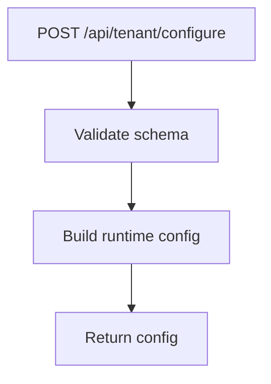

**Diagram sources**
- [tenantConfig.routes.ts:38-55](file://backend/src/modules/tenant-config/tenantConfig.routes.ts#L38-L55)

**Section sources**
- [tenantConfig.routes.ts:7-36](file://backend/src/modules/tenant-config/tenantConfig.routes.ts#L7-L36)

### Industry-Specific Adaptations
Industry module definitions enable sector-specific capabilities across logistics, cold chain, school transport, construction, oil & gas, rental fleet, and delivery fleet.

**Section sources**
- [industry.registry.ts:1-52](file://backend/src/modules/industry/industry.registry.ts#L1-L52)
- [industry.routes.ts:6-11](file://backend/src/modules/industry/industry.routes.ts#L6-L11)

### Compliance Packs and Device Types
Compliance packs provide country-specific workflows and reporting templates. Device types define telemetry capabilities for OBD/J1939, GPS trackers, dashcams, sensors, and more.

**Section sources**
- [compliance.registry.ts:3-141](file://backend/src/modules/compliance/compliance.registry.ts#L3-L141)
- [compliance.routes.ts:6-21](file://backend/src/modules/compliance/compliance.routes.ts#L6-L21)
- [device.registry.ts:3-60](file://backend/src/modules/devices/device.registry.ts#L3-L60)
- [device.routes.ts:6-43](file://backend/src/modules/devices/device.routes.ts#L6-L43)