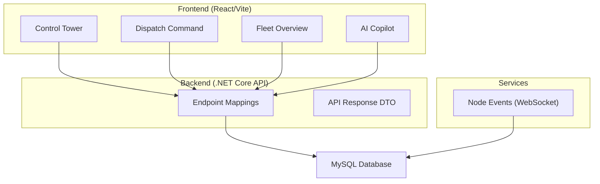
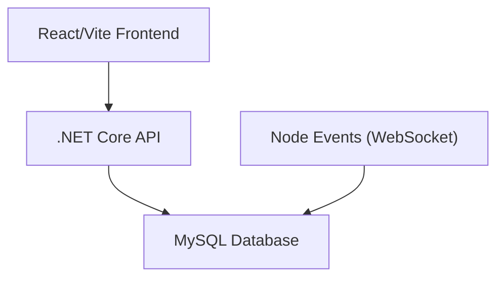
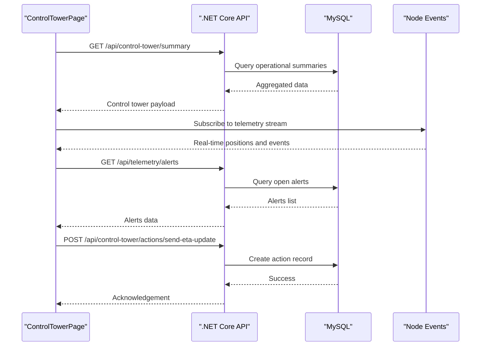
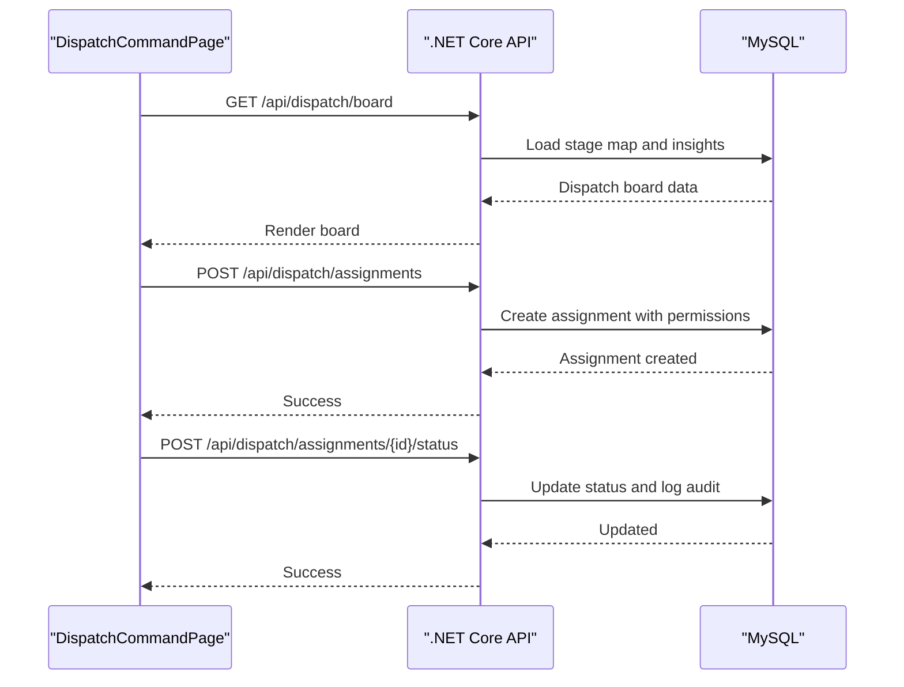
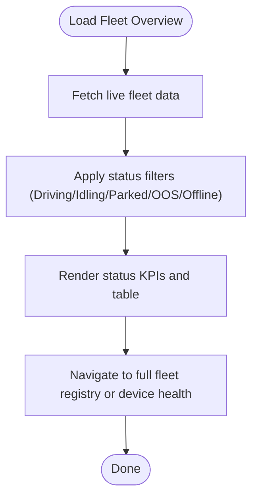
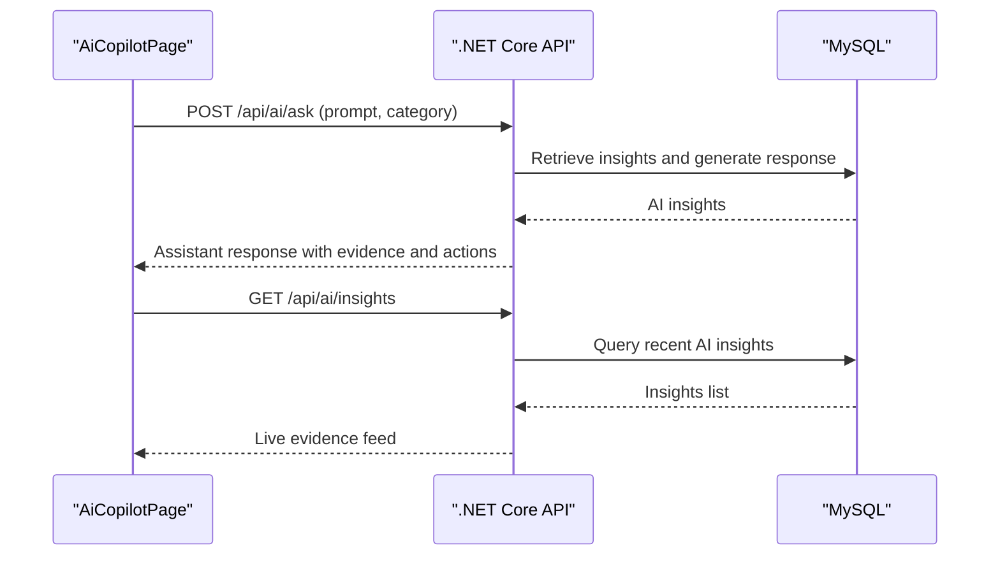
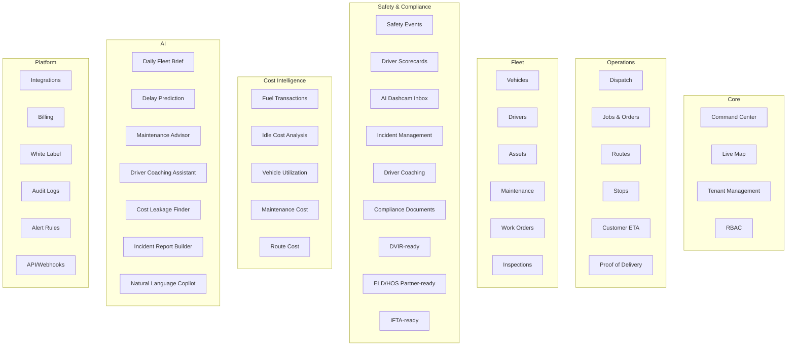
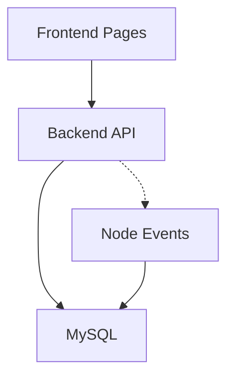

# Platform Summary

<cite>
**Referenced Files in This Document**
- [README.md](file://README.md)
- [PRODUCT_MODULES.md](file://docs/PRODUCT_MODULES.md)
- [ARCHITECTURE.md](file://docs/ARCHITECTURE.md)
- [AboutPage.tsx](file://frontend/src/pages/AboutPage.tsx)
- [ControlTowerPage.tsx](file://frontend/src/pages/ControlTowerPage.tsx)
- [DispatchCommandPage.tsx](file://frontend/src/pages/DispatchCommandPage.tsx)
- [FleetOverviewPage.tsx](file://frontend/src/pages/FleetOverviewPage.tsx)
- [AiCopilotPage.tsx](file://frontend/src/pages/AiCopilotPage.tsx)
- [commandCenterApi.ts](file://frontend/src/services/commandCenterApi.ts)
- [aboutApi.ts](file://frontend/src/services/aboutApi.ts)
- [EndpointMappings.cs](file://backend-dotnet/Controllers/EndpointMappings.cs)
- [ApiResponse.cs](file://backend-dotnet/DTOs/ApiResponse.cs)
- [tenantConfig.registry.ts](file://backend/src/modules/tenant-config/tenantConfig.registry.ts)
- [002_seed.sql](file://database/init/002_seed.sql)
</cite>

## Table of Contents
1. [Introduction](#introduction)
2. [Project Structure](#project-structure)
3. [Core Components](#core-components)
4. [Architecture Overview](#architecture-overview)
5. [Detailed Component Analysis](#detailed-component-analysis)
6. [Dependency Analysis](#dependency-analysis)
7. [Performance Considerations](#performance-considerations)
8. [Troubleshooting Guide](#troubleshooting-guide)
9. [Conclusion](#conclusion)

## Introduction
OpsTrax is an enterprise-grade, connected operations platform designed to unify fleet management across transportation, logistics, and delivery sectors. It centralizes operations through integrated modules for dispatch, driver and vehicle management, maintenance, safety and compliance, cost intelligence, and AI-powered insights. The platform positions itself as a unified operations center that connects real-time telemetry, dispatch coordination, driver workflows, safety monitoring, compliance automation, and intelligent decision support to drive measurable business outcomes.

Key business value propositions include:
- Unified command and control: A single pane of glass for live operations, alerts, and actionable intelligence
- End-to-end fleet orchestration: From dispatch to delivery, with automated workflows and exception handling
- Safety-first operations: Integrated dashcam safety, incident management, and driver coaching
- Compliance-ready foundation: HOS/ELD, DVIR, and regulatory document management aligned to regional frameworks
- Cost optimization: Fuel, idling, maintenance, and route analytics to reduce costs and improve margins
- Scalable execution: Suitable for small fleets and enterprise-scale deployments with multi-tenant architecture

Target industries:
- Transportation and long-haul fleets
- Logistics and distribution networks
- Last-mile delivery and courier services
- Cold chain and specialized transport
- Construction and heavy equipment fleets
- Oil and gas field support
- School and passenger transport

Typical use cases:
- Live fleet monitoring and control tower operations
- Dispatch board execution with eligibility gating and exception management
- Driver coaching and safety scorecard improvements
- Maintenance planning and preventive maintenance scheduling
- Compliance audits and HOS/ELD readiness
- Customer ETA portal and proof of delivery capture
- AI-driven insights for dispatch risk, cost leakage, and executive summaries

Success story examples (from the platform’s perspective):
- Reduced dispatch exceptions by aligning eligibility checks and real-time status updates
- Improved driver safety scores through targeted coaching and dashcam incident review
- Lower maintenance downtime by leveraging predictive maintenance insights and planned work order creation
- Enhanced compliance readiness with automated HOS/ELD and DVIR document workflows
- Streamlined customer communication with ETA updates and visibility portals

Scalability:
- Multi-tenant architecture supports organizations from small regional fleets to large national or global carriers
- Modular design enables industry-specific configurations (e.g., cold chain, school transport, construction)
- Real-time telemetry ingestion and event streaming scale with device counts and geographic coverage

**Section sources**
- [README.md:1-166](file://README.md#L1-L166)
- [PRODUCT_MODULES.md:1-66](file://docs/PRODUCT_MODULES.md#L1-L66)
- [ARCHITECTURE.md:3-69](file://docs/ARCHITECTURE.md#L3-L69)

## Project Structure
The platform follows a modern, containerized stack with a React/Vite frontend, ASP.NET Core 8 API, Node.js event service, and MySQL database. The frontend exposes modular pages for command center, dispatch, fleet overview, safety, maintenance, and AI copilot. The backend provides REST endpoints organized by functional domains (dispatch, vehicles, drivers, safety, maintenance, compliance, analytics, integrations).

**Diagram sources**
- [EndpointMappings.cs:19-80](file://backend-dotnet/Controllers/EndpointMappings.cs#L19-L80)
- [ApiResponse.cs:1-8](file://backend-dotnet/DTOs/ApiResponse.cs#L1-L8)
- [README.md:117-142](file://README.md#L117-L142)

**Section sources**
- [README.md:24-34](file://README.md#L24-L34)
- [README.md:117-142](file://README.md#L117-L142)

## Core Components
- Command Center and Control Tower: Live operations dashboard with telemetry, alerts, action queues, and AI insights
- Dispatch Command: Board-based assignment execution with eligibility checks, status transitions, and exception handling
- Fleet Overview: Vehicle status monitoring, HOS tracking, maintenance indicators, and device health
- Safety and Compliance: Dashcam safety inbox, incident management, driver coaching, DVIR, and HOS/ELD frameworks
- Maintenance and Work Orders: Preventive maintenance planning, work order creation, and defect tracking
- Cost Intelligence: Fuel, idling, utilization, and profitability analytics
- AI Copilot: Natural language operations assistance with insights, next steps, and direct actions
- Integrations: ERP, WMS, email, and third-party systems connectivity

**Section sources**
- [PRODUCT_MODULES.md:3-66](file://docs/PRODUCT_MODULES.md#L3-L66)
- [AboutPage.tsx:24-39](file://frontend/src/pages/AboutPage.tsx#L24-L39)

## Architecture Overview
OpsTrax is architected as a multi-service system:
- Frontend: React/Vite with TanStack Query for data fetching and real-time updates
- Backend API: ASP.NET Core minimal API with endpoint routing and tenant-aware data access
- Node Events: WebSocket-based real-time telemetry and event broadcasting
- Database: MySQL with auto-migrating schema and seed data for demonstration

**Diagram sources**
- [ARCHITECTURE.md:9-23](file://docs/ARCHITECTURE.md#L9-L23)
- [README.md:117-142](file://README.md#L117-L142)

**Section sources**
- [ARCHITECTURE.md:25-69](file://docs/ARCHITECTURE.md#L25-L69)
- [README.md:117-142](file://README.md#L117-L142)

## Detailed Component Analysis

### Command Center and Control Tower
The Control Tower provides a unified view of live operations, including:
- Live map with vehicle positions and telemetry quality
- KPIs for tracked vehicles, online devices, cameras, telemetry quality, high-risk units, and speed alerts
- Live event feed and action queue
- Telemetry alerts with acknowledgment and resolution workflows
- AI insights and needs attention panels
- Entity detail drawer with active jobs, safety/video events, maintenance watch, and replay trail

**Diagram sources**
- [ControlTowerPage.tsx:13-168](file://frontend/src/pages/ControlTowerPage.tsx#L13-L168)
- [EndpointMappings.cs:31-38](file://backend-dotnet/Controllers/EndpointMappings.cs#L31-L38)
- [EndpointMappings.cs:64-66](file://backend-dotnet/Controllers/EndpointMappings.cs#L64-L66)

**Section sources**
- [ControlTowerPage.tsx:13-168](file://frontend/src/pages/ControlTowerPage.tsx#L13-L168)
- [EndpointMappings.cs:31-38](file://backend-dotnet/Controllers/EndpointMappings.cs#L31-L38)

### Dispatch Command
The Dispatch Command module executes assignments with:
- Board-based visualization of job stages and status transitions
- Eligibility checks against driver and vehicle constraints (HOS, safety scores, defects, work orders)
- Exception management and proof of delivery capture
- Real-time availability of drivers and vehicles

**Diagram sources**
- [DispatchCommandPage.tsx:35-281](file://frontend/src/pages/DispatchCommandPage.tsx#L35-L281)
- [EndpointMappings.cs:173-195](file://backend-dotnet/Controllers/EndpointMappings.cs#L173-L195)

**Section sources**
- [DispatchCommandPage.tsx:35-281](file://frontend/src/pages/DispatchCommandPage.tsx#L35-L281)
- [EndpointMappings.cs:173-195](file://backend-dotnet/Controllers/EndpointMappings.cs#L173-L195)

### Fleet Overview
The Fleet Overview displays live vehicle states, HOS metrics, maintenance status, and device connectivity, enabling quick identification of flagged assets and operational anomalies.

**Diagram sources**
- [FleetOverviewPage.tsx:76-346](file://frontend/src/pages/FleetOverviewPage.tsx#L76-L346)

**Section sources**
- [FleetOverviewPage.tsx:76-346](file://frontend/src/pages/FleetOverviewPage.tsx#L76-L346)

### AI Copilot
The AI Copilot provides natural language assistance for operations, offering summaries, evidence cards, recommended next steps, and direct action buttons mapped to backend workflows.

**Diagram sources**
- [AiCopilotPage.tsx:134-200](file://frontend/src/pages/AiCopilotPage.tsx#L134-L200)
- [EndpointMappings.cs:251-251](file://backend-dotnet/Controllers/EndpointMappings.cs#L251-L251)

**Section sources**
- [AiCopilotPage.tsx:134-200](file://frontend/src/pages/AiCopilotPage.tsx#L134-L200)
- [EndpointMappings.cs:251-251](file://backend-dotnet/Controllers/EndpointMappings.cs#L251-L251)

### Platform Modules and Industry Alignment
The platform organizes functionality into modules grouped by domain, with industry-specific configurations and device/module mappings.

**Diagram sources**
- [PRODUCT_MODULES.md:3-66](file://docs/PRODUCT_MODULES.md#L3-L66)

Industry alignment and device/module mappings:
- Delivery fleet: delivery_dispatch, route_optimization, proof_of_delivery
- Logistics: delivery_dispatch, fuel_monitoring, route_optimization, proof_of_delivery
- Cold chain: cold_chain_monitoring, temperature_alerts
- School transport: school_transport_tracking, geofencing
- Construction: construction_equipment_tracking, fuel_monitoring, maintenance, geofencing
- Oil and gas: oil_gas_journey_management, dashcam_safety, geofencing, maintenance
- Rental fleet: rental_fleet_management, maintenance, geofencing

**Section sources**
- [PRODUCT_MODULES.md:1-66](file://docs/PRODUCT_MODULES.md#L1-L66)
- [tenantConfig.registry.ts:126-177](file://backend/src/modules/tenant-config/tenantConfig.registry.ts#L126-L177)

## Dependency Analysis
The platform exhibits clear separation of concerns:
- Frontend depends on backend REST endpoints and real-time streams
- Backend orchestrates domain-specific modules and enforces tenant isolation
- Node events service handles telemetry ingestion and broadcast
- Database stores operational records, compliance data, and AI insights

**Diagram sources**
- [README.md:117-142](file://README.md#L117-L142)
- [EndpointMappings.cs:19-80](file://backend-dotnet/Controllers/EndpointMappings.cs#L19-L80)

**Section sources**
- [README.md:117-142](file://README.md#L117-L142)
- [EndpointMappings.cs:19-80](file://backend-dotnet/Controllers/EndpointMappings.cs#L19-L80)

## Performance Considerations
- Real-time updates: Frontend queries are configured with refetch intervals and stale times to balance freshness and performance
- Telemetry streaming: WebSocket connections enable low-latency updates for live maps and alerts
- Database efficiency: Tenant-aware queries and indexed views support scalable fleet growth
- Caching opportunities: Future enhancements include Redis caching for live vehicle state and event buses for high-throughput scenarios

[No sources needed since this section provides general guidance]

## Troubleshooting Guide
Common operational checks:
- Health status: Verify API, database, and Node events connectivity from the About page
- Authentication and permissions: Ensure proper RBAC roles for dispatch, safety, maintenance, and compliance operations
- Telemetry connectivity: Confirm device provisioning, secrets rotation, and stream tickets for live data
- Alerts and exceptions: Acknowledge and resolve telemetry alerts; escalate dispatch and maintenance reviews as needed

**Section sources**
- [AboutPage.tsx:84-104](file://frontend/src/pages/AboutPage.tsx#L84-L104)
- [EndpointMappings.cs:21-29](file://backend-dotnet/Controllers/EndpointMappings.cs#L21-L29)
- [002_seed.sql:493-502](file://database/init/002_seed.sql#L493-L502)

## Conclusion
OpsTrax delivers a comprehensive, scalable solution for enterprise fleet operations by integrating dispatch, safety, compliance, maintenance, and AI-driven insights into a unified control center. Its modular architecture, multi-tenant design, and industry-aligned configurations enable organizations to optimize operations, reduce risk, and scale efficiently across diverse transportation and logistics environments.

[No sources needed since this section summarizes without analyzing specific files]